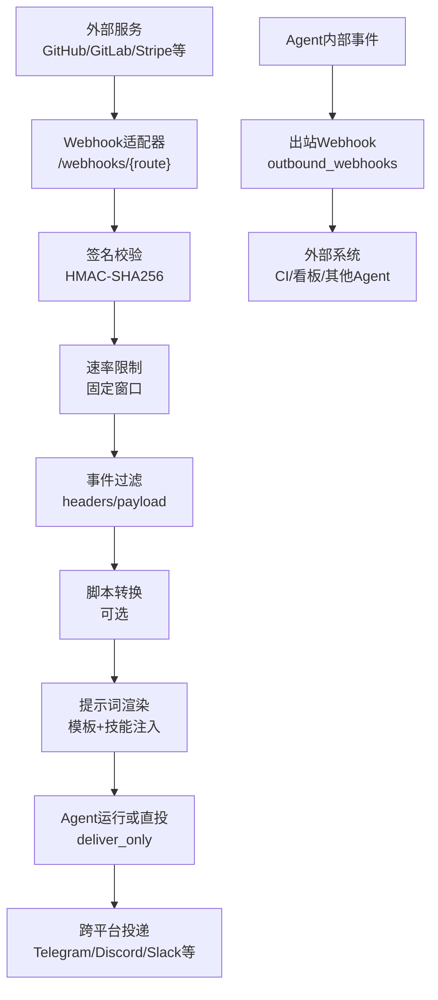
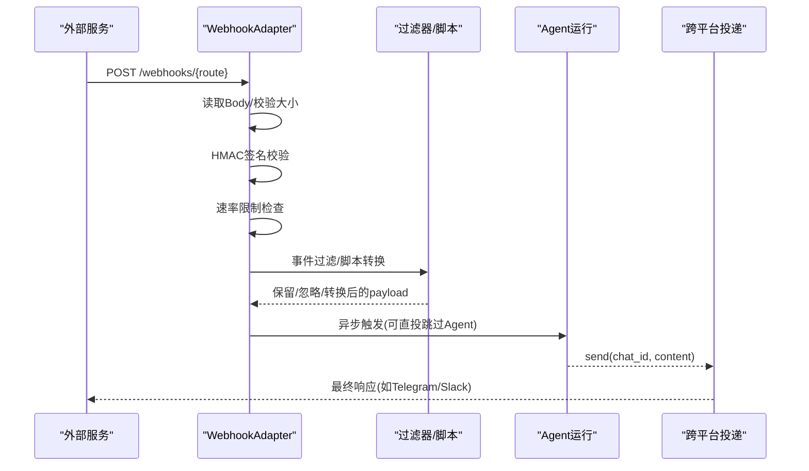
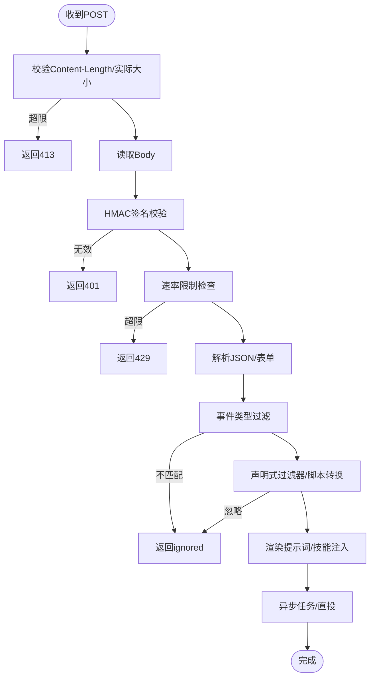
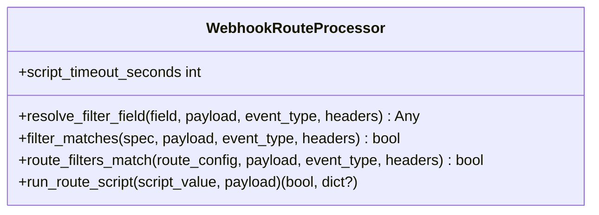
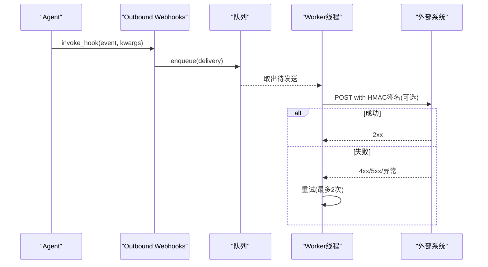
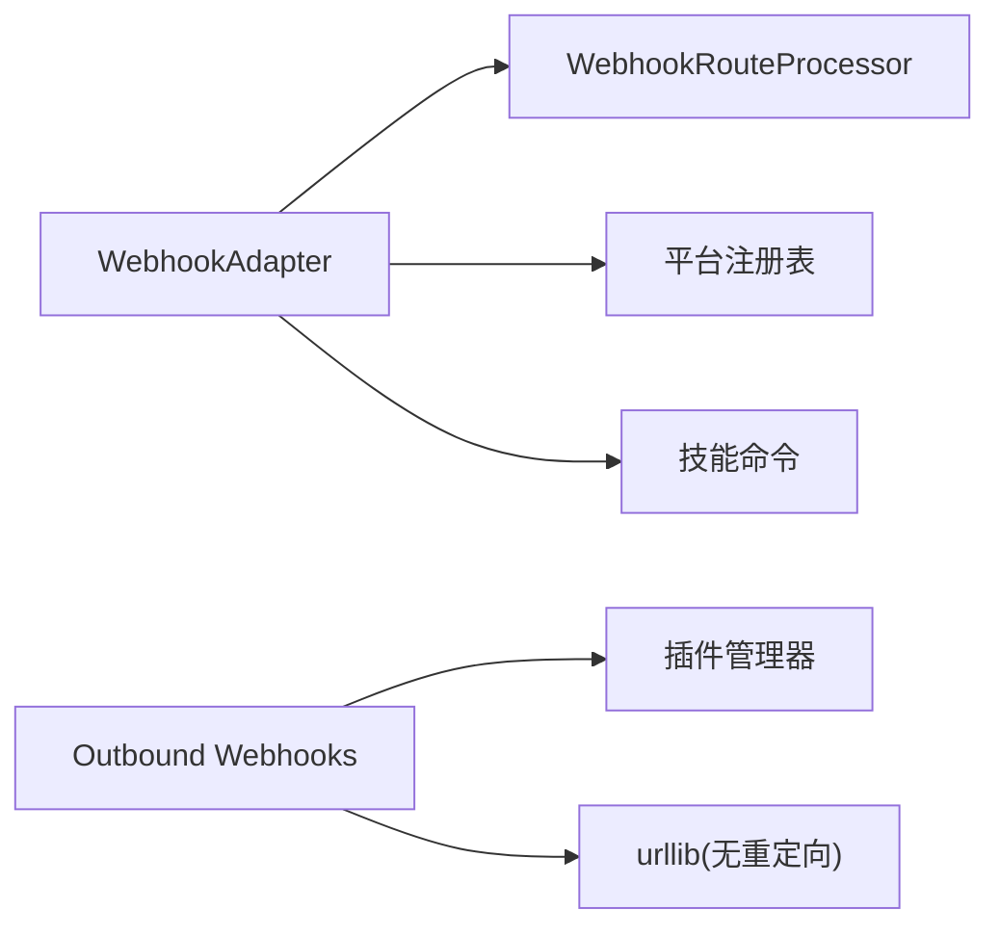

# 通用Webhook集成

<cite>
**本文引用的文件**
- [gateway/platforms/webhook.py](file://gateway/platforms/webhook.py)
- [gateway/platforms/webhook_filters.py](file://gateway/platforms/webhook_filters.py)
- [agent/outbound_webhooks.py](file://agent/outbound_webhooks.py)
- [sparkii_cli/webhook.py](file://sparkii_cli/webhook.py)
- [tests/gateway/test_webhook_signature_rate_limit.py](file://tests/gateway/test_webhook_signature_rate_limit.py)
- [tests/gateway/test_webhook_integration.py](file://tests/gateway/test_webhook_integration.py)
</cite>

## 目录
1. [简介](#简介)
2. [项目结构](#项目结构)
3. [核心组件](#核心组件)
4. [架构总览](#架构总览)
5. [详细组件分析](#详细组件分析)
6. [依赖关系分析](#依赖关系分析)
7. [性能与可靠性](#性能与可靠性)
8. [故障排查指南](#故障排查指南)
9. [结论](#结论)
10. [附录：配置示例与最佳实践](#附录配置示例与最佳实践)

## 简介
本指南面向需要在系统中接入通用HTTP Webhook的开发者，覆盖以下主题：
- 如何配置HTTP Webhook端点、URL模式与请求头
- 如何处理POST请求与JSON数据格式
- Webhook过滤器、消息转换（脚本/模板）、错误处理
- 安全配置：签名验证、IP白名单、请求限流
- 异步处理、重试机制、监控告警
- 常见问题：404、签名验证失败、超时等

该实现基于aiohttp提供的高性能异步HTTP服务器，支持多路由、HMAC签名校验、事件过滤、脚本转换、跨平台投递、幂等去重与速率限制。

## 项目结构
与Webhook相关的核心代码分布在以下模块：
- 入站Webhook适配器：接收外部服务POST并触发Agent运行或直投
- 过滤器与脚本转换：声明式过滤与外部脚本预处理
- 出站Webhook通知：Agent生命周期事件主动推送至外部系统
- CLI工具：动态订阅管理、测试与查看

图表来源
- [gateway/platforms/webhook.py:177-800](file://gateway/platforms/webhook.py#L177-L800)
- [gateway/platforms/webhook_filters.py:94-303](file://gateway/platforms/webhook_filters.py#L94-L303)
- [agent/outbound_webhooks.py:156-570](file://agent/outbound_webhooks.py#L156-L570)

章节来源
- [gateway/platforms/webhook.py:177-800](file://gateway/platforms/webhook.py#L177-L800)
- [gateway/platforms/webhook_filters.py:94-303](file://gateway/platforms/webhook_filters.py#L94-L303)
- [agent/outbound_webhooks.py:156-570](file://agent/outbound_webhooks.py#L156-L570)

## 核心组件
- WebhookAdapter：提供HTTP路由、认证、限流、过滤、转换、投递的全流程处理
- WebhookRouteProcessor：负责声明式过滤器评估与脚本执行（沙箱化路径、超时保护）
- Outbound Webhooks：将Agent内部事件以带签名的HTTP POST推送到外部系统
- CLI webhook命令：动态创建/删除/列出/测试订阅，热重载生效

章节来源
- [gateway/platforms/webhook.py:177-800](file://gateway/platforms/webhook.py#L177-L800)
- [gateway/platforms/webhook_filters.py:94-303](file://gateway/platforms/webhook_filters.py#L94-L303)
- [agent/outbound_webhooks.py:156-570](file://agent/outbound_webhooks.py#L156-L570)
- [sparkii_cli/webhook.py:140-308](file://sparkii_cli/webhook.py#L140-L308)

## 架构总览
Webhook适配器作为网关的一个平台适配器，启动一个aiohttp应用，暴露健康检查与Webhook路由。请求进入后按顺序执行：
1. 动态订阅热重载（文件变更检测）
2. 路由匹配与权限校验（含多Profile前缀）
3. 载荷大小限制（防DoS）
4. HMAC签名校验（先于限流，避免滥用配额）
5. 速率限制（固定窗口）
6. JSON/表单解析与事件类型过滤
7. 声明式过滤器与脚本转换
8. 提示词模板渲染与技能注入
9. 构建唯一投递ID并触发异步任务
10. Agent完成后通过send()进行跨平台投递或日志输出

图表来源
- [gateway/platforms/webhook.py:584-800](file://gateway/platforms/webhook.py#L584-L800)
- [gateway/platforms/webhook_filters.py:208-303](file://gateway/platforms/webhook_filters.py#L208-L303)
- [tests/gateway/test_webhook_integration.py:80-144](file://tests/gateway/test_webhook_integration.py#L80-L144)

## 详细组件分析

### Webhook适配器（入站）
- HTTP路由
  - GET /health：健康检查
  - POST /webhooks/{route_name}：主入口
  - POST /p/{profile}/webhooks/{route_name}：多Profile路由（需启用multiplex_profiles）
- 安全与防护
  - 每路由HMAC密钥必填；支持INSECURE_NO_AUTH仅用于本地回环测试
  - 支持V2签名（绑定时间戳防重放），兼容旧版V1但会记录警告
  - 载荷大小限制（默认1MB），防止超大请求
  - 速率限制：固定窗口（默认60秒内N次）
  - 幂等性：基于delivery_id的去重缓存（TTL=1小时）
- 数据处理
  - 事件类型过滤：优先从X-GitHub-Event/X-GitLab-Event或payload中的event_type/type字段获取
  - 声明式过滤器：支持exists/missing/equals/not_equals/contains/in/in_file/regex及all/any/not组合
  - 脚本转换：在受限目录下执行脚本，超时保护，输出JSON或文本，支持[SILENT]和__sparkii_ignore__
  - 提示词渲染：使用模板与payload变量；可注入技能内容
- 投递策略
  - deliver=log：仅记录日志
  - deliver=github_comment：调用gh CLI提交评论
  - 其他平台：通过gateway_runner.adapters进行跨平台投递（如telegram/discord/slack等）
  - deliver_only=true：跳过Agent，直接将POST体作为消息投递到目标平台（零LLM成本）

图表来源
- [gateway/platforms/webhook.py:584-800](file://gateway/platforms/webhook.py#L584-L800)
- [gateway/platforms/webhook_filters.py:141-226](file://gateway/platforms/webhook_filters.py#L141-L226)

章节来源
- [gateway/platforms/webhook.py:177-800](file://gateway/platforms/webhook.py#L177-L800)
- [gateway/platforms/webhook_filters.py:94-303](file://gateway/platforms/webhook_filters.py#L94-L303)
- [tests/gateway/test_webhook_integration.py:80-341](file://tests/gateway/test_webhook_integration.py#L80-L341)

### 过滤器与脚本转换
- 过滤器能力
  - 字段解析：支持payload.event.headers等上下文访问
  - 操作符：exists/missing/equals/not_equals/contains/in/in_file/regex
  - 组合逻辑：all/any/not
- 脚本执行
  - 路径限制：必须在SPARKII_HOME/scripts下或通过~/.sparkii映射
  - 超时保护：默认30秒，可配置
  - 输出处理：JSON对象或文本；[SILENT]或__sparkii_ignore__表示忽略
  - 敏感信息脱敏：stdout/stderr经过脱敏处理

图表来源
- [gateway/platforms/webhook_filters.py:94-303](file://gateway/platforms/webhook_filters.py#L94-L303)

章节来源
- [gateway/platforms/webhook_filters.py:94-303](file://gateway/platforms/webhook_filters.py#L94-L303)

### 出站Webhook通知
- 功能概述
  - 将Agent内部事件（如会话结束、工具调用前后）以HTTP POST发送到外部系统
  - 载荷包含事件名、工具名、会话ID、工作目录、额外字段、投递ID和时间戳
  - 可选HMAC-SHA256签名（X-Hermes-Signature-256）
  - 队列+单线程worker模型，保证非阻塞
  - 最多2次重试，指数退避；4xx不重试，3xx拒绝跟随
- 配置要点
  - hooks.outbound列表项包含url、events、secret_env/secret、matcher、timeout、name
  - matcher仅对pre_tool_call/post_tool_call有效
  - 支持SPARKII_SAFE_MODE跳过注册

图表来源
- [agent/outbound_webhooks.py:156-570](file://agent/outbound_webhooks.py#L156-L570)

章节来源
- [agent/outbound_webhooks.py:156-570](file://agent/outbound_webhooks.py#L156-L570)

### CLI动态订阅管理
- 命令
  - subscribe：创建/更新订阅，生成secret，输出URL与配置摘要
  - list：列出所有动态订阅
  - remove：删除指定订阅
  - test：向路由发送测试POST，自动计算签名
- 持久化
  - 文件：~/.sparkii/webhook_subscriptions.json
  - 权限：写入时原子替换并设置严格权限（0o600）
- 热重载
  - Webhook适配器每次请求检测文件mtime变化并合并静态路由

章节来源
- [sparkii_cli/webhook.py:140-308](file://sparkii_cli/webhook.py#L140-L308)
- [gateway/platforms/webhook.py:474-531](file://gateway/platforms/webhook.py#L474-L531)

## 依赖关系分析
- WebhookAdapter依赖：
  - aiohttp：HTTP服务器与路由
  - WebhookRouteProcessor：过滤器与脚本转换
  - 平台注册表：跨平台投递（如telegram/discord/slack）
  - 技能命令：注入技能内容到提示词
- Outbound Webhooks依赖：
  - 插件管理器：注册回调
  - 标准库urllib：发送HTTP请求（自定义不跟随重定向处理器）
  - 环境变量：secret_env读取密钥

图表来源
- [gateway/platforms/webhook.py:56-67](file://gateway/platforms/webhook.py#L56-L67)
- [agent/outbound_webhooks.py:182-207](file://agent/outbound_webhooks.py#L182-L207)

章节来源
- [gateway/platforms/webhook.py:56-67](file://gateway/platforms/webhook.py#L56-L67)
- [agent/outbound_webhooks.py:182-207](file://agent/outbound_webhooks.py#L182-L207)

## 性能与可靠性
- 性能特性
  - 异步I/O：aiohttp事件循环，高并发吞吐
  - 脚本执行隔离：子进程执行，超时保护，避免阻塞事件循环
  - 内存控制：delivery_info与seen_deliveries定期清理，防止无限增长
  - 速率限制：固定窗口计数，减少突发流量影响
- 可靠性保障
  - 幂等去重：基于delivery_id的TTL缓存，避免重复处理
  - 安全加固：HMAC签名、载荷大小限制、INSECURE_NO_AUTH仅限回环
  - 健壮投递：出站Webhook最多2次重试，4xx不重试，3xx拒绝跟随
  - 健康检查：/health接口便于探针探测

章节来源
- [gateway/platforms/webhook.py:220-242](file://gateway/platforms/webhook.py#L220-L242)
- [gateway/platforms/webhook.py:404-461](file://gateway/platforms/webhook.py#L404-L461)
- [agent/outbound_webhooks.py:520-570](file://agent/outbound_webhooks.py#L520-L570)

## 故障排查指南
- 404错误
  - 原因：路由不存在或profile不匹配
  - 排查：确认route_name正确；若使用/p/<profile>/，确保启用了multiplex_profiles且profile已配置
  - 参考：未知路由返回404；未知profile返回404
- 401签名验证失败
  - 原因：缺少或错误的HMAC签名；使用了INSECURE_NO_AUTH但绑定了非回环地址
  - 排查：确认每个路由设置了secret；客户端正确计算X-Hub-Signature-256或X-Webhook-Signature-V2
  - 参考：签名校验在读取Body后立即执行，失败返回401
- 413载荷过大
  - 原因：Content-Length或实际Body超过max_body_bytes
  - 排查：调整max_body_bytes或减小请求体
- 429速率限制
  - 原因：同一路由在窗口内超过rate_limit
  - 排查：降低频率或提高rate_limit；注意无效签名不会消耗配额（修复了历史bug）
- 脚本执行失败或超时
  - 原因：脚本路径不在允许目录、脚本返回非0、执行超时
  - 排查：检查scripts目录权限与路径；增加script_timeout_seconds；查看stderr（已脱敏）
- 出站Webhook失败
  - 原因：网络错误、目标返回4xx/5xx、重定向
  - 排查：确认URL为https；检查目标日志；注意4xx不重试，3xx不跟随

章节来源
- [gateway/platforms/webhook.py:599-681](file://gateway/platforms/webhook.py#L599-L681)
- [gateway/platforms/webhook_filters.py:228-303](file://gateway/platforms/webhook_filters.py#L228-L303)
- [tests/gateway/test_webhook_signature_rate_limit.py:59-143](file://tests/gateway/test_webhook_signature_rate_limit.py#L59-L143)
- [agent/outbound_webhooks.py:520-570](file://agent/outbound_webhooks.py#L520-L570)

## 结论
本实现提供了企业级的通用Webhook集成能力：
- 安全：强制HMAC签名、载荷大小限制、INSECURE_NO_AUTH限制、速率限制与幂等去重
- 灵活：声明式过滤器、脚本转换、模板渲染、技能注入、多Profile路由
- 可靠：异步处理、超时保护、重试机制、健康检查与监控友好
- 易用：CLI动态管理、热重载、测试命令

建议在生产环境：
- 始终配置每路由secret，避免INSECURE_NO_AUTH
- 合理设置rate_limit与max_body_bytes
- 使用filters与script进行精细化控制
- 结合monitoring与alerting观察健康与错误率

## 附录：配置示例与最佳实践

- URL模式
  - 基础：POST http://host:port/webhooks/{route_name}
  - 多Profile：POST http://host:port/p/{profile}/webhooks/{route_name}
- 请求头
  - Content-Type: application/json
  - X-GitHub-Event 或 X-GitLab-Event：事件类型
  - X-Hub-Signature-256 或 X-Webhook-Signature-V2：HMAC签名
  - X-GitHub-Delivery 或 svix-id 或 X-Request-ID：投递ID（用于幂等）
- 响应格式
  - 接受：{"status":"accepted","route":"...","event":"...","delivery_id":"..."}
  - 忽略：{"status":"ignored",...}
  - 错误：{"error":"..."} 并附带状态码（400/401/403/413/429）
- 安全最佳实践
  - 为每个路由设置独立secret；全局secret可作为默认值
  - INSECURE_NO_AUTH仅用于本地回环测试
  - 使用HTTPS代理或反向代理保护端口
  - 合理配置rate_limit与max_body_bytes
- 异步与重试
  - 入站：立即返回202，后台异步处理
  - 出站：最多2次重试，指数退避；4xx不重试，3xx拒绝跟随
- 监控与告警
  - 健康检查：GET /health
  - 指标：关注401/413/429比例、脚本超时次数、出站失败率
  - 日志：关注“Invalid signature”“Payload too large”“Rate limit exceeded”等关键字

章节来源
- [gateway/platforms/webhook.py:286-344](file://gateway/platforms/webhook.py#L286-L344)
- [gateway/platforms/webhook.py:584-800](file://gateway/platforms/webhook.py#L584-L800)
- [agent/outbound_webhooks.py:434-570](file://agent/outbound_webhooks.py#L434-L570)
- [sparkii_cli/webhook.py:267-308](file://sparkii_cli/webhook.py#L267-L308)