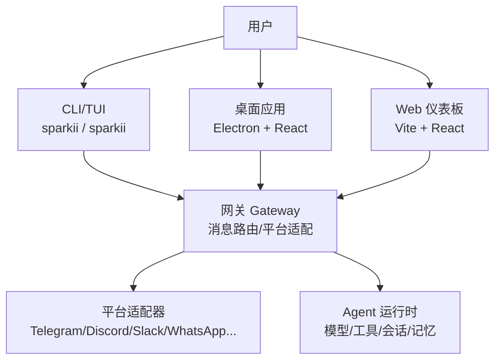
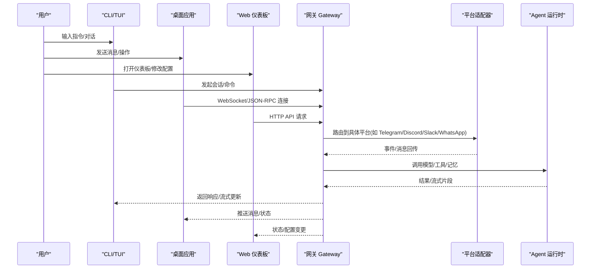
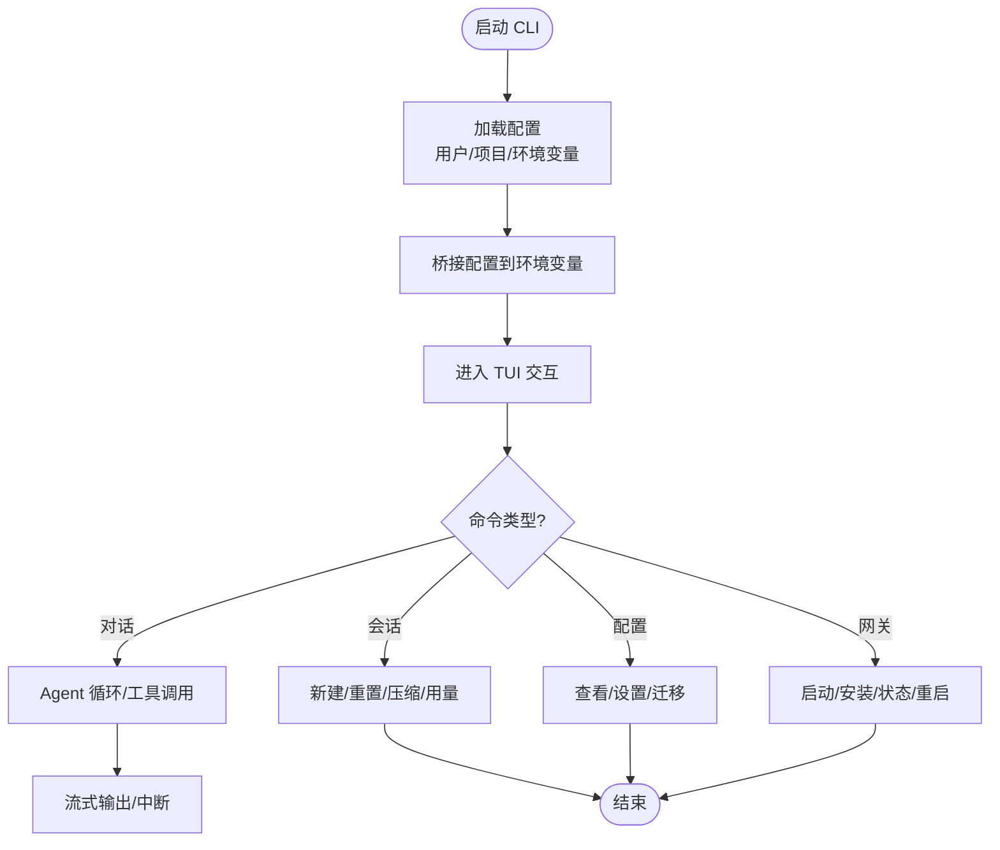
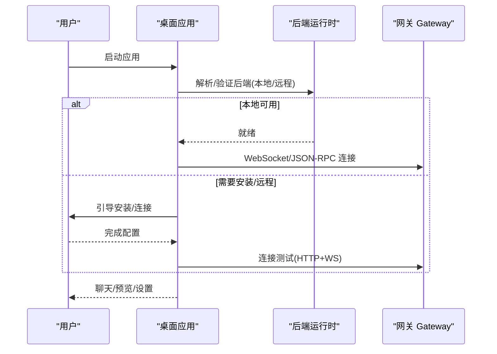
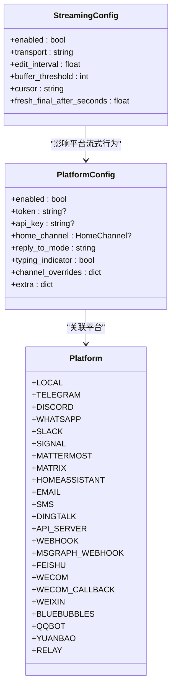
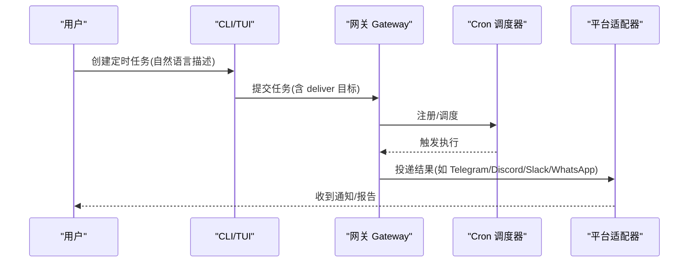
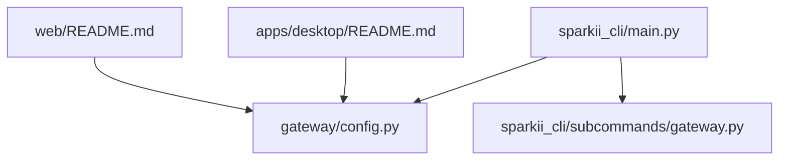

# 用户指南

<cite>
**本文引用的文件**
- [README.md](file://README.md)
- [cli.py](file://cli.py)
- [sparkii_bootstrap.py](file://sparkii_bootstrap.py)
- [gateway/config.py](file://gateway/config.py)
- [apps/desktop/README.md](file://apps/desktop/README.md)
- [web/README.md](file://web/README.md)
- [sparkii_cli/main.py](file://sparkii_cli/main.py)
- [sparkii_cli/subcommands/gateway.py](file://sparkii_cli/subcommands/gateway.py)
- [gateway/platforms/ADDING_A_PLATFORM.md](file://gateway/platforms/ADDING_A_PLATFORM.md)
</cite>

## 目录
1. [简介](#简介)
2. [项目结构](#项目结构)
3. [核心组件](#核心组件)
4. [架构总览](#架构总览)
5. [详细组件分析](#详细组件分析)
6. [依赖关系分析](#依赖关系分析)
7. [性能注意事项](#性能注意事项)
8. [故障排除指南](#故障排除指南)
9. [结论](#结论)
10. [附录](#附录)

## 简介
本指南面向首次使用者与进阶用户，覆盖以下方面：
- CLI 终端界面使用方法（命令、快捷键、会话管理、配置）
- 桌面应用安装、配置与基本功能
- Web 仪表板功能与操作
- 消息平台集成（Telegram、Discord、Slack、WhatsApp 等）的网关启动、平台配置与权限设置
- 常用工作流（日常对话、批量任务、自动化工作流）
- 故障排除与常见问题

## 项目结构
本项目提供多入口使用方式：
- CLI/TUI：通过命令行进入交互式终端界面，支持多模型切换、工具集选择、会话历史、流式输出等。
- 网关（Gateway）：统一的消息网关进程，承载 Telegram、Discord、Slack、WhatsApp 等平台接入，并对外暴露服务。
- 桌面应用（Desktop）：基于 Electron + React 的原生桌面端，连接后端网关进行聊天、预览、语音与设置管理。
- Web 仪表板（Web）：浏览器端用于查看状态、编辑配置、管理密钥与会话监控。

图表来源
- [README.md:143-159](file://README.md#L143-L159)
- [apps/desktop/README.md:90-122](file://apps/desktop/README.md#L90-L122)
- [web/README.md:1-28](file://web/README.md#L1-L28)
- [gateway/config.py:272-394](file://gateway/config.py#L272-L394)

章节来源
- [README.md:35-118](file://README.md#L35-L118)
- [apps/desktop/README.md:23-122](file://apps/desktop/README.md#L23-L122)
- [web/README.md:1-28](file://web/README.md#L1-L28)
- [gateway/config.py:272-394](file://gateway/config.py#L272-L394)

## 核心组件
- CLI/TUI：提供交互式对话、命令补全、会话控制、模型/工具集切换、流式输出显示等。
- 网关 Gateway：集中管理消息平台接入、会话生命周期、投递策略、流式传输、平台能力与权限。
- 桌面应用：本地或远程连接网关，提供聊天、文件浏览、侧边预览、语音与设置向导。
- Web 仪表板：前端页面通过 API 代理访问后端，用于配置编辑、密钥管理与会话监控。

章节来源
- [cli.py:1-13](file://cli.py#L1-L13)
- [gateway/config.py:1-9](file://gateway/config.py#L1-L9)
- [apps/desktop/README.md:10-19](file://apps/desktop/README.md#L10-L19)
- [web/README.md:1-10](file://web/README.md#L1-L10)

## 架构总览
下图展示了从用户到平台适配器的整体交互路径，以及各组件之间的职责边界。

图表来源
- [README.md:143-159](file://README.md#L143-L159)
- [apps/desktop/README.md:90-122](file://apps/desktop/README.md#L90-L122)
- [web/README.md:14-28](file://web/README.md#L14-L28)
- [gateway/config.py:272-394](file://gateway/config.py#L272-L394)

## 详细组件分析

### CLI 终端界面使用指南
- 启动与基础命令
  - 交互式对话：运行主命令进入 TUI，支持多行编辑、斜杠命令自动补全、会话历史、中断重定向与流式工具输出。
  - 常用命令：选择模型、启用/配置工具、查看/设置配置项、启动网关、运行完整设置向导、迁移旧配置、更新与诊断。
- 快捷键与交互
  - 中断当前工作：Ctrl+C 或在消息平台中发送新消息；在 CLI 中也可通过命令停止。
  - 会话管理：新建/重置会话、压缩上下文、查看用量与洞察、切换人格/模型。
- 配置与环境
  - 配置文件加载顺序：用户配置优先于项目配置，环境变量可覆盖配置值；支持忽略用户配置以仅使用内置默认与项目配置。
  - 终端环境映射：将 CLI/TUI 配置桥接为环境变量，供工具执行时使用；支持多种后端（本地、Docker、SSH、Singularity、Modal、Daytona、Vercel Sandbox）。
- 安全与隐私
  - 支持敏感信息脱敏开关；会话搜索索引可调优参数。

图表来源
- [cli.py:409-790](file://cli.py#L409-L790)
- [README.md:105-118](file://README.md#L105-L118)

章节来源
- [README.md:105-118](file://README.md#L105-L118)
- [cli.py:409-790](file://cli.py#L409-L790)

### 桌面应用安装与使用
- 安装方式
  - 推荐通过 CLI 一键安装并启动桌面端；也提供预构建安装包。
- 基本功能
  - 聊天（流式响应、工具活动、结构化摘要）、侧边预览（网页/文件/工具输出）、文件浏览器、语音、设置与首次引导。
- 连接模式
  - 本地后端：自动发现并验证可用后端，必要时引导安装运行时。
  - 远程网关：保存加密连接信息，后续启动直连；远程模式下执行边界在网关主机。
- 更新与维护
  - 后台检查更新并提供一键更新；可通过 CLI 更新。
- 开发模式
  - 使用 Vite + Electron 开发服务器；支持沙箱与隔离运行。

图表来源
- [apps/desktop/README.md:23-47](file://apps/desktop/README.md#L23-L47)
- [apps/desktop/README.md:90-122](file://apps/desktop/README.md#L90-L122)

章节来源
- [apps/desktop/README.md:23-47](file://apps/desktop/README.md#L23-L47)
- [apps/desktop/README.md:90-122](file://apps/desktop/README.md#L90-L122)

### Web 仪表板功能与操作
- 技术栈与开发
  - Vite + React 19 + TypeScript；Tailwind CSS v4 自定义暗色主题；shadcn/ui 风格组件。
  - 开发时启动后端 API 服务，再启动 Vite 开发服务器；API 请求通过代理转发至后端。
- 构建与部署
  - 构建产物输出到指定目录，由 FastAPI 作为静态 SPA 提供服务。
- 页面结构
  - 状态页（Agent 状态、活跃/最近会话）、配置页（动态配置编辑器，读取后端 schema）、环境页（API 密钥管理，支持保存/清除）。
- 设计规则
  - 文本最小字号、透明度下限、品牌大写规范、字体层级、颜色语义化等，确保可读性与一致性。

图表来源
- [web/README.md:14-28](file://web/README.md#L14-L28)
- [web/README.md:30-36](file://web/README.md#L30-L36)
- [web/README.md:38-53](file://web/README.md#L38-L53)

章节来源
- [web/README.md:1-10](file://web/README.md#L1-L10)
- [web/README.md:14-28](file://web/README.md#L14-L28)
- [web/README.md:30-36](file://web/README.md#L30-L36)
- [web/README.md:38-53](file://web/README.md#L38-L53)

### 消息平台集成（Telegram、Discord、Slack、WhatsApp 等）
- 支持的内置平台
  - 包括 Telegram、Discord、WhatsApp、Slack、Signal、Mattermost、Matrix、Home Assistant、Email、SMS、DingTalk、API Server、Webhook、MS Graph Webhook、飞书、企业微信、蓝泡泡、QQ Bot、元宝、Relay 等。
- 端口绑定与条件模式
  - 部分平台会绑定 TCP 端口（如 webhook、api_server、msgraph_webhook、feishu、wecom_callback、bluebubbles、sms、whatsapp_cloud、line），在多 Profile 复用监听时需避免冲突；某些平台仅在特定模式下绑定端口（如飞书的 webhook 模式）。
- 平台配置与凭据
  - 平台配置包含启用标志、令牌/API Key、主页频道、回复线程模式、打字指示器、通道级覆盖等；部分平台通过环境变量注入凭据。
- 新增平台扩展点
  - 插件路径（推荐）：在插件目录创建 adapter 与 plugin.yaml，零侵入核心代码即可扩展；支持钩子函数处理环境注入、YAML 转换、Cron 投递、独立发送器等。
  - 内置路径（核心贡献者）：需实现适配器、枚举、工厂、授权映射、会话源、系统提示、工具集、Cron 投递、发送消息工具、渠道目录、状态显示、设置向导、日志脱敏、文档与测试等。

图表来源
- [gateway/config.py:272-394](file://gateway/config.py#L272-L394)
- [gateway/config.py:593-707](file://gateway/config.py#L593-L707)
- [gateway/config.py:720-800](file://gateway/config.py#L720-L800)

章节来源
- [gateway/config.py:272-394](file://gateway/config.py#L272-L394)
- [gateway/config.py:593-707](file://gateway/config.py#L593-L707)
- [gateway/config.py:720-800](file://gateway/config.py#L720-L800)
- [gateway/platforms/ADDING_A_PLATFORM.md:5-74](file://gateway/platforms/ADDING_A_PLATFORM.md#L5-L74)
- [gateway/platforms/ADDING_A_PLATFORM.md:78-145](file://gateway/platforms/ADDING_A_PLATFORM.md#L78-L145)

### 常用工作流
- 日常对话
  - 通过 CLI/TUI 或桌面应用直接对话；支持流式输出、工具调用、中断与重定向。
- 批量任务执行
  - 使用 CLI 的一次性执行模式或脚本调用工具集；结合终端后端（Docker/Singularity/Modal/Daytona/Vercel Sandbox）隔离执行。
- 自动化工作流（Cron）
  - 通过网关调度器定时执行任务，并将结果投递到任意平台；支持“deliver=平台”路由与独立发送器。

图表来源
- [gateway/platforms/ADDING_A_PLATFORM.md:32-39](file://gateway/platforms/ADDING_A_PLATFORM.md#L32-L39)
- [gateway/config.py:485-540](file://gateway/config.py#L485-L540)

章节来源
- [README.md:143-159](file://README.md#L143-L159)
- [gateway/platforms/ADDING_A_PLATFORM.md:32-39](file://gateway/platforms/ADDING_A_PLATFORM.md#L32-L39)
- [gateway/config.py:485-540](file://gateway/config.py#L485-L540)

## 依赖关系分析
- 入口与启动
  - CLI 主入口负责命令解析、一次性执行清理、早期恢复与快速启动路径。
  - 网关子命令提供前台运行、服务启停、安装与状态查询等功能。
- 平台与配置
  - 平台枚举与配置集中在网关配置模块，统一管理平台能力、端口绑定、流式传输与通道覆盖。
- 桌面与 Web
  - 桌面应用通过解析/验证后端并连接网关；Web 仪表板通过 API 代理访问后端，提供配置与监控。

图表来源
- [sparkii_cli/main.py:1-44](file://sparkii_cli/main.py#L1-L44)
- [sparkii_cli/subcommands/gateway.py:32-200](file://sparkii_cli/subcommands/gateway.py#L32-L200)
- [gateway/config.py:272-394](file://gateway/config.py#L272-L394)
- [apps/desktop/README.md:90-122](file://apps/desktop/README.md#L90-L122)
- [web/README.md:14-28](file://web/README.md#L14-L28)

章节来源
- [sparkii_cli/main.py:1-44](file://sparkii_cli/main.py#L1-L44)
- [sparkii_cli/subcommands/gateway.py:32-200](file://sparkii_cli/subcommands/gateway.py#L32-L200)
- [gateway/config.py:272-394](file://gateway/config.py#L272-L394)
- [apps/desktop/README.md:90-122](file://apps/desktop/README.md#L90-L122)
- [web/README.md:14-28](file://web/README.md#L14-L28)

## 性能注意事项
- 流式传输优化
  - 网关支持按平台选择流式传输模式（原生草稿/编辑/关闭），调整编辑间隔与缓冲阈值以提升用户体验。
- 会话重置策略
  - 可按日/空闲/两者/从不自动重置会话，避免长时间占用导致资源浪费。
- 终端后端与隔离
  - 根据任务需求选择合适的终端后端（本地/容器/云端），利用隔离环境提升稳定性与安全性。
- 资源限制
  - 代码执行超时、最大工具调用次数、会话上下文压缩阈值等均可调优。

章节来源
- [gateway/config.py:720-800](file://gateway/config.py#L720-L800)
- [gateway/config.py:485-540](file://gateway/config.py#L485-L540)
- [cli.py:409-790](file://cli.py#L409-L790)

## 故障排除指南
- Windows UTF-8 与平台版本探测
  - 入口模块在 Windows 上启用 UTF-8 模式并修复控制台编码问题；同时屏蔽 platform._syscmd_ver 以避免子进程闪烁与解码崩溃。
- 安装与更新
  - 若被杀毒软件误报 uv.exe，可验证签名并添加白名单；使用 CLI 更新到最新版本。
- 桌面应用启动失败
  - 检查日志位置；必要时清理引导标记或重建 Python 虚拟环境；macOS 麦克风权限问题可重置权限。
- 网关服务异常
  - 使用 gateway status 查看状态；必要时强制替换实例或重启服务；注意多 Profile 下端口绑定冲突。

章节来源
- [sparkii_bootstrap.py:1-48](file://sparkii_bootstrap.py#L1-L48)
- [sparkii_bootstrap.py:125-165](file://sparkii_bootstrap.py#L125-L165)
- [README.md:68-101](file://README.md#L68-L101)
- [apps/desktop/README.md:176-200](file://apps/desktop/README.md#L176-L200)
- [sparkii_cli/subcommands/gateway.py:146-160](file://sparkii_cli/subcommands/gateway.py#L146-L160)

## 结论
本指南提供了从 CLI/TUI、桌面应用到 Web 仪表板的全面使用说明，涵盖消息平台集成、常用工作流与故障排除。建议新手先通过 CLI 快速上手，再逐步探索网关与平台配置；进阶用户可深入定制平台适配器、优化流式传输与自动化工作流。

## 附录
- 快速参考
  - CLI vs 消息平台命令对照：参见 README 中的对比表。
  - 文档中心：官方文档站点提供完整的使用指南、配置参考与环境变量说明。

章节来源
- [README.md:143-159](file://README.md#L143-L159)
- [README.md:163-183](file://README.md#L163-L183)