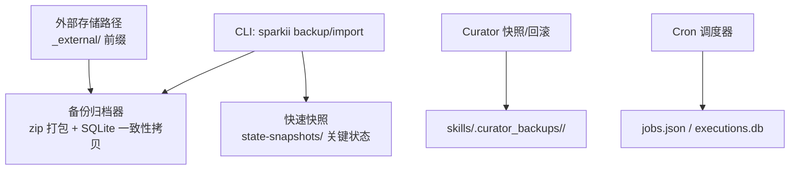
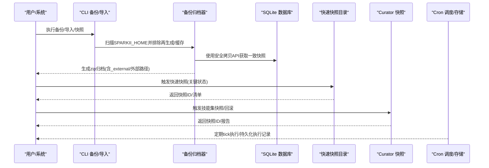
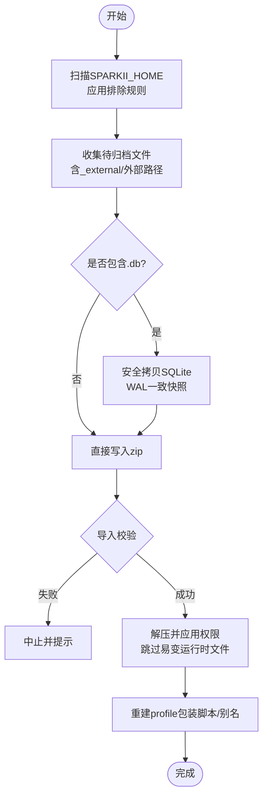
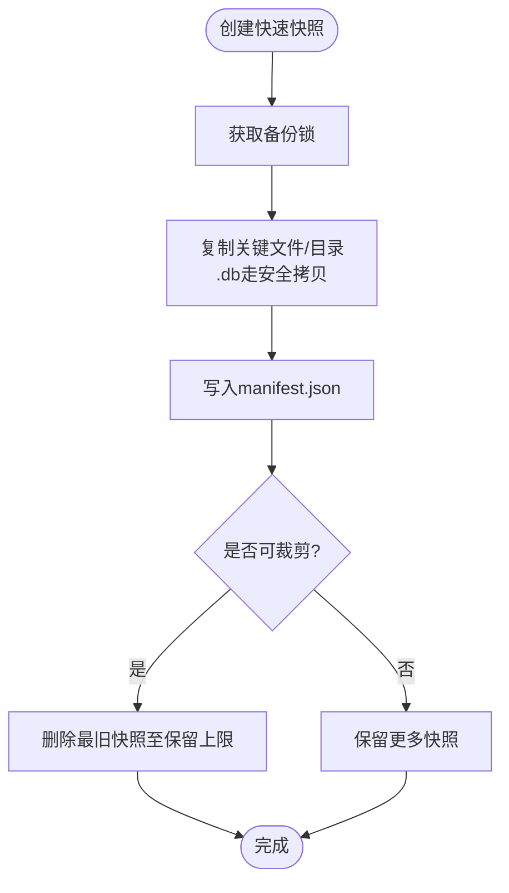
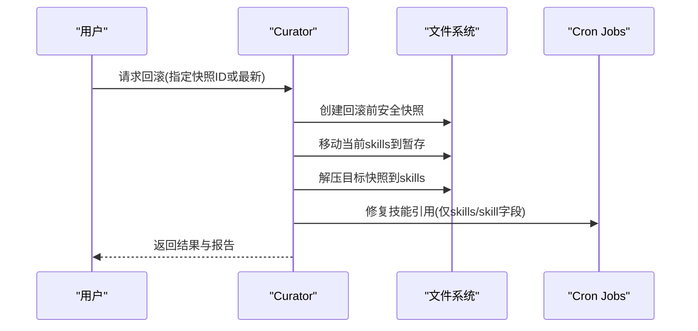
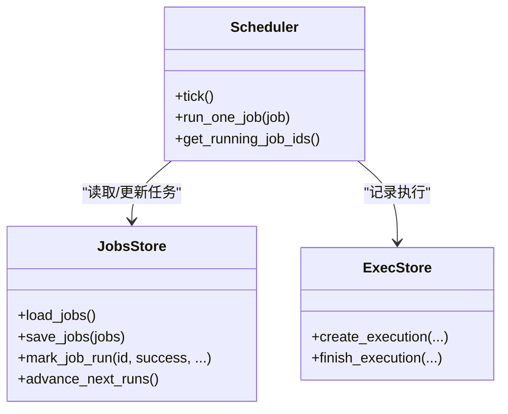
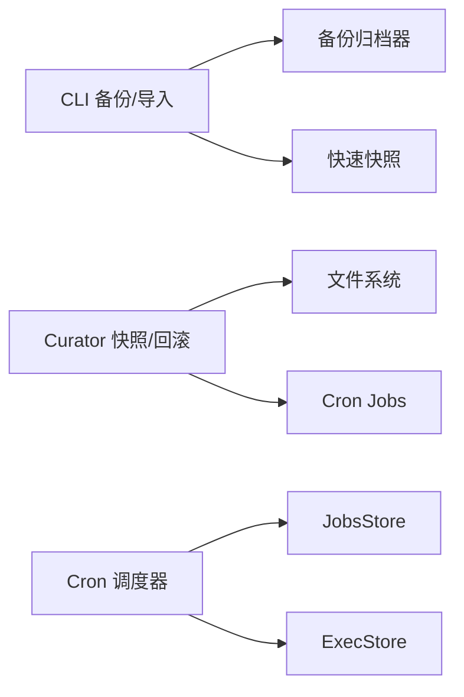

# 备份恢复

<cite>
**本文引用的文件**
- [sparkii_cli/backup.py](file://sparkii_cli/backup.py)
- [sparkii_cli/subcommands/backup.py](file://sparkii_cli/subcommands/backup.py)
- [agent/curator_backup.py](file://agent/curator_backup.py)
- [cron/scheduler.py](file://cron/scheduler.py)
- [cron/jobs.py](file://cron/jobs.py)
</cite>

## 目录
1. [简介](#简介)
2. [项目结构](#项目结构)
3. [核心组件](#核心组件)
4. [架构总览](#架构总览)
5. [详细组件分析](#详细组件分析)
6. [依赖关系分析](#依赖关系分析)
7. [性能考量](#性能考量)
8. [故障排查指南](#故障排查指南)
9. [结论](#结论)
10. [附录](#附录)

## 简介
本方案面向 Sparkii Desktop（Hermes）的数据保护与恢复，覆盖会话数据、记忆库、配置文件与插件数据的备份策略；提供自动备份配置（定时任务、增量与全量策略）、数据恢复流程（单文件、批量、灾难恢复）、备份验证方法（完整性检查与恢复测试），以及跨平台兼容性与云存储集成建议。文档基于仓库中已有的备份与快照实现进行系统化整理，并给出可操作的自动化部署思路。

## 项目结构
围绕备份与恢复的关键代码分布在以下模块：
- CLI 备份/导入与快速快照：sparkii_cli/backup.py
- CLI 子命令解析：sparkii_cli/subcommands/backup.py
- 技能集快照与回滚：agent/curator_backup.py
- 定时任务调度与执行：cron/scheduler.py
- 定时任务存储与并发控制：cron/jobs.py

图表来源
- [sparkii_cli/backup.py:581-795](file://sparkii_cli/backup.py#L581-L795)
- [sparkii_cli/backup.py:852-1069](file://sparkii_cli/backup.py#L852-L1069)
- [sparkii_cli/backup.py:1125-1366](file://sparkii_cli/backup.py#L1125-L1366)
- [agent/curator_backup.py:217-291](file://agent/curator_backup.py#L217-L291)
- [agent/curator_backup.py:572-730](file://agent/curator_backup.py#L572-L730)
- [cron/scheduler.py:1-100](file://cron/scheduler.py#L1-L100)
- [cron/jobs.py:1-120](file://cron/jobs.py#L1-L120)

章节来源
- [sparkii_cli/backup.py:581-795](file://sparkii_cli/backup.py#L581-L795)
- [sparkii_cli/backup.py:852-1069](file://sparkii_cli/backup.py#L852-L1069)
- [sparkii_cli/backup.py:1125-1366](file://sparkii_cli/backup.py#L1125-L1366)
- [agent/curator_backup.py:217-291](file://agent/curator_backup.py#L217-L291)
- [agent/curator_backup.py:572-730](file://agent/curator_backup.py#L572-L730)
- [cron/scheduler.py:1-100](file://cron/scheduler.py#L1-L100)
- [cron/jobs.py:1-120](file://cron/jobs.py#L1-L120)

## 核心组件
- 全量备份与导入
  - 将 SPARKII_HOME 下的重要数据打包为 zip，跳过缓存、虚拟环境、运行时锁等再生成或机器相关数据。
  - SQLite 数据库通过安全拷贝 API 获取一致快照，避免 WAL/共享内存不一致。
  - 导入时拒绝覆盖易变网关/进程状态文件，并对敏感文件设置严格权限。
- 快速快照
  - 仅复制关键状态文件（如 state.db、config.yaml、.env、auth.json、cron/jobs.json 等）到 state-snapshots/ 目录，支持保留数量限制与清单管理。
  - 用于更新前安全点、会话级快速恢复。
- Curator 技能集快照与回滚
  - 对 skills/ 目录创建 tar.gz 快照，附带 cron/jobs.json 副本，支持按保留策略清理旧快照。
  - 回滚时先做“回滚前”安全快照，再原子替换当前 skills 树，并修复 cron 中的技能引用。
- Cron 调度与持久化
  - 每 60 秒 tick 一次，执行到期任务，维护 executions.db 与 jobs.json，具备进程内/跨进程锁与超时降级机制。

章节来源
- [sparkii_cli/backup.py:581-795](file://sparkii_cli/backup.py#L581-L795)
- [sparkii_cli/backup.py:852-1069](file://sparkii_cli/backup.py#L852-L1069)
- [sparkii_cli/backup.py:1125-1366](file://sparkii_cli/backup.py#L1125-L1366)
- [agent/curator_backup.py:217-291](file://agent/curator_backup.py#L217-L291)
- [agent/curator_backup.py:572-730](file://agent/curator_backup.py#L572-L730)
- [cron/scheduler.py:1-100](file://cron/scheduler.py#L1-L100)
- [cron/jobs.py:1-120](file://cron/jobs.py#L1-L120)

## 架构总览
备份与恢复的整体流程如下：

图表来源
- [sparkii_cli/backup.py:581-795](file://sparkii_cli/backup.py#L581-L795)
- [sparkii_cli/backup.py:852-1069](file://sparkii_cli/backup.py#L852-L1069)
- [sparkii_cli/backup.py:1125-1366](file://sparkii_cli/backup.py#L1125-L1366)
- [agent/curator_backup.py:217-291](file://agent/curator_backup.py#L217-L291)
- [agent/curator_backup.py:572-730](file://agent/curator_backup.py#L572-L730)
- [cron/scheduler.py:1-100](file://cron/scheduler.py#L1-L100)
- [cron/jobs.py:1-120](file://cron/jobs.py#L1-L120)

## 详细组件分析

### 全量备份与导入（ZIP 归档）
- 备份策略
  - 排除项：代码仓库、字节码缓存、node_modules、Python venv/site-packages、构建缓存、WAL/共享内存/Journal 等临时文件、运行时锁/PID 文件。
  - SQLite 一致性：通过安全拷贝 API 在写入期获取一致快照，避免携带侧文件导致恢复损坏。
  - 外部路径：从活动记忆提供者声明的外部路径（如 ~/.honcho、~/.hindsight）收集并放入 _external/ 前缀，恢复时写回原 home-relative 位置。
  - 输出原子性：使用隐藏临时文件+原子替换，确保归档完整。
- 导入策略
  - 校验 ZIP 是否为有效备份（存在 config.yaml/.env/state.db 等标记）。
  - 自动检测并剥离常见目录前缀（如 .sparkii/ 或 sparkii/）。
  - 禁止覆盖易变网关/进程状态文件（gateway_state.json、PID、锁等）。
  - 敏感文件权限收紧（.env、auth.json、state.db 等设为 0600）。
  - 恢复后重建 profile 包装脚本与别名提示。

图表来源
- [sparkii_cli/backup.py:581-795](file://sparkii_cli/backup.py#L581-L795)
- [sparkii_cli/backup.py:852-1069](file://sparkii_cli/backup.py#L852-L1069)

章节来源
- [sparkii_cli/backup.py:581-795](file://sparkii_cli/backup.py#L581-L795)
- [sparkii_cli/backup.py:852-1069](file://sparkii_cli/backup.py#L852-L1069)

### 快速快照（关键状态）
- 目标：在极短时间内捕获关键状态文件（state.db、config.yaml、.env、auth.json、cron/jobs.json、channel 目录、kanban 等），用于更新前安全点或会话级快速恢复。
- 行为：
  - 使用备份锁保证一致性。
  - 大文件可选跳过（防止多 GB 的 state.db 拖慢更新流程）。
  - 生成 manifest.json 记录快照元数据（时间、文件数、大小、失败项）。
  - 自动裁剪历史快照数量（默认保留最近若干份）。
  - 若出现 DB 快照失败或超大跳过，暂停裁剪以保留可用恢复源。

图表来源
- [sparkii_cli/backup.py:1125-1366](file://sparkii_cli/backup.py#L1125-L1366)

章节来源
- [sparkii_cli/backup.py:1125-1366](file://sparkii_cli/backup.py#L1125-L1366)

### Curator 技能集快照与回滚
- 快照范围：skills/ 下所有 SKILL.md 及其资源目录、.usage.json、.archive/、.curator_state、.bundled_manifest、.curator_suppressed，以及 cron/jobs.json 副本。
- 保留策略：按 UTC ISO 命名快照目录，支持 keep 参数与保护 ID（回滚时保护目标快照不被裁剪）。
- 回滚流程：
  1) 先对当前 skills 做“回滚前”安全快照；
  2) 将当前 skills 内容移动到暂存目录；
  3) 解压目标快照到 skills/；
  4) 修复 cron/jobs.json 中的技能引用（仅对齐 skills/skill 字段，不覆盖其他运行态）。
  5) 失败时尽力恢复暂存内容，并保留 staging 目录供手工恢复。

图表来源
- [agent/curator_backup.py:217-291](file://agent/curator_backup.py#L217-L291)
- [agent/curator_backup.py:572-730](file://agent/curator_backup.py#L572-L730)

章节来源
- [agent/curator_backup.py:217-291](file://agent/curator_backup.py#L217-L291)
- [agent/curator_backup.py:572-730](file://agent/curator_backup.py#L572-L730)

### Cron 调度与持久化
- 调度周期：每 60 秒 tick，检查到期任务并执行。
- 并发与锁：
  - 进程内线程池并行执行；工作目录类任务串行执行以避免环境变量污染。
  - jobs.json 读写使用进程内 RLock + 跨进程 advisory 文件锁（带超时降级），避免死锁与长期阻塞。
- 持久化：
  - jobs.json 存储任务定义；executions.db 记录执行历史；output/ 保存任务输出。
  - ticker 心跳与最后成功时间文件用于健康检查。

图表来源
- [cron/scheduler.py:1-100](file://cron/scheduler.py#L1-L100)
- [cron/jobs.py:1-120](file://cron/jobs.py#L1-L120)
- [cron/jobs.py:270-373](file://cron/jobs.py#L270-L373)

章节来源
- [cron/scheduler.py:1-100](file://cron/scheduler.py#L1-L100)
- [cron/jobs.py:1-120](file://cron/jobs.py#L1-L120)
- [cron/jobs.py:270-373](file://cron/jobs.py#L270-L373)

## 依赖关系分析
- CLI 备份/导入依赖：
  - 路径与常量：SPARKII_HOME、默认根路径。
  - 安全拷贝与完整性校验：SQLite 安全拷贝、头部与 schema 探测、PRAGMA integrity_check（大库降级）。
  - 外部路径发现：从活动记忆提供者动态获取外部存储路径。
- Curator 快照/回滚依赖：
  - 技能集合计与排除规则；cron/jobs.json 副本；保留策略与保护 ID。
- Cron 调度依赖：
  - 配置加载、工具集解析、平台能力；jobs.json 与 executions.db 的并发安全访问。

图表来源
- [sparkii_cli/backup.py:581-795](file://sparkii_cli/backup.py#L581-L795)
- [sparkii_cli/backup.py:1125-1366](file://sparkii_cli/backup.py#L1125-L1366)
- [agent/curator_backup.py:217-291](file://agent/curator_backup.py#L217-L291)
- [cron/scheduler.py:1-100](file://cron/scheduler.py#L1-L100)
- [cron/jobs.py:1-120](file://cron/jobs.py#L1-L120)

章节来源
- [sparkii_cli/backup.py:581-795](file://sparkii_cli/backup.py#L581-L795)
- [sparkii_cli/backup.py:1125-1366](file://sparkii_cli/backup.py#L1125-L1366)
- [agent/curator_backup.py:217-291](file://agent/curator_backup.py#L217-L291)
- [cron/scheduler.py:1-100](file://cron/scheduler.py#L1-L100)
- [cron/jobs.py:1-120](file://cron/jobs.py#L1-L120)

## 性能考量
- 备份阶段
  - 大量小文件扫描与压缩可能耗时；已针对 Python 依赖树、缓存目录等进行预排除，显著减少条目数。
  - SQLite 安全拷贝在 WAL 模式下仍保持一致性，但会引入额外 I/O；大库场景建议结合快速快照与离线窗口。
- 快速快照
  - 可通过 max_file_size 跳过超大 .db 文件，避免阻塞更新流程；同时保留较小关键文件。
  - 自动裁剪历史快照，控制磁盘占用。
- Curator 快照
  - 使用流式 tar.gz 写入，无需中间目录拷贝；保留策略与保护 ID 避免误删关键快照。
- Cron 调度
  - 并发执行提升吞吐；工作目录任务串行避免环境变量冲突。
  - 跨进程锁带超时降级，避免长时间阻塞影响心跳与状态上报。

[本节为通用性能讨论，不直接分析具体文件]

## 故障排查指南
- 备份失败
  - 现象：zip 不完整或报错。
  - 排查：检查是否有权限不足、磁盘空间不足、WAL/共享内存被锁定；查看日志中的错误列表与跳过目录。
  - 参考：备份阶段的错误收集与输出摘要。
- SQLite 一致性
  - 现象：恢复后数据库损坏或会话丢失。
  - 排查：确认使用了安全拷贝；对目标库执行完整性检查（头部、schema 探测、PRAGMA integrity_check）。
  - 参考：verify_sqlite_integrity 与大库降级策略。
- 快速快照缺失
  - 现象：更新后无法回滚到快照。
  - 排查：检查 state-snapshots/ 是否存在 manifest.json；若因超大文件跳过导致不完整，应保留更旧的完整快照。
  - 参考：快速快照的裁剪抑制逻辑。
- Curator 回滚失败
  - 现象：skills 目录异常或 cron 引用不一致。
  - 排查：查看回滚前的安全快照与 staging 目录；检查 cron 技能链接修复报告。
  - 参考：rollback 流程与 _restore_cron_skill_links。
- Cron 任务未执行
  - 现象：jobs.json 存在但未触发。
  - 排查：检查 ticker 心跳与最后成功时间；确认跨进程锁是否超时降级；查看 executions.db 与 output/ 下的错误信息。
  - 参考：scheduler tick 与 jobs 锁机制。

章节来源
- [sparkii_cli/backup.py:581-795](file://sparkii_cli/backup.py#L581-L795)
- [sparkii_cli/backup.py:852-1069](file://sparkii_cli/backup.py#L852-L1069)
- [sparkii_cli/backup.py:1125-1366](file://sparkii_cli/backup.py#L1125-L1366)
- [agent/curator_backup.py:572-730](file://agent/curator_backup.py#L572-L730)
- [cron/scheduler.py:1-100](file://cron/scheduler.py#L1-L100)
- [cron/jobs.py:270-373](file://cron/jobs.py#L270-L373)

## 结论
本方案利用现有备份与快照能力，构建了覆盖全量与关键状态的备份体系，并通过 Curator 的技能集快照与回滚保障插件生态的可恢复性。结合 Cron 调度的可靠性设计，可实现日常自动备份与快速恢复。建议在生产环境中配合外部存储与监控告警，形成完整的备份恢复闭环。

[本节为总结性内容，不直接分析具体文件]

## 附录

### 数据备份策略说明
- 会话数据
  - 通过全量备份与快速快照覆盖 state.db、response_store.db、sessions 相关数据。
  - 使用 SQLite 安全拷贝确保 WAL 模式下的数据一致性。
- 记忆库
  - memory_store.db 纳入快速快照；外部记忆提供者声明的路径通过 _external/ 前缀一并备份。
- 配置文件
  - config.yaml、.env、auth.json 等关键配置在快速快照与全量备份中均被包含。
- 插件数据
  - skills/ 目录由 Curator 快照保护；外部插件状态（如 ~/.honcho、~/.hindsight）通过记忆提供者声明纳入备份。

章节来源
- [sparkii_cli/backup.py:1076-1114](file://sparkii_cli/backup.py#L1076-L1114)
- [sparkii_cli/backup.py:221-294](file://sparkii_cli/backup.py#L221-L294)
- [agent/curator_backup.py:217-291](file://agent/curator_backup.py#L217-L291)

### 自动备份配置（定时任务）
- 使用 Cron 调度器周期性执行备份任务：
  - 全量备份：调用 CLI 备份命令生成 zip 归档。
  - 快速快照：调用快速快照接口，生成 state-snapshots/ 快照。
  - Curator 快照：触发技能集快照，保留 N 份。
- 建议策略
  - 每日全量备份 + 每小时快速快照。
  - 更新前强制快速快照，并在更新后检查 cron 任务是否丢失（已有安全网）。
  - 根据业务负载调整保留数量与裁剪阈值。

章节来源
- [cron/scheduler.py:1-100](file://cron/scheduler.py#L1-L100)
- [cron/jobs.py:1-120](file://cron/jobs.py#L1-L120)
- [sparkii_cli/backup.py:1125-1366](file://sparkii_cli/backup.py#L1125-L1366)

### 数据恢复流程
- 单文件恢复
  - 从 zip 中解压单个文件到 SPARKII_HOME 对应路径；注意跳过易变运行时文件。
- 批量恢复
  - 使用导入命令整体恢复，自动处理权限与路径前缀剥离。
- 灾难恢复
  - 优先恢复快速快照（state-snapshots/），再恢复 Curator 技能集快照；必要时回退到全量 zip。
  - 恢复后执行完整性检查与功能验证。

章节来源
- [sparkii_cli/backup.py:852-1069](file://sparkii_cli/backup.py#L852-L1069)
- [sparkii_cli/backup.py:1395-1468](file://sparkii_cli/backup.py#L1395-L1468)
- [agent/curator_backup.py:572-730](file://agent/curator_backup.py#L572-L730)

### 备份验证方法
- 数据完整性检查
  - SQLite 头部与 schema 探测；大库使用 PRAGMA integrity_check 或降级为轻量探测。
  - 快速快照 manifest.json 核对文件数与大小。
- 恢复测试流程
  - 在隔离环境执行导入；验证 gateway 状态、cron 任务、技能集与外部路径。
  - 执行关键操作（发送消息、执行 cron、打开会话）确认功能正常。

章节来源
- [sparkii_cli/backup.py:416-552](file://sparkii_cli/backup.py#L416-L552)
- [sparkii_cli/backup.py:1125-1366](file://sparkii_cli/backup.py#L1125-L1366)

### 跨平台兼容性
- Windows
  - 使用 msvcrt 文件锁替代 fcntl；忽略 Unix 权限位；跳过不支持 chmod 的平台。
- Linux/macOS
  - 使用 fcntl 文件锁；支持权限位设置（0600/0700）。
- 注意事项
  - 路径分隔符与大小写敏感性；符号链接在备份时跳过。
  - 外部路径必须位于用户 home 目录下以保证可移植性。

章节来源
- [sparkii_cli/backup.py:150-203](file://sparkii_cli/backup.py#L150-L203)
- [sparkii_cli/backup.py:275-294](file://sparkii_cli/backup.py#L275-L294)
- [cron/jobs.py:270-373](file://cron/jobs.py#L270-L373)

### 云存储集成建议
- 目标：将备份 zip、快速快照与 Curator 快照上传至对象存储（AWS S3、Google Cloud Storage、Azure Blob）。
- 推荐做法
  - 在 Cron 任务中追加上传步骤，使用各云 SDK 或命令行工具（aws s3 cp、gsutil、az storage blob upload）。
  - 为每个备份添加版本标签（时间戳/快照 ID），便于回溯。
  - 启用生命周期策略自动清理过期备份。
- 安全与合规
  - 使用最小权限的访问密钥与服务账号。
  - 传输加密（TLS）与静态加密（服务端加密）。
  - 审计日志与访问告警。

[本节为概念性建议，不直接分析具体文件]

### 备份脚本示例与自动化部署
- 示例任务（概念性）
  - 每日 02:00 执行全量备份，生成 zip 并上传至云存储。
  - 每小时执行快速快照，保留最近 20 份。
  - 每次更新前执行快速快照，更新后检查 cron 任务是否丢失并自动恢复。
- 部署要点
  - 将 Cron 任务注册到系统服务或容器编排中。
  - 配置云存储凭据与环境变量。
  - 监控与告警：备份成功/失败、存储空间不足、上传失败。

[本节为概念性示例，不直接分析具体文件]