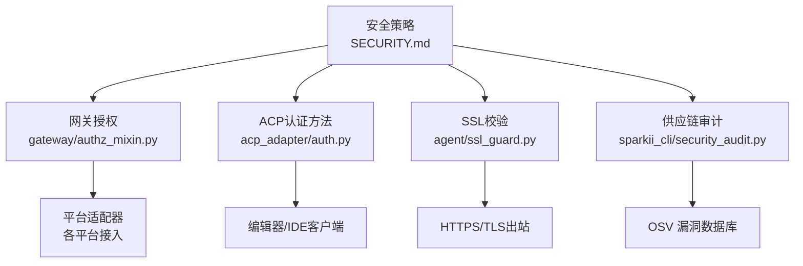
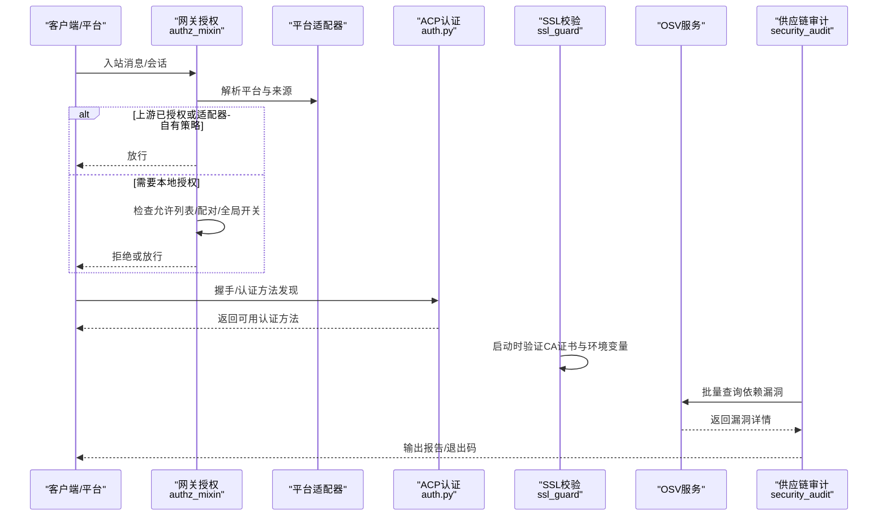
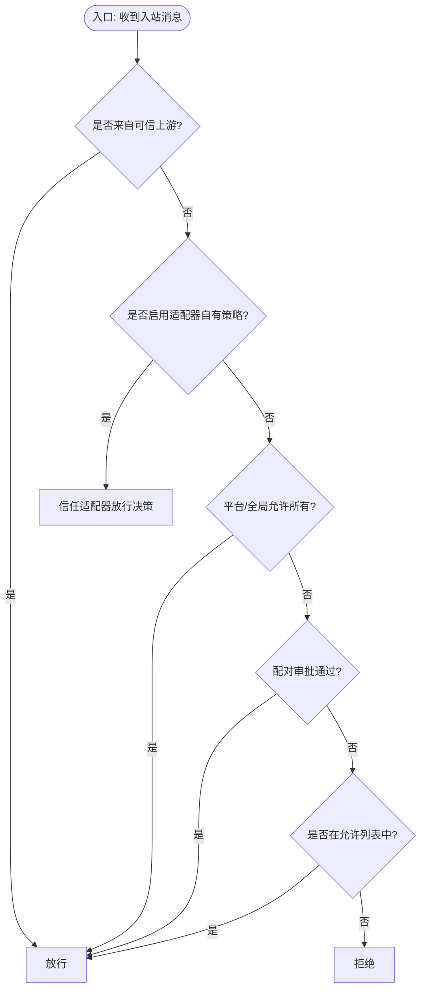
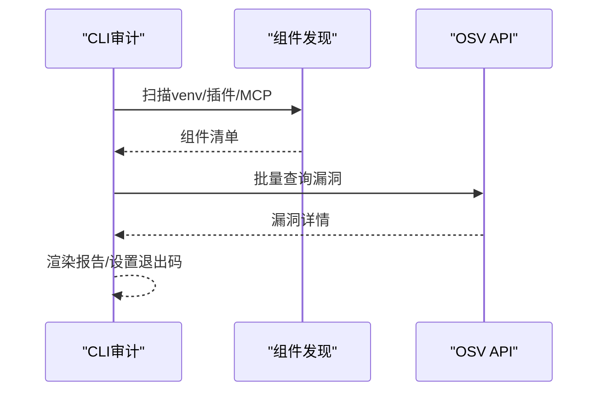
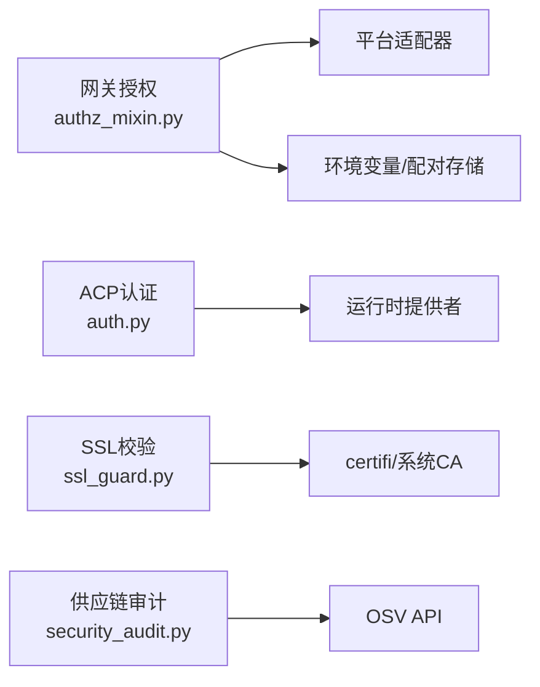

# 安全管理

<cite>
**本文引用的文件**
- [SECURITY.md](file://SECURITY.md)
- [acp_adapter/auth.py](file://acp_adapter/auth.py)
- [gateway/authz_mixin.py](file://gateway/authz_mixin.py)
- [sparkii_cli/security_audit.py](file://sparkii_cli/security_audit.py)
- [agent/ssl_guard.py](file://agent/ssl_guard.py)
</cite>

## 目录
1. [简介](#简介)
2. [项目结构](#项目结构)
3. [核心组件](#核心组件)
4. [架构总览](#架构总览)
5. [详细组件分析](#详细组件分析)
6. [依赖关系分析](#依赖关系分析)
7. [性能考虑](#性能考虑)
8. [故障排查指南](#故障排查指南)
9. [结论](#结论)
10. [附录](#附录)

## 简介
本文件面向运维与开发者，提供基于仓库现有实现的安全管理最佳实践。内容覆盖访问控制（用户认证、权限管理、API密钥保护）、审计日志与安全事件追踪、数据安全策略（传输与存储安全）、安全扫描与漏洞管理、网络安全配置（防火墙、SSL/TLS、网络隔离）以及安全事件响应流程。文档中的机制与示例均来源于代码库的实际实现，并辅以流程图与时序图帮助理解。

## 项目结构
本项目在安全方面采用分层与边界清晰的设计：
- 信任模型与部署加固策略由顶层安全策略文档定义，明确“操作系统级隔离”为唯一承载性安全边界，并对插件、技能、外部表面进行约束。
- 网关层提供统一的入站消息授权与平台适配器的访问策略集成。
- ACP适配器负责检测与声明运行时认证方法，便于编辑器/IDE侧握手。
- CLI提供供应链安全审计能力，扫描venv、插件与MCP服务器依赖并查询OSV。
- Agent层提供SSL CA证书校验，确保TLS通信的根信任链可用。

图表来源
- [SECURITY.md:32-119](file://SECURITY.md#L32-L119)
- [gateway/authz_mixin.py:90-178](file://gateway/authz_mixin.py#L90-L178)
- [acp_adapter/auth.py:11-79](file://acp_adapter/auth.py#L11-L79)
- [agent/ssl_guard.py:18-101](file://agent/ssl_guard.py#L18-L101)
- [sparkii_cli/security_audit.py:84-279](file://sparkii_cli/security_audit.py#L84-L279)

章节来源
- [SECURITY.md:32-119](file://SECURITY.md#L32-L119)

## 核心组件
- 信任模型与边界：以操作系统级隔离作为唯一承载性安全边界；进程内启发式仅用于事故预防，不构成边界。
- 网关授权：统一处理多平台的入站消息授权，支持允许列表、配对审批、上游授权委托等策略。
- ACP认证：自动探测运行时提供者并声明可用的认证方法，支持终端设置流程。
- SSL/TLS保障：启动时校验CA证书包与环境变量指向的证书路径，避免静默失败。
- 供应链审计：扫描Python环境、插件声明与MCP命令参数中的依赖版本，批量查询OSV并输出结果。

章节来源
- [SECURITY.md:32-119](file://SECURITY.md#L32-L119)
- [gateway/authz_mixin.py:386-783](file://gateway/authz_mixin.py#L386-L783)
- [acp_adapter/auth.py:11-79](file://acp_adapter/auth.py#L11-L79)
- [agent/ssl_guard.py:68-101](file://agent/ssl_guard.py#L68-L101)
- [sparkii_cli/security_audit.py:414-481](file://sparkii_cli/security_audit.py#L414-L481)

## 架构总览
下图展示从外部请求到内部处理的授权与安全保障路径，涵盖网关授权、ACP认证、SSL校验与供应链审计。

图表来源
- [gateway/authz_mixin.py:386-783](file://gateway/authz_mixin.py#L386-L783)
- [acp_adapter/auth.py:41-79](file://acp_adapter/auth.py#L41-L79)
- [agent/ssl_guard.py:68-101](file://agent/ssl_guard.py#L68-L101)
- [sparkii_cli/security_audit.py:300-329](file://sparkii_cli/security_audit.py#L300-L329)

## 详细组件分析

### 访问控制与用户认证
- 网关授权流程：
  - 优先判断是否来自可信上游（如中继连接），若是则直接放行。
  - 对群组/频道类消息，支持按聊天ID或发送者白名单放行。
  - 支持平台级“允许所有用户”开关与全局开关。
  - 支持配对审批（PairingStore）作为独立授权通道。
  - 若未配置任何允许列表且适配器未声明自有访问策略，则默认拒绝。
- ACP认证：
  - 自动探测当前运行时的提供者与API密钥，声明可用的认证方法。
  - 当未配置时，提供终端设置方法引导用户完成配置。

图表来源
- [gateway/authz_mixin.py:386-783](file://gateway/authz_mixin.py#L386-L783)

章节来源
- [gateway/authz_mixin.py:386-783](file://gateway/authz_mixin.py#L386-L783)
- [acp_adapter/auth.py:11-79](file://acp_adapter/auth.py#L11-L79)

### API密钥与凭据保护
- 凭据作用域：向低信任子进程（shell、MCP、定时任务、代码执行子进程）传递环境时，默认剥离提供商API密钥与网关令牌；仅显式声明的变量会被透传。
- 运行时认证方法：ACP适配器根据运行时提供的API密钥或可调用提供者，动态声明认证方法，减少硬编码密钥暴露面。
- 建议：
  - 将凭据保存在受保护的凭据文件中，不在主配置或版本控制中存放。
  - 使用Provider存储注入凭据，避免落盘。

章节来源
- [SECURITY.md:121-135](file://SECURITY.md#L121-L135)
- [acp_adapter/auth.py:11-79](file://acp_adapter/auth.py#L11-L79)

### 审计日志与安全事件追踪
- 供应链审计：
  - 扫描范围：venv依赖、插件requirements/pyproject中的精确版本、MCP命令参数中的npx/uvx版本。
  - 查询OSV批量接口，获取漏洞ID、严重级别、修复版本与摘要。
  - 支持JSON输出与按严重级别退出码控制，便于CI集成。
- 建议：
  - 将审计纳入CI流水线，设置fail-on阈值阻断高危漏洞合并。
  - 定期生成合规报告，归档至安全审计系统。

图表来源
- [sparkii_cli/security_audit.py:84-279](file://sparkii_cli/security_audit.py#L84-L279)
- [sparkii_cli/security_audit.py:300-329](file://sparkii_cli/security_audit.py#L300-L329)
- [sparkii_cli/security_audit.py:414-481](file://sparkii_cli/security_audit.py#L414-L481)

章节来源
- [sparkii_cli/security_audit.py:84-279](file://sparkii_cli/security_audit.py#L84-L279)
- [sparkii_cli/security_audit.py:300-329](file://sparkii_cli/security_audit.py#L300-L329)
- [sparkii_cli/security_audit.py:414-481](file://sparkii_cli/security_audit.py#L414-L481)

### 数据安全策略（传输与存储）
- 传输安全：
  - 启动时校验CA证书包与环境变量指向的证书路径，确保TLS握手可用。
  - 支持跳过守卫的环境变量，但生产环境不建议禁用。
- 存储安全：
  - 凭据文件需严格权限控制，避免写入主配置或版本控制。
  - 在多租户或多实例场景下，结合容器化与文件系统隔离限制凭据可见性。

章节来源
- [agent/ssl_guard.py:18-101](file://agent/ssl_guard.py#L18-L101)
- [SECURITY.md:301-324](file://SECURITY.md#L301-L324)

### 网络安全配置（防火墙、SSL/TLS、网络隔离）
- 防火墙与网络暴露：
  - 所有网络暴露的适配器必须配置调用方允许列表，禁止无配置放行。
  - 本地监听默认绑定回环地址；如需对外暴露，需由操作者承担加固责任。
- SSL/TLS：
  - 使用系统或企业CA证书包，确保证书有效且可加载。
  - 通过环境变量指定自定义CA时，需保证路径正确且包含足够数量的证书。
- 网络隔离：
  - 推荐使用容器或沙箱包裹整个Agent进程树，限制文件系统、网络与进程调用。
  - 对于不可信输入源（开放网页、邮件、多用户频道），应强制使用全进程隔离。

章节来源
- [SECURITY.md:171-223](file://SECURITY.md#L171-L223)
- [SECURITY.md:301-324](file://SECURITY.md#L301-L324)
- [agent/ssl_guard.py:68-101](file://agent/ssl_guard.py#L68-L101)

### 安全事件响应流程
- 威胁检测：
  - 供应链审计持续发现已知漏洞，结合CI门禁阻止高风险变更。
  - 网关授权记录未授权访问尝试，配合监控告警。
- 事件处理：
  - 针对高危漏洞，优先升级依赖或切换至受控版本。
  - 对异常网络行为，收紧允许列表与网络策略。
- 恢复措施：
  - 回滚到已知安全基线版本。
  - 重新注入凭据并重启服务，确保新策略生效。

章节来源
- [sparkii_cli/security_audit.py:539-590](file://sparkii_cli/security_audit.py#L539-L590)
- [SECURITY.md:226-298](file://SECURITY.md#L226-L298)

## 依赖关系分析
- 网关授权模块依赖平台适配器与配置，读取环境变量与配对存储进行授权决策。
- ACP认证模块依赖运行时提供者解析，动态声明认证方法。
- SSL校验模块依赖系统CA与certifi包，确保TLS信任链可用。
- 供应链审计模块依赖OSV API，批量查询依赖漏洞信息。

图表来源
- [gateway/authz_mixin.py:90-178](file://gateway/authz_mixin.py#L90-L178)
- [acp_adapter/auth.py:11-79](file://acp_adapter/auth.py#L11-L79)
- [agent/ssl_guard.py:68-101](file://agent/ssl_guard.py#L68-L101)
- [sparkii_cli/security_audit.py:300-329](file://sparkii_cli/security_audit.py#L300-L329)

章节来源
- [gateway/authz_mixin.py:90-178](file://gateway/authz_mixin.py#L90-L178)
- [acp_adapter/auth.py:11-79](file://acp_adapter/auth.py#L11-L79)
- [agent/ssl_guard.py:68-101](file://agent/ssl_guard.py#L68-L101)
- [sparkii_cli/security_audit.py:300-329](file://sparkii_cli/security_audit.py#L300-L329)

## 性能考虑
- 供应链审计采用批量查询与并行拉取详情，降低网络往返与整体耗时。
- 网关授权逻辑尽量复用适配器状态与配置缓存，减少重复解析。
- SSL校验仅在启动阶段执行，避免每次请求开销。

[本节为通用指导，不直接分析具体文件]

## 故障排查指南
- SSL证书问题：
  - 现象：TLS握手失败或报找不到证书文件。
  - 处理：检查SPARKII_CA_BUNDLE、SSL_CERT_FILE、REQUESTS_CA_BUNDLE、CURL_CA_BUNDLE指向的路径是否存在且有效；必要时运行修复命令重装证书包。
- 供应链审计失败：
  - 现象：无法连接OSV或返回空结果。
  - 处理：检查网络连通性与超时配置；确认组件版本格式符合预期；重试或降级查询策略。
- 网关授权误拒：
  - 现象：合法用户被拒绝。
  - 处理：核对平台允许列表、全局允许开关、配对审批状态；确认适配器是否声明自有访问策略。

章节来源
- [agent/ssl_guard.py:28-66](file://agent/ssl_guard.py#L28-L66)
- [sparkii_cli/security_audit.py:539-590](file://sparkii_cli/security_audit.py#L539-L590)
- [gateway/authz_mixin.py:386-783](file://gateway/authz_mixin.py#L386-L783)

## 结论
本项目以操作系统级隔离为核心边界，结合网关授权、ACP认证、SSL校验与供应链审计形成纵深防御。建议在部署中严格遵循安全策略，启用最小权限与网络暴露控制，持续运行供应链审计并与CI集成，确保在快速迭代中维持安全基线。

[本节为总结性内容，不直接分析具体文件]

## 附录
- 安全配置示例（基于仓库实现）：
  - 网关允许列表：为每个启用的网络适配器配置调用方允许列表，避免无配置放行。
  - 平台允许所有开关：谨慎启用平台级允许所有标志，仅在受控环境中使用。
  - 配对审批：通过配对流程授予用户访问权限，并与允许列表保持一致。
  - SSL证书：使用系统或企业CA证书包，避免指向无效或损坏的证书文件。
  - 供应链审计：在CI中运行审计，设置fail-on阈值阻断高危漏洞。
- 合规性检查清单：
  - 是否启用操作系统级隔离？
  - 是否对所有网络暴露适配器配置允许列表？
  - 是否将凭据保存在受保护位置且不进入版本控制？
  - 是否启用SSL证书校验并确保CA包有效？
  - 是否在生产环境禁用不安全选项（如忽略安全警告）？
  - 是否将供应链审计纳入CI并设置退出码门禁？
  - 是否对第三方技能与插件进行安装前审查？

章节来源
- [SECURITY.md:171-223](file://SECURITY.md#L171-L223)
- [SECURITY.md:301-324](file://SECURITY.md#L301-L324)
- [sparkii_cli/security_audit.py:539-590](file://sparkii_cli/security_audit.py#L539-L590)