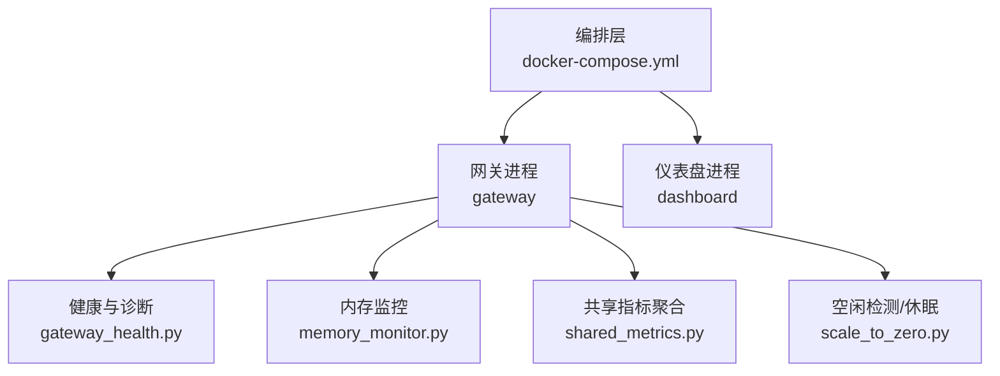
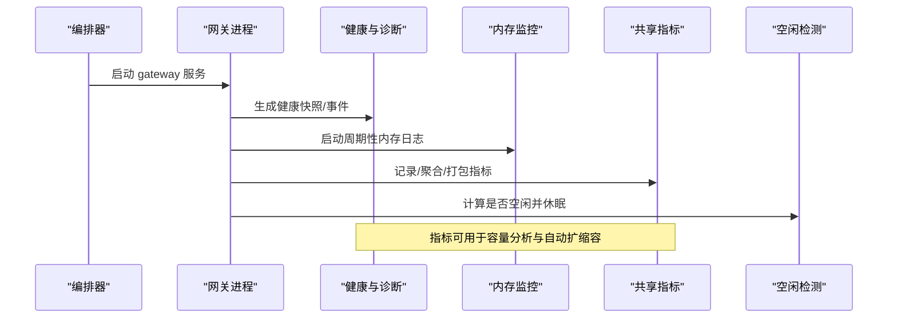
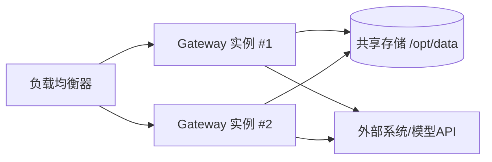
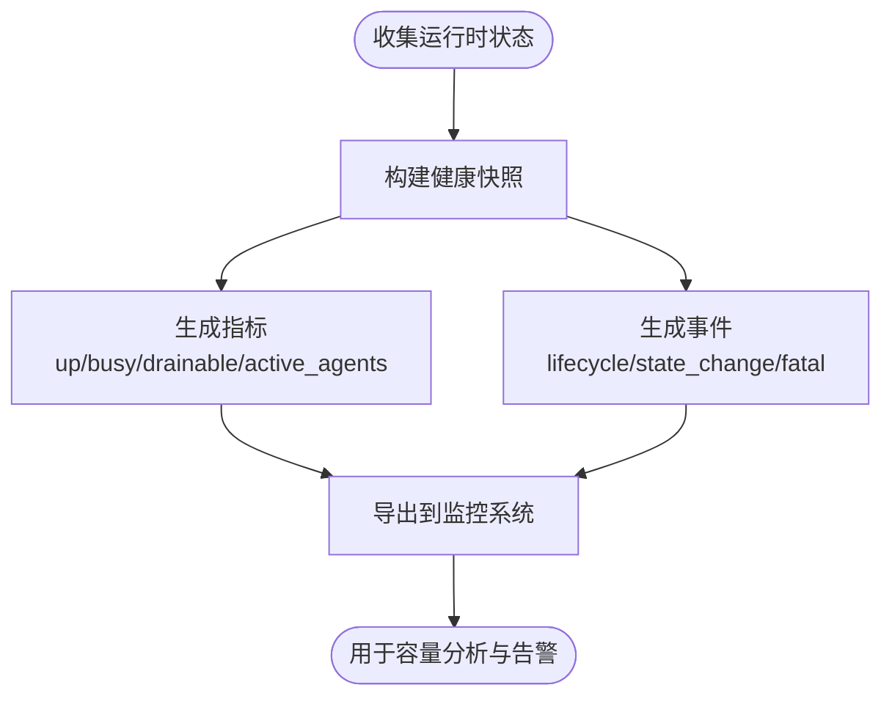
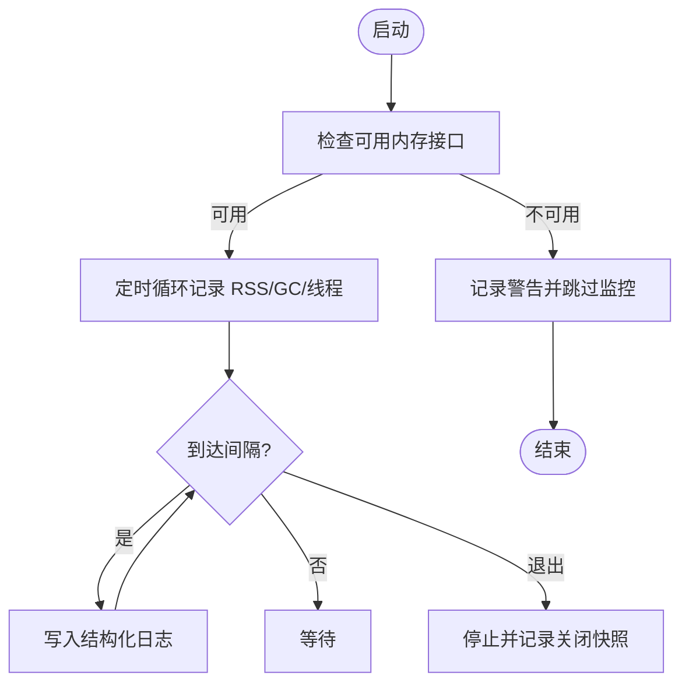
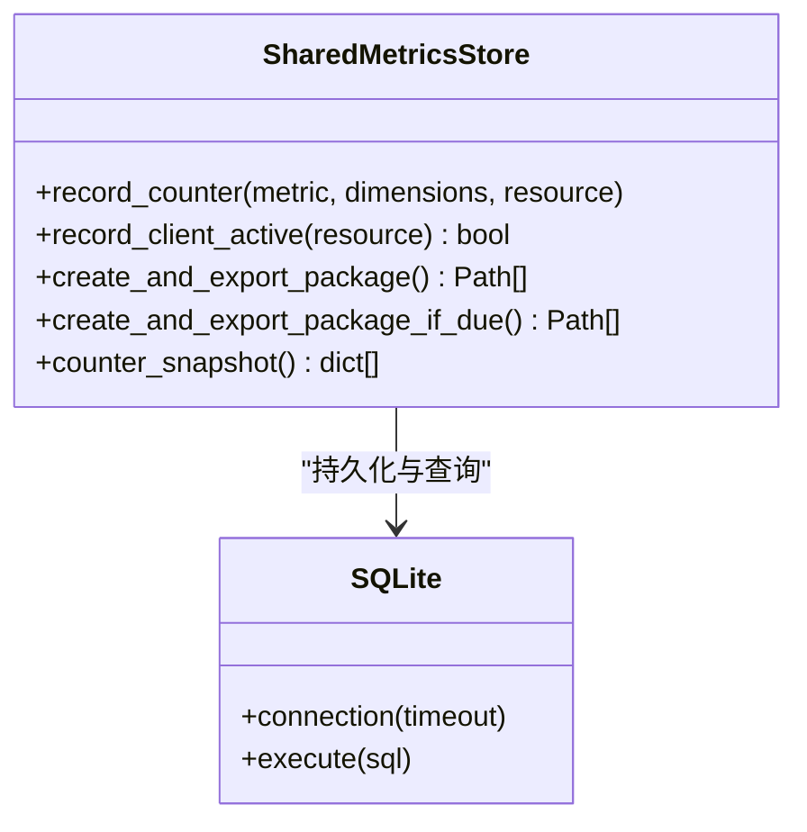
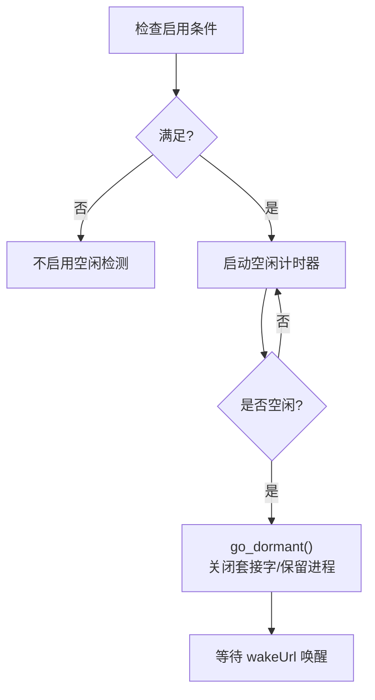
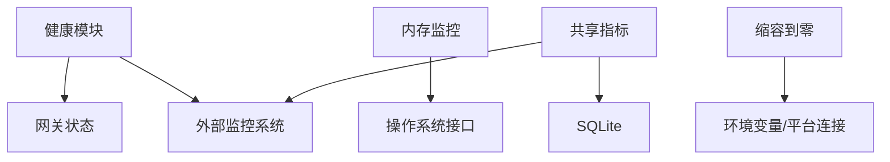

# 容量规划

<cite>
**本文引用的文件**
- [docker-compose.yml](file://docker-compose.yml)
- [Dockerfile](file://Dockerfile)
- [gateway/memory_monitor.py](file://gateway/memory_monitor.py)
- [agent/monitoring/gateway_health.py](file://agent/monitoring/gateway_health.py)
- [sparkii_cli/observability/shared_metrics.py](file://sparkii_cli/observability/shared_metrics.py)
- [gateway/scale_to_zero.py](file://gateway/scale_to_zero.py)
</cite>

## 目录
1. [简介](#简介)
2. [项目结构](#项目结构)
3. [核心组件](#核心组件)
4. [架构总览](#架构总览)
5. [详细组件分析](#详细组件分析)
6. [依赖关系分析](#依赖关系分析)
7. [性能与容量考量](#性能与容量考量)
8. [故障排查指南](#故障排查指南)
9. [结论](#结论)
10. [附录](#附录)

## 简介
本文件面向生产环境的容量规划与扩展策略，覆盖资源需求评估（CPU、内存、存储、网络）、水平与垂直扩展方案、弹性伸缩配置、容量监控与预测、混合云部署思路，以及容量规划工具与自动化脚本的使用建议。内容基于仓库中的容器编排、网关健康指标、内存监控、共享指标聚合与“缩容到零”能力进行系统化梳理，帮助运维与平台团队制定可落地的容量策略。

## 项目结构
从容量视角看，关键要素包括：
- 容器化与进程管理：通过 Dockerfile 与 s6-overlay 实现多服务进程的生命周期管理与权限隔离；docker-compose 提供双服务（gateway、dashboard）的编排入口。
- 运行时观测：网关健康快照与事件导出、周期性内存使用日志、本地共享指标持久化与打包导出。
- 弹性行为：idle 检测与休眠唤醒（scale-to-zero），为云原生自动扩缩容提供基础。

图表来源
- [docker-compose.yml:30-77](file://docker-compose.yml#L30-L77)
- [Dockerfile:93-135](file://Dockerfile#L93-L135)
- [agent/monitoring/gateway_health.py:210-291](file://agent/monitoring/gateway_health.py#L210-L291)
- [gateway/memory_monitor.py:139-193](file://gateway/memory_monitor.py#L139-L193)
- [sparkii_cli/observability/shared_metrics.py:47-62](file://sparkii_cli/observability/shared_metrics.py#L47-L62)
- [gateway/scale_to_zero.py:44-125](file://gateway/scale_to_zero.py#L44-L125)

章节来源
- [docker-compose.yml:30-77](file://docker-compose.yml#L30-L77)
- [Dockerfile:93-135](file://Dockerfile#L93-L135)

## 核心组件
- 容器与进程编排
  - 使用 s6-overlay 作为 PID 1 的进程监督器，统一管理服务生命周期与重启策略。
  - docker-compose 定义 gateway 与 dashboard 两个服务，挂载数据卷并暴露必要端口。
- 健康与诊断
  - 定期生成网关健康快照与事件，包含活跃代理数、忙碌状态、平台状态等，便于外部监控系统采集。
- 内存监控
  - 后台线程周期性记录 RSS、GC 统计与线程数，支持基线与关闭时快照，便于定位慢泄漏。
- 共享指标
  - 将允许的计数器按日聚合到 SQLite，并打包成不可变包输出到 outbox，供离线或异步上报。
- 缩容到零
  - 在仅 relay 模式且注册 wakeUrl 时，空闲超过阈值后进入休眠，由上层调度恢复，降低闲置成本。

章节来源
- [Dockerfile:93-135](file://Dockerfile#L93-L135)
- [docker-compose.yml:30-77](file://docker-compose.yml#L30-L77)
- [agent/monitoring/gateway_health.py:210-291](file://agent/monitoring/gateway_health.py#L210-L291)
- [gateway/memory_monitor.py:139-193](file://gateway/memory_monitor.py#L139-L193)
- [sparkii_cli/observability/shared_metrics.py:47-62](file://sparkii_cli/observability/shared_metrics.py#L47-L62)
- [gateway/scale_to_zero.py:44-125](file://gateway/scale_to_zero.py#L44-L125)

## 架构总览
下图展示了容量相关的关键路径：编排启动、健康指标产出、内存监控、共享指标聚合与空闲休眠决策。

图表来源
- [docker-compose.yml:30-77](file://docker-compose.yml#L30-L77)
- [agent/monitoring/gateway_health.py:210-291](file://agent/monitoring/gateway_health.py#L210-L291)
- [gateway/memory_monitor.py:139-193](file://gateway/memory_monitor.py#L139-L193)
- [sparkii_cli/observability/shared_metrics.py:47-62](file://sparkii_cli/observability/shared_metrics.py#L47-L62)
- [gateway/scale_to_zero.py:44-125](file://gateway/scale_to_zero.py#L44-L125)

## 详细组件分析

### 容器与进程编排（水平扩展基础）
- 进程监督与权限
  - s6-overlay 负责 PID 1 接管、子进程监督与重启；容器内以非 root 用户运行，数据目录挂载至 /opt/data。
- 服务拓扑
  - gateway：承载业务逻辑、消息通道与工具调用。
  - dashboard：本地可视化管理界面，默认绑定 localhost。
- 可扩展性
  - 通过增加 gateway 实例数量并结合负载均衡与服务发现，可实现水平扩展。
  - 数据卷 /opt/data 用于会话与状态持久化，需考虑多实例共享存储或无状态化改造。

图表来源
- [docker-compose.yml:30-77](file://docker-compose.yml#L30-L77)
- [Dockerfile:149-152](file://Dockerfile#L149-L152)
- [Dockerfile:378-393](file://Dockerfile#L378-L393)

章节来源
- [docker-compose.yml:30-77](file://docker-compose.yml#L30-L77)
- [Dockerfile:149-152](file://Dockerfile#L149-L152)
- [Dockerfile:378-393](file://Dockerfile#L378-L393)

### 健康与诊断（容量观测输入）
- 健康快照
  - 产出网关上下线、活跃代理数、忙碌/可排空标志、平台状态等指标，便于构建容量告警与扩容触发条件。
- 事件分类
  - 对错误信息进行归一化分类（认证失败、限流、超时、网络错误、配置无效、启动失败、平台致命等），辅助快速定位瓶颈。
- 日志桥接
  - 允许白名单日志级别的事件被转换为结构化诊断事件，减少噪声并提升可观测性。

图表来源
- [agent/monitoring/gateway_health.py:210-291](file://agent/monitoring/gateway_health.py#L210-L291)
- [agent/monitoring/gateway_health.py:70-99](file://agent/monitoring/gateway_health.py#L70-L99)
- [agent/monitoring/gateway_health.py:427-459](file://agent/monitoring/gateway_health.py#L427-L459)

章节来源
- [agent/monitoring/gateway_health.py:210-291](file://agent/monitoring/gateway_health.py#L210-L291)
- [agent/monitoring/gateway_health.py:70-99](file://agent/monitoring/gateway_health.py#L70-L99)
- [agent/monitoring/gateway_health.py:427-459](file://agent/monitoring/gateway_health.py#L427-L459)

### 内存监控（垂直优化依据）
- 周期性采样
  - 后台线程每 N 分钟记录 RSS、GC 计数、线程数与运行时长，支持基线与关闭时快照。
- 跨平台兼容
  - 优先使用标准库 resource，回退到 psutil；若均不可用则降级并跳过监控，避免影响主流程。
- 容量意义
  - 长期趋势可识别慢泄漏与峰值占用，指导单机内存上限、堆大小与缓存策略调优。

图表来源
- [gateway/memory_monitor.py:52-80](file://gateway/memory_monitor.py#L52-L80)
- [gateway/memory_monitor.py:83-127](file://gateway/memory_monitor.py#L83-L127)
- [gateway/memory_monitor.py:139-193](file://gateway/memory_monitor.py#L139-L193)
- [gateway/memory_monitor.py:196-231](file://gateway/memory_monitor.py#L196-L231)

章节来源
- [gateway/memory_monitor.py:52-80](file://gateway/memory_monitor.py#L52-L80)
- [gateway/memory_monitor.py:83-127](file://gateway/memory_monitor.py#L83-L127)
- [gateway/memory_monitor.py:139-193](file://gateway/memory_monitor.py#L139-L193)
- [gateway/memory_monitor.py:196-231](file://gateway/memory_monitor.py#L196-L231)

### 共享指标聚合（容量趋势与预测）
- 指标聚合
  - 将允许的计数器按天聚合到 SQLite，支持并发访问与忙超时保护。
- 打包导出
  - 每日生成不可变数据包，写入 outbox 目录，便于离线采集与审计。
- 容量用途
  - 结合历史数据可做趋势分析、容量预警与扩容建议；也可作为自动扩缩容的输入指标之一。

图表来源
- [sparkii_cli/observability/shared_metrics.py:47-62](file://sparkii_cli/observability/shared_metrics.py#L47-L62)
- [sparkii_cli/observability/shared_metrics.py:120-149](file://sparkii_cli/observability/shared_metrics.py#L120-L149)
- [sparkii_cli/observability/shared_metrics.py:199-221](file://sparkii_cli/observability/shared_metrics.py#L199-L221)
- [sparkii_cli/observability/shared_metrics.py:266-282](file://sparkii_cli/observability/shared_metrics.py#L266-L282)
- [sparkii_cli/observability/shared_metrics.py:300-347](file://sparkii_cli/observability/shared_metrics.py#L300-L347)
- [sparkii_cli/observability/shared_metrics.py:489-606](file://sparkii_cli/observability/shared_metrics.py#L489-L606)
- [sparkii_cli/observability/shared_metrics.py:623-719](file://sparkii_cli/observability/shared_metrics.py#L623-L719)

章节来源
- [sparkii_cli/observability/shared_metrics.py:47-62](file://sparkii_cli/observability/shared_metrics.py#L47-L62)
- [sparkii_cli/observability/shared_metrics.py:120-149](file://sparkii_cli/observability/shared_metrics.py#L120-L149)
- [sparkii_cli/observability/shared_metrics.py:199-221](file://sparkii_cli/observability/shared_metrics.py#L199-L221)
- [sparkii_cli/observability/shared_metrics.py:266-282](file://sparkii_cli/observability/shared_metrics.py#L266-L282)
- [sparkii_cli/observability/shared_metrics.py:300-347](file://sparkii_cli/observability/shared_metrics.py#L300-L347)
- [sparkii_cli/observability/shared_metrics.py:489-606](file://sparkii_cli/observability/shared_metrics.py#L489-L606)
- [sparkii_cli/observability/shared_metrics.py:623-719](file://sparkii_cli/observability/shared_metrics.py#L623-L719)

### 缩容到零（弹性伸缩行为）
- 启用条件
  - 环境变量开关开启、仅 relay 模式（或直接无直连平台）、已注册 wakeUrl。
- 空闲判定
  - 无进行中任务、无入站请求超过阈值时间、无后台工作。
- 休眠与唤醒
  - 进入休眠时关闭套接字但保持进程存活，由上层调度在收到唤醒请求时恢复。

图表来源
- [gateway/scale_to_zero.py:44-125](file://gateway/scale_to_zero.py#L44-L125)

章节来源
- [gateway/scale_to_zero.py:44-125](file://gateway/scale_to_zero.py#L44-L125)

## 依赖关系分析
- 组件耦合
  - 健康模块依赖网关状态与平台信息；内存监控独立于业务逻辑；共享指标与 SQLite 强耦合；缩容到零依赖环境与平台连接状态。
- 外部依赖
  - 容器运行时（s6-overlay）、SQLite、可选的 psutil；对外部模型 API 与消息平台的网络依赖。
- 潜在风险
  - 共享存储 /opt/data 在多实例场景下的并发与一致性；外部依赖限流/超时对容量评估的影响。

图表来源
- [agent/monitoring/gateway_health.py:210-291](file://agent/monitoring/gateway_health.py#L210-L291)
- [gateway/memory_monitor.py:52-80](file://gateway/memory_monitor.py#L52-L80)
- [sparkii_cli/observability/shared_metrics.py:266-282](file://sparkii_cli/observability/shared_metrics.py#L266-L282)
- [gateway/scale_to_zero.py:44-125](file://gateway/scale_to_zero.py#L44-L125)

章节来源
- [agent/monitoring/gateway_health.py:210-291](file://agent/monitoring/gateway_health.py#L210-L291)
- [gateway/memory_monitor.py:52-80](file://gateway/memory_monitor.py#L52-L80)
- [sparkii_cli/observability/shared_metrics.py:266-282](file://sparkii_cli/observability/shared_metrics.py#L266-L282)
- [gateway/scale_to_zero.py:44-125](file://gateway/scale_to_zero.py#L44-L125)

## 性能与容量考量
- CPU
  - 观察健康快照中的 busy 标志与 active_agents，结合模型调用速率估算所需 CPU 核数；在高并发场景下，优先水平扩展而非盲目增大单机规格。
- 内存
  - 利用内存监控的 RSS 趋势判断是否需要垂直扩容或调整缓存/压缩策略；关注 GC 频率与线程数异常增长。
- 存储
  - /opt/data 为会话与状态持久化点，需评估 IOPS 与容量增长；多实例部署建议使用共享文件系统或迁移至外部数据库。
- 网络
  - 外部模型 API 与消息平台的限流/超时会影响吞吐与延迟，需在容量规划中预留缓冲与重试预算。
- 弹性
  - 在仅 relay 模式下启用缩容到零，配合云平台自动伸缩策略，降低闲时成本；注意预热与冷却时间以避免频繁启停。

[本节为通用指导，无需特定文件引用]

## 故障排查指南
- 健康事件
  - 关注 platform.fatal、gateway.startup_failed、gateway.lifecycle 等事件，结合错误分类快速定位问题类型。
- 内存泄漏
  - 通过 [MEMORY] 日志序列追踪 RSS 上升拐点，结合 GC 与线程数变化定位可疑模块。
- 指标缺失
  - 检查共享指标 outbox 目录是否有新包生成；确认 SQLite 权限与磁盘空间。
- 缩容异常
  - 校验环境变量开关、wakeUrl 注册与平台连接状态；确认 idle 阈值设置合理。

章节来源
- [agent/monitoring/gateway_health.py:210-291](file://agent/monitoring/gateway_health.py#L210-L291)
- [agent/monitoring/gateway_health.py:70-99](file://agent/monitoring/gateway_health.py#L70-L99)
- [gateway/memory_monitor.py:83-127](file://gateway/memory_monitor.py#L83-L127)
- [sparkii_cli/observability/shared_metrics.py:623-719](file://sparkii_cli/observability/shared_metrics.py#L623-L719)
- [gateway/scale_to_zero.py:44-125](file://gateway/scale_to_zero.py#L44-L125)

## 结论
- 以健康快照与内存监控为核心观测点，结合共享指标的历史趋势，形成容量评估闭环。
- 水平扩展优先：通过多实例+负载均衡+共享存储/无状态化改造提升吞吐与可用性。
- 垂直优化为辅：依据内存与 CPU 趋势调整单机规格与进程参数。
- 弹性伸缩：在合适场景启用缩容到零，配合云平台自动扩缩容策略，实现成本与性能的平衡。
- 持续改进：建立容量预警与扩容建议机制，定期复盘指标与容量模型。

[本节为总结性内容，无需特定文件引用]

## 附录

### 资源需求计算方法（示例步骤）
- CPU
  - 采集单位时间内 active_agents 与模型调用次数，估算每秒请求量 QPS；根据 P99 延迟目标确定单实例 CPU 占用，再乘以实例数得到总 CPU 需求。
- 内存
  - 基于 RSS 趋势与 GC 统计，设定安全水位（如 70%），据此推导单实例内存上限；结合缓存命中率与压缩率优化。
- 存储
  - 评估会话与日志增长速率，结合保留策略计算月增量；选择具备足够 IOPS 与容量的共享存储。
- 网络
  - 统计出站带宽与外部 API 限流，预留 20%-30% 缓冲；必要时引入重试与熔断策略。

[本节为通用方法说明，无需特定文件引用]

### 水平扩展方案
- 多实例部署
  - 通过编排器启动多个 gateway 实例，共享 /opt/data 或使用外部存储。
- 负载均衡
  - 在入口层分发请求，确保各实例负载均衡；结合健康探针剔除异常实例。
- 服务发现
  - 使用平台提供的服务发现机制动态注册/注销实例，保证路由表更新及时。

[本节为通用方案说明，无需特定文件引用]

### 垂直扩展策略
- 单机优化
  - 调整 Python 解释器参数、缓存大小、并发度；优化模型上下文压缩与工具调用批处理。
- 进程管理
  - 利用 s6-overlay 的进程监督与重启策略，保障高可用；限制单实例资源上限防止雪崩。
- 资源限制
  - 在容器层面设置 CPU/Memory 限额，避免争抢；结合监控告警动态调整。

[本节为通用策略说明，无需特定文件引用]

### 弹性伸缩配置
- 自动扩缩容
  - 基于健康快照中的 busy、active_agents 与共享指标趋势，设置扩缩容阈值。
- 预热策略
  - 扩缩前预加载模型与缓存，缩短冷启动时间。
- 冷却时间
  - 设置合理的冷却期，避免频繁扩缩导致的抖动。

[本节为通用配置说明，无需特定文件引用]

### 容量监控与预测
- 趋势分析
  - 基于共享指标的日粒度聚合，绘制 CPU/内存/请求量趋势图。
- 容量预警
  - 当指标接近阈值（如 RSS>70%、busy>80%）时发出预警。
- 扩容建议
  - 结合历史峰值与增长斜率，给出实例数与规格调整建议。

[本节为通用实践说明，无需特定文件引用]

### 混合云部署架构
- 本地与云端协调
  - 将稳定负载放在本地，突发流量上云；通过统一的服务发现与负载均衡打通两地。
- 数据同步
  - 使用共享存储或数据库复制保证状态一致；注意延迟与冲突解决。
- 安全与合规
  - 控制敏感数据流向，遵循两地合规要求。

[本节为通用架构说明，无需特定文件引用]

### 容量规划工具与自动化脚本
- 数据采集
  - 利用健康快照与内存监控日志，定期导出指标。
- 分析脚本
  - 编写脚本解析共享指标 outbox 包，生成容量报告与建议。
- 自动化
  - 将脚本集成到 CI/CD 或定时任务，自动生成扩容建议并推送通知。

[本节为通用工具说明，无需特定文件引用]