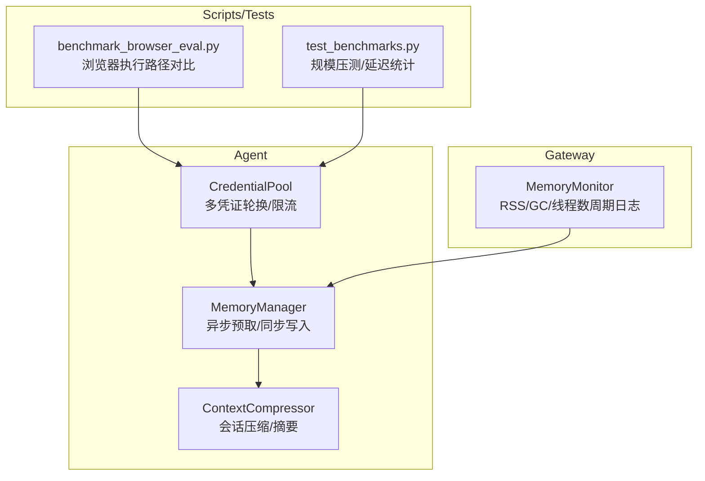
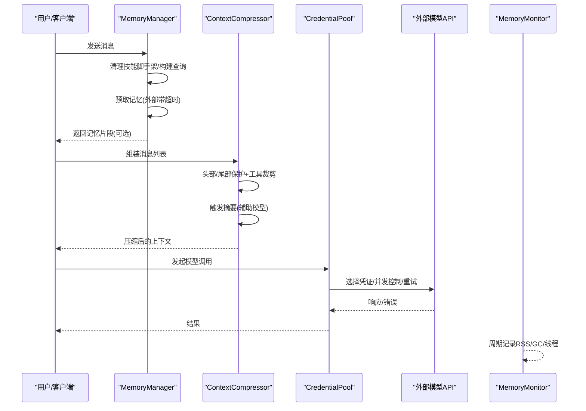
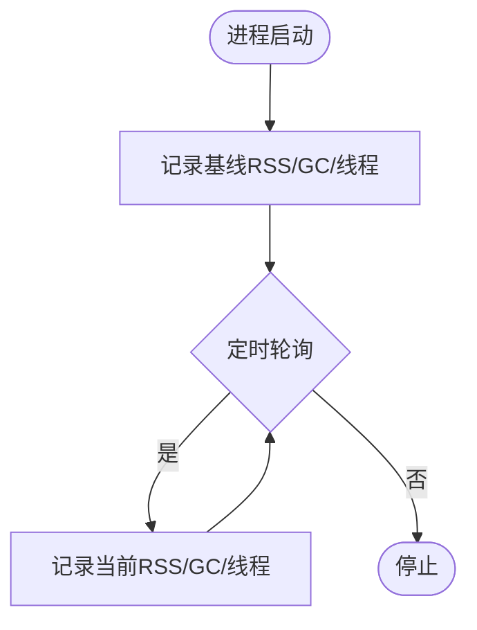
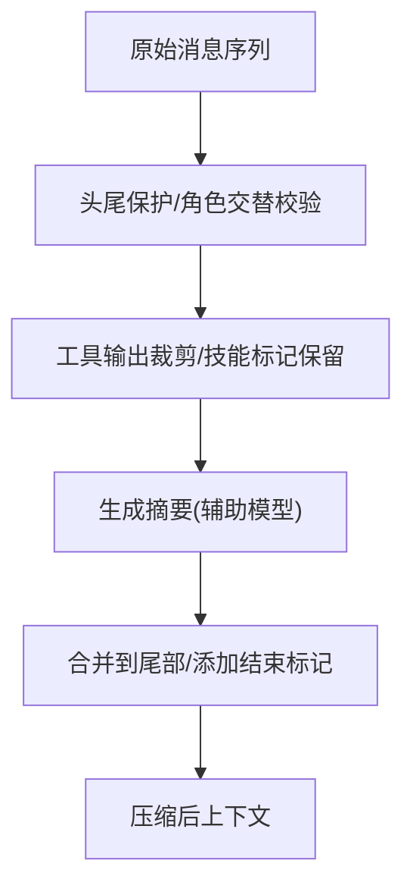
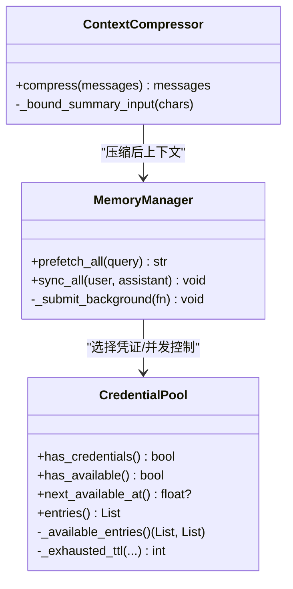
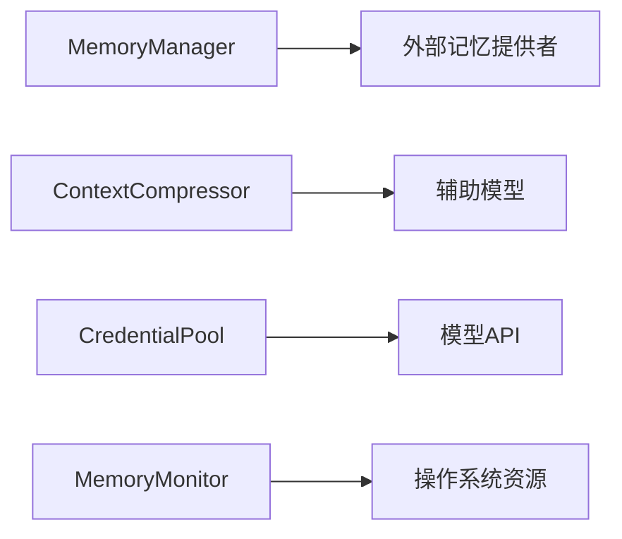

# 性能优化

<cite>
**本文引用的文件**
- [agent/memory_manager.py](file://agent/memory_manager.py)
- [gateway/memory_monitor.py](file://gateway/memory_monitor.py)
- [agent/context_compressor.py](file://agent/context_compressor.py)
- [agent/credential_pool.py](file://agent/credential_pool.py)
- [scripts/benchmark_browser_eval.py](file://scripts/benchmark_browser_eval.py)
- [tests/stress/test_benchmarks.py](file://tests/stress/test_benchmarks.py)
</cite>

## 目录
1. [简介](#简介)
2. [项目结构](#项目结构)
3. [核心组件](#核心组件)
4. [架构总览](#架构总览)
5. [详细组件分析](#详细组件分析)
6. [依赖关系分析](#依赖关系分析)
7. [性能注意事项](#性能注意事项)
8. [故障排查指南](#故障排查指南)
9. [结论](#结论)
10. [附录](#附录)

## 简介
本指南面向生产与高负载场景，围绕以下目标提供可落地的优化方案：内存管理（垃圾回收、内存池、泄漏检测）、上下文处理（压缩、缓存、索引）、AI模型调用（批处理、连接池、超时）、数据库（查询、索引、连接池）、网络（HTTP复用、DNS、代理）、容器化（资源限制、监控指标），以及基准测试方法与效果评估。内容基于仓库中现有实现进行提炼与扩展，确保建议与代码行为一致。

## 项目结构
与性能密切相关的模块分布在 agent、gateway、scripts 与 tests 等目录：
- 内存管理与监控：memory_manager、memory_monitor
- 上下文压缩与摘要：context_compressor
- 凭证与并发控制：credential_pool
- 基准脚本与压测：benchmark_browser_eval、test_benchmarks

**图表来源**
- [agent/memory_manager.py:364-757](file://agent/memory_manager.py#L364-L757)
- [gateway/memory_monitor.py:139-224](file://gateway/memory_monitor.py#L139-L224)
- [agent/context_compressor.py:1-180](file://agent/context_compressor.py#L1-L180)
- [agent/credential_pool.py:633-714](file://agent/credential_pool.py#L633-L714)
- [scripts/benchmark_browser_eval.py:58-139](file://scripts/benchmark_browser_eval.py#L58-L139)
- [tests/stress/test_benchmarks.py:56-222](file://tests/stress/test_benchmarks.py#L56-L222)

**章节来源**
- [agent/memory_manager.py:364-757](file://agent/memory_manager.py#L364-L757)
- [gateway/memory_monitor.py:139-224](file://gateway/memory_monitor.py#L139-L224)
- [agent/context_compressor.py:1-180](file://agent/context_compressor.py#L1-L180)
- [agent/credential_pool.py:633-714](file://agent/credential_pool.py#L633-L714)
- [scripts/benchmark_browser_eval.py:58-139](file://scripts/benchmark_browser_eval.py#L58-L139)
- [tests/stress/test_benchmarks.py:56-222](file://tests/stress/test_benchmarks.py#L56-L222)

## 核心组件
- 内存管理器（MemoryManager）
  - 统一编排内置与外部记忆提供者；预取与同步写入走后台单工作线程序列化，避免阻塞主流程；对外部预取设置超时保护。
- 上下文压缩器（ContextCompressor）
  - 对长对话进行滚动/批量压缩，维护头部/尾部保护、工具输出裁剪、技能指令保留标记、摘要失败降级与输入字符上限，降低提示词体积与成本。
- 凭证池（CredentialPool）
  - 多凭证轮换、冷却退避、唯一凭证短冷却、按错误码分类的退避策略、持久化状态与写回全局认证存储，保障高可用与稳定性。
- 内存监控（MemoryMonitor）
  - 后台守护线程周期性记录 RSS、GC计数、线程数与运行时长，便于定位慢泄漏与线程泄漏。

**章节来源**
- [agent/memory_manager.py:364-757](file://agent/memory_manager.py#L364-L757)
- [agent/context_compressor.py:1-180](file://agent/context_compressor.py#L1-L180)
- [agent/credential_pool.py:633-714](file://agent/credential_pool.py#L633-L714)
- [gateway/memory_monitor.py:139-224](file://gateway/memory_monitor.py#L139-L224)

## 架构总览
下图展示关键组件在请求生命周期中的协作：用户消息进入后，MemoryManager 并行/异步预取记忆，随后 ContextCompressor 根据上下文长度与预算进行压缩并生成摘要；模型调用通过 CredentialPool 选择凭证并控制并发与重试；Gateway 侧 MemoryMonitor 持续观测进程内存。

**图表来源**
- [agent/memory_manager.py:525-595](file://agent/memory_manager.py#L525-L595)
- [agent/context_compressor.py:100-180](file://agent/context_compressor.py#L100-L180)
- [agent/credential_pool.py:633-714](file://agent/credential_pool.py#L633-L714)
- [gateway/memory_monitor.py:139-224](file://gateway/memory_monitor.py#L139-L224)

## 详细组件分析

### 内存管理策略
- 垃圾回收调优
  - 使用 MemoryMonitor 定期采集 GC 计数与 RSS，结合运行时长观察趋势，识别异常增长。
  - 建议在关键生命周期点（启动基线、压缩前后、关闭前）打印内存快照，便于定位泄漏阶段。
- 内存池配置
  - 通过 CredentialPool 的多凭证与冷却策略减少热点键拥塞；对唯一凭证启用短冷却，避免长时间不可用。
  - 将“无可用条目”日志限速，防止共享日志锁风暴导致事件循环卡顿。
- 内存泄漏检测
  - 关注 MemoryMonitor 的 [MEMORY] 行，追踪 rss、gc、threads、uptime 变化；若线程数持续增长或 RSS 单调上升，需检查外部调用、后台任务与未释放资源。

**图表来源**
- [gateway/memory_monitor.py:139-224](file://gateway/memory_monitor.py#L139-L224)

**章节来源**
- [gateway/memory_monitor.py:139-224](file://gateway/memory_monitor.py#L139-L224)
- [agent/credential_pool.py:139-151](file://agent/credential_pool.py#L139-L151)

### 上下文处理优化
- 上下文压缩算法
  - 头部/尾部保护、工具输出裁剪、技能指令保留标记、摘要失败降级、输入字符上限，保证压缩过程稳定且可控。
  - 摘要模板明确“参考信息”边界，避免误解析为活跃任务。
- 缓存策略
  - 压缩产物与摘要具备元数据标记，便于前端/网关过滤渲染；避免重复计算与传输冗余。
- 索引优化
  - 记忆系统通过工具模式暴露检索能力，MemoryManager 注入工具时进行名称规范化与冲突规避，减少无效请求。

**图表来源**
- [agent/context_compressor.py:100-180](file://agent/context_compressor.py#L100-L180)
- [agent/memory_manager.py:110-156](file://agent/memory_manager.py#L110-L156)

**章节来源**
- [agent/context_compressor.py:100-180](file://agent/context_compressor.py#L100-L180)
- [agent/memory_manager.py:110-156](file://agent/memory_manager.py#L110-L156)

### AI模型调用优化
- 请求批处理
  - 利用上下文压缩减少单次请求体量；对辅助模型（摘要）采用独立客户端与输入字符上限，避免大提示导致超时。
- 连接池管理
  - 通过 CredentialPool 控制并发与冷却；对唯一凭证缩短冷却时间，提高恢复速度；对耗尽凭证按错误码分类退避。
- 超时配置
  - 外部记忆预取设置超时，避免阻塞主流程；压缩摘要调用受输入大小与失败冷却保护。

**图表来源**
- [agent/credential_pool.py:633-714](file://agent/credential_pool.py#L633-L714)
- [agent/memory_manager.py:525-757](file://agent/memory_manager.py#L525-L757)
- [agent/context_compressor.py:487-513](file://agent/context_compressor.py#L487-L513)

**章节来源**
- [agent/credential_pool.py:633-714](file://agent/credential_pool.py#L633-L714)
- [agent/memory_manager.py:525-757](file://agent/memory_manager.py#L525-L757)
- [agent/context_compressor.py:487-513](file://agent/context_compressor.py#L487-L513)

### 数据库性能优化
- 查询优化
  - 使用最小必要字段与分页/限制条件；避免全表扫描与大结果集。
- 索引设计
  - 针对高频过滤列建立复合索引；对排序/分组列考虑覆盖索引。
- 连接池配置
  - 合理设置最大连接数与空闲超时；避免连接泄露；在高并发下评估连接争用与锁等待。

[本节为通用指导，不直接分析具体文件]

### 网络性能调优
- HTTP连接复用
  - 复用长连接减少握手开销；对上游服务开启 Keep-Alive。
- DNS解析优化
  - 使用本地缓存或专用解析器；避免频繁解析导致的抖动。
- 代理配置
  - 集中代理策略与超时；对失败节点快速剔除与重试。

[本节为通用指导，不直接分析具体文件]

### 容器化环境下的性能优化
- 资源限制设置
  - 合理设置 CPU/内存限制与请求；避免 OOM 与 CPU 节流影响延迟。
- 监控指标收集
  - 导出进程级指标（RSS、GC、线程数）与应用指标（QPS、延迟分布）；结合告警阈值发现异常。

[本节为通用指导，不直接分析具体文件]

## 依赖关系分析
- MemoryManager 依赖外部记忆提供者，并通过后台线程与超时机制隔离慢/卡死调用。
- ContextCompressor 依赖辅助模型与摘要模板，严格约束输入大小与失败冷却。
- CredentialPool 提供凭证选择、冷却与持久化，影响所有模型调用的成功率与延迟。
- MemoryMonitor 独立于业务流，仅读取进程资源并记录日志。

**图表来源**
- [agent/memory_manager.py:525-595](file://agent/memory_manager.py#L525-L595)
- [agent/context_compressor.py:100-180](file://agent/context_compressor.py#L100-L180)
- [agent/credential_pool.py:633-714](file://agent/credential_pool.py#L633-L714)
- [gateway/memory_monitor.py:139-224](file://gateway/memory_monitor.py#L139-L224)

**章节来源**
- [agent/memory_manager.py:525-595](file://agent/memory_manager.py#L525-L595)
- [agent/context_compressor.py:100-180](file://agent/context_compressor.py#L100-L180)
- [agent/credential_pool.py:633-714](file://agent/credential_pool.py#L633-L714)
- [gateway/memory_monitor.py:139-224](file://gateway/memory_monitor.py#L139-L224)

## 性能注意事项
- 避免在主流程中进行阻塞 I/O；使用后台线程与超时保护（如 MemoryManager 的外部预取）。
- 控制提示词体积与摘要输入大小，防止辅助模型超时或拒绝。
- 凭证池应配合错误分类与冷却策略，避免雪崩与长时间不可用。
- 定期采集内存与线程指标，及时识别泄漏与资源占用异常。
- 基准测试应覆盖不同规模与路径，记录 min/median/max 以评估回归。

[本节为通用指导，不直接分析具体文件]

## 故障排查指南
- 内存泄漏
  - 查看 MemoryMonitor 输出的 [MEMORY] 行，关注 rss、threads、uptime 趋势；若线程数持续增加，检查后台任务是否未退出。
- 上下文压缩失败
  - 检查摘要输入字符上限与失败冷却；确认头部/尾部保护与角色交替逻辑未被破坏。
- 凭证耗尽
  - 查看 CredentialPool 的冷却时间与错误分类；对唯一凭证启用短冷却；必要时扩容凭证数量。
- 基准回归
  - 使用 scripts/benchmark_browser_eval.py 与 tests/stress/test_benchmarks.py 复现实验，比较延迟分布与吞吐变化。

**章节来源**
- [gateway/memory_monitor.py:139-224](file://gateway/memory_monitor.py#L139-L224)
- [agent/context_compressor.py:487-513](file://agent/context_compressor.py#L487-L513)
- [agent/credential_pool.py:139-151](file://agent/credential_pool.py#L139-L151)
- [scripts/benchmark_browser_eval.py:58-139](file://scripts/benchmark_browser_eval.py#L58-L139)
- [tests/stress/test_benchmarks.py:56-222](file://tests/stress/test_benchmarks.py#L56-L222)

## 结论
通过 MemoryManager 的异步预取与超时保护、ContextCompressor 的稳健压缩与降级、CredentialPool 的多凭证与冷却策略，以及 MemoryMonitor 的持续观测，可在复杂交互与高负载环境下显著提升稳定性与性能。配合合理的数据库与网络优化、容器资源限制与监控指标，可实现端到端的性能提升与问题快速定位。

[本节为总结性内容，不直接分析具体文件]

## 附录
- 基准测试方法
  - 浏览器执行路径对比：scripts/benchmark_browser_eval.py 测量 WS 与子进程路径的延迟差异。
  - 规模压测：tests/stress/test_benchmarks.py 在不同任务规模下测量调度、查询与构建上下文的延迟分布。
- 优化效果评估
  - 对比优化前后的 min/median/max 延迟、吞吐与资源占用；结合 MemoryMonitor 的 RSS/GC/线程趋势判断长期健康度。

**章节来源**
- [scripts/benchmark_browser_eval.py:58-139](file://scripts/benchmark_browser_eval.py#L58-L139)
- [tests/stress/test_benchmarks.py:56-222](file://tests/stress/test_benchmarks.py#L56-L222)