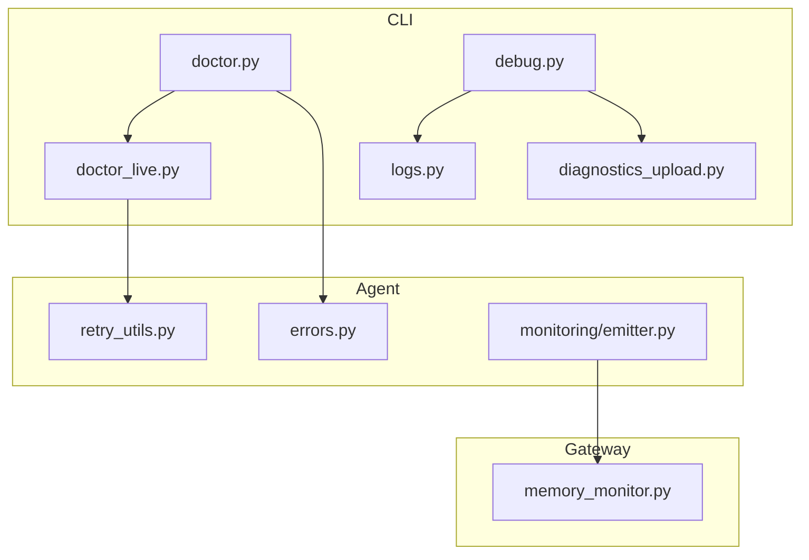
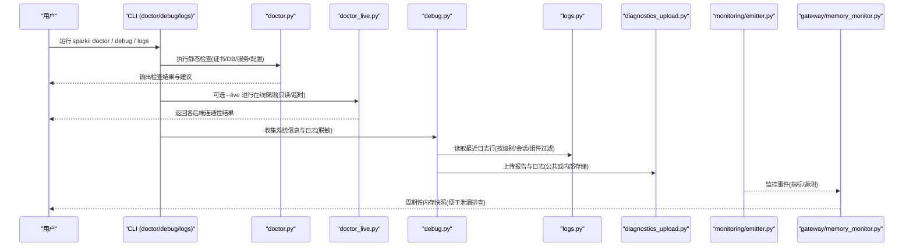
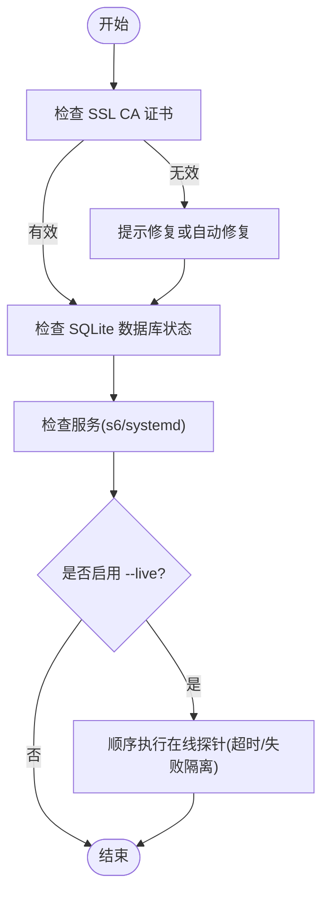
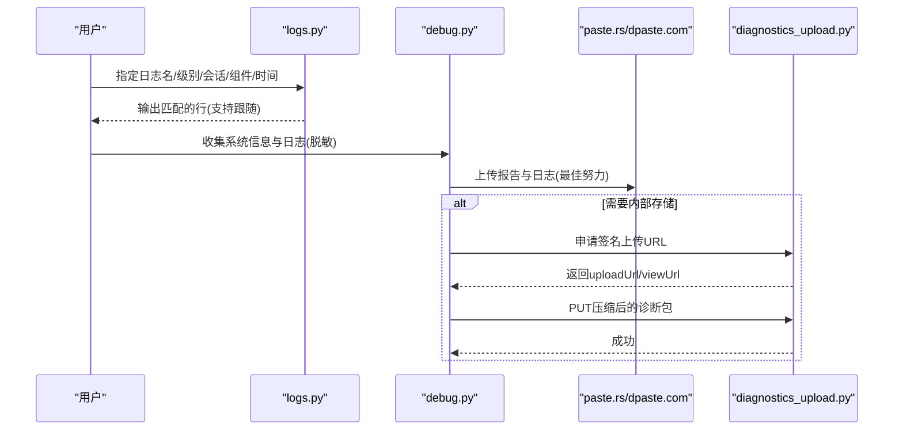
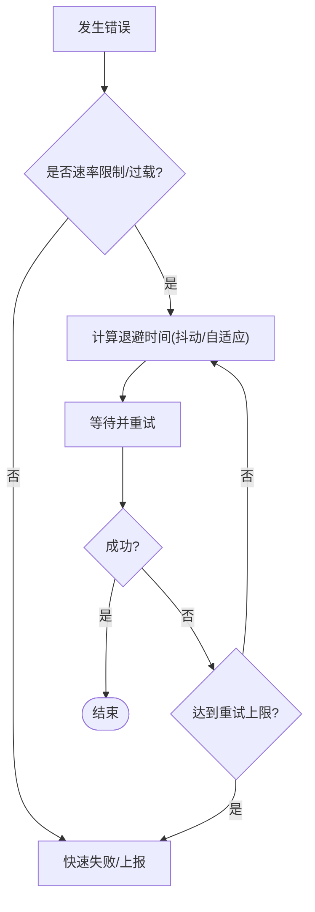
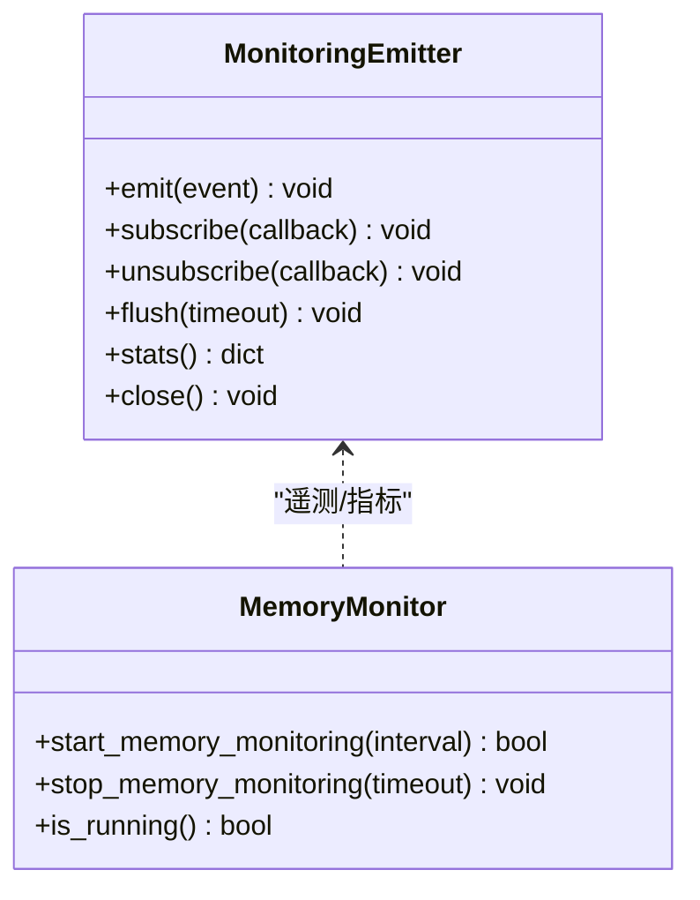

# 故障排除

<cite>
**本文引用的文件**
- [doctor.py](file://sparkii_cli/doctor.py)
- [doctor_live.py](file://sparkii_cli/doctor_live.py)
- [debug.py](file://sparkii_cli/debug.py)
- [logs.py](file://sparkii_cli/logs.py)
- [diagnostics_upload.py](file://sparkii_cli/diagnostics_upload.py)
- [errors.py](file://agent/errors.py)
- [memory_monitor.py](file://gateway/memory_monitor.py)
- [retry_utils.py](file://agent/retry_utils.py)
</cite>

## 目录
1. [简介](#简介)
2. [项目结构](#项目结构)
3. [核心组件](#核心组件)
4. [架构总览](#架构总览)
5. [详细组件分析](#详细组件分析)
6. [依赖关系分析](#依赖关系分析)
7. [性能注意事项](#性能注意事项)
8. [故障排查指南](#故障排查指南)
9. [结论](#结论)
10. [附录](#附录)

## 简介
本指南面向使用 Sparkii Agent 的用户与运维人员，提供系统化的故障排除方法。内容涵盖：
- 诊断工具的使用：doctor 命令、系统检查、依赖验证、在线探针
- 常见错误识别与解决：连接错误、权限问题、内存溢出等
- 性能问题诊断流程：CPU 使用率分析、内存泄漏检测、I/O 瓶颈定位
- 日志分析方法：错误日志过滤、堆栈跟踪分析、上下文信息提取
- 调试模式：详细日志输出、断点调试、性能剖析
- 问题报告模板与社区支持渠道
- 实际故障案例与解决方案

## 项目结构
与故障排除相关的核心模块分布在 CLI、Agent、Gateway 三个层次：
- CLI 层：doctor、debug、logs、diagnostics upload
- Agent 层：错误类型定义、重试策略、监控发射器
- Gateway 层：周期性内存监控

图表来源
- [doctor.py:1-120](file://sparkii_cli/doctor.py#L1-L120)
- [doctor_live.py:1-120](file://sparkii_cli/doctor_live.py#L1-L120)
- [debug.py:1-120](file://sparkii_cli/debug.py#L1-L120)
- [logs.py:1-60](file://sparkii_cli/logs.py#L1-L60)
- [diagnostics_upload.py:1-60](file://sparkii_cli/diagnostics_upload.py#L1-L60)
- [errors.py:1-14](file://agent/errors.py#L1-L14)
- [retry_utils.py:1-60](file://agent/retry_utils.py#L1-L60)
- [memory_monitor.py:1-60](file://gateway/memory_monitor.py#L1-L60)

章节来源
- [doctor.py:1-120](file://sparkii_cli/doctor.py#L1-L120)
- [doctor_live.py:1-120](file://sparkii_cli/doctor_live.py#L1-L120)
- [debug.py:1-120](file://sparkii_cli/debug.py#L1-L120)
- [logs.py:1-60](file://sparkii_cli/logs.py#L1-L60)
- [diagnostics_upload.py:1-60](file://sparkii_cli/diagnostics_upload.py#L1-L60)
- [errors.py:1-14](file://agent/errors.py#L1-L14)
- [retry_utils.py:1-60](file://agent/retry_utils.py#L1-L60)
- [memory_monitor.py:1-60](file://gateway/memory_monitor.py#L1-L60)

## 核心组件
- 诊断与健康检查
  - doctor：静态环境检查、证书校验、数据库健康、服务状态、配置弃用项提示
  - doctor --live：可选的在线后端探测（只读、限流、超时控制）
- 日志与调试
  - logs：查看与过滤日志（级别、会话、组件、时间范围），支持实时跟随
  - debug share：收集系统信息与日志并上传到公共粘贴或内部存储（自动脱敏）
  - diagnostics upload：将诊断包上传至 Nous 内部 S3（签名 URL）
- 可靠性与可观测性
  - retry_utils：抖动退避、速率限制自适应、特定供应商过载处理
  - monitoring emitter：高吞吐、非阻塞的事件发射队列，隔离失败不影响主路径
  - memory_monitor：周期性记录进程 RSS、GC 统计、线程数，辅助内存泄漏定位

章节来源
- [doctor.py:305-418](file://sparkii_cli/doctor.py#L305-L418)
- [doctor_live.py:251-317](file://sparkii_cli/doctor_live.py#L251-L317)
- [logs.py:145-254](file://sparkii_cli/logs.py#L145-L254)
- [debug.py:583-711](file://sparkii_cli/debug.py#L583-L711)
- [diagnostics_upload.py:42-139](file://sparkii_cli/diagnostics_upload.py#L42-L139)
- [retry_utils.py:90-209](file://agent/retry_utils.py#L90-L209)
- [monitoring/emitter.py:36-165](file://agent/monitoring/emitter.py#L36-L165)
- [memory_monitor.py:83-193](file://gateway/memory_monitor.py#L83-L193)

## 架构总览
下图展示从用户触发诊断到日志采集、网络探测、上传与监控的关键调用链。

图表来源
- [doctor.py:305-418](file://sparkii_cli/doctor.py#L305-L418)
- [doctor_live.py:251-317](file://sparkii_cli/doctor_live.py#L251-L317)
- [debug.py:583-711](file://sparkii_cli/debug.py#L583-L711)
- [logs.py:145-254](file://sparkii_cli/logs.py#L145-L254)
- [diagnostics_upload.py:42-139](file://sparkii_cli/diagnostics_upload.py#L42-L139)
- [monitoring/emitter.py:36-165](file://agent/monitoring/emitter.py#L36-L165)
- [memory_monitor.py:83-193](file://gateway/memory_monitor.py#L83-L193)

## 详细组件分析

### 组件 A：doctor 与 doctor --live
- 功能要点
  - 静态检查：Python/uv、SQLite WAL 模式与版本风险、systemd linger、s6 监督、证书有效性
  - 配置与依赖：弃用键/环境变量提示、API Key 提供者可用性、MCP/TTS/STT 配置
  - 在线探针：仅当显式启用时发起只读网络请求，逐个后端探测，超时保护，失败隔离
- 关键流程
  - 证书校验失败时可尝试修复（重新安装 certifi）
  - 数据库健康：列出 state.db 及 kanban 数据库，提示 WAL 暴露风险与修复建议
  - 在线探针：Firecrawl/FAL/Browser/MCP/TTS/STT，按配置跳过未配置的后端
- 适用场景
  - 首次安装后环境自检
  - 升级后依赖/证书/服务状态核查
  - 第三方后端连通性问题快速定位

图表来源
- [doctor.py:646-730](file://sparkii_cli/doctor.py#L646-L730)
- [doctor.py:156-199](file://sparkii_cli/doctor.py#L156-L199)
- [doctor_live.py:251-317](file://sparkii_cli/doctor_live.py#L251-L317)

章节来源
- [doctor.py:646-730](file://sparkii_cli/doctor.py#L646-L730)
- [doctor.py:156-199](file://sparkii_cli/doctor.py#L156-L199)
- [doctor_live.py:251-317](file://sparkii_cli/doctor_live.py#L251-L317)

### 组件 B：日志与调试（logs、debug share）
- 功能要点
  - logs：支持按级别、会话、组件、时间范围过滤；支持实时跟随；大文件高效读取
  - debug share：收集 dump + 多类日志尾部与全文，自动脱敏敏感信息，上传到公共粘贴或内部存储
  - 诊断包上传：通过签名 URL 安全上传至 Nous 内部 S3，支持过期清理
- 关键流程
  - 日志读取：优先读取主日志，回退到轮转日志；大文件采用尾部块读取
  - 脱敏：强制对上传内容进行敏感信息替换，避免泄露
  - 上传：先尝试公共粘贴服务，失败回退；内部存储走两步协议（申请签名 URL → PUT）

图表来源
- [logs.py:145-254](file://sparkii_cli/logs.py#L145-L254)
- [debug.py:583-711](file://sparkii_cli/debug.py#L583-L711)
- [diagnostics_upload.py:42-139](file://sparkii_cli/diagnostics_upload.py#L42-L139)

章节来源
- [logs.py:145-254](file://sparkii_cli/logs.py#L145-L254)
- [debug.py:583-711](file://sparkii_cli/debug.py#L583-L711)
- [diagnostics_upload.py:42-139](file://sparkii_cli/diagnostics_upload.py#L42-L139)

### 组件 C：错误类型与重试策略
- 错误类型
  - SSLConfigurationError：SSL/TLS 证书配置失败
  - EmptyStreamError：流式响应为空
  - MoAPresetNotFoundError：预设不存在
- 重试策略
  - jittered_backoff：指数退避+抖动，避免并发风暴
  - adaptive_rate_limit_backoff：针对特定供应商过载的自适应长等待
  - parse_retry_after_seconds：解析 Retry-After 头，尊重服务端限速指示

图表来源
- [errors.py:1-14](file://agent/errors.py#L1-L14)
- [retry_utils.py:90-209](file://agent/retry_utils.py#L90-L209)

章节来源
- [errors.py:1-14](file://agent/errors.py#L1-L14)
- [retry_utils.py:90-209](file://agent/retry_utils.py#L90-L209)

### 组件 D：监控与内存泄漏检测
- 监控发射器
  - emit() 非阻塞、不抛异常、不阻塞主路径
  - 后台线程批量分发，订阅者失败隔离
  - 提供 flush/stats/close 用于测试与优雅关闭
- 内存监控
  - 周期性记录 RSS、GC 计数、线程数，便于发现缓慢增长
  - 启动时基线快照，关闭时最终快照，便于对比

图表来源
- [monitoring/emitter.py:36-165](file://agent/monitoring/emitter.py#L36-L165)
- [memory_monitor.py:83-193](file://gateway/memory_monitor.py#L83-L193)

章节来源
- [monitoring/emitter.py:36-165](file://agent/monitoring/emitter.py#L36-L165)
- [memory_monitor.py:83-193](file://gateway/memory_monitor.py#L83-L193)

## 依赖关系分析
- 低耦合设计
  - doctor 与 doctor_live 解耦：静态检查与在线探测分离，降低误报与副作用
  - debug 与 logs 协作：统一日志收集与过滤，上传前强制脱敏
  - retry_utils 独立：通用重试逻辑，被上层调用方复用
  - monitoring emitter 与 memory monitor 松耦合：前者负责事件分发，后者专注进程级内存快照
- 外部依赖
  - httpx：在线探针的网络请求
  - paste.rs/dpaste.com：公共粘贴服务
  - Nous 内部 S3：私有诊断包存储（签名 URL）
  - resource/psutil：跨平台 RSS 获取

章节来源
- [doctor_live.py:68-74](file://sparkii_cli/doctor_live.py#L68-L74)
- [diagnostics_upload.py:27-37](file://sparkii_cli/diagnostics_upload.py#L27-L37)
- [memory_monitor.py:52-80](file://gateway/memory_monitor.py#L52-L80)

## 性能注意事项
- CPU 使用率分析
  - 观察 gateway.log/agent.log 中高频任务与工具调用
  - 使用 logs 命令按组件过滤，聚焦热点模块
- 内存泄漏检测
  - 启用并观察 memory_monitor 的周期性 [MEMORY] 行，关注 RSS 持续增长
  - 结合 GC 计数与线程数变化，定位潜在泄漏点
- I/O 瓶颈定位
  - 关注日志中的磁盘读写与网络请求耗时
  - 使用 doctor 检查 SQLite WAL 模式与大小，必要时优化存储
- 重试风暴防护
  - 利用 jittered_backoff 与 adaptive_rate_limit_backoff 降低并发重试导致的雪崩

[本节为通用指导，无需具体文件引用]

## 故障排查指南

### 一、诊断工具使用方法
- 运行基础诊断
  - 执行 sparkii doctor，查看环境、证书、数据库、服务状态与配置弃用项
  - 若证书损坏，可按提示修复或手动重装 certifi
- 启用在线探针
  - 执行 sparkii doctor --live，逐项探测 Firecrawl/FAL/Browser/MCP/TTS/STT
  - 注意：仅做只读元数据查询，不会消耗生成配额
- 查看与过滤日志
  - 使用 sparkii logs 查看最近日志，支持 --level、--session、--component、--since
  - 使用 -f 实时跟随，定位瞬时错误
- 收集并共享调试信息
  - 使用 sparkii debug share 收集系统信息与日志，默认脱敏后上传公共粘贴
  - 如需内部审核，使用 --nous 上传至 Nous 内部存储（需账号服务支持）

章节来源
- [doctor.py:305-418](file://sparkii_cli/doctor.py#L305-L418)
- [doctor_live.py:251-317](file://sparkii_cli/doctor_live.py#L251-L317)
- [logs.py:145-254](file://sparkii_cli/logs.py#L145-L254)
- [debug.py:583-711](file://sparkii_cli/debug.py#L583-L711)
- [diagnostics_upload.py:42-139](file://sparkii_cli/diagnostics_upload.py#L42-L139)

### 二、常见错误类型识别与解决方法
- 连接错误
  - 现象：HTTP 401/403/超时；在线探针失败
  - 排查：检查 API Key、Base URL、代理设置；使用 doctor --live 逐项验证
  - 解决：修正密钥或网络配置；必要时调整超时
- 权限问题
  - 现象：无法读取日志/数据库；PermissionError
  - 排查：确认 ~/.sparkii 目录权限；检查 systemd linger 与 s6 监督状态
  - 解决：修正文件权限；启用 linger 或正确管理服务
- 内存溢出
  - 现象：RSS 持续上升；进程卡顿或崩溃
  - 排查：观察 [MEMORY] 行趋势；结合 GC 与线程数；定位长时间运行的任务
  - 解决：减少缓存规模；优化工具调用；重启服务释放资源
- 证书问题
  - 现象：SSLConfigurationError；HTTPS 请求失败
  - 排查：doctor 证书检查；查看 cacert.pem 完整性
  - 解决：按提示修复或重装 certifi；检查自定义 CA 环境变量

章节来源
- [doctor_live.py:134-169](file://sparkii_cli/doctor_live.py#L134-L169)
- [logs.py:217-223](file://sparkii_cli/logs.py#L217-L223)
- [memory_monitor.py:83-193](file://gateway/memory_monitor.py#L83-L193)
- [errors.py:1-14](file://agent/errors.py#L1-L14)
- [doctor.py:646-730](file://sparkii_cli/doctor.py#L646-L730)

### 三、性能问题诊断流程
- CPU 使用率分析
  - 使用 logs 按组件过滤，识别高频调用与阻塞操作
  - 结合系统工具（如 top/htop）观察进程 CPU 占用
- 内存泄漏检测
  - 开启 memory_monitor，定期抓取 [MEMORY] 行
  - 关注 RSS 增长拐点与 GC 频率变化
- I/O 瓶颈定位
  - 检查 SQLite WAL 模式与大小；必要时离线优化存储
  - 观察日志中的磁盘与网络 I/O 延迟
- 重试风暴防护
  - 使用 jittered_backoff 与 adaptive_rate_limit_backoff 降低并发重试影响
  - 针对特定供应商过载，采用更长等待窗口

章节来源
- [logs.py:145-254](file://sparkii_cli/logs.py#L145-L254)
- [memory_monitor.py:83-193](file://gateway/memory_monitor.py#L83-L193)
- [retry_utils.py:90-209](file://agent/retry_utils.py#L90-L209)
- [doctor.py:156-199](file://sparkii_cli/doctor.py#L156-L199)

### 四、日志分析方法
- 错误日志过滤
  - 使用 --level 筛选 WARNING/ERROR/CRITICAL
  - 使用 --session 过滤特定会话
  - 使用 --component 聚焦相关模块
- 堆栈跟踪分析
  - 在 agent.log/gateway.log 中搜索异常堆栈
  - 结合 debug share 收集的完整日志，定位根因
- 上下文信息提取
  - 使用 --since 限定时间范围，缩小排查面
  - 关注 [MEMORY] 行与工具调用上下文

章节来源
- [logs.py:145-254](file://sparkii_cli/logs.py#L145-L254)
- [debug.py:583-711](file://sparkii_cli/debug.py#L583-L711)
- [memory_monitor.py:83-193](file://gateway/memory_monitor.py#L83-L193)

### 五、调试模式使用
- 详细日志输出
  - 使用 logs 命令实时跟随，观察动态行为
  - 结合组件过滤，聚焦关键路径
- 断点调试
  - 在本地开发环境中插入断点，复现问题
  - 使用 debug share 收集断点前后的日志与状态
- 性能剖析
  - 启用 memory_monitor，观察内存趋势
  - 使用 monitoring emitter 的 stats 与 flush 辅助测试

章节来源
- [logs.py:145-254](file://sparkii_cli/logs.py#L145-L254)
- [debug.py:583-711](file://sparkii_cli/debug.py#L583-L711)
- [monitoring/emitter.py:132-165](file://agent/monitoring/emitter.py#L132-L165)
- [memory_monitor.py:83-193](file://gateway/memory_monitor.py#L83-L193)

### 六、问题报告模板与社区支持
- 问题报告模板
  - 基本信息：操作系统、版本、安装方式
  - 诊断结果：doctor 输出、在线探针结果
  - 日志附件：debug share 生成的链接（已脱敏）
  - 重现步骤：最小化复现场景
  - 期望行为与实际行为
- 社区支持渠道
  - GitHub Issues：提交问题与反馈
  - Discord/论坛：寻求社区帮助
  - 内部支持：使用 --nous 上传诊断包供团队审核

[本节为通用指导，无需具体文件引用]

### 七、实际故障案例与解决方案
- 案例一：证书损坏导致 HTTPS 失败
  - 现象：doctor 报告证书损坏；首次网络请求失败
  - 解决：执行 sparkii doctor --fix 或手动重装 certifi；验证证书恢复
- 案例二：WAL 模式下的数据库风险
  - 现象：doctor 提示 state.db 处于 WAL 模式且存在漏洞风险
  - 解决：升级 SQLite 或执行离线优化存储；避免 WAL 暴露
- 案例三：内存缓慢泄漏
  - 现象：gateway.log 中 [MEMORY] RSS 持续上升
  - 解决：定位长时间运行的任务；减少缓存；重启服务释放资源

章节来源
- [doctor.py:646-730](file://sparkii_cli/doctor.py#L646-L730)
- [doctor.py:156-199](file://sparkii_cli/doctor.py#L156-L199)
- [memory_monitor.py:83-193](file://gateway/memory_monitor.py#L83-L193)

## 结论
通过 doctor、logs、debug、retry 与 memory_monitor 的组合，可以系统化地诊断与解决常见问题。建议在日常维护中：
- 定期执行 doctor 检查环境与依赖
- 使用 logs 与 debug share 快速定位问题
- 启用 memory_monitor 监控内存趋势
- 合理配置重试策略，避免并发风暴

[本节为总结，无需具体文件引用]

## 附录
- 常用命令速查
  - sparkii doctor：静态环境检查
  - sparkii doctor --live：在线后端探测
  - sparkii logs：查看与过滤日志
  - sparkii debug share：收集并上传调试信息
  - sparkii update：更新到最新版本
- 参考文档
  - 配置文件说明：config.yaml 相关选项
  - 供应商文档：各模型/工具的认证与限流策略

[本节为补充信息，无需具体文件引用]