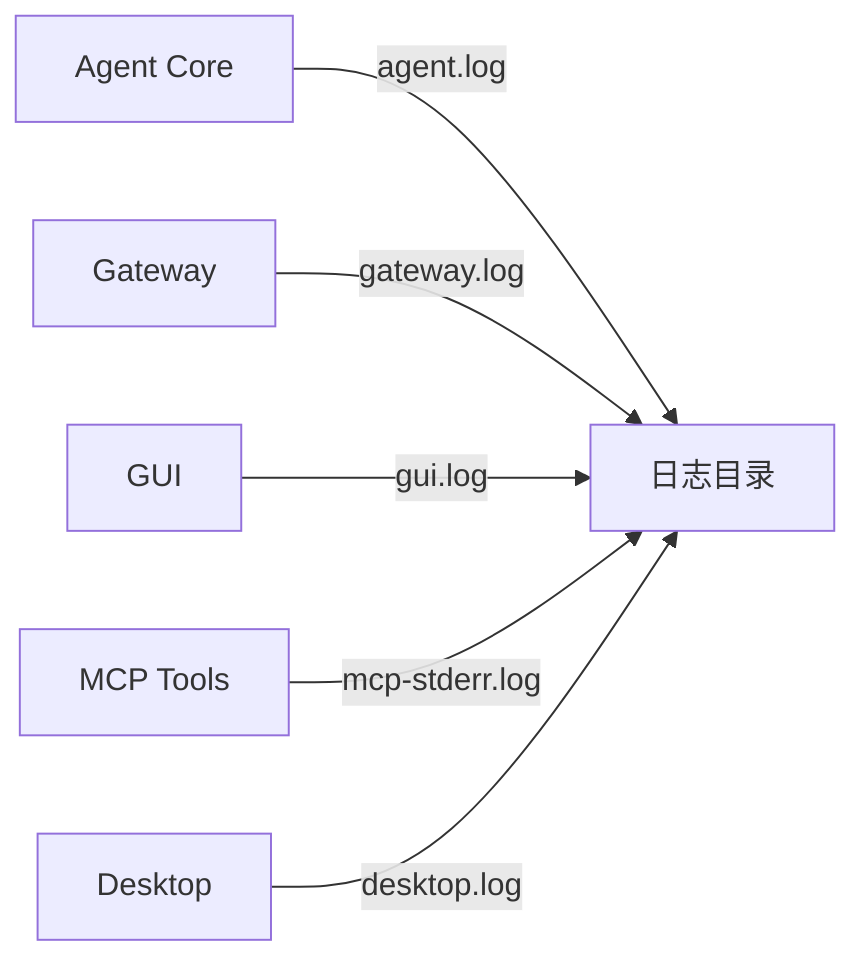

# 日志收集机制

<cite>
**本文引用的文件**
- [sparkii_cli/logs.py](file://sparkii_cli/logs.py)
- [agent/monitoring/events.py](file://agent/monitoring/events.py)
- [gateway/stream_events.py](file://gateway/stream_events.py)
</cite>

## 目录
1. [简介](#简介)
2. [日志分类系统](#日志分类系统)
3. [日志文件结构](#日志文件结构)
4. [日志轮转策略](#日志轮转策略)
5. [日志过滤与查询](#日志过滤与查询)
6. [安全与权限](#安全与权限)
7. [结论](#结论)

## 简介
本文档详细介绍SparkiiDesktop的日志收集机制。系统采用分级日志架构，将不同类型的日志分离存储，便于问题定位和性能监控。所有日志文件统一存放在`~/.sparkii/logs/`目录下。

## 日志分类系统

### 日志文件类型
| 日志文件 | 用途 | 生成位置 |
|----------|------|----------|
| agent.log | 代理核心运行日志 | agent模块主循环 |
| errors.log | 错误与异常日志 | 全局异常捕获器 |
| gateway.log | 网关服务日志 | gateway模块 |
| gui.log | 图形界面日志 | dashboard/pty/ws |
| desktop.log | 桌面应用日志 | Electron启动/后端 |
| mcp-stderr.log | MCP工具错误日志 | MCP子进程stderr |



## 日志文件结构

### 目录布局
```
~/.sparkii/logs/
├── agent.log          # 代理核心日志
├── errors.log         # 错误日志
├── gateway.log        # 网关日志
├── gui.log            # GUI日志
├── desktop.log        # 桌面日志
└── mcp-stderr.log     # MCP工具日志
```

### 日志行格式
每条日志行遵循统一格式：
```
2026-08-10 14:30:00,123 INFO agent.core: Processing message...
```

## 日志轮转策略

### 轮转规则
- **文件大小限制**：单个日志文件最大10MB
- **时间轮转**：每日自动轮转
- **保留策略**：保留最近7天的日志文件
- **压缩设置**：对旧日志进行gzip压缩

### 自动清理
系统启动时自动清理过期日志，避免磁盘空间耗尽。

## 日志过滤与查询

### 命令行工具
```bash
sparkii logs                    # 查看agent.log最后50行
sparkii logs -f                 # 实时跟踪agent.log
sparkii logs errors             # 查看errors.log
sparkii logs gateway -n 100    # 查看gateway.log最后100行
sparkii logs --level WARNING    # 只显示WARNING级别以上
sparkii logs --session abc123   # 按会话ID过滤
sparkii logs --since 1h         # 最近1小时的日志
```

### 过滤参数
- `--level`：日志级别过滤(DEBUG/INFO/WARNING/ERROR/CRITICAL)
- `--session`：按会话ID子串过滤
- `--component`：按组件名称过滤
- `--since`：相对时间过滤(如1h、30m、2d)

## 安全与权限

### 敏感信息保护
- 日志中不记录API密钥、令牌等敏感凭证
- 错误消息自动脱敏处理
- MCP子进程stderr重定向到独立日志文件

### 文件权限
- 日志文件仅限当前用户读写
- 日志目录权限设置为700

## 结论
SparkiiDesktop的日志收集机制采用分级存储设计，支持灵活的过滤查询。通过统一的日志格式和轮转策略，确保系统运行状态可追溯、可监控。

