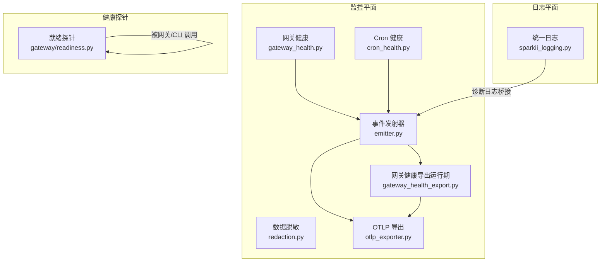
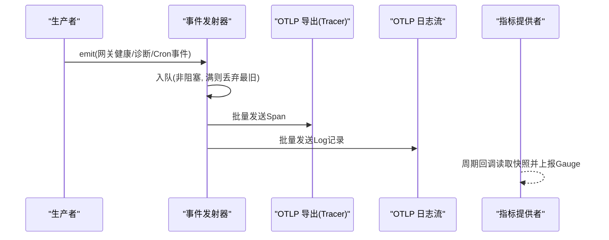
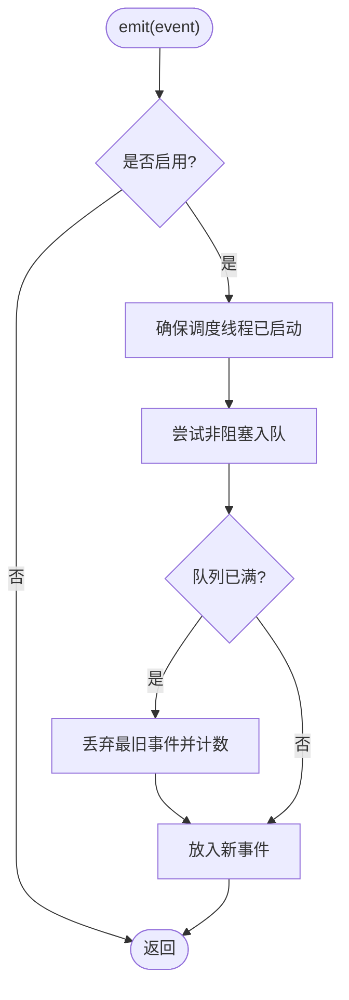
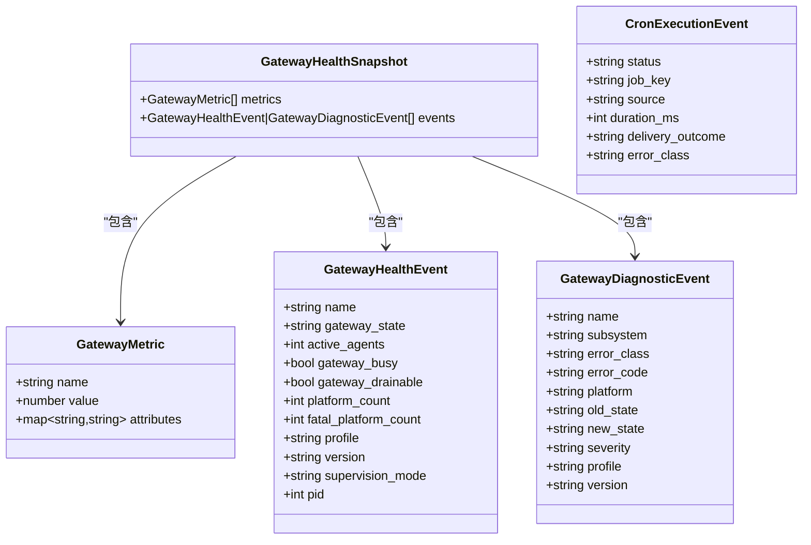
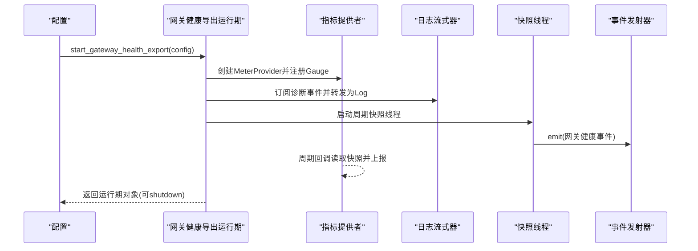
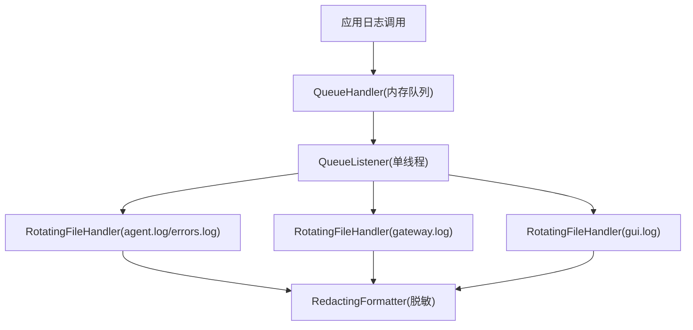
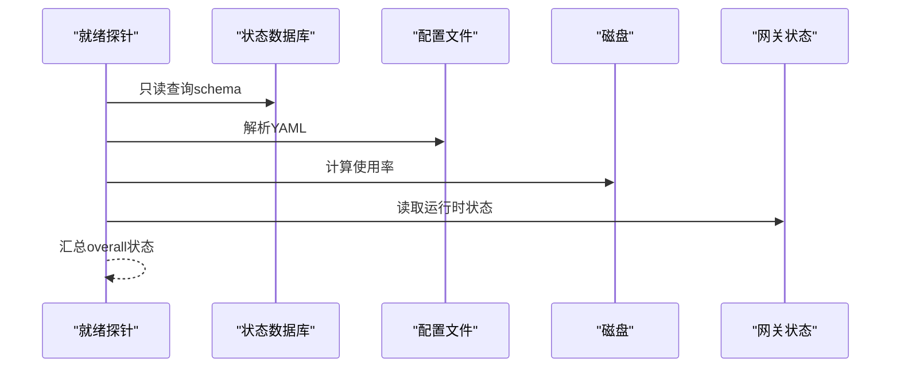
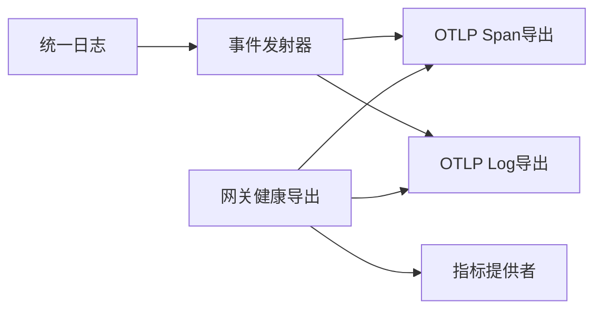

# 监控和日志

<cite>
**本文引用的文件**
- [agent/monitoring/__init__.py](file://agent/monitoring/__init__.py)
- [agent/monitoring/emitter.py](file://agent/monitoring/emitter.py)
- [agent/monitoring/events.py](file://agent/monitoring/events.py)
- [agent/monitoring/gateway_health.py](file://agent/monitoring/gateway_health.py)
- [agent/monitoring/gateway_health_export.py](file://agent/monitoring/gateway_health_export.py)
- [agent/monitoring/otlp_exporter.py](file://agent/monitoring/otlp_exporter.py)
- [agent/monitoring/redaction.py](file://agent/monitoring/redaction.py)
- [gateway/readiness.py](file://gateway/readiness.py)
- [sparkii_logging.py](file://sparkii_logging.py)
</cite>

## 目录
1. [简介](#简介)
2. [项目结构](#项目结构)
3. [核心组件](#核心组件)
4. [架构总览](#架构总览)
5. [详细组件分析](#详细组件分析)
6. [依赖关系分析](#依赖关系分析)
7. [性能考量](#性能考量)
8. [故障排查指南](#故障排查指南)
9. [结论](#结论)
10. [附录：配置与示例](#附录：配置与示例)

## 简介
本文件面向运维与平台工程团队，系统化说明 Sparkii（Hermes）的监控与日志体系。内容覆盖：
- 指标收集系统架构与配置（OpenTelemetry 集成、自定义指标定义、导出器配置）
- 日志系统使用方法（日志级别、结构化格式、轮转策略）
- 健康检查机制（网关健康检查、Cron 任务健康监控、服务状态检测）
- 监控仪表板配置指南（Grafana 集成思路与关键指标展示）
- 告警规则的配置与管理（阈值设置、通知渠道、升级策略）
- 实际配置示例与故障排查方法

## 项目结构
监控与日志相关代码主要分布在以下模块：
- agent/monitoring：监控事件总线、网关健康快照、Cron 健康快照、OTLP 导出、数据脱敏
- gateway/readiness：运行时就绪探针（磁盘、数据库、配置、网关状态等）
- sparkii_logging.py：统一日志初始化、文件轮转、异步队列落盘、会话上下文注入

图表来源
- [agent/monitoring/emitter.py:1-212](file://agent/monitoring/emitter.py#L1-L212)
- [agent/monitoring/gateway_health.py:1-470](file://agent/monitoring/gateway_health.py#L1-L470)
- [agent/monitoring/cron_health.py:1-202](file://agent/monitoring/cron_health.py#L1-L202)
- [agent/monitoring/otlp_exporter.py:1-271](file://agent/monitoring/otlp_exporter.py#L1-L271)
- [agent/monitoring/gateway_health_export.py:1-644](file://agent/monitoring/gateway_health_export.py#L1-L644)
- [gateway/readiness.py:1-123](file://gateway/readiness.py#L1-L123)
- [sparkii_logging.py:1-801](file://sparkii_logging.py#L1-L801)

章节来源
- [agent/monitoring/__init__.py:1-30](file://agent/monitoring/__init__.py#L1-L30)
- [agent/monitoring/emitter.py:1-212](file://agent/monitoring/emitter.py#L1-L212)
- [agent/monitoring/events.py:1-87](file://agent/monitoring/events.py#L1-L87)
- [agent/monitoring/gateway_health.py:1-470](file://agent/monitoring/gateway_health.py#L1-L470)
- [agent/monitoring/gateway_health_export.py:1-644](file://agent/monitoring/gateway_health_export.py#L1-L644)
- [agent/monitoring/otlp_exporter.py:1-271](file://agent/monitoring/otlp_exporter.py#L1-L271)
- [agent/monitoring/redaction.py:1-72](file://agent/monitoring/redaction.py#L1-L72)
- [gateway/readiness.py:1-123](file://gateway/readiness.py#L1-L123)
- [sparkii_logging.py:1-801](file://sparkii_logging.py#L1-L801)

## 核心组件
- 事件发射器（MonitoringEmitter）：进程内无阻塞事件总线，保证热路径零开销、永不抛异常；支持批量分发与订阅者隔离。
- 事件模型（events.py）：网关健康事件、网关诊断事件、Cron 执行事件，均为内容无关的结构化数据。
- 网关健康快照（gateway_health.py）：从运行时状态构建指标与事件，包含网关/平台状态、忙碌度、可排空性、错误分类等。
- Cron 健康快照（cron_health.py）：采集调度心跳、最近成功时间、积压次数、作业数、超时作业数、运行中作业数等。
- OTLP 导出（otlp_exporter.py）：将事件映射为 OpenTelemetry Span，通过 HTTP 协议发送到配置的 Collector。
- 网关健康导出运行期（gateway_health_export.py）：组合指标提供者、日志流式器、快照线程，统一生命周期管理。
- 数据脱敏（redaction.py）：强制对出口数据进行敏感信息与 PII 清洗，失败时关闭输出。
- 统一日志（sparkii_logging.py）：集中式日志初始化、文件轮转、异步队列落盘、会话上下文注入、组件路由。
- 就绪探针（gateway/readiness.py）：非破坏性健康探测，覆盖状态库、配置、磁盘、网关状态、后台队列等。

章节来源
- [agent/monitoring/emitter.py:1-212](file://agent/monitoring/emitter.py#L1-L212)
- [agent/monitoring/events.py:1-87](file://agent/monitoring/events.py#L1-L87)
- [agent/monitoring/gateway_health.py:1-470](file://agent/monitoring/gateway_health.py#L1-L470)
- [agent/monitoring/cron_health.py:1-202](file://agent/monitoring/cron_health.py#L1-L202)
- [agent/monitoring/otlp_exporter.py:1-271](file://agent/monitoring/otlp_exporter.py#L1-L271)
- [agent/monitoring/gateway_health_export.py:1-644](file://agent/monitoring/gateway_health_export.py#L1-L644)
- [agent/monitoring/redaction.py:1-72](file://agent/monitoring/redaction.py#L1-L72)
- [sparkii_logging.py:1-801](file://sparkii_logging.py#L1-L801)
- [gateway/readiness.py:1-123](file://gateway/readiness.py#L1-L123)

## 架构总览
监控与日志采用“事件总线 + 多路导出”的解耦架构：
- 生产者（网关状态钩子、诊断日志处理器、Cron 执行回调）仅向发射器 emit，不关心后端实现。
- 发射器在独立线程中批量消费并分发给订阅者（OTLP Span/Log/Metric 导出器）。
- 所有导出均失败隔离，不影响主流程。
- 指标以可观察 Gauge 形式周期性上报；诊断事件以 Span/Log 形式实时上报。
- 日志系统通过异步队列避免文件 I/O 阻塞事件循环，并提供跨进程安全的轮转。

图表来源
- [agent/monitoring/emitter.py:1-212](file://agent/monitoring/emitter.py#L1-L212)
- [agent/monitoring/otlp_exporter.py:1-271](file://agent/monitoring/otlp_exporter.py#L1-L271)
- [agent/monitoring/gateway_health_export.py:1-644](file://agent/monitoring/gateway_health_export.py#L1-L644)

## 详细组件分析

### 事件发射器（MonitoringEmitter）
- 设计要点
  - 热路径不变式：emit() 微秒级返回、不阻塞、不抛异常；队列满时丢弃最旧事件。
  - 后台调度线程：按批次（默认 256）拉取并分发给订阅者，单个订阅者异常不影响其他订阅者。
  - 生命周期：懒启动、优雅关闭、统计信息（排队/派发/丢弃/订阅者数量）。
- 复杂度
  - emit(): O(1) 非阻塞入队
  - 分发: O(N) N=订阅者数量，批处理降低网络开销
- 优化点
  - 合理调整 _DRAIN_BATCH 与队列深度，平衡吞吐与延迟
  - 监控 dropped/dispatched 比率，评估背压情况

图表来源
- [agent/monitoring/emitter.py:52-117](file://agent/monitoring/emitter.py#L52-L117)

章节来源
- [agent/monitoring/emitter.py:1-212](file://agent/monitoring/emitter.py#L1-L212)

### 事件模型与网关健康快照
- 事件类型
  - GatewayHealthEvent：网关生命周期与健康快照（状态、活跃代理数、忙碌/可排空标志、平台计数等）
  - GatewayDiagnosticEvent：网关诊断事件（子系统、错误分类、严重级别、版本/资料片等）
  - CronExecutionEvent：Cron 执行生命周期（状态、作业键、耗时、投递结果、错误分类）
- 网关健康快照
  - 指标：网关 up、活跃代理、忙碌、可排空、重启请求、平台 up/degraded、状态标签等
  - 事件：网关生命周期变更、平台致命错误、退出原因分类
  - 安全：实例 ID 哈希化、字段长度限制、白名单状态值、错误分类归一化

图表来源
- [agent/monitoring/events.py:19-87](file://agent/monitoring/events.py#L19-L87)
- [agent/monitoring/gateway_health.py:20-31](file://agent/monitoring/gateway_health.py#L20-L31)

章节来源
- [agent/monitoring/events.py:1-87](file://agent/monitoring/events.py#L1-L87)
- [agent/monitoring/gateway_health.py:20-291](file://agent/monitoring/gateway_health.py#L20-L291)

### Cron 健康快照
- 指标
  - 调度心跳年龄、最近成功时间、积压次数
  - 启用作业数、超时作业数、运行中作业数
- 事件
  - 执行生命周期（claimed/running/completed/failed/unknown），含错误分类与耗时
- 健壮性
  - 各指标读取失败降级为本地警告，不影响整体导出

章节来源
- [agent/monitoring/cron_health.py:1-202](file://agent/monitoring/cron_health.py#L1-L202)

### OTLP 导出与网关健康导出运行期
- OTLP 导出（Span）
  - 将事件映射为 Span 属性（白名单字段），通过 BatchSpanProcessor 批量发送
  - 支持 headers_env 动态解析环境变量，避免硬编码密钥
- 网关健康导出运行期
  - 指标提供者：PeriodicExportingMetricReader 定时回调读取快照并上报 Gauge
  - 日志流式器：将网关诊断事件转为 OTLP LogRecord，保留受控的 source_logger 作为 scope
  - 快照线程：周期性生成并发送网关健康事件（可配置间隔）
  - 生命周期：shutdown 时先停止生产者、再 flush/close，使用守护线程控制超时

图表来源
- [agent/monitoring/gateway_health_export.py:417-637](file://agent/monitoring/gateway_health_export.py#L417-L637)
- [agent/monitoring/otlp_exporter.py:166-216](file://agent/monitoring/otlp_exporter.py#L166-L216)

章节来源
- [agent/monitoring/otlp_exporter.py:1-271](file://agent/monitoring/otlp_exporter.py#L1-L271)
- [agent/monitoring/gateway_health_export.py:1-644](file://agent/monitoring/gateway_health_export.py#L1-L644)

### 数据脱敏（redaction）
- 强制清洗：先敏感信息（令牌、Bearer、API Key 等），后 PII（邮箱、电话、UUID）
- 失败关闭：若脱敏不可用，直接拒绝输出，防止泄露
- 适用范围：所有出站字符串（Span 属性、Log 属性、消息片段）

章节来源
- [agent/monitoring/redaction.py:1-72](file://agent/monitoring/redaction.py#L1-L72)

### 统一日志系统（sparkii_logging）
- 文件与级别
  - agent.log：INFO+，主活动日志
  - errors.log：WARNING+，快速定界
  - gateway.log：INFO+，仅 gateway.* 组件
  - gui.log：INFO+，GUI/TUI-gateway 组件
- 轮转策略
  - RotatingFileHandler（Windows 下使用并发轮转以避免锁冲突）
  - 支持外部轮转检测并自动重开句柄，保障权限与共享
- 异步队列
  - QueueListener 在独立线程写入文件，避免事件循环阻塞
  - 提供 flush/drain 接口用于测试或退出路径
- 会话上下文
  - set_session_context/clear_session_context 注入 session_tag，便于关联追踪
- 组件过滤
  - COMPONENT_PREFIXES 控制不同组件日志路由到对应文件

图表来源
- [sparkii_logging.py:259-376](file://sparkii_logging.py#L259-L376)
- [sparkii_logging.py:415-548](file://sparkii_logging.py#L415-L548)
- [sparkii_logging.py:575-699](file://sparkii_logging.py#L575-L699)

章节来源
- [sparkii_logging.py:1-801](file://sparkii_logging.py#L1-L801)

### 健康检查机制
- 就绪探针（collect_runtime_readiness）
  - state_db：只读查询 schema，避免竞争写锁
  - config：校验 YAML 顶层为映射
  - model：检查是否配置了模型
  - disk：计算使用率，超过阈值标记 degraded
  - gateway：基于运行时状态判断 running/draining
  - background_queues：暴露 API 运行数、完成队列深度、委托数
- 网关健康事件
  - 生命周期变更（starting/draining/stopping/stopped/startup_failed）
  - 平台状态变化与致命错误分类
  - 退出原因分类（信号、计划停止、认证失败、速率限制、超时、网络错误、配置无效、启动失败、平台致命）
- Cron 健康监控
  - 心跳/最近成功时间、积压次数、作业启用/超时/运行中计数
  - 执行事件（状态、耗时、错误分类）

图表来源
- [gateway/readiness.py:27-119](file://gateway/readiness.py#L27-L119)
- [agent/monitoring/gateway_health.py:310-416](file://agent/monitoring/gateway_health.py#L310-L416)
- [agent/monitoring/cron_health.py:148-192](file://agent/monitoring/cron_health.py#L148-L192)

章节来源
- [gateway/readiness.py:1-123](file://gateway/readiness.py#L1-L123)
- [agent/monitoring/gateway_health.py:310-416](file://agent/monitoring/gateway_health.py#L310-L416)
- [agent/monitoring/cron_health.py:148-192](file://agent/monitoring/cron_health.py#L148-L192)

## 依赖关系分析
- 松耦合
  - 发射器与导出器通过订阅者模式解耦，新增导出只需实现 callable(batch)
  - 指标与日志导出各自维护独立的 OTLP Provider/Processor，互不影响
- 外部依赖
  - OpenTelemetry SDK 与 OTLP HTTP 导出器为可选依赖，按需懒加载
  - 日志在 Windows 上使用并发轮转以避免锁冲突
- 潜在循环
  - gateway_health_export 反向引用 otlp_exporter.start_streaming，通过运行时导入避免加载时循环

图表来源
- [agent/monitoring/emitter.py:1-212](file://agent/monitoring/emitter.py#L1-L212)
- [agent/monitoring/gateway_health_export.py:1-644](file://agent/monitoring/gateway_health_export.py#L1-L644)
- [agent/monitoring/otlp_exporter.py:1-271](file://agent/monitoring/otlp_exporter.py#L1-L271)
- [sparkii_logging.py:1-801](file://sparkii_logging.py#L1-L801)

章节来源
- [agent/monitoring/emitter.py:1-212](file://agent/monitoring/emitter.py#L1-L212)
- [agent/monitoring/gateway_health_export.py:1-644](file://agent/monitoring/gateway_health_export.py#L1-L644)
- [agent/monitoring/otlp_exporter.py:1-271](file://agent/monitoring/otlp_exporter.py#L1-L271)
- [sparkii_logging.py:1-801](file://sparkii_logging.py#L1-L801)

## 性能考量
- 事件发射器
  - 非阻塞入队、批处理分发、订阅者失败隔离，确保热路径稳定
  - 建议监控 dropped/dispatched 比率，必要时增大队列或降低生产速率
- OTLP 导出
  - 使用 BatchSpanProcessor/BatchLogRecordProcessor 聚合发送，减少网络往返
  - 指标通过 PeriodicExportingMetricReader 定时上报，避免高频采样
- 日志系统
  - 异步队列避免文件 I/O 阻塞事件循环
  - 跨进程轮转锁在 Windows 上可能成为瓶颈，已做降级与超时保护
- 健康快照
  - 指标回调中读取运行时状态，注意避免昂贵操作；当前实现为轻量读取

[本节为通用性能指导，无需特定文件来源]

## 故障排查指南
- OTLP 导出不可用
  - 现象：启动时提示缺少 OTLP SDK
  - 处理：安装可选依赖 'sparkii-agent[otlp]'，确认 monitoring.export.otlp.endpoint 已配置
  - 参考
    - [agent/monitoring/otlp_exporter.py:37-80](file://agent/monitoring/otlp_exporter.py#L37-L80)
    - [agent/monitoring/gateway_health_export.py:587-637](file://agent/monitoring/gateway_health_export.py#L587-L637)
- 事件丢失
  - 现象：dropped 计数上升
  - 处理：检查队列深度与生产速率，必要时调优 _MAX_QUEUE/_DRAIN_BATCH
  - 参考
    - [agent/monitoring/emitter.py:32-77](file://agent/monitoring/emitter.py#L32-L77)
- 日志未落盘或丢失
  - 现象：外部轮转后仍写入旧文件
  - 处理：确认 ManagedRotatingFileHandler 能检测到 inode 变化并重开句柄
  - 参考
    - [sparkii_logging.py:415-548](file://sparkii_logging.py#L415-L548)
- 就绪探针失败
  - 现象：disk/config/state_db 标记 degraded
  - 处理：检查磁盘空间、配置文件语法、状态数据库可读性
  - 参考
    - [gateway/readiness.py:27-119](file://gateway/readiness.py#L27-L119)
- 诊断事件未上报
  - 现象：网关健康导出未产生日志流
  - 处理：确认 diagnostic_events_enabled 与 OTLP endpoint 配置正确，检查订阅者是否成功注册
  - 参考
    - [agent/monitoring/gateway_health_export.py:571-637](file://agent/monitoring/gateway_health_export.py#L571-L637)

章节来源
- [agent/monitoring/otlp_exporter.py:37-80](file://agent/monitoring/otlp_exporter.py#L37-L80)
- [agent/monitoring/gateway_health_export.py:571-637](file://agent/monitoring/gateway_health_export.py#L571-L637)
- [agent/monitoring/emitter.py:32-77](file://agent/monitoring/emitter.py#L32-L77)
- [sparkii_logging.py:415-548](file://sparkii_logging.py#L415-L548)
- [gateway/readiness.py:27-119](file://gateway/readiness.py#L27-L119)

## 结论
本监控与日志体系以“事件总线 + 多路导出”为核心，兼顾高性能与安全性：
- 指标通过 OTLP 指标端点周期性上报，诊断事件通过 Span/Log 实时上报
- 日志系统提供跨进程安全轮转与异步落盘，避免阻塞主流程
- 健康检查覆盖网关、平台、Cron 与基础设施层面，便于快速定位问题
- 数据脱敏贯穿出口，确保合规与安全

[本节为总结性内容，无需特定文件来源]

## 附录：配置与示例
- OpenTelemetry 集成
  - 启用开关：monitoring.gateway_health_export.enabled
  - 导出端点：monitoring.export.otlp.endpoint（支持 /v1/traces、/v1/metrics、/v1/logs 自动推导）
  - 头部鉴权：monitoring.export.otlp.headers_env 映射环境变量名，避免明文存储密钥
  - 指标导出间隔：monitoring.gateway_health_export.export_interval_seconds
  - 日志导出间隔：monitoring.gateway_health_export.logs_export_interval_seconds
  - 参考
    - [agent/monitoring/gateway_health_export.py:167-182](file://agent/monitoring/gateway_health_export.py#L167-L182)
    - [agent/monitoring/gateway_health_export.py:231-242](file://agent/monitoring/gateway_health_export.py#L231-L242)
    - [agent/monitoring/gateway_health_export.py:417-468](file://agent/monitoring/gateway_health_export.py#L417-L468)
    - [agent/monitoring/gateway_health_export.py:559-568](file://agent/monitoring/gateway_health_export.py#L559-L568)
    - [agent/monitoring/otlp_exporter.py:101-115](file://agent/monitoring/otlp_exporter.py#L101-L115)
- 自定义指标定义
  - 指标命名规范：sparkii.gateway.*、sparkii.platform.*、sparkii.cron.*
  - 指标类型：Gauge（可观察量），通过回调函数读取快照并上报
  - 参考
    - [agent/monitoring/gateway_health_export.py:437-468](file://agent/monitoring/gateway_health_export.py#L437-L468)
- 日志级别与轮转
  - 级别：logging.level（如 INFO/WARNING/DEBUG）
  - 文件大小：logging.max_size_mb
  - 备份数：logging.backup_count
  - 参考
    - [sparkii_logging.py:259-376](file://sparkii_logging.py#L259-L376)
    - [sparkii_logging.py:762-800](file://sparkii_logging.py#L762-L800)
- 健康检查与告警建议
  - 网关 up：sparkii.gateway.up == 0 时触发
  - 平台退化：sparkii.platform.degraded == 1 时触发
  - Cron 心跳过期：sparkii.cron.scheduler.heartbeat_age_seconds > 阈值
  - 磁盘使用率：disk.used_percent >= 90% 时触发
  - 参考
    - [gateway/readiness.py:16-68](file://gateway/readiness.py#L16-L68)
    - [agent/monitoring/gateway_health.py:230-291](file://agent/monitoring/gateway_health.py#L230-L291)
    - [agent/monitoring/cron_health.py:148-192](file://agent/monitoring/cron_health.py#L148-L192)
- Grafana 集成思路
  - 数据源：OpenTelemetry Collector -> Prometheus/Tempo/Loki
  - 面板：网关状态、平台健康、Cron 心跳/积压、磁盘使用率、错误分类分布
  - 告警：基于上述指标阈值配置 Alertmanager 规则，结合邮件/Slack/钉钉等渠道
  - 升级策略：P0/P1 分级，首次通知失败自动重试并升级至更高级别通道

[本节为配置与最佳实践指导，具体数值可根据环境调整]