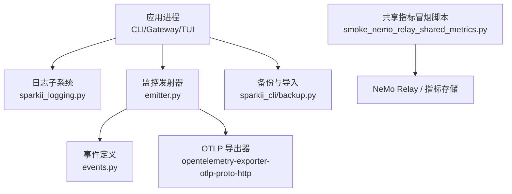
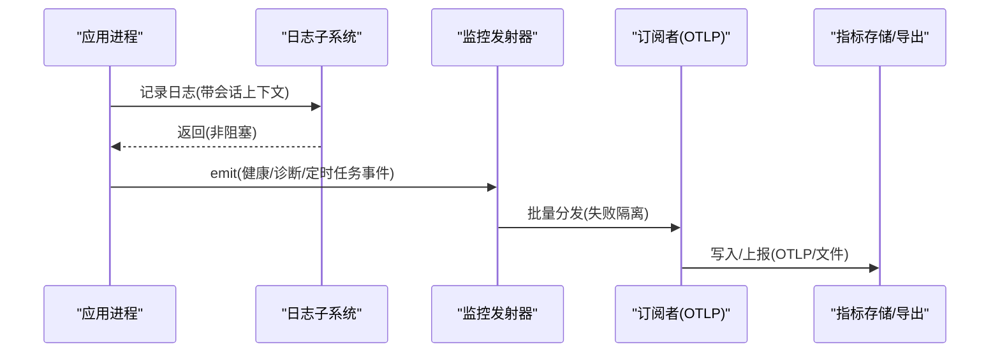
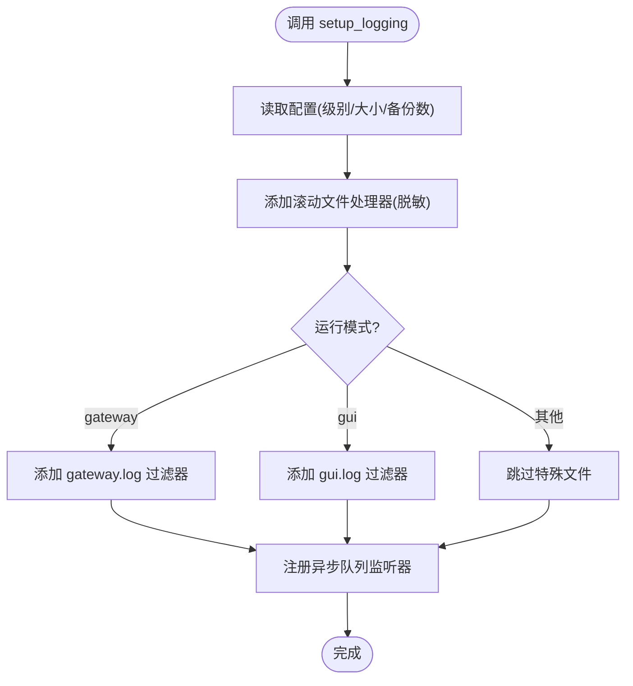
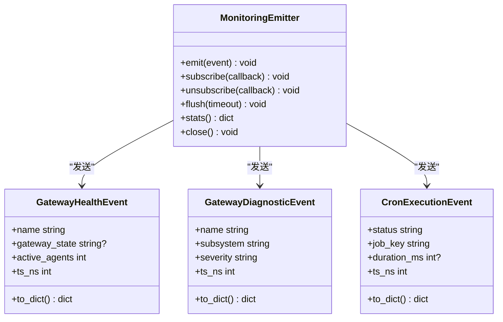
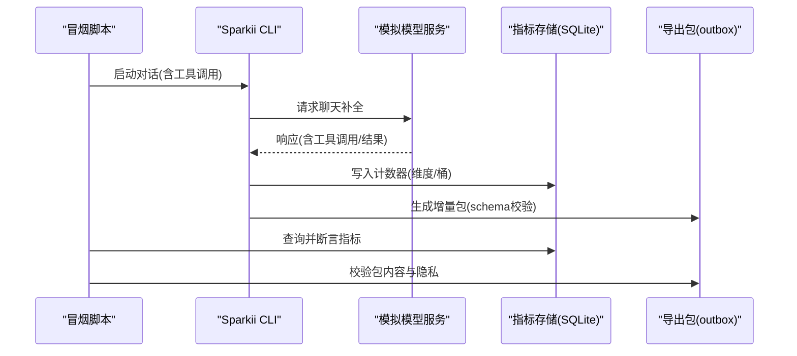
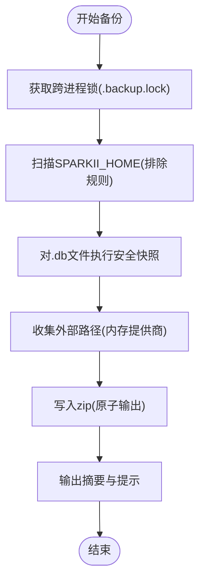
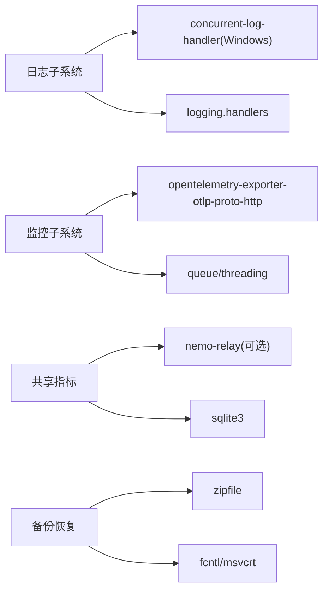

# 运维管理

<cite>
**本文引用的文件**
- [sparkii_logging.py](file://sparkii_logging.py)
- [agent/monitoring/__init__.py](file://agent/monitoring/__init__.py)
- [agent/monitoring/emitter.py](file://agent/monitoring/emitter.py)
- [agent/monitoring/events.py](file://agent/monitoring/events.py)
- [scripts/smoke_nemo_relay_shared_metrics.py](file://scripts/smoke_nemo_relay_shared_metrics.py)
- [sparkii_cli/backup.py](file://sparkii_cli/backup.py)
- [sparkii_agent.egg-info/requires.txt](file://sparkii_agent.egg-info/requires.txt)
</cite>

## 目录
1. [简介](#简介)
2. [项目结构](#项目结构)
3. [核心组件](#核心组件)
4. [架构总览](#架构总览)
5. [详细组件分析](#详细组件分析)
6. [依赖关系分析](#依赖关系分析)
7. [性能考虑](#性能考虑)
8. [故障排除指南](#故障排除指南)
9. [结论](#结论)
10. [附录](#附录)

## 简介
本运维管理文档面向生产与平台团队，聚焦以下能力：监控与日志、指标收集与告警、日志分析、故障排除、性能优化、备份恢复、安全管理、容量规划与扩展策略、以及自动化脚本与工具。内容基于代码库中的日志子系统、监控发射器、共享指标冒烟测试与备份模块实现进行说明，并提供可操作的流程与最佳实践。

## 项目结构
围绕运维相关能力，仓库包含如下关键位置：
- 日志子系统：集中式日志配置、滚动日志、会话上下文注入、跨进程异步落盘
- 监控子系统：健康事件、诊断事件、定时任务执行事件，通过 OTLP 导出
- 指标验证：共享指标端到端冒烟脚本，校验计数器与导出包
- 备份恢复：全量备份与导入、SQLite 一致性快照、外部路径集成
- 依赖与可选功能：OTLP、Nemo Relay、Windows 并发日志等

图表来源
- [sparkii_logging.py:259-376](file://sparkii_logging.py#L259-L376)
- [agent/monitoring/emitter.py:36-117](file://agent/monitoring/emitter.py#L36-L117)
- [agent/monitoring/events.py:19-79](file://agent/monitoring/events.py#L19-L79)
- [scripts/smoke_nemo_relay_shared_metrics.py:258-274](file://scripts/smoke_nemo_relay_shared_metrics.py#L258-L274)
- [sparkii_cli/backup.py:581-795](file://sparkii_cli/backup.py#L581-L795)

章节来源
- [sparkii_logging.py:259-376](file://sparkii_logging.py#L259-L376)
- [agent/monitoring/emitter.py:36-117](file://agent/monitoring/emitter.py#L36-L117)
- [agent/monitoring/events.py:19-79](file://agent/monitoring/events.py#L19-L79)
- [scripts/smoke_nemo_relay_shared_metrics.py:258-274](file://scripts/smoke_nemo_relay_shared_metrics.py#L258-L274)
- [sparkii_cli/backup.py:581-795](file://sparkii_cli/backup.py#L581-L795)

## 核心组件
- 日志子系统
  - 统一入口 setup_logging()，输出 agent.log、errors.log，按模式生成 gateway.log、gui.log
  - 使用 RotatingFileHandler（Windows 下替换为并发版本），配合 RedactingFormatter 脱敏
  - 会话上下文注入，便于按 session_id 过滤与关联
  - 异步队列 + QueueListener 避免阻塞事件循环或热路径
- 监控子系统
  - MonitoringEmitter 提供非阻塞 emit()，后台线程批量分发到订阅者（如 OTLP 导出）
  - 事件类型：GatewayHealthEvent、GatewayDiagnosticEvent、CronExecutionEvent
  - 默认不持久化，仅作为出口通道；无订阅者时直接丢弃
- 共享指标与验证
  - 冒烟脚本驱动一次真实对话，校验共享指标数据库与导出包
  - 支持在配置中启用 shared_metrics 并写入 telemetry/shared_metrics
- 备份与恢复
  - 全量 zip 备份 SPARKII_HOME，排除缓存与可再生目录
  - SQLite 安全快照（WAL 模式一致读），导入时跳过易变运行时文件
  - 支持外部内存提供商声明的额外路径归档

章节来源
- [sparkii_logging.py:259-376](file://sparkii_logging.py#L259-L376)
- [agent/monitoring/emitter.py:36-117](file://agent/monitoring/emitter.py#L36-L117)
- [agent/monitoring/events.py:19-79](file://agent/monitoring/events.py#L19-L79)
- [scripts/smoke_nemo_relay_shared_metrics.py:258-274](file://scripts/smoke_nemo_relay_shared_metrics.py#L258-L274)
- [sparkii_cli/backup.py:581-795](file://sparkii_cli/backup.py#L581-L795)

## 架构总览
系统采用“采集-缓冲-导出”的分层设计：
- 采集层：日志记录器、监控事件生产者、指标埋点
- 缓冲层：日志异步队列、监控环形缓冲区
- 导出层：文件落盘、OTLP 协议导出、共享指标打包与外发

图表来源
- [sparkii_logging.py:550-640](file://sparkii_logging.py#L550-L640)
- [agent/monitoring/emitter.py:91-117](file://agent/monitoring/emitter.py#L91-L117)
- [scripts/smoke_nemo_relay_shared_metrics.py:258-274](file://scripts/smoke_nemo_relay_shared_metrics.py#L258-L274)

## 详细组件分析

### 日志子系统
- 关键职责
  - 初始化多文件处理器：agent.log、errors.log、gateway.log、gui.log
  - 脱敏格式化：RedactingFormatter 防止敏感信息落盘
  - 会话上下文：set_session_context/clear_session_context 注入 session_tag
  - 异步落盘：QueueListener + QueueHandler 避免阻塞
  - Windows 兼容：并发日志锁处理与错误抑制
- 配置要点
  - 日志级别、文件大小、保留份数可从配置读取
  - 组件路由：通过 _ComponentFilter 将特定 logger 前缀路由到对应文件
- 性能特性
  - 异步队列避免事件循环阻塞
  - 外部旋转检测与权限适配（managed mode）

图表来源
- [sparkii_logging.py:259-376](file://sparkii_logging.py#L259-L376)
- [sparkii_logging.py:550-640](file://sparkii_logging.py#L550-L640)

章节来源
- [sparkii_logging.py:259-376](file://sparkii_logging.py#L259-L376)
- [sparkii_logging.py:550-640](file://sparkii_logging.py#L550-L640)

### 监控发射器与事件
- 关键职责
  - 非阻塞 emit：保证热路径不变量，永不阻塞、永不抛出
  - 后台分发：批量拉取队列，扇出到多个订阅者（失败隔离）
  - 事件模型：健康快照、诊断事件、定时任务执行生命周期
- 使用建议
  - 仅在需要时启用（有订阅者才激活）
  - 关注 dropped/dispatched 统计以评估背压与吞吐

图表来源
- [agent/monitoring/emitter.py:36-117](file://agent/monitoring/emitter.py#L36-L117)
- [agent/monitoring/events.py:19-79](file://agent/monitoring/events.py#L19-L79)

章节来源
- [agent/monitoring/emitter.py:36-117](file://agent/monitoring/emitter.py#L36-L117)
- [agent/monitoring/events.py:19-79](file://agent/monitoring/events.py#L19-L79)

### 共享指标与冒烟验证
- 关键职责
  - 通过配置启用 shared_metrics，驱动一次 CLI 对话
  - 校验指标数据库中的计数器维度与值
  - 校验导出包的 schema 与资源字段，确保无敏感数据泄露
- 运维价值
  - 验证指标链路从采集到导出的完整性
  - 快速发现配置错误或依赖缺失导致的指标丢失

图表来源
- [scripts/smoke_nemo_relay_shared_metrics.py:258-274](file://scripts/smoke_nemo_relay_shared_metrics.py#L258-L274)
- [scripts/smoke_nemo_relay_shared_metrics.py:277-419](file://scripts/smoke_nemo_relay_shared_metrics.py#L277-L419)
- [scripts/smoke_nemo_relay_shared_metrics.py:422-551](file://scripts/smoke_nemo_relay_shared_metrics.py#L422-L551)

章节来源
- [scripts/smoke_nemo_relay_shared_metrics.py:258-274](file://scripts/smoke_nemo_relay_shared_metrics.py#L258-L274)
- [scripts/smoke_nemo_relay_shared_metrics.py:277-419](file://scripts/smoke_nemo_relay_shared_metrics.py#L277-L419)
- [scripts/smoke_nemo_relay_shared_metrics.py:422-551](file://scripts/smoke_nemo_relay_shared_metrics.py#L422-L551)

### 备份与恢复
- 关键职责
  - 全量 zip 备份 SPARKII_HOME，排除缓存与可再生目录
  - SQLite 安全快照（WAL 模式），导入时跳过易变运行时文件
  - 支持外部内存提供商声明的路径归档（_external/）
- 运维价值
  - 保障用户数据与配置的可移植性与可恢复性
  - 避免重复依赖与缓存导致备份膨胀

图表来源
- [sparkii_cli/backup.py:150-203](file://sparkii_cli/backup.py#L150-L203)
- [sparkii_cli/backup.py:342-370](file://sparkii_cli/backup.py#L342-L370)
- [sparkii_cli/backup.py:581-795](file://sparkii_cli/backup.py#L581-L795)

章节来源
- [sparkii_cli/backup.py:150-203](file://sparkii_cli/backup.py#L150-L203)
- [sparkii_cli/backup.py:342-370](file://sparkii_cli/backup.py#L342-L370)
- [sparkii_cli/backup.py:581-795](file://sparkii_cli/backup.py#L581-L795)

## 依赖关系分析
- 日志子系统
  - 依赖 concurrent-log-handler（Windows）与标准库 logging.handlers
  - 依赖 RedactingFormatter 进行脱敏
- 监控子系统
  - 依赖 opentelemetry-sdk 与 opentelemetry-exporter-otlp-proto-http（可选）
  - 依赖 queue、threading 实现非阻塞与后台分发
- 共享指标
  - 依赖 NeMo Relay（可选）与 sqlite3 存储
- 备份恢复
  - 依赖 zipfile、sqlite3、fcntl/msvcrt（跨进程锁）

图表来源
- [sparkii_agent.egg-info/requires.txt:28-39](file://sparkii_agent.egg-info/requires.txt#L28-L39)
- [sparkii_agent.egg-info/requires.txt:153-158](file://sparkii_agent.egg-info/requires.txt#L153-L158)
- [sparkii_cli/backup.py:150-203](file://sparkii_cli/backup.py#L150-L203)

章节来源
- [sparkii_agent.egg-info/requires.txt:28-39](file://sparkii_agent.egg-info/requires.txt#L28-L39)
- [sparkii_agent.egg-info/requires.txt:153-158](file://sparkii_agent.egg-info/requires.txt#L153-L158)
- [sparkii_cli/backup.py:150-203](file://sparkii_cli/backup.py#L150-L203)

## 性能考虑
- 日志
  - 使用异步队列与 QueueListener 避免事件循环阻塞
  - 控制日志级别与文件大小，减少 I/O 压力
  - Windows 下并发日志锁超时被静默处理，避免影响主流程
- 监控
  - 环形缓冲区限制最大队列深度，满时丢弃最旧事件，保护内存
  - 批量分发降低网络/磁盘开销
- 指标
  - 共享指标使用分桶与聚合，降低存储与传输成本
  - 冒烟脚本验证端到端链路，避免隐性退化
- 备份
  - 排除缓存与可再生目录，显著减小备份体积
  - SQLite 安全快照避免 WAL 不一致问题

[本节为通用指导，无需具体文件引用]

## 故障排除指南
- 日志问题
  - 症状：日志未写入或丢失
  - 排查：检查 setup_logging 是否被调用、日志级别、文件权限、异步队列是否启动
  - 参考：异步队列与监听器的注册与停止
- 监控问题
  - 症状：指标未上报或丢失
  - 排查：确认是否有订阅者、队列是否满（dropped）、OTLP 端点可达
  - 参考：MonitoringEmitter 的 stats 与 flush
- 指标验证
  - 症状：共享指标校验失败
  - 排查：运行冒烟脚本，检查配置 shared_metrics.enabled、模型服务连通性、导出包 schema
- 备份问题
  - 症状：备份卡住或损坏
  - 排查：检查 .backup.lock、SQLite 快照是否成功、外部路径是否存在且可读
  - 参考：备份锁、安全拷贝与完整性校验

章节来源
- [sparkii_logging.py:550-640](file://sparkii_logging.py#L550-L640)
- [agent/monitoring/emitter.py:133-158](file://agent/monitoring/emitter.py#L133-L158)
- [scripts/smoke_nemo_relay_shared_metrics.py:258-274](file://scripts/smoke_nemo_relay_shared_metrics.py#L258-L274)
- [sparkii_cli/backup.py:150-203](file://sparkii_cli/backup.py#L150-L203)
- [sparkii_cli/backup.py:342-370](file://sparkii_cli/backup.py#L342-L370)

## 结论
本仓库提供了完善的日志、监控、指标与备份能力，具备高可用与低侵入的设计：
- 日志子系统确保跨进程、跨平台稳定落盘与脱敏
- 监控子系统以非阻塞方式采集健康与诊断事件，并通过 OTLP 导出
- 共享指标冒烟脚本保障指标链路的正确性与安全性
- 备份恢复提供一致性与可移植性保障，适合生产环境日常运维

[本节为总结，无需具体文件引用]

## 附录

### 监控与告警配置
- 启用 OTLP 导出
  - 安装可选依赖：opentelemetry-sdk、opentelemetry-exporter-otlp-proto-http
  - 配置 OTLP 端点与认证（由订阅者实现）
- 指标阈值与告警
  - 基于 GatewayHealthEvent 的活跃代理数、繁忙状态、致命平台计数设置阈值
  - 基于 GatewayDiagnosticEvent 的错误等级与子系统设置告警
- 日志级别与轮转
  - 通过配置调整日志级别、文件大小与备份数量
  - 结合 errors.log 快速定位警告与错误

章节来源
- [sparkii_agent.egg-info/requires.txt:153-158](file://sparkii_agent.egg-info/requires.txt#L153-L158)
- [agent/monitoring/events.py:19-79](file://agent/monitoring/events.py#L19-L79)
- [sparkii_logging.py:259-376](file://sparkii_logging.py#L259-L376)

### 日志分析与诊断命令
- 查看日志
  - agent.log：主活动日志
  - errors.log：警告与错误快速定位
  - gateway.log/gui.log：按组件过滤
- 会话过滤
  - 使用 set_session_context 注入 session_id，便于关联同一会话的日志
- 调试模式
  - 启用 verbose 日志，输出更详细的调试信息

章节来源
- [sparkii_logging.py:259-376](file://sparkii_logging.py#L259-L376)

### 性能优化策略
- 内存管理
  - 监控队列深度与丢弃计数，避免内存增长
  - 合理设置日志文件大小与备份数量
- CPU 优化
  - 批量分发监控事件，减少系统调用次数
  - 控制日志级别，减少不必要的 I/O
- 网络调优
  - OTLP 导出批量上报，降低网络开销
  - 确保 OTLP 端点高可用与低延迟

[本节为通用指导，无需具体文件引用]

### 备份恢复方案与流程
- 数据备份
  - 使用备份命令创建 zip，自动排除缓存与可再生目录
  - SQLite 安全快照保证一致性
- 配置备份
  - 备份 SPARKII_HOME 下的配置文件
  - 外部内存提供商路径自动归档
- 灾难恢复
  - 导入备份 zip，跳过易变运行时文件
  - 验证导入后的数据库完整性

章节来源
- [sparkii_cli/backup.py:581-795](file://sparkii_cli/backup.py#L581-L795)
- [sparkii_cli/backup.py:342-370](file://sparkii_cli/backup.py#L342-L370)

### 安全管理最佳实践
- 访问控制
  - 限制备份与导入操作的执行权限
  - 保护敏感文件（.env、auth.json、state.db）的权限
- 审计日志
  - 开启并集中收集 gateway.log 与 errors.log
  - 定期审查日志，识别异常行为
- 安全扫描
  - 使用冒烟脚本验证指标导出不包含敏感数据
  - 定期更新依赖，修复已知漏洞

章节来源
- [sparkii_cli/backup.py:131-139](file://sparkii_cli/backup.py#L131-L139)
- [scripts/smoke_nemo_relay_shared_metrics.py:422-551](file://scripts/smoke_nemo_relay_shared_metrics.py#L422-L551)

### 容量规划与扩展策略
- 水平扩展
  - 多实例部署网关与 TUI，共享指标与日志后端
  - 使用 OTLP 汇聚指标，集中告警与分析
- 垂直扩展
  - 增加内存与 CPU，提升监控与日志处理能力
  - 调整日志轮转参数，平衡磁盘占用与检索效率

[本节为通用指导，无需具体文件引用]

### 运维自动化脚本与工具
- 共享指标冒烟脚本
  - 驱动一次真实对话，校验指标与导出包
  - 用于 CI/CD 中验证指标链路
- 备份与导入
  - 自动化定时备份，保留历史版本
  - 自动化导入与验证，确保恢复可用性

章节来源
- [scripts/smoke_nemo_relay_shared_metrics.py:258-274](file://scripts/smoke_nemo_relay_shared_metrics.py#L258-L274)
- [scripts/smoke_nemo_relay_shared_metrics.py:277-419](file://scripts/smoke_nemo_relay_shared_metrics.py#L277-L419)
- [scripts/smoke_nemo_relay_shared_metrics.py:422-551](file://scripts/smoke_nemo_relay_shared_metrics.py#L422-L551)
- [sparkii_cli/backup.py:581-795](file://sparkii_cli/backup.py#L581-L795)