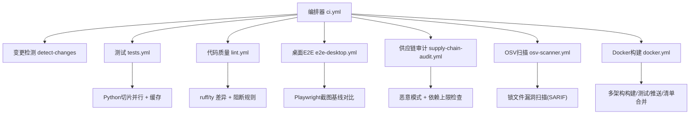
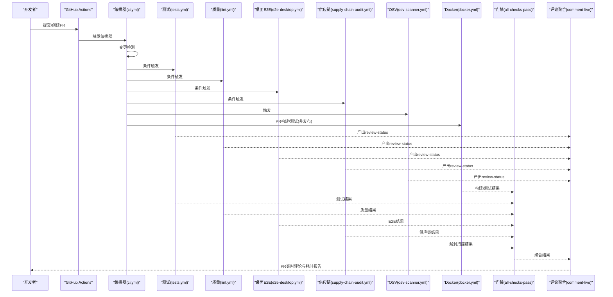
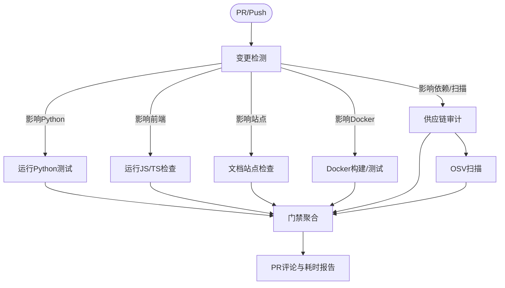
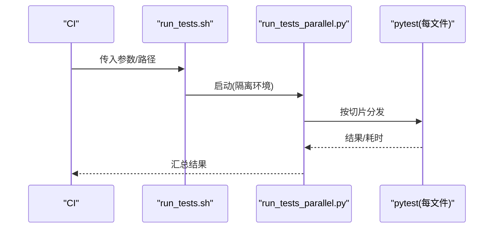
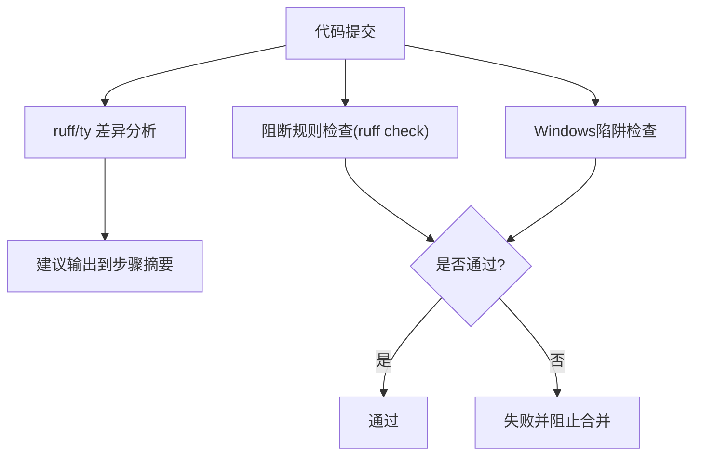
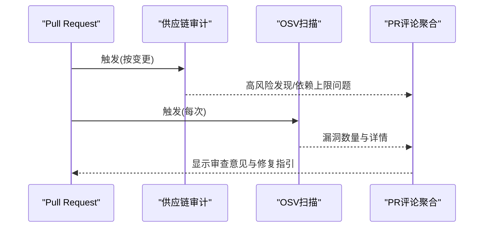
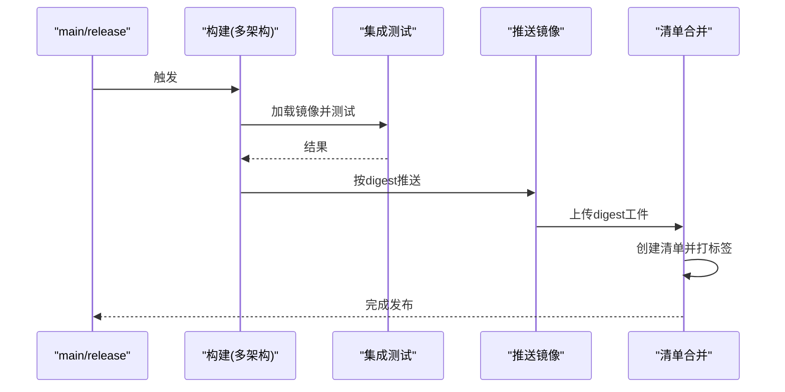
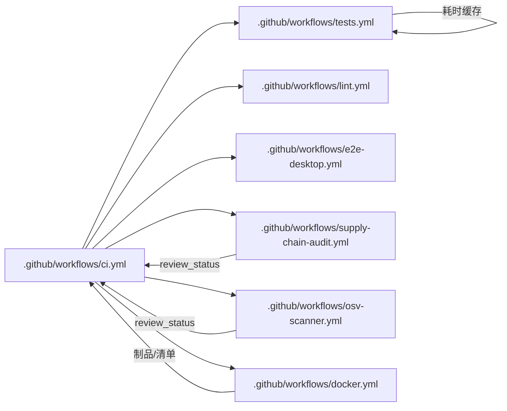

# CI/CD流水线

<cite>
**本文引用的文件**
- [ci.yml](file://.github/workflows/ci.yml)
- [tests.yml](file://.github/workflows/tests.yml)
- [lint.yml](file://.github/workflows/lint.yml)
- [docker.yml](file://.github/workflows/docker.yml)
- [e2e-desktop.yml](file://.github/workflows/e2e-desktop.yml)
- [supply-chain-audit.yml](file://.github/workflows/supply-chain-audit.yml)
- [osv-scanner.yml](file://.github/workflows/osv-scanner.yml)
- [Dockerfile](file://Dockerfile)
- [run_tests.sh](file://scripts/run_tests.sh)
- [pyproject.toml](file://pyproject.toml)
</cite>

## 目录
1. [简介](#简介)
2. [项目结构](#项目结构)
3. [核心组件](#核心组件)
4. [架构总览](#架构总览)
5. [详细组件分析](#详细组件分析)
6. [依赖关系分析](#依赖关系分析)
7. [性能考虑](#性能考虑)
8. [故障排查指南](#故障排查指南)
9. [结论](#结论)
10. [附录](#附录)

## 简介
本指南面向CI/CD流水线配置与落地实践，覆盖GitHub Actions编排、自动化测试、代码质量门禁、制品构建与发布、多分支策略与合并请求工作流、灰度发布与回滚、制品管理与版本控制，以及流水线监控与故障诊断。仓库采用“编排器+子工作流”的模块化设计：单一入口触发检测，按变更范围并行调度测试、Lint、安全扫描、Docker构建与E2E等任务，最终汇总为统一门禁。

## 项目结构
- 编排入口：.github/workflows/ci.yml 作为总控，先执行变更检测，再按需调用各子工作流，最后聚合结果并生成PR评论与耗时报告。
- 测试与质量：tests.yml（Python测试切片并行）、lint.yml（ruff/ty差异与建议、强制阻断规则）、e2e-desktop.yml（桌面端Playwright E2E）。
- 安全与供应链：supply-chain-audit.yml（恶意模式与依赖上限检查）、osv-scanner.yml（锁文件漏洞扫描）。
- 制品与发布：docker.yml（多架构构建、集成测试、推送与清单合并）。
- 运行脚本：scripts/run_tests.sh 提供可复现的本地/CI一致测试执行环境；Dockerfile 定义生产镜像构建流程。

**图示来源**
- [ci.yml:1-391](file://.github/workflows/ci.yml#L1-L391)
- [tests.yml:1-252](file://.github/workflows/tests.yml#L1-L252)
- [lint.yml:1-181](file://.github/workflows/lint.yml#L1-L181)
- [e2e-desktop.yml:1-282](file://.github/workflows/e2e-desktop.yml#L1-L282)
- [supply-chain-audit.yml:1-309](file://.github/workflows/supply-chain-audit.yml#L1-L309)
- [osv-scanner.yml:1-142](file://.github/workflows/osv-scanner.yml#L1-L142)
- [docker.yml:1-290](file://.github/workflows/docker.yml#L1-L290)

**章节来源**
- [ci.yml:1-391](file://.github/workflows/ci.yml#L1-L391)

## 核心组件
- 编排器与门禁
  - 变更检测：仅对受影响的区域触发下游任务，减少无效运行。
  - 统一门禁：all-checks-pass 聚合所有必需检查结果，分支保护只需要求该单一检查。
  - 并发控制：按ref分组，PR下可取消进行中任务，避免资源浪费。
- 测试套件
  - Python测试切片：基于历史耗时进行负载均衡，单文件隔离执行，避免状态泄漏。
  - E2E测试：桌面端使用Xvfb+Playwright，维护主分支截图基线，PR中对比差异。
- 代码质量与安全
  - ruff/ty：生成PR差异建议，同时独立阻断任务强制执行关键规则。
  - 供应链审计：针对高危模式（如.pth、base64+exec、安装钩子）与无上限依赖进行告警或阻断。
  - OSV扫描：对锁文件进行漏洞扫描，输出SARIF至Security面板，不阻断合并但提供可见性。
- 制品构建与发布
  - Docker多架构构建：amd64/arm64分别构建与测试，成功后按digest推送，再合并为清单标签。
  - 环境变量与权限：通过环境作用域与受保护环境限制敏感信息暴露面。

**章节来源**
- [ci.yml:17-391](file://.github/workflows/ci.yml#L17-L391)
- [tests.yml:1-252](file://.github/workflows/tests.yml#L1-L252)
- [lint.yml:1-181](file://.github/workflows/lint.yml#L1-L181)
- [supply-chain-audit.yml:1-309](file://.github/workflows/supply-chain-audit.yml#L1-L309)
- [osv-scanner.yml:1-142](file://.github/workflows/osv-scanner.yml#L1-L142)
- [docker.yml:1-290](file://.github/workflows/docker.yml#L1-L290)

## 架构总览
下图展示从PR/Push到统一门禁的端到端流程，包括并行任务、评论聚合与耗时报告。

**图示来源**
- [ci.yml:17-391](file://.github/workflows/ci.yml#L17-L391)
- [tests.yml:1-252](file://.github/workflows/tests.yml#L1-L252)
- [lint.yml:1-181](file://.github/workflows/lint.yml#L1-L181)
- [e2e-desktop.yml:1-282](file://.github/workflows/e2e-desktop.yml#L1-L282)
- [supply-chain-audit.yml:1-309](file://.github/workflows/supply-chain-audit.yml#L1-L309)
- [osv-scanner.yml:1-142](file://.github/workflows/osv-scanner.yml#L1-L142)
- [docker.yml:1-290](file://.github/workflows/docker.yml#L1-L290)

## 详细组件分析

### 编排器与分支策略
- 触发与权限
  - 在pull_request与main push时触发，设置最小权限（contents/read、security-events/write用于SARIF上传等）。
  - 使用concurrency按ref分组，PR下取消进行中任务，提升吞吐。
- 变更检测
  - 通过自定义action检测受影响区域（Python、前端、站点、Docker元数据、依赖、安装器等），下游任务据此决定是否运行。
- 统一门禁
  - all-checks-pass 聚合所有必需任务结果，分支保护仅需要求该检查；skipped视为成功，failure才失败。
- 评论聚合与耗时报告
  - comment-live轮询任务状态，组装PR评论；ci-timings收集每步耗时，生成HTML报告并与基线对比，上传为工件。

**图示来源**
- [ci.yml:17-391](file://.github/workflows/ci.yml#L17-L391)

**章节来源**
- [ci.yml:17-391](file://.github/workflows/ci.yml#L17-L391)

### 自动化测试策略
- 单元测试与集成测试
  - 使用run_tests.sh确保本地与CI一致的环境与隔离；每个测试文件在独立子进程中执行，避免模块级状态泄漏。
  - 通过run_tests_parallel.py根据历史耗时进行负载均衡切片，提升并行效率。
  - 依赖管理：uv锁定版本，启用缓存；额外功能包按需安装以覆盖测试场景。
- 端到端测试
  - 桌面端E2E使用Xvfb+Playwright，维护主分支截图基线；PR中对比差异并上传报告与可视化diff。
  - 后端服务sparkii serve与Electron前端联合验证，确保整体链路可用。
- 性能测试
  - 当前未包含专用性能测试工作流；可通过扩展tests.yml增加基准测试任务，结合ci-timings进行回归对比。

**图示来源**
- [tests.yml:1-252](file://.github/workflows/tests.yml#L1-L252)
- [run_tests.sh:1-184](file://scripts/run_tests.sh#L1-L184)

**章节来源**
- [tests.yml:1-252](file://.github/workflows/tests.yml#L1-L252)
- [run_tests.sh:1-184](file://scripts/run_tests.sh#L1-L184)

### 代码质量门禁
- 静态分析与类型检查
  - ruff与ty生成PR差异建议，便于审阅；独立的阻断任务强制执行关键规则（如编码问题）。
- Windows陷阱检查
  - 通过脚本检查Windows不安全API用法，提前规避跨平台兼容性问题。
- 依赖上限检查
  - 供应链审计工作流检测新增依赖是否缺少上限约束，防止引入不稳定版本。

**图示来源**
- [lint.yml:1-181](file://.github/workflows/lint.yml#L1-L181)
- [supply-chain-audit.yml:180-256](file://.github/workflows/supply-chain-audit.yml#L180-L256)

**章节来源**
- [lint.yml:1-181](file://.github/workflows/lint.yml#L1-L181)
- [supply-chain-audit.yml:180-256](file://.github/workflows/supply-chain-audit.yml#L180-L256)

### 安全扫描与依赖治理
- 供应链审计
  - 扫描高危模式（.pth、base64+exec、subprocess混淆、安装钩子），必要时阻断合并。
  - 检查新增依赖是否缺少上限约束，提示修复方案。
- OSV漏洞扫描
  - 对多个锁文件进行漏洞扫描，输出SARIF至Security面板；不阻断合并但提供可见性与追踪。

**图示来源**
- [supply-chain-audit.yml:1-309](file://.github/workflows/supply-chain-audit.yml#L1-L309)
- [osv-scanner.yml:1-142](file://.github/workflows/osv-scanner.yml#L1-L142)

**章节来源**
- [supply-chain-audit.yml:1-309](file://.github/workflows/supply-chain-audit.yml#L1-L309)
- [osv-scanner.yml:1-142](file://.github/workflows/osv-scanner.yml#L1-L142)

### 持续部署与制品管理
- 多架构构建与测试
  - amd64与arm64分别构建与加载到本地daemon，直接复用镜像运行集成测试，避免重复构建。
- 发布与清单合并
  - 仅在可信分支（main）或release事件触发发布；按digest推送镜像，随后合并为多架构清单并打标签（main/latest或release tag）。
- 环境与权限
  - 发布任务使用受保护环境，凭据通过secrets注入；PR构建保持无密运行。
- 制品归档
  - 构建产物（如digest文件、报告）以工件形式上传，便于追溯与下载。

**图示来源**
- [docker.yml:1-290](file://.github/workflows/docker.yml#L1-L290)

**章节来源**
- [docker.yml:1-290](file://.github/workflows/docker.yml#L1-L290)

### 多分支策略与合并请求工作流
- 分支策略
  - main分支：触发完整CI与发布；E2E基线更新；Docker推送与清单合并。
  - PR分支：仅对受影响区域运行任务；Docker构建/测试但不发布；评论聚合与耗时报告辅助审阅。
- 合并请求工作流
  - 变更检测驱动任务选择；评论聚合实时反馈；门禁统一判定；供应链与OSV扫描提供安全信号。
- 灰度发布与回滚
  - 当前流水线未实现蓝绿/金丝雀；建议在发布后由外部编排系统（如Kubernetes）执行灰度与回滚，配合制品标签与清单管理。

**章节来源**
- [ci.yml:17-391](file://.github/workflows/ci.yml#L17-L391)
- [docker.yml:1-290](file://.github/workflows/docker.yml#L1-L290)

### 制品管理与版本控制
- Docker镜像
  - 多阶段构建，固定基础镜像与工具版本；嵌入Git SHA以便运行时识别版本；s6-overlay进程监督。
- NPM包与二进制
  - 当前仓库未包含NPM包发布工作流；可在CI中扩展npm publish任务，结合tag与签名校验。
- 二进制归档
  - 可将构建产物（如桌面应用）打包为工件并上传，供下载与验证。

**章节来源**
- [Dockerfile:1-458](file://Dockerfile#L1-L458)
- [docker.yml:1-290](file://.github/workflows/docker.yml#L1-L290)

## 依赖关系分析
- 工作流间依赖
  - ci.yml作为编排器，依赖detect-changes输出决定下游任务；all-checks-pass聚合所有必需任务结果。
- 任务内依赖
  - tests.yml：generate生成切片矩阵，test并行执行，save-durations合并耗时用于未来平衡。
  - lint.yml：lint-diff生成建议，ruff-blocking强制执行规则；windows-footguns独立检查。
  - supply-chain-audit.yml：scan与dep-bounds并行，aggregate汇总review_status与critical_findings。
  - osv-scanner.yml：scan输出SARIF，emit-status解析并生成review_status。
  - docker.yml：build测试通过后publish推送，merge合并清单。

**图示来源**
- [ci.yml:17-391](file://.github/workflows/ci.yml#L17-L391)
- [tests.yml:1-252](file://.github/workflows/tests.yml#L1-L252)
- [lint.yml:1-181](file://.github/workflows/lint.yml#L1-L181)
- [supply-chain-audit.yml:1-309](file://.github/workflows/supply-chain-audit.yml#L1-L309)
- [osv-scanner.yml:1-142](file://.github/workflows/osv-scanner.yml#L1-L142)
- [docker.yml:1-290](file://.github/workflows/docker.yml#L1-L290)

**章节来源**
- [ci.yml:17-391](file://.github/workflows/ci.yml#L17-L391)

## 性能考虑
- 缓存与分层
  - uv依赖缓存、Node/npm缓存、Docker层缓存与GHA缓存（测试耗时、基线截图、CI耗时基线）显著降低冷启动时间。
- 并行化
  - 测试切片并行、多架构构建并行、评论轮询与报告生成异步进行，缩短端到端时长。
- 资源优化
  - 仅对受影响区域运行任务；PR下取消进行中任务；Docker构建重用daemon镜像避免重复拉取。
- 可观测性
  - ci-timings生成HTML报告与步骤摘要，便于定位瓶颈与回归。

[本节为通用指导，无需特定文件引用]

## 故障排查指南
- 构建日志分析
  - 查看ci.yml的comment-live与ci-timings工件，获取PR评论与耗时报告；定位失败任务与步骤。
- 失败原因排查
  - 测试失败：检查run_tests.sh环境与隔离；确认切片划分与依赖缓存；核对API密钥与环境变量。
  - 质量失败：查看ruff/ty差异与建议；确认阻断规则与Windows陷阱检查。
  - 安全扫描：查看supply-chain-audit与osv-scanner的review_status与SARIF结果；按提示修复依赖或代码。
  - Docker构建：检查Buildx设置、网络重试、镜像标签与清单合并步骤；确认受保护环境与凭据。
- 性能优化
  - 利用缓存键与restore-keys命中基线；调整切片数量；减少不必要的全量构建；关注ci-timings中的慢步骤。

**章节来源**
- [ci.yml:192-391](file://.github/workflows/ci.yml#L192-L391)
- [tests.yml:1-252](file://.github/workflows/tests.yml#L1-L252)
- [lint.yml:1-181](file://.github/workflows/lint.yml#L1-L181)
- [supply-chain-audit.yml:1-309](file://.github/workflows/supply-chain-audit.yml#L1-L309)
- [osv-scanner.yml:1-142](file://.github/workflows/osv-scanner.yml#L1-L142)
- [docker.yml:1-290](file://.github/workflows/docker.yml#L1-L290)

## 结论
本仓库的CI/CD体系以编排器为核心，通过变更检测精准调度任务，结合测试、质量、安全与制品构建形成闭环。统一的门禁与评论聚合提升了协作效率，多架构构建与清单合并保障了发布的可靠性。建议在生产环境中补充灰度发布与回滚机制，并持续优化缓存与并行策略以提升流水线性能。

[本节为总结性内容，无需特定文件引用]

## 附录
- 关键配置文件路径
  - 编排器：.github/workflows/ci.yml
  - 测试：.github/workflows/tests.yml、scripts/run_tests.sh
  - 质量：.github/workflows/lint.yml
  - 安全：.github/workflows/supply-chain-audit.yml、.github/workflows/osv-scanner.yml
  - 制品：.github/workflows/docker.yml、Dockerfile
  - 依赖：pyproject.toml

[本节为索引性内容，无需特定文件引用]