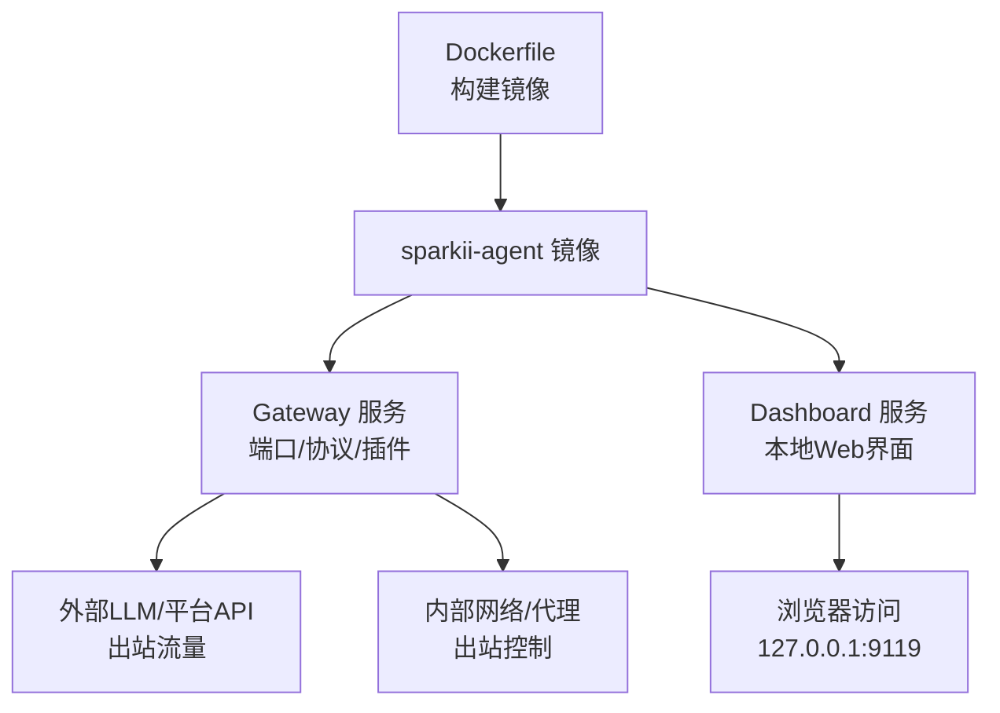
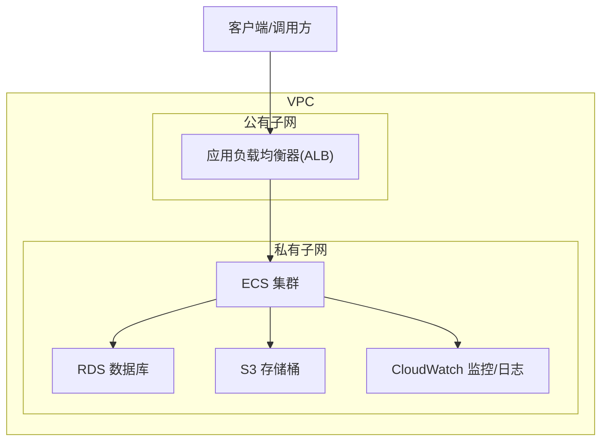
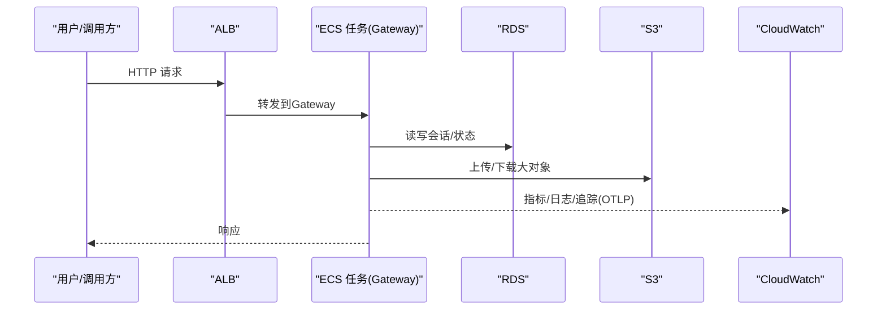
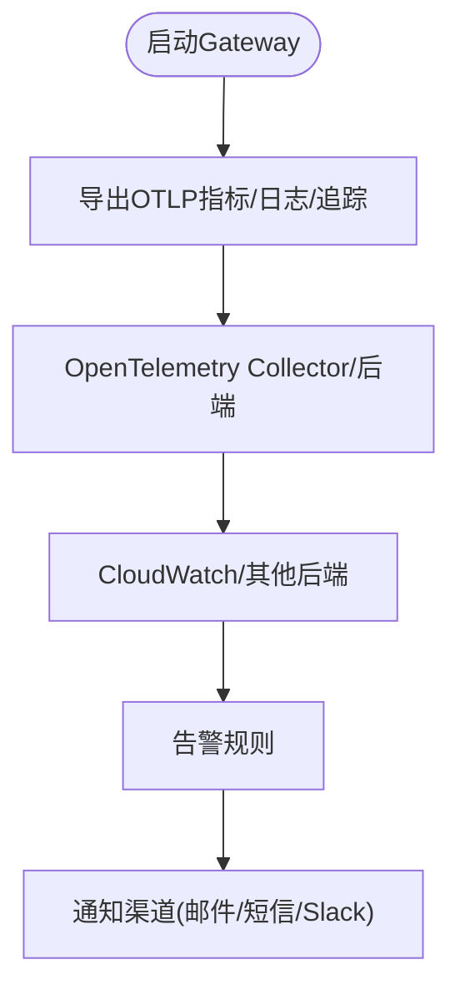
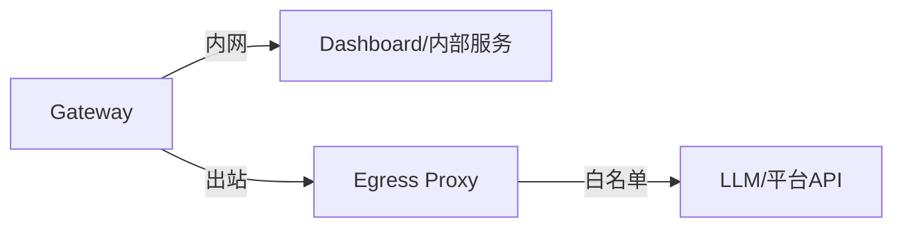
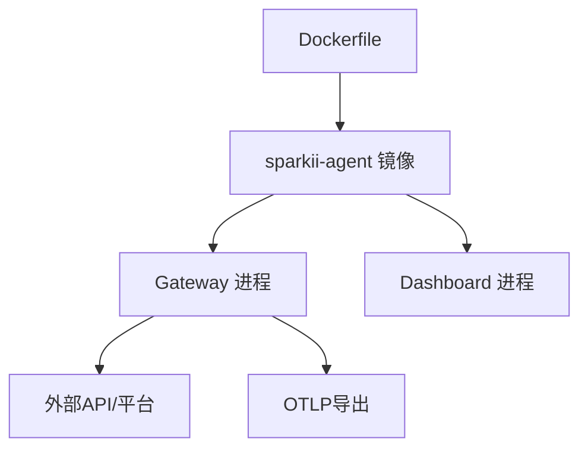

# AWS部署

<cite>
**本文引用的文件**
- [Dockerfile](file://Dockerfile)
- [docker-compose.yml](file://docker-compose.yml)
- [cli-config.yaml.example](file://cli-config.yaml.example)
- [monitoring.md](file://docs/observability/monitoring.md)
- [network-egress-isolation.md](file://docs/security/network-egress-isolation.md)
</cite>

## 目录
1. [简介](#简介)
2. [项目结构](#项目结构)
3. [核心组件](#核心组件)
4. [架构总览](#架构总览)
5. [详细组件分析](#详细组件分析)
6. [依赖关系分析](#依赖关系分析)
7. [性能与成本优化](#性能与成本优化)
8. [故障排查指南](#故障排查指南)
9. [结论](#结论)
10. [附录](#附录)

## 简介
本指南面向在Amazon Web Services（AWS）上部署SpaikiiDesktop（Sparkii Agent）的运维与平台工程团队，提供从EC2实例到ECS容器化、RDS数据库、S3对象存储、CloudWatch监控告警、IAM权限与安全最佳实践、以及成本优化的端到端方案。文档基于仓库中的容器镜像定义、编排配置、可观测性与网络安全设计进行落地指导，确保在生产环境具备高可用、安全合规与可观测性。

## 项目结构
仓库提供了生产就绪的容器镜像构建与运行方式：
- Dockerfile定义了多阶段构建、系统依赖、Python/Node依赖安装、s6-overlay进程管理、只读代码层与可写数据卷等关键特性。
- docker-compose.yml定义了gateway与dashboard两个服务，默认使用host网络并挂载用户目录作为持久化数据卷。
- cli-config.yaml.example展示了数据库、模型、终端执行后端、压缩策略、会话重置、流式输出等配置项。
- docs/observability/monitoring.md描述了OTLP指标/日志/追踪导出能力与采集建议。
- docs/security/network-egress-isolation.md给出了出站网络隔离的Compose示例与验证方法。

**图示来源**
- [Dockerfile:52-458](file://Dockerfile#L52-L458)
- [docker-compose.yml:29-77](file://docker-compose.yml#L29-L77)

**章节来源**
- [Dockerfile:52-458](file://Dockerfile#L52-L458)
- [docker-compose.yml:29-77](file://docker-compose.yml#L29-L77)

## 核心组件
- 容器运行时与进程管理：基于s6-overlay实现主进程、Dashboard与网关服务的监督与重启；ENTRYPOINT通过调度脚本兼容不同编排器。
- 数据持久化：/opt/data为可写数据卷，用于会话、配置、缓存与懒加载包；SQLite默认WAL模式，可在非WAL文件系统降级为DELETE。
- 可观测性：内置OTLP导出（指标/日志/追踪），支持OpenTelemetry Collector或DataDog等后端，内容无关且最小化敏感信息。
- 网络安全：默认host网络便于调试，生产建议采用内网+出站代理的隔离方案，限制出站白名单。

**章节来源**
- [Dockerfile:93-157](file://Dockerfile#L93-L157)
- [Dockerfile:336-458](file://Dockerfile#L336-L458)
- [cli-config.yaml.example:15-19](file://cli-config.yaml.example#L15-L19)
- [monitoring.md:1-72](file://docs/observability/monitoring.md#L1-L72)
- [network-egress-isolation.md:1-61](file://docs/security/network-egress-isolation.md#L1-L61)

## 架构总览
下图展示在AWS上的推荐部署拓扑：ECS托管Gateway与Dashboard，RDS承载持久化，S3用于文件与大对象存储，CloudWatch收集指标与日志，VPC子网与安全组控制入站/出站，IAM最小权限原则。

[此图为概念性架构图，不直接映射具体源码文件]

## 详细组件分析

### EC2部署（参考路径）
- 实例类型选择：根据工作负载选择CPU/内存配比，若包含GPU推理或桌面渲染需求，考虑G系列或P系列；一般Agent网关以通用型（如t3/m5）为主。
- 安全组：仅开放必要端口（如SSH 22、Dashboard 9119仅限内网或经反向代理）。出站默认允许但建议配合NACL/代理限制。
- 网络设置：将实例置于私有子网，通过NAT访问公网；如需暴露Dashboard，使用ALB/Nginx反向代理并启用HTTPS与鉴权。
- 启动参数：参考docker-compose.yml的环境变量与命令，挂载/opt/data到EBS卷以实现持久化。

**章节来源**
- [docker-compose.yml:29-77](file://docker-compose.yml#L29-L77)

### ECS容器化部署
- 任务定义（Task Definition）：
  - 镜像：使用仓库构建的hermes-agent镜像。
  - 资源：分配CPU/内存，合理设置健康检查（HTTP /health或自定义探针）。
  - 环境变量：SPARKII_UID/GID、API_SERVER_KEY（如需）、各平台凭据（Teams/Google Chat等）。
  - 存储：挂载EFS或EBS至/opt/data，或使用Fargate + EFS。
- 服务配置（Service）：
  - 使用Application Load Balancer暴露Dashboard或API Server（需鉴权）。
  - 设置最小/最大副本数，结合自动扩缩容策略。
- 自动扩缩容：
  - 基于CloudWatch指标（CPU、内存、请求数、活跃会话数）触发目标跟踪或步进扩缩容。
  - 关注active_agents、background_work、background_delegations等指标（见可观测性部分）。

**图示来源**
- [docker-compose.yml:29-77](file://docker-compose.yml#L29-L77)
- [monitoring.md:1-72](file://docs/observability/monitoring.md#L1-L72)

**章节来源**
- [docker-compose.yml:29-77](file://docker-compose.yml#L29-L77)
- [monitoring.md:1-72](file://docs/observability/monitoring.md#L1-L72)

### RDS数据库集成
- 引擎选择：PostgreSQL或MySQL均可，考虑到SQLite默认WAL模式，若迁移至RDS，请确认连接池与事务策略。
- 配置要点：
  - 数据库参数组：调整max_connections、shared_buffers、work_mem等。
  - 备份与快照：开启自动备份与跨AZ复制。
  - 安全：仅允许ECS所在子网访问，使用安全组与IAM数据库认证（可选）。
- 迁移策略：从本地SQLite到RDS时，注意WAL兼容性，必要时切换journal_mode为delete。

**章节来源**
- [cli-config.yaml.example:15-19](file://cli-config.yaml.example#L15-L19)

### S3存储桶配置
- 用途：存放会话附件、模型权重、导出结果、审计日志归档等。
- 安全：
  - 使用IAM角色授予ECS任务最小权限（PutObject/GetObject/ListBucket）。
  - 启用KMS加密与访问日志。
- 性能：
  - 使用S3 Transfer Acceleration提升跨区域传输。
  - 合理分片与生命周期策略（归档/删除）。

[本节为通用实践说明，未直接引用具体源码文件]

### CloudWatch监控与日志收集
- 指标：
  - 启用OTLP导出，将Gateway指标发送至Collector或直接接入CloudWatch（通过适配）。
  - 关键指标：sparkii.gateway.up、sparkii.platform.up/degraded、cron心跳与过期计数。
- 日志：
  - 将容器stdout/stderr输出至CloudWatch Logs。
  - 使用结构化字段（service.name、instance.id）聚合多实例视图。
- 告警：
  - Gateway不可用、平台降级、Cron作业失败/超时、缺失序列检测。
  - 阈值建议：基于业务SLA设定，避免误报。

**图示来源**
- [monitoring.md:43-130](file://docs/observability/monitoring.md#L43-L130)

**章节来源**
- [monitoring.md:43-130](file://docs/observability/monitoring.md#L43-L130)

### IAM权限配置与安全最佳实践
- 最小权限：
  - ECS Task Role：仅授予RDS、S3、CloudWatch写入所需权限。
  - Secrets管理：使用AWS Secrets Manager或Parameter Store注入密钥，避免硬编码。
- 访问控制：
  - 使用IAM Roles Anywhere或Workload Identity（如适用）进行身份绑定。
  - 网络层面：出站代理+白名单，限制任意外联。
- 密钥轮换：
  - 定期轮换API Key与数据库密码，自动化更新Secrets。

[本节为通用安全实践说明，未直接引用具体源码文件]

### 出站网络隔离（生产建议）
- 双网络模型：internal（无公网）+ egress（有公网），Gateway双网卡接入两网。
- 出站代理：通过Squid/Envoy对出站HTTPS CONNECT进行白名单控制。
- 验证：从容器内测试外网连通性与内部服务可达性。

**图示来源**
- [network-egress-isolation.md:23-61](file://docs/security/network-egress-isolation.md#L23-L61)

**章节来源**
- [network-egress-isolation.md:62-155](file://docs/security/network-egress-isolation.md#L62-L155)

## 依赖关系分析
- 镜像构建依赖：
  - Debian基础镜像、SQLite固定版本、s6-overlay、uv/Node/npm、Python venv。
- 运行时依赖：
  - 外部LLM提供商（Anthropic/OpenAI/Bedrock等）、消息平台（Telegram/Discord/Slack等）。
- 编排依赖：
  - ECS服务、ALB、RDS、S3、CloudWatch、IAM。

**图示来源**
- [Dockerfile:52-458](file://Dockerfile#L52-L458)

**章节来源**
- [Dockerfile:52-458](file://Dockerfile#L52-L458)

## 性能与成本优化
- 实例类型与弹性：
  - 使用Spot实例降低计算成本，结合Auto Scaling Group容忍中断。
  - 针对突发流量，启用目标跟踪扩缩容（CPU/内存/请求数）。
- 存储优化：
  - RDS使用预置IOPS或GP3按需扩展；S3使用分层存储（标准/IA/归档）。
- 监控与调优：
  - 基于active_agents与background_work调整并发与副本数。
  - 使用上下文压缩减少提示长度与成本。
- 自动停止策略：
  - 开发/测试环境设置定时启停；生产环境保留高可用但限制最大容量。

[本节为通用优化建议，未直接引用具体源码文件]

## 故障排查指南
- 常见问题：
  - 出站被阻断：检查出站代理白名单与NACL。
  - Dashboard无法访问：确认ALB监听器、安全组与反向代理配置。
  - 数据库连接失败：检查RDS安全组、参数组与连接池。
  - 监控缺失：验证OTLP endpoint与Collector可达性。
- 诊断工具：
  - sparkii monitoring status查看导出状态。
  - 使用scripts/observability下的探测脚本验证链路。

**章节来源**
- [monitoring.md:182-195](file://docs/observability/monitoring.md#L182-L195)
- [network-egress-isolation.md:156-172](file://docs/security/network-egress-isolation.md#L156-L172)

## 结论
通过在AWS上使用ECS容器化部署SpaikiiDesktop，并结合RDS、S3、CloudWatch与IAM，可实现高可用、安全合规与可观测的生产环境。遵循出站网络隔离、最小权限与成本优化策略，能够稳定支撑大规模Agent工作负载。建议在灰度发布中逐步验证监控与告警，确保业务SLA达成。

## 附录
- 参考配置：
  - 数据库模式：WAL或DELETE（根据文件系统特性）。
  - 终端执行后端：local/ssh/docker/singularity/modal/daytona（按需选择）。
  - 上下文压缩：阈值与保护条数可调，平衡延迟与成本。
- 快速验证：
  - 使用docker-compose在本地模拟ECS行为，验证出站隔离与监控导出。

**章节来源**
- [cli-config.yaml.example:220-337](file://cli-config.yaml.example#L220-L337)
- [cli-config.yaml.example:407-579](file://cli-config.yaml.example#L407-L579)