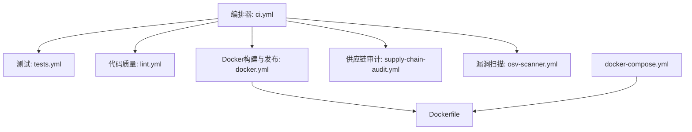
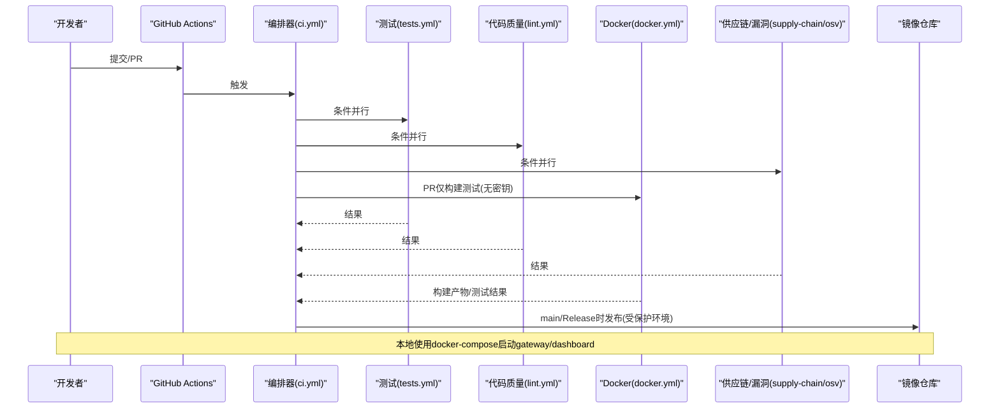
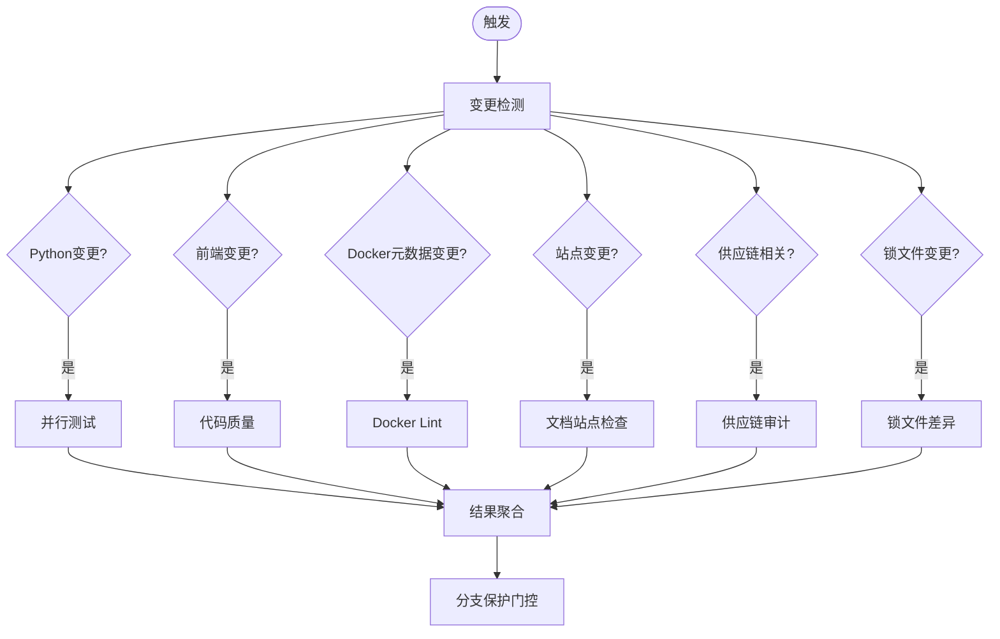
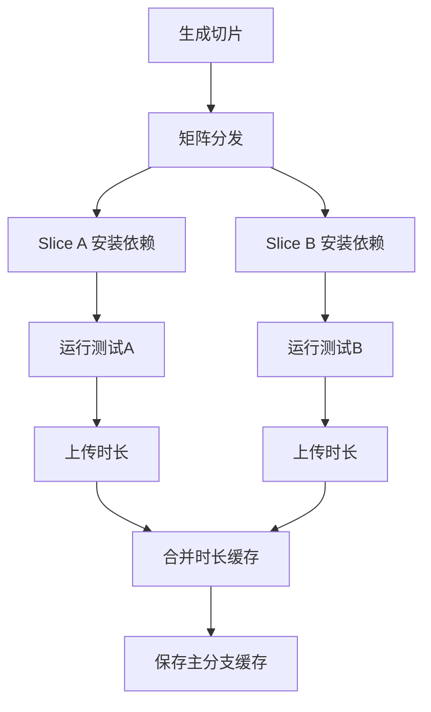
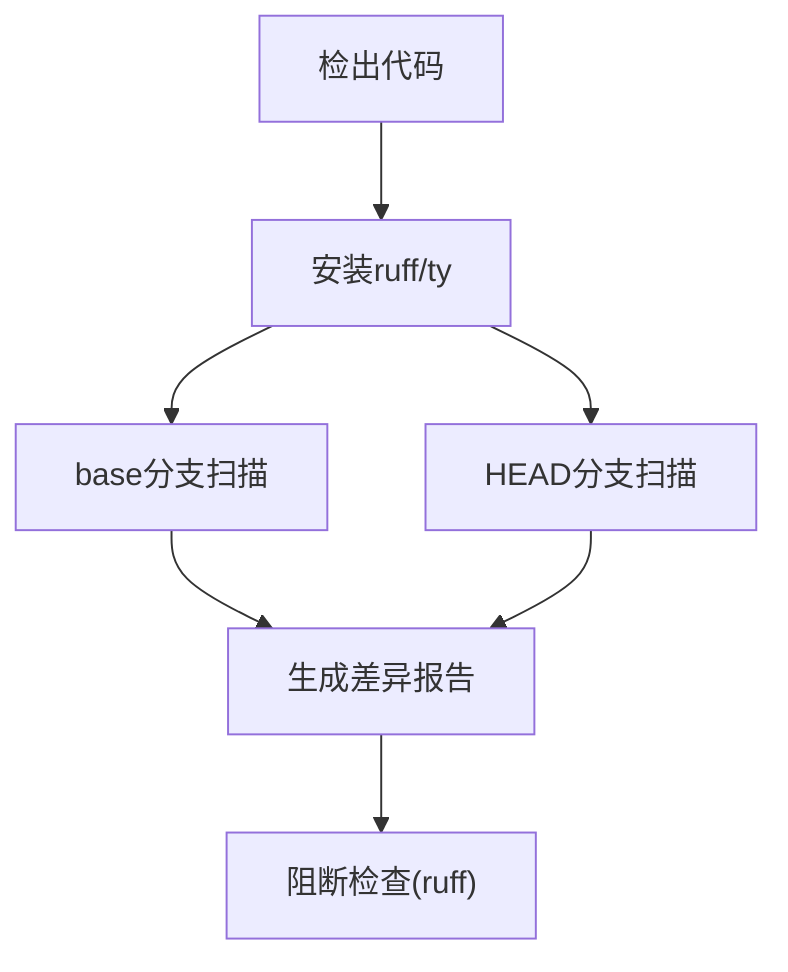
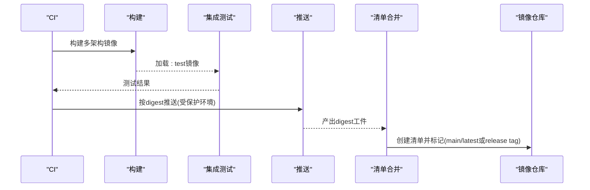
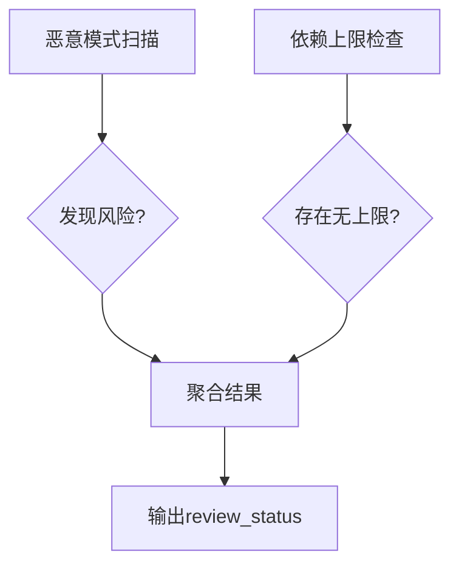
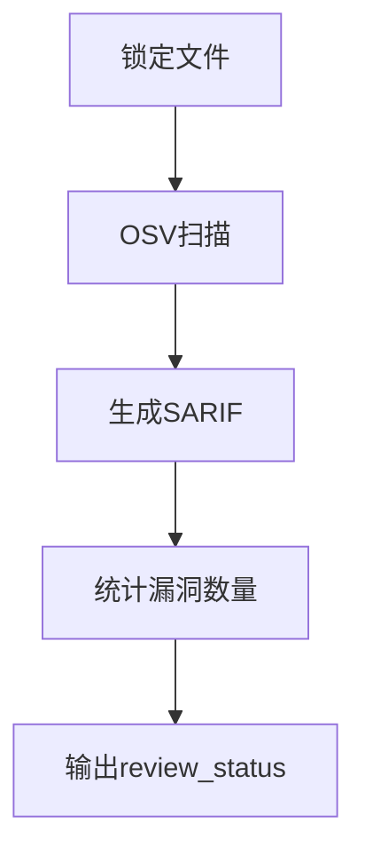
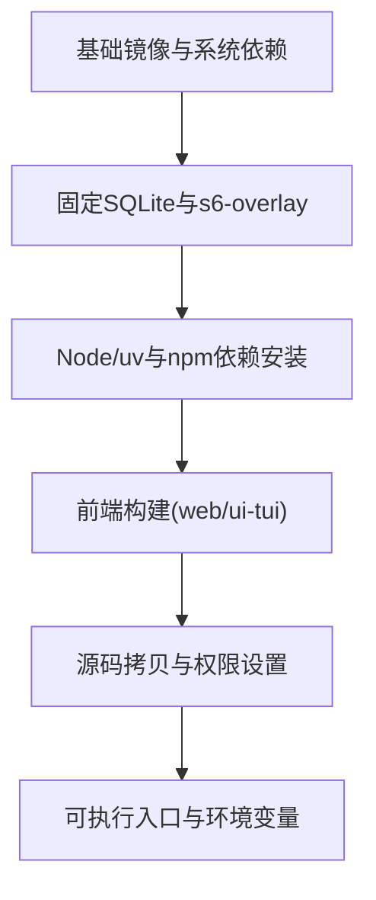
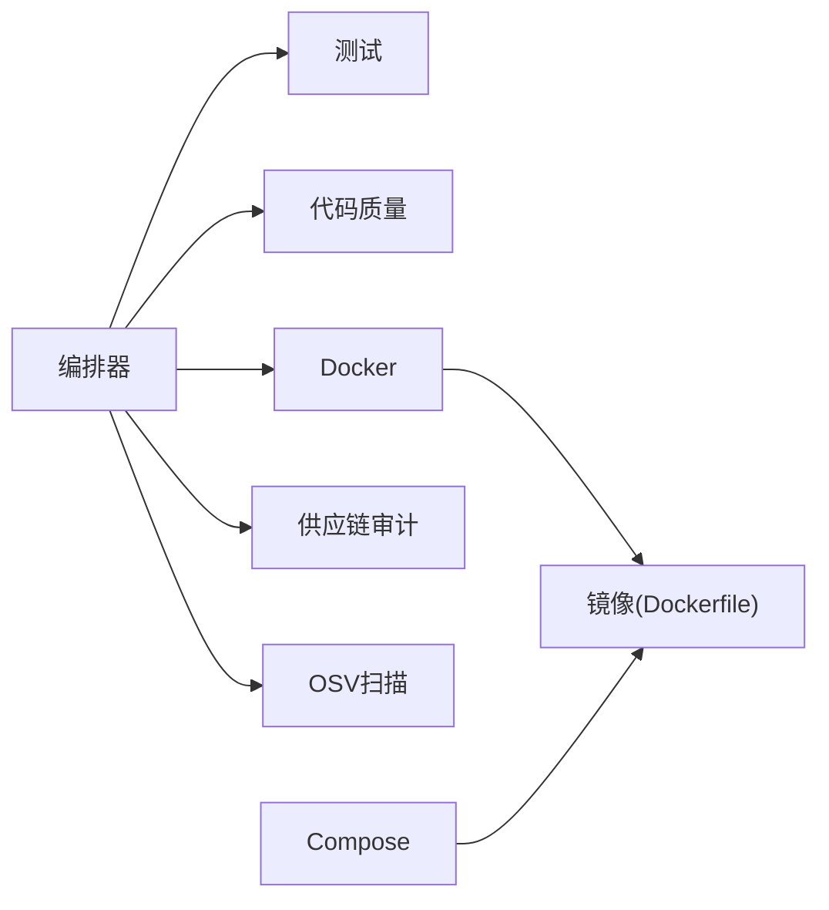

# CI/CD流水线

<cite>
**本文引用的文件**
- [ci.yml](file://.github/workflows/ci.yml)
- [docker.yml](file://.github/workflows/docker.yml)
- [tests.yml](file://.github/workflows/tests.yml)
- [lint.yml](file://.github/workflows/lint.yml)
- [supply-chain-audit.yml](file://.github/workflows/supply-chain-audit.yml)
- [osv-scanner.yml](file://.github/workflows/osv-scanner.yml)
- [Dockerfile](file://Dockerfile)
- [docker-compose.yml](file://docker-compose.yml)
</cite>

## 目录
1. [简介](#简介)
2. [项目结构](#项目结构)
3. [核心组件](#核心组件)
4. [架构总览](#架构总览)
5. [详细组件分析](#详细组件分析)
6. [依赖关系分析](#依赖关系分析)
7. [性能考量](#性能考量)
8. [故障排查指南](#故障排查指南)
9. [结论](#结论)
10. [附录](#附录)

## 简介
本指南围绕仓库中已落地的CI/CD实践，系统化说明GitHub Actions流水线的构建、测试、镜像构建与发布流程，并给出GitLab CI与Jenkins管道的可复用配置建议。同时涵盖Docker多阶段构建优化、自动化测试（单元/集成/E2E）、安全扫描与代码质量检查、部署策略（蓝绿/金丝雀）以及回滚与故障恢复机制。所有说明均基于仓库现有实现进行提炼与扩展，便于团队快速落地或迁移到自有平台。

## 项目结构
仓库采用“编排器 + 子工作流”的GitHub Actions组织方式：
- 编排器：统一触发、变更检测、并行调度、结果聚合与PR评论更新
- 子工作流：测试、Lint、Docker构建与发布、供应链审计、OSV扫描等
- 容器化：多阶段Dockerfile，s6-overlay服务管理，多架构构建与清单合并
- 本地运行：docker-compose提供gateway与dashboard双服务



**图表来源**
- [ci.yml:1-391](file://.github/workflows/ci.yml#L1-L391)
- [docker.yml:1-290](file://.github/workflows/docker.yml#L1-L290)
- [Dockerfile:1-458](file://Dockerfile#L1-L458)
- [docker-compose.yml:1-77](file://docker-compose.yml#L1-L77)

**章节来源**
- [ci.yml:1-391](file://.github/workflows/ci.yml#L1-L391)
- [docker.yml:1-290](file://.github/workflows/docker.yml#L1-L290)
- [Dockerfile:1-458](file://Dockerfile#L1-L458)
- [docker-compose.yml:1-77](file://docker-compose.yml#L1-L77)

## 核心组件
- 编排器与变更检测：根据PR/推送内容动态启用相关任务，减少无效执行
- 测试流水线：按文件切片并行执行，缓存依赖与测试时长，提升稳定性与速度
- 代码质量：ruff/ty差异报告与阻断规则；Windows陷阱静态检查
- Docker构建：多架构Buildx构建、本地加载测试、按digest推送、清单合并
- 供应链与漏洞扫描：恶意模式检测、PyPI上限边界检查、OSV已知漏洞扫描
- 本地与容器运行：s6-overlay服务编排、数据卷持久化、非root用户运行

**章节来源**
- [ci.yml:33-191](file://.github/workflows/ci.yml#L33-L191)
- [tests.yml:1-252](file://.github/workflows/tests.yml#L1-L252)
- [lint.yml:1-181](file://.github/workflows/lint.yml#L1-L181)
- [docker.yml:29-290](file://.github/workflows/docker.yml#L29-L290)
- [supply-chain-audit.yml:1-309](file://.github/workflows/supply-chain-audit.yml#L1-L309)
- [osv-scanner.yml:1-142](file://.github/workflows/osv-scanner.yml#L1-L142)
- [Dockerfile:52-458](file://Dockerfile#L52-L458)
- [docker-compose.yml:29-77](file://docker-compose.yml#L29-L77)

## 架构总览
下图展示了从PR/推送触发到构建、测试、安全扫描与镜像发布的端到端流程，以及本地开发时的容器编排。



**图表来源**
- [ci.yml:17-191](file://.github/workflows/ci.yml#L17-L191)
- [docker.yml:29-290](file://.github/workflows/docker.yml#L29-L290)
- [tests.yml:1-252](file://.github/workflows/tests.yml#L1-L252)
- [lint.yml:1-181](file://.github/workflows/lint.yml#L1-L181)
- [supply-chain-audit.yml:1-309](file://.github/workflows/supply-chain-audit.yml#L1-L309)
- [osv-scanner.yml:1-142](file://.github/workflows/osv-scanner.yml#L1-L142)

## 详细组件分析

### GitHub Actions编排器（ci.yml）
- 触发与权限：支持PR与main推送，最小权限原则，必要时写入PR评论与安全事件
- 并发控制：按分支/PR隔离，PR下取消进行中任务
- 变更检测：调用自定义action分类影响范围，下游任务按需启用
- 子工作流调度：测试、Lint、JS检查、安装器测试、文档站点、历史检查、贡献者校验、锁文件检查、Docker Lint、Docker构建、供应链审计、标签门控、OSV扫描
- 结果聚合：all-checks-pass汇总所有必需检查状态，作为分支保护唯一要求
- 时效报告：收集每步耗时，生成HTML/Gantt图并与基线对比，输出摘要



**图表来源**
- [ci.yml:17-191](file://.github/workflows/ci.yml#L17-L191)
- [ci.yml:242-391](file://.github/workflows/ci.yml#L242-L391)

**章节来源**
- [ci.yml:17-191](file://.github/workflows/ci.yml#L17-L191)
- [ci.yml:242-391](file://.github/workflows/ci.yml#L242-L391)

### 测试流水线（tests.yml）
- 切片并行：通过脚本生成文件切片矩阵，避免单点瓶颈
- 依赖缓存：uv工具链与wheel缓存，按pyproject.toml/uv.lock键命中
- 环境隔离：每个测试文件独立进程执行，避免模块级状态泄漏
- 防真实API：强制清空敏感环境变量，确保测试在隔离环境中运行
- E2E覆盖：单独E2E任务，验证端到端场景



**图表来源**
- [tests.yml:20-182](file://.github/workflows/tests.yml#L20-L182)
- [tests.yml:183-252](file://.github/workflows/tests.yml#L183-L252)

**章节来源**
- [tests.yml:20-182](file://.github/workflows/tests.yml#L20-L182)
- [tests.yml:183-252](file://.github/workflows/tests.yml#L183-L252)

### 代码质量（lint.yml）
- 差异报告：ruff/ty对HEAD与base分别扫描，生成diff摘要供审阅
- 阻断规则：ruff check .严格失败以阻止合并
- Windows陷阱：静态检查Windows不安全的Python用法



**图表来源**
- [lint.yml:30-153](file://.github/workflows/lint.yml#L30-L153)
- [lint.yml:154-181](file://.github/workflows/lint.yml#L154-L181)

**章节来源**
- [lint.yml:30-153](file://.github/workflows/lint.yml#L30-L153)
- [lint.yml:154-181](file://.github/workflows/lint.yml#L154-L181)

### Docker构建与发布（docker.yml）
- 多架构构建：amd64/arm64并行，BuildKit缓存按架构作用域
- 本地测试：构建后直接加载至daemon，复用同一镜像运行集成测试
- 安全发布：仅main/Release进入受保护环境，按digest推送，最后合并清单
- 版本标记：main推送到:main与:latest；Release打tag



**图表来源**
- [docker.yml:29-134](file://.github/workflows/docker.yml#L29-L134)
- [docker.yml:139-290](file://.github/workflows/docker.yml#L139-L290)

**章节来源**
- [docker.yml:29-134](file://.github/workflows/docker.yml#L29-L134)
- [docker.yml:139-290](file://.github/workflows/docker.yml#L139-L290)

### 供应链审计（supply-chain-audit.yml）
- 恶意模式扫描：.pth、base64+exec/eval、编码subprocess、安装钩子文件
- 依赖上限检查：禁止无上限的PyPI依赖引入
- 结果聚合：统一review_status供PR评论组装



**图表来源**
- [supply-chain-audit.yml:54-177](file://.github/workflows/supply-chain-audit.yml#L54-L177)
- [supply-chain-audit.yml:180-256](file://.github/workflows/supply-chain-audit.yml#L180-L256)
- [supply-chain-audit.yml:258-309](file://.github/workflows/supply-chain-audit.yml#L258-L309)

**章节来源**
- [supply-chain-audit.yml:54-177](file://.github/workflows/supply-chain-audit.yml#L54-L177)
- [supply-chain-audit.yml:180-256](file://.github/workflows/supply-chain-audit.yml#L180-L256)
- [supply-chain-audit.yml:258-309](file://.github/workflows/supply-chain-audit.yml#L258-L309)

### OSV漏洞扫描（osv-scanner.yml）
- 锁定文件扫描：针对uv.lock与多个package-lock.json
- 结果上报：SARIF上传至Security Tab，计数汇总为review_status
- 非阻断：fail-on-vuln=false，避免阻塞合并



**图表来源**
- [osv-scanner.yml:41-56](file://.github/workflows/osv-scanner.yml#L41-L56)
- [osv-scanner.yml:58-142](file://.github/workflows/osv-scanner.yml#L58-L142)

**章节来源**
- [osv-scanner.yml:41-56](file://.github/workflows/osv-scanner.yml#L41-L56)
- [osv-scanner.yml:58-142](file://.github/workflows/osv-scanner.yml#L58-L142)

### Docker镜像构建优化（Dockerfile）
- 多阶段构建：固定SQLite版本、Node/uv源镜像、系统依赖、s6-overlay、前端构建、源码拷贝、权限设置
- 层缓存优化：先复制manifest与workspace依赖，再安装；Python依赖分阶段缓存；前端构建独立缓存
- 运行时安全：非root用户、只读代码目录、懒安装重定向到数据卷、s6-overlay服务管理
- 多架构支持：Buildx自动识别TARGETARCH，下载对应s6-overlay包



**图表来源**
- [Dockerfile:52-167](file://Dockerfile#L52-L167)
- [Dockerfile:169-277](file://Dockerfile#L169-L277)
- [Dockerfile:278-458](file://Dockerfile#L278-L458)

**章节来源**
- [Dockerfile:52-167](file://Dockerfile#L52-L167)
- [Dockerfile:169-277](file://Dockerfile#L169-L277)
- [Dockerfile:278-458](file://Dockerfile#L278-L458)

### 本地与容器编排（docker-compose.yml）
- 服务定义：gateway与dashboard，host网络模式，数据卷挂载
- 环境变量：UID/GID映射、可选网关与聊天通道配置
- 安全提示：Dashboard默认绑定localhost，远程访问需隧道或反向代理

**章节来源**
- [docker-compose.yml:1-77](file://docker-compose.yml#L1-L77)

## 依赖关系分析
- 编排器依赖各子工作流的workflow_call接口，通过输入参数控制行为
- 测试与Docker构建共享uv缓存策略，保证一致性与加速
- 安全扫描与代码质量相互补充：前者关注供应链与依赖漏洞，后者关注代码规范与潜在陷阱
- Dockerfile与compose共同定义运行时环境，确保开发与生产一致性



**图表来源**
- [ci.yml:17-191](file://.github/workflows/ci.yml#L17-L191)
- [docker.yml:29-290](file://.github/workflows/docker.yml#L29-L290)
- [Dockerfile:1-458](file://Dockerfile#L1-L458)
- [docker-compose.yml:1-77](file://docker-compose.yml#L1-L77)

**章节来源**
- [ci.yml:17-191](file://.github/workflows/ci.yml#L17-L191)
- [docker.yml:29-290](file://.github/workflows/docker.yml#L29-L290)
- [Dockerfile:1-458](file://Dockerfile#L1-L458)
- [docker-compose.yml:1-77](file://docker-compose.yml#L1-L77)

## 性能考量
- 切片并行测试：按文件粒度拆分，结合历史时长缓存，显著缩短整体时间
- 依赖缓存：uv wheel缓存与Docker BuildKit缓存按作用域隔离，减少冷构建
- 前置构建：前端与Python依赖分层缓存，避免无关变更导致全量重建
- 并发控制：PR下取消进行中任务，避免资源浪费
- 报告与基线：CI耗时报告与基线对比，持续定位退化

[本节为通用指导，无需特定文件引用]

## 故障排查指南
- 测试失败：查看切片日志与test_durations.json，确认是否由外部API或环境引起；确保敏感环境变量为空
- 构建失败：检查Buildx初始化重试逻辑与网络问题；确认缓存作用域与密钥权限
- 安全扫描告警：依据review_status中的how_to_fix指引修复依赖或代码模式
- 镜像运行异常：核对s6-overlay服务状态、数据卷权限与非root用户配置；使用docker exec通过shim执行命令

**章节来源**
- [tests.yml:120-147](file://.github/workflows/tests.yml#L120-L147)
- [docker.yml:62-84](file://.github/workflows/docker.yml#L62-L84)
- [supply-chain-audit.yml:258-309](file://.github/workflows/supply-chain-audit.yml#L258-L309)
- [Dockerfile:149-167](file://Dockerfile#L149-L167)
- [Dockerfile:395-420](file://Dockerfile#L395-L420)

## 结论
本项目已具备完善的CI/CD体系：编排器驱动、并行测试、严格的质量与安全门禁、多架构镜像构建与受保护发布、以及本地与生产一致的容器化方案。在此基础上，可按需扩展GitLab CI与Jenkins管道，并引入蓝绿/金丝雀部署与回滚机制，进一步提升交付效率与稳定性。

[本节为总结性内容，无需特定文件引用]

## 附录

### GitLab CI配置示例（多环境与分支策略）
- 多环境：dev/staging/prod，通过变量控制镜像tag与部署目标
- 分支策略：feature分支仅构建与测试；merge到main触发staging；tag触发prod
- 关键步骤：构建镜像、运行测试、安全扫描、部署到Kubernetes/Helm

```yaml
stages:
  - test
  - build
  - deploy-dev
  - deploy-staging
  - deploy-prod

test:
  stage: test
  script:
    - uv sync --locked --extra all --extra dev
    - pytest tests/ -v

build:
  stage: build
  script:
    - docker build -t $IMAGE_NAME:$CI_COMMIT_SHORT_SHA .
    - docker push $IMAGE_NAME:$CI_COMMIT_SHORT_SHA

deploy-dev:
  stage: deploy-dev
  only:
    - branches
  script:
    - helm upgrade --install hermes-dev ./charts/hermes --set image.tag=$CI_COMMIT_SHORT_SHA --namespace dev

deploy-staging:
  stage: deploy-staging
  only:
    - main
  script:
    - helm upgrade --install hermes-staging ./charts/hermes --set image.tag=$CI_COMMIT_SHORT_SHA --namespace staging

deploy-prod:
  stage: deploy-prod
  only:
    - tags
  script:
    - helm upgrade --install hermes-prod ./charts/hermes --set image.tag=$CI_TAG --namespace prod
```

[本节为概念性示例，未直接映射到具体文件]

### Jenkins管道配置（并行构建与条件部署）
- 并行阶段：单元测试、集成测试、安全扫描并行执行
- 条件部署：根据分支与标签决定部署到dev/staging/prod
- 回滚：保留上一稳定版本，失败时自动回滚

```groovy
pipeline {
    agent any
    stages {
        stage('Unit Tests') {
            steps {
                sh 'uv sync --locked --extra all --extra dev'
                sh 'pytest tests/ -v'
            }
        }
        stage('Integration Tests') {
            parallel {
                stage('API') {
                    steps { sh 'pytest tests/integration/ -v' }
                }
                stage('UI') {
                    steps { sh 'npx playwright test' }
                }
            }
        }
        stage('Security Scan') {
            steps { sh 'osv-scanner --lockfile=uv.lock' }
        }
        stage('Build Image') {
            steps {
                sh 'docker build -t hermes-agent:${BUILD_NUMBER} .'
                sh 'docker push hermes-agent:${BUILD_NUMBER}'
            }
        }
        stage('Deploy Dev') {
            when { branch 'develop' }
            steps { sh 'helm upgrade --install hermes-dev ./charts/hermes --set image.tag=${BUILD_NUMBER} --namespace dev' }
        }
        stage('Deploy Staging') {
            when { branch 'main' }
            steps { sh 'helm upgrade --install hermes-staging ./charts/hermes --set image.tag=${BUILD_NUMBER} --namespace staging' }
        }
        stage('Deploy Prod') {
            when { tag 'v*' }
            steps { sh 'helm upgrade --install hermes-prod ./charts/hermes --set image.tag=${BUILD_TAG} --namespace prod' }
        }
    }
    post {
        failure {
            echo 'Rolling back to previous stable version...'
            sh 'helm rollback hermes-prod 1 || true'
        }
    }
}
```

[本节为概念性示例，未直接映射到具体文件]

### 部署策略：蓝绿与金丝雀
- 蓝绿部署：同时维护两套环境，切换流量指向新版本，失败立即切回
- 金丝雀发布：逐步放量（如1%→10%→50%→100%），监控指标与错误率，异常则回滚
- 结合Helm/Service Mesh：通过权重路由与健康检查实现平滑升级

[本节为概念性指导，无需特定文件引用]

### 回滚机制与故障恢复
- 镜像不可变：始终基于commit SHA或tag发布，回滚只需切换tag
- 数据库迁移：向前兼容设计，回滚时避免破坏性变更
- 健康检查与自愈：s6-overlay监督服务，崩溃自动重启；探针失败触发回滚
- 灰度观察：结合日志与指标，快速定位问题并决策回滚

[本节为概念性指导，无需特定文件引用]