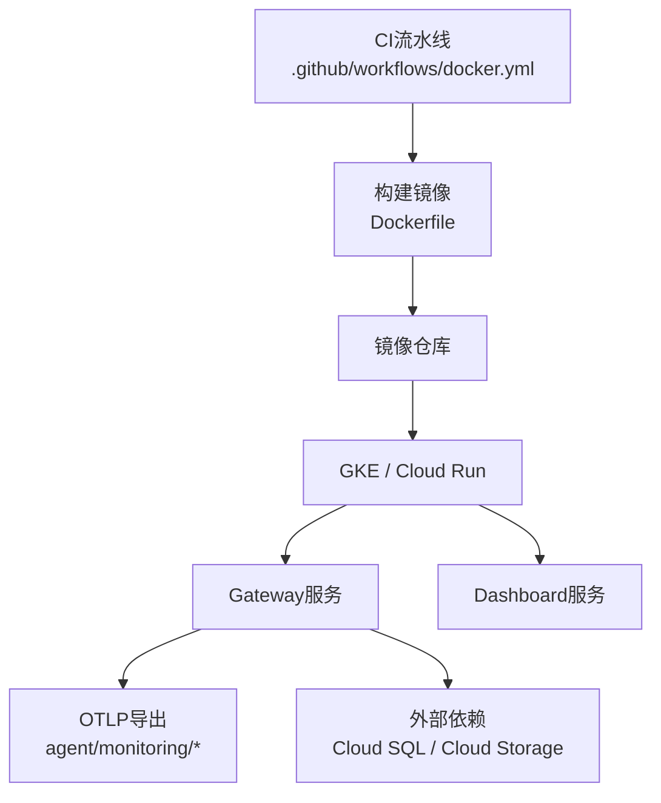
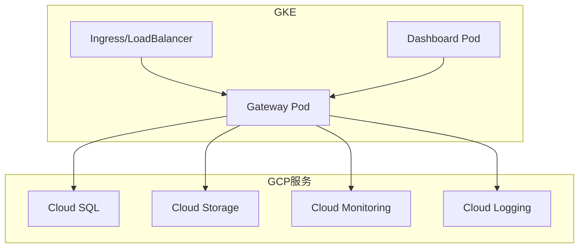
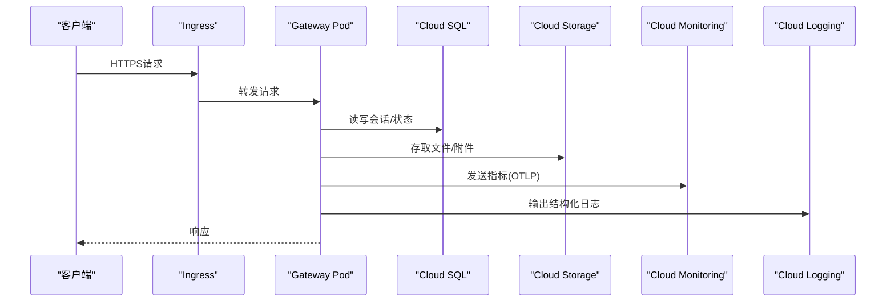
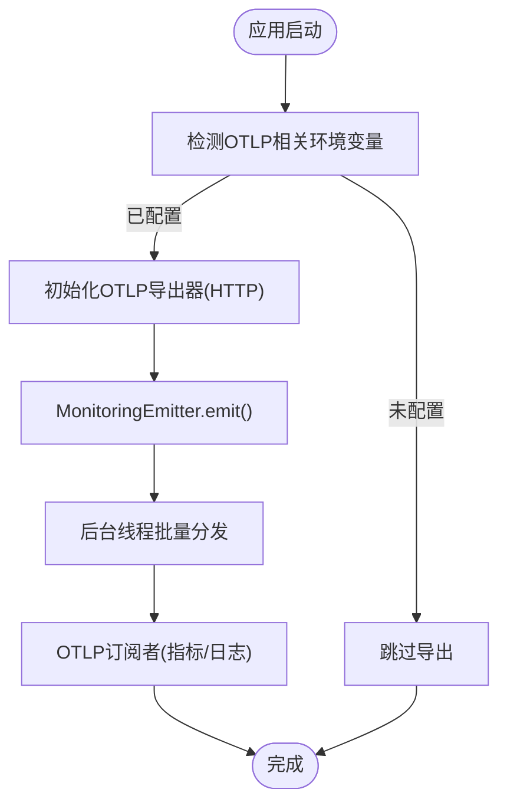
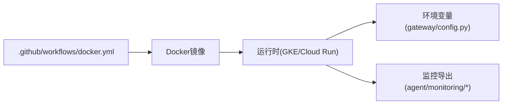

# Google Cloud Platform部署

<cite>
**本文引用的文件**
- [Dockerfile](file://Dockerfile)
- [docker-compose.yml](file://docker-compose.yml)
- [.github/workflows/docker.yml](file://.github/workflows/docker.yml)
- [gateway/config.py](file://gateway/config.py)
- [agent/monitoring/emitter.py](file://agent/monitoring/emitter.py)
- [agent/monitoring/gateway_health_export.py](file://agent/monitoring/gateway_health_export.py)
- [agent/vertex_adapter.py](file://agent/vertex_adapter.py)
</cite>

## 目录
1. [简介](#简介)
2. [项目结构](#项目结构)
3. [核心组件](#核心组件)
4. [架构总览](#架构总览)
5. [详细组件分析](#详细组件分析)
6. [依赖关系分析](#依赖关系分析)
7. [性能与扩缩容](#性能与扩缩容)
8. [故障排查指南](#故障排查指南)
9. [结论](#结论)
10. [附录](#附录)

## 简介
本指南面向在Google Cloud Platform（GCP）上部署SpaikiiDesktop（Hermes Agent）的完整流程，覆盖以下目标：
- 在Google Kubernetes Engine（GKE）上创建集群、配置命名空间并部署应用
- 使用Cloud Run进行无服务器化部署
- 集成Cloud SQL作为数据库、Cloud Storage用于文件存储
- 启用Cloud Monitoring与Cloud Logging，采集指标与日志
- 配置IAM角色与权限，遵循最小权限原则
- 设置自动扩缩容与负载均衡器
- 成本监控与优化建议（预留实例、自动缩放策略等）

该应用以容器镜像为核心，提供Gateway服务与Dashboard，支持通过环境变量和配置开启API Server、Webhook等平台能力，并通过OTLP导出监控数据。

## 项目结构
从部署视角看，关键资产包括：
- 容器镜像构建：Dockerfile定义了多阶段构建、系统依赖、Python/Node依赖安装、s6-overlay进程管理、可执行入口等
- 本地编排：docker-compose.yml定义Gateway与Dashboard两个服务，便于本地验证
- CI流水线：.github/workflows/docker.yml负责多架构构建、测试与发布
- 运行时配置：gateway/config.py集中解析环境变量，动态启用平台（如API Server、Webhook等）
- 监控导出：agent/monitoring/*实现事件发射与OTLP导出，对接外部Collector或后端

图表来源
- [.github/workflows/docker.yml:1-290](file://.github/workflows/docker.yml#L1-L290)
- [Dockerfile:1-458](file://Dockerfile#L1-L458)

章节来源
- [Dockerfile:1-458](file://Dockerfile#L1-L458)
- [docker-compose.yml:1-77](file://docker-compose.yml#L1-L77)
- [.github/workflows/docker.yml:1-290](file://.github/workflows/docker.yml#L1-L290)

## 核心组件
- 容器镜像与进程管理
  - 基于Debian的系统依赖、固定SQLite版本、s6-overlay进程监督、非root用户运行、只读代码层与持久化数据卷分离
  - 入口点由entrypoint-dispatch.sh统一调度，兼容PID 1与非PID 1场景
- Gateway与Dashboard
  - Gateway为消息网关与业务主进程；Dashboard为本地管理界面（默认绑定127.0.0.1）
  - 可通过环境变量启用API Server、Webhook等扩展平台
- 监控与可观测性
  - 通过MonitoringEmitter将事件放入队列并由后台线程批量分发至OTLP订阅者
  - Gateway Health Export将指标与诊断日志以OTLP HTTP方式导出

章节来源
- [Dockerfile:52-458](file://Dockerfile#L52-L458)
- [docker-compose.yml:29-77](file://docker-compose.yml#L29-L77)
- [agent/monitoring/emitter.py:1-200](file://agent/monitoring/emitter.py#L1-L200)
- [agent/monitoring/gateway_health_export.py:1-200](file://agent/monitoring/gateway_health_export.py#L1-L200)

## 架构总览
下图展示在GCP上的典型部署拓扑：GKE承载Gateway与Dashboard，通过Ingress暴露HTTP入口；Cloud SQL提供数据库；Cloud Storage用于文件；Cloud Monitoring/Logging收集指标与日志；IAM控制访问权限。

图表来源
- [Dockerfile:336-458](file://Dockerfile#L336-L458)
- [gateway/config.py:2130-2172](file://gateway/config.py#L2130-L2172)
- [agent/monitoring/gateway_health_export.py:190-220](file://agent/monitoring/gateway_health_export.py#L190-L220)

## 详细组件分析

### GKE部署：集群、命名空间与清单
- 集群与节点池
  - 建议使用专用节点池承载Gateway工作负载，按CPU/内存需求选择机器类型；开启自动扩缩容（HPA）与节点自动扩缩容（Autoscaler）
- 命名空间
  - 为生产环境创建独立命名空间（如spakii-prod），隔离资源与RBAC
- 部署清单要点
  - Deployment：定义Gateway与Dashboard副本数、资源限制、健康检查探针
  - Service/Ingress：对外暴露HTTP入口，配置TLS证书与域名
  - ConfigMap/Secret：注入环境变量（如API_SERVER_KEY、CORS、端口、主机等）
  - PersistentVolumeClaim：如需持久化会话或缓存，挂载到/opt/data
  - HorizontalPodAutoscaler：根据CPU/内存或自定义指标自动扩缩容
  - NetworkPolicy：限制Pod间通信范围，仅允许必要流量
- 参考环境变量与平台开关
  - API Server：通过API_SERVER_*系列变量启用并配置认证、CORS、端口与主机
  - Webhook/MS Graph Webhook：通过对应环境变量启用并配置安全参数

图表来源
- [gateway/config.py:2130-2172](file://gateway/config.py#L2130-L2172)
- [agent/monitoring/gateway_health_export.py:190-220](file://agent/monitoring/gateway_health_export.py#L190-L220)

章节来源
- [gateway/config.py:2130-2172](file://gateway/config.py#L2130-L2172)

### Cloud Run部署（无服务器）
- 适用场景：低延迟突发流量、空闲时几乎零成本
- 镜像要求：确保入口监听0.0.0.0且端口正确；若启用API Server，需配置API_SERVER_HOST与API_SERVER_KEY
- 配置项
  - 环境变量：同GKE，通过Run服务的环境变量注入
  - 存储：使用Cloud Storage挂载或SDK访问；数据库通过Cloud SQL Proxy或直接连接（按网络与VPC集成）
  - 监控：OTLP导出至Cloud Monitoring/Logging
- 扩缩容：启用自动扩缩容（最小/最大实例数），结合请求并发与延迟指标

章节来源
- [Dockerfile:336-458](file://Dockerfile#L336-L458)
- [gateway/config.py:2130-2172](file://gateway/config.py#L2130-L2172)

### Cloud SQL集成（数据库）
- 网络与安全
  - 使用私有IP或Cloud SQL Auth Proxy；在VPC内网部署以降低公网暴露风险
  - 使用Service Account或密钥对进行鉴权
- 应用侧
  - 通过环境变量或配置指向Cloud SQL实例地址与凭据
  - 连接池与超时参数需根据实例规格调优
- 备份与高可用
  - 启用自动备份、快照与跨地域复制（按需）

章节来源
- [agent/vertex_adapter.py:90-150](file://agent/vertex_adapter.py#L90-L150)

### Cloud Storage集成（文件存储）
- 使用Bucket存储会话附件、模型缓存、导出文件等
- 通过IAM授予最小权限（如只读/写入特定前缀）
- 生命周期策略：归档冷数据、删除过期对象

章节来源
- [Dockerfile:378-393](file://Dockerfile#L378-L393)

### Cloud Monitoring与Cloud Logging
- 指标与日志导出
  - 通过OTLP HTTP导出指标与诊断日志；需要配置端点与可选头部
  - 可使用OpenTelemetry Collector转发至Cloud Monitoring/Logging
- 采集内容
  - Gateway健康、错误率、延迟、吞吐等关键指标
  - 结构化日志便于检索与告警
- 可视化与告警
  - 在Cloud Monitoring中创建仪表板与告警策略

图表来源
- [agent/monitoring/emitter.py:1-200](file://agent/monitoring/emitter.py#L1-L200)
- [agent/monitoring/gateway_health_export.py:190-220](file://agent/monitoring/gateway_health_export.py#L190-L220)

章节来源
- [agent/monitoring/emitter.py:1-200](file://agent/monitoring/emitter.py#L1-L200)
- [agent/monitoring/gateway_health_export.py:190-220](file://agent/monitoring/gateway_health_export.py#L190-L220)

### IAM角色与权限（最小权限）
- 服务账号
  - 为Gateway与Dashboard分别创建独立的服务账号，仅授予所需权限
- 推荐权限
  - Cloud SQL：Cloud SQL Client（或更细粒度）
  - Cloud Storage：Storage Object Admin/Reader（按读写需求）
  - Cloud Logging：Logs Writer
  - Cloud Monitoring：Metrics Writer
- 作用域与网络
  - 限制服务账号的作用域；结合VPC与服务网格进一步收紧出站流量

章节来源
- [agent/vertex_adapter.py:90-150](file://agent/vertex_adapter.py#L90-L150)

### 自动扩缩容与负载均衡
- GKE
  - HPA：基于CPU/内存或自定义指标（如请求并发、延迟）
  - Cluster Autoscaler：根据Pod资源需求自动调整节点数
  - Ingress：配置HTTPS、WAF（可选）、健康检查
- Cloud Run
  - 自动实例扩缩：设置最小/最大实例数，按请求量与延迟阈值触发
  - 路由与域名：通过Cloud Run域名或自定义域名暴露服务

章节来源
- [Dockerfile:336-458](file://Dockerfile#L336-L458)

### 成本监控与优化建议
- 预留实例与承诺用量
  - GKE：考虑Commitment或Autopilot模式降低单位成本
  - Cloud Run：合理设置最小实例数以平衡冷启动与成本
- 自动缩放策略
  - 基于QPS/延迟的HPA，避免过度扩容
  - 夜间低谷期降低副本数
- 存储与带宽
  - 使用分层存储（标准/近线/冷归档）
  - 压缩与CDN加速静态资源
- 监控与预算
  - 使用Budgets与Alerting跟踪支出
  - 通过标签区分团队/项目成本

[本节为通用指导，不直接分析具体文件]

## 依赖关系分析
- 构建与发布
  - CI流水线负责多架构构建、测试与发布，产物为多架构镜像清单
- 运行时依赖
  - s6-overlay进程监督、Python/Node依赖、系统库（如SQLite固定版本）
  - 环境变量驱动的平台能力（API Server、Webhook等）
  - OTLP导出依赖（可选）

图表来源
- [.github/workflows/docker.yml:1-290](file://.github/workflows/docker.yml#L1-L290)
- [gateway/config.py:2130-2172](file://gateway/config.py#L2130-L2172)
- [agent/monitoring/emitter.py:1-200](file://agent/monitoring/emitter.py#L1-L200)

章节来源
- [.github/workflows/docker.yml:1-290](file://.github/workflows/docker.yml#L1-L290)
- [gateway/config.py:2130-2172](file://gateway/config.py#L2130-L2172)
- [agent/monitoring/emitter.py:1-200](file://agent/monitoring/emitter.py#L1-L200)

## 性能与扩缩容
- 容器层优化
  - 只读代码层与持久化数据卷分离，提升重启效率
  - s6-overlay进程监督保障服务稳定性
- 应用层优化
  - 合理设置连接池、超时与重试策略
  - 使用缓存减少DB压力
- 扩缩容策略
  - GKE：HPA+Cluster Autoscaler；Cloud Run：自动实例扩缩
  - 针对峰值流量设计弹性上限与降级策略

[本节为通用指导，不直接分析具体文件]

## 故障排查指南
- 常见问题
  - 环境变量缺失：确认API_SERVER_KEY、CORS、端口等是否注入
  - OTLP导出失败：检查端点可达性与依赖是否安装
  - 权限不足：核对IAM角色与网络策略
- 定位方法
  - 查看Pod日志与事件
  - 通过Cloud Logging检索关键字
  - 使用Cloud Monitoring仪表板观察指标异常

章节来源
- [gateway/config.py:2130-2172](file://gateway/config.py#L2130-L2172)
- [agent/monitoring/gateway_health_export.py:190-220](file://agent/monitoring/gateway_health_export.py#L190-L220)

## 结论
通过在GKE或Cloud Run上部署SpaikiiDesktop，并结合Cloud SQL、Cloud Storage、Cloud Monitoring与Cloud Logging，可实现高可用、可扩展、可观测的生产级服务。遵循最小权限原则与合理的扩缩容策略，可在保证性能的同时控制成本。建议在生产环境中持续监控指标与日志，及时调整资源配置与容量规划。

[本节为总结，不直接分析具体文件]

## 附录
- 快速检查清单
  - 镜像构建与发布成功（多架构）
  - 环境变量与Secret正确注入
  - Ingress/域名/TLS配置完成
  - Cloud SQL/Storage连通性验证
  - OTLP导出端到端可用
  - HPA/自动扩缩容生效
  - IAM权限最小化
  - 预算与告警已配置

[本节为补充信息，不直接分析具体文件]