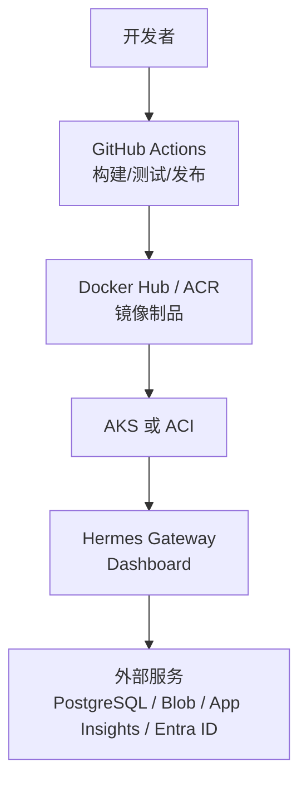
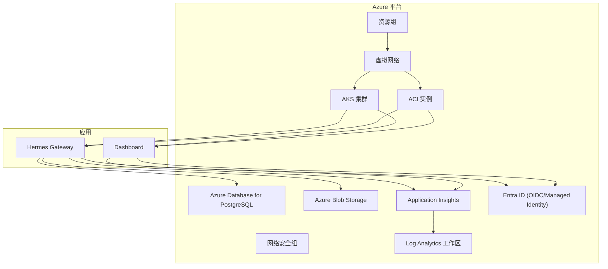
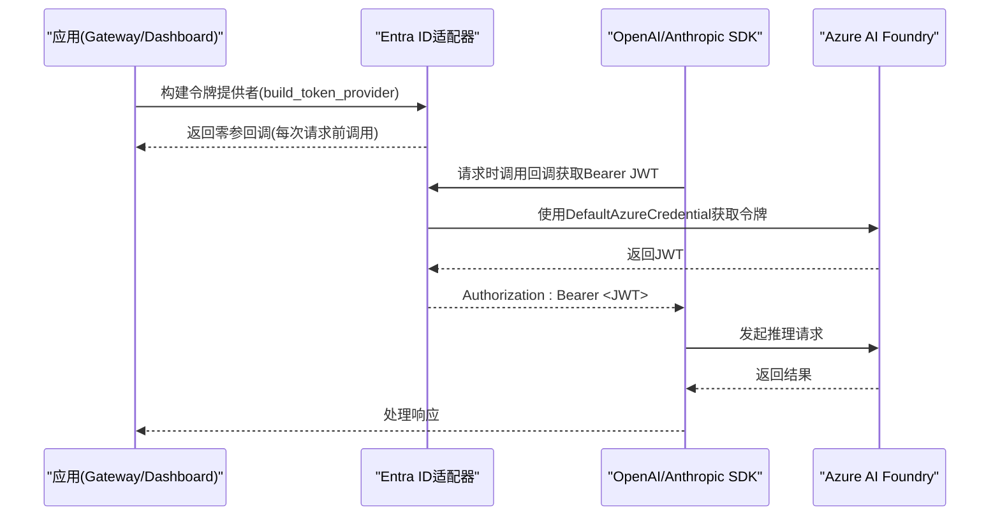
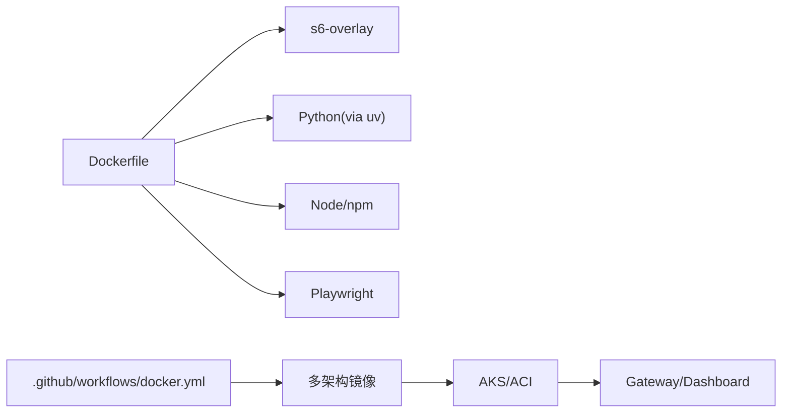

# Microsoft Azure部署

<cite>
**本文引用的文件**
- [Dockerfile](file://Dockerfile)
- [docker-compose.yml](file://docker-compose.yml)
- [.github/workflows/docker.yml](file://.github/workflows/docker.yml)
- [agent/azure_identity_adapter.py](file://agent/azure_identity_adapter.py)
</cite>

## 目录
1. [简介](#简介)
2. [项目结构](#项目结构)
3. [核心组件](#核心组件)
4. [架构总览](#架构总览)
5. [详细组件分析](#详细组件分析)
6. [依赖关系分析](#依赖关系分析)
7. [性能与成本优化](#性能与成本优化)
8. [故障排查指南](#故障排查指南)
9. [结论](#结论)
10. [附录](#附录)

## 简介
本指南面向在Microsoft Azure上部署SpaikiiDesktop（Hermes Agent）的工程团队，提供从容器镜像构建到在Azure Kubernetes Service（AKS）或Azure Container Instances（ACI）运行的完整步骤。内容涵盖：
- AKS集群、资源组、网络策略与Ingress配置
- ACI轻量级部署选项
- 与Azure Database for PostgreSQL集成
- 使用Azure Blob Storage进行文件管理
- Application Insights监控与依赖映射
- Azure Active Directory（Entra ID）身份认证集成
- Azure Monitor与Log Analytics工作区集中式日志
- 成本优化策略（预留容量、自动扩缩容、按需暂停等）

## 项目结构
仓库提供了生产就绪的容器化方案：
- Dockerfile定义了多阶段构建、系统依赖、Python/Node依赖安装、s6-overlay进程监督、只读代码层与可写数据卷等关键特性。
- docker-compose.yml展示了本地运行方式，包含gateway与dashboard服务、环境变量、端口与卷挂载说明。
- GitHub Actions流水线负责多架构镜像构建、测试与发布，支持按digest推送并合并为多架构清单。

**图示来源**
- [.github/workflows/docker.yml:1-290](file://.github/workflows/docker.yml#L1-L290)
- [Dockerfile:1-458](file://Dockerfile#L1-L458)
- [docker-compose.yml:1-77](file://docker-compose.yml#L1-L77)

**章节来源**
- [Dockerfile:1-458](file://Dockerfile#L1-L458)
- [docker-compose.yml:1-77](file://docker-compose.yml#L1-L77)
- [.github/workflows/docker.yml:1-290](file://.github/workflows/docker.yml#L1-L290)

## 核心组件
- 容器运行时与进程监督
  - 基于s6-overlay实现主进程、Dashboard与网关服务的生命周期管理，确保PID 1正确接管与优雅关闭。
  - 通过只读代码层与可写数据卷分离，保证镜像可重复性与数据持久化。
- 依赖与工具链
  - Python环境由uv同步，Node用于前端构建；Playwright浏览器预装以支持自动化能力。
  - SQLite固定版本库以避免已知漏洞。
- CI/CD
  - 多架构构建（amd64/arm64），按digest推送，最终合并为多架构清单，便于Kubernetes/ACI拉取。

**章节来源**
- [Dockerfile:52-135](file://Dockerfile#L52-L135)
- [Dockerfile:171-267](file://Dockerfile#L171-L267)
- [Dockerfile:336-458](file://Dockerfile#L336-L458)
- [.github/workflows/docker.yml:30-134](file://.github/workflows/docker.yml#L30-L134)
- [.github/workflows/docker.yml:139-290](file://.github/workflows/docker.yml#L139-L290)

## 架构总览
下图展示在Azure上的典型部署拓扑：应用容器运行于AKS或ACI，通过内部网络访问托管数据库与对象存储，使用App Insights采集指标与依赖调用链，并通过Entra ID进行无密钥鉴权。

**图示来源**
- [Dockerfile:336-458](file://Dockerfile#L336-L458)
- [docker-compose.yml:29-77](file://docker-compose.yml#L29-L77)
- [agent/azure_identity_adapter.py:1-30](file://agent/azure_identity_adapter.py#L1-L30)

## 详细组件分析

### AKS部署与网络策略
- 集群与命名空间
  - 创建资源组与AKS集群，启用系统节点池与用户节点池，开启托管标识以便访问其他Azure资源。
  - 为应用创建独立命名空间，隔离资源与RBAC权限。
- Ingress与对外暴露
  - 推荐使用Azure Application Gateway Ingress Controller或NGINX Ingress Controller暴露Dashboard与API。
  - 配置TLS证书（Azure Key Vault集成）与域名解析。
- 网络策略与安全组
  - 使用NetworkPolicy限制Pod间通信，仅允许Dashboard访问Gateway。
  - 将出站流量经NAT网关或防火墙，限制对公网的访问面。
- 存储与持久化
  - 使用Azure Disk或Azure Files作为PV/PVC，挂载至Gateway与Dashboard的数据卷（/opt/data）。
- 示例Kubernetes资源要点
  - Deployment/StatefulSet：设置副本数、资源请求/限制、健康探针、滚动更新策略。
  - Service/Ingress：暴露内网Service，通过Ingress对外提供HTTPS。
  - ConfigMap/Secret：注入环境变量（如数据库连接串、Blob凭据、App Insights Instrumentation Key）。
  - NetworkPolicy：限制入站/出站规则。
  - RBAC：最小权限原则，为ServiceAccount绑定角色。

[本节为概念性指导，不直接分析具体源码文件]

### Azure Container Instances（ACI）轻量部署
- 适用场景：低负载、临时任务、开发测试环境。
- 部署要点
  - 使用ACI单实例或多实例并行执行短任务。
  - 通过环境变量注入敏感信息（数据库连接串、Blob凭据、App Insights键）。
  - 若需持久化，挂载Azure Files卷到/opt/data。
- 与AKS对比
  - ACI无需管理节点，启动快，但扩展能力有限；适合短期或突发负载。

[本节为概念性指导，不直接分析具体源码文件]

### Azure Database for PostgreSQL集成
- 数据库准备
  - 创建PostgreSQL服务器，启用防火墙规则允许AKS/ACI子网访问。
  - 创建数据库与用户，授予最小权限。
- 连接配置
  - 通过ConfigMap/Secret注入连接字符串（含主机、端口、数据库名、用户名、密码）。
  - 如需SSL，挂载证书或使用受信任CA。
- 迁移与备份
  - 使用pg_dump/pg_restore或Azure门户备份恢复功能。
  - 定期快照与日志保留策略。

[本节为概念性指导，不直接分析具体源码文件]

### Azure Blob Storage用于文件管理
- 存储账户与容器
  - 创建存储账户，创建容器用于存放会话附件、导出文件等。
- 访问模式
  - 推荐通过Managed Identity或SAS令牌访问，避免硬编码密钥。
  - 在应用中配置Blob客户端端点与容器名称。
- 生命周期与合规
  - 设置生命周期管理规则（归档/删除）。
  - 启用审计日志与威胁检测。

[本节为概念性指导，不直接分析具体源码文件]

### Application Insights监控与依赖映射
- 启用与配置
  - 在AKS中通过Helm Chart或Manifest注入Instrumentation Key。
  - 在应用侧启用OTLP或SDK上报（根据应用支持情况）。
- 指标与依赖
  - 收集HTTP请求、响应时间、错误率、依赖调用（DB/Blob/外部API）。
  - 配置自定义事件与度量，便于业务洞察。
- 告警与仪表板
  - 设置性能阈值告警（延迟、失败率）。
  - 创建仪表板聚合关键指标。

[本节为概念性指导，不直接分析具体源码文件]

### Azure Active Directory（Entra ID）集成与身份验证
- 无密钥认证
  - 使用DefaultAzureCredential链（环境变量、Workload Identity、托管标识、CLI等）获取令牌。
  - 适配器提供令牌提供者函数，供OpenAI/Anthropic等SDK每请求刷新令牌。
- 作用域与端点
  - 默认作用域为Foundry推理端点；可通过配置覆盖。
  - 支持Azure主权云与私有云环境。
- 诊断与排错
  - 提供探测函数检查当前凭据是否可用，输出诊断信息（租户ID、过期时间、来源等）。

**图示来源**
- [agent/azure_identity_adapter.py:215-253](file://agent/azure_identity_adapter.py#L215-L253)
- [agent/azure_identity_adapter.py:261-312](file://agent/azure_identity_adapter.py#L261-L312)
- [agent/azure_identity_adapter.py:315-431](file://agent/azure_identity_adapter.py#L315-L431)

**章节来源**
- [agent/azure_identity_adapter.py:1-30](file://agent/azure_identity_adapter.py#L1-L30)
- [agent/azure_identity_adapter.py:122-171](file://agent/azure_identity_adapter.py#L122-L171)
- [agent/azure_identity_adapter.py:215-253](file://agent/azure_identity_adapter.py#L215-L253)
- [agent/azure_identity_adapter.py:261-312](file://agent/azure_identity_adapter.py#L261-L312)
- [agent/azure_identity_adapter.py:315-431](file://agent/azure_identity_adapter.py#L315-L431)

### Azure Monitor与Log Analytics工作区
- 工作区与数据收集器
  - 创建Log Analytics工作区，配置数据收集器规则（Container Insights、应用日志、指标）。
- 查询与分析
  - 使用Kusto查询语言分析日志与指标。
  - 设置告警规则（CPU、内存、错误率、延迟）。
- 与App Insights联动
  - 将应用遥测与工作区日志关联，统一视图。

[本节为概念性指导，不直接分析具体源码文件]

## 依赖关系分析
- 镜像构建依赖
  - 多阶段构建：SQLite固定版本、s6-overlay、Python/Node依赖、前端构建产物。
  - 安全加固：只读代码层、非root用户、最小化基础镜像。
- CI/CD依赖
  - 多架构构建与缓存，按digest推送，合并清单。
- 运行时依赖
  - s6-overlay进程监督，环境变量控制行为，数据卷持久化。

**图示来源**
- [Dockerfile:52-135](file://Dockerfile#L52-L135)
- [Dockerfile:171-267](file://Dockerfile#L171-L267)
- [.github/workflows/docker.yml:30-134](file://.github/workflows/docker.yml#L30-L134)
- [.github/workflows/docker.yml:139-290](file://.github/workflows/docker.yml#L139-L290)

**章节来源**
- [Dockerfile:1-458](file://Dockerfile#L1-L458)
- [.github/workflows/docker.yml:1-290](file://.github/workflows/docker.yml#L1-L290)

## 性能与成本优化
- 计算资源
  - AKS：启用HPA（水平自动扩缩容）基于CPU/内存或自定义指标；使用Spot VM降低非关键负载成本。
  - ACI：按需启动，适合短时任务；结合批处理队列减少空闲。
- 存储
  - 使用分层Blob（热/冷/归档）降低长期存储成本。
  - 合理设置PVC大小与IOPS等级。
- 网络
  - 使用VNet Peering/Private Link减少跨域流量费用。
  - 限制出站带宽与公网暴露面。
- 监控与告警
  - 设置预算与消费告警，避免超支。
  - 利用App Insights识别慢依赖与异常调用。
- 镜像与部署
  - 多阶段构建减小镜像体积，提升拉取速度。
  - 使用镜像缓存与增量更新策略。

[本节为通用优化建议，不直接分析具体源码文件]

## 故障排查指南
- 容器启动失败
  - 检查s6-overlay初始化脚本与权限，确认数据卷可写。
  - 查看容器日志与退出码，定位入口脚本问题。
- 认证失败（Entra ID）
  - 使用适配器提供的探测函数检查凭据可用性。
  - 确认环境变量（租户、客户端ID、机密或托管标识）正确。
  - 检查网络可达性与令牌服务响应。
- 数据库连接问题
  - 验证防火墙规则与连接字符串。
  - 检查SSL证书与受信任CA。
- 存储访问失败
  - 确认Managed Identity或SAS令牌权限。
  - 检查容器网络与存储账户防火墙。
- 监控缺失
  - 确认Instrumentation Key与工作区配置。
  - 检查Agent安装与数据转发状态。

**章节来源**
- [Dockerfile:336-458](file://Dockerfile#L336-L458)
- [agent/azure_identity_adapter.py:261-312](file://agent/azure_identity_adapter.py#L261-L312)
- [agent/azure_identity_adapter.py:315-431](file://agent/azure_identity_adapter.py#L315-L431)

## 结论
通过在AKS或ACI上部署SpaikiiDesktop，并结合Azure Database for PostgreSQL、Blob Storage、Application Insights与Entra ID，可实现高可用、可扩展且安全的云端运行环境。配合Azure Monitor与Log Analytics，能够全面掌握系统性能与依赖关系。遵循成本优化策略，可在保障服务质量的同时控制支出。

[本节为总结性内容，不直接分析具体源码文件]

## 附录
- 环境变量与配置
  - 数据库连接串、Blob凭据、App Insights键等应通过Secret管理。
  - 使用ConfigMap管理非敏感配置。
- 安全最佳实践
  - 最小权限原则，定期轮换凭据。
  - 启用审计日志与威胁检测。
- 回滚与升级
  - 使用蓝绿或金丝雀发布策略。
  - 保持镜像标签与Git提交哈希对应，便于追溯。

[本节为补充信息，不直接分析具体源码文件]