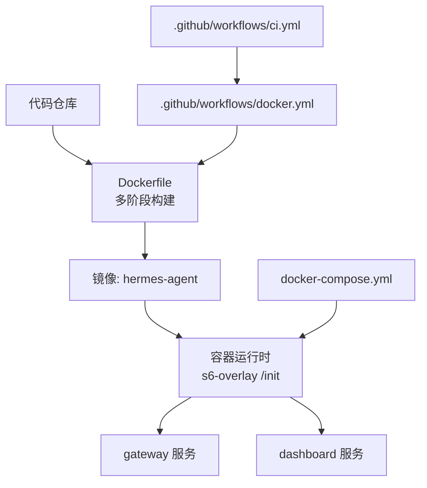
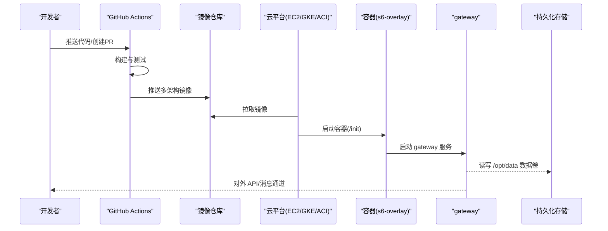
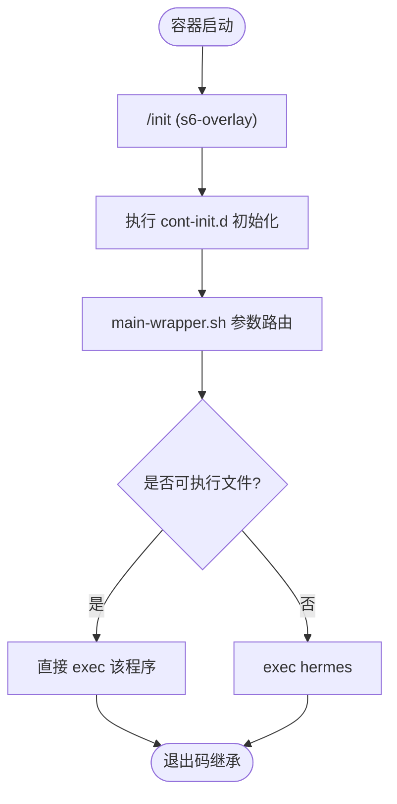
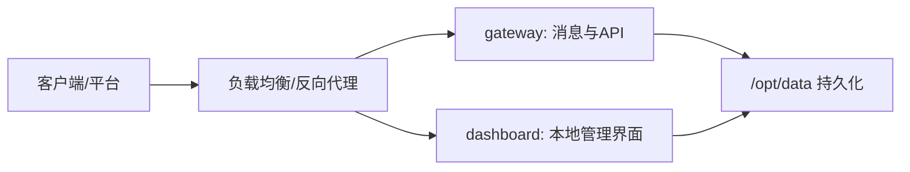
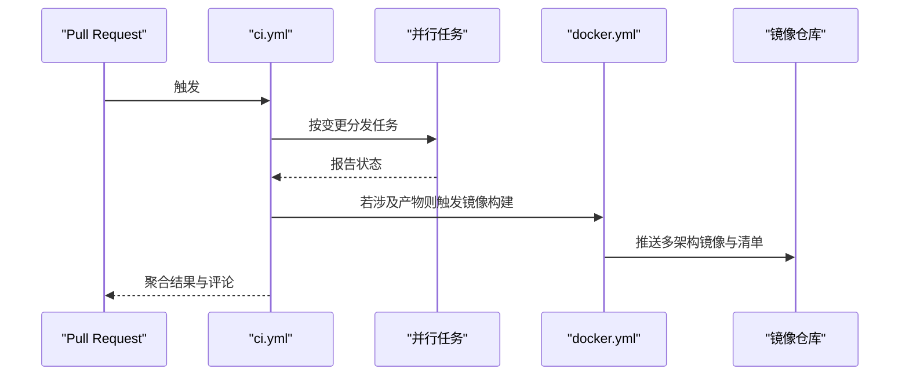
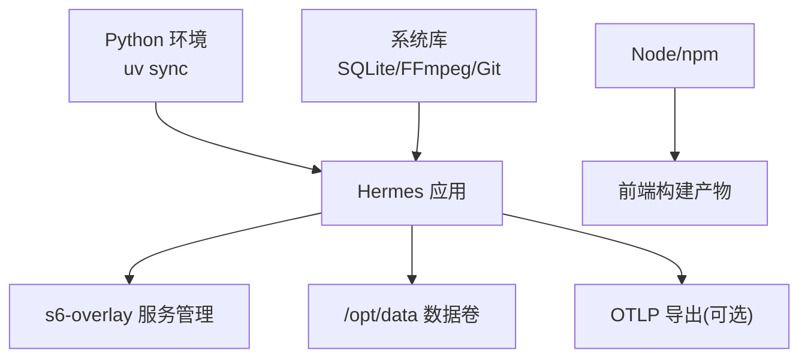

# 云部署

<cite>
**本文引用的文件**
- [Dockerfile](file://Dockerfile)
- [docker-compose.yml](file://docker-compose.yml)
- [entrypoint.sh](file://docker/entrypoint.sh)
- [main-wrapper.sh](file://docker/main-wrapper.sh)
- [README.md](file://README.md)
- [ci.yml](file://.github/workflows/ci.yml)
- [docker.yml](file://.github/workflows/docker.yml)
</cite>

## 目录
1. [简介](#简介)
2. [项目结构](#项目结构)
3. [核心组件](#核心组件)
4. [架构总览](#架构总览)
5. [详细组件分析](#详细组件分析)
6. [依赖关系分析](#依赖关系分析)
7. [性能与成本优化](#性能与成本优化)
8. [故障排查指南](#故障排查指南)
9. [结论](#结论)
10. [附录：云平台部署清单](#附录云平台部署清单)

## 简介
本指南面向在主流云平台（AWS、Google Cloud Platform、Microsoft Azure）上容器化部署 Hermes Agent 的团队，提供从镜像构建、编排到监控、存储、CI/CD 的完整落地方案。仓库已提供生产级 Docker 镜像与 s6-overlay 进程管理，支持多架构构建与发布；同时内置 GitHub Actions 流水线用于构建、测试与发布镜像。基于这些能力，可在各平台以 EC2/GKE/Azure Container Instances 等形态快速上线，并配合自动扩缩容、负载均衡与健康检查实现高可用与弹性伸缩。

## 项目结构
- 容器镜像定义：Dockerfile 使用多阶段构建，安装系统依赖、Python/Node 工具链、s6-overlay 服务管理器，预编译前端资源，并以非 root 用户运行。
- 编排示例：docker-compose.yml 提供 gateway 与 dashboard 双服务，默认绑定本地回环地址，便于安全暴露或反向代理。
- 启动流程：通过 /init（s6-overlay）作为 PID 1，执行 cont-init.d 初始化脚本，再启动受管服务；main-wrapper.sh 负责参数路由与权限降级。
- CI/CD：GitHub Actions 提供 PR 构建测试与 main/release 分支的多架构镜像构建与发布。

**图示来源**
- [Dockerfile:52-458](file://Dockerfile#L52-L458)
- [docker-compose.yml:29-77](file://docker-compose.yml#L29-L77)
- [docker.yml:1-290](file://.github/workflows/docker.yml#L1-L290)
- [ci.yml:1-391](file://.github/workflows/ci.yml#L1-L391)

**章节来源**
- [Dockerfile:52-458](file://Dockerfile#L52-L458)
- [docker-compose.yml:29-77](file://docker-compose.yml#L29-L77)
- [ci.yml:1-391](file://.github/workflows/ci.yml#L1-L391)
- [docker.yml:1-290](file://.github/workflows/docker.yml#L1-L290)

## 核心组件
- 容器镜像与进程管理
  - 多阶段构建：固定 SQLite 版本、安装 Node/Python 工具链、预装 Playwright 浏览器、构建前端资源。
  - s6-overlay：以 /init 为 PID 1，统一生命周期管理，支持 per-profile 网关动态注册。
  - 非 root 运行：默认 hermes 用户，数据卷 /opt/data 持久化。
- 入口与参数路由
  - entrypoint-dispatch.sh：兼容不同编排器对 PID 1 的限制，必要时回退到 stage2-hook + main-wrapper。
  - main-wrapper.sh：参数路由（直接执行可执行文件或 hermes 子命令），权限降级至 hermes 用户。
- 编排与服务
  - docker-compose.yml：gateway 与 dashboard 双服务，默认仅监听 localhost，建议通过反向代理或隧道暴露。
- CI/CD
  - ci.yml：变更检测与并行任务编排，聚合结果门禁。
  - docker.yml：按架构构建、测试、推送镜像，合并多架构清单。

**章节来源**
- [Dockerfile:52-458](file://Dockerfile#L52-L458)
- [entrypoint.sh:1-29](file://docker/entrypoint.sh#L1-L29)
- [main-wrapper.sh:1-92](file://docker/main-wrapper.sh#L1-L92)
- [docker-compose.yml:29-77](file://docker-compose.yml#L29-L77)
- [ci.yml:1-391](file://.github/workflows/ci.yml#L1-L391)
- [docker.yml:1-290](file://.github/workflows/docker.yml#L1-L290)

## 架构总览
下图展示从代码到云端运行的关键路径：CI 触发构建镜像，镜像包含应用与 s6-overlay；在云平台以容器形式运行，gateway 对外提供服务，dashboard 用于运维查看。

**图示来源**
- [docker.yml:33-210](file://.github/workflows/docker.yml#L33-L210)
- [docker.yml:219-290](file://.github/workflows/docker.yml#L219-L290)
- [Dockerfile:336-458](file://Dockerfile#L336-L458)
- [docker-compose.yml:29-77](file://docker-compose.yml#L29-L77)

## 详细组件分析

### 容器启动与生命周期
- s6-overlay 作为 PID 1，执行 cont-init.d 初始化（UID/GID 映射、数据卷 chown、配置种子、技能同步）。
- 主程序由 main-wrapper.sh 路由：无参时执行 hermes，或直接执行传入的可执行程序，否则将参数透传给 hermes 子命令。
- 权限模型：默认以 root 进入，随后通过 s6-setuidgid 切换到 hermes 用户运行受管服务；禁止以任意 --user 启动，避免破坏只读层与权限预期。

**图示来源**
- [Dockerfile:336-458](file://Dockerfile#L336-L458)
- [main-wrapper.sh:1-92](file://docker/main-wrapper.sh#L1-L92)
- [entrypoint.sh:1-29](file://docker/entrypoint.sh#L1-L29)

**章节来源**
- [Dockerfile:336-458](file://Dockerfile#L336-L458)
- [main-wrapper.sh:1-92](file://docker/main-wrapper.sh#L1-L92)
- [entrypoint.sh:1-29](file://docker/entrypoint.sh#L1-L29)

### 编排与服务拓扑
- docker-compose 定义 gateway 与 dashboard 两个服务，均使用 host 网络模式，便于端口直出。
- 默认仅暴露 dashboard 到 127.0.0.1，gateway API 需显式开启并设置认证密钥。
- 数据卷挂载到 ~/.hermes:/opt/data，保证会话、配置与技能持久化。

**图示来源**
- [docker-compose.yml:29-77](file://docker-compose.yml#L29-L77)

**章节来源**
- [docker-compose.yml:29-77](file://docker-compose.yml#L29-L77)

### CI/CD 流水线
- 变更检测：ci.yml 先运行 detect-changes，按影响范围并行触发测试、lint、JS 检查、安装器测试、文档站点检查、供应链扫描等。
- 镜像构建与发布：docker.yml 在 PR 中构建并测试镜像；在 main 推送或 release 时构建多架构镜像并推送到镜像仓库，最后合并清单。
- 质量门禁：all-checks-pass 聚合所有必需任务结果，作为分支保护条件。

**图示来源**
- [ci.yml:1-391](file://.github/workflows/ci.yml#L1-L391)
- [docker.yml:1-290](file://.github/workflows/docker.yml#L1-L290)

**章节来源**
- [ci.yml:1-391](file://.github/workflows/ci.yml#L1-L391)
- [docker.yml:1-290](file://.github/workflows/docker.yml#L1-L290)

## 依赖关系分析
- 构建期依赖
  - Python：uv 管理依赖，预装 all/messaging/otlp 等 extra，确保生产镜像功能完备且体积可控。
  - Node：Node 26 + npm，构建 web 与 ui-tui 前端资源。
  - 系统库：SQLite 固定版本、FFmpeg、Git、OpenSSL 等。
- 运行期依赖
  - s6-overlay：进程管理与服务编排。
  - 数据卷：/opt/data 存放会话、配置、技能与缓存。
  - 可选：OTLP 导出器（otlp extra）用于遥测采集。

**图示来源**
- [Dockerfile:222-267](file://Dockerfile#L222-L267)
- [Dockerfile:269-276](file://Dockerfile#L269-L276)
- [Dockerfile:336-458](file://Dockerfile#L336-L458)

**章节来源**
- [Dockerfile:222-267](file://Dockerfile#L222-L267)
- [Dockerfile:269-276](file://Dockerfile#L269-L276)
- [Dockerfile:336-458](file://Dockerfile#L336-L458)

## 性能与成本优化
- 镜像与启动性能
  - 多阶段构建与分层缓存：依赖安装与前端构建独立缓存，减少冷构建时间。
  - 预构建前端资源：跳过运行时 npm install，降低启动延迟与并发冲突风险。
  - 固定 SQLite 版本：避免系统库升级带来的兼容性与性能波动。
- 运行时优化
  - 非 root 运行与最小权限：降低安全风险与潜在开销。
  - 数据卷隔离：/opt/data 持久化，利于扩容与滚动更新。
  - 按需启用 OTLP：仅在需要时启用遥测导出，减少额外负载。
- 成本建议（通用）
  - 实例类型选择：根据工作负载选择 CPU/内存配比合理的实例；批处理任务可使用抢占式实例。
  - 自动扩缩容：结合流量指标与队列长度配置水平/垂直扩缩容，空闲时段缩至最小副本。
  - 存储策略：热数据用高性能盘，冷数据归档到低成本对象存储。
  - 自动停止：开发/测试环境配置定时启停策略，减少闲置成本。
  - 镜像瘦身：移除不必要的调试符号与临时文件，定期清理未使用镜像。

[本节为通用指导，不直接分析具体文件]

## 故障排查指南
- 常见启动问题
  - 以任意 --user 启动导致权限错误：应通过环境变量映射 UID/GID，而非直接使用 --user。
  - 自定义 ENTRYPOINT 绕过 /init：会跳过初始化步骤，导致网关无法正常工作。
  - 数据卷不可写：确认 /opt/data 挂载正确且具备写入权限。
- 日志与诊断
  - 使用 s6-overlay 的服务日志定位 gateway/dashboard 启动失败。
  - 通过 dashboard 查看健康状态与配置摘要。
- 参考路径
  - 入口与权限逻辑：见 main-wrapper.sh 与 entrypoint.sh。
  - 初始化与生命周期：见 Dockerfile 中的 s6-overlay 配置与 cont-init.d 脚本。

**章节来源**
- [main-wrapper.sh:33-59](file://docker/main-wrapper.sh#L33-L59)
- [entrypoint.sh:1-29](file://docker/entrypoint.sh#L1-L29)
- [Dockerfile:336-458](file://Dockerfile#L336-L458)

## 结论
本项目提供了生产就绪的容器化方案与完善的 CI/CD 流水线，适合在 AWS、GCP、Azure 等平台快速部署。借助 s6-overlay 的生命周期管理、数据卷持久化与多架构镜像构建，可实现高可用与弹性伸缩。结合云平台提供的负载均衡、自动扩缩容与监控服务，可进一步保障稳定性与可观测性。建议在正式环境采用反向代理与最小权限原则，并通过 CI/CD 持续交付与回归验证。

[本节为总结性内容，不直接分析具体文件]

## 附录：云平台部署清单
以下为在各平台部署 Hermes Agent 的要点与参考路径，便于团队快速落地。

- AWS
  - EC2 部署
    - 使用 ECS 或原生 EC2 运行容器镜像；通过 ALB/NLB 暴露 gateway 端口。
    - 配置安全组与 IAM 角色，限制出站访问与最小权限。
    - 使用 EFS/EBS 挂载 /opt/data 实现持久化。
  - 自动扩缩容与健康检查
    - 使用 Auto Scaling Group 或 ECS Service 的扩缩容策略，基于 CPU/请求数/队列深度调整实例数。
    - 配置健康检查指向 gateway 的健康端点（如 /health 或业务探针）。
  - 监控与日志
    - 使用 CloudWatch 收集容器日志与指标；必要时启用 CloudWatch Agent 采集系统指标。
  - 参考路径
    - 镜像与启动：[Dockerfile:336-458](file://Dockerfile#L336-L458)
    - 编排与服务：[docker-compose.yml:29-77](file://docker-compose.yml#L29-L77)

- Google Cloud Platform
  - GKE 容器集群
    - 使用 GKE 部署 Deployment/Service，通过 Ingress 暴露 gateway。
    - 使用 PersistentVolume/PersistentVolumeClaim 挂载 /opt/data。
    - 配置 Horizontal Pod Autoscaler 基于 CPU/自定义指标扩缩容。
  - 健康检查
    - 配置 Readiness/Liveness Probe 指向 gateway 健康端点。
  - 监控与日志
    - 使用 Stackdriver（Cloud Monitoring/Logging）采集指标与日志。
  - 参考路径
    - 镜像与启动：[Dockerfile:336-458](file://Dockerfile#L336-L458)
    - 编排与服务：[docker-compose.yml:29-77](file://docker-compose.yml#L29-L77)

- Microsoft Azure
  - Azure Container Instances
    - 使用 ACI 快速部署单实例或多副本；通过 Azure Front Door/Application Gateway 暴露服务。
    - 使用 Azure Files 挂载 /opt/data。
  - AKS（可选）
    - 使用 AKS 部署更复杂场景，配置 Ingress、HPA 与持久化存储。
  - 健康检查
    - 配置探针指向 gateway 健康端点。
  - 监控与日志
    - 使用 Application Insights 与 Azure Monitor 采集指标与日志。
  - 参考路径
    - 镜像与启动：[Dockerfile:336-458](file://Dockerfile#L336-L458)
    - 编排与服务：[docker-compose.yml:29-77](file://docker-compose.yml#L29-L77)

- 云存储集成（数据持久化）
  - 使用平台对象存储（S3、Cloud Storage、Blob Storage）作为长期归档或离线备份；热数据使用块存储或文件系统挂载。
  - 通过环境变量或密钥管理服务注入访问凭据，避免硬编码。
  - 参考路径
    - 数据卷：[docker-compose.yml:36-37](file://docker-compose.yml#L36-L37)
    - 运行时数据目录：[Dockerfile:378-393](file://Dockerfile#L378-L393)

- 监控与日志收集
  - 启用 OTLP 导出（可选）以对接集中式遥测后端。
  - 平台侧采集容器标准输出与指标，结合告警规则实现异常通知。
  - 参考路径
    - OTLP 相关依赖：[Dockerfile:246-267](file://Dockerfile#L246-L267)

- CI/CD 流水线（GitHub Actions）
  - PR 构建与测试：ci.yml 编排并行任务，docker.yml 构建镜像并运行集成测试。
  - 发布多架构镜像：main 推送或 release 时构建并合并清单。
  - 参考路径
    - 编排与门禁：[ci.yml:1-391](file://.github/workflows/ci.yml#L1-L391)
    - 镜像构建与发布：[docker.yml:1-290](file://.github/workflows/docker.yml#L1-L290)

- 最佳实践与安全
  - 仅暴露必要端口，dashboard 默认绑定 localhost，建议通过反向代理或隧道访问。
  - 使用最小权限原则与只读根文件系统（除 /opt/data）。
  - 定期更新基础镜像与依赖，启用供应链安全检查。
  - 参考路径
    - 安全说明：[docker-compose.yml:13-27](file://docker-compose.yml#L13-L27)
    - 非 root 与权限控制：[main-wrapper.sh:33-59](file://docker/main-wrapper.sh#L33-L59)

**章节来源**
- [docker-compose.yml:13-27](file://docker-compose.yml#L13-L27)
- [docker-compose.yml:29-77](file://docker-compose.yml#L29-L77)
- [Dockerfile:246-267](file://Dockerfile#L246-L267)
- [Dockerfile:378-393](file://Dockerfile#L378-L393)
- [ci.yml:1-391](file://.github/workflows/ci.yml#L1-L391)
- [docker.yml:1-290](file://.github/workflows/docker.yml#L1-L290)