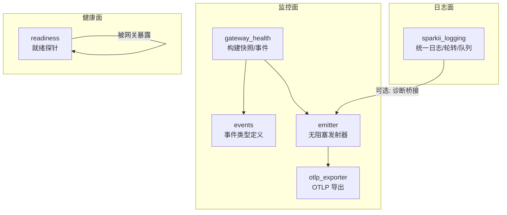
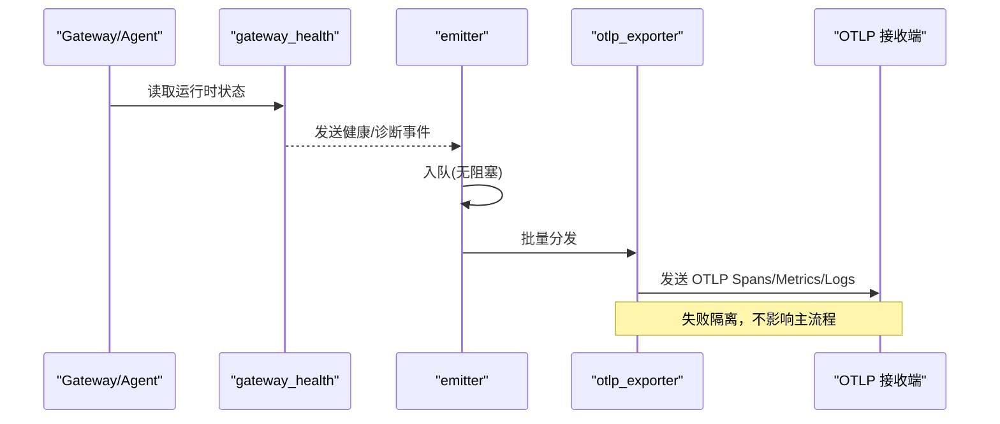
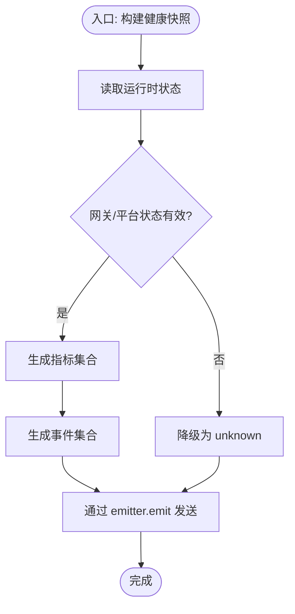
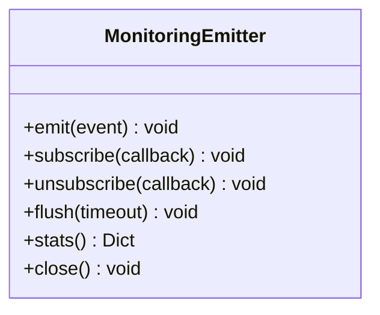
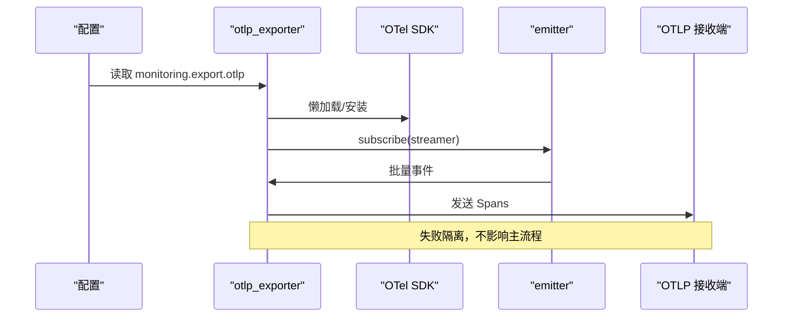
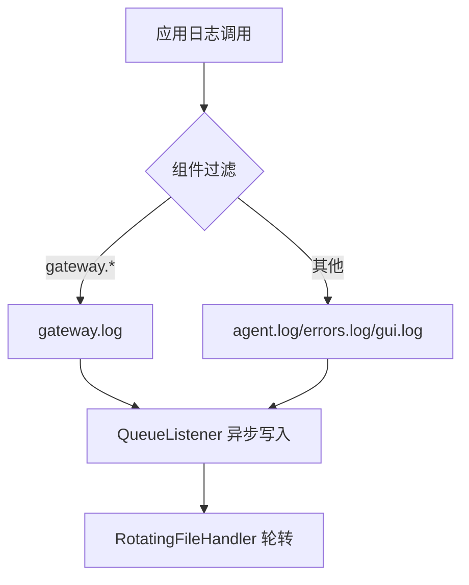
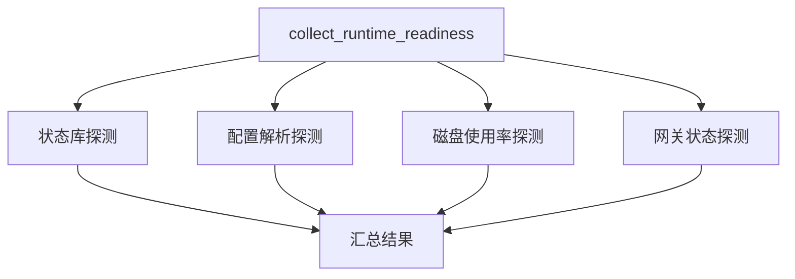
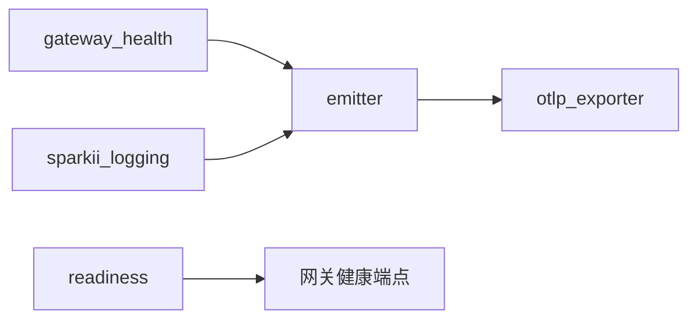

# 监控与日志

<cite>
**本文引用的文件**
- [agent/monitoring/__init__.py](file://agent/monitoring/__init__.py)
- [agent/monitoring/emitter.py](file://agent/monitoring/emitter.py)
- [agent/monitoring/events.py](file://agent/monitoring/events.py)
- [agent/monitoring/gateway_health.py](file://agent/monitoring/gateway_health.py)
- [agent/monitoring/otlp_exporter.py](file://agent/monitoring/otlp_exporter.py)
- [sparkii_logging.py](file://sparkii_logging.py)
- [gateway/readiness.py](file://gateway/readiness.py)
- [docs/observability/monitoring.md](file://docs/observability/monitoring.md)
</cite>

## 目录
1. [简介](#简介)
2. [项目结构](#项目结构)
3. [核心组件](#核心组件)
4. [架构总览](#架构总览)
5. [详细组件分析](#详细组件分析)
6. [依赖关系分析](#依赖关系分析)
7. [性能考量](#性能考量)
8. [故障排查指南](#故障排查指南)
9. [结论](#结论)
10. [附录](#附录)

## 简介
本指南面向运维与平台工程团队，提供在 Sparkii Agent/Gateway 中启用并配置可观测性的完整方案。内容覆盖：
- OpenTelemetry 集成：指标、分布式追踪、日志关联
- Prometheus 与 Grafana 集成：自定义指标与仪表板建议
- 结构化日志：级别、格式化、输出目标与隔离
- APM 工具集成：OpenTelemetry Collector 到 DataDog/New Relic 等
- 健康检查端点与就绪探针
- 告警规则与通知渠道建议
- 日志聚合与分析：ELK/Loki 思路
- 性能监控与瓶颈识别方法

## 项目结构
仓库中与监控和日志相关的关键模块集中在以下位置：
- agent/monitoring：网关健康与诊断事件的生产、发射与 OTLP 导出
- sparkii_logging.py：统一日志初始化、轮转、异步队列写入、组件隔离
- gateway/readiness.py：非破坏性就绪探针（状态库、配置、磁盘、网关状态）
- docs/observability/monitoring.md：监控面说明、启用方式、示例查询与验证流程

图表来源
- [agent/monitoring/gateway_health.py:210-291](file://agent/monitoring/gateway_health.py#L210-L291)
- [agent/monitoring/events.py:19-79](file://agent/monitoring/events.py#L19-L79)
- [agent/monitoring/emitter.py:36-117](file://agent/monitoring/emitter.py#L36-L117)
- [agent/monitoring/otlp_exporter.py:107-133](file://agent/monitoring/otlp_exporter.py#L107-L133)
- [sparkii_logging.py:259-376](file://sparkii_logging.py#L259-L376)
- [gateway/readiness.py:89-119](file://gateway/readiness.py#L89-L119)

章节来源
- [docs/observability/monitoring.md:1-30](file://docs/observability/monitoring.md#L1-L30)

## 核心组件
- 事件模型与生产
  - GatewayHealthEvent / GatewayDiagnosticEvent / CronExecutionEvent：定义内容安全的监控事件形状，仅包含操作所需的最小字段。
  - build_gateway_health_snapshot：从运行时状态生成指标与事件，包含网关/平台健康、繁忙度、可排空性等。
- 发射器（Emitter）
  - MonitoringEmitter：进程内无阻塞队列 + 后台分发线程；emit 永不阻塞、永不抛异常；支持批量分发与订阅者隔离。
- OTLP 导出
  - OTLPStreamer：将事件映射为 OTel Span，通过 BatchSpanProcessor 发送到配置的 OTLP 端点；支持 headers_env 注入认证头。
  - start_streaming：根据配置决定是否启用 OTLP 流式导出，懒加载 SDK，失败不影响主流程。
- 结构化日志
  - setup_logging：集中式日志初始化，按组件路由到不同文件（agent.log、errors.log、gateway.log、gui.log），使用 RedactingFormatter 脱敏，异步队列避免阻塞事件循环。
- 就绪探针
  - collect_runtime_readiness：对状态库、配置、磁盘、网关状态进行只读探测，返回整体 ok/degraded 与各子项详情。

章节来源
- [agent/monitoring/events.py:19-79](file://agent/monitoring/events.py#L19-L79)
- [agent/monitoring/gateway_health.py:210-291](file://agent/monitoring/gateway_health.py#L210-L291)
- [agent/monitoring/emitter.py:36-117](file://agent/monitoring/emitter.py#L36-L117)
- [agent/monitoring/otlp_exporter.py:107-133](file://agent/monitoring/otlp_exporter.py#L107-L133)
- [sparkii_logging.py:259-376](file://sparkii_logging.py#L259-L376)
- [gateway/readiness.py:89-119](file://gateway/readiness.py#L89-L119)

## 架构总览
下图展示了监控数据从产生到导出的端到端路径，以及日志与健康探针的协作关系。

图表来源
- [agent/monitoring/gateway_health.py:310-416](file://agent/monitoring/gateway_health.py#L310-L416)
- [agent/monitoring/emitter.py:53-117](file://agent/monitoring/emitter.py#L53-L117)
- [agent/monitoring/otlp_exporter.py:166-215](file://agent/monitoring/otlp_exporter.py#L166-L215)

## 详细组件分析

### 组件A：监控事件与快照
- 职责
  - 将网关与平台的运行态转换为指标与事件，确保内容安全（不携带用户输入或敏感信息）。
  - 分类错误码、限制状态枚举、派生 busy/drainable 等关键布尔指标。
- 关键点
  - 指标命名规范：sparkii.gateway.*、sparkii.platform.*
  - 事件类型：gateway.lifecycle、platform.state_change、platform.fatal 等
  - 资源属性：service.instance.id（哈希）、service.version、supervision_mode

图表来源
- [agent/monitoring/gateway_health.py:210-291](file://agent/monitoring/gateway_health.py#L210-L291)
- [agent/monitoring/gateway_health.py:310-416](file://agent/monitoring/gateway_health.py#L310-L416)

章节来源
- [agent/monitoring/gateway_health.py:210-291](file://agent/monitoring/gateway_health.py#L210-L291)
- [agent/monitoring/gateway_health.py:310-416](file://agent/monitoring/gateway_health.py#L310-L416)

### 组件B：发射器（无阻塞事件总线）
- 设计原则
  - emit 必须 O(微秒级)、不阻塞、不抛异常；队列满时丢弃最旧事件，保证内存上限。
  - 后台线程批量分发至订阅者（如 OTLP Streamer），每个订阅者失败隔离。
- 能力
  - subscribe/unsubscribe：动态注册/注销消费者
  - flush/drain：测试或退出时的可控刷新
  - stats：观察队列深度、分发数、丢弃数

图表来源
- [agent/monitoring/emitter.py:36-117](file://agent/monitoring/emitter.py#L36-L117)
- [agent/monitoring/emitter.py:133-164](file://agent/monitoring/emitter.py#L133-L164)

章节来源
- [agent/monitoring/emitter.py:36-117](file://agent/monitoring/emitter.py#L36-L117)

### 组件C：OTLP 导出器
- 功能
  - 懒加载 OpenTelemetry SDK，按需安装（feature 'export.otlp'）
  - 构建 TracerProvider + BatchSpanProcessor，将事件映射为 Span 发送至 OTLP 端点
  - 支持 headers_env 注入认证头（值来自环境变量，不在代码中记录）
- 可用性检测
  - is_available：纯检查，不自动安装
  - is_enabled：基于配置判断是否启用
  - start_streaming：启用后订阅 emitter，失败不阻断启动

图表来源
- [agent/monitoring/otlp_exporter.py:37-80](file://agent/monitoring/otlp_exporter.py#L37-L80)
- [agent/monitoring/otlp_exporter.py:107-133](file://agent/monitoring/otlp_exporter.py#L107-L133)
- [agent/monitoring/otlp_exporter.py:218-259](file://agent/monitoring/otlp_exporter.py#L218-L259)

章节来源
- [agent/monitoring/otlp_exporter.py:107-133](file://agent/monitoring/otlp_exporter.py#L107-L133)
- [agent/monitoring/otlp_exporter.py:218-259](file://agent/monitoring/otlp_exporter.py#L218-L259)

### 组件D：结构化日志
- 文件与路由
  - agent.log：全部活动（INFO+）
  - errors.log：警告及以上（快速定位）
  - gateway.log：仅 gateway.* 组件（INFO+）
  - gui.log：GUI/TUI-gateway 组件（INFO+）
- 特性
  - 使用 RedactingFormatter 脱敏，避免敏感信息落盘
  - 异步队列 + QueueListener 避免事件循环阻塞
  - Windows 下使用并发轮转处理器解决锁竞争问题
  - 支持会话上下文注入 session_tag 便于关联

图表来源
- [sparkii_logging.py:259-376](file://sparkii_logging.py#L259-L376)
- [sparkii_logging.py:550-644](file://sparkii_logging.py#L550-L644)
- [sparkii_logging.py:721-759](file://sparkii_logging.py#L721-L759)

章节来源
- [sparkii_logging.py:259-376](file://sparkii_logging.py#L259-L376)
- [sparkii_logging.py:550-644](file://sparkii_logging.py#L550-L644)
- [sparkii_logging.py:721-759](file://sparkii_logging.py#L721-L759)

### 组件E：健康检查与就绪探针
- 能力
  - 只读探测状态库、配置文件、磁盘使用率、网关状态
  - 汇总 overall 状态与各子项状态，供外部系统判定服务健康
- 典型用途
  - Kubernetes liveness/readiness 探针
  - 负载均衡器健康检查

图表来源
- [gateway/readiness.py:27-87](file://gateway/readiness.py#L27-L87)
- [gateway/readiness.py:89-119](file://gateway/readiness.py#L89-L119)

章节来源
- [gateway/readiness.py:89-119](file://gateway/readiness.py#L89-L119)

## 依赖关系分析
- 松耦合
  - 事件生产者（gateway_health）与消费者（OTLP Streamer）通过 emitter 解耦
  - 日志子系统独立于监控面，但可通过诊断日志桥接到监控事件
- 外部依赖
  - OpenTelemetry SDK 为可选依赖，懒加载并在缺失时优雅降级
  - 可对接任意 OTLP 接收端（Collector/DataDog/New Relic 等）

图表来源
- [agent/monitoring/gateway_health.py:310-416](file://agent/monitoring/gateway_health.py#L310-L416)
- [agent/monitoring/emitter.py:53-117](file://agent/monitoring/emitter.py#L53-L117)
- [agent/monitoring/otlp_exporter.py:166-215](file://agent/monitoring/otlp_exporter.py#L166-L215)
- [sparkii_logging.py:259-376](file://sparkii_logging.py#L259-L376)
- [gateway/readiness.py:89-119](file://gateway/readiness.py#L89-L119)

章节来源
- [agent/monitoring/__init__.py:1-30](file://agent/monitoring/__init__.py#L1-L30)

## 性能考量
- 监控面热路径零阻塞
  - emit 使用非阻塞队列，满则丢弃最旧事件，保证微秒级返回
  - 分发线程批量处理，降低网络开销
- 日志面异步化
  - QueueListener 将文件 I/O 移出事件循环，避免 WebSocket 客户端超时
  - Windows 并发轮转处理器避免锁竞争导致的卡顿
- OTLP 导出容错
  - 失败隔离，不影响网关主流程；终端 cron 事件有一次有限时间的 flush 尝试
- 资源属性最小化
  - 仅保留必要标识（实例哈希、版本、监管模式），避免大对象传输

章节来源
- [agent/monitoring/emitter.py:53-117](file://agent/monitoring/emitter.py#L53-L117)
- [sparkii_logging.py:550-644](file://sparkii_logging.py#L550-L644)
- [agent/monitoring/otlp_exporter.py:166-215](file://agent/monitoring/otlp_exporter.py#L166-L215)

## 故障排查指南
- 监控未生效
  - 检查 monitoring.export.otlp.enabled 与 endpoint 是否配置
  - 确认 OTLP SDK 已安装或允许懒安装
  - 使用 sparkii monitoring status 查看姿态
- 指标/事件未到达后端
  - 检查 OTLP 接收端可达性与鉴权头（headers_env）
  - 确认 Collector 的 metric/traces/logs pipeline 已启用
- 日志丢失或延迟
  - 检查 QueueListener 是否正常运行
  - 关注 Windows 并发锁超时场景（已被静默处理）
- 健康探针异常
  - 检查 state.db 可读性、config.yaml 合法性、磁盘使用率阈值

章节来源
- [docs/observability/monitoring.md:43-71](file://docs/observability/monitoring.md#L43-L71)
- [agent/monitoring/otlp_exporter.py:218-259](file://agent/monitoring/otlp_exporter.py#L218-L259)
- [sparkii_logging.py:550-644](file://sparkii_logging.py#L550-L644)
- [gateway/readiness.py:27-87](file://gateway/readiness.py#L27-L87)

## 结论
该监控与日志体系以“内容安全、热路径零阻塞、失败隔离”为核心原则，通过标准化事件模型、无阻塞发射器与 OTLP 导出，实现与主流 APM/日志系统的无缝集成。配合就绪探针与结构化日志，可满足生产环境的稳定性与可观测性需求。建议在部署侧结合 Prometheus/Grafana 或 DataDog/New Relic 建立告警与仪表板，形成闭环的可观测性体系。

## 附录

### OpenTelemetry 集成配置
- 启用方式
  - 在配置文件中开启 monitoring.export.otlp.enabled 并设置 endpoint
  - 可选通过 headers_env 注入认证头（值来自环境变量）
- 采集内容
  - 指标：网关/平台健康、繁忙度、可排空性、活跃代理数等
  - 追踪：生命周期事件（starting/running/draining/stopped/startup_failed）
  - 日志：网关诊断事件（warning/error），仅属性，不导出消息体

章节来源
- [docs/observability/monitoring.md:43-71](file://docs/observability/monitoring.md#L43-L71)
- [agent/monitoring/otlp_exporter.py:107-133](file://agent/monitoring/otlp_exporter.py#L107-L133)

### Prometheus 与 Grafana 集成
- 指标收集
  - 通过 OTLP 接收端转发到后端（如 DataDog），或使用具备 OTLP 能力的中间层
  - 使用 PromQL 风格表达式进行告警（例如网关 up、平台 down、调度心跳过期）
- 仪表板建议
  - 按 service.instance.id 分组展示网关与平台状态
  - 展示调度心跳、最近成功时间、运行任务数、逾期任务数
  - 展示 cron 执行生命周期（claimed/running/completed/failed/unknown）

章节来源
- [docs/observability/monitoring.md:97-155](file://docs/observability/monitoring.md#L97-L155)

### 结构化日志配置
- 日志级别
  - agent.log：INFO+
  - errors.log：WARNING+
  - gateway.log：INFO+（仅 gateway.*）
  - gui.log：INFO+（GUI/TUI-gateway）
- 格式化与脱敏
  - 使用 RedactingFormatter 防止敏感信息落盘
  - 支持会话上下文注入 session_tag
- 输出目标
  - 本地文件（轮转），可按组件分离
  - 如需集中化，可将日志接入 ELK/Loki（通过 sidecar/agent）

章节来源
- [sparkii_logging.py:259-376](file://sparkii_logging.py#L259-L376)
- [sparkii_logging.py:550-644](file://sparkii_logging.py#L550-L644)

### APM 工具集成
- 推荐路径
  - 通过 OpenTelemetry Collector 接收 OTLP，再转发至 DataDog/New Relic 等
  - 在 Collector 中配置 metrics/traces/logs pipelines
- 注意事项
  - 确保后端能正确解析资源属性（service.name、service.instance.id、version）
  - 保持信号内容安全（不携带用户输入或敏感信息）

章节来源
- [docs/observability/monitoring.md:73-95](file://docs/observability/monitoring.md#L73-L95)

### 健康检查端点与就绪探针
- 就绪探针
  - 使用 collect_runtime_readiness 获取只读的健康状态
  - 适用于 Kubernetes readiness/liveness 探针
- 健康端点
  - 详细健康端点需鉴权，仅暴露状态与计数，不暴露配置或凭据

章节来源
- [gateway/readiness.py:89-119](file://gateway/readiness.py#L89-L119)

### 告警规则配置
- 指标告警
  - sparkii.gateway.up == 0（网关不可用）
  - sparkii_platform_up == 0（本地桥不可用）
  - sparkii_cron_scheduler_heartbeat_age_seconds > 180（调度心跳过期）
  - sparkii_cron_jobs_overdue > 0（任务逾期）
- 事件告警
  - 基于 cron_execution spans 的状态与 error_class
  - 基于 platform.fatal 的诊断事件

章节来源
- [docs/observability/monitoring.md:97-155](file://docs/observability/monitoring.md#L97-L155)

### 日志聚合与分析
- 方案建议
  - 本地日志（agent.log/errors.log/gateway.log/gui.log）用于快速定位
  - 集中化存储（ELK/Loki）用于跨实例检索与关联
  - 结合监控事件与日志 trace_id/session_id 进行关联分析
- 最佳实践
  - 保持日志脱敏与最小化
  - 使用组件过滤与日志级别控制噪音

章节来源
- [sparkii_logging.py:259-376](file://sparkii_logging.py#L259-L376)

### 性能监控与瓶颈识别
- 关键指标
  - active_agents、background_work、background_delegations 反映负载压力
  - gateway.busy、gateway.drainable 指示可伸缩性
  - cron 调度心跳与逾期数量反映调度健康
- 分析方法
  - 按实例分组观察趋势与峰值
  - 结合平台状态变化（connecting/disconnected/fatal）定位根因
  - 使用 OTLP 捕获脚本进行端到端验证

章节来源
- [docs/observability/monitoring.md:15-41](file://docs/observability/monitoring.md#L15-L41)
- [docs/observability/monitoring.md:182-195](file://docs/observability/monitoring.md#L182-L195)