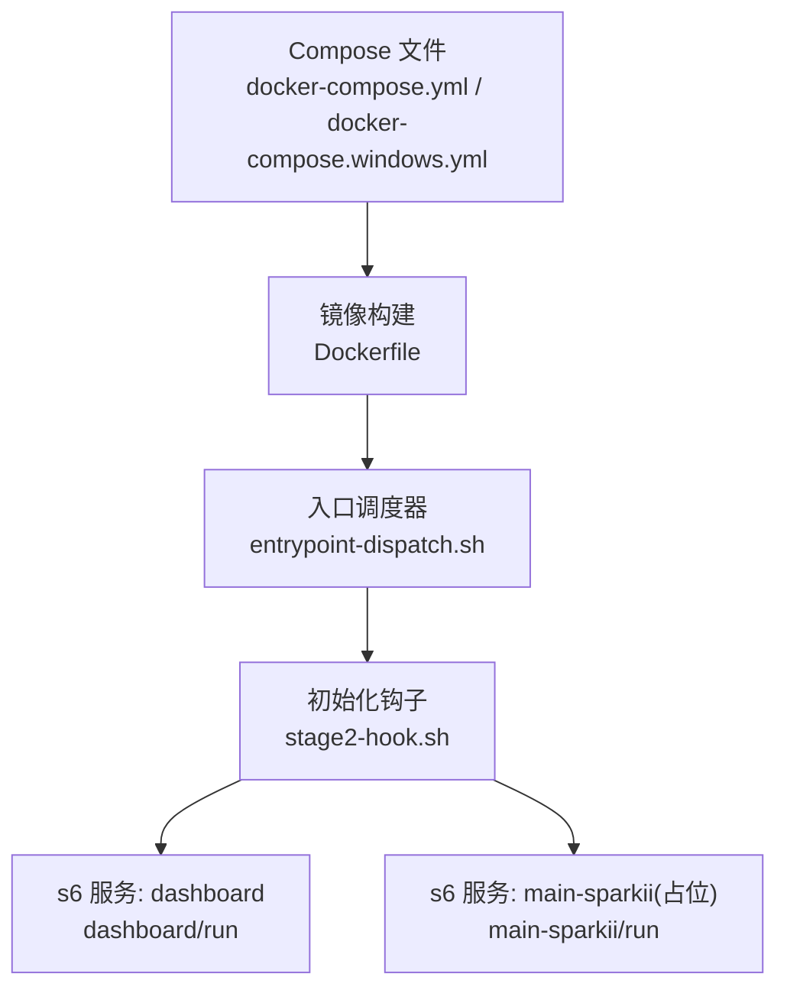
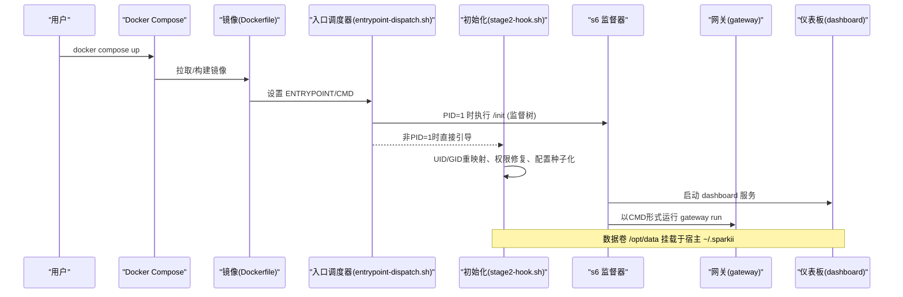
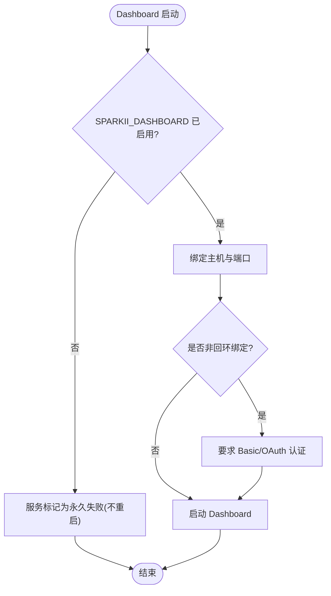
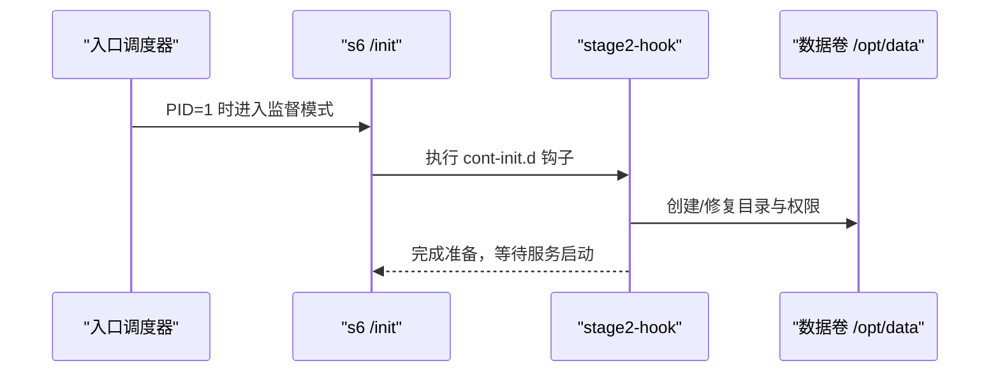
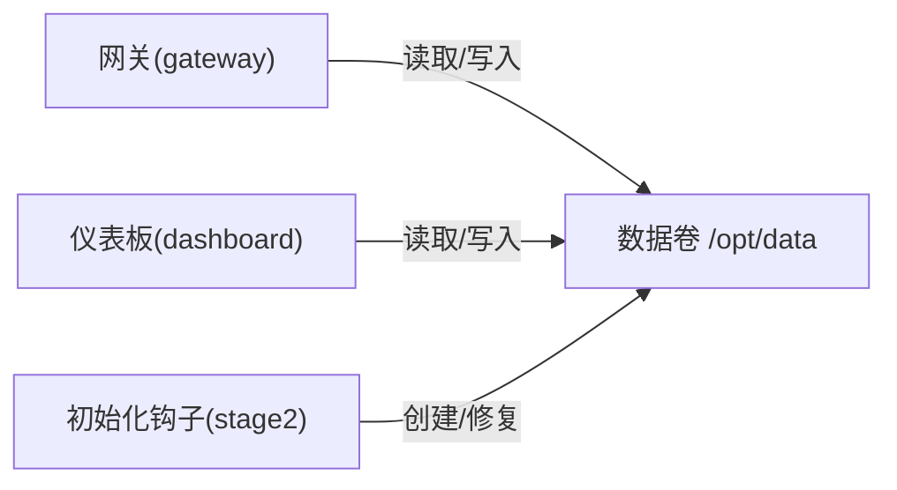

# Docker Compose编排

<cite>
**本文引用的文件**
- [docker-compose.yml](file://docker-compose.yml)
- [docker-compose.windows.yml](file://docker-compose.windows.yml)
- [Dockerfile](file://Dockerfile)
- [entrypoint-dispatch.sh](file://docker/entrypoint-dispatch.sh)
- [stage2-hook.sh](file://docker/stage2-hook.sh)
- [s6-rc.d/dashboard/run](file://docker/s6-rc.d/dashboard/run)
- [s6-rc.d/main-sparkii/run](file://docker/s6-rc.d/main-sparkii/run)
</cite>

## 目录
1. [简介](#简介)
2. [项目结构](#项目结构)
3. [核心组件](#核心组件)
4. [架构总览](#架构总览)
5. [详细组件分析](#详细组件分析)
6. [依赖关系分析](#依赖关系分析)
7. [性能与资源限制](#性能与资源限制)
8. [故障恢复与高可用](#故障恢复与高可用)
9. [生产环境编排模板](#生产环境编排模板)
10. [不同部署场景配置示例](#不同部署场景配置示例)
11. [排错指南](#排错指南)
12. [结论](#结论)

## 简介
本文件面向使用 Docker Compose 编排 Sparkii Agent 的运维与开发者，系统说明服务定义、网络拓扑、数据卷管理、环境变量与敏感信息管理、Windows 平台差异、生产级健康检查与重启策略、监控集成以及故障恢复机制。文档基于仓库内提供的 Compose 文件、Dockerfile 与 s6-overlay 服务脚本进行解读，确保内容与实际实现一致。

## 项目结构
- 顶层编排：提供 Linux/macOS 默认编排（host 网络）与 Windows 专用编排（端口映射）。
- 镜像构建：通过多阶段构建安装系统依赖、Node/Python 工具链、s6-overlay 监督器，并预构建前端与 Python 依赖。
- 启动流程：入口调度器根据是否拥有 PID 1 决定走 s6-overlay 监督路径或直接引导；随后执行 stage2 初始化钩子完成用户映射、权限修复、配置种子化等；最后由 s6 启动 dashboard 与主进程占位服务。

**图表来源**
- [docker-compose.yml:29-77](file://docker-compose.yml#L29-L77)
- [docker-compose.windows.yml:12-39](file://docker-compose.windows.yml#L12-L39)
- [Dockerfile:424-458](file://Dockerfile#L424-L458)
- [entrypoint-dispatch.sh:1-26](file://docker/entrypoint-dispatch.sh#L1-L26)
- [stage2-hook.sh:1-17](file://docker/stage2-hook.sh#L1-L17)
- [s6-rc.d/dashboard/run:1-57](file://docker/s6-rc.d/dashboard/run#L1-L57)
- [s6-rc.d/main-sparkii/run:1-28](file://docker/s6-rc.d/main-sparkii/run#L1-L28)

**章节来源**
- [docker-compose.yml:1-77](file://docker-compose.yml#L1-L77)
- [docker-compose.windows.yml:1-39](file://docker-compose.windows.yml#L1-L39)
- [Dockerfile:1-458](file://Dockerfile#L1-L458)

## 核心组件
- 网关服务（gateway）：Sparkii 的核心运行时，负责会话、工具调用、外部适配器与消息通道。
- 仪表板服务（dashboard）：Web 控制台，用于查看状态、管理会话与配置，默认仅本地访问或通过隧道暴露。
- 主进程占位服务（main-sparkii）：为满足 s6-overlay 要求而存在的占位服务，实际 CMD 作为容器“主程序”运行。

关键要点
- 默认网络模式为 host（Linux），Windows 版本使用显式端口映射。
- 数据卷统一挂载到 /opt/data，持久化会话、日志、配置与技能等。
- 通过 SPARKII_UID/SPARKII_GID（或 PUID/PGID）在启动时重映射内部 sparkii 用户，保证宿主机可读可写。

**章节来源**
- [docker-compose.yml:29-77](file://docker-compose.yml#L29-L77)
- [docker-compose.windows.yml:12-39](file://docker-compose.windows.yml#L12-L39)
- [Dockerfile:149-151](file://Dockerfile#L149-L151)
- [stage2-hook.sh:97-116](file://docker/stage2-hook.sh#L97-L116)

## 架构总览
下图展示了从 Compose 到镜像、入口调度、初始化钩子再到 s6 服务的完整链路，以及数据卷与环境变量的作用点。

**图表来源**
- [docker-compose.yml:29-77](file://docker-compose.yml#L29-L77)
- [docker-compose.windows.yml:12-39](file://docker-compose.windows.yml#L12-L39)
- [Dockerfile:424-458](file://Dockerfile#L424-L458)
- [entrypoint-dispatch.sh:1-26](file://docker/entrypoint-dispatch.sh#L1-L26)
- [stage2-hook.sh:1-17](file://docker/stage2-hook.sh#L1-L17)
- [s6-rc.d/dashboard/run:1-57](file://docker/s6-rc.d/dashboard/run#L1-L57)

## 详细组件分析

### 网关服务（gateway）
- 启动方式：Compose 中通过 command 指定 ["gateway", "run"]。
- 网络：Linux 默认 network_mode: host；Windows 使用端口映射（如需对外暴露需结合反向代理与鉴权）。
- 数据卷：~/.sparkii:/opt/data，所有持久化数据落盘。
- 环境变量：支持 Teams、Google Chat 等通道开关与凭据注入（通过 .env 或 Compose environment）。

注意
- 若启用 API 服务器对外暴露，必须设置 API_SERVER_KEY 并谨慎绑定地址。
- 不建议将 dashboard 直接暴露到公网，建议使用 SSH 隧道或带鉴权的反向代理。

**章节来源**
- [docker-compose.yml:30-61](file://docker-compose.yml#L30-L61)
- [docker-compose.windows.yml:13-22](file://docker-compose.windows.yml#L13-L22)

### 仪表板服务（dashboard）
- 启动方式：s6 监督的服务，受环境变量控制是否启用。
- 监听：默认仅本地 127.0.0.1:9119；Windows 版可通过端口映射暴露。
- 安全：非回环地址绑定需要认证提供者（Basic Auth 或 OAuth），不再接受 insecure 关闭鉴权。
- 依赖：depends_on gateway，确保网关先启动。

**图表来源**
- [s6-rc.d/dashboard/run:1-57](file://docker/s6-rc.d/dashboard/run#L1-L57)
- [docker-compose.yml:63-77](file://docker-compose.yml#L63-L77)
- [docker-compose.windows.yml:24-39](file://docker-compose.windows.yml#L24-L39)

**章节来源**
- [s6-rc.d/dashboard/run:1-57](file://docker/s6-rc.d/dashboard/run#L1-L57)
- [docker-compose.yml:63-77](file://docker-compose.yml#L63-L77)
- [docker-compose.windows.yml:24-39](file://docker-compose.windows.yml#L24-L39)

### 主进程占位服务（main-sparkii）
- 作用：满足 s6-overlay 至少一个用户服务的要求；当前实现为 sleep infinity。
- 实际主程序：容器 CMD 指定的命令（如 gateway run）由 /init 作为“主程序”运行，退出即容器退出。

**章节来源**
- [s6-rc.d/main-sparkii/run:1-28](file://docker/s6-rc.d/main-sparkii/run#L1-L28)
- [Dockerfile:424-458](file://Dockerfile#L424-L458)

### 入口调度器与初始化钩子
- 入口调度器：检测是否为 PID 1，若是则交由 s6-overlay 的 /init 接管；否则直接执行 stage2 与主包装脚本。
- 初始化钩子：负责 UID/GID 重映射、数据卷权限修复、配置文件种子化、浏览器二进制发现、skills 同步等。

**图表来源**
- [entrypoint-dispatch.sh:1-26](file://docker/entrypoint-dispatch.sh#L1-L26)
- [stage2-hook.sh:1-17](file://docker/stage2-hook.sh#L1-L17)
- [stage2-hook.sh:76-95](file://docker/stage2-hook.sh#L76-L95)
- [stage2-hook.sh:174-255](file://docker/stage2-hook.sh#L174-L255)

**章节来源**
- [entrypoint-dispatch.sh:1-26](file://docker/entrypoint-dispatch.sh#L1-L26)
- [stage2-hook.sh:1-592](file://docker/stage2-hook.sh#L1-L592)

## 依赖关系分析
- 服务间依赖：dashboard depends_on gateway。
- 运行时依赖：s6-overlay 监督 dashboard 与主进程；stage2-hook 在用户服务前执行。
- 数据依赖：所有服务共享 /opt/data 卷，包含会话、日志、配置、技能等。

**图表来源**
- [docker-compose.yml:63-77](file://docker-compose.yml#L63-L77)
- [docker-compose.windows.yml:24-39](file://docker-compose.windows.yml#L24-L39)
- [stage2-hook.sh:174-255](file://docker/stage2-hook.sh#L174-L255)

**章节来源**
- [docker-compose.yml:29-77](file://docker-compose.yml#L29-L77)
- [docker-compose.windows.yml:12-39](file://docker-compose.windows.yml#L12-L39)

## 性能与资源限制
- 资源限制：当前 Compose 未声明 CPU/内存限制。建议在编排层按场景添加 limits/reservations，避免单实例占用过多资源。
- 网络模式：Linux 使用 host 网络以获得最佳性能与端口直出；Windows 使用端口映射，注意端口冲突。
- I/O 优化：数据卷挂载到宿主机目录，减少跨层拷贝；Playwright 浏览器缓存置于 /opt/sparkii/.playwright，避免被数据卷覆盖导致重建。

建议
- 在生产环境中为 gateway 与 dashboard 分别设置 CPU/内存上限与保留值。
- 对磁盘 IO 密集的场景，考虑使用独立卷或 SSD 存储后端。

[本节为通用指导，无需特定文件引用]

## 故障恢复与高可用
- 自动重启：Compose 中 restart: unless-stopped 保证服务异常退出后自动拉起。
- 健康检查：可在 Compose 中添加 healthcheck 探测网关与仪表板端口，配合 restart 策略提升可用性。
- 数据备份：/opt/data 为持久化根目录，建议定期备份 sessions、logs、config.yaml、auth.json 等关键目录与文件。
- 状态同步：多实例部署时需确保共享存储一致性与会话隔离策略；当前 Compose 为单机单实例模型。

**章节来源**
- [docker-compose.yml:30-77](file://docker-compose.yml#L30-L77)
- [docker-compose.windows.yml:13-39](file://docker-compose.windows.yml#L13-L39)

## 生产环境编排模板
以下模板为生产环境的推荐实践（概念性示例，可直接扩展至现有 Compose）：
- 健康检查：对 gateway 与 dashboard 端口进行 HTTP/TCP 探测。
- 重启策略：restart: unless-stopped 或 on-failure 配合重试次数。
- 资源配额：limits 与 reservations 明确 CPU/内存上限与保留。
- 监控集成：通过 OTLP 导出器或侧车收集指标与追踪；确保镜像已包含相关依赖。
- 安全加固：仅暴露必要端口，使用反向代理与鉴权；禁用不安全选项。

提示
- 参考镜像已内置 OTLP 相关 extra，可按需开启 Gateway Health Export。
- 仪表板非回环绑定必须配置认证提供者（Basic/OAuth）。

[本节为通用指导，无需特定文件引用]

## 不同部署场景配置示例

### 开发环境
- 网络：Linux 使用 host 网络；Windows 使用端口映射。
- 数据卷：~/.sparkii 映射到 /opt/data，便于快速迭代。
- 环境变量：按需启用 Teams/Google Chat 等通道；调试时可临时放宽限制（遵循安全建议）。

**章节来源**
- [docker-compose.yml:30-77](file://docker-compose.yml#L30-L77)
- [docker-compose.windows.yml:13-39](file://docker-compose.windows.yml#L13-L39)

### 测试环境
- 资源限制：为各服务设置合理的 CPU/内存上限，模拟受限环境。
- 健康检查：加入探针，验证服务就绪。
- 日志收集：将 logs 目录纳入集中采集；必要时调整日志级别。

**章节来源**
- [docker-compose.yml:30-77](file://docker-compose.yml#L30-L77)

### 生产环境
- 安全：仅暴露必要端口，使用反向代理与鉴权；仪表板禁止 insecure。
- 高可用：结合集群编排（Kubernetes/Docker Swarm）实现多副本与滚动更新。
- 备份：定时备份 /opt/data 关键目录；建立灾难恢复流程。
- 监控：启用 OTLP 导出，接入指标与追踪系统。

**章节来源**
- [docker-compose.yml:30-77](file://docker-compose.yml#L30-L77)
- [docker-compose.windows.yml:24-39](file://docker-compose.windows.yml#L24-L39)

## 排错指南
常见问题与定位
- 无法写入数据卷：确认 SPARKII_UID/SPARKII_GID 或 PUID/PGID 设置正确；检查 stage2 是否成功修复权限。
- 仪表板无法访问：确认绑定地址与端口；非回环绑定需配置认证；Windows 下检查端口映射。
- 浏览器工具失败：确认 Playwright 安装的 Chromium 二进制已被发现并导出相应环境变量。
- 外部命令权限不足：如需在容器内操作 Docker，确保 socket 组权限已正确配置。

排查步骤
- 查看容器日志：关注 stage2 输出与服务启动信息。
- 检查数据卷：确认 /opt/data 下的关键目录与文件存在且权限正确。
- 校验环境变量：核对敏感信息与通道配置是否正确注入。

**章节来源**
- [stage2-hook.sh:97-116](file://docker/stage2-hook.sh#L97-L116)
- [stage2-hook.sh:174-255](file://docker/stage2-hook.sh#L174-L255)
- [stage2-hook.sh:543-589](file://docker/stage2-hook.sh#L543-L589)
- [s6-rc.d/dashboard/run:1-57](file://docker/s6-rc.d/dashboard/run#L1-L57)

## 结论
本编排方案通过 s6-overlay 提供稳定的服务监督与生命周期管理，结合数据卷持久化与环境变量注入，实现了跨平台的可移植部署。Linux 默认 host 网络带来高性能与简单端口管理，Windows 通过端口映射兼容 Docker Desktop。生产环境应补充健康检查、资源限制、监控与安全加固，形成完整的可观测性与高可用体系。