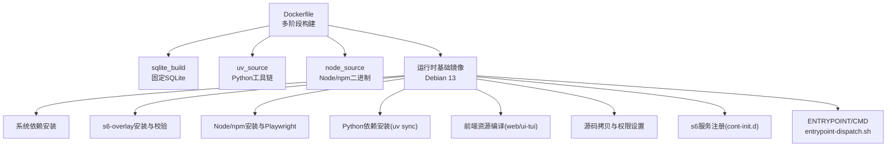
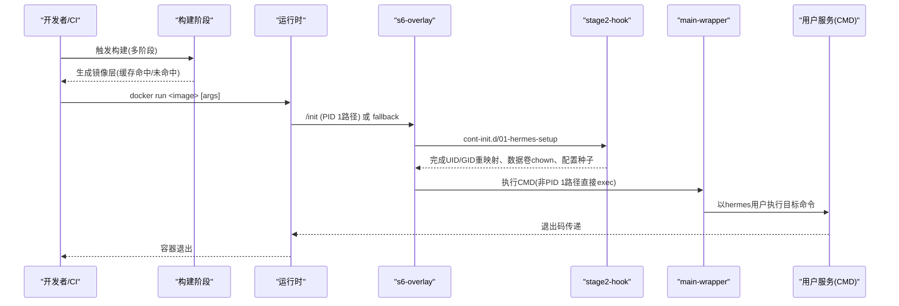
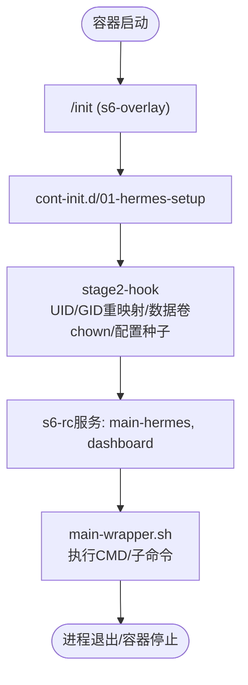
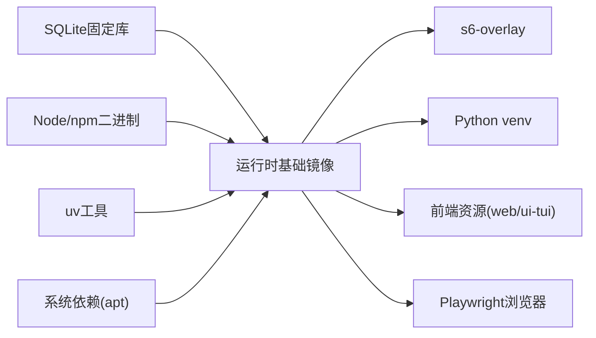

# Docker镜像构建

<cite>
**本文引用的文件**
- [Dockerfile](file://Dockerfile)
- [docker/entrypoint.sh](file://docker/entrypoint.sh)
- [docker/main-wrapper.sh](file://docker/main-wrapper.sh)
- [docker/stage2-hook.sh](file://docker/stage2-hook.sh)
- [docker/s6-rc.d/main-hermes/run](file://docker/s6-rc.d/main-hermes/run)
- [docker/s6-rc.d/dashboard/run](file://docker/s6-rc.d/dashboard/run)
- [.github/workflows/docker.yml](file://.github/workflows/docker.yml)
- [.dockerignore](file://.dockerignore)
</cite>

## 目录
1. [简介](#简介)
2. [项目结构](#项目结构)
3. [核心组件](#核心组件)
4. [架构总览](#架构总览)
5. [详细组件分析](#详细组件分析)
6. [依赖关系分析](#依赖关系分析)
7. [性能考虑](#性能考虑)
8. [故障排查指南](#故障排查指南)
9. [结论](#结论)
10. [附录](#附录)

## 简介
本文件面向希望理解并优化该项目的Docker镜像构建流程的工程师与运维人员。文档围绕多阶段构建策略、层缓存优化、安全加固、s6-overlay服务管理、构建参数配置以及性能优化建议展开，帮助读者在生产环境中稳定、高效地构建和运行镜像。

## 项目结构
镜像构建由根级Dockerfile主导，配合docker目录下的启动脚本与服务定义，以及CI工作流完成多架构构建与发布。关键目录与职责：
- 根目录Dockerfile：定义多阶段构建（SQLite固定版本、Node.js环境、Python依赖、前端资源编译）、系统依赖安装、s6-overlay集成、运行时环境变量与入口点。
- docker目录：包含s6-overlay服务定义、初始化钩子、主进程包装器、兼容shim等。
- .github/workflows/docker.yml：多架构构建、测试、发布流水线，含缓存与标签策略。
- .dockerignore：控制构建上下文，避免无关文件污染层缓存。

图表来源
- [Dockerfile:1-458](file://Dockerfile#L1-L458)

章节来源
- [Dockerfile:1-458](file://Dockerfile#L1-L458)
- [.github/workflows/docker.yml:1-290](file://.github/workflows/docker.yml#L1-L290)
- [.dockerignore:1-106](file://.dockerignore#L1-L106)

## 核心组件
- 多阶段构建
  - sqlite_build：从源码编译固定版本的SQLite，修复上游WAL重置损坏问题，确保运行时库安全可用。
  - uv_source：提供Python包管理工具uv，用于快速、可复现的依赖解析与安装。
  - node_source：复制Node 26与npm二进制，保证工具链一致性与兼容性。
- 运行时基础镜像
  - Debian 13作为基础，安装系统依赖，替换为固定SQLite库，安装s6-overlay进行进程监督。
- 依赖与资源
  - Node依赖与Playwright浏览器通过npm安装并缓存；Python依赖通过uv同步；前端资源预编译到镜像。
- 服务管理
  - s6-overlay负责主进程、Dashboard及动态网关服务的生命周期管理；cont-init.d执行初始化钩子。
- 入口与调度
  - entrypoint-dispatch.sh作为统一入口，支持PID 1与非PID 1两种模式，转发至s6或main-wrapper。

章节来源
- [Dockerfile:1-458](file://Dockerfile#L1-L458)
- [docker/entrypoint.sh:1-29](file://docker/entrypoint.sh#L1-L29)
- [docker/main-wrapper.sh:1-92](file://docker/main-wrapper.sh#L1-L92)
- [docker/stage2-hook.sh:1-592](file://docker/stage2-hook.sh#L1-L592)
- [docker/s6-rc.d/main-hermes/run:1-28](file://docker/s6-rc.d/main-hermes/run#L1-L28)
- [docker/s6-rc.d/dashboard/run:1-57](file://docker/s6-rc.d/dashboard/run#L1-L57)

## 架构总览
下图展示了镜像构建与运行时的关键阶段与交互：

图表来源
- [Dockerfile:424-458](file://Dockerfile#L424-L458)
- [docker/stage2-hook.sh:1-592](file://docker/stage2-hook.sh#L1-L592)
- [docker/main-wrapper.sh:1-92](file://docker/main-wrapper.sh#L1-L92)

## 详细组件分析

### 多阶段构建策略与层缓存优化
- SQLite固定版本构建
  - 在独立阶段下载并编译指定版本的SQLite，启用必要特性（FTS、RTree、Geopoly等），并通过链接替换系统库，确保运行时使用无漏洞版本。
  - 自测验证：导入sqlite3模块后创建虚拟表并执行匹配查询，失败则构建中断。
- Node.js环境准备
  - 从node:26-bookworm-slim复制node与npm二进制，创建npm/npx软链接，禁用corepack以避免额外依赖。
  - 仅复制必要的package.json与lock文件，最大化npm install层的缓存命中率；随后安装Playwright浏览器并清理缓存。
- Python依赖安装
  - 使用uv sync --frozen锁定依赖解析，仅安装生产所需extras（all/messaging/otlp等），避免开发或平台特定依赖进入镜像。
  - 将pyproject.toml与uv.lock前置COPY，使依赖解析与wheel下载层独立缓存。
- 前端资源编译
  - web与ui-tui分别构建，产物被环境变量指向，避免运行时再次安装或编译。
- COPY顺序与缓存策略
  - 先拷贝manifest与锁文件，再拷贝源码；使用--link与--chmod减少后续权限调整开销；.dockerignore排除无关目录，防止无效缓存失效。

章节来源
- [Dockerfile:1-458](file://Dockerfile#L1-L458)
- [.dockerignore:1-106](file://.dockerignore#L1-L106)

### 安全加固措施
- 非root用户运行
  - 创建hermes用户（默认UID 10000），服务通过s6-setuidgid降权执行；禁止以任意非hermes UID启动容器，引导用户使用HERMES_UID/PUID机制。
- 最小化镜像大小
  - 使用slim基础镜像；仅安装必要系统依赖；清理apt列表与npm缓存；排除测试、文档、桌面应用等无关内容。
- 漏洞与依赖验证
  - 固定SQLite版本并校验SHA256；s6-overlay各tarball均校验哈希；构建时禁用审计以减少网络调用但保持确定性。
- 只读安装树与可写数据卷
  - /opt/hermes设置为只读，运行时状态位于/opt/data；可选后端懒安装重定向到数据卷，避免破坏核心venv。

章节来源
- [Dockerfile:149-151](file://Dockerfile#L149-L151)
- [Dockerfile:169-286](file://Dockerfile#L169-L286)
- [docker/stage2-hook.sh:26-74](file://docker/stage2-hook.sh#L26-L74)
- [docker/stage2-hook.sh:257-275](file://docker/stage2-hook.sh#L257-L275)

### s6-overlay服务管理器集成
- 服务定义
  - main-hermes：占位服务以满足s6-rc要求，当前不执行业务逻辑。
  - dashboard：根据环境变量决定是否启动Dashboard服务，监听端口并支持认证配置。
- 进程监控与优雅关闭
  - s6-svscan作为PID 1接管进程树，自动回收僵尸进程；finish脚本标记永久失败状态，避免重启风暴。
- 初始化钩子
  - cont-init.d/01-hermes-setup执行stage2-hook，完成UID/GID重映射、数据卷所有权修复、配置种子、技能同步、Chromium路径发现等。
- 入口分发
  - entrypoint-dispatch.sh在PID 1路径下exec /init，在非PID 1路径下直接执行stage2-hook与main-wrapper，保证交互式命令与子命令透传一致性。

图表来源
- [docker/s6-rc.d/main-hermes/run:1-28](file://docker/s6-rc.d/main-hermes/run#L1-L28)
- [docker/s6-rc.d/dashboard/run:1-57](file://docker/s6-rc.d/dashboard/run#L1-L57)
- [docker/stage2-hook.sh:1-592](file://docker/stage2-hook.sh#L1-L592)
- [docker/main-wrapper.sh:1-92](file://docker/main-wrapper.sh#L1-L92)

章节来源
- [docker/s6-rc.d/main-hermes/run:1-28](file://docker/s6-rc.d/main-hermes/run#L1-L28)
- [docker/s6-rc.d/dashboard/run:1-57](file://docker/s6-rc.d/dashboard/run#L1-L57)
- [docker/stage2-hook.sh:1-592](file://docker/stage2-hook.sh#L1-L592)
- [docker/entrypoint.sh:1-29](file://docker/entrypoint.sh#L1-L29)
- [docker/main-wrapper.sh:1-92](file://docker/main-wrapper.sh#L1-L92)

### 构建参数配置选项
- TARGETARCH：用于选择s6-overlay架构包（amd64/arm64），实现多架构构建。
- HERMES_GIT_SHA：注入构建时Git提交哈希，便于运行时识别镜像来源。
- 其他可选环境变量（运行时）：HERMES_UID/HERMES_GID、PUID/PGID、HERMES_DASHBOARD_*、HERMES_HOME等，用于用户映射、Dashboard开关与路径配置。

章节来源
- [Dockerfile:107-135](file://Dockerfile#L107-L135)
- [Dockerfile:331-334](file://Dockerfile#L331-L334)
- [docker/stage2-hook.sh:97-116](file://docker/stage2-hook.sh#L97-L116)
- [docker/s6-rc.d/dashboard/run:9-57](file://docker/s6-rc.d/dashboard/run#L9-L57)

## 依赖关系分析
- 构建期依赖
  - SQLite源码与编译工具链；Node/npm二进制；Python uv工具；系统库（ffmpeg、libolm-dev等）。
- 运行期依赖
  - s6-overlay进程监督；Python venv与已安装的包；Node预编译前端资源；Playwright浏览器二进制。
- 外部集成点
  - GitHub Releases（s6-overlay tarball）；PyPI/私有源（Python依赖）；NPM Registry（Node依赖）。

图表来源
- [Dockerfile:64-91](file://Dockerfile#L64-L91)
- [Dockerfile:152-220](file://Dockerfile#L152-L220)
- [Dockerfile:222-276](file://Dockerfile#L222-L276)

章节来源
- [Dockerfile:1-458](file://Dockerfile#L1-L458)

## 性能考虑
- 并行编译
  - SQLite构建使用make -j$(nproc)；Node与Python依赖安装尽量利用本地缓存与离线模式。
- 依赖预编译
  - Python依赖通过uv sync --frozen锁定版本并预装；前端资源预构建，避免运行时npm install。
- 缓存策略配置
  - 分层COPY：manifest先行，源码后置；使用--link与--chmod减少权限操作；.dockerignore排除无关内容；CI使用GitHub Actions缓存作用域隔离不同架构。
- 构建优化建议
  - 复用node_modules与.venv缓存；合理划分阶段，避免重复下载；使用镜像多阶段分离构建与运行环境。

章节来源
- [Dockerfile:8-41](file://Dockerfile#L8-L41)
- [Dockerfile:171-220](file://Dockerfile#L171-L220)
- [Dockerfile:222-276](file://Dockerfile#L222-L276)
- [.github/workflows/docker.yml:33-84](file://.github/workflows/docker.yml#L33-L84)

## 故障排查指南
- 启动失败：检查是否以非root且非hermes UID启动，参考错误提示改用HERMES_UID/PUID方式。
- 权限问题：确认/opt/data所有权正确，stage2-hook会在启动时修复；若挂载宿主机目录，注意避免符号链接导致的安全拒绝。
- Dashboard无法访问：确认HERMES_DASHBOARD开启并配置认证提供者；非回环地址必须启用认证。
- 浏览器工具失败：检查PLAYWRIGHT_BROWSERS_PATH是否存在，stage2-hook会尝试发现Chromium二进制并导出环境变量。

章节来源
- [docker/stage2-hook.sh:26-74](file://docker/stage2-hook.sh#L26-L74)
- [docker/stage2-hook.sh:543-589](file://docker/stage2-hook.sh#L543-L589)
- [docker/s6-rc.d/dashboard/run:9-57](file://docker/s6-rc.d/dashboard/run#L9-L57)

## 结论
该镜像采用严谨的多阶段构建与分层缓存策略，结合s6-overlay实现可靠的进程管理与优雅关闭，同时通过固定依赖版本、非root运行与只读安装树强化安全性。CI流水线支持多架构构建与发布，并提供丰富的运行时配置选项。遵循本文档的最佳实践，可在生产环境中获得稳定、高效、安全的部署体验。

## 附录
- 常用构建命令示例（概念性说明）
  - 本地构建：docker build --build-arg HERMES_GIT_SHA=$(git rev-parse HEAD) -t hermes-agent:dev .
  - 多架构构建：使用BuildKit与--platform指定目标架构，或通过CI工作流触发。
- 参考文件
  - 构建与发布流水线：.github/workflows/docker.yml
  - 忽略规则：.dockerignore

[本节为概念性内容，不直接分析具体文件，故无“章节来源”标注]