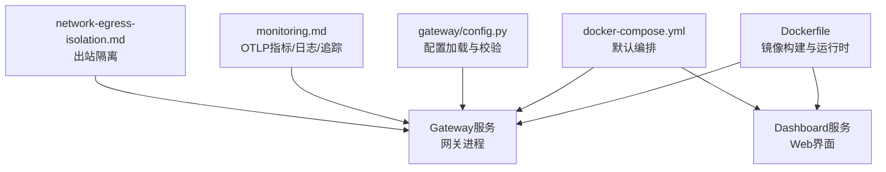
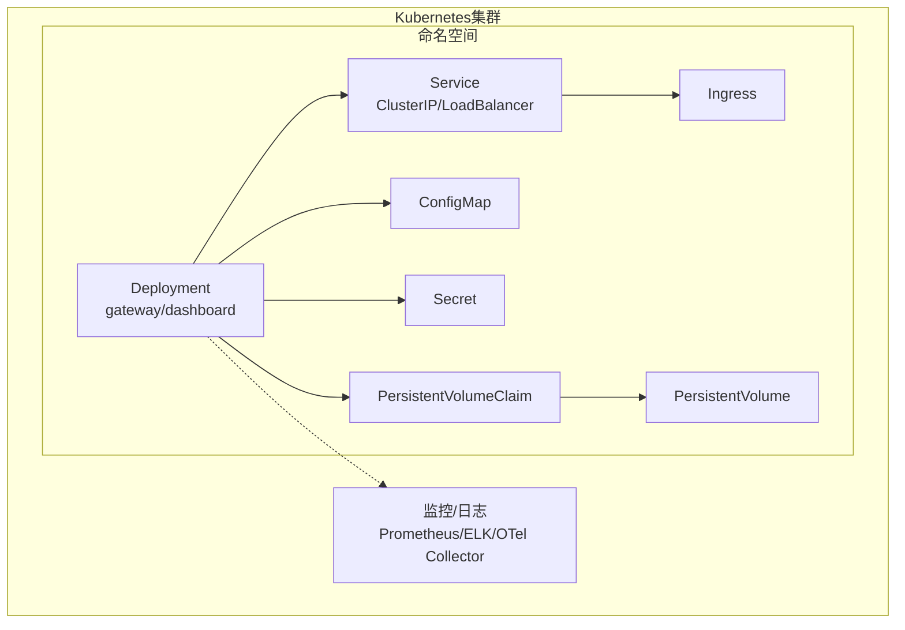
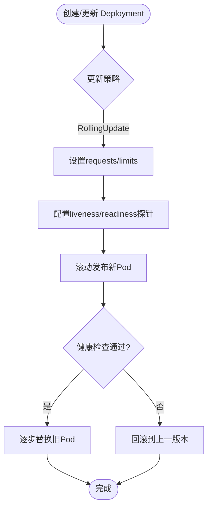
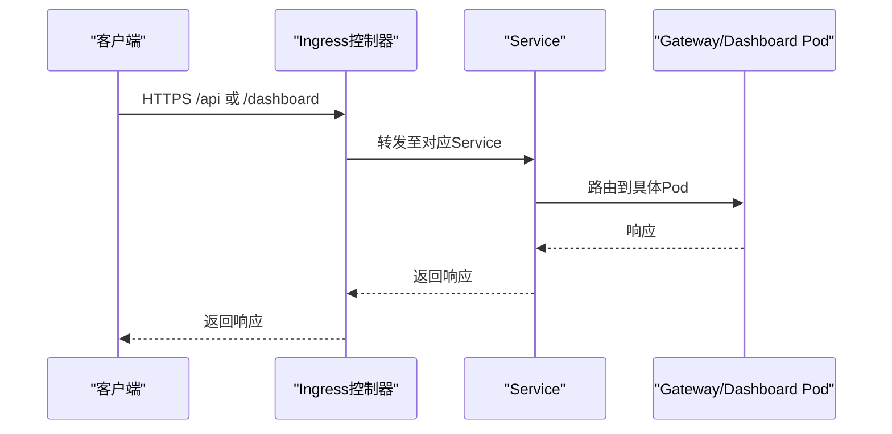
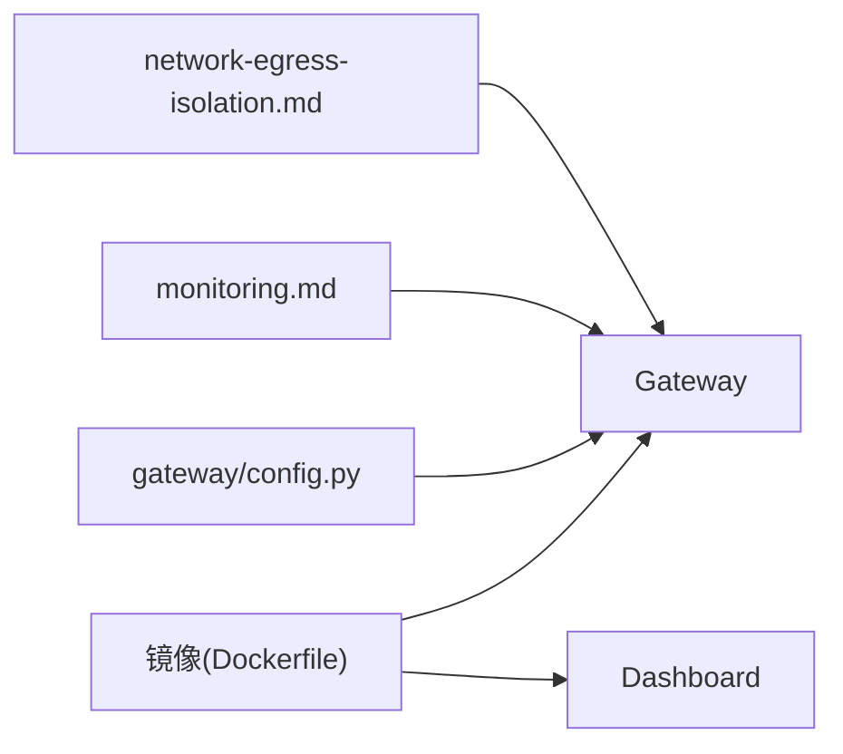

# Kubernetes部署

<cite>
**本文引用的文件**
- [Dockerfile](file://Dockerfile)
- [docker-compose.yml](file://docker-compose.yml)
- [gateway/config.py](file://gateway/config.py)
- [docs/observability/monitoring.md](file://docs/observability/monitoring.md)
- [docs/security/network-egress-isolation.md](file://docs/security/network-egress-isolation.md)
</cite>

## 目录
1. [简介](#简介)
2. [项目结构](#项目结构)
3. [核心组件](#核心组件)
4. [架构总览](#架构总览)
5. [详细组件分析](#详细组件分析)
6. [依赖关系分析](#依赖关系分析)
7. [性能考虑](#性能考虑)
8. [故障排查指南](#故障排查指南)
9. [结论](#结论)
10. [附录](#附录)

## 简介
本指南面向在Kubernetes上部署该项目的工程与运维团队，聚焦以下目标：
- Deployment资源配置：副本数管理、滚动更新策略、资源请求/限制
- Service暴露方式：ClusterIP、LoadBalancer、Ingress
- 配置与密钥：ConfigMap与Secret（应用配置、证书、敏感信息）
- 持久化存储：PersistentVolume与PersistentVolumeClaim
- Helm Chart模板：简化部署与版本管理
- 监控与日志：Prometheus指标导出、结构化日志收集与集中式日志管理
- 容器安全：Pod安全上下文、网络策略、资源配额
- 高可用生产方案：多副本、负载均衡、故障转移

本项目提供容器镜像构建定义与默认编排示例，可作为Kubernetes部署的基础。

**章节来源**
- [Dockerfile:54-422](file://Dockerfile#L54-L422)
- [docker-compose.yml:29-77](file://docker-compose.yml#L29-L77)

## 项目结构
- 容器镜像构建：根目录Dockerfile定义了运行时环境、依赖安装、s6-overlay进程监督、数据卷挂载点等
- 默认编排：docker-compose.yml提供了gateway与dashboard两个服务，使用host网络并挂载用户数据目录
- 网关配置：gateway/config.py负责加载和校验网关配置，支持环境变量覆盖与类型转换
- 可观测性：docs/observability/monitoring.md描述了OTLP指标、追踪、日志的导出能力与采集建议
- 网络安全：docs/security/network-egress-isolation.md给出出站隔离的网络拓扑与Compose示例

**图示来源**
- [Dockerfile:54-422](file://Dockerfile#L54-L422)
- [docker-compose.yml:29-77](file://docker-compose.yml#L29-L77)
- [gateway/config.py:1-200](file://gateway/config.py#L1-L200)
- [docs/observability/monitoring.md:1-120](file://docs/observability/monitoring.md#L1-L120)
- [docs/security/network-egress-isolation.md:23-96](file://docs/security/network-egress-isolation.md#L23-L96)

**章节来源**
- [Dockerfile:54-422](file://Dockerfile#L54-L422)
- [docker-compose.yml:29-77](file://docker-compose.yml#L29-L77)
- [gateway/config.py:1-200](file://gateway/config.py#L1-L200)
- [docs/observability/monitoring.md:1-120](file://docs/observability/monitoring.md#L1-L120)
- [docs/security/network-egress-isolation.md:23-96](file://docs/security/network-egress-isolation.md#L23-L96)

## 核心组件
- 镜像与运行时
  - 基于Debian，安装Python、Node、系统工具，启用s6-overlay进行进程监督
  - 固定SQLite库以修复已知问题；将只读代码置于/opt/sparkii，数据写入/opt/data
  - 通过VOLUME声明/opt/data为持久化数据目录
- 服务划分
  - gateway：核心网关进程，承载消息平台接入、会话处理、调度等
  - dashboard：Web管理界面，默认绑定本地回环地址
- 配置与密钥
  - 通过环境变量注入敏感信息与开关项；配置文件由gateway/config.py加载与校验
- 可观测性
  - 内置OTLP导出器，输出指标、追踪、日志到外部Collector或后端
- 网络安全
  - 默认compose使用host网络；文档提供出站隔离的网络拓扑与Compose覆盖方案

**章节来源**
- [Dockerfile:54-422](file://Dockerfile#L54-L422)
- [docker-compose.yml:29-77](file://docker-compose.yml#L29-L77)
- [gateway/config.py:1-200](file://gateway/config.py#L1-L200)
- [docs/observability/monitoring.md:1-120](file://docs/observability/monitoring.md#L1-L120)
- [docs/security/network-egress-isolation.md:23-96](file://docs/security/network-egress-isolation.md#L23-L96)

## 架构总览
下图展示Kubernetes中典型部署拓扑：Deployment运行Gateway与Dashboard Pod，Service暴露端口，Ingress统一入口，ConfigMap/Secret注入配置与密钥，PV/PVC保障数据持久化，监控通过Sidecar或DaemonSet采集指标与日志。

[此图为概念性架构图，不直接映射具体源码文件]

## 详细组件分析

### Deployment资源配置
- 副本数管理
  - 根据负载与可用性需求设置replicas；对无状态网关建议至少2个副本以实现高可用
- 滚动更新策略
  - 使用RollingUpdate，设置maxUnavailable与maxSurge以控制更新窗口与容量峰值
- 资源请求与限制
  - requests保证调度与QoS；limits防止资源争用与OOM；结合HPA实现弹性伸缩
- 健康检查
  - livenessProbe与readinessProbe指向网关健康端点，确保Pod就绪与健康
- 启动顺序与环境
  - 通过envFrom引用ConfigMap/Secret；挂载PVC到/opt/data；必要时挂载证书目录
- 安全上下文
  - runAsNonRoot、readOnlyRootFilesystem、allowPrivilegeEscalation=false；配合NetworkPolicy限制出站

[此流程图为通用指导，不直接映射具体源码文件]

### Service暴露方式
- ClusterIP
  - 内部服务发现，适合网关与Dashboard在集群内通信
- LoadBalancer
  - 对外暴露网关API或服务端口，适用于云厂商托管LB
- Ingress
  - 统一HTTP入口，支持TLS终止、路径路由、域名管理；将Dashboard与API按路径分离

[此序列图为概念性流程，不直接映射具体源码文件]

### ConfigMap与Secret管理
- ConfigMap
  - 存放非敏感配置（如监控导出端点、功能开关），通过envFrom或volume挂载
- Secret
  - 存放敏感信息（API密钥、证书、OAuth凭据），通过envFrom或volume挂载，建议使用加密存储与最小权限
- 证书管理
  - 将TLS证书放入Secret，挂载到Pod指定目录；Ingress或网关侧读取并使用
- 配置优先级
  - 环境变量 > ConfigMap/Secret > 默认值；gateway/config.py支持类型转换与布尔/数值规范化

**章节来源**
- [gateway/config.py:1-200](file://gateway/config.py#L1-L200)

### PersistentVolume与PersistentVolumeClaim
- 数据目录
  - 镜像声明/opt/data为VOLUME；Kubernetes中通过PVC绑定PV，确保跨Pod重启数据不丢失
- 存储类
  - 根据云厂商或本地存储选择StorageClass（如SSD、HDD、快照支持）
- 访问模式
  - ReadWriteOnce或ReadOnlyMany；如需多副本共享写，需评估数据库或对象存储替代方案
- 备份与恢复
  - 结合快照或备份工具定期备份PV数据

**章节来源**
- [Dockerfile:378-422](file://Dockerfile#L378-L422)

### Helm Chart模板
- 模板结构建议
  - values.yaml：副本数、资源限制、存储类、Ingress域名、监控端点、Secret引用
  - templates/deployment.yaml：基于values渲染Deployment、ConfigMap、Secret、VolumeMount
  - templates/service.yaml：ClusterIP/LoadBalancer
  - templates/ingress.yaml：Ingress规则与TLS
  - templates/pvc.yaml：PVC与StorageClass
- 版本管理
  - 使用Helm Chart版本与OCI仓库管理；CI/CD流水线自动构建与发布
- 环境差异
  - 通过values.staging/values.production区分不同环境参数

[本节为通用实践说明，不直接映射具体源码文件]

### 监控与日志
- 指标导出
  - 通过OTLP导出指标到Collector或后端；关键指标包括网关状态、平台健康、调度心跳、任务执行生命周期
- 日志收集
  - 结构化日志随标准输出；配合Sidecar或DaemonSet收集到集中式日志系统
- 告警与视图
  - 基于指标建立告警规则（如网关down、平台降级、调度超时）；提供Fleet视图与实例级诊断
- 配置要点
  - 设置export.otlp.endpoint与headers_env；在Collector侧配置接收器与导出器

**章节来源**
- [docs/observability/monitoring.md:1-120](file://docs/observability/monitoring.md#L1-L120)

### 容器安全最佳实践
- Pod安全上下文
  - runAsNonRoot=true；readOnlyRootFilesystem=true；禁用特权与能力提升
- 网络策略
  - 限制出站流量至必要域名/IP；参考出站隔离文档设计网络拓扑
- 资源配额
  - Namespace级别设置CPU/内存配额与Pod数量上限，防止资源滥用
- 镜像安全
  - 使用最小基础镜像、扫描漏洞、固定依赖版本；避免在生产镜像中包含源码

**章节来源**
- [docs/security/network-egress-isolation.md:23-96](file://docs/security/network-egress-isolation.md#L23-L96)

### 高可用生产方案
- 多副本部署
  - Gateway与Dashboard均设置≥2副本；结合PodDisruptionBudget保障维护期可用性
- 负载均衡
  - 使用LoadBalancer或Ingress分发流量；健康检查剔除不健康实例
- 故障转移
  - 滚动更新时保持最大不可用数为0或1；失败快速回滚；结合HPA自动扩缩容
- 数据持久化
  - 关键状态落盘于PVC；必要时引入外部数据库或对象存储
- 监控与自愈
  - 指标与日志接入后，配置告警与自动恢复策略（如重启、扩容）

[本节为通用实践说明，不直接映射具体源码文件]

## 依赖关系分析
- 镜像依赖
  - Debian基础镜像、Python/Node运行时、s6-overlay监督器、SQLite固定库
- 服务依赖
  - Dashboard依赖Gateway；可通过depends_on或InitContainer协调启动顺序
- 配置依赖
  - gateway/config.py解析配置与变量；环境变量优先于配置文件
- 可观测性依赖
  - OTLP导出器依赖外部Collector或后端；缺失时不影响主流程但指标不可用

**图示来源**
- [Dockerfile:54-422](file://Dockerfile#L54-L422)
- [gateway/config.py:1-200](file://gateway/config.py#L1-L200)
- [docs/observability/monitoring.md:1-120](file://docs/observability/monitoring.md#L1-L120)
- [docs/security/network-egress-isolation.md:23-96](file://docs/security/network-egress-isolation.md#L23-L96)

**章节来源**
- [Dockerfile:54-422](file://Dockerfile#L54-L422)
- [gateway/config.py:1-200](file://gateway/config.py#L1-L200)
- [docs/observability/monitoring.md:1-120](file://docs/observability/monitoring.md#L1-L120)
- [docs/security/network-egress-isolation.md:23-96](file://docs/security/network-egress-isolation.md#L23-L96)

## 性能考虑
- 资源规划
  - 合理设置requests/limits；结合HPA根据CPU/内存或自定义指标自动扩缩容
- 滚动更新
  - maxSurge提高并发度加速更新；maxUnavailable控制影响面
- I/O优化
  - 使用高性能StorageClass；减少频繁小文件写入；必要时引入缓存层
- 网络优化
  - 出站流量经代理或白名单；减少DNS查询与重试次数
- 监控调优
  - 调整指标采集频率；避免过度采样导致Collector压力

[本节为通用实践说明，不直接映射具体源码文件]

## 故障排查指南
- 启动失败
  - 检查环境变量与Secret是否正确挂载；查看Pod事件与日志
- 健康检查失败
  - 确认liveness/readiness探针端点可达；检查依赖服务与网络策略
- 配置未生效
  - 验证ConfigMap/Secret名称与键名；确认gateway/config.py的类型转换逻辑
- 监控无数据
  - 检查OTLP endpoint连通性与认证头；确认Collector接收器与导出器配置
- 出站被阻断
  - 核对NetworkPolicy与出站代理白名单；测试必要域名连通性

**章节来源**
- [docs/observability/monitoring.md:120-200](file://docs/observability/monitoring.md#L120-L200)
- [docs/security/network-egress-isolation.md:156-196](file://docs/security/network-egress-isolation.md#L156-L196)

## 结论
通过合理的Deployment、Service、Ingress、ConfigMap/Secret、PV/PVC与监控日志配置，可在Kubernetes上稳定部署该项目。结合安全上下文、网络策略与资源配额，满足生产环境的高可用与安全要求。Helm Chart进一步简化版本管理与多环境交付。

[本节为总结性内容，不直接映射具体源码文件]

## 附录
- 参考默认编排
  - docker-compose.yml展示了gateway与dashboard的基本配置与数据卷挂载，可作为Kubernetes配置的起点
- 镜像数据卷
  - Dockerfile声明/opt/data为VOLUME，Kubernetes中应通过PVC绑定持久化存储
- 配置加载
  - gateway/config.py提供类型转换与布尔/数值规范化，便于在Kubernetes中以环境变量或ConfigMap注入

**章节来源**
- [docker-compose.yml:29-77](file://docker-compose.yml#L29-L77)
- [Dockerfile:378-422](file://Dockerfile#L378-L422)
- [gateway/config.py:1-200](file://gateway/config.py#L1-L200)