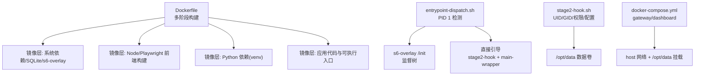
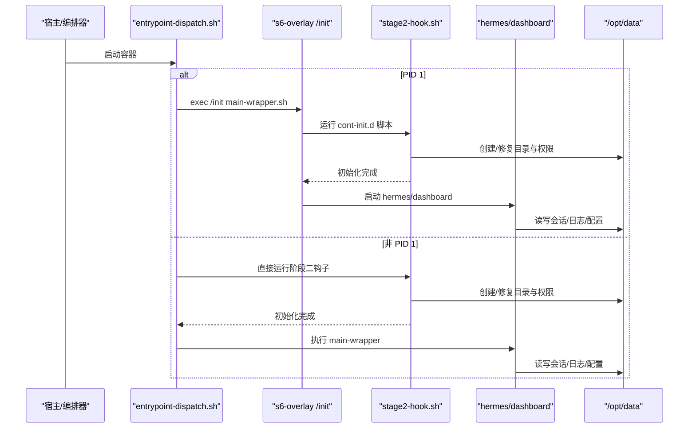
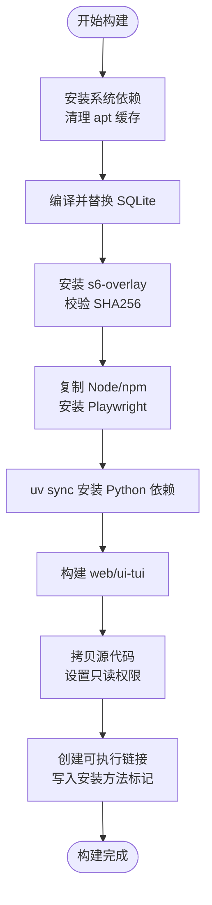
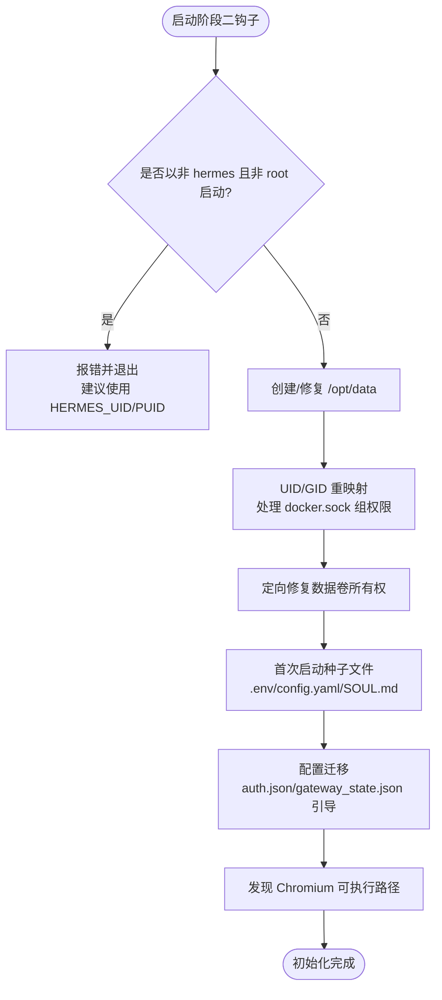
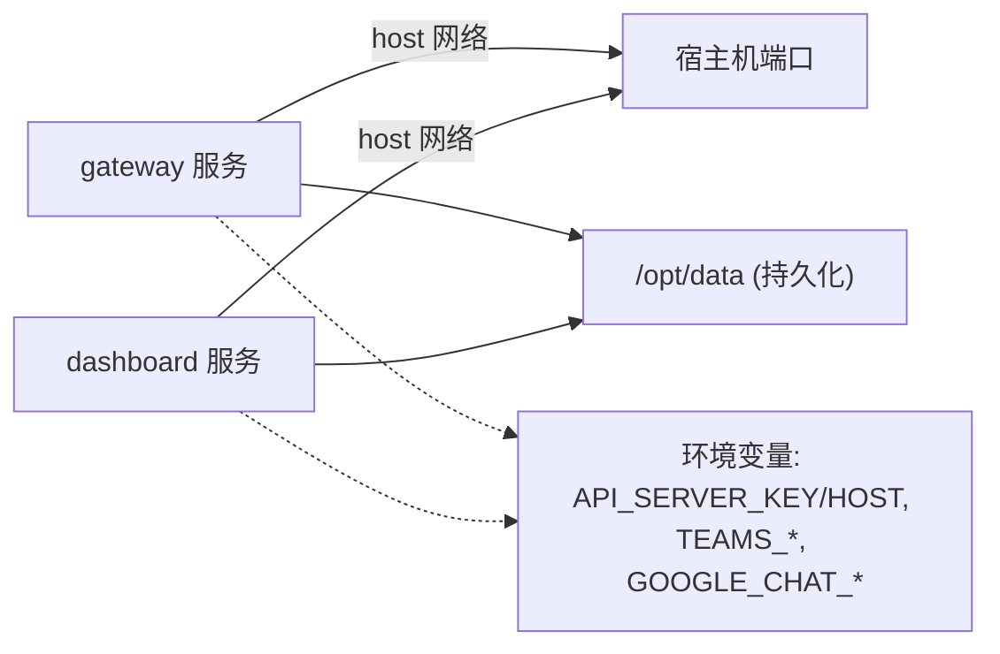
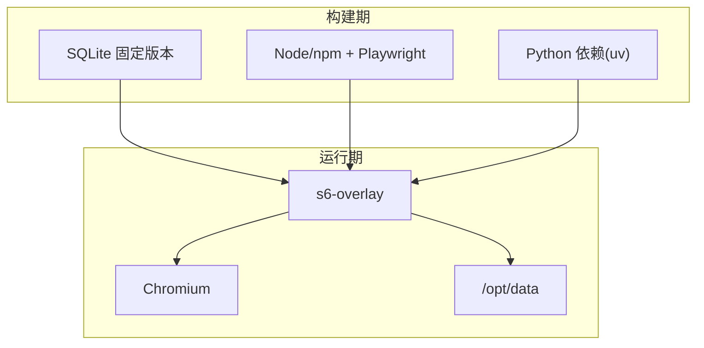

# 容器化部署

<cite>
**本文引用的文件**
- [Dockerfile](file://Dockerfile)
- [docker-compose.yml](file://docker-compose.yml)
- [.dockerignore](file://.dockerignore)
- [entrypoint-dispatch.sh](file://docker/entrypoint-dispatch.sh)
- [stage2-hook.sh](file://docker/stage2-hook.sh)
</cite>

## 目录
1. [简介](#简介)
2. [项目结构](#项目结构)
3. [核心组件](#核心组件)
4. [架构总览](#架构总览)
5. [详细组件分析](#详细组件分析)
6. [依赖关系分析](#依赖关系分析)
7. [性能考虑](#性能考虑)
8. [故障排查指南](#故障排查指南)
9. [结论](#结论)
10. [附录](#附录)

## 简介
本文件面向生产环境的容器化部署，围绕以下目标展开：
- 解释镜像构建过程与多阶段构建优化、镜像层缓存策略与安全加固措施。
- 说明 Docker Compose 编排配置（服务定义、网络、数据卷、环境变量）。
- 提供 Kubernetes 部署方案（Deployment、Service、ConfigMap、Secret）的落地模板与最佳实践。
- 给出容器监控与日志收集方案（Prometheus 指标导出、结构化日志、集中式日志管理）。
- 总结容器安全最佳实践（非 root 运行、最小化镜像、漏洞扫描、运行时安全）。
- 提供性能调优建议（内存限制、CPU 配额、资源隔离）与生产编排模板及故障恢复策略。

## 项目结构
仓库提供了完整的容器化能力：
- 镜像构建：基于 Debian 的多阶段构建，包含 SQLite 固定版本编译、Node/Python 依赖安装、前端构建、s6-overlay 进程监督等。
- 启动流程：通过 entrypoint-dispatch.sh 判断是否 PID 1，选择 s6-overlay 监督路径或直接引导；stage2-hook.sh 负责 UID/GID 重映射、数据卷权限修复、配置初始化、技能同步等。
- 编排：docker-compose.yml 定义了 gateway 与 dashboard 两个服务，共享 /opt/data 数据卷，默认使用 host 网络。
- 构建上下文裁剪：.dockerignore 排除测试、文档、桌面端源码等无关内容，减少构建体积并提升缓存命中率。

**图表来源**
- [Dockerfile:1-458](file://Dockerfile#L1-L458)
- [entrypoint-dispatch.sh:1-26](file://docker/entrypoint-dispatch.sh#L1-L26)
- [stage2-hook.sh:1-592](file://docker/stage2-hook.sh#L1-L592)
- [docker-compose.yml:1-77](file://docker-compose.yml#L1-L77)

**章节来源**
- [Dockerfile:1-458](file://Dockerfile#L1-L458)
- [docker-compose.yml:1-77](file://docker-compose.yml#L1-L77)
- [.dockerignore:1-106](file://.dockerignore#L1-L106)

## 核心组件
- 多阶段构建与依赖隔离
  - 使用独立阶段构建 SQLite 固定版本以修复已知漏洞，并在运行时替换系统库。
  - 从上游 node:26 镜像复制 Node/npm，确保工具链一致性与 glibc 兼容性。
  - 使用 uv 安装 Python 依赖，仅包含生产所需 extras，避免引入开发或平台特定依赖。
- 前端构建缓存
  - 先拷贝 package.json 与 lock 文件，再执行 npm install，最大化利用镜像层缓存。
  - 单独构建 web 与 ui-tui，避免 Python 变更导致前端重建。
- 进程监督与特权降级
  - 通过 s6-overlay 作为 PID 1，提供主进程、Dashboard 与 per-profile Gateway 的监督。
  - 启动时以 root 执行 stage2-hook，完成 UID/GID 重映射与数据卷权限修复后，再以 hermes 用户运行服务。
- 数据持久化与只读代码树
  - /opt/hermes 为只读安装树，/opt/data 为持久化数据卷，所有可写状态位于数据卷。
  - 通过环境变量控制 TUI 预构建产物路径、懒加载包目标目录等。

**章节来源**
- [Dockerfile:1-458](file://Dockerfile#L1-L458)
- [entrypoint-dispatch.sh:1-26](file://docker/entrypoint-dispatch.sh#L1-L26)
- [stage2-hook.sh:1-592](file://docker/stage2-hook.sh#L1-L592)

## 架构总览
下图展示了容器启动到服务运行的关键流程，包括 PID 1 分支、s6-overlay 监督、阶段二初始化与服务启动。

**图表来源**
- [entrypoint-dispatch.sh:1-26](file://docker/entrypoint-dispatch.sh#L1-L26)
- [stage2-hook.sh:1-592](file://docker/stage2-hook.sh#L1-L592)

## 详细组件分析

### 镜像构建与多阶段优化
- 阶段划分
  - sqlite_build：编译固定版本的 SQLite 并输出共享库，用于运行时替换系统库，修复 WAL-reset 相关缺陷。
  - uv_source/node_source：准备 uv、Node/npm 二进制，保证工具链一致性与可移植性。
  - 基础镜像阶段：安装系统依赖、s6-overlay、Python/Node 运行时，设置环境变量与只读权限。
- 缓存策略
  - 先拷贝 manifest（package.json、uv.lock），再安装依赖，使依赖层在源码变更时仍可命中缓存。
  - 前端构建与 Python 依赖安装分离，进一步降低冷构建时间。
- 安全加固
  - 替换系统 libsqlite3，避免已知漏洞。
  - 将 /opt/hermes 设为只读，可写状态全部置于 /opt/data，防止运行时篡改代码与依赖。
  - 非 root 用户 hermes 运行服务，并通过 s6-setuidgid 进行特权降级。
  - 严格限制 .env 与敏感文件的权限（如 600）。

**图表来源**
- [Dockerfile:1-458](file://Dockerfile#L1-L458)

**章节来源**
- [Dockerfile:1-458](file://Dockerfile#L1-L458)

### 启动流程与进程监督
- PID 1 检测与分支
  - 若容器由 Docker/Podman 直接管理（PID 1），则进入 s6-overlay 监督路径，确保僵尸进程回收与优雅关闭。
  - 若被外部 init 包裹（如某些调度器），则跳过 /init，直接执行阶段二钩子与主程序包装器。
- 阶段二钩子职责
  - 拒绝不支持的 --user 方式启动，强制通过 HERMES_UID/HERMES_GID 或 PUID/PGID 别名进行用户映射。
  - 创建并修复 /opt/data 下各子目录与文件的所有权，确保 hermes 用户可读写。
  - 首次启动时注入 .env、config.yaml、SOUL.md 等种子文件，并对敏感文件收紧权限。
  - 自动发现 Chromium 可执行路径，供浏览器工具使用。
  - 支持通过环境变量对 auth.json 与 gateway_state.json 进行一次性引导。

**图表来源**
- [stage2-hook.sh:1-592](file://docker/stage2-hook.sh#L1-L592)

**章节来源**
- [entrypoint-dispatch.sh:1-26](file://docker/entrypoint-dispatch.sh#L1-L26)
- [stage2-hook.sh:1-592](file://docker/stage2-hook.sh#L1-L592)

### Docker Compose 编排
- 服务定义
  - gateway：构建镜像 hermes-agent，使用 host 网络，挂载 ~/.hermes 到 /opt/data，命令为 gateway run。
  - dashboard：复用同一镜像，监听 127.0.0.1，不自动打开浏览器，依赖 gateway。
- 网络与数据卷
  - 使用 host 网络简化端口暴露；如需隔离，可在 K8s 中通过 Service 暴露。
  - 数据卷 /opt/data 持久化会话、配置、日志等。
- 环境变量
  - HERMES_UID/HERMES_GID 用于匹配宿主机用户权限。
  - 可选启用 API_SERVER、Teams、Google Chat 等网关，需配合密钥与环境变量。

**图表来源**
- [docker-compose.yml:1-77](file://docker-compose.yml#L1-L77)

**章节来源**
- [docker-compose.yml:1-77](file://docker-compose.yml#L1-L77)

### Kubernetes 部署方案（模板与实践）
- Deployment
  - 使用 hermes-agent 镜像，设置副本数、滚动更新策略。
  - 通过 resources.requests/limits 限制 CPU/内存，保障资源隔离。
  - 使用 liveness/readiness 探针检查健康状态（例如 HTTP 健康端点或自定义命令）。
- Service
  - 对外暴露 Dashboard 或 Gateway API（根据安全策略），推荐使用 ClusterIP + Ingress 或 LoadBalancer。
- ConfigMap
  - 将 config.yaml、.env 等非敏感配置放入 ConfigMap，以 Volume 或环境变量形式注入。
- Secret
  - 将 API 密钥、认证凭据放入 Secret，通过环境变量或挂载文件方式注入，避免明文存储。
- 数据持久化
  - 使用 PersistentVolumeClaim 挂载 /opt/data，确保会话与配置跨 Pod 重启保留。
- 安全与合规
  - 指定 runAsNonRoot、readOnlyRootFilesystem（除 /opt/data 外）、seccomp 与 AppArmor 策略。
  - 结合镜像扫描与运行时安全策略（如 Falco/KubeArmor）进行防护。

[本节为概念性指导，未直接分析具体文件]

### 监控与日志收集
- 指标导出
  - 启用 OTLP 相关 extra（已在镜像构建中包含），以便向 Prometheus/OpenTelemetry Collector 导出指标。
  - 在 K8s 中部署 OpenTelemetry Collector 或 Prometheus Operator，采集容器指标与业务指标。
- 结构化日志
  - 通过 s6-overlay 统一收集 stdout/stderr 日志，结合容器运行时日志驱动（如 journald、Fluent Bit）转发至集中式日志系统（ELK/Loki）。
  - 建议在应用层输出 JSON 结构化日志，便于检索与分析。
- 告警与可视化
  - 使用 Grafana 展示指标面板，结合 Alertmanager 设置阈值告警。
  - 对关键指标（错误率、延迟、资源使用）建立看板与告警规则。

[本节为概念性指导，未直接分析具体文件]

### 容器安全最佳实践
- 非 root 运行
  - 默认以 hermes 用户运行服务，通过 s6-setuidgid 进行特权降级。
  - 禁止使用 --user 绑定任意 UID，改用 HERMES_UID/HERMES_GID 或 PUID/PGID。
- 最小化镜像
  - 多阶段构建、仅安装必要依赖、清理缓存与临时文件。
  - 使用 .dockerignore 排除无关文件，减少构建上下文与镜像体积。
- 漏洞扫描
  - 在 CI/CD 中集成 Trivy/Grype 等扫描工具，阻断高危漏洞镜像发布。
- 运行时安全
  - 启用 seccomp/AppArmor，限制系统调用。
  - 只读根文件系统（除 /opt/data），防止运行时篡改。
  - 定期轮换密钥与令牌，避免硬编码。

**章节来源**
- [Dockerfile:1-458](file://Dockerfile#L1-L458)
- [stage2-hook.sh:1-592](file://docker/stage2-hook.sh#L1-L592)
- [.dockerignore:1-106](file://.dockerignore#L1-L106)

### 性能调优建议
- 资源限制
  - 在 K8s 中设置 requests/limits，避免资源争用与 OOM。
  - 合理设置内存上限与 CPU 配额，结合水平扩展应对流量峰值。
- 缓存与构建优化
  - 利用镜像层缓存，优先拷贝 manifest 与 lock 文件。
  - 分离前端构建与 Python 依赖安装，减少冷构建时间。
- 运行时优化
  - 禁用 Python 字节码写入，避免对只读文件系统的写入尝试。
  - 使用预构建的 TUI 产物，避免运行时 npm install 竞争与失败。
  - 合理配置 Playwright 浏览器路径，避免重复下载与解析。

**章节来源**
- [Dockerfile:1-458](file://Dockerfile#L1-L458)

## 依赖关系分析
- 构建期依赖
  - SQLite：编译固定版本并替换系统库，修复已知问题。
  - Node/npm：用于前端构建与 Playwright 安装。
  - Python/uv：安装生产依赖，包含 OTLP、Provider 等 extras。
- 运行期依赖
  - s6-overlay：进程监督与生命周期管理。
  - Chromium：浏览器工具依赖，自动发现可执行路径。
  - /opt/data：持久化数据卷，存放会话、配置、日志等。

**图表来源**
- [Dockerfile:1-458](file://Dockerfile#L1-L458)
- [stage2-hook.sh:1-592](file://docker/stage2-hook.sh#L1-L592)

**章节来源**
- [Dockerfile:1-458](file://Dockerfile#L1-L458)
- [stage2-hook.sh:1-592](file://docker/stage2-hook.sh#L1-L592)

## 性能考虑
- 构建性能
  - 使用多阶段构建与分层缓存，优先命中依赖层。
  - 通过 .dockerignore 减少上下文大小，加速传输与构建。
- 运行性能
  - 限制资源使用，避免过度分配导致抖动。
  - 启用只读根文件系统与懒加载包目标目录，减少 I/O 压力。
  - 合理配置日志级别与轮转策略，避免磁盘占用过高。

[本节为通用指导，未直接分析具体文件]

## 故障排查指南
- 启动失败与权限问题
  - 若以非 root 且非 hermes 用户启动，会收到明确错误提示；应改为通过 HERMES_UID/HERMES_GID 或 PUID/PGID 进行映射。
  - 检查 /opt/data 所有权是否正确，必要时让 stage2-hook 重新修复。
- 浏览器工具不可用
  - 确认 Playwright 已安装且 Chromium 可执行路径被正确发现；可通过环境变量覆盖。
- 配置与密钥
  - 确保 .env 与 config.yaml 权限正确（如 600/640），避免运行时读取失败。
  - 首次启动时可通过环境变量引导 auth.json 与 gateway_state.json。
- 日志定位
  - 查看 s6-overlay 服务日志与 stdout/stderr，结合集中式日志系统进行检索。
  - 关注 gateway 与 dashboard 的健康状态与错误信息。

**章节来源**
- [stage2-hook.sh:1-592](file://docker/stage2-hook.sh#L1-L592)
- [docker-compose.yml:1-77](file://docker-compose.yml#L1-L77)

## 结论
该仓库提供了成熟的容器化方案：通过多阶段构建与 s6-overlay 监督，实现安全、稳定、可维护的生产级镜像；借助 Compose 与 K8s 模板，可快速落地本地与云端部署；结合监控与日志体系，形成完整的可观测性闭环。遵循本文的安全与性能建议，可在生产环境中获得高可用与高安全的容器化体验。

[本节为总结性内容，未直接分析具体文件]

## 附录
- 常用命令参考
  - 本地构建与运行：参考 docker-compose.yml 注释中的用法。
  - K8s 部署：按“Kubernetes 部署方案”章节创建 Deployment、Service、ConfigMap、Secret 与 PVC。
- 环境变量清单
  - HERMES_UID/HERMES_GID：用户映射。
  - API_SERVER_HOST/API_SERVER_KEY：API 服务器暴露与鉴权。
  - TEAMS_*、GOOGLE_CHAT_*：第三方网关配置。
  - AGENT_BROWSER_EXECUTABLE_PATH：覆盖 Chromium 路径。
  - HERMES_LAZY_INSTALL_TARGET：懒加载包目标目录。

[本节为补充信息，未直接分析具体文件]