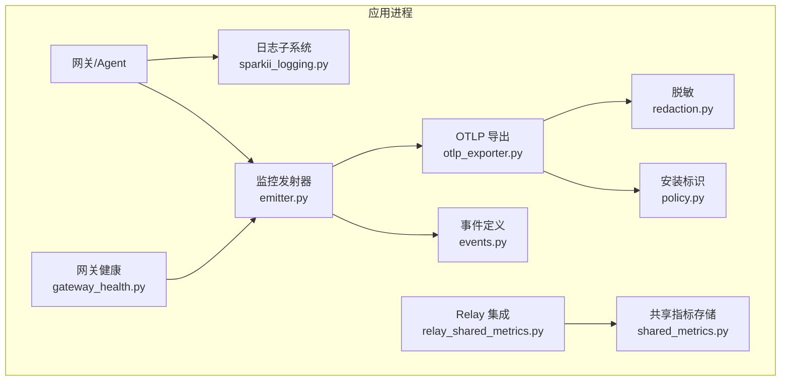
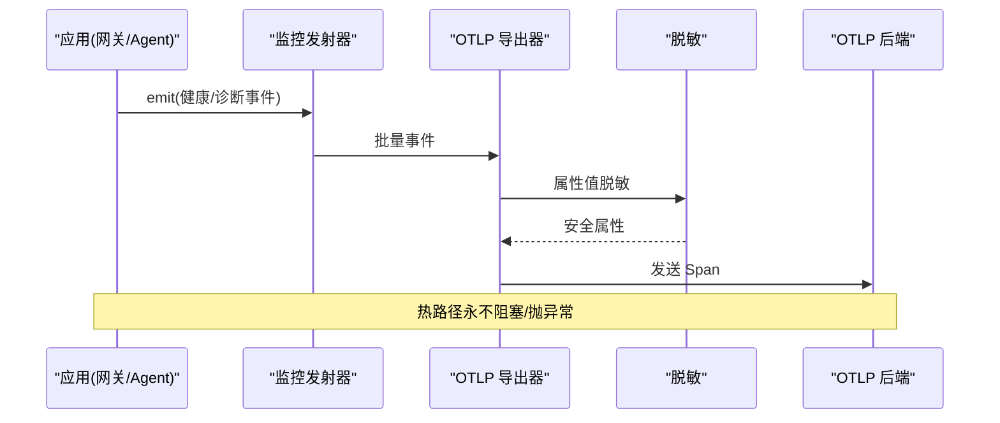
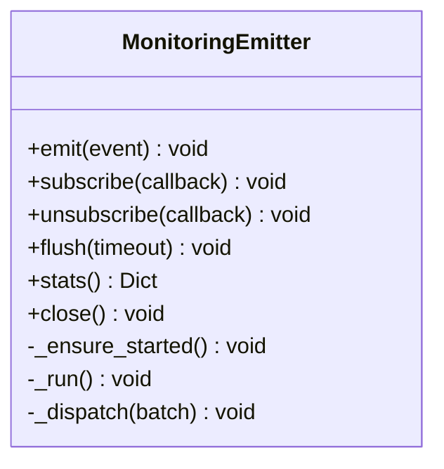
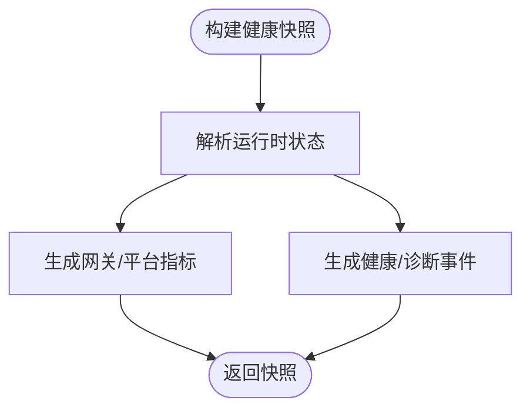
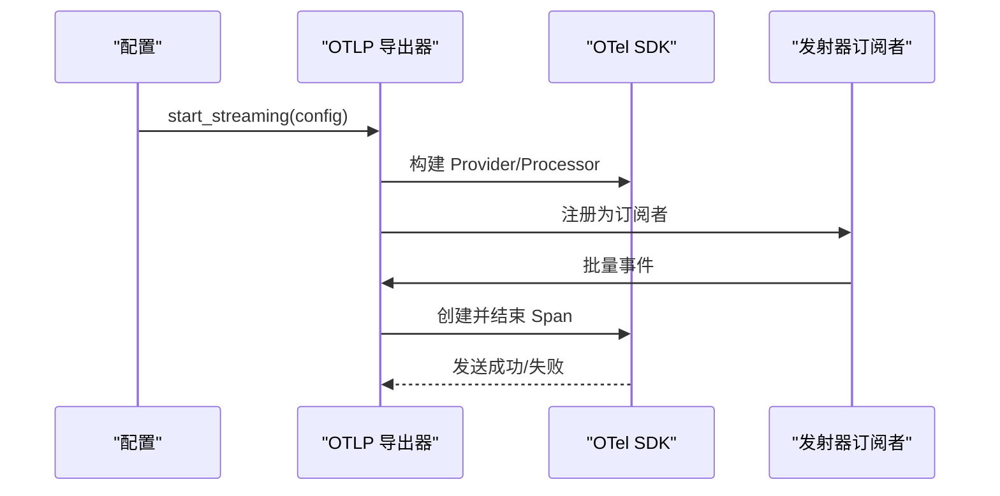
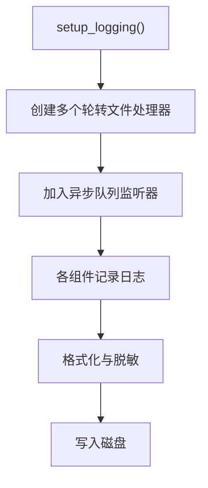
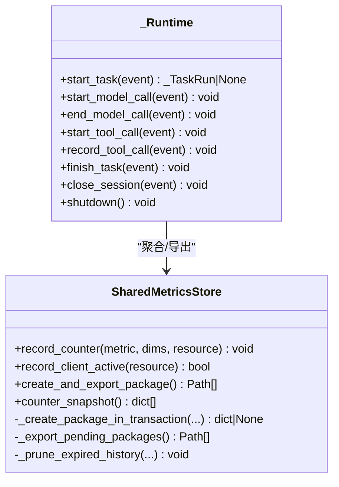
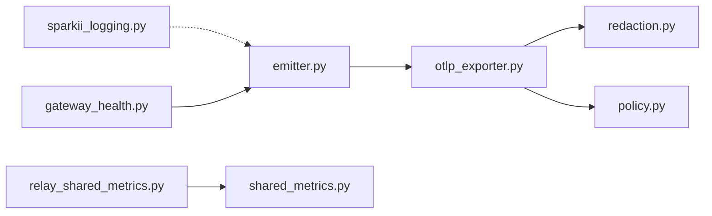

# 容器监控与日志

<cite>
**本文引用的文件**
- [sparkii_logging.py](file://sparkii_logging.py)
- [agent/monitoring/__init__.py](file://agent/monitoring/__init__.py)
- [agent/monitoring/emitter.py](file://agent/monitoring/emitter.py)
- [agent/monitoring/events.py](file://agent/monitoring/events.py)
- [agent/monitoring/gateway_health.py](file://agent/monitoring/gateway_health.py)
- [agent/monitoring/otlp_exporter.py](file://agent/monitoring/otlp_exporter.py)
- [agent/monitoring/redaction.py](file://agent/monitoring/redaction.py)
- [agent/monitoring/policy.py](file://agent/monitoring/policy.py)
- [sparkii_cli/observability/shared_metrics.py](file://sparkii_cli/observability/shared_metrics.py)
- [sparkii_cli/observability/relay_shared_metrics.py](file://sparkii_cli/observability/relay_shared_metrics.py)
</cite>

## 目录
1. [简介](#简介)
2. [项目结构](#项目结构)
3. [核心组件](#核心组件)
4. [架构总览](#架构总览)
5. [详细组件分析](#详细组件分析)
6. [依赖关系分析](#依赖关系分析)
7. [性能考量](#性能考量)
8. [故障排查指南](#故障排查指南)
9. [结论](#结论)
10. [附录](#附录)

## 简介
本文件面向容器化部署的 Sparkii/Sparkii Agent，系统化说明监控与日志方案：
- Prometheus 指标采集：通过 OTLP 将网关健康、平台状态等指标以 OpenTelemetry Span 形式导出到可被 Prometheus/OpenTelemetry Collector 采集的后端。
- 结构化日志：统一日志格式、级别、字段规范与输出路径；支持按组件分流、会话上下文注入与敏感信息脱敏。
- 集中式日志收集：基于 OTLP 的链路/指标/事件流，便于接入 ELK/Loki/云厂商日志服务。
- 容器资源监控：提供 CPU/内存/磁盘 I/O/网络等通用建议与集成方式（结合宿主或编排层）。
- 性能分析与追踪：通过 OTLP 导出 Span，配合 APM/分布式追踪工具进行瓶颈定位。
- 告警规则：基于网关健康、平台降级、错误分类等信号设计阈值与异常检测。
- 日志轮转与保留：RotatingFileHandler + 异步队列 + 外部旋转兼容策略。
- 仪表板模板：基于指标命名约定与标签维度，快速构建可视化面板。

## 项目结构
监控与日志相关代码主要分布在以下模块：
- agent/monitoring：网关健康与诊断事件的生产、发射与 OTLP 导出。
- sparkii_logging：统一的日志初始化、格式化、轮转与会话上下文。
- sparkii_cli/observability：共享指标聚合与本地持久化、与 Relay 运行时集成的埋点。

图表来源
- [sparkii_logging.py:259-376](file://sparkii_logging.py#L259-L376)
- [agent/monitoring/emitter.py:36-117](file://agent/monitoring/emitter.py#L36-L117)
- [agent/monitoring/events.py:19-80](file://agent/monitoring/events.py#L19-L80)
- [agent/monitoring/gateway_health.py:210-291](file://agent/monitoring/gateway_health.py#L210-L291)
- [agent/monitoring/otlp_exporter.py:107-178](file://agent/monitoring/otlp_exporter.py#L107-L178)
- [agent/monitoring/redaction.py:43-66](file://agent/monitoring/redaction.py#L43-L66)
- [agent/monitoring/policy.py:18-52](file://agent/monitoring/policy.py#L18-L52)
- [sparkii_cli/observability/shared_metrics.py:47-135](file://sparkii_cli/observability/shared_metrics.py#L47-L135)
- [sparkii_cli/observability/relay_shared_metrics.py:121-146](file://sparkii_cli/observability/relay_shared_metrics.py#L121-L146)

章节来源
- [sparkii_logging.py:259-376](file://sparkii_logging.py#L259-L376)
- [agent/monitoring/emitter.py:36-117](file://agent/monitoring/emitter.py#L36-L117)
- [agent/monitoring/gateway_health.py:210-291](file://agent/monitoring/gateway_health.py#L210-L291)
- [agent/monitoring/otlp_exporter.py:107-178](file://agent/monitoring/otlp_exporter.py#L107-L178)
- [sparkii_cli/observability/shared_metrics.py:47-135](file://sparkii_cli/observability/shared_metrics.py#L47-L135)
- [sparkii_cli/observability/relay_shared_metrics.py:121-146](file://sparkii_cli/observability/relay_shared_metrics.py#L121-L146)

## 核心组件
- 监控发射器（MonitoringEmitter）：无阻塞的事件总线，保证热路径不阻塞、不抛异常，批量分发到订阅者（如 OTLP 导出器）。
- 事件模型：GatewayHealthEvent、GatewayDiagnosticEvent、CronExecutionEvent，均为内容无关的结构化事件。
- 网关健康快照：从运行时状态构建指标与事件，包含网关/平台上下线、繁忙度、可排空性等。
- OTLP 导出器：将事件映射为 OpenTelemetry Span，发送到配置的 OTLP 端点；可选依赖，懒加载。
- 日志子系统：统一入口 setup_logging()，多文件输出（agent.log、errors.log、gateway.log、gui.log），带轮转、脱敏、会话上下文注入与异步队列。
- 共享指标：SQLite 持久化计数器，按日打包导出，支持客户端活跃记录与模型调用计数。
- Relay 集成：在任务/会话/工具调用生命周期中埋点，生成隐私安全的度量。

章节来源
- [agent/monitoring/emitter.py:36-117](file://agent/monitoring/emitter.py#L36-L117)
- [agent/monitoring/events.py:19-80](file://agent/monitoring/events.py#L19-L80)
- [agent/monitoring/gateway_health.py:210-291](file://agent/monitoring/gateway_health.py#L210-L291)
- [agent/monitoring/otlp_exporter.py:107-178](file://agent/monitoring/otlp_exporter.py#L107-L178)
- [sparkii_logging.py:259-376](file://sparkii_logging.py#L259-L376)
- [sparkii_cli/observability/shared_metrics.py:47-135](file://sparkii_cli/observability/shared_metrics.py#L47-L135)
- [sparkii_cli/observability/relay_shared_metrics.py:121-146](file://sparkii_cli/observability/relay_shared_metrics.py#L121-L146)

## 架构总览
监控数据流：
- 生产端：网关状态变更、平台状态变化、诊断日志桥接、Cron 执行事件等产生结构化事件。
- 发射器：接收事件并批量分发给订阅者（OTLP 导出器）。
- 导出器：将事件映射为 OTel Span，附带脱敏后的属性，发送至 OTLP 端点。
- 日志流：所有日志经统一格式化与脱敏，写入本地轮转文件；同时可将关键告警/诊断事件通过 OTLP 上报。

图表来源
- [agent/monitoring/emitter.py:53-117](file://agent/monitoring/emitter.py#L53-L117)
- [agent/monitoring/otlp_exporter.py:137-178](file://agent/monitoring/otlp_exporter.py#L137-L178)
- [agent/monitoring/redaction.py:43-66](file://agent/monitoring/redaction.py#L43-L66)

## 详细组件分析

### 监控发射器与事件总线
- 设计要点：
  - 非阻塞入队：put_nowait，满队列时丢弃最旧事件，保证热路径稳定。
  - 后台调度线程：批量消费并扇出到订阅者，失败隔离。
  - 进程级单例：按需启用，无订阅者时不发事件。
- 复杂度：
  - 入队 O(1)，批量分发 O(n)。
- 优化点：
  - 合理设置队列深度与批次大小，平衡吞吐与延迟。
  - 订阅者实现幂等与超时保护。

图表来源
- [agent/monitoring/emitter.py:36-117](file://agent/monitoring/emitter.py#L36-L117)

章节来源
- [agent/monitoring/emitter.py:36-117](file://agent/monitoring/emitter.py#L36-L117)

### 事件模型与网关健康
- 事件类型：
  - GatewayHealthEvent：网关健康快照与生命周期事件。
  - GatewayDiagnosticEvent：去标识化的诊断事件，含错误分类、严重级别。
  - CronExecutionEvent：定时任务执行结果。
- 健康快照：
  - 指标：sparkii.gateway.up、sparkii.platform.up/degraded、active_agents、busy、drainable 等。
  - 事件：gateway.lifecycle、platform.state_change、platform.fatal 等。
- 错误分类：
  - 自动识别认证失败、限流、超时、网络错误、配置无效、启动失败、平台致命等。

图表来源
- [agent/monitoring/gateway_health.py:210-291](file://agent/monitoring/gateway_health.py#L210-L291)
- [agent/monitoring/gateway_health.py:70-124](file://agent/monitoring/gateway_health.py#L70-L124)

章节来源
- [agent/monitoring/events.py:19-80](file://agent/monitoring/events.py#L19-L80)
- [agent/monitoring/gateway_health.py:210-291](file://agent/monitoring/gateway_health.py#L210-L291)
- [agent/monitoring/gateway_health.py:70-124](file://agent/monitoring/gateway_health.py#L70-L124)

### OTLP 导出器与配置
- 功能：
  - 懒加载 OpenTelemetry SDK，未安装时抛出明确提示。
  - 从配置读取 endpoint 与 headers_env，动态解析请求头。
  - 将事件映射为 Span，附加脱敏后的属性。
- 配置项：
  - monitoring.export.otlp.enabled、endpoint、headers_env。
- 可用性检查：
  - is_available() 纯检查；is_enabled(config) 判断是否启用。

图表来源
- [agent/monitoring/otlp_exporter.py:107-178](file://agent/monitoring/otlp_exporter.py#L107-L178)
- [agent/monitoring/otlp_exporter.py:218-259](file://agent/monitoring/otlp_exporter.py#L218-L259)

章节来源
- [agent/monitoring/otlp_exporter.py:107-178](file://agent/monitoring/otlp_exporter.py#L107-L178)
- [agent/monitoring/otlp_exporter.py:218-259](file://agent/monitoring/otlp_exporter.py#L218-L259)

### 日志子系统与结构化格式
- 统一入口：setup_logging()，支持模式区分（cli/gateway/gui/cron）。
- 输出文件：
  - agent.log：主活动日志（INFO+）。
  - errors.log：快速排障（WARNING+）。
  - gateway.log：仅网关组件（INFO+）。
  - gui.log：GUI/TUI-Gateway（INFO+）。
- 格式与字段：
  - 时间戳、级别、会话标签、logger 名称、消息。
  - 会话上下文注入：set_session_context()/clear_session_context()。
- 轮转与并发：
  - RotatingFileHandler（Windows 使用并发锁版本）。
  - 异步队列避免事件循环阻塞。
  - 外部旋转兼容：检测 inode 变化后重开文件。
- 脱敏：
  - RedactingFormatter 确保敏感信息不落盘。

图表来源
- [sparkii_logging.py:259-376](file://sparkii_logging.py#L259-L376)
- [sparkii_logging.py:415-548](file://sparkii_logging.py#L415-L548)
- [sparkii_logging.py:550-700](file://sparkii_logging.py#L550-L700)

章节来源
- [sparkii_logging.py:259-376](file://sparkii_logging.py#L259-L376)
- [sparkii_logging.py:415-548](file://sparkii_logging.py#L415-L548)
- [sparkii_logging.py:550-700](file://sparkii_logging.py#L550-L700)

### 共享指标与 Relay 集成
- SharedMetricsStore：
  - SQLite 持久化计数器，按 UTC 日聚合。
  - 周期性打包导出，保留窗口清理历史。
  - 客户端活跃记录（24小时窗口去重）。
- Relay 集成：
  - 在任务/会话/工具调用生命周期埋点。
  - 隐私安全：不导出敏感文本，仅统计必要维度。
  - 关闭会话时刷新并导出。

图表来源
- [sparkii_cli/observability/shared_metrics.py:47-135](file://sparkii_cli/observability/shared_metrics.py#L47-L135)
- [sparkii_cli/observability/shared_metrics.py:489-619](file://sparkii_cli/observability/shared_metrics.py#L489-L619)
- [sparkii_cli/observability/relay_shared_metrics.py:121-146](file://sparkii_cli/observability/relay_shared_metrics.py#L121-L146)
- [sparkii_cli/observability/relay_shared_metrics.py:285-359](file://sparkii_cli/observability/relay_shared_metrics.py#L285-L359)
- [sparkii_cli/observability/relay_shared_metrics.py:588-670](file://sparkii_cli/observability/relay_shared_metrics.py#L588-L670)

章节来源
- [sparkii_cli/observability/shared_metrics.py:47-135](file://sparkii_cli/observability/shared_metrics.py#L47-L135)
- [sparkii_cli/observability/shared_metrics.py:489-619](file://sparkii_cli/observability/shared_metrics.py#L489-L619)
- [sparkii_cli/observability/relay_shared_metrics.py:121-146](file://sparkii_cli/observability/relay_shared_metrics.py#L121-L146)
- [sparkii_cli/observability/relay_shared_metrics.py:285-359](file://sparkii_cli/observability/relay_shared_metrics.py#L285-L359)
- [sparkii_cli/observability/relay_shared_metrics.py:588-670](file://sparkii_cli/observability/relay_shared_metrics.py#L588-L670)

## 依赖关系分析
- 松耦合：
  - 发射器与导出器通过订阅者接口解耦，失败隔离。
  - 日志子系统与业务逻辑通过标准 logging 接口交互。
- 外部依赖：
  - OTLP 导出为可选依赖，懒加载并在缺失时给出明确提示。
  - Windows 下使用并发日志处理器以避免文件锁冲突。
- 潜在循环：
  - 通过延迟导入避免循环依赖（如 gateway_health_export 反向引用）。

图表来源
- [agent/monitoring/emitter.py:36-117](file://agent/monitoring/emitter.py#L36-L117)
- [agent/monitoring/otlp_exporter.py:107-178](file://agent/monitoring/otlp_exporter.py#L107-L178)
- [agent/monitoring/redaction.py:43-66](file://agent/monitoring/redaction.py#L43-L66)
- [agent/monitoring/policy.py:18-52](file://agent/monitoring/policy.py#L18-L52)
- [sparkii_logging.py:259-376](file://sparkii_logging.py#L259-L376)
- [agent/monitoring/gateway_health.py:210-291](file://agent/monitoring/gateway_health.py#L210-L291)
- [sparkii_cli/observability/relay_shared_metrics.py:121-146](file://sparkii_cli/observability/relay_shared_metrics.py#L121-L146)
- [sparkii_cli/observability/shared_metrics.py:47-135](file://sparkii_cli/observability/shared_metrics.py#L47-L135)

章节来源
- [agent/monitoring/emitter.py:36-117](file://agent/monitoring/emitter.py#L36-L117)
- [agent/monitoring/otlp_exporter.py:107-178](file://agent/monitoring/otlp_exporter.py#L107-L178)
- [sparkii_logging.py:259-376](file://sparkii_logging.py#L259-L376)
- [agent/monitoring/gateway_health.py:210-291](file://agent/monitoring/gateway_health.py#L210-L291)
- [sparkii_cli/observability/relay_shared_metrics.py:121-146](file://sparkii_cli/observability/relay_shared_metrics.py#L121-L146)
- [sparkii_cli/observability/shared_metrics.py:47-135](file://sparkii_cli/observability/shared_metrics.py#L47-L135)

## 性能考量
- 监控发射器：
  - 队列深度与批次大小影响吞吐与延迟；建议根据 QPS 调整。
  - 订阅者实现应短小、幂等、带超时与重试上限。
- 日志系统：
  - 异步队列避免事件循环阻塞；Windows 并发锁超时已静默处理。
  - 外部旋转兼容减少日志丢失风险。
- OTLP 导出：
  - 可选依赖懒加载，避免冷启动开销。
  - 批量发送 Span，降低网络开销。
- 共享指标：
  - SQLite 事务聚合，按日打包，减少频繁 IO。
  - 历史清理控制存储空间增长。

[本节为通用指导，无需特定文件来源]

## 故障排查指南
- OTLP 不可用：
  - 现象：启动时警告缺少 OTel SDK。
  - 处理：安装可选依赖或确认配置 endpoint。
- 日志写入失败：
  - 现象：Windows 下权限错误或锁超时。
  - 处理：确认文件权限、使用并发日志处理器、避免手动删除正在使用的日志文件。
- 监控事件丢失：
  - 现象：队列满导致丢弃最旧事件。
  - 处理：增大队列深度或提升下游处理能力。
- 共享指标导出失败：
  - 现象：outbox 文件未标记 exported_at。
  - 处理：检查磁盘空间与权限，重试导出流程。

章节来源
- [agent/monitoring/otlp_exporter.py:218-259](file://agent/monitoring/otlp_exporter.py#L218-L259)
- [sparkii_logging.py:415-548](file://sparkii_logging.py#L415-L548)
- [agent/monitoring/emitter.py:53-117](file://agent/monitoring/emitter.py#L53-L117)
- [sparkii_cli/observability/shared_metrics.py:623-719](file://sparkii_cli/observability/shared_metrics.py#L623-L719)

## 结论
本方案通过“事件驱动 + 异步发射 + OTLP 导出”的监控体系，结合统一日志与共享指标聚合，实现了：
- 高可用：热路径不阻塞、失败隔离、可选依赖。
- 可观测性：网关/平台健康、错误分类、任务/工具调用生命周期。
- 安全性：强制脱敏、最小化导出字段。
- 可维护性：结构化日志、轮转与保留策略、清晰的指标命名与标签。

[本节为总结，无需特定文件来源]

## 附录

### Prometheus 指标采集配置
- 指标命名与标签：
  - 网关：sparkii.gateway.up、sparkii.gateway.active_agents、sparkii.gateway.busy、sparkii.gateway.drainable、sparkii.gateway.state。
  - 平台：sparkii.platform.up、sparkii.platform.degraded，标签包含 platform、state、error_code。
  - 实例标识：service.instance.id、service.version、sparkii.supervision_mode。
- 采集方式：
  - 通过 OTLP 将事件转为 Span，由 OpenTelemetry Collector 转发至 Prometheus（如使用 prometheus-remote-write 或中间转换）。
- 健康检查端点：
  - 可通过网关状态文件与运行态指标评估服务健康；结合 exporter 暴露的指标进行探针。

章节来源
- [agent/monitoring/gateway_health.py:210-291](file://agent/monitoring/gateway_health.py#L210-L291)
- [agent/monitoring/otlp_exporter.py:137-178](file://agent/monitoring/otlp_exporter.py#L137-L178)

### 结构化日志格式设计
- 字段规范：
  - 时间戳、级别、会话标签、logger 名称、消息。
  - 组件分流：gateway.log、gui.log 仅接收对应前缀的日志。
- 输出格式：
  - 默认格式与详细格式两种；控制台输出支持 DEBUG 模式。
- 脱敏：
  - 所有日志经过 RedactingFormatter，确保敏感信息不落盘。

章节来源
- [sparkii_logging.py:259-376](file://sparkii_logging.py#L259-L376)
- [sparkii_logging.py:379-409](file://sparkii_logging.py#L379-L409)

### 集中式日志收集方案
- OTLP 链路：
  - 将网关健康与诊断事件以 Span 形式发送到 OTLP 端点，便于接入 ELK/Loki/云日志服务。
- 头部鉴权：
  - 通过 headers_env 从环境变量动态注入，避免硬编码密钥。
- 保留策略：
  - 本地日志轮转；远端日志依平台策略保留。

章节来源
- [agent/monitoring/otlp_exporter.py:83-115](file://agent/monitoring/otlp_exporter.py#L83-L115)
- [sparkii_logging.py:259-376](file://sparkii_logging.py#L259-L376)

### 容器资源监控（CPU/内存/磁盘I/O/网络）
- 建议集成：
  - 使用 cAdvisor/node-exporter 采集容器资源指标，Prometheus 抓取。
  - 结合 Kubernetes 的 metrics-server 或云厂商监控服务。
- 告警联动：
  - 当资源接近阈值时触发告警，并与网关健康指标关联分析。

[本节为通用指导，无需特定文件来源]

### 性能分析与分布式追踪
- APM/追踪：
  - 通过 OTLP 导出 Span，接入 Jaeger/Tempo/云 APM 进行链路追踪。
- 瓶颈识别：
  - 关注模型调用、工具调用、任务执行时长与错误率。
  - 结合共享指标的模型路由维度进行热点分析。

章节来源
- [sparkii_cli/observability/relay_shared_metrics.py:285-359](file://sparkii_cli/observability/relay_shared_metrics.py#L285-L359)
- [agent/monitoring/otlp_exporter.py:137-178](file://agent/monitoring/otlp_exporter.py#L137-L178)

### 告警规则配置
- 阈值告警：
  - 网关 down、平台 degraded/fatal、错误分类为 auth_failed/rate_limited/timeout/network_error。
- 异常检测：
  - 启动失败、计划停止、信号终止等生命周期事件。
- 业务指标：
  - 模型调用次数、工具调用成功率、任务完成时长分布。

章节来源
- [agent/monitoring/gateway_health.py:70-124](file://agent/monitoring/gateway_health.py#L70-L124)
- [agent/monitoring/gateway_health.py:310-416](file://agent/monitoring/gateway_health.py#L310-L416)

### 日志轮转与保留策略
- 本地轮转：
  - RotatingFileHandler，按大小分割，保留固定数量备份。
  - Windows 使用并发锁处理器避免文件锁冲突。
- 外部旋转兼容：
  - 检测 inode 变化后重开文件，防止日志丢失。
- 保留策略：
  - 本地保留窗口；远端依平台策略清理。

章节来源
- [sparkii_logging.py:415-548](file://sparkii_logging.py#L415-L548)
- [sparkii_logging.py:550-700](file://sparkii_logging.py#L550-L700)

### 监控仪表板模板
- 推荐面板：
  - 网关健康：up/down、active_agents、busy、drainable。
  - 平台状态：up/degraded、错误分类分布。
  - 任务与工具：调用次数、成功率、耗时分布。
- 标签维度：
  - service.instance.id、service.version、platform、state、error_code。

[本节为通用指导，无需特定文件来源]