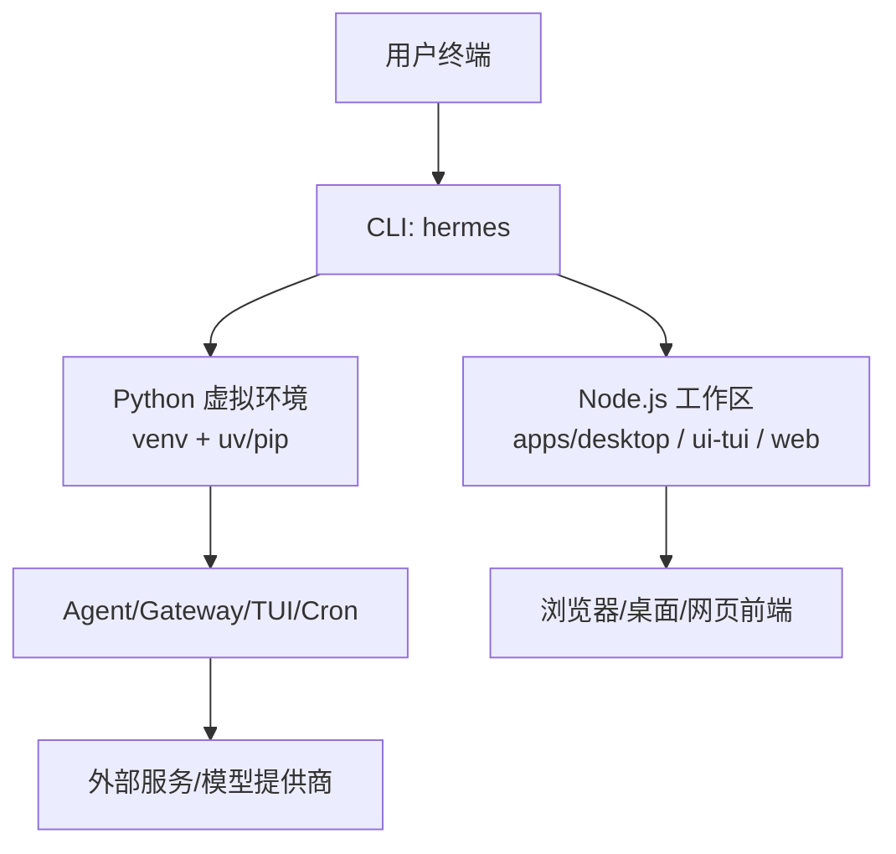
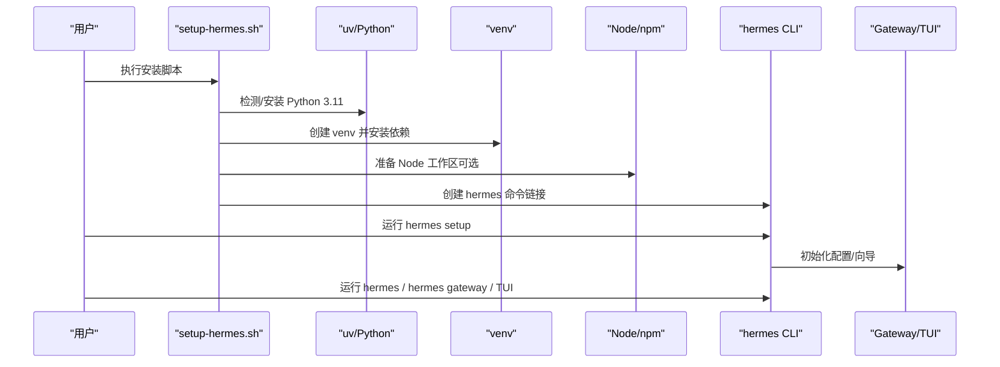
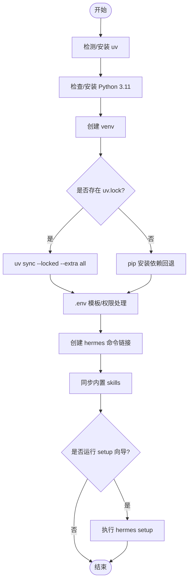
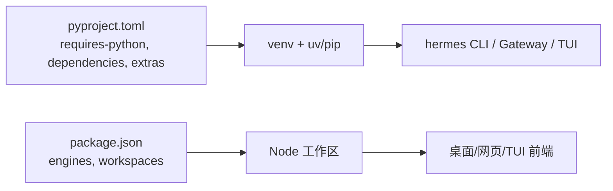

# 本地部署

<cite>
**本文引用的文件**
- [setup-hermes.sh](file://setup-hermes.sh)
- [scripts/install.sh](file://scripts/install.sh)
- [scripts/install.ps1](file://scripts/install.ps1)
- [scripts/install.cmd](file://scripts/install.cmd)
- [pyproject.toml](file://pyproject.toml)
- [package.json](file://package.json)
- [.nvmrc](file://.nvmrc)
- [.env.example](file://.env.example)
- [cli-config.yaml.example](file://cli-config.yaml.example)
- [README.md](file://README.md)
- [scripts/run_tests.sh](file://scripts/run_tests.sh)
</cite>

## 目录
1. [简介](#简介)
2. [项目结构](#项目结构)
3. [核心组件](#核心组件)
4. [架构总览](#架构总览)
5. [详细组件分析](#详细组件分析)
6. [依赖关系分析](#依赖关系分析)
7. [性能注意事项](#性能注意事项)
8. [故障排除指南](#故障排除指南)
9. [结论](#结论)
10. [附录](#附录)

## 简介
本指南面向希望在本地（Windows、macOS、Linux）搭建并运行 Hermes Agent 的开发者与用户。内容涵盖：
- 各平台安装要求与前置依赖（Python、Node.js、系统工具）
- 使用 setup-hermes.sh 的一键安装流程（环境变量、配置文件、初始引导）
- CLI 工具的本地运行方式（开发模式、调试、TUI）
- 常见平台问题与解决方案（权限、路径、代理）
- 本地开发环境搭建（热重载、测试、调试）

## 项目结构
仓库采用多语言、多工作区组织，关键目录与职责如下：
- Python 后端与 CLI：根目录与 sparkii_cli、agent、gateway、tui_gateway、cron 等
- Node.js/前端：apps/desktop（桌面端）、ui-tui（终端界面）、web（Web 面板）
- 脚本与安装器：scripts/*（含 install.sh、install.ps1、run_tests.sh 等）
- 配置模板：.env.example、cli-config.yaml.example
- 包管理：pyproject.toml（Python）、package.json（Node 工作区）

图表来源
- [setup-hermes.sh:169-267](file://setup-hermes.sh#L169-L267)
- [package.json:6-27](file://package.json#L6-L27)

章节来源
- [README.md:35-66](file://README.md#L35-L66)
- [package.json:6-27](file://package.json#L6-L27)

## 核心组件
- 安装器与引导
  - Linux/macOS/WSL/Termux：setup-hermes.sh 或 scripts/install.sh
  - Windows：scripts/install.ps1（PowerShell），提供 CMD 包装 scripts/install.cmd
- 运行时与环境
  - Python 3.11（受 pyproject.toml 约束）
  - Node.js >= 22（由 package.json engines 与 .nvmrc 指定）
  - uv 用于 Python 环境与依赖管理；npm 用于 Node 工作区
- CLI 与入口
  - 命令名：hermes（通过脚本创建符号链接到 venv/bin/hermes）
  - 子命令：model、tools、config、gateway、setup、doctor 等

章节来源
- [setup-hermes.sh:329-396](file://setup-hermes.sh#L329-L396)
- [pyproject.toml:358-361](file://pyproject.toml#L358-L361)
- [package.json:65-68](file://package.json#L65-L68)

## 架构总览
下图展示从“一键安装”到“启动 CLI/TUI/Gateway”的整体流程与关键组件交互。

图表来源
- [setup-hermes.sh:133-182](file://setup-hermes.sh#L133-L182)
- [setup-hermes.sh:236-267](file://setup-hermes.sh#L236-L267)
- [setup-hermes.sh:348-396](file://setup-hermes.sh#L348-L396)
- [scripts/install.sh:549-653](file://scripts/install.sh#L549-L653)

## 详细组件分析

### 安装器与一键安装（setup-hermes.sh）
- 功能要点
  - 自动检测 Termux 与非 Termux 路径
  - 安装/定位 uv，必要时下载并安装
  - 检查或安装 Python 3.11，创建 venv
  - 使用 uv.lock（存在时）进行哈希校验安装，否则回退 pip
  - 复制/生成 .env（若不存在则从模板复制并设置权限）
  - 将 hermes 命令软链到用户可访问目录（~/.local/bin 或 $PREFIX/bin）
  - 同步内置 skills 到 ~/.hermes/skills
  - 提示是否立即运行 setup 向导
- 关键行为与位置
  - Python 版本与 venv 创建：[setup-hermes.sh:133-182](file://setup-hermes.sh#L133-L182)
  - 依赖安装（优先 uv.lock）：[setup-hermes.sh:236-267](file://setup-hermes.sh#L236-L267)
  - 环境变量与 .env 处理：[setup-hermes.sh:329-342](file://setup-hermes.sh#L329-L342)
  - PATH 与命令链接：[setup-hermes.sh:348-396](file://setup-hermes.sh#L348-L396)
  - Skills 同步与完成提示：[setup-hermes.sh:399-462](file://setup-hermes.sh#L399-L462)

图表来源
- [setup-hermes.sh:66-127](file://setup-hermes.sh#L66-L127)
- [setup-hermes.sh:133-182](file://setup-hermes.sh#L133-L182)
- [setup-hermes.sh:236-267](file://setup-hermes.sh#L236-L267)
- [setup-hermes.sh:329-396](file://setup-hermes.sh#L329-L396)
- [setup-hermes.sh:399-462](file://setup-hermes.sh#L399-L462)

章节来源
- [setup-hermes.sh:66-127](file://setup-hermes.sh#L66-L127)
- [setup-hermes.sh:133-182](file://setup-hermes.sh#L133-L182)
- [setup-hermes.sh:236-267](file://setup-hermes.sh#L236-L267)
- [setup-hermes.sh:329-396](file://setup-hermes.sh#L329-L396)
- [setup-hermes.sh:399-462](file://setup-hermes.sh#L399-L462)

### 跨平台安装器（Linux/macOS/Windows）
- Linux/macOS/WSL/Termux
  - 推荐使用 scripts/install.sh，支持更多选项（如 --no-venv、--skip-setup、--dir、--hermes-home 等）
  - 自动检测 OS/Distro，安装 Git、uv、Python、Node，并处理 FHS 布局（root 安装）
- Windows
  - 推荐 PowerShell 安装器 scripts/install.ps1，CMD 可通过 scripts/install.cmd 调用
  - 包含 8.3 短路径修复、UTF-8 控制台输出、阶段化安装协议等
- 通用步骤
  - 安装 uv → 安装 Python 3.11 → 创建 venv → 安装依赖 → 配置 PATH → 运行 setup

章节来源
- [scripts/install.sh:45-199](file://scripts/install.sh#L45-L199)
- [scripts/install.sh:503-543](file://scripts/install.sh#L503-L543)
- [scripts/install.sh:549-653](file://scripts/install.sh#L549-L653)
- [scripts/install.ps1:1-75](file://scripts/install.ps1#L1-L75)
- [scripts/install.cmd:1-29](file://scripts/install.cmd#L1-L29)

### 环境变量与配置文件
- .env（密钥与运行时开关）
  - 存放各类 LLM 与工具 API Key（OpenRouter、Google Gemini、Ollama Cloud、Exa、FAL 等）
  - 浏览器工具、语音转录、消息网关、调试开关等
  - 示例参考：.env.example
- cli-config.yaml（行为与模型路由）
  - 默认模型、provider、base_url、超时、压缩策略、终端后端、会话重置策略等
  - 示例参考：cli-config.yaml.example
- 安装后建议
  - 首次运行 hermes setup 完成交互式配置
  - 如需跳过密钥收集，可使用门户集成（按 README 指引）

章节来源
- [.env.example:1-497](file://.env.example#L1-L497)
- [cli-config.yaml.example:1-800](file://cli-config.yaml.example#L1-L800)
- [README.md:124-138](file://README.md#L124-L138)

### CLI 工具本地运行（开发模式、调试、TUI）
- 启动聊天（TUI）
  - 命令：hermes
- 选择模型/工具/配置
  - hermes model、hermes tools、hermes config set/get
- 启动消息网关（Telegram/Discord/Slack 等）
  - hermes gateway（前台）或 hermes gateway install（后台服务）
- 诊断与更新
  - hermes doctor、hermes update
- 开发模式
  - 在 venv 中直接运行 Python 模块或使用入口点（见 pyproject entry points）
  - 结合 pytest 与 run_tests.sh 进行单元测试与集成测试

章节来源
- [README.md:107-118](file://README.md#L107-L118)
- [pyproject.toml:358-361](file://pyproject.toml#L358-L361)
- [scripts/run_tests.sh:1-33](file://scripts/run_tests.sh#L1-L33)

## 依赖关系分析
- Python 依赖
  - 要求 Python 3.11（>=3.11,<3.14），由 pyproject.toml 约束
  - 核心依赖精确锁定，可选 extras 按需启用（voice、messaging、web 等）
  - 安装优先使用 uv.lock 保证可重复性与供应链安全
- Node.js 依赖
  - 要求 Node >= 22.22.0，npm 版本有范围限制
  - 工作区包含 apps/desktop、ui-tui、web、tests-js
- 系统工具
  - Git（克隆与更新）
  - ripgrep（可选，提升搜索速度）
  - ffmpeg（部分媒体能力需要）
  - Playwright/Chromium（浏览器工具，可按需跳过）

图表来源
- [pyproject.toml:3-155](file://pyproject.toml#L3-L155)
- [package.json:65-68](file://package.json#L65-L68)

章节来源
- [pyproject.toml:3-155](file://pyproject.toml#L3-L155)
- [package.json:65-68](file://package.json#L65-L68)

## 性能注意事项
- 优先使用 uv.lock 安装以获得哈希校验与更快解析
- 避免在安装期间污染 PYTHONPATH/PYTHONHOME（安装器已做保护）
- 合理配置上下文压缩阈值与目标保留比例，减少长对话开销
- 使用 ripgrep 提升文件搜索性能（可选）
- 浏览器工具按需启用，避免不必要的资源占用

## 故障排除指南
- 权限问题
  - Linux/macOS：确保 ~/.local/bin 在 PATH 中（脚本会尝试写入 shell 配置）
  - Windows：以管理员权限运行 PowerShell 或在受信任目录执行；如遇杀毒软件误报，加入白名单
- 路径配置
  - 确认 hermes 命令可被当前 shell 找到；必要时手动 source 对应 shell 配置文件
  - Windows 8.3 短路径问题已由安装器处理；如仍异常，检查用户目录命名
- 网络代理
  - 若公司网络需代理，请确保 curl、uv、pip、npm 均能正确读取代理环境变量
  - 对于 npm，可在项目根目录配置 .npmrc 或使用全局代理设置
- 浏览器工具
  - 如需跳过浏览器安装，使用安装参数 --skip-browser 或 --no-playwright
- 日志与诊断
  - 使用 hermes doctor 检查环境状态
  - 查看 logs/ 下的会话轨迹与错误日志

章节来源
- [setup-hermes.sh:329-396](file://setup-hermes.sh#L329-L396)
- [scripts/install.sh:549-653](file://scripts/install.sh#L549-L653)
- [README.md:68-101](file://README.md#L68-L101)

## 结论
通过 setup-hermes.sh 或平台专用安装器，可在主流操作系统上快速完成 Python/Node 环境、依赖与 CLI 的本地部署。配合 .env 与 cli-config.yaml 完成密钥与行为配置后，即可使用 hermes 进入 TUI 或启动 Gateway。开发模式下，借助 venv、pytest 与 run_tests.sh 可高效进行调试与测试。

## 附录
- 常用命令速查
  - hermes：启动聊天（TUI）
  - hermes model：切换模型/provider
  - hermes tools：启用/禁用工具集
  - hermes config set/get：读写配置项
  - hermes gateway：启动消息网关（前台/后台）
  - hermes setup：运行完整设置向导
  - hermes doctor：诊断环境问题
- 开发测试
  - 使用 scripts/run_tests.sh 运行测试套件（自动隔离、并行、确定性环境）
  - 在 venv 中安装 dev 依赖后可使用 pytest/mypy/ruff 等工具

章节来源
- [README.md:107-118](file://README.md#L107-L118)
- [scripts/run_tests.sh:1-33](file://scripts/run_tests.sh#L1-L33)