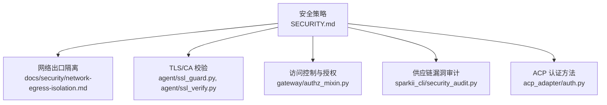
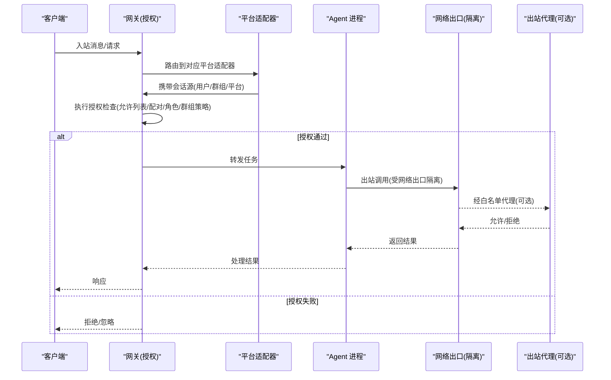
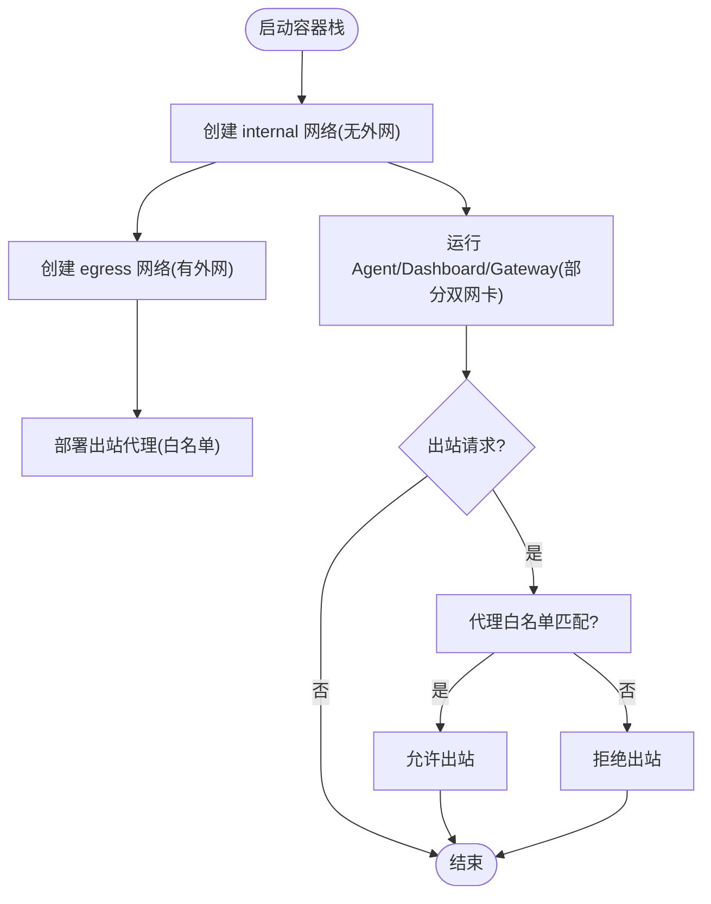
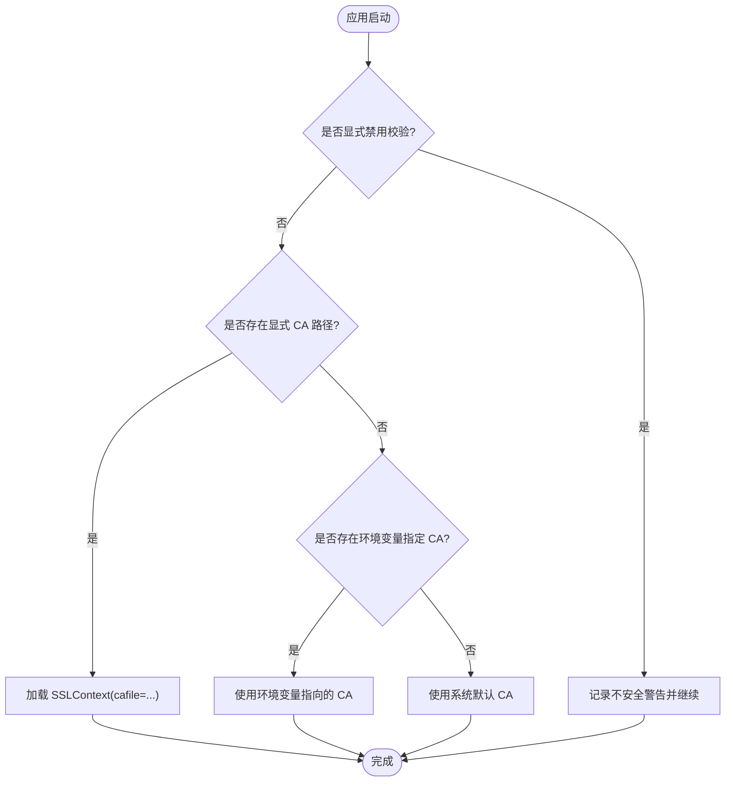
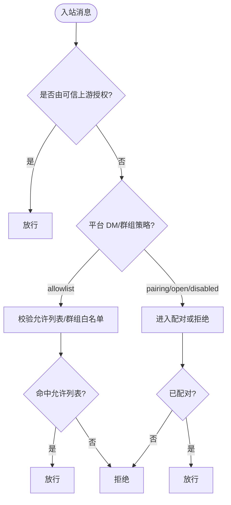
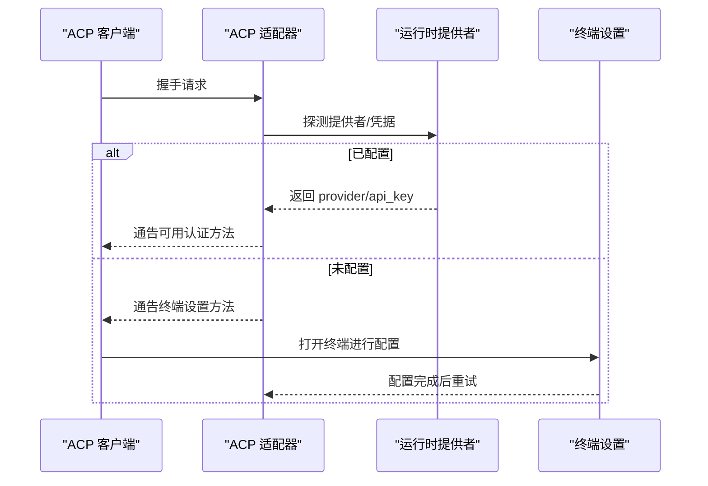
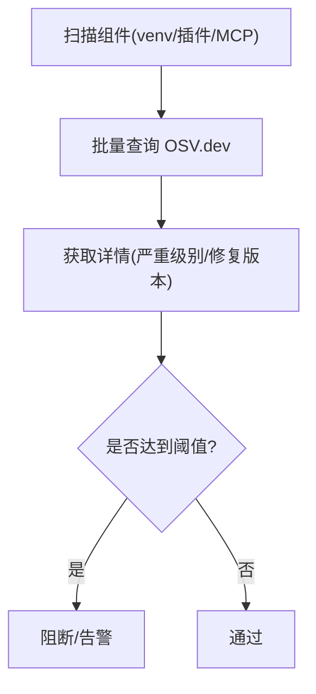
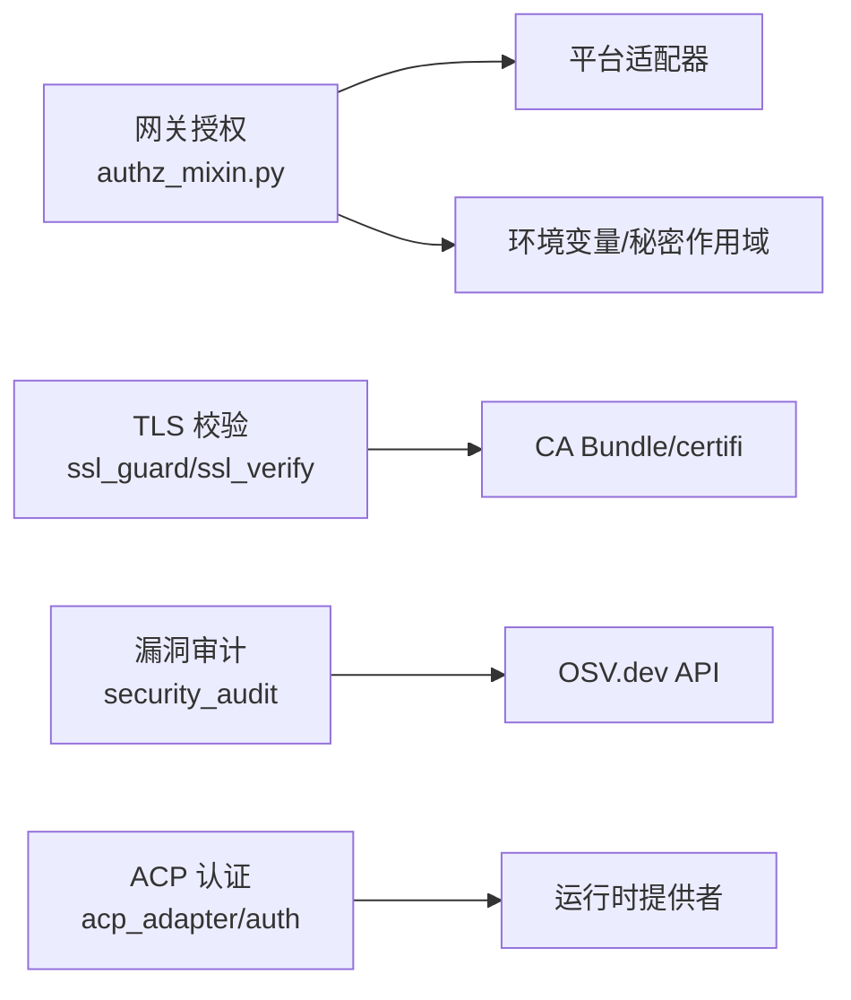

# 安全加固措施

<cite>
**本文引用的文件**
- [SECURITY.md](file://SECURITY.md)
- [network-egress-isolation.md](file://docs/security/network-egress-isolation.md)
- [ssl_guard.py](file://agent/ssl_guard.py)
- [ssl_verify.py](file://agent/ssl_verify.py)
- [security_audit.py](file://sparkii_cli/security_audit.py)
- [authz_mixin.py](file://gateway/authz_mixin.py)
- [auth.py](file://acp_adapter/auth.py)
</cite>

## 目录
1. [简介](#简介)
2. [项目结构](#项目结构)
3. [核心组件](#核心组件)
4. [架构总览](#架构总览)
5. [详细组件分析](#详细组件分析)
6. [依赖关系分析](#依赖关系分析)
7. [性能考量](#性能考量)
8. [故障排查指南](#故障排查指南)
9. [结论](#结论)
10. [附录](#附录)

## 简介
本指南面向部署与运维人员，聚焦系统安全加固：网络出口隔离、访问控制与授权、认证与密钥管理、传输与存储加密、网络安全配置（TLS/HTTPS/CORS）、漏洞扫描与渗透测试、以及安全事件响应流程。文档基于仓库内现有安全策略与实现，提供可操作的配置建议与最佳实践，帮助在本地或容器化环境中构建纵深防御体系。

## 项目结构
与安全相关的核心能力分布在以下位置：
- 安全策略与信任边界定义：根级 SECURITY.md
- 网络出口隔离（Docker）：docs/security/network-egress-isolation.md
- TLS/CA 校验与证书修复：agent/ssl_guard.py、agent/ssl_verify.py
- 供应链漏洞审计：sparkii_cli/security_audit.py
- 网关访问控制与授权：gateway/authz_mixin.py
- ACP 适配器认证方法发现：acp_adapter/auth.py

图表来源
- [SECURITY.md:1-336](file://SECURITY.md#L1-L336)
- [network-egress-isolation.md:1-196](file://docs/security/network-egress-isolation.md#L1-L196)
- [ssl_guard.py:1-102](file://agent/ssl_guard.py#L1-L102)
- [ssl_verify.py:1-64](file://agent/ssl_verify.py#L1-L64)
- [security_audit.py:1-590](file://sparkii_cli/security_audit.py#L1-L590)
- [authz_mixin.py:1-800](file://gateway/authz_mixin.py#L1-L800)
- [auth.py:1-80](file://acp_adapter/auth.py#L1-L80)

章节来源
- [SECURITY.md:1-336](file://SECURITY.md#L1-L336)
- [network-egress-isolation.md:1-196](file://docs/security/network-egress-isolation.md#L1-L196)

## 核心组件
- 信任模型与边界：以操作系统级隔离为唯一承载性安全边界；进程内启发式仅作为辅助防护。
- 网络出口隔离：通过 Docker 网络分段与可选代理白名单限制出站流量，降低提示注入导致的越权外泄风险。
- TLS/CA 校验：启动时验证 CA bundle 完整性与可用性；运行时按优先级解析 CA 路径并支持禁用校验的警告。
- 访问控制与授权：网关层对多平台入站消息执行严格的允许列表、配对审批、角色/群组策略等综合判定。
- 供应链漏洞审计：扫描 venv、插件声明依赖与 MCP 服务器命令中的版本，批量查询 OSV.dev 并输出严重级别与修复版本。
- ACP 认证方法：自动探测运行时提供者并通告可用认证方式，未配置时引导终端设置。

章节来源
- [SECURITY.md:32-169](file://SECURITY.md#L32-L169)
- [network-egress-isolation.md:12-154](file://docs/security/network-egress-isolation.md#L12-L154)
- [ssl_guard.py:18-102](file://agent/ssl_guard.py#L18-L102)
- [ssl_verify.py:14-64](file://agent/ssl_verify.py#L14-L64)
- [security_audit.py:84-430](file://sparkii_cli/security_audit.py#L84-L430)
- [authz_mixin.py:386-783](file://gateway/authz_mixin.py#L386-L783)
- [auth.py:11-79](file://acp_adapter/auth.py#L11-L79)

## 架构总览
下图展示从外部请求到内部处理的授权与隔离路径，强调“默认拒绝”和“最小权限”。

图表来源
- [authz_mixin.py:386-783](file://gateway/authz_mixin.py#L386-L783)
- [network-egress-isolation.md:23-154](file://docs/security/network-egress-isolation.md#L23-L154)

## 详细组件分析

### 网络出口隔离（Docker）
- 目标：防止恶意命令通过容器直接访问互联网，将出站流量限定到必要服务。
- 方案：
  - 使用 internal 网络（无默认路由）运行 Agent/Dashboard/Gateway。
  - 将需要外联的服务（如 Gateway）挂载到 egress 网络，并通过 HTTP/HTTPS 代理进行白名单控制。
  - 通过 Compose 覆盖默认 host 模式，显式绑定端口至本地回环。
- 验证：在容器内尝试访问外部域名应失败；访问内部服务应成功；经代理访问白名单域名应成功。

图表来源
- [network-egress-isolation.md:23-154](file://docs/security/network-egress-isolation.md#L23-L154)

章节来源
- [network-egress-isolation.md:1-196](file://docs/security/network-egress-isolation.md#L1-L196)

### TLS/CA 校验与证书管理
- 启动前校验：检测并修复缺失或损坏的 CA bundle，避免后续网络库出现模糊错误。
- 运行时解析：按优先级选择 ssl_verify=false、显式 ca_bundle、环境变量指定的 CA 路径，最终回退到系统默认。
- 安全建议：生产环境禁止关闭校验；企业环境统一分发可信 CA bundle 并通过环境变量注入。

图表来源
- [ssl_verify.py:14-64](file://agent/ssl_verify.py#L14-L64)
- [ssl_guard.py:18-102](file://agent/ssl_guard.py#L18-L102)

章节来源
- [ssl_guard.py:1-102](file://agent/ssl_guard.py#L1-L102)
- [ssl_verify.py:1-64](file://agent/ssl_verify.py#L1-L64)

### 访问控制与授权（网关）
- 原则：每个暴露的网络面必须配置调用方允许列表；未配置时默认拒绝。
- 机制：
  - 上游授权委托：若适配器或中继已在前置层完成鉴权，则信任其结果。
  - 平台策略：DM/群组策略（open/allowlist/disabled/pairing），结合 allow_from/group_allow_from。
  - 允许列表：平台级与环境变量级允许列表合并；支持通配符与别名归一化。
  - 配对审批：通过配对码建立授权，支持多实例/多 Profile 隔离。
  - 机器人流量：可按平台开关允许机器人消息。
- 默认行为：未配置任何允许列表时，除明确放行外一律拒绝。

图表来源
- [authz_mixin.py:386-783](file://gateway/authz_mixin.py#L386-L783)

章节来源
- [authz_mixin.py:1-800](file://gateway/authz_mixin.py#L1-L800)

### 认证与授权集成（ACP/OAuth/API 密钥）
- ACP 认证方法：自动探测当前运行时提供者（含 callable 形式的令牌提供者），并在未配置时提供终端设置入口。
- OAuth：各平台/插件中实现了 OAuth 流程与凭据管理（例如记忆插件、MCP OAuth、平台适配器等）。
- API 密钥：通过运行时提供者与凭据池管理，避免硬编码；敏感信息优先使用秘密来源。

图表来源
- [auth.py:11-79](file://acp_adapter/auth.py#L11-L79)

章节来源
- [auth.py:1-80](file://acp_adapter/auth.py#L1-L80)

### 数据加密策略（传输/存储/密钥）
- 传输加密：强制启用 TLS 校验；企业环境通过统一 CA bundle 注入；禁止在生产关闭校验。
- 存储加密：敏感配置与凭据存放于独立凭据文件/秘密来源，严格权限控制；不在主配置或版本库中明文保存。
- 密钥管理：优先使用 Provider Store（如 OpenShell）注入凭据，避免落盘；必要时使用命令行工具或 CLI 子命令管理密钥。

章节来源
- [SECURITY.md:301-324](file://SECURITY.md#L301-L324)
- [ssl_guard.py:18-102](file://agent/ssl_guard.py#L18-L102)
- [ssl_verify.py:14-64](file://agent/ssl_verify.py#L14-L64)

### 网络安全配置（SSL/TLS/HTTPS/CORS）
- SSL/TLS：启动时校验 CA bundle；运行时按优先级解析 CA；支持自定义 CA 路径。
- HTTPS 强制：对外暴露的 Dashboard/HTTP 端点应绑定本地回环或通过反向代理强制 HTTPS。
- CORS：若暴露 Web 接口，应在反向代理或网关层配置最小化的允许源与方法集合。

章节来源
- [ssl_guard.py:18-102](file://agent/ssl_guard.py#L18-L102)
- [ssl_verify.py:14-64](file://agent/ssl_verify.py#L14-L64)
- [network-egress-isolation.md:83-96](file://docs/security/network-egress-isolation.md#L83-L96)

### 漏洞扫描与渗透测试
- 供应链审计：扫描 venv、插件依赖与 MCP 命令中的版本，批量查询 OSV.dev，输出严重级别与修复版本；支持按阈值退出。
- 渗透测试：建议在沙箱/隔离环境中进行；结合网络出口隔离与最小权限原则，减少攻击面。
- 持续集成：在 CI 中集成审计命令，阻断包含高危漏洞的版本发布。

图表来源
- [security_audit.py:84-430](file://sparkii_cli/security_audit.py#L84-L430)
- [security_audit.py:539-590](file://sparkii_cli/security_audit.py#L539-L590)

章节来源
- [security_audit.py:1-590](file://sparkii_cli/security_audit.py#L1-L590)

### 安全事件响应流程
- 报告渠道：通过私有渠道报告漏洞，不公开 issue。
- 处置窗口：协调披露窗口期，直至修复发布。
- 责任边界：仅针对违反信任边界、外部表面未授权访问、凭据外泄等情况；进程内启发式绕过不属于漏洞范畴。

章节来源
- [SECURITY.md:7-28](file://SECURITY.md#L7-L28)
- [SECURITY.md:328-336](file://SECURITY.md#L328-L336)

## 依赖关系分析
- 网关授权模块依赖平台适配器与配置，读取环境变量与秘密作用域，决定入站消息是否放行。
- TLS 校验模块依赖系统 CA bundle 与第三方库（如 certifi），在启动阶段进行健康检查。
- 漏洞审计模块依赖 OSV.dev 接口，并行拉取漏洞详情并按严重级别排序。
- ACP 认证模块依赖运行时提供者，动态通告认证方法。

图表来源
- [authz_mixin.py:31-73](file://gateway/authz_mixin.py#L31-L73)
- [ssl_guard.py:18-102](file://agent/ssl_guard.py#L18-L102)
- [ssl_verify.py:14-64](file://agent/ssl_verify.py#L14-L64)
- [security_audit.py:285-430](file://sparkii_cli/security_audit.py#L285-L430)
- [auth.py:11-79](file://acp_adapter/auth.py#L11-L79)

章节来源
- [authz_mixin.py:1-800](file://gateway/authz_mixin.py#L1-L800)
- [ssl_guard.py:1-102](file://agent/ssl_guard.py#L1-L102)
- [ssl_verify.py:1-64](file://agent/ssl_verify.py#L1-L64)
- [security_audit.py:1-590](file://sparkii_cli/security_audit.py#L1-L590)
- [auth.py:1-80](file://acp_adapter/auth.py#L1-L80)

## 性能考量
- 网络出口隔离：引入代理会增加延迟，建议仅对必要域名放行，并使用连接复用与缓存。
- TLS 校验：启动时一次性校验 CA bundle，避免每次请求重复开销；合理配置 CA bundle 大小以减少加载时间。
- 漏洞审计：批量查询与并行拉取详情，注意速率限制与超时；CI 中按需跳过耗时步骤。
- 网关授权：允许列表与策略评估为轻量操作，但应避免频繁 I/O；尽量使用内存中的配置快照。

[本节为通用指导，无需特定文件引用]

## 故障排查指南
- TLS 错误：若出现证书相关异常，优先检查 CA bundle 路径与内容完整性；可使用诊断命令修复或手动重装依赖。
- 出站被拒：确认容器网络与代理白名单配置；验证内部服务可达性与外部域名是否在白名单。
- 授权失败：检查平台允许列表、群组策略、配对状态与全局允许标志；确认适配器是否声明上游授权。
- 审计失败：检查网络连通性与 OSV 接口可用性；调整并发与超时参数。

章节来源
- [ssl_guard.py:28-102](file://agent/ssl_guard.py#L28-L102)
- [network-egress-isolation.md:156-172](file://docs/security/network-egress-isolation.md#L156-L172)
- [authz_mixin.py:386-783](file://gateway/authz_mixin.py#L386-L783)
- [security_audit.py:539-590](file://sparkii_cli/security_audit.py#L539-L590)

## 结论
本指南围绕信任边界、网络出口隔离、TLS/CA 校验、访问控制与授权、供应链漏洞审计与事件响应，构建了端到端的安全加固方案。建议在生产环境中严格执行最小权限与默认拒绝原则，结合容器网络分段与代理白名单，确保 Agent 仅在必要范围内活动。同时，持续进行供应链审计与渗透测试，完善事件响应流程，提升整体安全韧性。

[本节为总结性内容，无需特定文件引用]

## 附录
- 部署加固要点：
  - 以非 root 用户运行；凭证放独立文件并收紧权限；不暴露公网或未加认证。
  - 为每个网络暴露的适配器配置调用方允许列表；本地 IPC 面依赖 OS 权限控制。
  - 审查第三方技能与插件后再安装；利用供应链接口保护。
- 常见攻击防护：
  - 提示注入：通过网络出口隔离与沙箱执行限制破坏性命令与数据外泄。
  - 未授权访问：网关层默认拒绝，需显式允许；上游授权需可信。
  - 证书劫持：强制 TLS 校验与企业 CA 统一管理。

章节来源
- [SECURITY.md:301-324](file://SECURITY.md#L301-L324)
- [SECURITY.md:171-223](file://SECURITY.md#L171-L223)
- [network-egress-isolation.md:12-21](file://docs/security/network-egress-isolation.md#L12-L21)