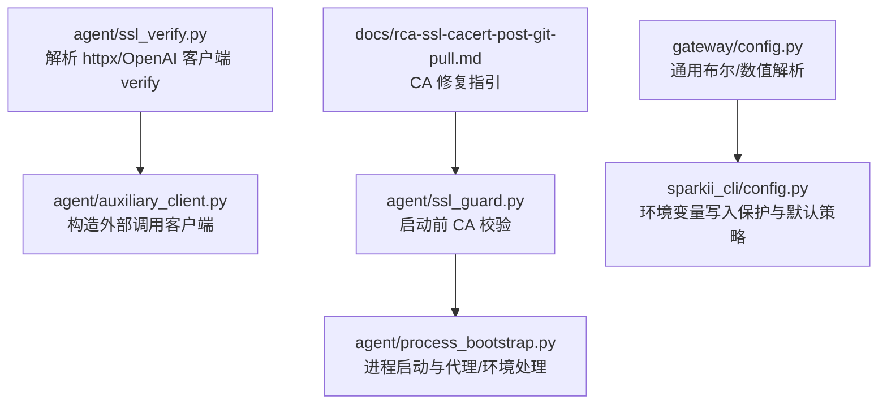
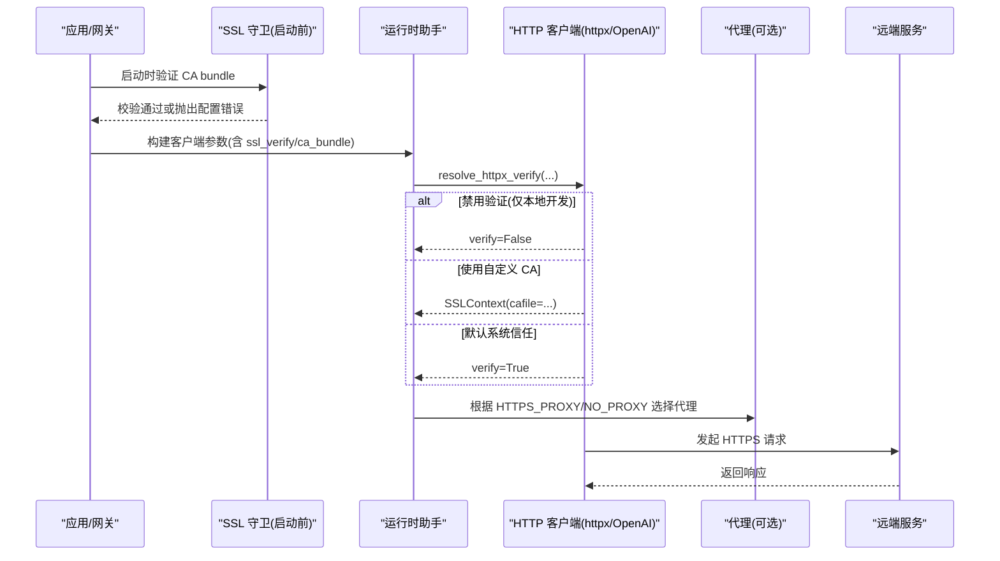
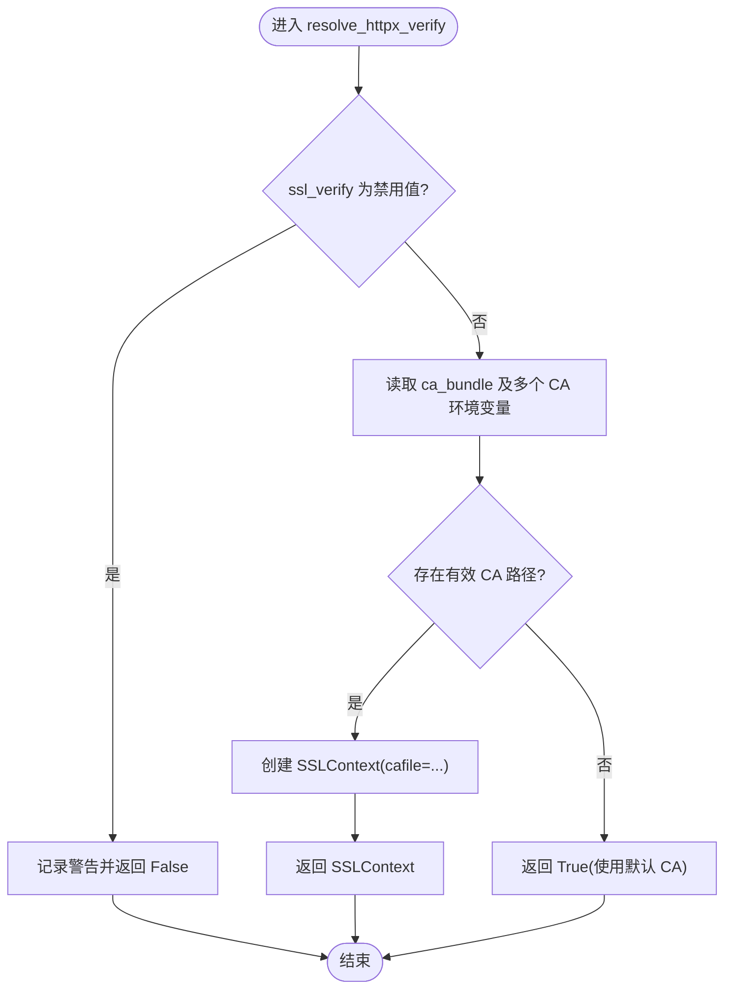
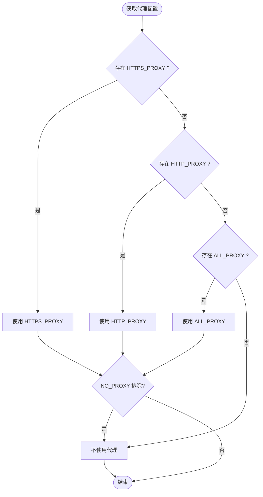
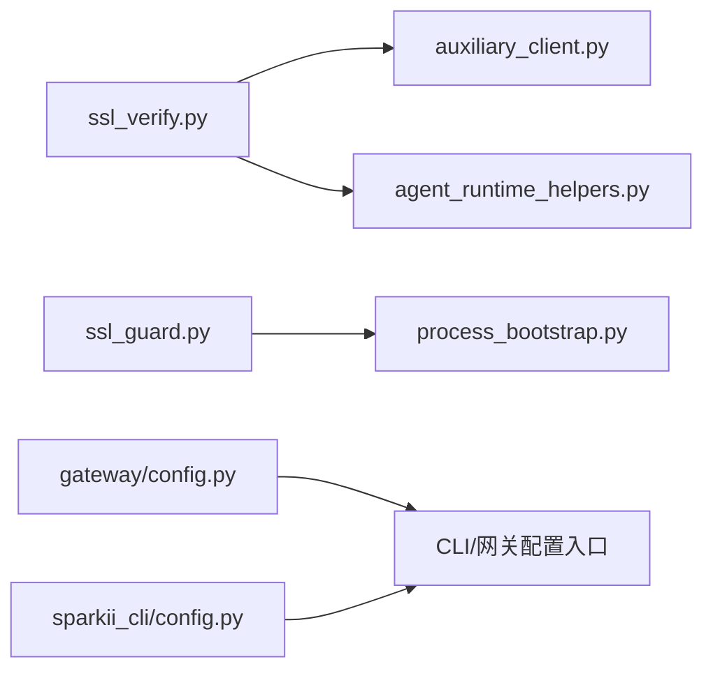

# 网络安全配置

<cite>
**本文引用的文件**
- [agent/ssl_verify.py](file://agent/ssl_verify.py)
- [agent/ssl_guard.py](file://agent/ssl_guard.py)
- [agent/auxiliary_client.py](file://agent/auxiliary_client.py)
- [agent/agent_runtime_helpers.py](file://agent/agent_runtime_helpers.py)
- [agent/model_metadata.py](file://agent/model_metadata.py)
- [agent/process_bootstrap.py](file://agent/process_bootstrap.py)
- [gateway/config.py](file://gateway/config.py)
- [sparkii_cli/config.py](file://sparkii_cli/config.py)
- [docs/rca-ssl-cacert-post-git-pull.md](file://docs/rca-ssl-cacert-post-git-pull.md)
</cite>

## 目录
1. [简介](#简介)
2. [项目结构](#项目结构)
3. [核心组件](#核心组件)
4. [架构总览](#架构总览)
5. [详细组件分析](#详细组件分析)
6. [依赖关系分析](#依赖关系分析)
7. [性能考虑](#性能考虑)
8. [故障排除指南](#故障排除指南)
9. [结论](#结论)
10. [附录](#附录)

## 简介
本文件面向部署与运维人员，提供本项目在网络安全方面的配置与实践说明。重点覆盖：
- SSL/TLS 证书验证机制（CA 证书包、自定义证书路径、环境变量）
- HTTPS 强制启用策略与 CORS 安全建议
- 防火墙规则与网络访问控制列表（白名单/黑名单）
- 证书轮换、协议版本选择与常见攻击防护
- 网络故障排除与性能优化建议

## 项目结构
与安全相关的关键模块分布在 agent 层（TLS 校验、启动前检查）、CLI/Gateway 配置层（布尔值解析、默认行为），以及文档中关于 CA 修复的指引。

**图表来源**
- [agent/ssl_verify.py:22-63](file://agent/ssl_verify.py#L22-L63)
- [agent/ssl_guard.py:68-101](file://agent/ssl_guard.py#L68-L101)
- [agent/auxiliary_client.py:146-162](file://agent/auxiliary_client.py#L146-L162)
- [agent/process_bootstrap.py:115-153](file://agent/process_bootstrap.py#L115-L153)
- [gateway/config.py:26-37](file://gateway/config.py#L26-L37)
- [sparkii_cli/config.py:157-200](file://sparkii_cli/config.py#L157-L200)
- [docs/rca-ssl-cacert-post-git-pull.md](file://docs/rca-ssl-cacert-post-git-pull.md)

**章节来源**
- [agent/ssl_verify.py:22-63](file://agent/ssl_verify.py#L22-L63)
- [agent/ssl_guard.py:68-101](file://agent/ssl_guard.py#L68-L101)
- [gateway/config.py:26-37](file://gateway/config.py#L26-L37)
- [sparkii_cli/config.py:157-200](file://sparkii_cli/config.py#L157-L200)

## 核心组件
- TLS 验证解析器：统一为 httpx/OpenAI 等客户端决定 verify 参数（禁用、使用自定义 CA、回退到系统默认）。
- 启动前 CA 校验：在进程启动阶段检测 CA bundle 是否可用，避免后续出现难以定位的文件缺失错误。
- 辅助客户端：将 TLS 配置桥接到具体 HTTP 客户端，并支持通过配置与环境变量注入 CA。
- 进程启动与代理：读取代理环境变量，按优先级选择代理，尊重 NO_PROXY 排除。
- 配置解析：统一的布尔/数值解析，确保开关项（如 HTTPS/CORS）行为一致可预期。
- CLI 安全：限制通过界面写入危险的环境变量名，防止运行时劫持。

**章节来源**
- [agent/ssl_verify.py:22-63](file://agent/ssl_verify.py#L22-L63)
- [agent/ssl_guard.py:68-101](file://agent/ssl_guard.py#L68-L101)
- [agent/auxiliary_client.py:146-162](file://agent/auxiliary_client.py#L146-L162)
- [agent/process_bootstrap.py:115-153](file://agent/process_bootstrap.py#L115-L153)
- [gateway/config.py:26-37](file://gateway/config.py#L26-L37)
- [sparkii_cli/config.py:157-200](file://sparkii_cli/config.py#L157-L200)

## 架构总览
下图展示了从应用启动到发起 HTTPS 请求的完整链路，包括证书校验、代理选择与配置解析。

**图表来源**
- [agent/ssl_guard.py:68-101](file://agent/ssl_guard.py#L68-L101)
- [agent/ssl_verify.py:22-63](file://agent/ssl_verify.py#L22-L63)
- [agent/auxiliary_client.py:146-162](file://agent/auxiliary_client.py#L146-L162)
- [agent/process_bootstrap.py:115-153](file://agent/process_bootstrap.py#L115-L153)

## 详细组件分析

### SSL/TLS 证书验证机制
- 优先级策略
  - 显式禁用：当 ssl_verify 为 false/0/no/off 时，关闭证书校验（仅限本地开发，生产严禁）。
  - 自定义 CA：优先使用 per-provider 的 ssl_ca_cert；否则读取 SPARKII_CA_BUNDLE、SSL_CERT_FILE、REQUESTS_CA_BUNDLE、CURL_CA_BUNDLE。
  - 默认信任：未设置时使用系统/库默认 CA。
- 自定义证书路径
  - 支持用户目录展开（~）与绝对路径；若路径不存在或不可加载，会记录告警并回退到默认 CA。
- 环境变量
  - 统一读取上述四个 CA 相关环境变量；模型元数据模块也强调对 REQUESTS_CA_BUNDLE/CURL_CA_BUNDLE 的支持。
- 启动前校验
  - 启动时检查配置的 CA bundle 是否存在、是否为文件、是否可被 OpenSSL 加载且包含证书；同时校验内置 certifi 的 cacert.pem。
  - 可通过 SPARKII_SKIP_SSL_GUARD 跳过（不建议在生产使用）。

**图表来源**
- [agent/ssl_verify.py:22-63](file://agent/ssl_verify.py#L22-L63)
- [agent/model_metadata.py:54-63](file://agent/model_metadata.py#L54-L63)

**章节来源**
- [agent/ssl_verify.py:22-63](file://agent/ssl_verify.py#L22-L63)
- [agent/model_metadata.py:54-63](file://agent/model_metadata.py#L54-L63)
- [agent/ssl_guard.py:68-101](file://agent/ssl_guard.py#L68-L101)

### HTTPS 强制启用与 CORS 策略
- HTTPS 强制
  - 建议在网关/反向代理层强制 HTTPS（例如 Nginx/Apache/云厂商负载均衡），并在应用内拒绝明文 HTTP 请求。
  - 对于内部服务间通信，应始终使用 TLS；如需临时调试，仅在受控环境中允许关闭证书校验。
- CORS 安全建议
  - 严格限定允许的源（Origin）、方法、头部与凭据策略。
  - 生产环境禁止使用通配符 * 作为 Allowed-Origin。
  - 结合网关层进行预检请求缓存与速率限制，减少滥用风险。

[本节为通用实践说明，不直接引用具体代码文件]

### 防火墙规则与网络访问控制列表
- 出站控制
  - 仅放行必要的上游域名/IP（如模型提供商、认证服务、CDN）。
  - 使用 NO_PROXY 精确排除内部地址，避免误走代理。
- 入站控制
  - 仅暴露必要端口（如 443/8443），其他端口默认拒绝。
  - 结合 WAF/网关实现 IP 白名单、地域限制与请求频率限制。
- 白名单/黑名单管理
  - 白名单优先：默认拒绝，按需放行。
  - 黑名单用于阻断已知恶意域/IP，但需定期更新与维护。

[本节为通用实践说明，不直接引用具体代码文件]

### 代理与网络访问
- 代理环境变量优先级
  - 读取顺序：HTTPS_PROXY > HTTP_PROXY > ALL_PROXY（及其小写变体）。
  - 尊重 NO_PROXY 对目标 base URL 的排除。
- 子进程隔离
  - 某些子进程会剥离代理相关环境变量，避免污染或泄露。

**图表来源**
- [agent/process_bootstrap.py:115-153](file://agent/process_bootstrap.py#L115-L153)

**章节来源**
- [agent/process_bootstrap.py:115-153](file://agent/process_bootstrap.py#L115-L153)

### 配置解析与默认行为
- 布尔值解析
  - 统一支持 true/1/yes/on 与 false/0/no/off 等字符串形式，保证开关项一致性。
- 默认策略
  - 未显式设置的选项采用安全默认值（如开启证书校验、默认使用系统 CA）。

**章节来源**
- [gateway/config.py:26-37](file://gateway/config.py#L26-L37)

### CLI 安全与环境变量保护
- 写入保护
  - 通过界面写入 .env 时，阻止写入可能影响动态加载器、解释器、Shell 等关键环境变量，降低 RCE 风险。
- 已存在值不受限
  - 仅限制“写入”，不影响已在环境中设置的安全敏感变量。

**章节来源**
- [sparkii_cli/config.py:157-200](file://sparkii_cli/config.py#L157-L200)

## 依赖关系分析
- ssl_verify 被运行时助手与辅助客户端使用，以统一解析 verify 参数。
- ssl_guard 在启动阶段运行，保障后续网络调用不会因 CA 问题失败。
- process_bootstrap 负责代理与 NO_PROXY 逻辑，影响所有出站连接。
- gateway/config 提供一致的布尔/数值解析，影响各类安全开关。
- sparkii_cli/config 限制危险环境变量写入，增强整体安全性。

**图表来源**
- [agent/ssl_verify.py:22-63](file://agent/ssl_verify.py#L22-L63)
- [agent/auxiliary_client.py:146-162](file://agent/auxiliary_client.py#L146-L162)
- [agent/agent_runtime_helpers.py:2253-2265](file://agent/agent_runtime_helpers.py#L2253-L2265)
- [agent/ssl_guard.py:68-101](file://agent/ssl_guard.py#L68-L101)
- [agent/process_bootstrap.py:115-153](file://agent/process_bootstrap.py#L115-L153)
- [gateway/config.py:26-37](file://gateway/config.py#L26-L37)
- [sparkii_cli/config.py:157-200](file://sparkii_cli/config.py#L157-L200)

**章节来源**
- [agent/agent_runtime_helpers.py:2253-2265](file://agent/agent_runtime_helpers.py#L2253-L2265)
- [agent/auxiliary_client.py:146-162](file://agent/auxiliary_client.py#L146-L162)
- [agent/ssl_verify.py:22-63](file://agent/ssl_verify.py#L22-L63)
- [agent/ssl_guard.py:68-101](file://agent/ssl_guard.py#L68-L101)
- [agent/process_bootstrap.py:115-153](file://agent/process_bootstrap.py#L115-L153)
- [gateway/config.py:26-37](file://gateway/config.py#L26-L37)
- [sparkii_cli/config.py:157-200](file://sparkii_cli/config.py#L157-L200)

## 性能考虑
- 证书链验证开销
  - 首次建立 TLS 握手会有证书链验证成本；合理缓存会话与会话票据可减少重复握手。
- CA bundle 大小
  - 过大的自定义 CA bundle 会增加内存与解析时间；建议仅包含必要根证书。
- 代理链
  - 多级代理会增加延迟；尽量精简代理层级，并对超时与重试做合理配置。
- 并发与连接池
  - 合理设置连接池大小与空闲超时，避免连接耗尽或资源浪费。

[本节为通用实践说明，不直接引用具体代码文件]

## 故障排除指南
- 现象：启动时报 CA bundle 缺失或无法加载
  - 排查步骤
    - 检查 SPARKII_CA_BUNDLE、SSL_CERT_FILE、REQUESTS_CA_BUNDLE、CURL_CA_BUNDLE 指向的路径是否存在且可读。
    - 确认路径指向的是文件而非目录，且文件大小合理（非空、非损坏）。
    - 若使用了企业 CA，确保证书格式正确并可被 OpenSSL 加载。
  - 修复建议
    - 运行诊断工具自动修复（如重新安装 certifi/openai/httpx）。
    - 修正或清除错误的 CA 环境变量。
    - 参考文档中的 RCA 指南进行定位与修复。
- 现象：请求被代理拦截或无法到达上游
  - 排查步骤
    - 检查 HTTPS_PROXY/HTTP_PROXY/ALL_PROXY 与 NO_PROXY 配置是否正确。
    - 确认目标 base URL 未被 NO_PROXY 错误排除。
- 现象：证书校验失败（握手异常）
  - 排查步骤
    - 确认服务端证书链完整且可信。
    - 检查中间代理是否替换了证书（如透明代理）。
    - 必要时在受控环境下临时禁用校验以定位问题（生产严禁）。

**章节来源**
- [agent/ssl_guard.py:68-101](file://agent/ssl_guard.py#L68-L101)
- [docs/rca-ssl-cacert-post-git-pull.md](file://docs/rca-ssl-cacert-post-git-pull.md)
- [agent/process_bootstrap.py:115-153](file://agent/process_bootstrap.py#L115-L153)

## 结论
- 生产环境必须启用并强制 TLS，严格使用可信 CA，禁止在生产关闭证书校验。
- 通过启动前 CA 校验与统一的 verify 解析，确保网络调用安全可控。
- 配合网关/防火墙实施严格的入出站控制与 CORS 策略，最小化攻击面。
- 遵循证书轮换与协议版本最佳实践，持续监控与加固。

[本节为总结性内容，不直接引用具体代码文件]

## 附录
- 常用环境变量
  - SPARKII_CA_BUNDLE / SSL_CERT_FILE / REQUESTS_CA_BUNDLE / CURL_CA_BUNDLE：指定 CA bundle 路径。
  - HTTPS_PROXY / HTTP_PROXY / ALL_PROXY / NO_PROXY：代理与排除规则。
  - SPARKII_SKIP_SSL_GUARD：跳过启动前 CA 校验（不建议在生产使用）。
- 推荐实践
  - 证书轮换：定期更新 CA bundle 与服务端证书，自动化下发与重启。
  - 协议版本：启用 TLS 1.2+，禁用不安全协议与弱加密套件。
  - 攻击防护：WAF 防护、DDoS 缓解、输入校验、最小权限原则。

[本节为通用实践说明，不直接引用具体代码文件]