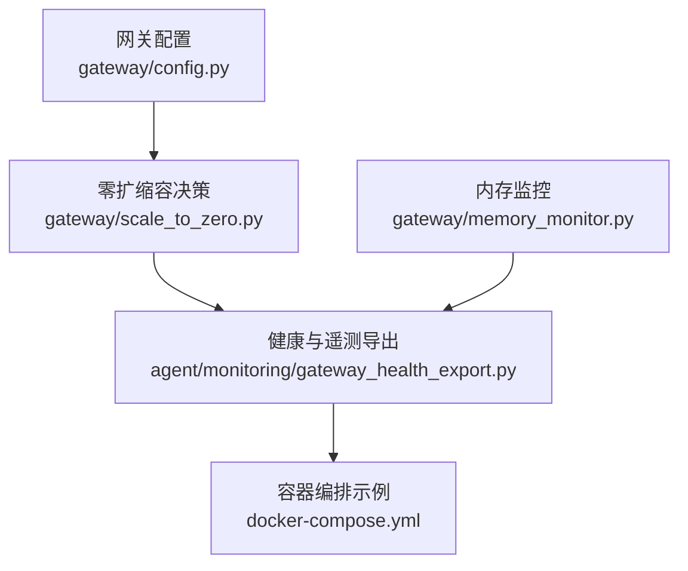
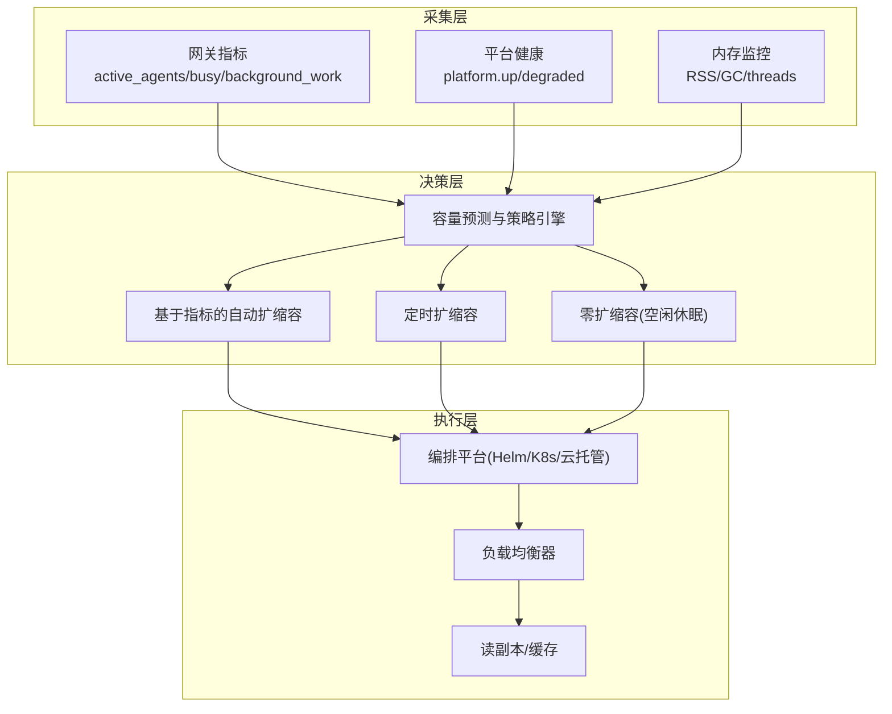
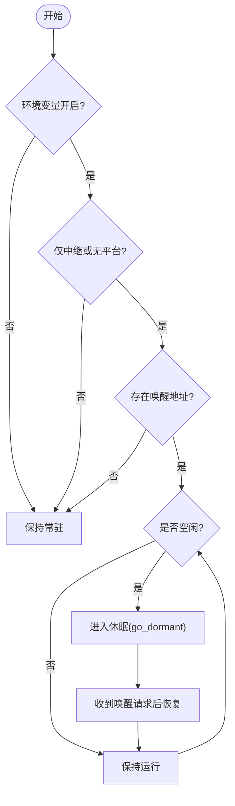
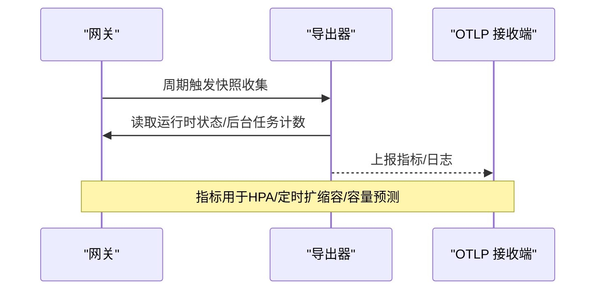
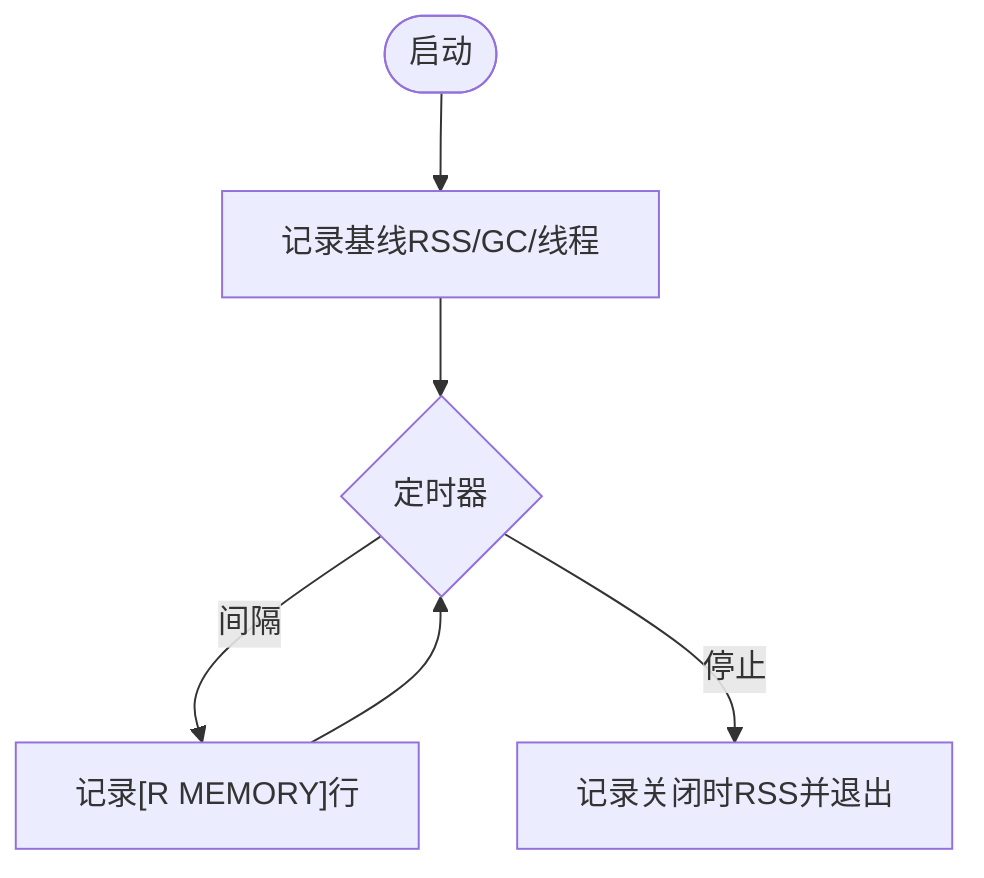
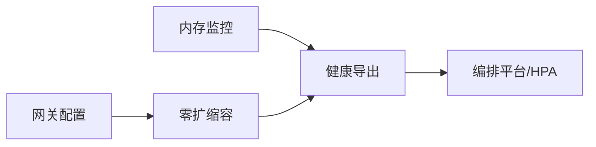

# 容量规划与扩展

<cite>
**本文引用的文件**
- [gateway/config.py](file://gateway/config.py)
- [gateway/scale_to_zero.py](file://gateway/scale_to_zero.py)
- [agent/monitoring/gateway_health_export.py](file://agent/monitoring/gateway_health_export.py)
- [gateway/memory_monitor.py](file://gateway/memory_monitor.py)
- [docker-compose.yml](file://docker-compose.yml)
</cite>

## 目录
1. [简介](#简介)
2. [项目结构](#项目结构)
3. [核心组件](#核心组件)
4. [架构总览](#架构总览)
5. [详细组件分析](#详细组件分析)
6. [依赖关系分析](#依赖关系分析)
7. [性能考量](#性能考量)
8. [故障排查指南](#故障排查指南)
9. [结论](#结论)
10. [附录](#附录)

## 简介
本指南面向生产环境的容量规划与扩展，围绕资源需求评估、性能基准测试、容量预测模型、水平/垂直扩展策略、弹性伸缩（基于指标与定时）、以及数据库扩展方案（读写分离、分库分表、缓存层）提供可操作的实践。结合仓库中的网关配置、零扩缩容能力、健康与监控导出、内存监控以及容器编排示例，给出从“观测—决策—执行”的闭环扩容流程与架构图。

## 项目结构
与容量和扩展直接相关的代码主要分布在以下模块：
- 网关配置与平台接入：gateway/config.py
- 零扩缩容（空闲休眠/唤醒）：gateway/scale_to_zero.py
- 健康与遥测导出（OTLP 指标/日志）：agent/monitoring/gateway_health_export.py
- 进程内存监控：gateway/memory_monitor.py
- 容器编排示例：docker-compose.yml

图表来源
- [gateway/config.py:1-800](file://gateway/config.py#L1-L800)
- [gateway/scale_to_zero.py:1-125](file://gateway/scale_to_zero.py#L1-L125)
- [agent/monitoring/gateway_health_export.py:1-644](file://agent/monitoring/gateway_health_export.py#L1-L644)
- [gateway/memory_monitor.py:1-231](file://gateway/memory_monitor.py#L1-L231)
- [docker-compose.yml:1-77](file://docker-compose.yml#L1-L77)

章节来源
- [gateway/config.py:1-800](file://gateway/config.py#L1-L800)
- [gateway/scale_to_zero.py:1-125](file://gateway/scale_to_zero.py#L1-L125)
- [agent/monitoring/gateway_health_export.py:1-644](file://agent/monitoring/gateway_health_export.py#L1-L644)
- [gateway/memory_monitor.py:1-231](file://gateway/memory_monitor.py#L1-L231)
- [docker-compose.yml:1-77](file://docker-compose.yml#L1-L77)

## 核心组件
- 网关配置中心：集中管理平台接入、会话重置策略、流式输出等，为容量规划提供可观测的配置基线。
- 零扩缩容：在仅使用中继或无消息平台时，根据空闲超时进入休眠，由外部唤醒，降低闲置成本。
- 健康与遥测导出：通过 OTLP 周期性上报网关状态、活跃代理数、后台任务、平台健康等指标，支撑自动扩缩容决策。
- 内存监控：定期记录 RSS/GC/线程数，辅助发现内存泄漏与容量瓶颈。
- 容器编排：提供最小化运行环境，便于横向复制与编排平台集成。

章节来源
- [gateway/config.py:1-800](file://gateway/config.py#L1-L800)
- [gateway/scale_to_zero.py:1-125](file://gateway/scale_to_zero.py#L1-L125)
- [agent/monitoring/gateway_health_export.py:1-644](file://agent/monitoring/gateway_health_export.py#L1-L644)
- [gateway/memory_monitor.py:1-231](file://gateway/memory_monitor.py#L1-L231)
- [docker-compose.yml:1-77](file://docker-compose.yml#L1-L77)

## 架构总览
下图展示“观测—决策—执行”的容量与扩展闭环：指标采集来自网关与子系统，决策层依据阈值触发水平/垂直/零扩缩容，执行层通过编排系统完成实例扩缩与流量切换。

图表来源
- [agent/monitoring/gateway_health_export.py:417-468](file://agent/monitoring/gateway_health_export.py#L417-L468)
- [gateway/memory_monitor.py:139-193](file://gateway/memory_monitor.py#L139-L193)
- [gateway/scale_to_zero.py:44-125](file://gateway/scale_to_zero.py#L44-L125)

## 详细组件分析

### 组件A：零扩缩容（Scale-to-Zero）
- 启用条件：环境变量开关 + 仅中继或无消息平台 + 已注册唤醒地址。
- 空闲判定：无进行中的代理轮次、无入站超过阈值、无后台工作。
- 行为：调用传输层的休眠接口关闭套接字但保留进程，由编排平台冻结/恢复。

图表来源
- [gateway/scale_to_zero.py:44-125](file://gateway/scale_to_zero.py#L44-L125)

章节来源
- [gateway/scale_to_zero.py:1-125](file://gateway/scale_to_zero.py#L1-L125)

### 组件B：健康与遥测导出（OTLP 指标/日志）
- 指标集合：up/state/active_agents/busy/drainable/restart_requested/background_work/background_delegations 等。
- 导出方式：周期性读取运行时快照，通过 OTLP HTTP 上报；支持诊断事件与日志流。
- 用途：作为自动扩缩容与容量预测的主要输入。

图表来源
- [agent/monitoring/gateway_health_export.py:417-468](file://agent/monitoring/gateway_health_export.py#L417-L468)
- [agent/monitoring/gateway_health_export.py:587-637](file://agent/monitoring/gateway_health_export.py#L587-L637)

章节来源
- [agent/monitoring/gateway_health_export.py:1-644](file://agent/monitoring/gateway_health_export.py#L1-L644)

### 组件C：内存监控
- 功能：每 N 分钟记录一次 RSS、GC 计数、线程数，启动与关闭时分别记录基线与终值。
- 价值：识别缓慢内存增长、线程泄漏，指导垂直扩容与堆参数调优。

图表来源
- [gateway/memory_monitor.py:139-193](file://gateway/memory_monitor.py#L139-L193)
- [gateway/memory_monitor.py:196-231](file://gateway/memory_monitor.py#L196-L231)

章节来源
- [gateway/memory_monitor.py:1-231](file://gateway/memory_monitor.py#L1-L231)

### 组件D：网关配置（容量相关）
- 关键项：平台接入、会话重置策略、流式输出模式与节流参数，影响并发与吞吐。
- 作用：为容量基准测试与压测场景提供稳定可复现的配置基线。

章节来源
- [gateway/config.py:1-800](file://gateway/config.py#L1-L800)

### 组件E：容器编排示例
- 说明：提供 gateway 与 dashboard 的最小运行集，便于横向复制与编排平台集成。
- 注意：默认绑定本地回环，暴露需配合反向代理与鉴权。

章节来源
- [docker-compose.yml:1-77](file://docker-compose.yml#L1-L77)

## 依赖关系分析
- 指标依赖：健康导出依赖运行时状态与后台任务计数，形成“采集—上报”链路。
- 控制依赖：零扩缩容依赖环境变量、平台拓扑与唤醒地址，避免在有长连接平台时误休眠。
- 运行依赖：内存监控独立于主业务，失败不阻塞网关生命周期。

图表来源
- [gateway/scale_to_zero.py:44-125](file://gateway/scale_to_zero.py#L44-L125)
- [agent/monitoring/gateway_health_export.py:417-468](file://agent/monitoring/gateway_health_export.py#L417-L468)
- [gateway/memory_monitor.py:139-193](file://gateway/memory_monitor.py#L139-L193)

## 性能考量
- 负载特征：关注 active_agents、busy、background_work、background_delegations 等指标，识别 CPU/IO/网络瓶颈。
- 流式输出：合理设置编辑间隔与缓冲阈值，避免下游平台限流。
- 内存：持续观察 RSS 趋势与 GC 频率，必要时调整堆大小或优化对象生命周期。
- 背压：在高并发下优先保障短路径响应，将后台任务与批处理隔离到独立队列/节点。

[本节为通用性能建议，无需特定文件引用]

## 故障排查指南
- 无法导出指标：检查 OTLP 端点与头信息、可选依赖安装情况；确认导出开关与端口可达性。
- 零扩缩容未生效：确认环境变量、平台拓扑（仅中继或无平台）、唤醒地址是否配置。
- 内存持续增长：对比基线与关闭时的 RSS，定位异常增长阶段；结合 GC 统计与线程数判断泄漏类型。
- 平台健康告警：查看 platform.up/degraded 指标，结合具体平台适配器日志定位问题。

章节来源
- [agent/monitoring/gateway_health_export.py:587-637](file://agent/monitoring/gateway_health_export.py#L587-L637)
- [gateway/scale_to_zero.py:44-125](file://gateway/scale_to_zero.py#L44-L125)
- [gateway/memory_monitor.py:139-193](file://gateway/memory_monitor.py#L139-L193)

## 结论
通过“指标采集—容量预测—自动/定时扩缩容—零扩缩容”的闭环，可在保证可用性的同时实现成本最优。建议以健康导出指标为核心，结合内存监控与网关配置，建立稳定的容量基线与自动化策略，并在编排平台层面实现快速弹性。

[本节为总结性内容，无需特定文件引用]

## 附录

### 容量规划策略
- 资源需求评估
  - 以 active_agents、busy、background_work 为基准，计算单实例 QPS/并发上限与资源占用（CPU/内存/IO）。
  - 通过压测获取 p95/p99 延迟与错误率，确定目标 SLA 下的实例规格与数量。
- 性能基准测试
  - 固定网关配置（流式输出、重试、压缩等），在不同硬件/容器规格下重复压测，绘制性能曲线。
  - 引入真实负载分布（峰值/谷值/突发），验证扩缩容触发时机与恢复时间。
- 容量预测模型
  - 基于历史指标序列（如 active_agents、busy）做趋势外推与季节性分解，预测未来窗口容量缺口。
  - 结合业务日历（活动/促销）与外部信号（渠道流量）修正预测，提前触发扩容。

[本节为方法论，无需特定文件引用]

### 水平扩展配置
- 负载均衡器
  - 入口统一经 LB 分发至多实例网关；健康检查基于 up/state 指标。
  - 会话亲和按需开启，避免跨实例状态不一致。
- 服务发现
  - 实例注册/注销由编排平台管理；LB 自动剔除不健康节点。
- 自动扩缩容（HPA）
  - 指标：active_agents、busy、background_work、p99 延迟、错误率。
  - 策略：目标利用率（如 CPU 70% 或 busy > 阈值），最小/最大副本数，冷却时间。
- 定时扩缩容
  - 针对已知波峰（如早高峰/活动）提前扩容，低谷期回落。

[本节为通用实践，无需特定文件引用]

### 垂直扩展策略
- 硬件升级
  - 按 CPU/内存/IO 瓶颈选择更高规格实例；关注网络带宽与磁盘 IOPS。
- 容器资源配置
  - 设置 requests/limits，确保调度与 QoS；预留一定冗余应对突发。
  - 调整 JVM/Python 堆大小与 GC 参数，减少停顿与抖动。

[本节为通用实践，无需特定文件引用]

### 弹性伸缩配置
- 基于指标的自动扩缩容
  - 指标来源：健康导出（active_agents、busy、background_work）、延迟与错误率。
  - 阈值与步长：渐进扩容，避免震荡；加入冷却与最小稳定时间。
- 定时扩缩容
  - 结合业务计划，预扩容与回收；与 HPA 共存时注意优先级与冲突消解。

[本节为通用实践，无需特定文件引用]

### 数据库扩展方案
- 读写分离
  - 写主读从，热点查询走只读副本；应用层路由与连接池隔离。
- 分库分表
  - 按租户/用户 ID 哈希分片；热点键打散；迁移与一致性策略（双写/回放）。
- 缓存层设计
  - 多级缓存（本地+分布式）；缓存失效与更新策略（TTL/写扩散/懒加载）。
  - 缓存穿透/雪崩防护（布隆过滤器、随机过期、限流降级）。

[本节为通用实践，无需特定文件引用]

### 扩容操作流程（SOP）
- 准备
  - 确认当前容量水位与预测缺口；制定扩容目标与回滚策略。
- 执行
  - 通过编排平台增加实例；等待健康检查通过；逐步放量。
- 验证
  - 观察 active_agents、busy、延迟与错误率；确认业务指标达标。
- 收尾
  - 若异常立即回滚；若成功则更新容量基线与预测模型。

[本节为流程说明，无需特定文件引用]