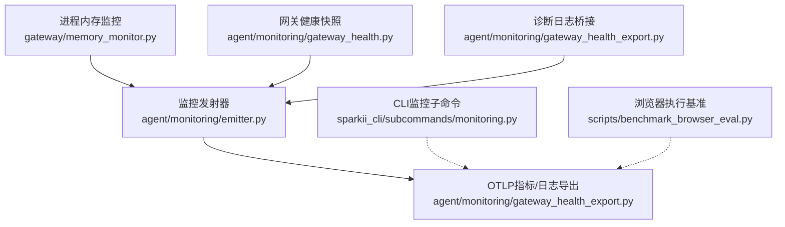
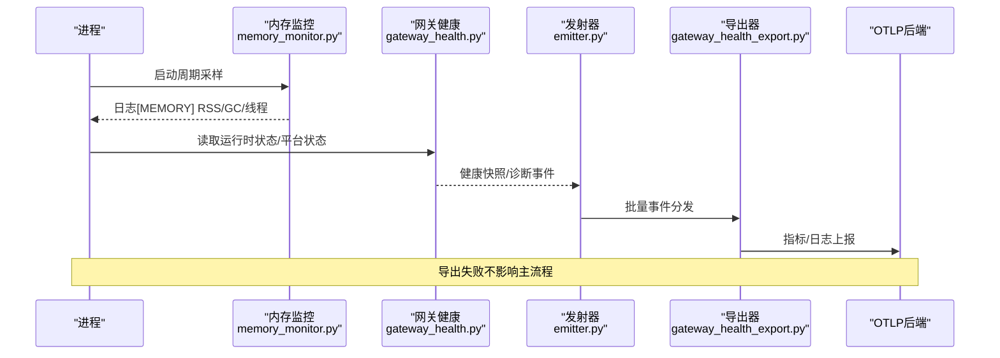
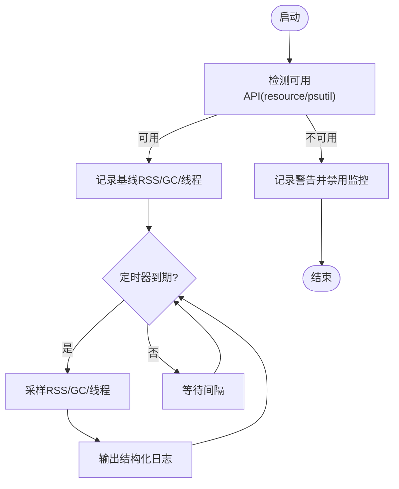
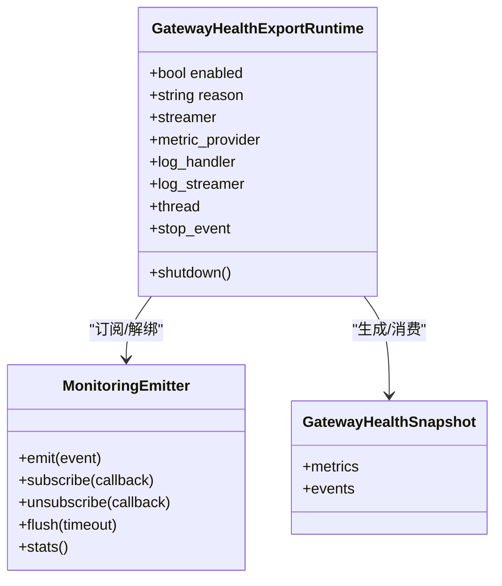
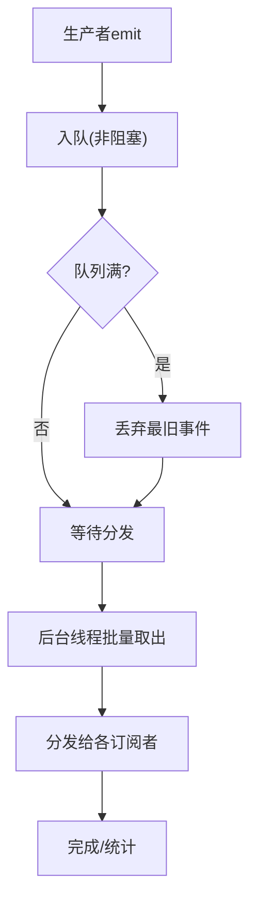
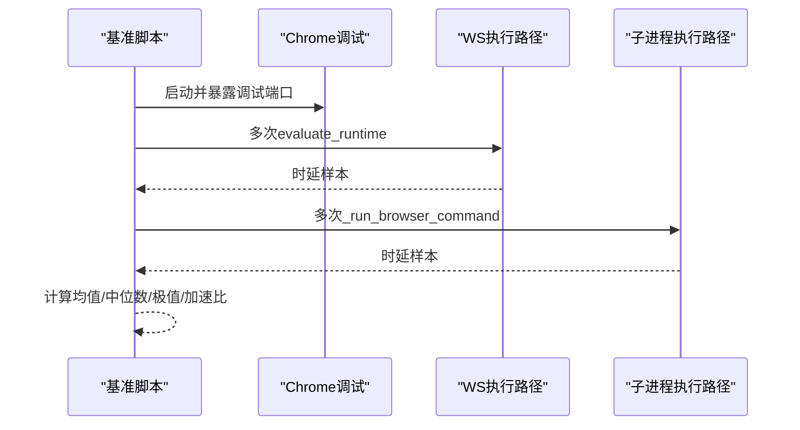
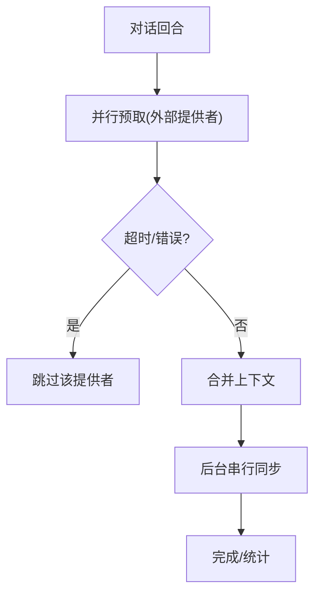
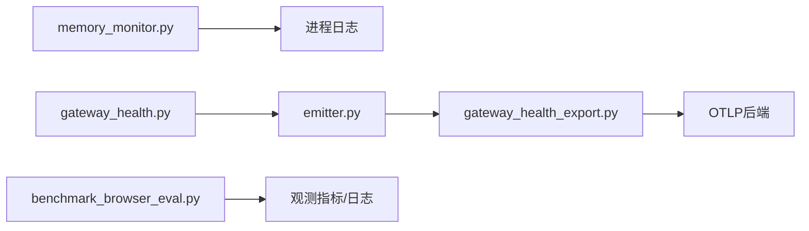

# 资源需求评估

<cite>
**本文引用的文件**
- [gateway/memory_monitor.py](file://gateway/memory_monitor.py)
- [agent/monitoring/gateway_health_export.py](file://agent/monitoring/gateway_health_export.py)
- [agent/monitoring/emitter.py](file://agent/monitoring/emitter.py)
- [agent/monitoring/gateway_health.py](file://agent/monitoring/gateway_health.py)
- [sparkii_cli/subcommands/monitoring.py](file://sparkii_cli/subcommands/monitoring.py)
- [scripts/benchmark_browser_eval.py](file://scripts/benchmark_browser_eval.py)
- [agent/memory_manager.py](file://agent/memory_manager.py)
</cite>

## 目录
1. [简介](#简介)
2. [项目结构](#项目结构)
3. [核心组件](#核心组件)
4. [架构总览](#架构总览)
5. [详细组件分析](#详细组件分析)
6. [依赖关系分析](#依赖关系分析)
7. [性能考量](#性能考量)
8. [故障排查指南](#故障排查指南)
9. [结论](#结论)
10. [附录](#附录)

## 简介
本指南面向运维与SRE团队，提供AI代理系统的资源需求评估方法。内容涵盖CPU、内存、存储与网络带宽的基准测试方法；不同负载场景（并发对话数、工具调用频率、记忆存储增长）下的资源消耗模型；性能监控指标定义与阈值建议；容量规划工具使用与自定义监控脚本开发；以及资源使用趋势分析与扩容预测实践。文档基于代码库中的网关健康导出、内存监控、监控发射器、浏览器执行基准等实现进行说明，确保可落地、可观测、可演进。

## 项目结构
系统围绕“采集—聚合—导出”的监控链路组织：
- 采集层：进程级内存采样、网关健康快照、诊断日志桥接、后台任务计数等。
- 聚合层：事件队列与分发器，保证热路径不阻塞、失败隔离。
- 导出层：OTLP指标与日志流式导出，支持配置化开关与端点。

图表来源
- [gateway/memory_monitor.py:1-231](file://gateway/memory_monitor.py#L1-L231)
- [agent/monitoring/gateway_health.py:1-470](file://agent/monitoring/gateway_health.py#L1-L470)
- [agent/monitoring/emitter.py:1-212](file://agent/monitoring/emitter.py#L1-L212)
- [agent/monitoring/gateway_health_export.py:1-644](file://agent/monitoring/gateway_health_export.py#L1-L644)
- [sparkii_cli/subcommands/monitoring.py:1-37](file://sparkii_cli/subcommands/monitoring.py#L1-L37)
- [scripts/benchmark_browser_eval.py:1-139](file://scripts/benchmark_browser_eval.py#L1-L139)

章节来源
- [gateway/memory_monitor.py:1-231](file://gateway/memory_monitor.py#L1-L231)
- [agent/monitoring/gateway_health_export.py:1-644](file://agent/monitoring/gateway_health_export.py#L1-L644)
- [agent/monitoring/emitter.py:1-212](file://agent/monitoring/emitter.py#L1-L212)
- [agent/monitoring/gateway_health.py:1-470](file://agent/monitoring/gateway_health.py#L1-L470)
- [sparkii_cli/subcommands/monitoring.py:1-37](file://sparkii_cli/subcommands/monitoring.py#L1-L37)
- [scripts/benchmark_browser_eval.py:1-139](file://scripts/benchmark_browser_eval.py#L1-L139)

## 核心组件
- 进程内存监控：周期性记录RSS、GC计数、线程数，用于发现慢泄漏与基线对比。
- 网关健康导出：将服务健康、平台状态、后台工作计数等指标以OTLP方式导出，并附带诊断日志。
- 监控发射器：无阻塞的事件队列+后台分发，保障热路径零开销与失败隔离。
- CLI监控子命令：查看当前监控启用状态、导出目标与脱敏策略。
- 浏览器执行基准：对比WS与子进程两种执行路径的时延分布，辅助评估CPU/IO瓶颈。
- 记忆管理：控制外部记忆提供者预取与同步，影响CPU与I/O占用，需纳入容量模型。

章节来源
- [gateway/memory_monitor.py:1-231](file://gateway/memory_monitor.py#L1-L231)
- [agent/monitoring/gateway_health_export.py:1-644](file://agent/monitoring/gateway_health_export.py#L1-L644)
- [agent/monitoring/emitter.py:1-212](file://agent/monitoring/emitter.py#L1-L212)
- [sparkii_cli/subcommands/monitoring.py:1-37](file://sparkii_cli/subcommands/monitoring.py#L1-L37)
- [scripts/benchmark_browser_eval.py:1-139](file://scripts/benchmark_browser_eval.py#L1-L139)
- [agent/memory_manager.py:1-800](file://agent/memory_manager.py#L1-L800)

## 架构总览
下图展示从采集到导出的端到端流程，以及与CLI和基准工具的集成点。

图表来源
- [gateway/memory_monitor.py:1-231](file://gateway/memory_monitor.py#L1-L231)
- [agent/monitoring/gateway_health.py:1-470](file://agent/monitoring/gateway_health.py#L1-L470)
- [agent/monitoring/emitter.py:1-212](file://agent/monitoring/emitter.py#L1-L212)
- [agent/monitoring/gateway_health_export.py:1-644](file://agent/monitoring/gateway_health_export.py#L1-L644)

## 详细组件分析

### 进程内存监控（RSS/GC/线程）
- 功能要点
  - 每N分钟输出单行结构化日志，便于grep时间序列。
  - 优先使用标准库resource，回退psutil；不可用时告警并跳过。
  - 启动时记录基线，关闭前记录最终快照，便于定位泄漏。
- 关键指标
  - RSS（MB）、GC计数（gen0/gen1/gen2）、活跃线程数、运行时长。
- 适用场景
  - 长期运行的网关进程，缓存会话、工具schema、MCP连接等导致的缓慢内存增长。

图表来源
- [gateway/memory_monitor.py:1-231](file://gateway/memory_monitor.py#L1-L231)

章节来源
- [gateway/memory_monitor.py:1-231](file://gateway/memory_monitor.py#L1-L231)

### 网关健康与诊断导出（OTLP）
- 功能要点
  - 收集网关与平台状态、后台工作计数、定时任务心跳等指标。
  - 通过OTLP HTTP导出指标与日志，支持配置开关、端点与请求头。
  - 对资源属性与诊断字段做白名单与脱敏，避免泄露敏感信息。
- 关键指标
  - 网关是否存活、活跃代理数、忙碌/可排空标志、重启请求标志。
  - 平台上下线与健康降级计数、定时任务调度健康度。
  - 后台工作总量与异步委派槽位占用。
- 导出策略
  - 指标按固定周期拉取，日志事件按批发送；关闭时有序flush与超时保护。

图表来源
- [agent/monitoring/gateway_health_export.py:1-644](file://agent/monitoring/gateway_health_export.py#L1-L644)
- [agent/monitoring/emitter.py:1-212](file://agent/monitoring/emitter.py#L1-L212)
- [agent/monitoring/gateway_health.py:1-470](file://agent/monitoring/gateway_health.py#L1-L470)

章节来源
- [agent/monitoring/gateway_health_export.py:1-644](file://agent/monitoring/gateway_health_export.py#L1-L644)
- [agent/monitoring/gateway_health.py:1-470](file://agent/monitoring/gateway_health.py#L1-L470)
- [agent/monitoring/emitter.py:1-212](file://agent/monitoring/emitter.py#L1-L212)

### 监控发射器（无阻塞事件总线）
- 设计原则
  - emit必须O(微秒)返回，绝不阻塞磁盘/网络，绝不上抛异常。
  - 满队时丢弃最旧事件，保持最新优先；统计丢弃与分发计数。
  - 后台线程批量分发至各订阅者，单个订阅者失败不影响其他。
- 容量与吞吐
  - 环形队列深度与批次大小决定峰值缓冲与网络合并效率。
  - 适合高吞吐、低延迟的监控数据汇聚。

图表来源
- [agent/monitoring/emitter.py:1-212](file://agent/monitoring/emitter.py#L1-L212)

章节来源
- [agent/monitoring/emitter.py:1-212](file://agent/monitoring/emitter.py#L1-L212)

### 浏览器执行基准（CPU/IO/网络）
- 用途
  - 对比WebSocket路径与子进程路径的执行时延，识别瓶颈与优化方向。
- 指标
  - 均值、中位数、最小/最大时延；速度比（WS vs 子进程）。
- 建议
  - 在压测环境中固定Chrome实例与调试端口，多次迭代获取稳定分布。

图表来源
- [scripts/benchmark_browser_eval.py:1-139](file://scripts/benchmark_browser_eval.py#L1-L139)

章节来源
- [scripts/benchmark_browser_eval.py:1-139](file://scripts/benchmark_browser_eval.py#L1-L139)

### 记忆管理（CPU/IO/存储）
- 作用
  - 统一编排内置与外部记忆提供者，控制预取与同步，注入工具Schema。
- 资源影响
  - 外部提供者预取可能触发网络/磁盘IO；同步写入串行化避免竞争。
  - 长时间阻塞或网络抖动会放大CPU等待与内存驻留。
- 容量建模
  - 预取超时、后台执行器单工作线程、关闭时drain超时等参数直接影响吞吐与延迟。

图表来源
- [agent/memory_manager.py:1-800](file://agent/memory_manager.py#L1-L800)

章节来源
- [agent/memory_manager.py:1-800](file://agent/memory_manager.py#L1-L800)

## 依赖关系分析
- 模块耦合
  - 内存监控独立于导出链路，仅通过日志输出被运维观察。
  - 网关健康快照依赖运行时状态与平台状态，经发射器统一导出。
  - 导出器依赖OTLP SDK与配置，具备优雅降级与超时关闭。
- 外部依赖
  - resource/psutil用于RSS读取；OpenTelemetry用于指标/日志导出。
  - 浏览器基准依赖本地Chrome与调试协议。

图表来源
- [gateway/memory_monitor.py:1-231](file://gateway/memory_monitor.py#L1-L231)
- [agent/monitoring/gateway_health.py:1-470](file://agent/monitoring/gateway_health.py#L1-L470)
- [agent/monitoring/emitter.py:1-212](file://agent/monitoring/emitter.py#L1-L212)
- [agent/monitoring/gateway_health_export.py:1-644](file://agent/monitoring/gateway_health_export.py#L1-L644)
- [scripts/benchmark_browser_eval.py:1-139](file://scripts/benchmark_browser_eval.py#L1-L139)

章节来源
- [gateway/memory_monitor.py:1-231](file://gateway/memory_monitor.py#L1-L231)
- [agent/monitoring/gateway_health.py:1-470](file://agent/monitoring/gateway_health.py#L1-L470)
- [agent/monitoring/emitter.py:1-212](file://agent/monitoring/emitter.py#L1-L212)
- [agent/monitoring/gateway_health_export.py:1-644](file://agent/monitoring/gateway_health_export.py#L1-L644)
- [scripts/benchmark_browser_eval.py:1-139](file://scripts/benchmark_browser_eval.py#L1-L139)

## 性能考量
- CPU
  - 高频工具调用与外部记忆提供者预取会增加CPU占用；建议通过并发对话数与工具调用频率建立线性/分段模型，结合基准结果校准。
  - 浏览器执行路径选择应基于实测时延分布，WS路径通常更优但需考虑连接复用与资源占用。
- 内存
  - 关注RSS随时间的单调增长；结合GC计数与线程数判断是否为对象泄漏或句柄未释放。
  - 长驻进程的基线与关闭前快照是关键参考点。
- 存储
  - 记忆存储增长与对话长度正相关；需评估索引体积、向量存储与压缩策略。
- 网络
  - 工具调用与外部API调用构成主要出站流量；导出链路采用批量与超时控制，避免雪崩。
- 阈值建议（示例，需按环境校准）
  - 响应时间：P95 < 2s（短文本），P95 < 10s（含工具调用）。
  - 吞吐量：根据并发对话数与工具调用频率设定目标QPS。
  - 错误率：整体错误率 < 1%，认证/限流/超时类错误单独告警。
  - 资源利用率：CPU < 75%（峰值不超过90%），内存RSS增长率 < 1%/小时，磁盘使用率 < 80%。

## 故障排查指南
- 内存监控不可用
  - 现象：日志提示无法读取RSS，监控自动禁用。
  - 处理：确认系统权限与依赖；必要时安装psutil或调整部署环境。
- 导出链路失败
  - 现象：OTLP SDK不可用或网络错误导致指标/日志未上报。
  - 处理：检查配置端点、请求头与环境变量；确认网络连通性与鉴权。
- 后台任务堆积
  - 现象：后台工作计数持续升高，可能导致延迟上升。
  - 处理：排查外部依赖阻塞、超时设置与重试策略；必要时扩容或限流。
- 浏览器执行异常
  - 现象：WS或子进程路径时延飙升或失败。
  - 处理：检查Chrome实例健康、调试端口占用与权限；降低并发或增加实例。

章节来源
- [gateway/memory_monitor.py:1-231](file://gateway/memory_monitor.py#L1-L231)
- [agent/monitoring/gateway_health_export.py:1-644](file://agent/monitoring/gateway_health_export.py#L1-L644)
- [agent/monitoring/gateway_health.py:1-470](file://agent/monitoring/gateway_health.py#L1-L470)
- [scripts/benchmark_browser_eval.py:1-139](file://scripts/benchmark_browser_eval.py#L1-L139)

## 结论
通过进程级内存监控、网关健康导出与无阻塞发射器，系统提供了稳定的资源观测能力。结合浏览器执行基准与记忆管理行为，可构建覆盖CPU/内存/存储/网络的容量模型。建议以“基线—压测—阈值—预测”的闭环推进容量规划，提前识别扩容需求，保障服务稳定性与用户体验。

## 附录

### 基准测试方法
- CPU
  - 使用浏览器执行基准脚本，分别测量WS与子进程路径的时延分布；在不同并发下重复实验，拟合CPU占用与时延曲线。
- 内存
  - 启动内存监控，记录基线RSS；在压测期间观察RSS增长斜率与GC活动；关闭时记录最终快照。
- 存储
  - 监控记忆存储增长速率；评估压缩与清理策略对空间占用的影响。
- 网络
  - 统计工具调用与外部API调用的成功率与延迟；监控导出链路的吞吐与丢包情况。

### 负载场景与资源消耗模型
- 并发对话数
  - 假设每个对话平均占用CPU x、内存 y、网络 z；总资源≈并发×单位占用×安全系数。
- 工具调用频率
  - 高频调用会放大CPU与网络压力；引入阶梯函数描述不同区间的资源增长。
- 记忆存储增长
  - 存储增长与对话长度与频率相关；需结合压缩与索引策略评估空间需求。

### 性能监控指标定义与阈值
- 响应时间：P50/P90/P95/P99，区分纯文本与工具调用场景。
- 吞吐量：每秒对话数、每秒工具调用数。
- 错误率：总体错误率与分类错误率（认证、限流、超时、网络）。
- 资源利用率：CPU、内存RSS、磁盘使用率、网络带宽。
- 阈值建议：见“性能考量”小节，需按实际环境校准。

### 容量规划工具与自定义监控脚本
- 使用现有工具
  - CLI监控子命令：查看导出状态、端点与脱敏策略。
  - 浏览器基准脚本：评估执行路径性能差异。
- 自定义脚本
  - 采集RSS/GC/线程：复用内存监控逻辑，输出时间序列。
  - 拉取网关健康指标：订阅发射器或直接查询导出端点。
  - 趋势分析与预测：基于历史数据拟合线性/指数增长，设置预警阈值。

章节来源
- [sparkii_cli/subcommands/monitoring.py:1-37](file://sparkii_cli/subcommands/monitoring.py#L1-L37)
- [scripts/benchmark_browser_eval.py:1-139](file://scripts/benchmark_browser_eval.py#L1-L139)
- [gateway/memory_monitor.py:1-231](file://gateway/memory_monitor.py#L1-L231)
- [agent/monitoring/gateway_health_export.py:1-644](file://agent/monitoring/gateway_health_export.py#L1-L644)