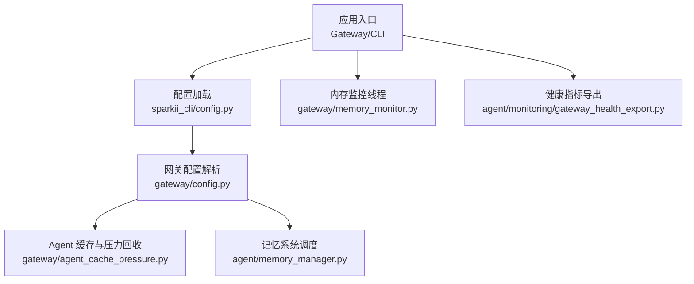
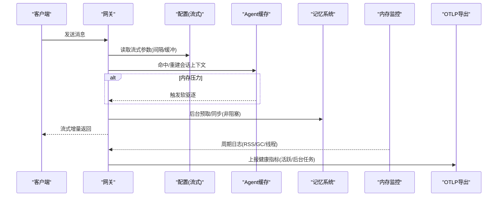
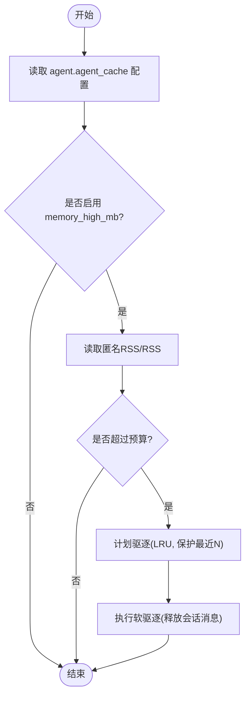
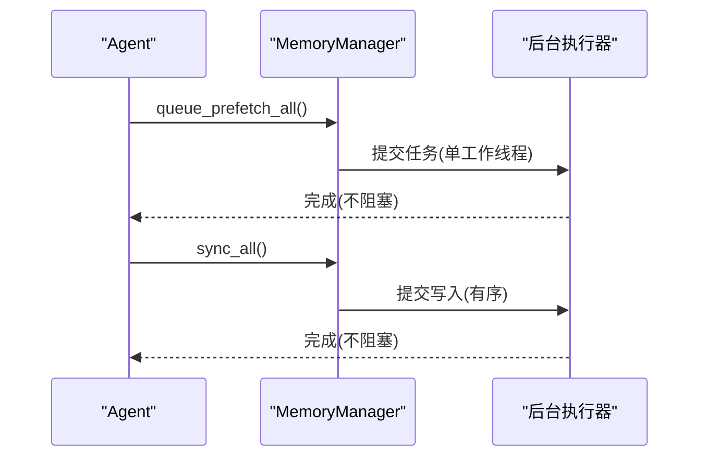
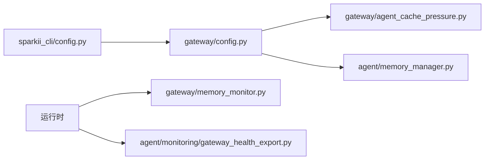

# 性能调优配置

<cite>
**本文引用的文件**
- [gateway/config.py](file://gateway/config.py)
- [agent/memory_manager.py](file://agent/memory_manager.py)
- [gateway/memory_monitor.py](file://gateway/memory_monitor.py)
- [sparkii_cli/config.py](file://sparkii_cli/config.py)
- [agent/monitoring/gateway_health_export.py](file://agent/monitoring/gateway_health_export.py)
- [gateway/agent_cache_pressure.py](file://gateway/agent_cache_pressure.py)
</cite>

## 目录
1. [简介](#简介)
2. [项目结构](#项目结构)
3. [核心组件](#核心组件)
4. [架构总览](#架构总览)
5. [详细组件分析](#详细组件分析)
6. [依赖关系分析](#依赖关系分析)
7. [性能考量与基准建议](#性能考量与基准建议)
8. [故障排查指南](#故障排查指南)
9. [结论](#结论)
10. [附录：配置示例清单](#附录配置示例清单)

## 简介
本指南面向生产环境的性能调优，覆盖数据库连接池、内存管理、并发处理、缓存策略（Redis/本地/分布式）、查询优化、GC 与 CPU 优化、以及关键指标监控（响应时间、吞吐量、资源利用率）。文档基于仓库中网关、CLI 配置、内存管理与可观测性模块的实际实现，提供可落地的配置项与流程建议，并给出基准测试方法。

## 项目结构
与性能调优直接相关的代码集中在以下模块：
- 网关配置与流式输出控制：gateway/config.py
- 会话级 Agent 缓存与内存压力回收：gateway/agent_cache_pressure.py
- 进程内存使用监控与 GC 统计：gateway/memory_monitor.py
- CLI 配置加载与默认值、安全与路径：sparkii_cli/config.py
- 记忆系统后台同步与预取：agent/memory_manager.py
- 健康指标与诊断事件 OTLP 导出：agent/monitoring/gateway_health_export.py

**图表来源**
- [gateway/config.py:710-800](file://gateway/config.py#L710-L800)
- [gateway/agent_cache_pressure.py:185-224](file://gateway/agent_cache_pressure.py#L185-L224)
- [agent/memory_manager.py:364-400](file://agent/memory_manager.py#L364-L400)
- [gateway/memory_monitor.py:139-193](file://gateway/memory_monitor.py#L139-L193)
- [agent/monitoring/gateway_health_export.py:587-637](file://agent/monitoring/gateway_health_export.py#L587-L637)

**章节来源**
- [gateway/config.py:710-800](file://gateway/config.py#L710-L800)
- [gateway/agent_cache_pressure.py:185-224](file://gateway/agent_cache_pressure.py#L185-L224)
- [agent/memory_manager.py:364-400](file://agent/memory_manager.py#L364-L400)
- [gateway/memory_monitor.py:139-193](file://gateway/memory_monitor.py#L139-L193)
- [agent/monitoring/gateway_health_export.py:587-637](file://agent/monitoring/gateway_health_export.py#L587-L637)

## 核心组件
- 网关配置与流式输出：控制消息平台流式编辑间隔、缓冲阈值、最终消息替换等，直接影响端到端延迟与用户体验。
- Agent 缓存与内存压力：按 cgroup/系统内存预算自动驱逐冷会话，避免 OOM 与 swap 抖动。
- 进程内存监控：周期性记录 RSS、GC 计数、线程数，便于发现泄漏与容量规划。
- 记忆系统后台任务：将同步/预取工作放入单工作线程队列，避免阻塞主循环，保障吞吐与稳定性。
- 健康指标导出：通过 OTLP 上报网关状态、活跃代理、后台任务、定时任务等指标，支撑 SLO 与告警。

**章节来源**
- [gateway/config.py:710-800](file://gateway/config.py#L710-L800)
- [gateway/agent_cache_pressure.py:185-224](file://gateway/agent_cache_pressure.py#L185-L224)
- [agent/memory_manager.py:638-694](file://agent/memory_manager.py#L638-L694)
- [gateway/memory_monitor.py:83-126](file://gateway/memory_monitor.py#L83-L126)
- [agent/monitoring/gateway_health_export.py:417-468](file://agent/monitoring/gateway_health_export.py#L417-L468)

## 架构总览
下图展示从请求到响应过程中与性能相关的关键路径：配置驱动流式输出、Agent 缓存受内存压力保护、记忆系统后台化、内存监控与健康指标上报。

**图表来源**
- [gateway/config.py:710-800](file://gateway/config.py#L710-L800)
- [gateway/agent_cache_pressure.py:278-311](file://gateway/agent_cache_pressure.py#L278-L311)
- [agent/memory_manager.py:597-623](file://agent/memory_manager.py#L597-L623)
- [gateway/memory_monitor.py:139-193](file://gateway/memory_monitor.py#L139-L193)
- [agent/monitoring/gateway_health_export.py:417-468](file://agent/monitoring/gateway_health_export.py#L417-L468)

## 详细组件分析

### 数据库连接池配置与调优
说明：仓库未包含内置数据库连接池实现。若使用外部数据库（如 SQLite/PostgreSQL），请遵循以下通用实践并结合业务负载调整：
- 连接池大小：根据并发请求数与模型调用耗时估算；写多读少场景适当增大，避免锁竞争。
- 超时与重试：设置合理的获取连接超时、语句超时与退避重试，降低尾部延迟。
- WAL/检查点：对高写入负载启用 WAL，合理设置检查点频率，减少 I/O 抖动。
- 索引设计：为高频过滤/排序字段建立复合索引，避免全表扫描；定期分析慢查询。
- 连接复用：确保连接在请求结束后归还，避免连接泄漏导致池耗尽。
- 监控：跟踪连接池使用率、等待时间、超时次数，结合 P95/P99 延迟定位瓶颈。

[本节为通用指导，不直接引用具体文件]

### 内存管理策略
- 会话级 Agent 缓存与压力回收：
  - 通过 cgroup/系统内存预算计算“内存高位”阈值，超过阈值时按 LRU 顺序驱逐冷会话，保护最近访问的热点会话。
  - 支持限制每次驱逐数量与保护最近 N 个会话，避免误伤热数据。
- 进程内存监控：
  - 周期性记录 RSS、GC 计数、线程数，便于发现泄漏与容量规划。
  - 启动时记录基线，关闭时记录终值，便于对比分析。

**图表来源**
- [gateway/agent_cache_pressure.py:185-224](file://gateway/agent_cache_pressure.py#L185-L224)
- [gateway/agent_cache_pressure.py:278-311](file://gateway/agent_cache_pressure.py#L278-L311)
- [gateway/agent_cache_pressure.py:227-254](file://gateway/agent_cache_pressure.py#L227-L254)

**章节来源**
- [gateway/agent_cache_pressure.py:185-224](file://gateway/agent_cache_pressure.py#L185-L224)
- [gateway/agent_cache_pressure.py:278-311](file://gateway/agent_cache_pressure.py#L278-L311)
- [gateway/memory_monitor.py:83-126](file://gateway/memory_monitor.py#L83-L126)

### 并发处理优化
- 记忆系统后台化：
  - 将 sync/prefetch 任务提交到单工作线程队列，保证写入有序且不阻塞主循环。
  - 外部 provider 预取带超时保护，避免卡死影响响应。
- 流式输出节流：
  - 通过编辑间隔与缓冲阈值控制消息平台更新频率，平衡延迟与速率限制。

**图表来源**
- [agent/memory_manager.py:597-623](file://agent/memory_manager.py#L597-L623)
- [agent/memory_manager.py:638-694](file://agent/memory_manager.py#L638-L694)
- [agent/memory_manager.py:698-757](file://agent/memory_manager.py#L698-L757)

**章节来源**
- [agent/memory_manager.py:597-623](file://agent/memory_manager.py#L597-L623)
- [agent/memory_manager.py:638-694](file://agent/memory_manager.py#L638-L694)
- [agent/memory_manager.py:698-757](file://agent/memory_manager.py#L698-L757)

### 缓存策略配置
- 本地缓存（会话级）：
  - 每个会话缓存一个 Agent 实例，重用提示前缀，减少重复构建成本。
  - 通过内存压力策略在高峰期主动驱逐冷会话，避免内存膨胀。
- Redis/分布式缓存：
  - 适用于跨进程/跨节点共享的热点数据（如工具定义、模型元数据、用户偏好）。
  - 建议设置过期策略、连接池、序列化开销控制与降级回退。
- 本地缓存（进程内）：
  - 针对短生命周期、低冲突的数据可使用 dict/set 缓存，注意容量上限与淘汰策略。

[本节为通用指导，不直接引用具体文件]

### 数据库查询优化建议
- 索引设计：为高频条件列建立合适索引，避免选择性差的宽泛索引。
- 查询语句优化：避免 SELECT *，只取必要字段；合理使用 JOIN 与子查询；分页查询使用游标或键集分页。
- 连接池调优：根据 QPS 与平均延迟调整池大小；监控等待时间与超时。
- 慢查询治理：开启慢查询日志，定期分析并优化。

[本节为通用指导，不直接引用具体文件]

### 内存泄漏检测与 GC 参数优化
- 内存泄漏检测：
  - 利用周期性内存监控日志（RSS、GC 计数、线程数）观察趋势，定位异常增长。
  - 结合压测与长稳运行，观察峰值与稳定态差异。
- GC 参数优化：
  - 根据堆大小与延迟目标调整分代阈值与收集频率；在高吞吐场景关注 STW 时长。
  - 配合对象生命周期管理，减少大对象频繁创建与临时引用堆积。

**章节来源**
- [gateway/memory_monitor.py:83-126](file://gateway/memory_monitor.py#L83-L126)
- [gateway/memory_monitor.py:139-193](file://gateway/memory_monitor.py#L139-L193)

### CPU 使用率优化策略
- 减少阻塞调用：将耗时 IO 外置到后台任务，避免阻塞事件循环。
- 批处理与合并：合并小请求，降低系统调用与网络往返。
- 算法复杂度：优先选择线性或近似线性算法，避免嵌套循环。
- 并行度控制：根据 CPU 核数与任务类型设置并发上限，避免上下文切换开销过大。

[本节为通用指导，不直接引用具体文件]

## 依赖关系分析
- 配置层：CLI 配置加载与默认值、安全与路径管理，为网关与子系统提供统一配置源。
- 运行时层：网关根据配置驱动流式输出、Agent 缓存与压力回收；记忆系统后台化提升吞吐。
- 可观测层：内存监控与健康指标导出提供运行时洞察，支撑容量与性能调优。

**图表来源**
- [sparkii_cli/config.py:235-260](file://sparkii_cli/config.py#L235-L260)
- [gateway/config.py:710-800](file://gateway/config.py#L710-L800)
- [gateway/agent_cache_pressure.py:185-224](file://gateway/agent_cache_pressure.py#L185-L224)
- [agent/memory_manager.py:638-694](file://agent/memory_manager.py#L638-L694)
- [gateway/memory_monitor.py:139-193](file://gateway/memory_monitor.py#L139-L193)
- [agent/monitoring/gateway_health_export.py:587-637](file://agent/monitoring/gateway_health_export.py#L587-L637)

**章节来源**
- [sparkii_cli/config.py:235-260](file://sparkii_cli/config.py#L235-L260)
- [gateway/config.py:710-800](file://gateway/config.py#L710-L800)
- [gateway/agent_cache_pressure.py:185-224](file://gateway/agent_cache_pressure.py#L185-L224)
- [agent/memory_manager.py:638-694](file://agent/memory_manager.py#L638-L694)
- [gateway/memory_monitor.py:139-193](file://gateway/memory_monitor.py#L139-L193)
- [agent/monitoring/gateway_health_export.py:587-637](file://agent/monitoring/gateway_health_export.py#L587-L637)

## 性能考量与基准建议
- 关键指标
  - 响应时间：P50/P95/P99 延迟，区分首字节与完整响应。
  - 吞吐量：QPS、RPS、并发会话数。
  - 资源利用率：CPU、内存（RSS/匿名页）、磁盘 I/O、网络带宽。
  - 错误率：超时、失败、重试比例。
- 基准测试方法
  - 使用压测工具模拟不同并发与负载模式，逐步增加负载至瓶颈。
  - 记录各阶段指标，绘制趋势图，识别拐点。
  - 对比不同配置下的指标变化，验证调优效果。
- 调优建议
  - 流式输出：调整编辑间隔与缓冲阈值，平衡延迟与平台限流。
  - 缓存策略：评估命中率与淘汰策略，避免冷数据占用过多内存。
  - 后台任务：确保超时与隔离，防止拖垮主循环。
  - 监控与告警：基于 OTLP 指标建立 SLO 与告警规则。

[本节为通用指导，不直接引用具体文件]

## 故障排查指南
- 内存泄漏
  - 观察周期性内存监控日志，关注 RSS 持续上升与 GC 计数异常。
  - 结合会话活跃度与缓存大小，定位异常会话或 Provider。
- 响应延迟升高
  - 检查流式输出参数是否过保守或过于激进。
  - 查看后台任务队列是否积压，确认超时与隔离机制生效。
- 健康指标异常
  - 检查 OTLP 导出配置与网络连通性。
  - 关注活跃代理、后台任务、定时任务心跳等指标。

**章节来源**
- [gateway/memory_monitor.py:83-126](file://gateway/memory_monitor.py#L83-L126)
- [agent/memory_manager.py:597-623](file://agent/memory_manager.py#L597-L623)
- [agent/monitoring/gateway_health_export.py:587-637](file://agent/monitoring/gateway_health_export.py#L587-L637)

## 结论
通过配置驱动的流式输出、会话级缓存与内存压力回收、后台化的记忆系统任务、以及完善的内存监控与健康指标导出，系统能够在高并发与长会话场景下保持稳定与低延迟。建议结合压测与监控持续迭代调优，确保满足 SLO。

[本节为总结，不直接引用具体文件]

## 附录：配置示例清单
以下为与性能调优相关的配置项位置与用途说明（以路径形式给出，便于查阅）：
- 流式输出参数（编辑间隔、缓冲阈值、最终消息替换）：gateway/config.py
- Agent 缓存与内存压力（max_size、idle_ttl_secs、memory_high_mb、max_evictions_per_pass、protect_recent）：gateway/agent_cache_pressure.py
- 进程内存监控（interval_seconds、日志格式）：gateway/memory_monitor.py
- 配置加载与默认值（含安全与环境变量处理）：sparkii_cli/config.py
- 健康指标导出（metrics_enabled、diagnostic_events_enabled、export_interval_seconds、endpoint）：agent/monitoring/gateway_health_export.py

**章节来源**
- [gateway/config.py:710-800](file://gateway/config.py#L710-L800)
- [gateway/agent_cache_pressure.py:185-224](file://gateway/agent_cache_pressure.py#L185-L224)
- [gateway/memory_monitor.py:139-193](file://gateway/memory_monitor.py#L139-L193)
- [sparkii_cli/config.py:235-260](file://sparkii_cli/config.py#L235-L260)
- [agent/monitoring/gateway_health_export.py:587-637](file://agent/monitoring/gateway_health_export.py#L587-L637)