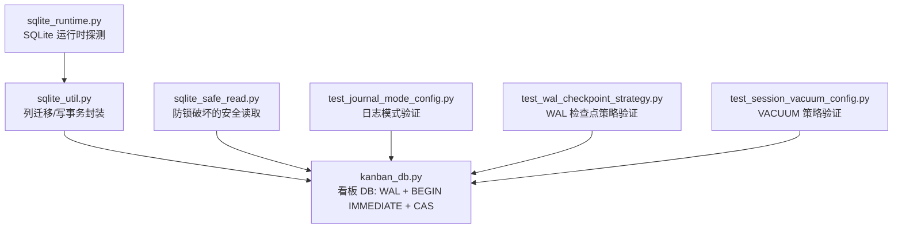
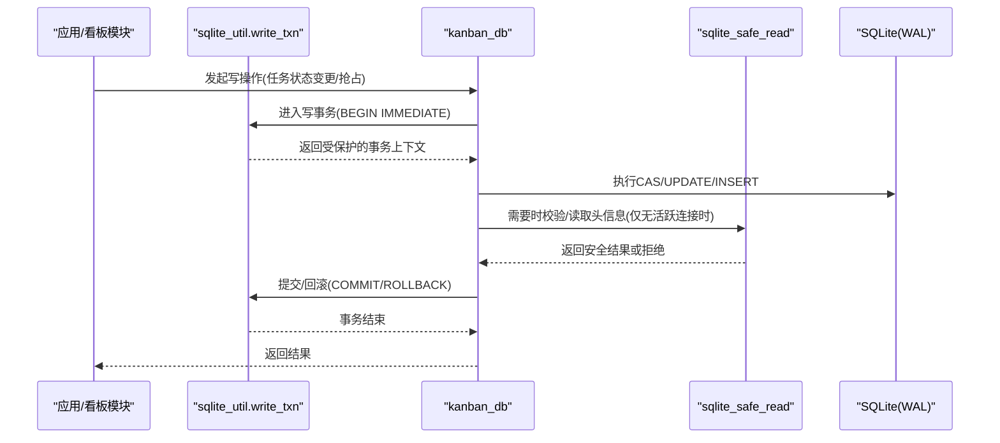
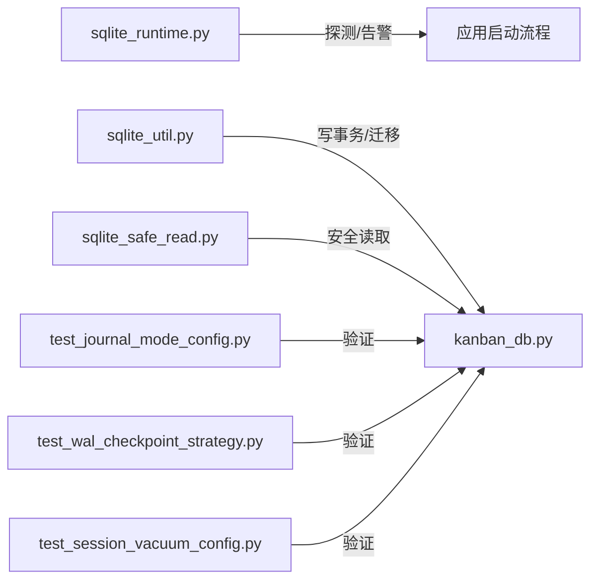
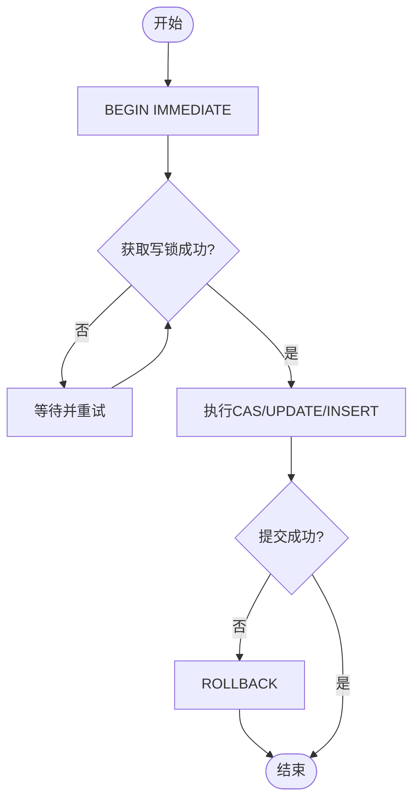

# 数据库优化配置

<cite>
**本文引用的文件**
- [sparkii_cli/sqlite_runtime.py](file://sparkii_cli/sqlite_runtime.py)
- [sparkii_cli/sqlite_util.py](file://sparkii_cli/sqlite_util.py)
- [sparkii_cli/sqlite_safe_read.py](file://sparkii_cli/sqlite_safe_read.py)
- [sparkii_cli/kanban_db.py](file://sparkii_cli/kanban_db.py)
- [tests/test_journal_mode_config.py](file://tests/test_journal_mode_config.py)
- [tests/test_wal_checkpoint_strategy.py](file://tests/test_wal_checkpoint_strategy.py)
- [tests/test_session_vacuum_config.py](file://tests/test_session_vacuum_config.py)
</cite>

## 目录
1. [简介](#简介)
2. [项目结构](#项目结构)
3. [核心组件](#核心组件)
4. [架构总览](#架构总览)
5. [详细组件分析](#详细组件分析)
6. [依赖关系分析](#依赖关系分析)
7. [性能考量](#性能考量)
8. [故障排查指南](#故障排查指南)
9. [结论](#结论)
10. [附录](#附录)

## 简介
本指南面向使用 SQLite 的本地与多进程场景，聚焦以下目标：
- 连接池与连接复用策略（在 Python sqlite3 上下文中的最佳实践）
- 查询优化（索引设计、语句优化、批量操作）
- 会话状态存储优化（压缩、分片、缓存）
- 性能监控指标（响应时间、锁等待、磁盘 I/O）
- 可操作的配置参数示例与基准测试建议
- 常见问题诊断与解决方案

说明：Python 标准库 sqlite3 不内置“连接池”，本项目通过 WAL 模式、BEGIN IMMEDIATE 事务、原子 CAS 更新以及严格的文件访问安全机制，实现高并发下的稳定读写。

## 项目结构
与 SQLite 优化相关的核心代码集中在 sparkii_cli 下，包括运行时探测、通用工具、安全读取与看板数据库实现；同时配套若干测试用例用于验证日志模式、WAL 检查点与清理策略。

图表来源
- [sparkii_cli/sqlite_runtime.py:1-125](file://sparkii_cli/sqlite_runtime.py#L1-L125)
- [sparkii_cli/sqlite_util.py:1-50](file://sparkii_cli/sqlite_util.py#L1-L50)
- [sparkii_cli/sqlite_safe_read.py:1-416](file://sparkii_cli/sqlite_safe_read.py#L1-L416)
- [sparkii_cli/kanban_db.py:1-800](file://sparkii_cli/kanban_db.py#L1-L800)
- [tests/test_journal_mode_config.py](file://tests/test_journal_mode_config.py)
- [tests/test_wal_checkpoint_strategy.py](file://tests/test_wal_checkpoint_strategy.py)
- [tests/test_session_vacuum_config.py](file://tests/test_session_vacuum_config.py)

章节来源
- [sparkii_cli/sqlite_runtime.py:1-125](file://sparkii_cli/sqlite_runtime.py#L1-L125)
- [sparkii_cli/sqlite_util.py:1-50](file://sparkii_cli/sqlite_util.py#L1-L50)
- [sparkii_cli/sqlite_safe_read.py:1-416](file://sparkii_cli/sqlite_safe_read.py#L1-L416)
- [sparkii_cli/kanban_db.py:1-800](file://sparkii_cli/kanban_db.py#L1-L800)

## 核心组件
- SQLite 运行时探测：在不引入第三方依赖的前提下，检测当前解释器链接的 SQLite 版本及已知漏洞区间，便于在启动阶段采取规避措施。
- 通用 SQLite 工具：提供幂等的列添加与 IMMEDIATE 写事务封装，确保跨进程并发写入时的正确性。
- 安全读取：防止对正在被连接的数据库进行原始文件字节级读取，避免 POSIX 建议锁被意外释放导致数据库损坏。
- 看板数据库：采用 WAL 模式 + BEGIN IMMEDIATE 事务 + CAS 更新，保证任务抢占与状态变更的原子性与一致性。

章节来源
- [sparkii_cli/sqlite_runtime.py:18-54](file://sparkii_cli/sqlite_runtime.py#L18-L54)
- [sparkii_cli/sqlite_util.py:14-50](file://sparkii_cli/sqlite_util.py#L14-L50)
- [sparkii_cli/sqlite_safe_read.py:1-60](file://sparkii_cli/sqlite_safe_read.py#L1-L60)
- [sparkii_cli/kanban_db.py:61-68](file://sparkii_cli/kanban_db.py#L61-L68)

## 架构总览
下图展示了从应用层到 SQLite 的调用链与关键优化点：连接创建、事务边界、并发控制与安全读取。

图表来源
- [sparkii_cli/sqlite_util.py:31-50](file://sparkii_cli/sqlite_util.py#L31-L50)
- [sparkii_cli/kanban_db.py:2772-2829](file://sparkii_cli/kanban_db.py#L2772-L2829)
- [sparkii_cli/sqlite_safe_read.py:347-381](file://sparkii_cli/sqlite_safe_read.py#L347-L381)

## 详细组件分析

### 连接池与连接复用策略
- 背景：Python sqlite3 不提供连接池。推荐以“单连接 + 短事务”的方式组织代码，配合 WAL 模式提升并发读能力。
- 本项目实践：
  - 统一通过 write_txn 开启 IMMEDIATE 写事务，减少锁竞争并明确事务边界。
  - 看板模块使用 WAL + BEGIN IMMEDIATE + CAS 更新，保证同一时刻只有一个写者能成功抢占资源。
  - 通过 connect_tracked 跟踪连接生命周期，避免在存在活跃连接时对数据库文件进行原始字节读取，防止 POSIX 锁被取消导致的损坏。
- 超时与重试：
  - 对于长时间运行的外部探针（如 SQLite 运行时探测），提供 timeout 参数以避免阻塞。
  - 写事务失败时，结合显式 ROLLBACK 与重试逻辑，降低瞬时锁冲突的影响。

章节来源
- [sparkii_cli/sqlite_util.py:31-50](file://sparkii_cli/sqlite_util.py#L31-L50)
- [sparkii_cli/kanban_db.py:2772-2829](file://sparkii_cli/kanban_db.py#L2772-L2829)
- [sparkii_cli/sqlite_runtime.py:78-125](file://sparkii_cli/sqlite_runtime.py#L78-L125)
- [sparkii_cli/sqlite_safe_read.py:210-274](file://sparkii_cli/sqlite_safe_read.py#L210-L274)

### 查询优化：索引、语句与批量
- 索引设计：
  - 为高频过滤/排序字段建立索引（例如看板任务的状态、优先级、更新时间等）。
  - 复合索引应覆盖常见查询谓词顺序，避免不必要的扫描。
- 语句优化：
  - 尽量使用精确匹配与范围条件，避免在 WHERE 中对列做函数计算。
  - 使用 EXPLAIN QUERY PLAN 分析执行计划，识别全表扫描与缺失索引。
- 批量操作：
  - 将多条 INSERT/UPDATE 合并为单次事务提交，显著降低 WAL 切换与 fsync 开销。
  - 使用参数化批量插入，减少解析与绑定成本。

[本节为通用优化建议，不直接引用具体文件]

### 会话状态存储优化：压缩、分片与缓存
- 压缩：
  - 对长会话文本进行压缩后再持久化，减少磁盘占用与 I/O 压力。
  - 压缩前需确保 UTF-8 安全与可逆解压，避免数据损坏。
- 分片：
  - 按会话或时间窗口拆分大对象，避免单行过大影响 WAL 效率。
  - 将附件、日志等大文件外置，数据库中仅保留元数据与路径。
- 缓存：
  - 对热点只读数据（如配置、字典表）使用内存缓存，降低重复查询。
  - 注意缓存失效策略与一致性，避免脏读。

[本节为通用优化建议，不直接引用具体文件]

### 性能监控指标
- 查询响应时间：统计 SELECT/UPDATE 的平均/分位耗时，定位慢查询。
- 锁等待时间：关注 busy 错误与 WAL 竞争，评估 BEGIN IMMEDIATE 粒度是否合适。
- 磁盘 I/O：监控 WAL 文件大小增长、检查点频率与 VACUUM 周期。
- 健康检查：定期读取 PRAGMA page_count/page_size 估算数据库大小，检测“撕裂扩展”风险。

[本节为通用监控建议，不直接引用具体文件]

## 依赖关系分析
- sqlite_runtime 独立于第三方依赖，用于启动期环境探测。
- sqlite_util 被 kanban_db 复用，提供一致的迁移与事务语义。
- sqlite_safe_read 为所有可能涉及原始文件访问的路径提供安全护栏。
- 测试用例覆盖日志模式、WAL 检查点与清理策略，保障行为稳定性。

图表来源
- [sparkii_cli/sqlite_runtime.py:1-125](file://sparkii_cli/sqlite_runtime.py#L1-L125)
- [sparkii_cli/sqlite_util.py:1-50](file://sparkii_cli/sqlite_util.py#L1-L50)
- [sparkii_cli/sqlite_safe_read.py:1-416](file://sparkii_cli/sqlite_safe_read.py#L1-L416)
- [sparkii_cli/kanban_db.py:1-800](file://sparkii_cli/kanban_db.py#L1-L800)
- [tests/test_journal_mode_config.py](file://tests/test_journal_mode_config.py)
- [tests/test_wal_checkpoint_strategy.py](file://tests/test_wal_checkpoint_strategy.py)
- [tests/test_session_vacuum_config.py](file://tests/test_session_vacuum_config.py)

章节来源
- [sparkii_cli/kanban_db.py:61-68](file://sparkii_cli/kanban_db.py#L61-L68)
- [sparkii_cli/sqlite_util.py:14-50](file://sparkii_cli/sqlite_util.py#L14-L50)
- [sparkii_cli/sqlite_safe_read.py:1-60](file://sparkii_cli/sqlite_safe_read.py#L1-L60)

## 性能考量
- WAL 模式：提高并发读能力，减少写放大；合理设置检查点频率，避免 WAL 无限增长。
- 事务粒度：尽可能缩小事务范围，减少持有锁的时间；复杂写操作拆分为多个小事务。
- 批量写入：合并多次写入至单一事务，降低 fsync 次数。
- 索引维护：新增/删除索引后观察查询计划与写入延迟变化。
- 定期维护：根据数据增长情况安排 VACUUM 与 PRANAGA 检查，保持统计信息准确。

[本节为通用性能建议，不直接引用具体文件]

## 故障排查指南
- 数据库损坏/锁冲突：
  - 确认未对带活跃连接的数据库进行原始字节读取；如需读取，请使用安全读取接口或在无连接时进行。
  - 检查是否存在未关闭的连接导致锁未释放。
- WAL 相关问题：
  - 若遇到 WAL 重置相关缺陷，可通过运行时探测判断 SQLite 版本区间并采取规避策略。
  - 调整检查点策略，平衡吞吐与恢复时间。
- 日志模式与清理：
  - 通过测试用例验证日志模式是否符合预期。
  - 根据业务需求配置 VACUUM 策略，避免频繁碎片化。

章节来源
- [sparkii_cli/sqlite_safe_read.py:1-60](file://sparkii_cli/sqlite_safe_read.py#L1-L60)
- [sparkii_cli/sqlite_runtime.py:24-54](file://sparkii_cli/sqlite_runtime.py#L24-L54)
- [tests/test_journal_mode_config.py](file://tests/test_journal_mode_config.py)
- [tests/test_wal_checkpoint_strategy.py](file://tests/test_wal_checkpoint_strategy.py)
- [tests/test_session_vacuum_config.py](file://tests/test_session_vacuum_config.py)

## 结论
本项目通过 WAL 模式、BEGIN IMMEDIATE 事务、CAS 更新与安全读取机制，构建了稳健的 SQLite 使用范式。配合合理的索引设计、批量操作与定期维护，可在单机/多进程环境下获得良好的性能与可靠性。建议在部署中结合监控指标持续优化，并根据数据规模调整 WAL 检查点与 VACUUM 策略。

## 附录

### 配置参数与示例（基于仓库现有能力）
- 日志模式与检查点：参考测试用例验证与调整日志模式与 WAL 检查点策略。
- 清理策略：参考测试用例配置 VACUUM 行为，避免过度碎片化。
- 运行时探测：在启动阶段探测 SQLite 版本，必要时启用兼容模式或规避已知问题。

章节来源
- [tests/test_journal_mode_config.py](file://tests/test_journal_mode_config.py)
- [tests/test_wal_checkpoint_strategy.py](file://tests/test_wal_checkpoint_strategy.py)
- [tests/test_session_vacuum_config.py](file://tests/test_session_vacuum_config.py)
- [sparkii_cli/sqlite_runtime.py:78-125](file://sparkii_cli/sqlite_runtime.py#L78-L125)

### 流程图：写事务与 CAS 更新

图表来源
- [sparkii_cli/sqlite_util.py:31-50](file://sparkii_cli/sqlite_util.py#L31-L50)
- [sparkii_cli/kanban_db.py:2772-2829](file://sparkii_cli/kanban_db.py#L2772-L2829)