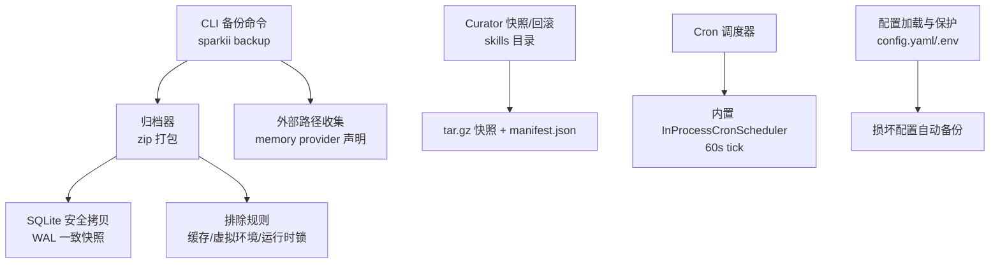
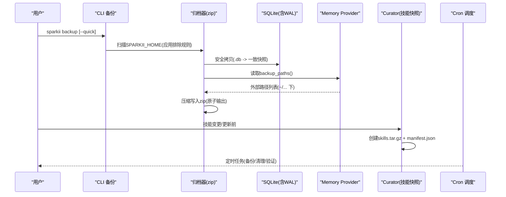
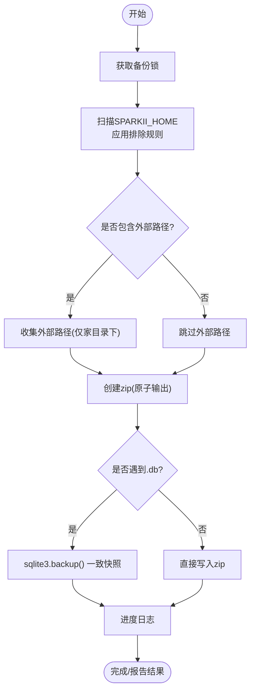
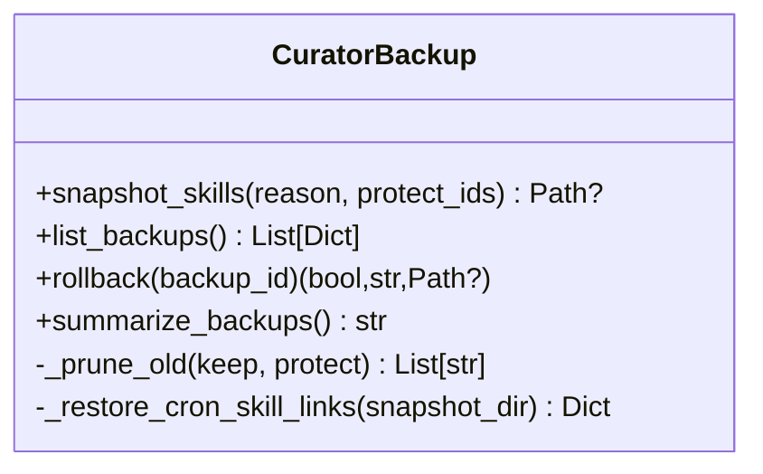
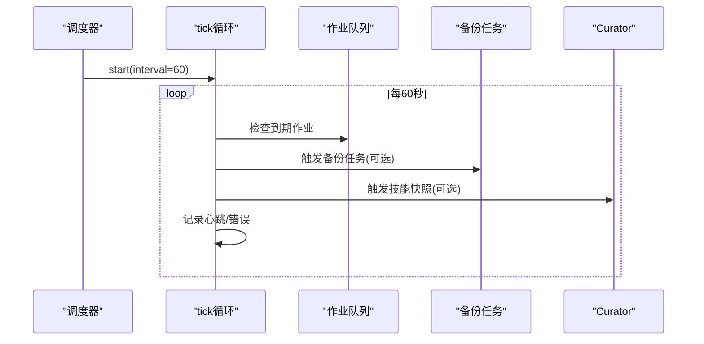
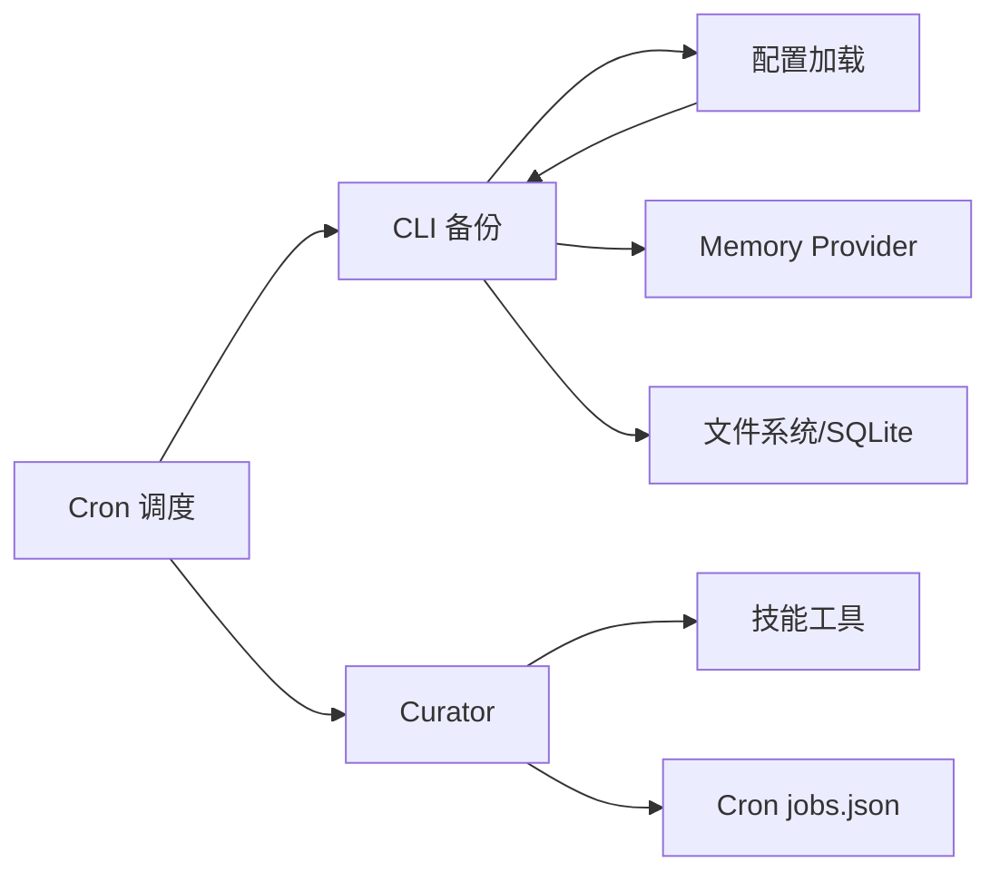

# 备份策略与配置

<cite>
**本文引用的文件**
- [sparkii_cli/backup.py](file://sparkii_cli/backup.py)
- [sparkii_cli/subcommands/backup.py](file://sparkii_cli/subcommands/backup.py)
- [agent/curator_backup.py](file://agent/curator_backup.py)
- [cron/scheduler.py](file://cron/scheduler.py)
- [cron/scheduler_provider.py](file://cron/scheduler_provider.py)
- [sparkii_cli/config.py](file://sparkii_cli/config.py)
</cite>

## 目录
1. [简介](#简介)
2. [项目结构](#项目结构)
3. [核心组件](#核心组件)
4. [架构总览](#架构总览)
5. [详细组件分析](#详细组件分析)
6. [依赖关系分析](#依赖关系分析)
7. [性能考量](#性能考量)
8. [故障排查指南](#故障排查指南)
9. [结论](#结论)
10. [附录：配置示例与自动化脚本](#附录配置示例与自动化脚本)

## 简介
本文件面向系统管理员与运维工程师，提供一套可落地的备份策略与配置说明。内容覆盖：
- 数据备份方案：会话数据、记忆存储、工具配置、插件状态
- 配置备份机制：CLI 配置、网关配置、平台集成配置与环境变量管理
- 增量备份实现：变更检测、差异存储、压缩优化
- 备份调度：定时任务、存储空间管理与保留策略
- 备份验证：完整性校验与可恢复性验证
- 配置文件示例与自动化脚本实践

## 项目结构
本项目在 CLI 层提供了统一的备份入口，并在 Agent 层提供针对技能（skills）的快照与回滚能力；Cron 子系统负责调度执行；配置模块负责加载与保护用户配置。

图表来源
- [sparkii_cli/backup.py:150-219](file://sparkii_cli/backup.py#L150-L219)
- [sparkii_cli/backup.py:221-295](file://sparkii_cli/backup.py#L221-L295)
- [sparkii_cli/backup.py:342-370](file://sparkii_cli/backup.py#L342-L370)
- [agent/curator_backup.py:217-291](file://agent/curator_backup.py#L217-L291)
- [cron/scheduler_provider.py:172-271](file://cron/scheduler_provider.py#L172-L271)
- [sparkii_cli/config.py:45-97](file://sparkii_cli/config.py#L45-L97)

章节来源
- [sparkii_cli/backup.py:150-219](file://sparkii_cli/backup.py#L150-L219)
- [sparkii_cli/backup.py:221-295](file://sparkii_cli/backup.py#L221-L295)
- [sparkii_cli/backup.py:342-370](file://sparkii_cli/backup.py#L342-L370)
- [agent/curator_backup.py:217-291](file://agent/curator_backup.py#L217-L291)
- [cron/scheduler_provider.py:172-271](file://cron/scheduler_provider.py#L172-L271)
- [sparkii_cli/config.py:45-97](file://sparkii_cli/config.py#L45-L97)

## 核心组件
- CLI 备份与导入
  - 全量 zip 备份 SPARKII_HOME，排除缓存、虚拟环境、运行时锁等不可移植或可再生内容
  - SQLite 数据库通过 WAL 安全拷贝保证一致性
  - 支持“快速快照”仅备份关键状态文件
- Curator 快照与回滚
  - 对 skills 目录进行 tar.gz 快照，附带 manifest.json 与可选 cron/jobs.json 片段
  - 支持按保留数量清理旧快照，并具备安全的回滚流程
- Cron 调度
  - 内置 InProcessCronScheduler 以固定间隔触发任务
  - 支持多 Profile 复用同一调度器实例
- 配置保护
  - 解析失败时自动备份损坏的 config.yaml，避免丢失用户覆盖配置

章节来源
- [sparkii_cli/backup.py:581-795](file://sparkii_cli/backup.py#L581-L795)
- [sparkii_cli/subcommands/backup.py:12-39](file://sparkii_cli/subcommands/backup.py#L12-L39)
- [agent/curator_backup.py:217-291](file://agent/curator_backup.py#L217-L291)
- [agent/curator_backup.py:572-730](file://agent/curator_backup.py#L572-L730)
- [cron/scheduler_provider.py:172-271](file://cron/scheduler_provider.py#L172-L271)
- [sparkii_cli/config.py:45-97](file://sparkii_cli/config.py#L45-L97)

## 架构总览
下图展示了从 CLI 触发备份到归档、再到外部路径与 SQLite 的一致性保障，以及 Curator 对 skills 的独立快照与回滚路径。

图表来源
- [sparkii_cli/backup.py:597-795](file://sparkii_cli/backup.py#L597-L795)
- [sparkii_cli/backup.py:221-295](file://sparkii_cli/backup.py#L221-L295)
- [sparkii_cli/backup.py:342-370](file://sparkii_cli/backup.py#L342-L370)
- [agent/curator_backup.py:217-291](file://agent/curator_backup.py#L217-L291)
- [cron/scheduler_provider.py:172-271](file://cron/scheduler_provider.py#L172-L271)

## 详细组件分析

### 组件A：CLI 备份与导入
- 功能要点
  - 跨进程互斥：使用 .backup.lock 防止并发备份导致不一致
  - 原子输出：先写临时文件再替换，避免半产物污染
  - 排除策略：跳过缓存、虚拟环境、git/node_modules、运行时锁等
  - SQLite 一致性：通过 sqlite3.backup() 获取一致快照，忽略 WAL/SHM/JOURNAL
  - 外部路径：从 memory provider 的 backup_paths() 收集家目录下外部文件
  - 权限收紧：导入时对敏感文件设置严格权限
- 复杂度与性能
  - 扫描阶段 O(N) 遍历，过滤后归档；大库采用 WAL 快照避免阻塞
  - 压缩级别适中，兼顾体积与速度
- 错误处理
  - 单个文件失败不中断整体流程，记录警告
  - 若 SQLite 快照失败则跳过该库并告警

图表来源
- [sparkii_cli/backup.py:150-219](file://sparkii_cli/backup.py#L150-L219)
- [sparkii_cli/backup.py:597-795](file://sparkii_cli/backup.py#L597-L795)
- [sparkii_cli/backup.py:221-295](file://sparkii_cli/backup.py#L221-L295)
- [sparkii_cli/backup.py:342-370](file://sparkii_cli/backup.py#L342-L370)

章节来源
- [sparkii_cli/backup.py:150-219](file://sparkii_cli/backup.py#L150-L219)
- [sparkii_cli/backup.py:597-795](file://sparkii_cli/backup.py#L597-L795)
- [sparkii_cli/backup.py:221-295](file://sparkii_cli/backup.py#L221-L295)
- [sparkii_cli/backup.py:342-370](file://sparkii_cli/backup.py#L342-L370)

### 组件B：Curator 技能快照与回滚
- 功能要点
  - 快照范围：skills 目录（排除 .hub 与自身备份目录），同时捕获 cron/jobs.json 副本
  - 元数据：manifest.json 记录时间、原因、技能数、压缩包大小
  - 保留策略：按 keep 数量裁剪旧快照，支持保护指定 ID
  - 回滚流程：先做安全快照，再将当前 skills 移入暂存区，解压目标快照，最后修复 cron 技能引用
- 复杂度与性能
  - tar.gz 流式写入，避免额外中间目录
  - 回滚过程中对异常进行尽力恢复，确保可逆
- 错误处理
  - 快照失败会清理部分产物并返回 None，不影响主流程
  - 回滚失败会尽量还原已移动的文件并保留暂存目录供人工恢复

图表来源
- [agent/curator_backup.py:217-291](file://agent/curator_backup.py#L217-L291)
- [agent/curator_backup.py:351-377](file://agent/curator_backup.py#L351-L377)
- [agent/curator_backup.py:572-730](file://agent/curator_backup.py#L572-L730)

章节来源
- [agent/curator_backup.py:217-291](file://agent/curator_backup.py#L217-L291)
- [agent/curator_backup.py:351-377](file://agent/curator_backup.py#L351-L377)
- [agent/curator_backup.py:572-730](file://agent/curator_backup.py#L572-L730)

### 组件C：Cron 调度与备份编排
- 功能要点
  - 内置调度器：InProcessCronScheduler 每 60 秒 tick，支持多 Profile 复用
  - 钩子：on_jobs_changed / fire_due / reconcile 便于扩展外部调度器
  - 健康与恢复：心跳记录、错误持久化、中断执行恢复
- 与备份集成建议
  - 定期触发 CLI 备份（全量/快速）
  - 定期调用 Curator 快照（如技能更新前后）
  - 定期执行备份完整性校验与空间清理

图表来源
- [cron/scheduler_provider.py:172-271](file://cron/scheduler_provider.py#L172-L271)
- [cron/scheduler_provider.py:273-368](file://cron/scheduler_provider.py#L273-L368)

章节来源
- [cron/scheduler_provider.py:172-271](file://cron/scheduler_provider.py#L172-L271)
- [cron/scheduler_provider.py:273-368](file://cron/scheduler_provider.py#L273-L368)

### 组件D：配置加载与保护
- 功能要点
  - 解析失败时自动将损坏的 config.yaml 备份为带时间戳的 .bak
  - 避免静默丢弃用户覆盖，提示并引导修复
- 与备份集成建议
  - 将 config.yaml 与 .env 纳入备份范围（CLI 默认已包含）
  - 在导入时注意环境变量与敏感文件的权限控制

章节来源
- [sparkii_cli/config.py:45-97](file://sparkii_cli/config.py#L45-L97)

## 依赖关系分析
- CLI 备份依赖
  - 路径与常量：SPARKII_HOME、默认根路径
  - 插件接口：memory provider 的 backup_paths() 用于外部路径发现
  - 文件系统：zip、sqlite3、os.walk、tempfile
- Curator 依赖
  - 技能工具：is_excluded_skill_path
  - 配置：curator.backup.enabled/keep
  - Cron：jobs.json 副本与链接修复
- Cron 调度依赖
  - 配置：cron.provider、interval
  - 执行：jobs/executions/scheduler 共享体
- 配置模块依赖
  - 路径：~/.sparkii/config.yaml、.env
  - 安全：环境变量白名单/黑名单（写入限制）

图表来源
- [sparkii_cli/backup.py:221-295](file://sparkii_cli/backup.py#L221-L295)
- [agent/curator_backup.py:217-291](file://agent/curator_backup.py#L217-L291)
- [cron/scheduler_provider.py:172-271](file://cron/scheduler_provider.py#L172-L271)
- [sparkii_cli/config.py:45-97](file://sparkii_cli/config.py#L45-L97)

章节来源
- [sparkii_cli/backup.py:221-295](file://sparkii_cli/backup.py#L221-L295)
- [agent/curator_backup.py:217-291](file://agent/curator_backup.py#L217-L291)
- [cron/scheduler_provider.py:172-271](file://cron/scheduler_provider.py#L172-L271)
- [sparkii_cli/config.py:45-97](file://sparkii_cli/config.py#L45-L97)

## 性能考量
- 扫描与归档
  - 通过排除规则减少无关文件，显著降低归档规模与耗时
  - 大数据库采用 WAL 快照，避免长时间锁定与 CPU 占用
- 压缩
  - 使用 ZIP_DEFLATED 平衡体积与速度
- 调度
  - 60 秒 tick 适合大多数场景；可通过外部调度器调整频率
- 存储
  - 合理设置 Curator 快照保留数量，避免磁盘膨胀
  - 定期清理过期 zip 与 tar.gz 快照

## 故障排查指南
- 备份卡住或极慢
  - 检查是否存在未排除的大目录（如 node_modules、venv、site-packages）
  - 确认 .backup.lock 未被其他进程持有
- SQLite 备份失败
  - 查看日志中关于 safe copy 失败的警告
  - 确认磁盘空间充足（临时 .db 文件位于输出目录同级）
- 导入后网关异常
  - 确认未覆盖 gateway_state.json、gateway.pid、processes.json 等运行时文件
- Curator 回滚失败
  - 检查暂存目录 .rollback-staging-* 中的残留文件
  - 查看 manifest.json 与 cron-jobs.json 是否完整
- Cron 调度异常
  - 查看心跳与错误记录，确认 tick 是否正常
  - 检查多 Profile 模式下各 Profile 的心跳与错误信息

章节来源
- [sparkii_cli/backup.py:597-795](file://sparkii_cli/backup.py#L597-L795)
- [agent/curator_backup.py:572-730](file://agent/curator_backup.py#L572-L730)
- [cron/scheduler_provider.py:172-271](file://cron/scheduler_provider.py#L172-L271)

## 结论
本方案通过 CLI 全量备份与 Curator 技能快照双通道，结合 Cron 调度与配置保护，形成覆盖会话、记忆、工具与插件状态的完整备份体系。通过 WAL 一致性快照、原子输出、排除规则与保留策略，兼顾可靠性与性能。配合定期校验与自动化脚本，可实现稳定可恢复的数据保护闭环。

## 附录：配置示例与自动化脚本

### 备份策略矩阵（建议）
- 会话数据（state.db、sessions）
  - 全量：每日一次，ZIP 归档，保留 7 天
  - 快速：每小时一次，仅关键状态
- 记忆存储（外部路径）
  - 由 memory provider 声明，随备份一起归档
- 工具配置（tools、MCP、模型）
  - 随 CLI 备份一并归档
- 插件状态（skills）
  - 每次变更前 Curator 快照，保留最近 5 个

### 调度建议（Cron）
- 内置调度器
  - interval=60 秒，适合本地部署
- 外部调度器
  - 通过 cron.provider 切换至外部实现（如 Chronos）
- 典型任务
  - 每日 02:00 全量备份
  - 每小时 快速备份
  - 每周日 03:00 清理过期备份与快照

### 保留策略
- CLI 备份 zip：保留 7 天
- Curator 快照：保留 5 个（可配置）
- 日志与审计：按系统策略轮转

### 完整性校验
- SQLite 校验
  - 优先 header + schema probe，超大库跳过 PRAGMA integrity_check
- 归档校验
  - 解压抽样校验关键文件（config.yaml、state.db、.env）
- 可恢复性演练
  - 定期在隔离环境执行导入测试

### 自动化脚本（思路）
- 备份脚本
  - 调用 sparkii backup 生成 zip
  - 调用 Curator snapshot_skills 生成技能快照
  - 记录时间与大小，推送至远端存储（可选）
- 清理脚本
  - 删除超过保留期的 zip 与 Curator 快照
  - 释放磁盘空间
- 校验脚本
  - 校验 state.db 头部与 schema
  - 校验 zip 内关键文件存在性与可读性

章节来源
- [sparkii_cli/backup.py:597-795](file://sparkii_cli/backup.py#L597-L795)
- [agent/curator_backup.py:217-291](file://agent/curator_backup.py#L217-L291)
- [cron/scheduler_provider.py:172-271](file://cron/scheduler_provider.py#L172-L271)