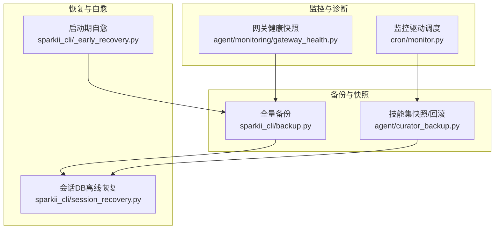
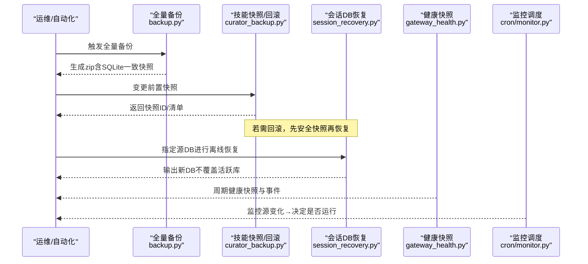
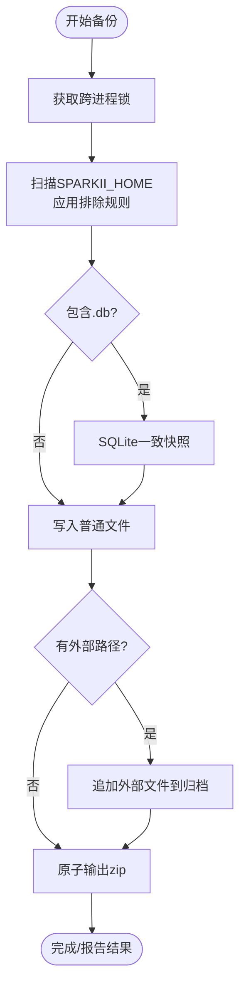
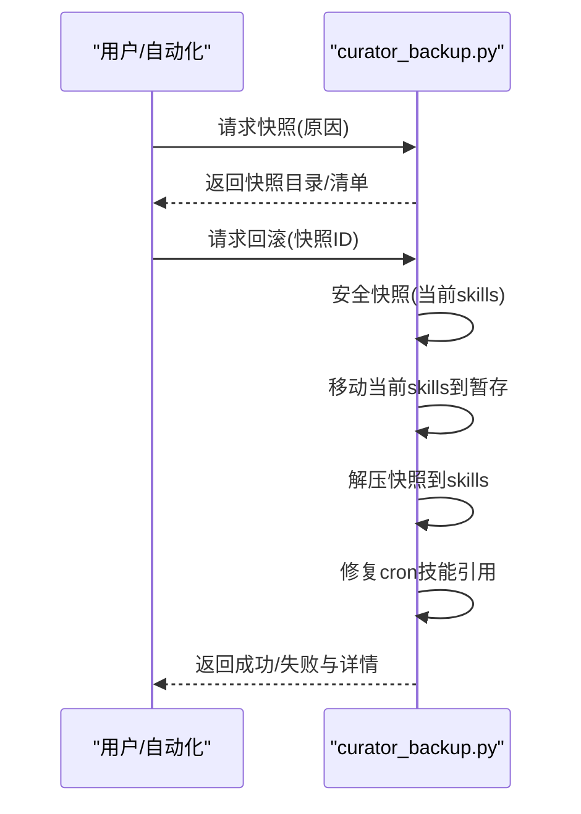
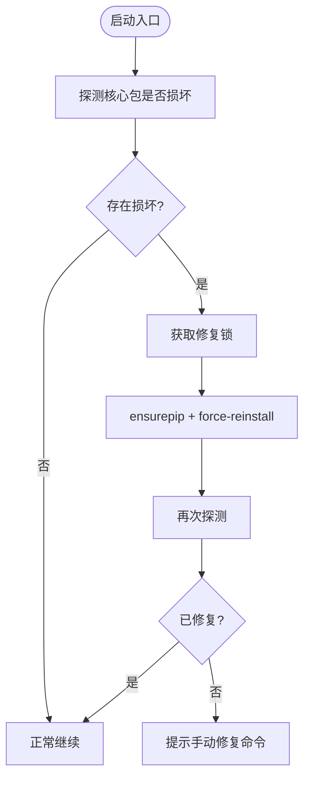
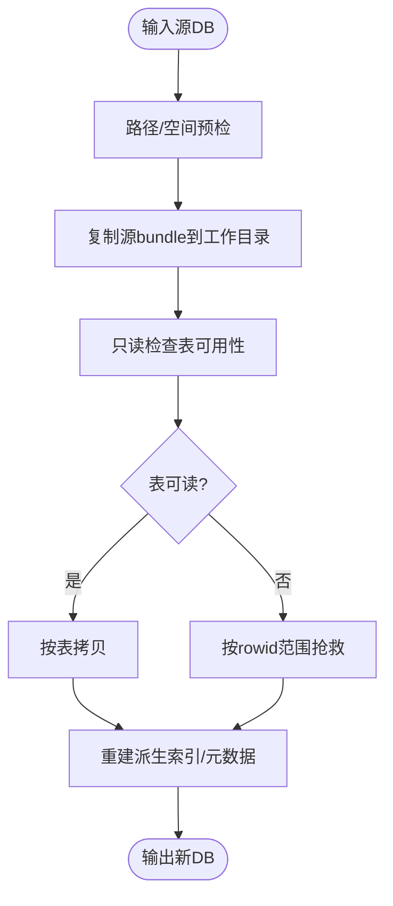
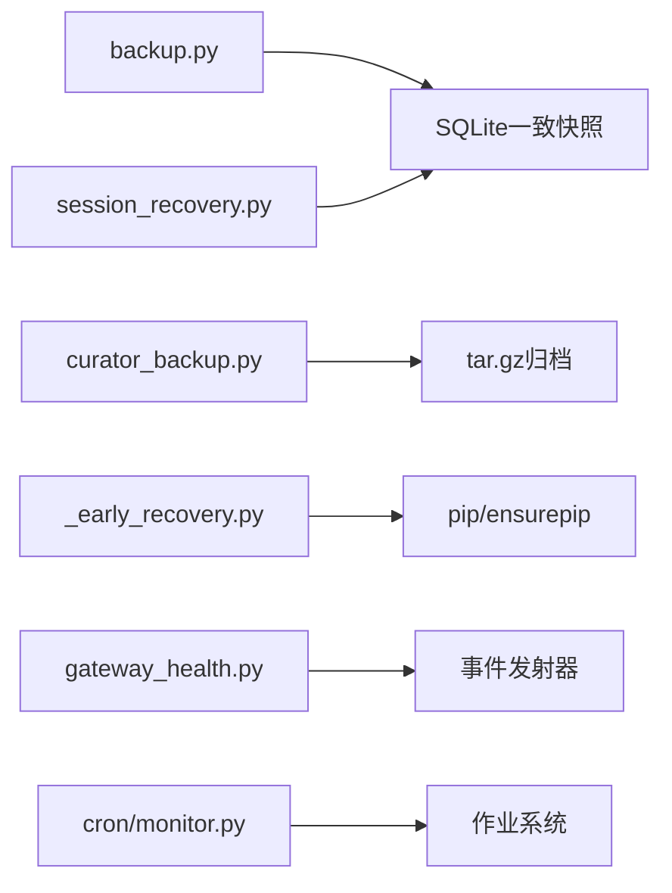

# 灾难恢复与业务连续性

<cite>
**本文引用的文件**
- [sparkii_cli/backup.py](file://sparkii_cli/backup.py)
- [agent/curator_backup.py](file://agent/curator_backup.py)
- [sparkii_cli/_early_recovery.py](file://sparkii_cli/_early_recovery.py)
- [sparkii_cli/session_recovery.py](file://sparkii_cli/session_recovery.py)
- [agent/monitoring/gateway_health.py](file://agent/monitoring/gateway_health.py)
- [cron/monitor.py](file://cron/monitor.py)
</cite>

## 目录
1. [简介](#简介)
2. [项目结构](#项目结构)
3. [核心组件](#核心组件)
4. [架构总览](#架构总览)
5. [详细组件分析](#详细组件分析)
6. [依赖关系分析](#依赖关系分析)
7. [性能考量](#性能考量)
8. [故障排查指南](#故障排查指南)
9. [结论](#结论)
10. [附录：操作手册与应急清单](#附录操作手册与应急清单)

## 简介
本指南面向生产环境的灾难恢复与业务连续性保障，围绕数据备份、配置备份、增量备份策略，恢复流程设计（RTO/RPO目标、优先级、一致性保证），高可用架构（多副本、故障转移、负载均衡），以及演练计划（定期恢复测试、预案更新、团队培训）和连续性措施（降级、熔断、服务隔离）进行系统化说明。文档同时提供可操作的灾难恢复操作手册与应急联系清单模板，确保在真实故障场景下快速、安全地恢复关键能力。

## 项目结构
本项目在“备份—快照—恢复—监控”的闭环中提供了多处关键实现：
- 全量备份与导入：对用户主目录进行结构化打包，排除缓存与不可移植状态，并对SQLite数据库采用一致快照。
- 技能集快照与回滚：在变更前自动创建可回滚的技能集快照，并附带定时任务引用的一致性修复。
- 启动期自愈：在venv损坏时自动探测并修复核心依赖，确保CLI可导入。
- 会话数据库离线恢复：在不打开源库的前提下复制、校验、重建元数据与索引，支持部分恢复与范围抢救。
- 健康与诊断：网关健康快照、平台状态事件、日志转诊断事件，支撑故障发现与定位。
- 监控驱动的任务调度：基于输出哈希的变更检测，减少无效运行，提升稳定性与可观测性。

**图示来源**
- [sparkii_cli/backup.py:581-795](file://sparkii_cli/backup.py#L581-L795)
- [agent/curator_backup.py:217-291](file://agent/curator_backup.py#L217-L291)
- [sparkii_cli/_early_recovery.py:190-272](file://sparkii_cli/_early_recovery.py#L190-L272)
- [sparkii_cli/session_recovery.py:321-378](file://sparkii_cli/session_recovery.py#L321-L378)
- [agent/monitoring/gateway_health.py:210-291](file://agent/monitoring/gateway_health.py#L210-L291)
- [cron/monitor.py:147-194](file://cron/monitor.py#L147-L194)

**章节来源**
- [sparkii_cli/backup.py:581-795](file://sparkii_cli/backup.py#L581-L795)
- [agent/curator_backup.py:217-291](file://agent/curator_backup.py#L217-L291)
- [sparkii_cli/_early_recovery.py:190-272](file://sparkii_cli/_early_recovery.py#L190-L272)
- [sparkii_cli/session_recovery.py:321-378](file://sparkii_cli/session_recovery.py#L321-L378)
- [agent/monitoring/gateway_health.py:210-291](file://agent/monitoring/gateway_health.py#L210-L291)
- [cron/monitor.py:147-194](file://cron/monitor.py#L147-L194)

## 核心组件
- 全量备份与导入
  - 通过跨进程锁避免并发备份冲突；按规则排除缓存、虚拟环境、运行时PID等；对SQLite使用一致快照；输出原子替换，防止半写产物。
  - 支持外部存储路径（如记忆提供者声明的外部目录）纳入归档，并在导入时还原到原位置。
- 技能集快照与回滚
  - 变更前自动创建tar.gz快照，记录manifest（时间、原因、大小、技能文件数），可选捕获定时任务配置；回滚前会先做安全快照，再移动当前树、解压快照，失败时尽力回退。
- 启动期自愈
  - 仅使用标准库，探测核心包是否损坏，必要时执行强制重装，确保CLI可导入；避免与正式更新流程竞争。
- 会话数据库离线恢复
  - 不直接打开源库，复制到工作目录后检查完整性；按表拷贝或按rowid范围抢救；重建派生索引与元数据；输出新库，不覆盖活跃库。
- 健康与诊断
  - 构建网关健康快照与平台状态事件；将日志转为诊断事件；统一脱敏与限长，便于导出与告警。
- 监控驱动调度
  - 以精确字节哈希比较监控源输出变化，仅在变化时触发任务；持久化上次输出与时间戳，失败不视为变化。

**章节来源**
- [sparkii_cli/backup.py:150-219](file://sparkii_cli/backup.py#L150-L219)
- [sparkii_cli/backup.py:342-370](file://sparkii_cli/backup.py#L342-L370)
- [sparkii_cli/backup.py:581-795](file://sparkii_cli/backup.py#L581-L795)
- [agent/curator_backup.py:217-291](file://agent/curator_backup.py#L217-L291)
- [agent/curator_backup.py:572-730](file://agent/curator_backup.py#L572-L730)
- [sparkii_cli/_early_recovery.py:190-272](file://sparkii_cli/_early_recovery.py#L190-L272)
- [sparkii_cli/session_recovery.py:321-378](file://sparkii_cli/session_recovery.py#L321-L378)
- [sparkii_cli/session_recovery.py:508-663](file://sparkii_cli/session_recovery.py#L508-L663)
- [agent/monitoring/gateway_health.py:210-291](file://agent/monitoring/gateway_health.py#L210-L291)
- [cron/monitor.py:147-194](file://cron/monitor.py#L147-L194)

## 架构总览
下图展示了从备份、快照到恢复与监控的关键交互路径，体现“备份—快照—恢复—监控”的闭环。

**图示来源**
- [sparkii_cli/backup.py:581-795](file://sparkii_cli/backup.py#L581-L795)
- [agent/curator_backup.py:217-291](file://agent/curator_backup.py#L217-L291)
- [sparkii_cli/session_recovery.py:321-378](file://sparkii_cli/session_recovery.py#L321-L378)
- [agent/monitoring/gateway_health.py:210-291](file://agent/monitoring/gateway_health.py#L210-L291)
- [cron/monitor.py:147-194](file://cron/monitor.py#L147-L194)

## 详细组件分析

### 组件A：全量备份与导入（sparkii_cli/backup.py）
- 备份策略
  - 跨进程锁：避免重复备份导致资源争用与不一致。
  - 排除规则：跳过缓存、虚拟环境、运行时PID、WAL/SHM/Journal等瞬态文件，避免体积膨胀与恢复歧义。
  - SQLite一致快照：使用备份API生成一致副本，避免WAL模式下的不一致。
  - 原子输出：临时文件写入后原子替换，防止半写产物被误用。
  - 外部路径：收集记忆提供者声明的外部路径，归档并还原到原位置。
- 导入策略
  - 过滤敏感/易错文件：禁止覆盖网关状态、PID、锁等运行时文件。
  - 权限收紧：对密钥类文件恢复为严格权限。
- 复杂度与性能
  - 扫描阶段O(N)遍历；压缩阶段I/O密集；大库通过一致快照降低风险但可能耗时。
- 错误处理
  - 明确区分备份进行中、SQLite快照失败、IO异常；汇总错误并报告进度。

**图示来源**
- [sparkii_cli/backup.py:150-219](file://sparkii_cli/backup.py#L150-L219)
- [sparkii_cli/backup.py:342-370](file://sparkii_cli/backup.py#L342-L370)
- [sparkii_cli/backup.py:581-795](file://sparkii_cli/backup.py#L581-L795)

**章节来源**
- [sparkii_cli/backup.py:150-219](file://sparkii_cli/backup.py#L150-L219)
- [sparkii_cli/backup.py:342-370](file://sparkii_cli/backup.py#L342-L370)
- [sparkii_cli/backup.py:581-795](file://sparkii_cli/backup.py#L581-L795)

### 组件B：技能集快照与回滚（agent/curator_backup.py）
- 快照机制
  - 变更前创建tar.gz快照，记录manifest（时间、原因、大小、技能文件数），可选捕获定时任务jobs.json。
  - 保留必要元数据（如.curator_state、.bundled_manifest、.archive等），确保回滚一致性。
- 回滚流程
  - 先做安全快照（保护目标快照不被清理）；移动当前树至暂存目录；解压快照；失败时尽力回退；最后修复定时任务的技能引用。
- 复杂度与性能
  - tar.gz流式写入，避免中间目录拷贝；清理旧快照按keep策略控制。
- 错误处理
  - 任何IO或解析错误均记录并尽量保持可恢复；回滚失败时保留暂存以便人工干预。

**图示来源**
- [agent/curator_backup.py:217-291](file://agent/curator_backup.py#L217-L291)
- [agent/curator_backup.py:572-730](file://agent/curator_backup.py#L572-L730)

**章节来源**
- [agent/curator_backup.py:217-291](file://agent/curator_backup.py#L217-L291)
- [agent/curator_backup.py:572-730](file://agent/curator_backup.py#L572-L730)

### 组件C：启动期自愈（sparkii_cli/_early_recovery.py）
- 目标
  - 在venv损坏导致无法导入main之前，仅用标准库探测并修复核心包，使CLI可继续加载完整恢复流程。
- 机制
  - 探针表：对yaml/dotenv/click/certifi/rich/cryptography/jwt等进行导入与属性探测；certifi额外校验证书包完整性。
  - 修复：ensurepip升级后force-reinstall受影响的包；加锁避免与正式更新竞争。
- 适用场景
  - 更新中断、依赖缺失、证书包损坏导致的TLS失败等。

**图示来源**
- [sparkii_cli/_early_recovery.py:190-272](file://sparkii_cli/_early_recovery.py#L190-L272)

**章节来源**
- [sparkii_cli/_early_recovery.py:190-272](file://sparkii_cli/_early_recovery.py#L190-L272)

### 组件D：会话数据库离线恢复（sparkii_cli/session_recovery.py）
- 原则
  - 非破坏性：不直接打开源库；复制到工作目录后再处理；重建派生索引与元数据；输出新库，不覆盖活跃库。
- 流程
  - 路径校验与空间预检；复制源bundle；只读检查表可用性；按表拷贝或按rowid范围抢救；重建FTS与迁移信息；输出恢复结果。
- 复杂性与健壮性
  - 针对损坏页采用rowid范围二分重试；限制查询次数避免卡死；对state_meta特殊处理，排除系统生成键。
- 错误处理
  - 明确区分missing/partial/failed；报告跳过范围与原因；允许部分恢复并标记损失。

**图示来源**
- [sparkii_cli/session_recovery.py:321-378](file://sparkii_cli/session_recovery.py#L321-L378)
- [sparkii_cli/session_recovery.py:508-663](file://sparkii_cli/session_recovery.py#L508-L663)

**章节来源**
- [sparkii_cli/session_recovery.py:321-378](file://sparkii_cli/session_recovery.py#L321-L378)
- [sparkii_cli/session_recovery.py:508-663](file://sparkii_cli/session_recovery.py#L508-L663)

### 组件E：健康与诊断（agent/monitoring/gateway_health.py）
- 功能
  - 构建网关健康快照（up/busy/drainable/active_agents/state等指标）；平台状态变化事件；日志转诊断事件（脱敏、限长）。
- 用途
  - 支撑故障发现、告警与恢复决策；与备份/恢复流程联动，确认恢复后服务状态。

**章节来源**
- [agent/monitoring/gateway_health.py:210-291](file://agent/monitoring/gateway_health.py#L210-L291)

### 组件F：监控驱动调度（cron/monitor.py）
- 功能
  - 对脚本或URL输出进行精确字节哈希比较，仅在变化时触发任务；持久化上次输出与时间戳；失败不视为变化。
- 价值
  - 降低无效负载，提高稳定性；为业务连续性提供“静默守护+变更告警”的能力。

**章节来源**
- [cron/monitor.py:147-194](file://cron/monitor.py#L147-L194)

## 依赖关系分析
- 模块耦合
  - 备份与恢复强依赖文件系统与SQLite；技能快照与回滚依赖tar.gz与JSON；健康与诊断依赖日志与事件发射器；监控调度依赖作业系统与网络访问。
- 外部依赖
  - SQLite WAL/SHM/Journal；第三方包（如PyYAML、cryptography等）；操作系统文件锁与原子替换语义。
- 潜在循环
  - 各模块职责清晰，未见直接循环依赖；通过事件与文件契约解耦。

**图示来源**
- [sparkii_cli/backup.py:342-370](file://sparkii_cli/backup.py#L342-L370)
- [agent/curator_backup.py:217-291](file://agent/curator_backup.py#L217-L291)
- [sparkii_cli/_early_recovery.py:190-272](file://sparkii_cli/_early_recovery.py#L190-L272)
- [sparkii_cli/session_recovery.py:321-378](file://sparkii_cli/session_recovery.py#L321-L378)
- [agent/monitoring/gateway_health.py:210-291](file://agent/monitoring/gateway_health.py#L210-L291)
- [cron/monitor.py:147-194](file://cron/monitor.py#L147-L194)

**章节来源**
- [sparkii_cli/backup.py:342-370](file://sparkii_cli/backup.py#L342-L370)
- [agent/curator_backup.py:217-291](file://agent/curator_backup.py#L217-L291)
- [sparkii_cli/_early_recovery.py:190-272](file://sparkii_cli/_early_recovery.py#L190-L272)
- [sparkii_cli/session_recovery.py:321-378](file://sparkii_cli/session_recovery.py#L321-L378)
- [agent/monitoring/gateway_health.py:210-291](file://agent/monitoring/gateway_health.py#L210-L291)
- [cron/monitor.py:147-194](file://cron/monitor.py#L147-L194)

## 性能考量
- 备份阶段
  - 大库一致快照可能耗时；建议错峰执行；利用排除规则减小体积；压缩级别适中。
- 恢复阶段
  - 会话DB恢复按表或范围拷贝，避免全量扫描；对超大库优先header+schema探测，降低CPU占用。
- 监控与诊断
  - 事件与日志脱敏限长，避免过大负载；监控源输出限制大小与超时，防止拖垮调度。

[本节为通用指导，无需特定文件来源]

## 故障排查指南
- 备份失败
  - 检查跨进程锁是否被占用；确认磁盘空间与权限；查看SQLite快照失败原因；核对排除规则是否误删关键文件。
- 技能回滚失败
  - 检查快照是否存在且完整；查看暂存目录是否残留；确认cron jobs.json是否可读写；根据manifest中的错误信息进行修复。
- 启动期自愈失败
  - 查看stderr输出；确认pyproject.toml存在；尝试手动执行提示的修复命令；检查网络与镜像源。
- 会话DB恢复失败
  - 检查工作目录空间；确认源bundle未被修改；查看inspection报告中的错误与警告；必要时启用部分恢复并评估数据损失。
- 健康与监控
  - 检查健康快照指标与平台状态；确认日志转诊断事件是否正常；验证监控源输出稳定性与可达性。

**章节来源**
- [sparkii_cli/backup.py:581-795](file://sparkii_cli/backup.py#L581-L795)
- [agent/curator_backup.py:572-730](file://agent/curator_backup.py#L572-L730)
- [sparkii_cli/_early_recovery.py:190-272](file://sparkii_cli/_early_recovery.py#L190-L272)
- [sparkii_cli/session_recovery.py:321-378](file://sparkii_cli/session_recovery.py#L321-L378)
- [agent/monitoring/gateway_health.py:210-291](file://agent/monitoring/gateway_health.py#L210-L291)
- [cron/monitor.py:147-194](file://cron/monitor.py#L147-L194)

## 结论
本项目的备份、快照与恢复能力覆盖了数据、配置与技能集等多维度资产，结合启动期自愈与健康监控，形成了较为完整的灾难恢复与业务连续性基础。建议在生产环境中结合多副本部署、故障转移与负载均衡策略，完善RTO/RPO目标，并定期开展恢复演练与预案更新，确保在真实故障下能够快速、安全地恢复服务。

[本节为总结性内容，无需特定文件来源]

## 附录：操作手册与应急清单

### 备份策略配置
- 数据备份
  - 全量备份：定期执行，包含所有用户数据与配置；对SQLite使用一致快照；归档外部路径。
  - 增量备份：基于技能集快照与cron jobs.json差异；结合监控驱动的变更检测，仅在变化时触发。
- 配置备份
  - 配置文件与密钥文件纳入备份；导入时跳过运行时状态文件，避免污染目标环境。
- 备份频率与保留
  - 建议每日全量、每小时增量；保留策略按keep参数控制；重要快照可保护不被清理。

**章节来源**
- [sparkii_cli/backup.py:581-795](file://sparkii_cli/backup.py#L581-L795)
- [agent/curator_backup.py:217-291](file://agent/curator_backup.py#L217-L291)
- [cron/monitor.py:147-194](file://cron/monitor.py#L147-L194)

### 恢复流程设计
- RTO/RPO目标
  - RTO：关键服务分钟级恢复；会话DB恢复小时级（视数据规模）。
  - RPO：全量备份间隔决定；增量快照进一步缩小丢失窗口。
- 恢复优先级
  - 1) 启动期自愈（确保CLI可用）；2) 会话DB恢复（保证用户数据）；3) 技能集回滚（保证功能一致）；4) 全量导入（兜底）。
- 数据一致性保证
  - SQLite一致快照；导入时跳过运行时状态；回滚前安全快照；恢复后健康检查。

**章节来源**
- [sparkii_cli/_early_recovery.py:190-272](file://sparkii_cli/_early_recovery.py#L190-L272)
- [sparkii_cli/session_recovery.py:321-378](file://sparkii_cli/session_recovery.py#L321-L378)
- [agent/curator_backup.py:572-730](file://agent/curator_backup.py#L572-L730)
- [sparkii_cli/backup.py:581-795](file://sparkii_cli/backup.py#L581-L795)

### 高可用架构设计
- 多副本部署
  - 多实例并行，共享外部存储（如对象存储）存放备份与快照；本地仅保留热数据。
- 故障转移
  - 健康快照驱动切换；当主实例不可用或状态异常时，自动切换到备用实例。
- 负载均衡
  - 入口层分发请求；健康检查剔除异常节点；恢复期间限制流量或进入维护模式。

[本节为通用指导，无需特定文件来源]

### 灾难恢复演练计划
- 定期恢复测试
  - 每月至少一次全量恢复演练；每季度一次跨环境恢复；每次演练记录RTO/RPO达成情况。
- 应急预案更新
  - 根据演练结果与故障复盘更新预案；补充新的失败场景与处置步骤。
- 团队培训
  - 面向运维与开发人员的恢复流程培训；模拟故障场景进行实操考核。

[本节为通用指导，无需特定文件来源]

### 业务连续性保障措施
- 降级策略
  - 非核心功能降级；仅保留关键会话与消息能力；关闭非必要插件。
- 熔断机制
  - 对外部依赖（模型、平台）设置超时与熔断；失败时快速失败并告警。
- 服务隔离
  - 会话、技能、定时任务隔离；避免单点故障扩散。

[本节为通用指导，无需特定文件来源]

### 灾难恢复操作手册（摘要）
- 启动期自愈
  - 观察stderr输出；若自动修复失败，按提示手动执行修复命令。
- 会话DB恢复
  - 选择工作目录与输出目录；执行离线恢复；检查inspection报告；必要时启用部分恢复。
- 技能集回滚
  - 列出快照；选择目标快照；执行回滚；检查cron技能引用修复结果。
- 全量导入
  - 选择备份zip；执行导入；确认运行时状态文件未被覆盖；重启服务并健康检查。

**章节来源**
- [sparkii_cli/_early_recovery.py:190-272](file://sparkii_cli/_early_recovery.py#L190-L272)
- [sparkii_cli/session_recovery.py:321-378](file://sparkii_cli/session_recovery.py#L321-L378)
- [agent/curator_backup.py:572-730](file://agent/curator_backup.py#L572-L730)
- [sparkii_cli/backup.py:581-795](file://sparkii_cli/backup.py#L581-L795)

### 应急联系清单（模板）
- 角色与联系方式
  - 值班工程师：姓名/电话/邮箱
  - 平台负责人：姓名/电话/邮箱
  - 数据管理员：姓名/电话/邮箱
  - 供应商支持：名称/热线/工单链接
- 升级路径
  - L1：一线值班；L2：平台负责人；L3：供应商支持
- 沟通渠道
  - 即时通讯群组；电话会议桥；事件看板

[本节为模板内容，无需特定文件来源]