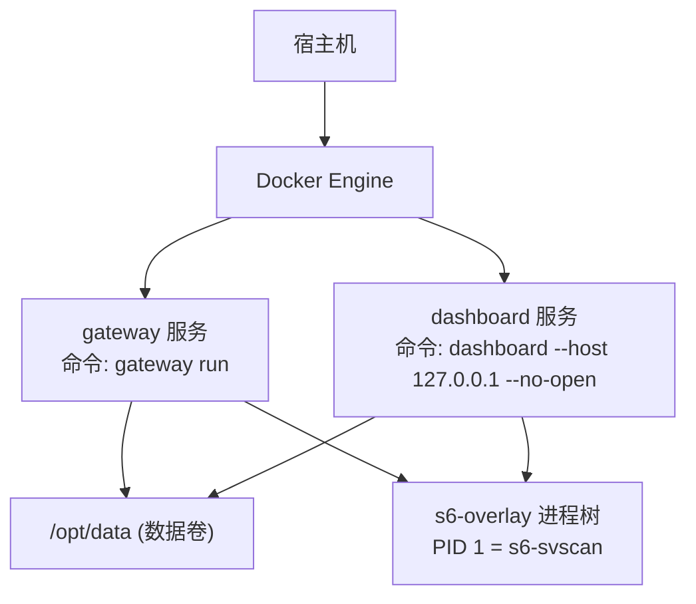
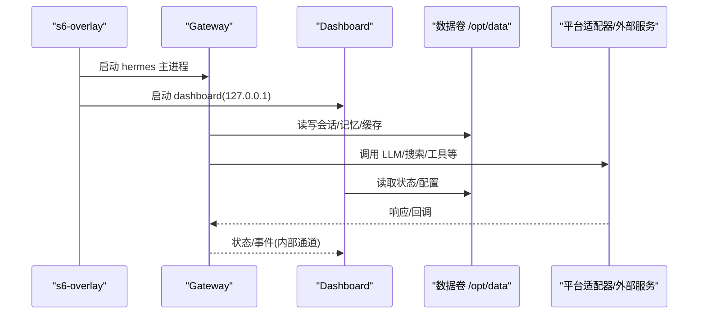
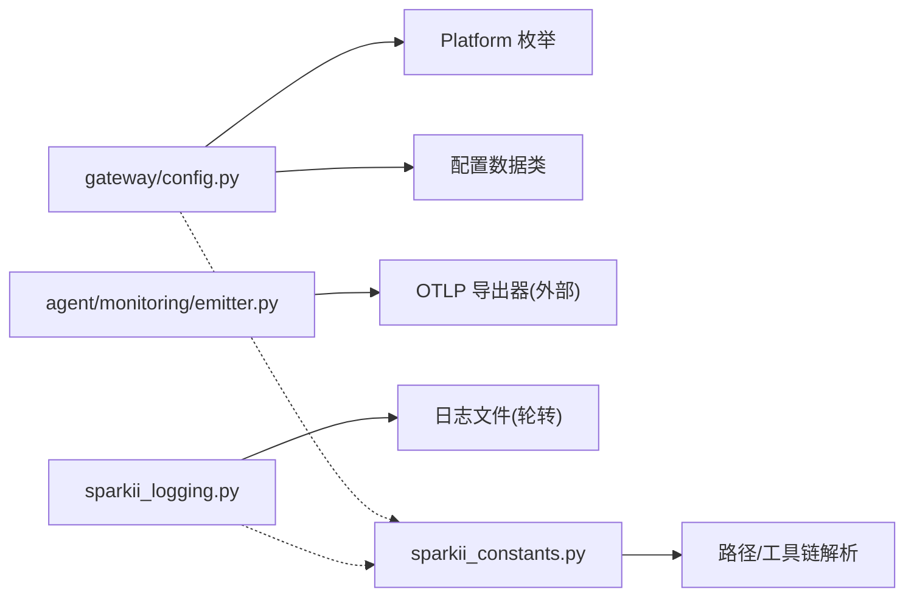

# 生产环境优化

<cite>
**本文引用的文件**
- [Dockerfile](file://Dockerfile)
- [docker-compose.yml](file://docker-compose.yml)
- [gateway/config.py](file://gateway/config.py)
- [sparkii_constants.py](file://sparkii_constants.py)
- [cli-config.yaml.example](file://cli-config.yaml.example)
- [agent/monitoring/emitter.py](file://agent/monitoring/emitter.py)
- [sparkii_logging.py](file://sparkii_logging.py)
</cite>

## 目录
1. [简介](#简介)
2. [项目结构](#项目结构)
3. [核心组件](#核心组件)
4. [架构总览](#架构总览)
5. [详细组件分析](#详细组件分析)
6. [依赖关系分析](#依赖关系分析)
7. [性能与容量规划](#性能与容量规划)
8. [高可用与故障转移](#高可用与故障转移)
9. [安全加固](#安全加固)
10. [监控与告警](#监控与告警)
11. [备份与灾难恢复](#备份与灾难恢复)
12. [故障排查指南](#故障排查指南)
13. [结论](#结论)

## 简介
本指南面向在生产环境中部署和运行 Hermes Agent（Gateway、Dashboard、CLI/TUI）的运维与平台团队，聚焦以下目标：
- 数据库连接与持久化优化（SQLite WAL/Journal 模式与文件系统兼容性）
- 内存管理与并发控制（会话并发上限、流式输出节流、后台任务批处理）
- 资源限制与配额（CPU/内存/磁盘 I/O/网络带宽在容器与沙箱中的配置）
- 高可用架构（多实例编排、负载均衡、故障转移、健康检查）
- 安全加固（最小权限、访问控制、审计日志）
- 监控与告警（指标采集、基准测试、异常检测）
- 容量规划与弹性伸缩（水平/垂直扩展策略）
- 备份与灾难恢复（数据卷、快照、演练）

## 项目结构
Hermes 的生产形态通常以容器化方式运行，包含 Gateway（消息网关）、Dashboard（Web 控制台）以及可选的 CLI/TUI。关键入口与编排如下：
- 容器镜像构建：通过 Dockerfile 安装系统依赖、Python/Node 工具链、s6-overlay 进程管理、预构建前端与 Python 依赖，并设置只读代码层与可写数据卷 /opt/data。
- 服务编排：docker-compose.yml 定义 gateway 与 dashboard 两个服务，默认绑定 host 网络，挂载 ~/.hermes 到 /opt/data，并通过环境变量注入密钥与平台配置。
- 运行时进程管理：s6-overlay 作为 PID 1，负责启动主 hermes 进程、dashboard 及按 profile 动态注册的 per-profile gateway 服务；stage2 hook 完成 UID/GID 重映射、数据卷权限初始化与配置预热。

图表来源
- [docker-compose.yml:29-77](file://docker-compose.yml#L29-L77)
- [Dockerfile:336-358](file://Dockerfile#L336-L358)

章节来源
- [docker-compose.yml:29-77](file://docker-compose.yml#L29-L77)
- [Dockerfile:54-91](file://Dockerfile#L54-L91)
- [Dockerfile:336-358](file://Dockerfile#L336-L358)

## 核心组件
- 网关配置中心：集中加载与校验平台接入、会话重置策略、流式输出参数等，提供类型安全的配置模型与环境变量覆盖。
- 监控发射器：热路径非阻塞的事件队列 + 后台分发线程，将指标/追踪/日志事件批量投递至 OTLP 导出器，失败隔离且不影响业务。
- 日志子系统：统一日志入口，按组件拆分文件（agent.log、errors.log、gateway.log、gui.log），支持轮转、敏感信息脱敏、跨进程并发写入与外部轮转感知。
- 常量与路径解析：SPARKII_HOME、profile 根目录、Node 工具链定位、工作区与可选技能/MCP 目录解析，确保多环境与容器下的稳定行为。

章节来源
- [gateway/config.py:1-120](file://gateway/config.py#L1-L120)
- [agent/monitoring/emitter.py:1-120](file://agent/monitoring/emitter.py#L1-L120)
- [sparkii_logging.py:1-120](file://sparkii_logging.py#L1-L120)
- [sparkii_constants.py:114-199](file://sparkii_constants.py#L114-L199)

## 架构总览
下图展示生产环境下 Gateway/Dashboard 的启动与数据流：s6-overlay 作为进程管理器，启动 hermes 主进程与 dashboard；Gateway 暴露平台适配器与 API Server（可选），Dashboard 仅本地回环监听；所有持久化数据位于 /opt/data。

图表来源
- [docker-compose.yml:29-77](file://docker-compose.yml#L29-L77)
- [Dockerfile:336-358](file://Dockerfile#L336-L358)

## 详细组件分析

### 数据库与持久化优化（SQLite）
- 建议启用 WAL 模式以获得更好的并发与崩溃恢复能力；若底层文件系统不支持 WAL（如某些 NFS/SMB/virtiofs 场景），显式切换为 DELETE 模式以避免兼容性问题。
- 可通过配置项调整 WAL 自动检查点间隔与日志大小上限，平衡吞吐与落盘压力。
- 容器镜像中已替换为修复版 SQLite 共享库，避免上游 WAL-reset 缺陷影响。

实践要点
- 在配置文件中设置 database.journal_mode 为 wal 或 delete（依据文件系统特性）。
- 结合日志轮转与定期 vacuum，控制数据库体积与碎片。
- 对高频写入路径进行批量化与合并提交，减少 fsync 次数。

章节来源
- [cli-config.yaml.example:8-20](file://cli-config.yaml.example#L8-L20)
- [Dockerfile:1-91](file://Dockerfile#L1-L91)

### 内存管理与并发控制
- 会话并发上限：通过全局 max_concurrent_sessions 限制同时活跃会话数，防止资源耗尽；达到上限时新会话快速失败，已有会话继续执行。
- 流式输出节流：streaming.edit_interval 与 buffer_threshold 控制编辑频率与缓冲阈值，避免下游平台限流或渲染抖动。
- 后台任务批处理：监控发射器使用固定大小队列与批量分发（_DRAIN_BATCH=256），降低网络/IO 开销；队列满时丢弃最旧事件，保证热路径不阻塞。

实践要点
- 根据 CPU/内存与下游平台速率限制，调优 streaming 参数。
- 合理设置 max_concurrent_sessions，结合资源配额与 SLA 评估。
- 监控监控发射器的 dropped/dispatched 统计，评估背压与丢包率。

章节来源
- [cli-config.yaml.example:742-755](file://cli-config.yaml.example#L742-L755)
- [cli-config.yaml.example:793-800](file://cli-config.yaml.example#L793-L800)
- [agent/monitoring/emitter.py:32-34](file://agent/monitoring/emitter.py#L32-L34)
- [agent/monitoring/emitter.py:91-117](file://agent/monitoring/emitter.py#L91-L117)

### 资源限制与配额管理
- 容器与沙箱资源：终端后端支持 docker/singularity/modal/daytona 等，可在配置中设置 container_cpu、container_memory、container_disk、container_persistent，实现每任务的资源隔离与配额。
- 进程级资源：通过 s6-overlay 与容器编排（cgroups）限制 CPU/内存；必要时结合 cgroup v2 控制器细化 IO 带宽与 IOPS。
- 网络带宽：在网关出口侧使用 tc/iptables 或云厂商 QoS 策略限制出站带宽，保护下游接口与成本。

实践要点
- 为每个终端任务分配最小必要资源，避免“邻居干扰”。
- 对长耗时任务启用持久化磁盘（按需），缩短冷启动时间。
- 对突发流量采用令牌桶/漏桶限速，平滑峰值。

章节来源
- [cli-config.yaml.example:330-337](file://cli-config.yaml.example#L330-L337)

### 高可用架构设计
- 多实例与负载均衡：Gateway 可水平扩展，配合反向代理（Nginx/HAProxy/云 LB）做请求分发；Dashboard 仅本地访问或通过 SSH 隧道暴露。
- 故障转移：s6-overlay 负责进程重启与健康检查；结合编排器（Kubernetes/Compose restart policy）实现节点级故障恢复。
- 数据备份：/opt/data 为持久化卷，建议定时快照（LVM/ZFS/云盘快照）与异地复制；重要配置与密钥纳入版本化管理。

实践要点
- 使用 healthcheck 探测 Gateway 端口与关键端点，未就绪则不参与流量。
- 配置滚动升级与蓝绿发布，降低变更风险。
- 建立 RTO/RPO 目标，制定备份与恢复演练计划。

章节来源
- [docker-compose.yml:29-77](file://docker-compose.yml#L29-L77)
- [Dockerfile:336-358](file://Dockerfile#L336-L358)

### 安全加固
- 最小权限：容器内以非 root 用户运行（hermes 用户），数据卷由 stage2 hook 正确 chown；Dashboard 默认仅监听 127.0.0.1，禁止直接公网暴露。
- 访问控制：API Server 需设置 API_SERVER_KEY 并在受信任网络暴露；平台接入使用 token 或 OAuth，遵循最小授权原则。
- 审计日志：统一日志写入 agent.log/errors.log/gateway.log/gui.log，开启敏感信息脱敏；结合集中式日志系统（ELK/Loki）与审计策略。

实践要点
- 使用反向代理+认证（JWT/OAuth）保护 Dashboard/API。
- 定期轮换密钥与证书，限制密钥可见范围。
- 开启防火墙白名单与入站/出站规则，阻断非必要通信。

章节来源
- [docker-compose.yml:13-27](file://docker-compose.yml#L13-L27)
- [sparkii_logging.py:1-28](file://sparkii_logging.py#L1-L28)
- [sparkii_logging.py:320-362](file://sparkii_logging.py#L320-L362)

### 监控与告警
- 指标采集：MonitoringEmitter 提供非阻塞 emit 接口，后台线程批量投递至 OTLP 导出器；支持订阅/取消订阅，失败隔离。
- 性能基准：基于上下文压缩阈值、流式编辑间隔、并发会话上限等关键参数进行压测，观察延迟、吞吐与错误率。
- 异常检测：结合 errors.log 与监控指标（dropped、dispatched、队列长度）设定阈值告警；对平台适配器超时、LLM 限流、磁盘空间不足等进行预警。

实践要点
- 在 CI/CD 中集成基准测试，对比版本变更的性能回归。
- 将监控数据接入 Prometheus/Grafana，设置 SLO 与告警规则。
- 对关键路径添加埋点（请求时长、重试次数、失败原因）。

章节来源
- [agent/monitoring/emitter.py:1-120](file://agent/monitoring/emitter.py#L1-L120)
- [agent/monitoring/emitter.py:152-164](file://agent/monitoring/emitter.py#L152-L164)
- [sparkii_logging.py:320-362](file://sparkii_logging.py#L320-L362)

### 容量规划与弹性伸缩
- 水平扩展：Gateway 无状态化（会话状态外置存储），通过 LB 横向扩容；Dashboard 轻量，单实例即可。
- 垂直扩展：根据负载曲线提升 CPU/内存配额；对 I/O 密集型任务增加磁盘 IOPS。
- 弹性伸缩：基于 CPU/内存/队列深度/请求延迟触发扩缩容；冷启动优化（预构建前端、预装依赖、WAL 优化）。

实践要点
- 定义扩缩容阈值与冷却时间，避免震荡。
- 使用就绪探针与优雅关闭，确保流量无损迁移。
- 对大上下文场景启用压缩与缓存，降低请求体与重复计算。

章节来源
- [cli-config.yaml.example:407-579](file://cli-config.yaml.example#L407-L579)
- [Dockerfile:269-277](file://Dockerfile#L269-L277)

### 备份与灾难恢复
- 数据卷备份：/opt/data 包含会话、记忆、缓存与配置，建议每日增量+每周全量备份，保留策略符合合规要求。
- 快照与复制：利用云盘快照或存储层复制实现异地容灾；关键配置纳入 Git 版本管理。
- 恢复演练：定期演练从备份恢复流程，验证 RTO/RPO 达标；记录恢复步骤与问题清单。

实践要点
- 备份前暂停写入或进入只读模式，保证一致性。
- 恢复后校验数据完整性与可用性（登录、对话、工具调用）。
- 建立应急联系人矩阵与升级路径。

章节来源
- [docker-compose.yml:36-77](file://docker-compose.yml#L36-L77)

## 依赖关系分析
Gateway 配置模块依赖平台枚举与配置模型，监控发射器提供统一事件出口，日志子系统提供统一写入与轮转，常量模块提供路径与工具链解析。

图表来源
- [gateway/config.py:272-395](file://gateway/config.py#L272-L395)
- [agent/monitoring/emitter.py:1-120](file://agent/monitoring/emitter.py#L1-L120)
- [sparkii_logging.py:320-362](file://sparkii_logging.py#L320-L362)
- [sparkii_constants.py:114-199](file://sparkii_constants.py#L114-L199)

章节来源
- [gateway/config.py:272-395](file://gateway/config.py#L272-L395)
- [agent/monitoring/emitter.py:1-120](file://agent/monitoring/emitter.py#L1-L120)
- [sparkii_logging.py:320-362](file://sparkii_logging.py#L320-L362)
- [sparkii_constants.py:114-199](file://sparkii_constants.py#L114-L199)

## 性能与容量规划
- 数据库：优先 WAL 模式，必要时降级为 DELETE；调整检查点与日志大小；定期 vacuum。
- 内存：限制最大并发会话，启用上下文压缩，减少历史上下文体积；监控堆内存与 GC 行为。
- 并发：调优流式编辑间隔与缓冲阈值；对后台任务使用批处理与退避重试。
- I/O：使用 SSD/NVMe 存储，限制日志轮转大小与备份数量；对频繁写入路径进行合并与异步化。
- 网络：设置合理的超时与重试策略，避免雪崩；对第三方 API 实施熔断与降级。

[本节为通用指导，无需特定文件引用]

## 高可用与故障转移
- 多实例：Gateway 水平扩展，Dashboard 单实例；使用 LB 分发请求，健康检查剔除不健康实例。
- 故障转移：s6-overlay 自动重启失败进程；编排器重启容器；数据卷共享保证状态一致。
- 数据一致性：WAL 模式提高崩溃恢复能力；备份与快照确保数据可回溯。

章节来源
- [docker-compose.yml:29-77](file://docker-compose.yml#L29-L77)
- [Dockerfile:336-358](file://Dockerfile#L336-L358)

## 安全加固
- 最小权限：容器非 root 运行，数据卷权限由 stage2 hook 设置；Dashboard 仅本地访问。
- 访问控制：API Server 需要密钥；平台接入使用 token/OAuth；限制入站/出站网络。
- 审计日志：统一日志写入，敏感信息脱敏；集中收集与分析。

章节来源
- [docker-compose.yml:13-27](file://docker-compose.yml#L13-L27)
- [sparkii_logging.py:1-28](file://sparkii_logging.py#L1-L28)
- [sparkii_logging.py:320-362](file://sparkii_logging.py#L320-L362)

## 监控与告警
- 指标采集：MonitoringEmitter 非阻塞 emit，后台批量投递；统计 dropped/dispatched/队列长度。
- 基准测试：基于上下文压缩、流式输出、并发会话等参数进行压测，评估延迟与吞吐。
- 异常检测：errors.log 与监控指标联动，设置阈值告警；对平台适配器超时、LLM 限流、磁盘空间不足预警。

章节来源
- [agent/monitoring/emitter.py:1-120](file://agent/monitoring/emitter.py#L1-L120)
- [agent/monitoring/emitter.py:152-164](file://agent/monitoring/emitter.py#L152-L164)
- [sparkii_logging.py:320-362](file://sparkii_logging.py#L320-L362)

## 备份与灾难恢复
- 数据卷备份：/opt/data 定时快照与异地复制；关键配置版本化管理。
- 恢复演练：定期演练恢复流程，验证 RTO/RPO；记录问题与改进措施。
- 一致性保障：WAL 模式与快照结合，确保数据可恢复。

章节来源
- [docker-compose.yml:36-77](file://docker-compose.yml#L36-L77)

## 故障排查指南
- 日志定位：查看 agent.log/errors.log/gateway.log/gui.log，关注 session_id 标签；使用组件过滤筛选相关日志。
- 监控诊断：检查 MonitoringEmitter 的 dropped/dispatched 统计，评估背压与丢包；观察队列长度与分发延迟。
- 常见问题：
  - 日志轮转失败：Windows 下 concurrent-log-handler 锁超时被抑制；确认文件句柄占用与权限。
  - 数据库损坏：WAL 模式与文件系统兼容性；必要时切换到 DELETE 模式并重建索引。
  - 平台限流：调整流式编辑间隔与缓冲阈值；实施重试与退避。

章节来源
- [sparkii_logging.py:42-70](file://sparkii_logging.py#L42-L70)
- [sparkii_logging.py:521-535](file://sparkii_logging.py#L521-L535)
- [cli-config.yaml.example:8-20](file://cli-config.yaml.example#L8-L20)
- [cli-config.yaml.example:793-800](file://cli-config.yaml.example#L793-L800)

## 结论
通过合理的数据库配置、内存与并发调优、资源配额管理、高可用编排、安全加固、监控告警与备份恢复策略，Hermes Agent 可在生产环境中稳定、高效地运行。建议持续进行基准测试与容量规划，结合监控指标与日志分析，不断优化系统性能与可靠性。

[本节为总结性内容，无需特定文件引用]