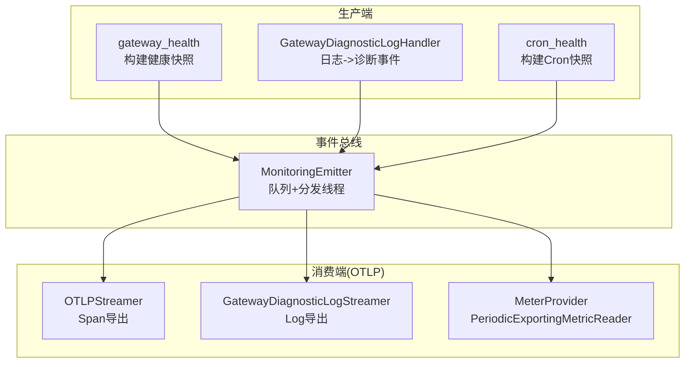
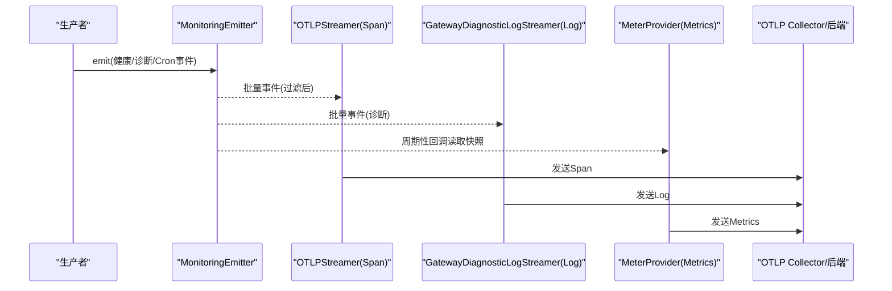
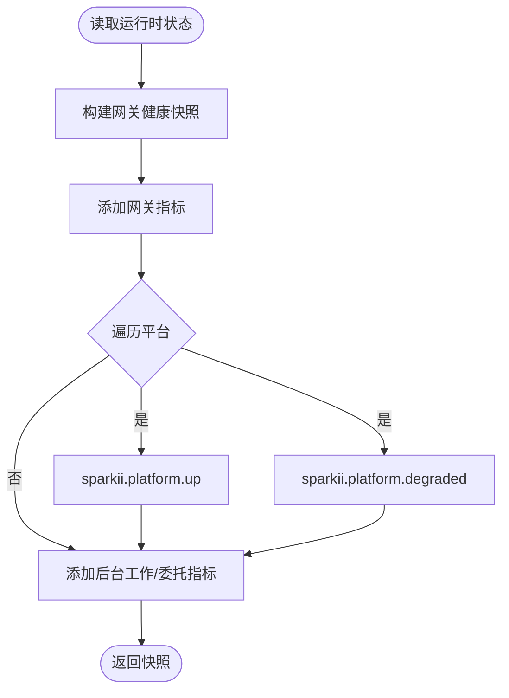
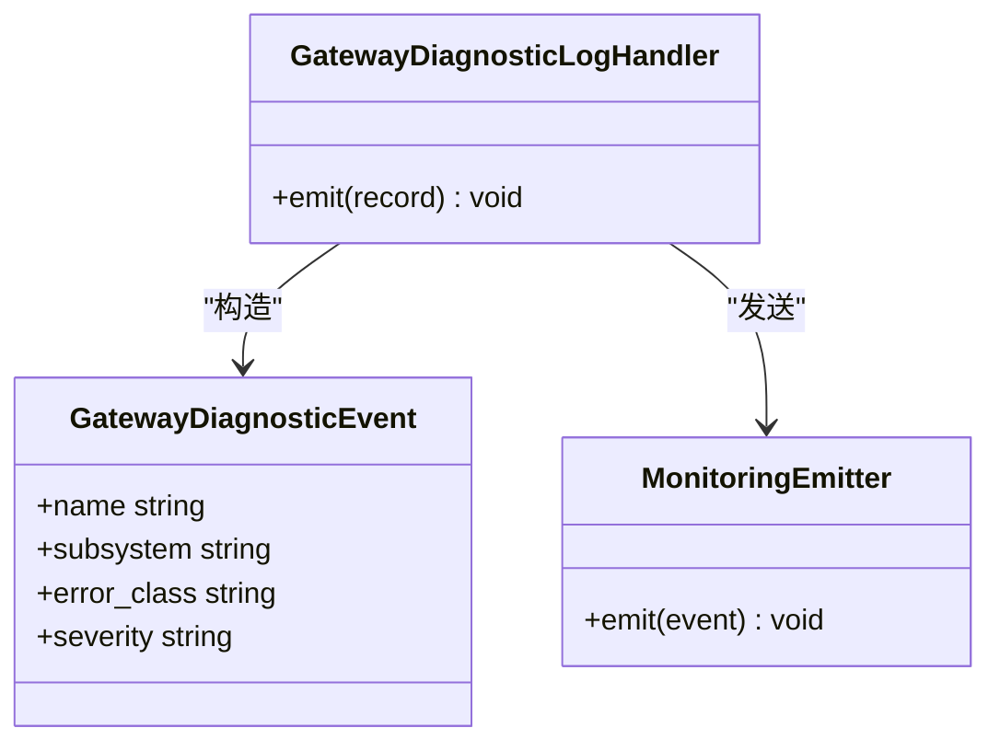
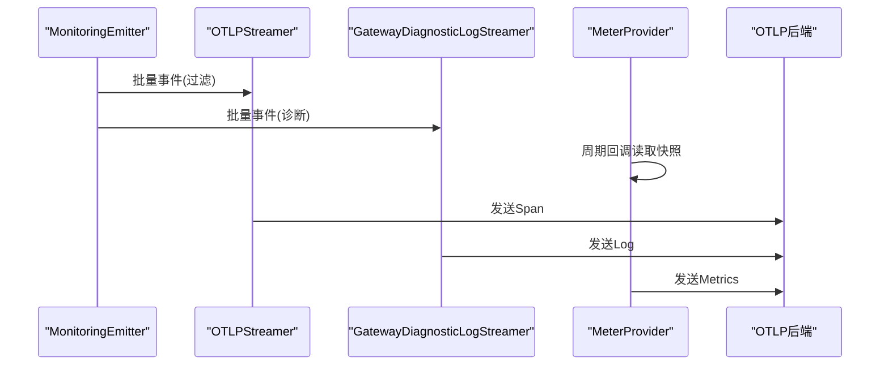
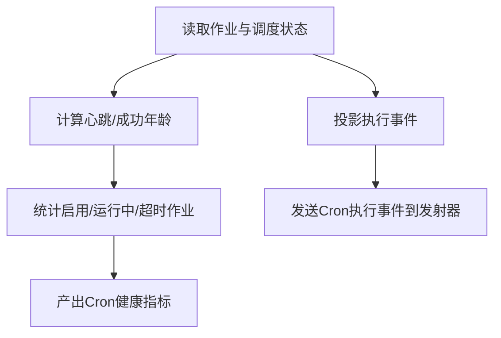
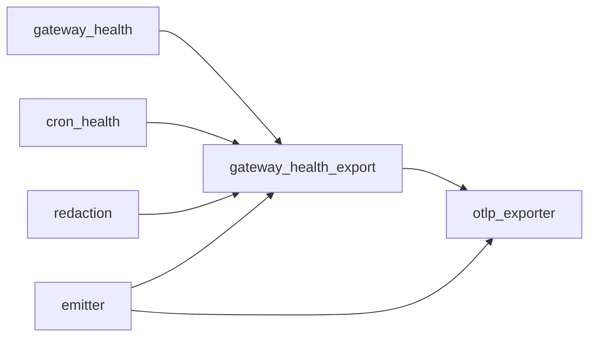

# 指标收集系统

<cite>
**本文引用的文件**
- [agent/monitoring/__init__.py](file://agent/monitoring/__init__.py)
- [agent/monitoring/emitter.py](file://agent/monitoring/emitter.py)
- [agent/monitoring/events.py](file://agent/monitoring/events.py)
- [agent/monitoring/gateway_health.py](file://agent/monitoring/gateway_health.py)
- [agent/monitoring/gateway_health_export.py](file://agent/monitoring/gateway_health_export.py)
- [agent/monitoring/otlp_exporter.py](file://agent/monitoring/otlp_exporter.py)
- [agent/monitoring/cron_health.py](file://agent/monitoring/cron_health.py)
- [agent/monitoring/redaction.py](file://agent/monitoring/redaction.py)
- [tools/lazy_deps.py](file://tools/lazy_deps.py)
</cite>

## 目录
1. [简介](#简介)
2. [项目结构](#项目结构)
3. [核心组件](#核心组件)
4. [架构总览](#架构总览)
5. [详细组件分析](#详细组件分析)
6. [依赖关系分析](#依赖关系分析)
7. [性能与优化](#性能与优化)
8. [故障排查指南](#故障排查指南)
9. [结论](#结论)
10. [附录](#附录)

## 简介
本文件面向“指标收集系统”，聚焦 OpenTelemetry（OTLP）集成、指标导出器配置、数据流处理与性能优化。文档覆盖的关键监控指标包括：网关健康状态、平台健康与降级、定时任务（Cron）运行状况、后台工作负载与委托计数等。同时提供指标采集配置示例（自定义指标注册、聚合策略、采样设置）、存储后端配置与保留策略建议，以及仪表板配置与告警规则模板指引。

## 项目结构
监控子系统位于 agent/monitoring，采用“生产者-事件总线-消费者”的解耦设计：
- 生产者：网关健康快照、诊断日志桥接、Cron 执行事件等
- 事件总线：emitter（无阻塞队列 + 后台分发线程）
- 消费者：OTLP Span/Log/Metric 导出器，将数据发送至外部可观测性后端

**图表来源**
- [agent/monitoring/gateway_health.py:210-291](file://agent/monitoring/gateway_health.py#L210-L291)
- [agent/monitoring/gateway_health.py:427-459](file://agent/monitoring/gateway_health.py#L427-L459)
- [agent/monitoring/cron_health.py:148-192](file://agent/monitoring/cron_health.py#L148-L192)
- [agent/monitoring/emitter.py:36-117](file://agent/monitoring/emitter.py#L36-L117)
- [agent/monitoring/otlp_exporter.py:182-215](file://agent/monitoring/otlp_exporter.py#L182-L215)
- [agent/monitoring/gateway_health_export.py:485-549](file://agent/monitoring/gateway_health_export.py#L485-L549)
- [agent/monitoring/gateway_health_export.py:417-468](file://agent/monitoring/gateway_health_export.py#L417-L468)

**章节来源**
- [agent/monitoring/__init__.py:1-30](file://agent/monitoring/__init__.py#L1-L30)
- [agent/monitoring/emitter.py:1-212](file://agent/monitoring/emitter.py#L1-L212)

## 核心组件
- 事件模型：统一的事件类型用于健康快照、诊断事件与 Cron 执行事件，确保内容安全与结构化。
- 健康快照：从运行时状态构建网关与平台健康指标，并生成诊断事件。
- 日志桥接：仅允许白名单日志源，将警告/错误日志转换为诊断事件。
- OTLP 导出：支持 Span、Log、Metric 三种导出方式，均通过可选 SDK 懒加载。
- Cron 健康：采集调度心跳、最近成功时间、积压次数、作业数与运行中作业数。
- 资源属性与脱敏：统一的资源标签白名单与字符串脱敏，避免敏感信息外泄。

**章节来源**
- [agent/monitoring/events.py:19-87](file://agent/monitoring/events.py#L19-L87)
- [agent/monitoring/gateway_health.py:20-43](file://agent/monitoring/gateway_health.py#L20-L43)
- [agent/monitoring/gateway_health_export.py:22-44](file://agent/monitoring/gateway_health_export.py#L22-L44)
- [agent/monitoring/redaction.py:1-72](file://agent/monitoring/redaction.py#L1-L72)

## 架构总览
下图展示了从生产端到 OTLP 后端的完整数据流，包含指标、日志与追踪三类信号。

**图表来源**
- [agent/monitoring/emitter.py:53-117](file://agent/monitoring/emitter.py#L53-L117)
- [agent/monitoring/otlp_exporter.py:166-215](file://agent/monitoring/otlp_exporter.py#L166-L215)
- [agent/monitoring/gateway_health_export.py:485-549](file://agent/monitoring/gateway_health_export.py#L485-L549)
- [agent/monitoring/gateway_health_export.py:417-468](file://agent/monitoring/gateway_health_export.py#L417-L468)

## 详细组件分析

### 健康快照与指标定义
- 网关指标
  - sparkii.gateway.up：网关是否存活
  - sparkii.gateway.state：网关状态（枚举化）
  - sparkii.gateway.active_agents：活跃代理数
  - sparkii.gateway.busy：是否繁忙
  - sparkii.gateway.drainable：是否可排空
  - sparkii.gateway.restart_requested：是否请求重启
  - sparkii.gateway.background_work：后台工作总量（子代理、终端进程等）
  - sparkii.gateway.background_delegations：后台委托单元数（并发槽位视角）
- 平台指标
  - sparkii.platform.up：平台是否可用
  - sparkii.platform.degraded：平台是否降级（含错误分类）
- Cron 指标
  - sparkii.cron.scheduler.heartbeat_age_seconds：心跳年龄
  - sparkii.cron.scheduler.last_success_age_seconds：最近成功年龄
  - sparkii.cron.scheduler.catch_up_occurrences：追赶次数
  - sparkii.cron.jobs.enabled：启用作业数
  - sparkii.cron.jobs.running：运行中作业数
  - sparkii.cron.jobs.overdue：超时作业数

**图表来源**
- [agent/monitoring/gateway_health.py:210-291](file://agent/monitoring/gateway_health.py#L210-L291)
- [agent/monitoring/gateway_health_export.py:358-401](file://agent/monitoring/gateway_health_export.py#L358-L401)

**章节来源**
- [agent/monitoring/gateway_health.py:210-291](file://agent/monitoring/gateway_health.py#L210-L291)
- [agent/monitoring/gateway_health_export.py:437-468](file://agent/monitoring/gateway_health_export.py#L437-L468)
- [agent/monitoring/cron_health.py:148-192](file://agent/monitoring/cron_health.py#L148-L192)

### 诊断日志桥接与事件映射
- 仅允许白名单日志源（如 gateway.*），并将消息分类为错误类别（认证失败、限流、超时、网络错误、配置无效、启动失败、平台致命等）。
- 将日志记录转换为 GatewayDiagnosticEvent，并通过 emitter 发送到 OTLP Log 或 Span。

**图表来源**
- [agent/monitoring/gateway_health.py:427-459](file://agent/monitoring/gateway_health.py#L427-L459)
- [agent/monitoring/events.py:45-63](file://agent/monitoring/events.py#L45-L63)
- [agent/monitoring/emitter.py:53-77](file://agent/monitoring/emitter.py#L53-L77)

**章节来源**
- [agent/monitoring/gateway_health.py:45-100](file://agent/monitoring/gateway_health.py#L45-L100)
- [agent/monitoring/gateway_health.py:427-459](file://agent/monitoring/gateway_health.py#L427-L459)

### OTLP 导出器（Span/Log/Metrics）
- Span 导出：将监控事件映射为 OTel Span，附带事件类型与受限属性。
- Log 导出：将诊断事件映射为 OTel Log，使用批处理器与资源属性。
- Metrics 导出：使用 MeterProvider + PeriodicExportingMetricReader 周期性拉取快照并上报。

**图表来源**
- [agent/monitoring/otlp_exporter.py:166-215](file://agent/monitoring/otlp_exporter.py#L166-L215)
- [agent/monitoring/gateway_health_export.py:485-549](file://agent/monitoring/gateway_health_export.py#L485-L549)
- [agent/monitoring/gateway_health_export.py:417-468](file://agent/monitoring/gateway_health_export.py#L417-L468)

**章节来源**
- [agent/monitoring/otlp_exporter.py:107-133](file://agent/monitoring/otlp_exporter.py#L107-L133)
- [agent/monitoring/otlp_exporter.py:182-215](file://agent/monitoring/otlp_exporter.py#L182-L215)
- [agent/monitoring/gateway_health_export.py:417-468](file://agent/monitoring/gateway_health_export.py#L417-L468)

### Cron 健康与执行事件
- 健康快照：心跳年龄、最近成功年龄、追赶次数、作业数量与运行中作业数。
- 执行事件：将作业执行记录投影为 CronExecutionEvent，包含状态、耗时、投递结果与错误分类。

**图表来源**
- [agent/monitoring/cron_health.py:148-192](file://agent/monitoring/cron_health.py#L148-L192)
- [agent/monitoring/cron_health.py:90-130](file://agent/monitoring/cron_health.py#L90-L130)

**章节来源**
- [agent/monitoring/cron_health.py:90-130](file://agent/monitoring/cron_health.py#L90-L130)
- [agent/monitoring/cron_health.py:148-192](file://agent/monitoring/cron_health.py#L148-L192)

## 依赖关系分析
- 可选依赖：OpenTelemetry SDK 与 OTLP HTTP 导出器通过 tools.lazy_deps 懒加载，仅在启用时安装/导入。
- 模块耦合：
  - gateway_health_export 依赖 gateway_health、cron_health、redaction、otlp_exporter
  - otlp_exporter 依赖 gateway_health_export 的资源属性构建函数（调用时机延迟以避免循环导入）
  - emitter 独立于具体导出器，仅负责事件分发

**图表来源**
- [agent/monitoring/gateway_health_export.py:167-182](file://agent/monitoring/gateway_health_export.py#L167-L182)
- [agent/monitoring/otlp_exporter.py:118-133](file://agent/monitoring/otlp_exporter.py#L118-L133)
- [tools/lazy_deps.py:124-128](file://tools/lazy_deps.py#L124-L128)

**章节来源**
- [tools/lazy_deps.py:124-128](file://tools/lazy_deps.py#L124-L128)
- [agent/monitoring/otlp_exporter.py:118-133](file://agent/monitoring/otlp_exporter.py#L118-L133)

## 性能与优化
- 热路径不变式：emitter.emit() 必须微秒级返回，不阻塞磁盘/网络，绝不抛出异常；队列满时丢弃最旧事件，保证内存有界。
- 批量处理：分发线程以批次（默认256）推送给订阅者，降低开销。
- 指标拉取：PeriodicExportingMetricReader 按配置间隔拉取快照，避免高频写入。
- 日志导出：BatchLogRecordProcessor 批量发送日志，减少网络往返。
- 资源属性白名单：限制资源标签键值，避免不必要的数据膨胀。
- 脱敏：所有出站字符串经过 redact_for_export，防止敏感信息泄露。

**章节来源**
- [agent/monitoring/emitter.py:1-20](file://agent/monitoring/emitter.py#L1-L20)
- [agent/monitoring/emitter.py:32-34](file://agent/monitoring/emitter.py#L32-L34)
- [agent/monitoring/gateway_health_export.py:425-427](file://agent/monitoring/gateway_health_export.py#L425-L427)
- [agent/monitoring/gateway_health_export.py:496-499](file://agent/monitoring/gateway_health_export.py#L496-L499)
- [agent/monitoring/redaction.py:58-66](file://agent/monitoring/redaction.py#L58-L66)

## 故障排查指南
- OTLP SDK 不可用：当 monitoring.export.otlp.enabled 但无法导入 SDK 时，会提示安装可选依赖。请确认已安装对应 extra。
- 端点未配置：若 endpoint 缺失，构建导出器时会报错；请检查 monitoring.export.otlp.endpoint。
- 诊断事件未导出：确认 monitoring.gateway_health_export.enabled 与 diagnostic_events_enabled 开关，以及 event_filter 是否正确。
- 指标未上报：检查 metrics_enabled 与 export_interval_seconds；确认 PeriodicExportingMetricReader 正常创建。
- 日志桥接未生效：确认 warning_error_events_enabled 与 root logger 已附加 handler。

**章节来源**
- [agent/monitoring/otlp_exporter.py:218-230](file://agent/monitoring/otlp_exporter.py#L218-L230)
- [agent/monitoring/otlp_exporter.py:107-115](file://agent/monitoring/otlp_exporter.py#L107-L115)
- [agent/monitoring/gateway_health_export.py:178-182](file://agent/monitoring/gateway_health_export.py#L178-L182)
- [agent/monitoring/gateway_health_export.py:571-580](file://agent/monitoring/gateway_health_export.py#L571-L580)

## 结论
该指标收集系统以“内容安全、热路径零影响”为核心原则，通过事件总线与 OTLP 导出器实现网关健康、平台状态、Cron 运行与后台负载的可观测性。其模块化设计与懒加载机制便于扩展与运维，配合合理的指标定义、资源属性与脱敏策略，可在多种部署环境中稳定运行。

## 附录

### 指标采集配置示例
以下为常见配置项说明（字段名与层级依据代码解析逻辑）：
- monitoring.export.otlp
  - enabled: 布尔，启用 OTLP 导出
  - endpoint: 字符串，OTLP 服务端点（支持 /v1/traces、/v1/metrics、/v1/logs 自动转换）
  - headers_env: 字典，{HTTP头名: 环境变量名}，在导出时从环境读取，不持久化
- monitoring.gateway_health_export
  - enabled: 布尔，启用网关健康导出
  - metrics_enabled: 布尔，启用指标导出
  - diagnostic_events_enabled: 布尔，启用诊断事件导出
  - warning_error_events_enabled: 布尔，启用日志桥接（仅警告/错误）
  - export_interval_seconds: 整数，指标拉取间隔（毫秒=秒×1000）
  - logs_export_interval_seconds: 整数，快照事件导出间隔
  - resource_attributes: 字典，资源属性白名单（service.name、service.instance.id、service.version、deployment.environment.name、cloud.provider、cloud.platform、cloud.region、telemetry.scope）

注意：
- 指标名称已在代码中固定注册（见指标定义部分），如需新增指标，请在 _start_metric_provider 的 metric_names 列表中添加，并在快照构建处补充相应指标。
- 采样策略：当前指标通过 PeriodicExportingMetricReader 周期性拉取，未暴露细粒度采样开关；可通过调整 export_interval_seconds 控制频率。

**章节来源**
- [agent/monitoring/gateway_health_export.py:167-182](file://agent/monitoring/gateway_health_export.py#L167-L182)
- [agent/monitoring/gateway_health_export.py:417-468](file://agent/monitoring/gateway_health_export.py#L417-L468)
- [agent/monitoring/gateway_health_export.py:231-242](file://agent/monitoring/gateway_health_export.py#L231-L242)
- [agent/monitoring/gateway_health_export.py:77-88](file://agent/monitoring/gateway_health_export.py#L77-L88)

### 关键监控指标定义（摘要）
- 网关健康
  - sparkii.gateway.up、sparkii.gateway.state、sparkii.gateway.active_agents、sparkii.gateway.busy、sparkii.gateway.drainable、sparkii.gateway.restart_requested
  - sparkii.gateway.background_work、sparkii.gateway.background_delegations
- 平台健康
  - sparkii.platform.up、sparkii.platform.degraded（含 error_code/error_class）
- Cron 健康
  - sparkii.cron.scheduler.heartbeat_age_seconds、sparkii.cron.scheduler.last_success_age_seconds、sparkii.cron.scheduler.catch_up_occurrences
  - sparkii.cron.jobs.enabled、sparkii.cron.jobs.running、sparkii.cron.jobs.overdue

**章节来源**
- [agent/monitoring/gateway_health.py:230-264](file://agent/monitoring/gateway_health.py#L230-L264)
- [agent/monitoring/gateway_health_export.py:437-454](file://agent/monitoring/gateway_health_export.py#L437-L454)
- [agent/monitoring/cron_health.py:148-192](file://agent/monitoring/cron_health.py#L148-L192)

### 存储后端配置与数据保留策略建议
- 后端选择：OTLP Collector 作为统一接入层，可对接 Prometheus、Grafana、Jaeger、DataDog、Elasticsearch 等。
- 指标保留：建议在 Collector 侧配置指标聚合与落盘策略（例如按维度分桶、TTL 清理）。
- 日志保留：对诊断日志进行分级存储（warning/error 高优先级），结合索引与过期策略。
- 追踪保留：若启用追踪，建议按服务/环境分离存储，并对长尾链路做采样与裁剪。

[本节为通用实践建议，不直接引用具体代码文件]

### 仪表板配置指南（概念性）
- 网关健康面板
  - 展示 sparkii.gateway.up、sparkii.gateway.state、sparkii.gateway.active_agents、sparkii.gateway.busy、sparkii.gateway.drainable
  - 叠加 sparkii.gateway.background_work、sparkii.gateway.background_delegations 观察负载压力
- 平台健康面板
  - 展示 sparkii.platform.up、sparkii.platform.degraded，按 platform 维度分组
- Cron 面板
  - 展示心跳年龄、最近成功年龄、catch_up_occurrences、enabled/running/overdue 作业数
- 诊断事件面板
  - 基于 Sparki 诊断事件（gateway_diagnostic）展示 error_class、severity、subsystem 分布

[本节为概念性指导，不直接引用具体代码文件]

### 告警规则模板（概念性）
- 网关健康
  - 若 sparkii.gateway.up == 0 持续 N 分钟，触发严重告警
  - 若 sparkii.gateway.state != "running"/"ready" 持续 N 分钟，触发警告
- 平台健康
  - 若 sparkii.platform.degraded > 0 且持续 N 分钟，触发警告/严重（根据 error_class）
- Cron 健康
  - 若 sparkii.cron.scheduler.heartbeat_age_seconds > 阈值，触发警告
  - 若 sparkii.cron.jobs.overdue > 0 持续 N 分钟，触发警告
- 负载压力
  - 若 sparkii.gateway.background_work 或 background_delegations 超过容量上限，触发警告

[本节为概念性指导，不直接引用具体代码文件]