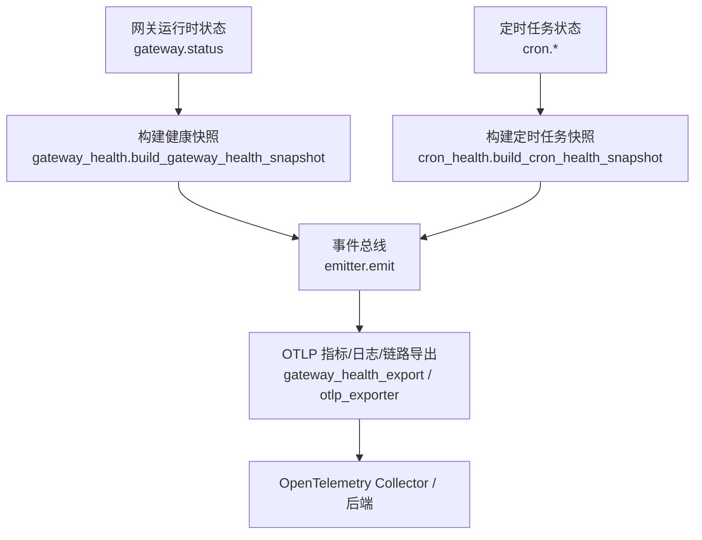
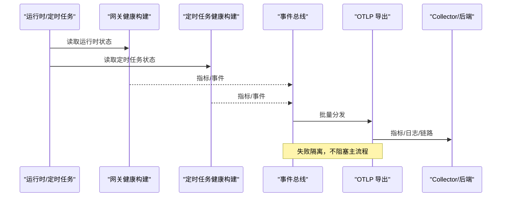
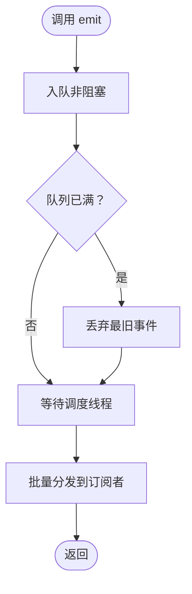
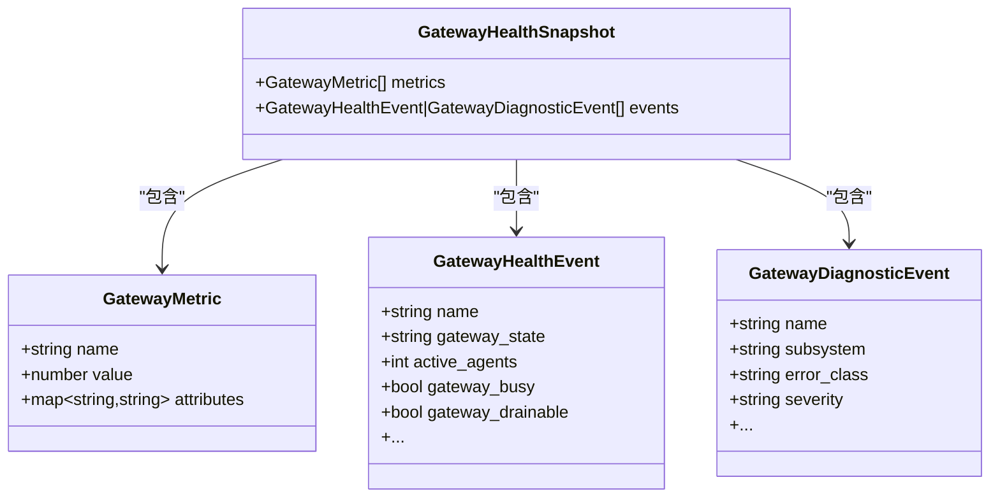
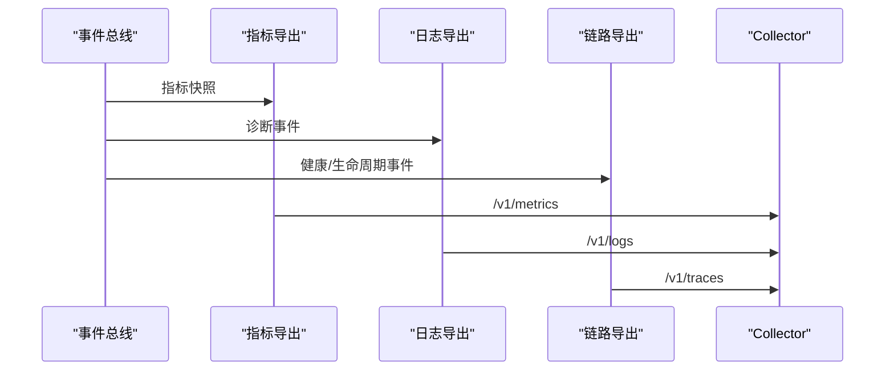
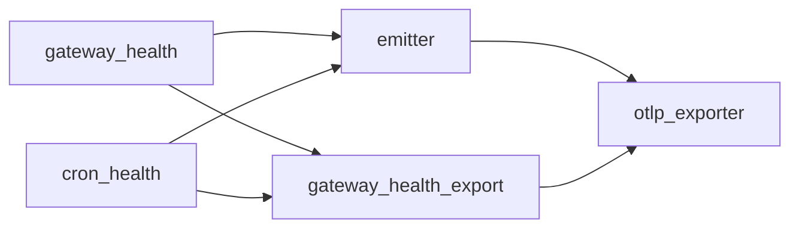

# 监控告警系统

<cite>
**本文引用的文件**
- [agent/monitoring/__init__.py](file://agent/monitoring/__init__.py)
- [agent/monitoring/emitter.py](file://agent/monitoring/emitter.py)
- [agent/monitoring/events.py](file://agent/monitoring/events.py)
- [agent/monitoring/gateway_health.py](file://agent/monitoring/gateway_health.py)
- [agent/monitoring/cron_health.py](file://agent/monitoring/cron_health.py)
- [agent/monitoring/gateway_health_export.py](file://agent/monitoring/gateway_health_export.py)
- [agent/monitoring/otlp_exporter.py](file://agent/monitoring/otlp_exporter.py)
- [agent/monitoring/policy.py](file://agent/monitoring/policy.py)
- [agent/monitoring/redaction.py](file://agent/monitoring/redaction.py)
- [docs/observability/monitoring.md](file://docs/observability/monitoring.md)
</cite>

## 目录
1. [简介](#简介)
2. [项目结构](#项目结构)
3. [核心组件](#核心组件)
4. [架构总览](#架构总览)
5. [详细组件分析](#详细组件分析)
6. [依赖关系分析](#依赖关系分析)
7. [性能考量](#性能考量)
8. [故障排查指南](#故障排查指南)
9. [结论](#结论)
10. [附录](#附录)

## 简介
本指南面向部署与运维人员，系统化说明该项目的监控告警体系：指标采集、日志聚合与链路追踪的集成方式；关键监控指标定义（系统资源、应用性能、业务运行态）；告警规则配置（阈值、级别、通知渠道）；日志管理策略（轮转、分析、合规）；健康检查端点与故障检测机制；以及仪表板与告警通知模板建议。整体设计遵循“内容安全”原则：仅导出无敏感内容的结构化信号，所有出站字符串均经过脱敏处理。

## 项目结构
监控子系统位于 agent/monitoring，围绕“事件发射器 + 多路导出”的架构组织：
- 事件模型与类型：events.py
- 热路径事件总线：emitter.py
- 网关健康与诊断信号：gateway_health.py
- 定时任务健康与执行投影：cron_health.py
- OTLP 指标/日志/链路导出：otlp_exporter.py、gateway_health_export.py
- 安装标识与隐私策略：policy.py、redaction.py
- 用户文档与示例：docs/observability/monitoring.md

图表来源
- [agent/monitoring/gateway_health.py:210-291](file://agent/monitoring/gateway_health.py#L210-L291)
- [agent/monitoring/cron_health.py:148-192](file://agent/monitoring/cron_health.py#L148-L192)
- [agent/monitoring/emitter.py:52-116](file://agent/monitoring/emitter.py#L52-L116)
- [agent/monitoring/gateway_health_export.py:417-468](file://agent/monitoring/gateway_health_export.py#L417-L468)
- [agent/monitoring/otlp_exporter.py:166-203](file://agent/monitoring/otlp_exporter.py#L166-L203)

章节来源
- [agent/monitoring/__init__.py:1-30](file://agent/monitoring/__init__.py#L1-L30)
- [docs/observability/monitoring.md:1-30](file://docs/observability/monitoring.md#L1-L30)

## 核心组件
- 事件总线（MonitoringEmitter）：提供 O(微秒级) 非阻塞 emit，队列满时丢弃最旧事件，后台线程批量分发到订阅者，失败隔离且不影响主流程。
- 事件模型：GatewayHealthEvent、GatewayDiagnosticEvent、CronExecutionEvent，均为无内容或受限字段的结构化事件。
- 网关健康与诊断：从运行时状态构建指标与事件，包含网关/平台上下线、繁忙度、可排空性、重启请求等；对错误文本进行分类并限制长度。
- 定时任务健康：收集心跳年龄、最近成功时间、积压次数、启用/运行/过期作业数等指标；将执行生命周期投影为事件。
- OTLP 导出：支持指标（MeterProvider）、日志（LoggerProvider）、链路（TracerProvider）三种通道，按配置开启；通过 headers_env 注入认证头。
- 隐私与安全：redaction 对所有出站字符串进行强制脱敏；policy 维护稳定实例标识用于区分不同部署。

章节来源
- [agent/monitoring/emitter.py:1-212](file://agent/monitoring/emitter.py#L1-L212)
- [agent/monitoring/events.py:1-87](file://agent/monitoring/events.py#L1-L87)
- [agent/monitoring/gateway_health.py:1-470](file://agent/monitoring/gateway_health.py#L1-L470)
- [agent/monitoring/cron_health.py:1-202](file://agent/monitoring/cron_health.py#L1-L202)
- [agent/monitoring/otlp_exporter.py:1-271](file://agent/monitoring/otlp_exporter.py#L1-L271)
- [agent/monitoring/gateway_health_export.py:1-644](file://agent/monitoring/gateway_health_export.py#L1-L644)
- [agent/monitoring/redaction.py:1-72](file://agent/monitoring/redaction.py#L1-L72)
- [agent/monitoring/policy.py:1-58](file://agent/monitoring/policy.py#L1-L58)

## 架构总览
监控数据流分为三层：
- 采集层：从网关运行时状态与定时任务子系统读取指标，生成结构化事件。
- 传输层：通过事件总线缓冲与批处理，降低对热路径影响。
- 导出层：以 OTLP 协议将指标、日志、链路发送到 OpenTelemetry Collector 或兼容后端。

图表来源
- [agent/monitoring/gateway_health.py:210-291](file://agent/monitoring/gateway_health.py#L210-L291)
- [agent/monitoring/cron_health.py:148-192](file://agent/monitoring/cron_health.py#L148-L192)
- [agent/monitoring/emitter.py:91-116](file://agent/monitoring/emitter.py#L91-L116)
- [agent/monitoring/gateway_health_export.py:417-468](file://agent/monitoring/gateway_health_export.py#L417-L468)
- [agent/monitoring/otlp_exporter.py:166-203](file://agent/monitoring/otlp_exporter.py#L166-L203)

## 详细组件分析

### 事件总线（MonitoringEmitter）
- 设计要点：
  - 非阻塞 emit：使用队列 put_nowait，满队时丢弃最旧事件，保证热路径不变式。
  - 后台调度：daemon 线程批量拉取并分发给订阅者，单个订阅者异常不影响其他订阅者。
  - 生命周期：flush/close/stats 便于测试与优雅关闭。
- 复杂度：emit 为 O(1)，dispatch 为 O(n)（n=批次大小），内存上限受队列大小约束。

图表来源
- [agent/monitoring/emitter.py:52-116](file://agent/monitoring/emitter.py#L52-L116)

章节来源
- [agent/monitoring/emitter.py:1-212](file://agent/monitoring/emitter.py#L1-L212)

### 事件模型与分类
- GatewayHealthEvent：网关健康快照与生命周期事件（状态转换、退出原因、活跃代理数、是否繁忙/可排空）。
- GatewayDiagnosticEvent：诊断事件（子系统、错误分类、严重级别、平台信息）。
- CronExecutionEvent：定时任务执行生命周期（状态、耗时、投递结果、错误分类）。
- 错误分类：对网关与定时任务的错误文本进行关键词归类，输出有限集合的错误类，避免自由文本泄露。

章节来源
- [agent/monitoring/events.py:1-87](file://agent/monitoring/events.py#L1-L87)
- [agent/monitoring/gateway_health.py:70-124](file://agent/monitoring/gateway_health.py#L70-L124)
- [agent/monitoring/cron_health.py:45-68](file://agent/monitoring/cron_health.py#L45-L68)

### 网关健康与诊断
- 指标：
  - sparkii.gateway.up/state/busy/drainable/active_agents/restart_requested/background_work/background_delegations
  - sparkii.platform.up/degraded（含 error_code）
- 事件：
  - gateway.lifecycle（状态转换）、gateway.health_snapshot（周期快照）、platform.state_change/fatal（平台状态变更）
- 日志桥接：仅允许 gateway.* 日志源，过滤并分类后转为诊断事件。

图表来源
- [agent/monitoring/gateway_health.py:20-31](file://agent/monitoring/gateway_health.py#L20-L31)
- [agent/monitoring/gateway_health.py:210-291](file://agent/monitoring/gateway_health.py#L210-L291)

章节来源
- [agent/monitoring/gateway_health.py:1-470](file://agent/monitoring/gateway_health.py#L1-L470)

### 定时任务健康与执行投影
- 指标：
  - sparkii.cron.scheduler.heartbeat_age_seconds
  - sparkii.cron.scheduler.last_success_age_seconds
  - sparkii.cron.scheduler.catch_up_occurrences
  - sparkii.cron.jobs.enabled/running/overdue
- 事件：
  - cron_execution（claimed/running/completed/failed/unknown），附带 duration_ms、delivery_outcome、error_class 等。

章节来源
- [agent/monitoring/cron_health.py:148-192](file://agent/monitoring/cron_health.py#L148-L192)
- [agent/monitoring/cron_health.py:90-129](file://agent/monitoring/cron_health.py#L90-L129)

### OTLP 导出（指标/日志/链路）
- 指标导出：通过 MeterProvider + PeriodicExportingMetricReader 周期性上报观测值。
- 日志导出：将诊断事件映射为 OTLP LogRecord，保留受限属性与严重级别。
- 链路导出：将健康/生命周期事件映射为 Span，携带受限属性。
- 配置：
  - monitoring.export.otlp.endpoint：目标地址（metrics/logs/traces 自动派生）
  - monitoring.export.otlp.headers_env：从环境变量解析认证头
  - monitoring.gateway_health_export.metrics_enabled/diagnostic_events_enabled/export_interval_seconds

图表来源
- [agent/monitoring/gateway_health_export.py:417-468](file://agent/monitoring/gateway_health_export.py#L417-L468)
- [agent/monitoring/gateway_health_export.py:485-556](file://agent/monitoring/gateway_health_export.py#L485-L556)
- [agent/monitoring/otlp_exporter.py:166-203](file://agent/monitoring/otlp_exporter.py#L166-L203)

章节来源
- [agent/monitoring/otlp_exporter.py:1-271](file://agent/monitoring/otlp_exporter.py#L1-L271)
- [agent/monitoring/gateway_health_export.py:1-644](file://agent/monitoring/gateway_health_export.py#L1-L644)

### 隐私与合规
- redaction：强制脱敏（密钥、令牌、邮箱、电话、UUID 等），失败时拒绝发送原始文本。
- policy：生成并持久化安装标识（install_id），作为 service.instance.id 的哈希来源，便于区分实例而不暴露身份。

章节来源
- [agent/monitoring/redaction.py:1-72](file://agent/monitoring/redaction.py#L1-L72)
- [agent/monitoring/policy.py:1-58](file://agent/monitoring/policy.py#L1-L58)

## 依赖关系分析
- 模块耦合：
  - gateway_health_export 依赖 gateway_health 与 cron_health 构建快照，再驱动 OTLP 导出。
  - otlp_exporter 依赖 OTel SDK（可选），通过懒加载与特性开关避免强依赖。
  - emitter 被各生产者共享，订阅者（OTLP 流）由导出模块注册。
- 外部依赖：
  - OpenTelemetry SDK（可选，pip install 'sparkii-agent[otlp]'）
  - OpenTelemetry Collector 或兼容后端（DataDog 等）

图表来源
- [agent/monitoring/gateway_health_export.py:417-468](file://agent/monitoring/gateway_health_export.py#L417-L468)
- [agent/monitoring/otlp_exporter.py:107-133](file://agent/monitoring/otlp_exporter.py#L107-L133)

章节来源
- [agent/monitoring/gateway_health_export.py:1-644](file://agent/monitoring/gateway_health_export.py#L1-L644)
- [agent/monitoring/otlp_exporter.py:1-271](file://agent/monitoring/otlp_exporter.py#L1-L271)

## 性能考量
- 热路径保护：emit 永不阻塞、永不抛异常；队列满则丢弃最旧事件，保障主流程稳定性。
- 批量处理：调度线程按批次分发，减少网络与序列化开销。
- 失败隔离：每个订阅者独立 try/except，单点失败不影响其他导出通道。
- 资源限制：队列深度与批次大小固定，避免内存膨胀。
- 可选依赖：OTLP SDK 懒加载，缺失时降级为无操作，不影响服务启动与运行。

章节来源
- [agent/monitoring/emitter.py:1-212](file://agent/monitoring/emitter.py#L1-L212)
- [agent/monitoring/otlp_exporter.py:37-80](file://agent/monitoring/otlp_exporter.py#L37-L80)

## 故障排查指南
- 常见问题定位：
  - 未收到指标/日志/链路：确认 monitoring.export.otlp.enabled 与 endpoint 已设置；检查 headers_env 对应的环境变量是否生效。
  - 指标未上报：确认 metric_names 列表已注册对应名称；检查 collector 是否有指标名白名单拦截。
  - 诊断事件未出现：确认 diagnostic_events_enabled 与 warning_error_events_enabled 已开启；检查日志源是否为 gateway.*。
  - 定时任务指标异常：检查心跳/最近成功时间是否超时；关注 overdue 计数与 catch-up 增加。
- 验证步骤：
  - 本地冒烟：使用脚本启动本地捕获 Collector，驱动探针观察 /v1/logs、/v1/metrics、/v1/traces。
  - 端到端：在真实 Collector 与后端验证信号到达与告警触发。
- 参考命令与配置位置：
  - 启用与查看状态：见 docs/observability/monitoring.md 中的配置与 sparkii monitoring status。
  - 本地捕获与探针：scripts/observability/*。

章节来源
- [docs/observability/monitoring.md:43-71](file://docs/observability/monitoring.md#L43-L71)
- [docs/observability/monitoring.md:182-195](file://docs/observability/monitoring.md#L182-L195)
- [agent/monitoring/gateway_health_export.py:587-637](file://agent/monitoring/gateway_health_export.py#L587-L637)

## 结论
该监控告警系统以“内容安全、低侵入、高可用”为核心设计目标，通过事件总线与 OTLP 导出实现指标、日志与链路的统一采集与上报。其严格的词汇表与脱敏策略确保在生产环境中安全可控。结合合理的告警阈值与通知渠道，可有效支撑网关与定时任务的健康观测与快速排障。

## 附录

### 关键监控指标定义
- 网关指标
  - sparkii.gateway.up：网关是否存活（0/1）
  - sparkii.gateway.state：网关状态（starting/running/draining/stopped/startup_failed/unknown 等）
  - sparkii.gateway.active_agents：前台会话/任务并发数
  - sparkii.gateway.busy：是否繁忙
  - sparkii.gateway.drainable：是否可排空
  - sparkii.gateway.restart_requested：是否请求重启
  - sparkii.gateway.background_work：后台子任务/终端进程等并发量（task 粒度）
  - sparkii.gateway.background_delegations：后台委托单位数（slot 粒度）
- 平台指标
  - sparkii.platform.up：平台连接器是否上线（0/1）
  - sparkii.platform.degraded：平台是否降级（含 error_code）
- 定时任务指标
  - sparkii.cron.scheduler.heartbeat_age_seconds：心跳年龄（秒）
  - sparkii.cron.scheduler.last_success_age_seconds：最近成功时间（秒）
  - sparkii.cron.scheduler.catch_up_occurrences：积压合并执行次数（单调递增）
  - sparkii.cron.jobs.enabled/running/overdue：启用/运行/过期作业数

章节来源
- [agent/monitoring/gateway_health.py:230-291](file://agent/monitoring/gateway_health.py#L230-L291)
- [agent/monitoring/cron_health.py:148-192](file://agent/monitoring/cron_health.py#L148-L192)
- [docs/observability/monitoring.md:15-41](file://docs/observability/monitoring.md#L15-L41)

### 告警规则配置建议
- 阈值与级别
  - 网关存活：sparkii.gateway.up == 0 持续 N 分钟 → critical
  - 平台下线：sparkii.platform.up == 0 → critical
  - 平台降级：sparkii.platform.degraded == 1 → error/warning（依据 error_class）
  - 调度心跳老化：sparkii.cron.scheduler.heartbeat_age_seconds > 180 → warning
  - 最近成功老化：sparkii.cron.scheduler.last_success_age_seconds > 300 → warning
  - 作业过期：sparkii.cron.jobs.overdue > 0 → warning
  - 积压增加：increase(sparkii.cron.scheduler.catch_up_occurrences[15m]) > 0 → info/warning
- 通知渠道
  - 建议接入企业 IM（如钉钉、飞书、Slack）、邮件、短信与工单系统；critical 走即时通知，warning/info 走汇总报表。
- 路由与去抖
  - 基于 service.instance.id 分组；对频繁抖动指标设置冷却窗口与聚合策略。

章节来源
- [docs/observability/monitoring.md:97-155](file://docs/observability/monitoring.md#L97-L155)

### 日志管理策略
- 日志轮转
  - 建议由宿主或容器编排负责日志轮转（如 journald、logrotate、云厂商日志服务），避免应用内复杂逻辑。
- 日志分析
  - 利用 OTLP 日志通道将诊断事件发送至后端，基于 severity、subsystem、error_class 进行检索与聚合。
- 合规性
  - 所有出站字符串经 redaction 强制脱敏；禁止导出自由文本消息；仅保留受限属性与常量体。

章节来源
- [agent/monitoring/redaction.py:1-72](file://agent/monitoring/redaction.py#L1-L72)
- [agent/monitoring/gateway_health_export.py:485-556](file://agent/monitoring/gateway_health_export.py#L485-L556)
- [docs/observability/monitoring.md:15-23](file://docs/observability/monitoring.md#L15-L23)

### 健康检查端点与故障检测
- 健康检查
  - 通过指标 sparkii.gateway.up 与 sparkii.platform.up 判断服务可用性；结合 heartbeat_age/last_success_age 判断调度健康。
- 故障检测
  - 网关启动失败：gateway.startup_failed 事件与 error_class 分类
  - 平台致命错误：platform.fatal 事件与 error_class
  - 定时任务失败：cron_execution 事件 with status=failed/unknown 及 delivery_outcome

章节来源
- [agent/monitoring/gateway_health.py:310-416](file://agent/monitoring/gateway_health.py#L310-L416)
- [agent/monitoring/cron_health.py:90-129](file://agent/monitoring/cron_health.py#L90-L129)
- [docs/observability/monitoring.md:157-180](file://docs/observability/monitoring.md#L157-L180)

### 监控仪表板配置建议
- 视图建议
  - 实例维度：service.instance.id 一行一实例，展示网关/平台状态、活跃代理数、后台工作负载
  - 调度维度：心跳年龄、最近成功年龄、运行作业数、过期作业数、catch-up 增量
  - 事件流：cron_execution 事件流（仅 job_key 哈希），按 error_class 筛选
- 指标面板
  - 网关存活率、平台健康度、调度新鲜度、作业成功率/失败率分布
- 数据来源
  - 指标：/v1/metrics
  - 日志：/v1/logs
  - 链路：/v1/traces

章节来源
- [docs/observability/monitoring.md:97-155](file://docs/observability/monitoring.md#L97-L155)
- [agent/monitoring/gateway_health_export.py:417-468](file://agent/monitoring/gateway_health_export.py#L417-L468)

### 告警通知模板
- 模板字段
  - 实例标识：service.instance.id
  - 指标/事件：指标名与当前值，或事件名与 error_class
  - 严重级别：critical/error/warning/info
  - 时间戳与持续时间
  - 建议动作：根据 error_class 给出初步处置指引（如网络重试、鉴权刷新、扩容等）
- 示例（文字描述）
  - “实例 {{instance}} 网关不可用超过 {{duration}}，请检查进程状态与依赖服务。”
  - “平台 {{platform}} 进入降级状态，错误类别 {{error_class}}，请关注连接与鉴权配置。”
  - “定时任务 {{job_key}} 执行失败，投递结果为 {{delivery_outcome}}，错误类别 {{error_class}}。”

章节来源
- [docs/observability/monitoring.md:97-155](file://docs/observability/monitoring.md#L97-L155)
- [agent/monitoring/gateway_health.py:70-124](file://agent/monitoring/gateway_health.py#L70-L124)
- [agent/monitoring/cron_health.py:45-68](file://agent/monitoring/cron_health.py#L45-L68)