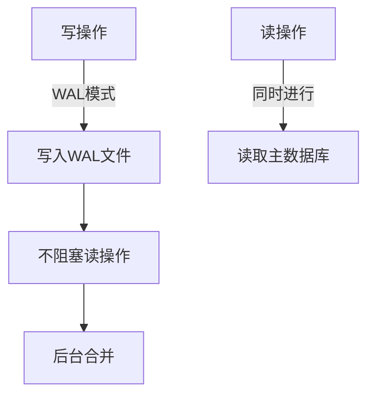
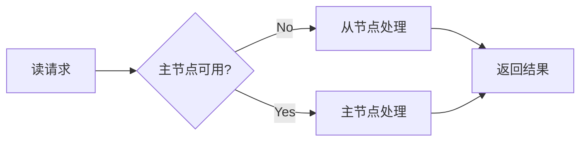

# 读写分离架构

<cite>
**本文引用的文件**
- [sparkii_state.py](file://sparkii_state.py)
- [sparkii_state_common.py](file://sparkii_state_common.py)
- [tools/environments/base.py](file://tools/environments/base.py)
</cite>

## 目录
1. [简介](#简介)
2. [SQLite WAL模式](#SQLite WAL模式)
3. [连接池管理](#连接池管理)
4. [读流量分发](#读流量分发)
5. [写操作路由](#写操作路由)
6. [数据一致性](#数据一致性)
7. [结论](#结论)

## 简介
本文档介绍SparkiiDesktop的读写分离架构，通过SQLite WAL模式和连接池管理，优化并发读写性能。

## SQLite WAL模式

### 配置方法
```python
import sqlite3

conn = sqlite3.connect("sparkii.db")
conn.execute("PRAGMA journal_mode=WAL")
conn.execute("PRAGMA synchronous=NORMAL")
conn.execute("PRAGMA cache_size=-64000")  # 64MB缓存
```

### WAL优势


## 连接池管理

### 连接池配置
```python
from contextlib import contextmanager
from queue import Queue

class SQLitePool:
    def __init__(self, db_path, pool_size=5):
        self._pool = Queue(maxsize=pool_size)
        for _ in range(pool_size):
            conn = sqlite3.connect(db_path, check_same_thread=False)
            conn.execute("PRAGMA journal_mode=WAL")
            self._pool.put(conn)

    @contextmanager
    def get_connection(self):
        conn = self._pool.get()
        try:
            yield conn
        finally:
            self._pool.put(conn)
```

## 读流量分发

### 负载均衡算法
- **轮询**：依次分配请求
- **加权轮询**：根据服务器性能分配
- **最少连接**：分配到连接数最少的服务器
- **IP哈希**：相同IP总是分配到同一服务器

### 故障转移


## 写操作路由

### 事务处理
```python
def write_with_retry(operation, max_retries=3):
    for attempt in range(max_retries):
        try:
            with conn:
                result = operation(conn)
                return result
        except sqlite3.OperationalError as e:
            if "locked" in str(e) and attempt < max_retries - 1:
                time.sleep(0.1 * (2 ** attempt))
                continue
            raise
```

### 冲突解决
- 使用WAL模式减少锁冲突
- 实现指数退避重试
- 设置合理的超时时间

## 数据一致性

### 一致性保证
- WAL模式保证读一致性
- 写操作串行化
- 定期checkpoint合并

### 监控指标
- 读写延迟
- 锁等待时间
- WAL文件大小
- checkpoint频率

## 结论
读写分离架构通过SQLite WAL模式和连接池管理，显著提升了并发性能。合理配置相关参数，可以在保证数据一致性的同时最大化系统吞吐量。

