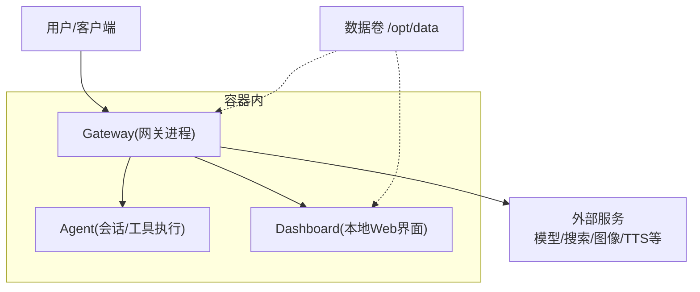
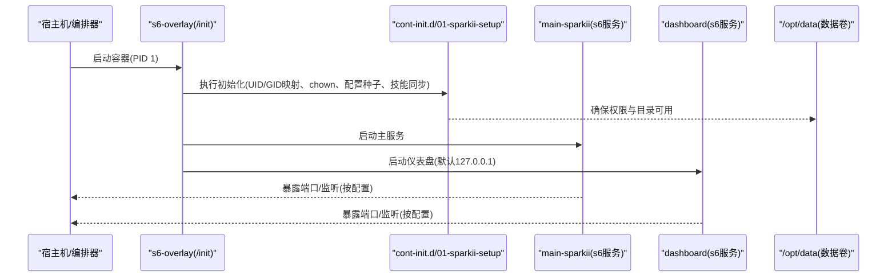
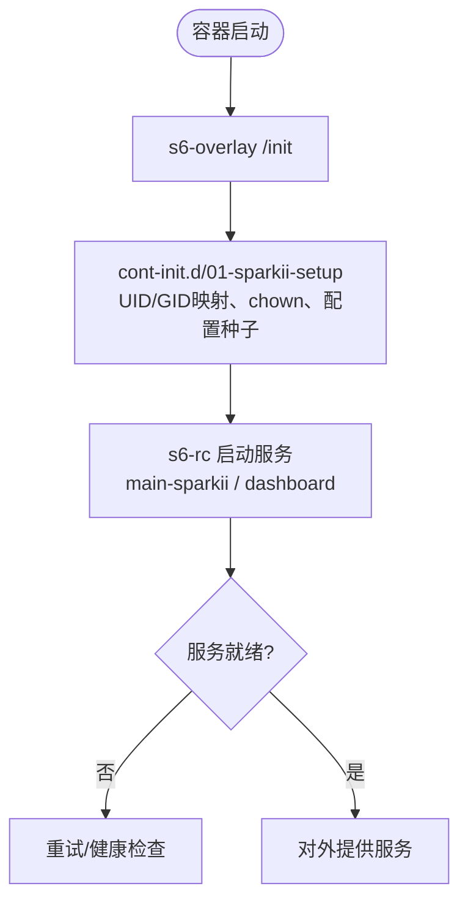
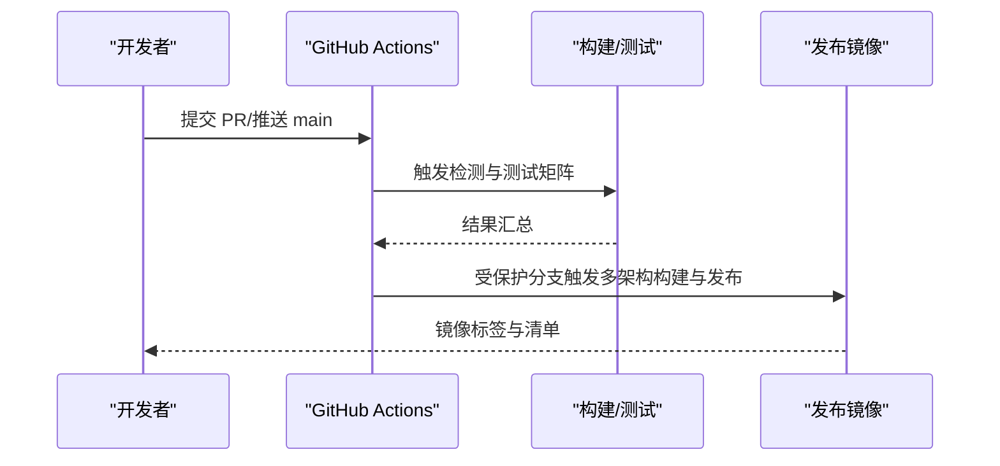
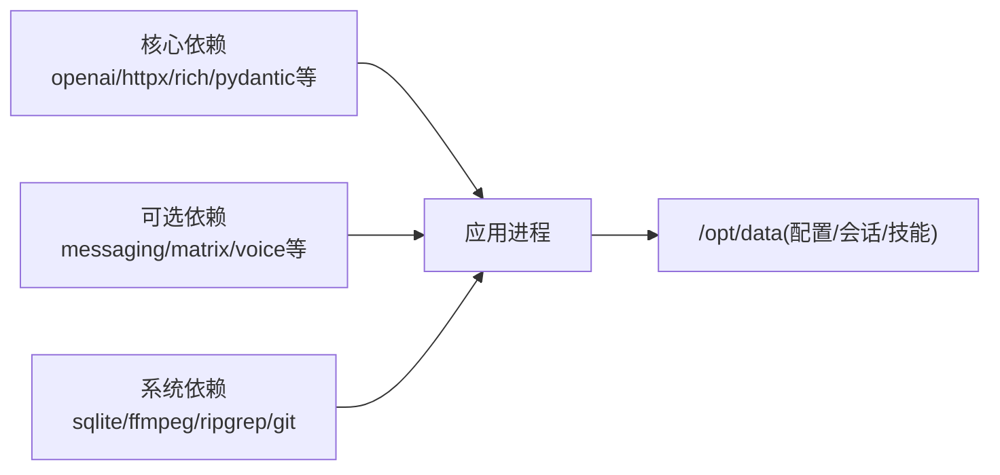

# 部署指南

<cite>
**本文引用的文件**
- [README.md](file://README.md)
- [Dockerfile](file://Dockerfile)
- [docker-compose.yml](file://docker-compose.yml)
- [docker-compose.windows.yml](file://docker-compose.windows.yml)
- [pyproject.toml](file://pyproject.toml)
- [.github/workflows/docker.yml](file://.github/workflows/docker.yml)
- [.github/workflows/ci.yml](file://.github/workflows/ci.yml)
- [cli-config.yaml.example](file://cli-config.yaml.example)
- [docker/entrypoint.sh](file://docker/entrypoint.sh)
</cite>

## 目录
1. [简介](#简介)
2. [项目结构](#项目结构)
3. [核心组件](#核心组件)
4. [架构总览](#架构总览)
5. [详细组件分析](#详细组件分析)
6. [依赖分析](#依赖分析)
7. [性能考虑](#性能考虑)
8. [故障排除指南](#故障排除指南)
9. [结论](#结论)
10. [附录](#附录)

## 简介
本指南面向本地、容器化与云平台的部署需求，覆盖环境准备、镜像构建、编排与服务发现、生产优化、CI/CD、监控日志、故障排除与回滚策略。项目提供跨平台安装脚本与一键式配置入口，支持在 Linux/macOS/WSL2/Termux/Windows 原生运行；同时提供 Docker 镜像与 Compose 编排，便于在各类云平台或集群中快速部署。

## 项目结构
- 应用入口与命令：通过 CLI 启动聊天、网关、仪表盘等子命令，并支持多平台消息通道接入。
- 容器化：基于 Debian + s6-overlay 的多阶段镜像，内置 Python/Node 工具链、预编译前端与可选后端依赖，数据卷持久化于 /opt/data。
- 编排：提供 docker-compose.yml（Linux）与 docker-compose.windows.yml（Windows），默认以 host 网络运行，Dashboard 仅绑定本地地址。
- CI/CD：GitHub Actions 负责变更检测、测试、Lint、Docker 镜像构建与发布、供应链扫描等。

**图表来源**
- [docker-compose.yml:29-77](file://docker-compose.yml#L29-L77)
- [Dockerfile:359-422](file://Dockerfile#L359-L422)

**章节来源**
- [README.md:35-118](file://README.md#L35-L118)
- [docker-compose.yml:1-77](file://docker-compose.yml#L1-L77)
- [Dockerfile:52-91](file://Dockerfile#L52-L91)

## 核心组件
- Gateway：统一的消息网关，承载 Telegram/Discord/Slack/WhatsApp/Signal 等平台接入，暴露 OpenAI 兼容 API 服务器（可配置鉴权与监听地址）。
- Agent：会话循环、工具执行、上下文压缩、记忆与技能系统、定时任务等。
- Dashboard：本地 Web 管理界面，默认仅监听 127.0.0.1，建议通过 SSH 隧道或反向代理访问。
- 容器运行时：s6-overlay 作为 PID 1 管理服务生命周期，含 cont-init.d 初始化与 s6-rc 服务注册。

**章节来源**
- [docker-compose.yml:29-77](file://docker-compose.yml#L29-L77)
- [Dockerfile:93-135](file://Dockerfile#L93-L135)
- [Dockerfile:336-357](file://Dockerfile#L336-L357)

## 架构总览
下图展示从容器启动到服务就绪的关键流程：s6-overlay 接管 PID 1，执行初始化钩子，拉起主服务与仪表盘，随后对外提供服务。

**图表来源**
- [Dockerfile:336-357](file://Dockerfile#L336-L357)
- [docker-compose.yml:29-77](file://docker-compose.yml#L29-L77)

## 详细组件分析

### 本地部署与环境要求
- 操作系统：Linux、macOS、WSL2、Termux、Windows（原生或 WSL2）。
- 依赖：Python 3.11–3.13（受限于 pyproject 的 requires-python）、Node.js（镜像内已固定版本）、ffmpeg、ripgrep、git 等（容器镜像已包含）。
- 安装方式：使用官方安装脚本自动处理 uv、Python、Node、Git Bash 等依赖；或通过 Docker 镜像直接运行。

**章节来源**
- [README.md:35-66](file://README.md#L35-L66)
- [pyproject.toml:15-15](file://pyproject.toml#L15-L15)
- [Dockerfile:71-74](file://Dockerfile#L71-L74)

### 容器化部署（Docker/Podman）
- 镜像构建：多阶段构建，固定 Node 版本，预装 Playwright 浏览器，锁定 SQLite 修复版，启用 s6-overlay 服务管理。
- 数据持久化：/opt/data 为数据卷，存放配置、会话、技能等。
- 环境变量：SPARKII_UID/SPARKII_GID 用于宿主与容器 UID 映射；API_SERVER_HOST/API_SERVER_KEY 控制 API 服务器暴露与鉴权。
- 入口与调度：ENTRYPOINT 指向 entrypoint-dispatch.sh，内部委托 /init（s6-overlay）+ main-wrapper.sh，保证 PID 1 行为一致。

**图表来源**
- [Dockerfile:336-357](file://Dockerfile#L336-L357)
- [Dockerfile:424-457](file://Dockerfile#L424-L457)

**章节来源**
- [Dockerfile:52-91](file://Dockerfile#L52-L91)
- [Dockerfile:171-267](file://Dockerfile#L171-L267)
- [Dockerfile:359-422](file://Dockerfile#L359-L422)
- [docker-compose.yml:29-77](file://docker-compose.yml#L29-L77)

### Kubernetes 编排与服务发现
- 基础资源：建议使用 Deployment/StatefulSet 管理 Gateway 与 Dashboard，将 /opt/data 挂载为持久卷（PVC）。
- 服务发现：Service 暴露 Gateway 端口；Dashboard 仅暴露至 Ingress 或内部 Service，配合认证。
- 配置与密钥：通过 ConfigMap/Secret 注入环境变量（如 API_SERVER_KEY、平台凭据）。
- 健康检查：利用 s6-overlay 提供的进程状态与自定义探针（可在 Gateway 暴露的健康端点实现）。
- 滚动更新：基于镜像标签进行滚动升级，保留旧副本直至新副本就绪。

[本节为通用编排建议，不直接引用具体代码文件]

### 云部署方案（AWS/Google Cloud/Azure）
- AWS：ECS/Fargate 或 EKS，使用镜像仓库（ECR）存储镜像；通过 IAM Role 注入凭据；ALB/NLB 暴露 Gateway；CloudWatch 收集日志。
- Google Cloud：Cloud Run（无状态）或 GKE（有状态需 PVC）；Secret Manager 管理密钥；Cloud Logging/Monitoring 采集指标与日志。
- Azure：AKS 或 Container Apps；Key Vault 管理密钥；Application Insights 采集遥测；Azure Monitor 聚合日志与指标。

[本节为通用云平台建议，不直接引用具体代码文件]

### 生产环境优化建议
- 性能调优：
  - 调整数据库 journal_mode（wal/delete）以适应文件系统特性。
  - 合理设置上下文压缩阈值与目标比例，避免过长对话导致成本飙升。
  - 对长耗时本地推理或冷启动场景提高请求超时。
- 资源限制：
  - 为容器设置 CPU/内存/磁盘配额，避免争用。
  - 限制并发会话数，防止资源耗尽。
- 安全加固：
  - Dashboard 仅绑定 127.0.0.1，远程访问通过 SSH 隧道或带认证的 Reverse Proxy。
  - 开启 API Server 鉴权（API_SERVER_KEY），仅在可信网络暴露。
  - 最小化依赖面，按需启用 extras（如 messaging、matrix 等）。

**章节来源**
- [cli-config.yaml.example:10-19](file://cli-config.yaml.example#L10-L19)
- [cli-config.yaml.example:425-565](file://cli-config.yaml.example#L425-L565)
- [docker-compose.yml:13-27](file://docker-compose.yml#L13-L27)

### CI/CD 流水线与自动化测试
- 变更检测：CI 首先识别受影响区域（Python/前端/文档/安装器等），按需触发下游任务。
- 测试与 Lint：并行执行 Python 测试、JS/TS 检查、安装器测试、Docker 脚本 Lint。
- 镜像构建与发布：PR 仅构建测试；受保护的 main/release 分支触发多架构构建、推送与清单合并。
- 供应链扫描：OSV 扫描、依赖审计、锁文件校验。

**图表来源**
- [.github/workflows/ci.yml:33-165](file://.github/workflows/ci.yml#L33-L165)
- [.github/workflows/docker.yml:30-218](file://.github/workflows/docker.yml#L30-L218)

**章节来源**
- [.github/workflows/ci.yml:1-165](file://.github/workflows/ci.yml#L1-L165)
- [.github/workflows/docker.yml:1-218](file://.github/workflows/docker.yml#L1-L218)

### 监控与日志收集
- 日志：容器内禁用 Python 输出缓冲，确保实时日志；Dashboard/Gateway 日志可通过编排层收集。
- 指标：可选 OTLP exporter（otlp extra），用于导出网关健康指标至外部收集器。
- 健康检查：s6-overlay 管理服务生命周期，可结合编排器的健康检查机制。

**章节来源**
- [Dockerfile:54-58](file://Dockerfile#L54-L58)
- [Dockerfile:246-267](file://Dockerfile#L246-L267)

### 故障排除指南
- 常见错误：
  - 杀毒软件误报 uv.exe：按 README 指引验证与白名单。
  - 数据库 WAL 不兼容：根据文件系统特性切换 journal_mode。
  - Dashboard 远程访问风险：默认仅本地监听，需通过隧道或反向代理。
- 回滚策略：
  - 镜像回滚：使用上一个稳定标签恢复部署。
  - 配置回滚：通过 ConfigMap/Secret 回退至上一版本。
  - 滚动回滚：逐步替换副本至旧版本，观察健康状态。

**章节来源**
- [README.md:68-101](file://README.md#L68-L101)
- [cli-config.yaml.example:10-19](file://cli-config.yaml.example#L10-L19)
- [docker-compose.yml:13-27](file://docker-compose.yml#L13-L27)

## 依赖分析
- Python 依赖：核心依赖精确锁定，可选功能通过 extras 按需引入，减少攻击面与构建复杂度。
- Node 依赖：镜像内固定 Node 版本，前端与 TUI 预构建，避免运行时 npm install 带来的不一致。
- 系统依赖：SQLite 修复版、FFmpeg、ripgrep、git 等由镜像层安装，确保一致性。

**图表来源**
- [pyproject.toml:19-155](file://pyproject.toml#L19-L155)
- [Dockerfile:71-91](file://Dockerfile#L71-L91)

**章节来源**
- [pyproject.toml:19-155](file://pyproject.toml#L19-L155)
- [Dockerfile:171-267](file://Dockerfile#L171-L267)

## 性能考虑
- 上下文压缩：根据模型上下文窗口与业务负载调整阈值与目标比例，平衡延迟与成本。
- 并发与会话：限制最大并发会话数，避免资源争用；对长时任务采用后台队列或批处理。
- I/O 与存储：选择支持 WAL 的文件系统以提升 SQLite 并发写入性能；必要时降级为 DELETE 模式。
- 网络与超时：针对本地推理或慢上游调整请求超时与非流式调用超时。

**章节来源**
- [cli-config.yaml.example:425-565](file://cli-config.yaml.example#L425-L565)
- [cli-config.yaml.example:126-158](file://cli-config.yaml.example#L126-L158)

## 故障排除指南
- 安装与依赖：
  - Windows Defender/杀毒软件误报：参考 README 中的验证与白名单步骤。
  - 依赖缺失：优先使用官方安装脚本或容器镜像，避免手动环境差异。
- 运行问题：
  - Dashboard 无法远程访问：确认仅绑定 127.0.0.1，并通过 SSH 隧道或反向代理访问。
  - API Server 暴露风险：必须设置 API_SERVER_KEY，并在可信网络暴露。
- 回滚与恢复：
  - 镜像回滚：回退至上一稳定标签。
  - 配置回滚：恢复 ConfigMap/Secret 至上一版本。
  - 数据恢复：从备份的 /opt/data 恢复配置与会话。

**章节来源**
- [README.md:68-101](file://README.md#L68-L101)
- [docker-compose.yml:13-27](file://docker-compose.yml#L13-L27)

## 结论
本项目提供完善的本地与容器化部署能力，具备成熟的 CI/CD 流水线与多平台适配。通过合理的配置与优化，可在 VPS、GPU 集群或无服务器环境中稳定运行。建议在生产环境严格遵循安全基线，启用鉴权与最小权限原则，并结合监控与日志系统进行持续观测与排障。

## 附录

### 常用命令与入口
- 启动聊天：sparkii
- 启动网关：sparkii gateway run
- 启动仪表盘：sparkii dashboard --host 127.0.0.1 --no-open

**章节来源**
- [README.md:105-118](file://README.md#L105-L118)

### 环境变量与配置要点
- SPARKII_UID/SPARKII_GID：容器内用户映射。
- API_SERVER_HOST/API_SERVER_KEY：API 服务器监听与鉴权。
- database.journal_mode：根据文件系统特性选择 wal 或 delete。
- compression.threshold/target_ratio：上下文压缩策略。

**章节来源**
- [docker-compose.yml:38-61](file://docker-compose.yml#L38-L61)
- [cli-config.yaml.example:10-19](file://cli-config.yaml.example#L10-L19)
- [cli-config.yaml.example:425-565](file://cli-config.yaml.example#L425-L565)