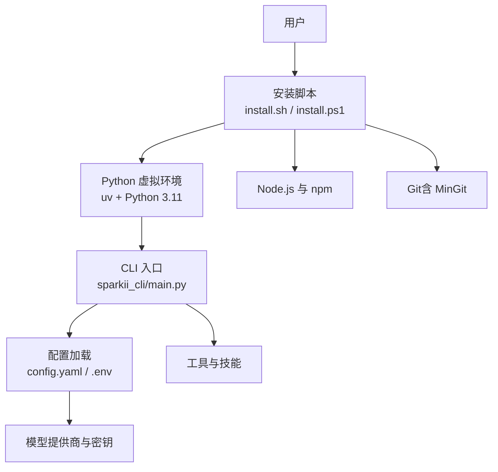
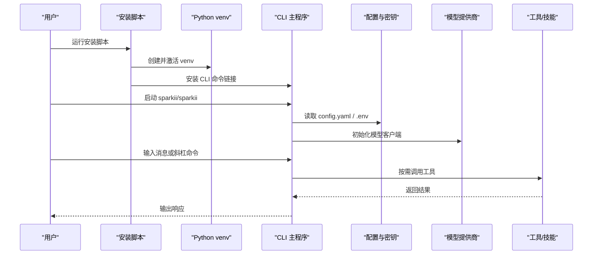
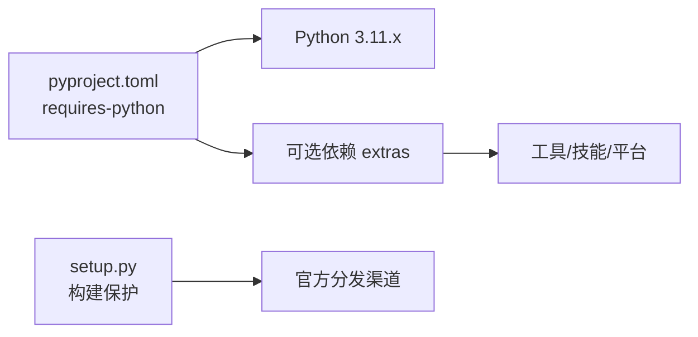

# 快速开始

<cite>
**本文引用的文件**
- [README.md](file://README.md)
- [scripts/install.sh](file://scripts/install.sh)
- [scripts/install.ps1](file://scripts/install.ps1)
- [pyproject.toml](file://pyproject.toml)
- [setup.py](file://setup.py)
- [sparkii_cli/main.py](file://sparkii_cli/main.py)
- [cli-config.yaml.example](file://cli-config.yaml.example)
</cite>

## 目录
1. [简介](#简介)
2. [项目结构](#项目结构)
3. [核心组件](#核心组件)
4. [架构总览](#架构总览)
5. [详细组件分析](#详细组件分析)
6. [依赖关系分析](#依赖关系分析)
7. [性能注意事项](#性能注意事项)
8. [故障排除指南](#故障排除指南)
9. [结论](#结论)
10. [附录](#附录)

## 简介
本指南面向首次接触 Sparkii Agent 的用户，目标是在最短时间内完成环境准备、安装与基础配置，并通过 CLI 启动对话、切换模型、启用工具等常见操作，帮助你快速体验核心能力。Sparkii 支持在 Linux、macOS、Windows（原生 PowerShell）上安装，并提供一键脚本自动处理 Python、Node.js、Git 等依赖。

## 项目结构
- 安装入口：跨平台安装脚本位于 scripts/install.sh（Linux/macOS/WSL/Termux）与 scripts/install.ps1（Windows）。
- 运行时入口：CLI 主程序由 sparkii_cli/main.py 提供，暴露 sparkii/sparkii 命令集。
- 配置示例：cli-config.yaml.example 展示模型、终端、压缩、记忆等关键配置项。
- 构建与发布：pyproject.toml 声明 Python 版本约束与可选依赖；setup.py 用于构建保护（非 Nix 环境下禁止打包 wheel/sdist）。

图表来源
- [scripts/install.sh:45-80](file://scripts/install.sh#L45-L80)
- [scripts/install.ps1:376-391](file://scripts/install.ps1#L376-L391)
- [pyproject.toml:3-15](file://pyproject.toml#L3-L15)
- [sparkii_cli/main.py:1-44](file://sparkii_cli/main.py#L1-L44)

章节来源
- [scripts/install.sh:45-80](file://scripts/install.sh#L45-L80)
- [scripts/install.ps1:376-391](file://scripts/install.ps1#L376-L391)
- [pyproject.toml:3-15](file://pyproject.toml#L3-L15)
- [sparkii_cli/main.py:1-44](file://sparkii_cli/main.py#L1-L44)

## 核心组件
- 安装器：负责检测系统、安装 uv/Python/Node/Git、克隆仓库、创建 venv、安装依赖、写入命令链接、引导配置向导。
- CLI：提供交互式聊天、网关服务、模型选择、工具配置、诊断、更新等子命令。
- 配置系统：通过 config.yaml 与 .env 管理模型、工具、终端、压缩、记忆等设置。
- 构建保护：setup.py 在非 Nix 构建环境中阻止打包 wheel/sdist，确保通过官方渠道分发。

章节来源
- [scripts/install.sh:94-199](file://scripts/install.sh#L94-L199)
- [scripts/install.ps1:15-75](file://scripts/install.ps1#L15-L75)
- [sparkii_cli/main.py:1-44](file://sparkii_cli/main.py#L1-L44)
- [setup.py:1-75](file://setup.py#L1-L75)

## 架构总览
下图展示了从安装到首次对话的关键流程：安装脚本准备运行环境并生成命令；CLI 启动后读取配置与密钥，连接模型提供商，并在会话中调用工具执行任务。

图表来源
- [scripts/install.sh:549-653](file://scripts/install.sh#L549-L653)
- [scripts/install.ps1:689-735](file://scripts/install.ps1#L689-L735)
- [sparkii_cli/main.py:439-485](file://sparkii_cli/main.py#L439-L485)
- [cli-config.yaml.example:24-64](file://cli-config.yaml.example#L24-L64)

## 详细组件分析

### 环境与依赖要求
- Python：项目要求 Python >=3.11 且 <3.14；安装脚本默认使用 Python 3.11，并通过 uv 管理解释器与包。
- Node.js：安装脚本维护 Node 22 系列以满足前端与浏览器工具依赖。
- Git：安装脚本会尝试自动安装 Git（macOS 通过命令行工具或 Homebrew；Linux 通过发行版包管理器），或在 Windows 下使用便携 Git Bash。
- 其他：部分功能需要 ffmpeg、ripgrep、Playwright/Chromium 等，安装脚本会在需要时提示或安装。

章节来源
- [pyproject.toml:3-15](file://pyproject.toml#L3-L15)
- [scripts/install.sh:59-61](file://scripts/install.sh#L59-L61)
- [scripts/install.sh:612-653](file://scripts/install.sh#L612-L653)
- [scripts/install.sh:655-780](file://scripts/install.sh#L655-L780)
- [scripts/install.ps1:376-391](file://scripts/install.ps1#L376-L391)

### 安装步骤（Linux、macOS、WSL2、Termux）
- 使用一键脚本安装：
  - 在终端执行 curl 管道脚本，将自动安装 uv、Python、Node、Git、克隆仓库、创建 venv、安装依赖并写入 sparkii 命令。
  - 安装完成后刷新 shell（source ~/.bashrc 或 ~/.zshrc），然后运行 sparkii 进入交互模式。
- 若跳过向导或仅安装依赖，可使用相应参数控制安装流程。

章节来源
- [README.md:35-66](file://README.md#L35-L66)
- [scripts/install.sh:94-199](file://scripts/install.sh#L94-L199)

### 安装步骤（Windows 原生）
- 在 PowerShell 中执行安装脚本，将自动安装 uv、Python、Node、Git（MinGit）、克隆仓库、创建 venv、安装依赖并写入 sparkii 命令。
- 安装路径位于 %LOCALAPPDATA%\sparkii；若已存在系统 Git，则复用该 Git。
- 如遇杀毒软件误报 uv.exe，可参考 README 中的验证与白名单方法。

章节来源
- [README.md:43-59](file://README.md#L43-L59)
- [scripts/install.ps1:15-75](file://scripts/install.ps1#L15-L75)
- [scripts/install.ps1:689-735](file://scripts/install.ps1#L689-L735)

### 基本配置
- 模型提供商与 API 密钥：
  - 通过 sparkii model 选择提供商与模型；或通过 sparkii setup 一次性配置。
  - 密钥通常保存在 ~/.sparkii/.env（或对应平台的 .env），也可在 config.yaml 中设置（注意敏感信息优先来自环境变量）。
- 工具启用：
  - 使用 sparkii tools 启用或禁用工具；部分工具需额外依赖（如浏览器工具需要 Chromium）。
- 终端与环境：
  - 可在 config.yaml 的 terminal 段选择本地、SSH、Docker、Singularity、Modal、Daytona 等后端。
- 上下文压缩与记忆：
  - 可通过 compression 与 memory 段调整压缩触发阈值、保留最近消息数、记忆开关与字符限制。

章节来源
- [README.md:105-118](file://README.md#L105-L118)
- [cli-config.yaml.example:24-64](file://cli-config.yaml.example#L24-L64)
- [cli-config.yaml.example:223-337](file://cli-config.yaml.example#L223-L337)
- [cli-config.yaml.example:407-579](file://cli-config.yaml.example#L407-L579)
- [cli-config.yaml.example:687-755](file://cli-config.yaml.example#L687-L755)

### CLI 使用方法
- 启动对话：
  - 直接运行 sparkii 进入交互式聊天。
- 切换模型：
  - 使用 /model 或 sparkii model 选择提供商与模型。
- 使用工具：
  - 在对话中使用斜杠命令或自然语言触发工具；必要时先通过 sparkii tools 启用。
- 其他常用命令：
  - sparkii gateway：启动消息网关（Telegram、Discord、Slack、WhatsApp、Signal 等）。
  - sparkii config set/get：查看或设置配置项。
  - sparkii doctor：诊断问题。
  - sparkii update：更新到最新版本。

章节来源
- [README.md:105-118](file://README.md#L105-L118)
- [sparkii_cli/main.py:1-44](file://sparkii_cli/main.py#L1-L44)

### 验证安装成功
- 运行 sparkii 或 sparkii 应能进入交互界面或显示帮助信息。
- 执行 sparkii doctor 检查依赖与配置是否正常。
- 使用 /model 切换模型并发送一条消息，确认能收到回复。
- 如需浏览器工具，确保 Chromium 已安装并可被调用。

章节来源
- [README.md:105-118](file://README.md#L105-L118)
- [scripts/install.sh:549-653](file://scripts/install.sh#L549-L653)
- [scripts/install.ps1:689-735](file://scripts/install.ps1#L689-L735)

## 依赖关系分析
- Python 版本约束：pyproject.toml 明确 requires-python 范围，避免不兼容的解析与编译失败。
- 可选依赖：[all] 仅包含无法懒加载的核心扩展；其余按需提供（如 anthropic、exa、fal、edge-tts、messaging 等）。
- 构建保护：setup.py 在非 Nix 构建中阻止 wheel/sdist 打包，确保通过官方安装器或 Docker/Nix 分发。

图表来源
- [pyproject.toml:3-15](file://pyproject.toml#L3-L15)
- [pyproject.toml:157-352](file://pyproject.toml#L157-L352)
- [setup.py:1-75](file://setup.py#L1-L75)

章节来源
- [pyproject.toml:3-15](file://pyproject.toml#L3-L15)
- [pyproject.toml:157-352](file://pyproject.toml#L157-L352)
- [setup.py:1-75](file://setup.py#L1-L75)

## 性能注意事项
- 上下文压缩：合理设置 threshold 与 target_ratio，避免频繁压缩导致额外开销；长会话建议开启 idle_compact_after_seconds。
- 工具并发：对高延迟工具（如浏览器、搜索）可限制并发，减少请求风暴与 429 错误。
- 提供商超时：为本地或慢速端点设置更长的 request_timeout_seconds 与 stale_timeout_seconds。
- 日志与存储：Windows 下使用 concurrent-log-handler 避免日志轮转冲突；容器部署注意 WAL 兼容性。

章节来源
- [cli-config.yaml.example:407-579](file://cli-config.yaml.example#L407-L579)
- [cli-config.yaml.example:126-158](file://cli-config.yaml.example#L126-L158)

## 故障排除指南
- Windows Defender 或杀毒软件误报 uv.exe：
  - 使用 GitHub CLI 校验二进制签名与哈希，确认为官方 uv。
  - 将 sparkii/bin 目录加入白名单（而非单个文件哈希）。
- TLS/证书问题（npm/Node）：
  - 企业代理或防病毒拦截 HTTPS 可能导致证书链错误；设置 NODE_EXTRA_CA_CERTS 或临时关闭 strict-ssl。
- Git 未安装：
  - 安装脚本会尝试自动安装；若失败，按提示手动安装（Homebrew、xcode-select、apt/dnf/pacman）。
- Python 版本不匹配：
  - 确保 Python 在 3.11 至 <3.14 范围内；安装脚本会通过 uv 管理解释器。
- 配置解析失败：
  - 若 config.yaml 解析出错，系统会备份损坏文件并回退到默认配置；修复 YAML 后重启。

章节来源
- [README.md:68-101](file://README.md#L68-L101)
- [scripts/install.ps1:527-554](file://scripts/install.ps1#L527-L554)
- [scripts/install.sh:655-780](file://scripts/install.sh#L655-L780)
- [sparkii_cli/config.py:45-156](file://sparkii_cli/config.py#L45-L156)

## 结论
通过官方安装脚本，你可以在 Linux、macOS、Windows 上快速搭建 Sparkii Agent 的运行环境，并使用 CLI 进行对话、模型切换与工具调用。建议在首次安装后运行 sparkii doctor 验证环境，并根据需求调整配置（模型、工具、压缩、记忆等）。遇到问题时，优先查看日志与诊断输出，并按故障排除指南逐步定位。

## 附录
- 常用命令速查：
  - sparkii：启动交互聊天
  - sparkii model：选择模型与提供商
  - sparkii tools：启用/禁用工具
  - sparkii config set/get：查看/设置配置
  - sparkii gateway：启动消息网关
  - sparkii setup：运行完整设置向导
  - sparkii doctor：诊断问题
  - sparkii update：更新到最新版本

章节来源
- [README.md:105-118](file://README.md#L105-L118)
- [sparkii_cli/main.py:1-44](file://sparkii_cli/main.py#L1-L44)