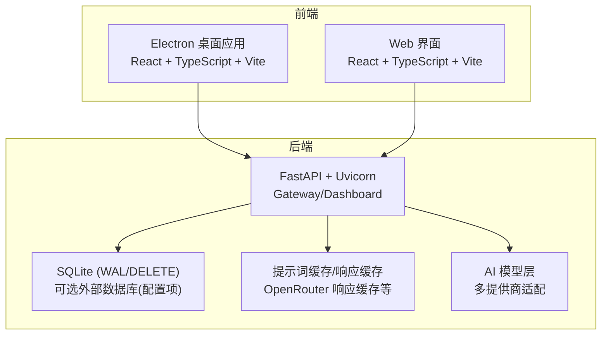
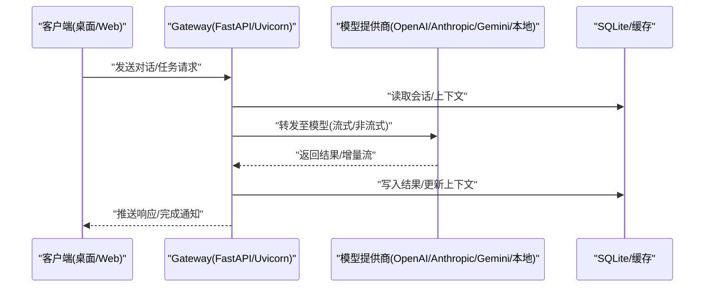
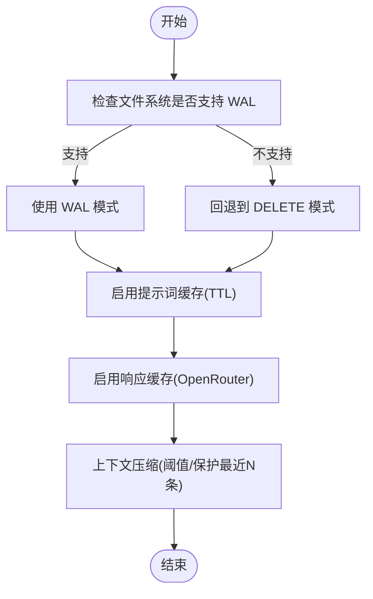
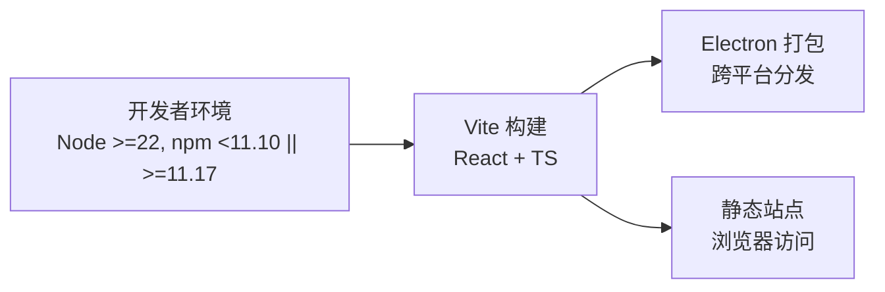
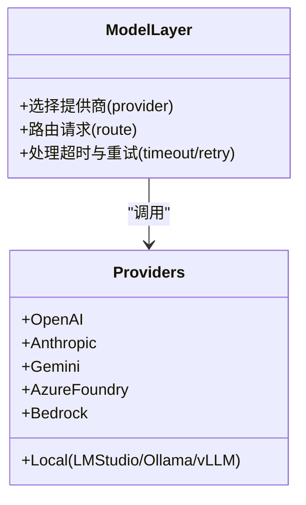
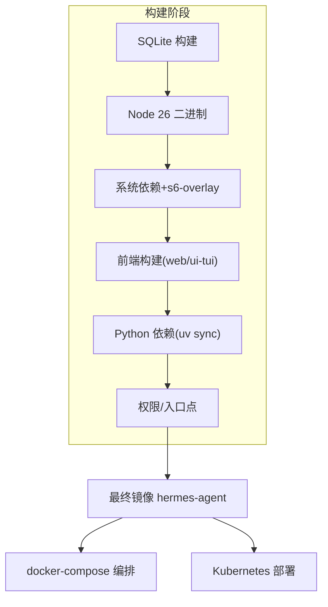
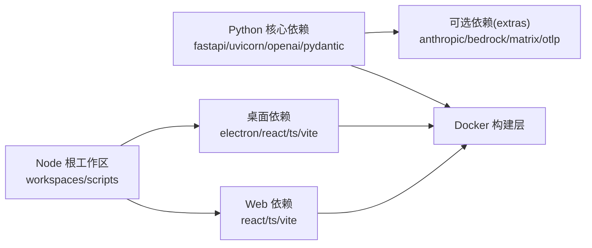

# 技术栈架构

<cite>
**本文引用的文件**
- [pyproject.toml](file://pyproject.toml)
- [Dockerfile](file://Dockerfile)
- [docker-compose.yml](file://docker-compose.yml)
- [package.json](file://package.json)
- [apps/desktop/package.json](file://apps/desktop/package.json)
- [web/package.json](file://web/package.json)
- [cli-config.yaml.example](file://cli-config.yaml.example)
</cite>

## 目录
1. [简介](#简介)
2. [项目结构](#项目结构)
3. [核心组件](#核心组件)
4. [架构总览](#架构总览)
5. [详细组件分析](#详细组件分析)
6. [依赖关系分析](#依赖关系分析)
7. [性能考虑](#性能考虑)
8. [故障排查指南](#故障排查指南)
9. [结论](#结论)
10. [附录](#附录)

## 简介
本技术栈架构文档面向 Hermes Agent（Sparkii）后端与前端、AI 模型集成、容器化部署与编排，系统梳理 Python 版本与框架选型、数据库与缓存策略、桌面与 Web 前端技术栈、多提供商 AI 适配、本地模型支持、Docker/Kubernetes 部署与服务发现、版本兼容矩阵与依赖管理策略，并给出性能优化与扩展性设计建议。

## 项目结构
仓库采用多语言、多工作区组织：
- 后端：Python 工程，使用 FastAPI + Uvicorn 提供 API 服务；通过配置与插件体系接入多种 AI 模型提供商；内置 SQLite 作为默认状态存储，并提供 WAL/DELETE 模式切换。
- 前端：基于 Electron 的桌面应用（React + TypeScript + Vite），以及独立的 Web 界面（React + TypeScript + Vite）。
- 容器化：多阶段 Docker 构建，预编译前端资源，安装 Python/Node 依赖，使用 s6-overlay 进行进程监督；提供 docker-compose 示例用于 Gateway 与 Dashboard 编排。

**图表来源**
- [Dockerfile:171-276](file://Dockerfile#L171-L276)
- [pyproject.toml:105-111](file://pyproject.toml#L105-L111)
- [cli-config.yaml.example:15-19](file://cli-config.yaml.example#L15-L19)

**章节来源**
- [Dockerfile:171-276](file://Dockerfile#L171-L276)
- [pyproject.toml:105-111](file://pyproject.toml#L105-L111)
- [cli-config.yaml.example:15-19](file://cli-config.yaml.example#L15-L19)

## 核心组件
- 后端运行时
  - Python 版本：>=3.11,<3.14（受限于第三方 Rust 扩展 wheel 可用性）
  - Web 框架：FastAPI（>=0.104.0,<1）+ Uvicorn（>=0.24.0,<1）
  - 数据持久化：SQLite（WAL 默认，可回退 DELETE），可通过配置调整 journal_mode
  - 缓存策略：提示词缓存（Anthropic/OpenRouter）、OpenRouter 响应缓存、压缩上下文减少重复传输
- 前端运行时
  - 桌面应用：Electron（v40.x），React（v19），TypeScript（v6），Vite（v8），TailwindCSS
  - Web 界面：React（v19），TypeScript（v6），Vite（v8），TailwindCSS
- AI 模型集成
  - OpenAI SDK（openai==2.24.0）作为统一客户端之一
  - 多提供商适配：Anthropic、Gemini、Azure Foundry、Bedrock、Ollama/LM Studio/vLLM 等
  - 本地模型：支持 LM Studio、Ollama、vLLM、llama.cpp 等 OpenAI 兼容端点
- 容器化与编排
  - Docker 多阶段构建：固定 Node/Python 工具链，预编译前端，安装依赖，s6-overlay 进程监督
  - Compose：Gateway + Dashboard 双服务，端口绑定与卷挂载
  - Kubernetes：镜像可直接用于 K8s Deployment/Service；服务发现通过环境变量与内部网络

**章节来源**
- [pyproject.toml:15-155](file://pyproject.toml#L15-L155)
- [cli-config.yaml.example:24-64](file://cli-config.yaml.example#L24-L64)
- [Dockerfile:52-91](file://Dockerfile#L52-L91)
- [Dockerfile:171-276](file://Dockerfile#L171-L276)
- [docker-compose.yml:29-77](file://docker-compose.yml#L29-L77)

## 架构总览
Hermes Agent 以“网关 + 仪表盘”为核心后端，对外暴露 OpenAI 兼容接口与内部 API；前端通过 Electron 桌面或 Web 访问。AI 请求经网关路由到不同模型提供商，必要时使用本地模型。状态与会话数据落盘 SQLite，结合提示词/响应缓存降低延迟与成本。容器化后由 s6-overlay 管理生命周期，Compose/K8s 负责编排与服务发现。

**图表来源**
- [pyproject.toml:105-111](file://pyproject.toml#L105-L111)
- [cli-config.yaml.example:24-64](file://cli-config.yaml.example#L24-L64)
- [cli-config.yaml.example:186-195](file://cli-config.yaml.example#L186-L195)

## 详细组件分析

### 后端技术栈与运行环境
- Python 版本约束：>=3.11,<3.14，避免上游 Rust 扩展无 cp314 wheel 导致源构建失败
- Web 框架：FastAPI + Uvicorn，提供高性能异步 HTTP 服务
- 依赖管理：pyproject.toml 精确锁定版本，uv.lock 保证一致性；可选 extras 按需启用
- 日志与平台差异：Windows 下使用 concurrent-log-handler 解决并发日志轮转问题

**章节来源**
- [pyproject.toml:15-155](file://pyproject.toml#L15-L155)

### 数据库方案与缓存策略
- 数据库：SQLite 默认，journal_mode 支持 wal/delete；在不可靠文件系统上自动降级为 delete
- 缓存：
  - 提示词缓存：Anthropic/OpenRouter 场景下设置 TTL（如 5m/1h）
  - 响应缓存：OpenRouter 边缘缓存相同请求，零计费回放
  - 上下文压缩：长对话自动摘要，保留最近消息，降低 token 消耗

**图表来源**
- [cli-config.yaml.example:15-19](file://cli-config.yaml.example#L15-L19)
- [cli-config.yaml.example:186-195](file://cli-config.yaml.example#L186-L195)
- [cli-config.yaml.example:425-527](file://cli-config.yaml.example#L425-L527)

**章节来源**
- [cli-config.yaml.example:15-19](file://cli-config.yaml.example#L15-L19)
- [cli-config.yaml.example:186-195](file://cli-config.yaml.example#L186-L195)
- [cli-config.yaml.example:425-527](file://cli-config.yaml.example#L425-L527)

### 前端技术栈（Electron 桌面与 React Web）
- 桌面应用：Electron v40.x，React v19，TypeScript v6，Vite v8，TailwindCSS v4，xterm 终端集成，CodeMirror 编辑器
- Web 界面：React v19，TypeScript v6，Vite v8，TailwindCSS v4，Three.js 可视化
- 构建与开发：npm workspaces 统一管理根与子项目脚本；Playwright E2E 测试

**图表来源**
- [package.json:65-79](file://package.json#L65-L79)
- [apps/desktop/package.json:66-163](file://apps/desktop/package.json#L66-L163)
- [web/package.json:17-52](file://web/package.json#L17-L52)

**章节来源**
- [package.json:65-79](file://package.json#L65-L79)
- [apps/desktop/package.json:66-163](file://apps/desktop/package.json#L66-L163)
- [web/package.json:17-52](file://web/package.json#L17-L52)

### AI 模型集成方案
- 统一客户端：OpenAI SDK（openai==2.24.0）用于 OpenAI 兼容端点
- 多提供商适配：Anthropic、Gemini、Azure Foundry、Bedrock、Ollama Cloud、DeepInfra、KiloCode 等
- 本地模型：LM Studio、Ollama、vLLM、llama.cpp 等 OpenAI 兼容服务器
- 辅助模型：图像分析、网页摘要、标题生成、TTS 音频标签等任务可使用独立 provider/model

**图表来源**
- [pyproject.toml:40-155](file://pyproject.toml#L40-L155)
- [cli-config.yaml.example:24-64](file://cli-config.yaml.example#L24-L64)
- [cli-config.yaml.example:580-686](file://cli-config.yaml.example#L580-L686)

**章节来源**
- [pyproject.toml:40-155](file://pyproject.toml#L40-L155)
- [cli-config.yaml.example:24-64](file://cli-config.yaml.example#L24-L64)
- [cli-config.yaml.example:580-686](file://cli-config.yaml.example#L580-L686)

### 容器化部署与编排
- Docker 多阶段构建：
  - 阶段1：构建固定版本 SQLite（修复 WAL 重置 bug）
  - 阶段2：Node 26 源码镜像复制二进制与 npm
  - 阶段3：Debian 13 基础镜像，安装系统依赖，注入 s6-overlay
  - 阶段4：安装前端依赖并构建 web/ui-tui 产物
  - 阶段5：安装 Python 依赖（uv sync），创建可编辑链接
  - 阶段6：权限与入口点配置，环境变量引导
- Compose：gateway 与 dashboard 双服务，host 网络，卷挂载 ~/.hermes:/opt/data
- Kubernetes：镜像可直接用于 Deployment/Service；通过环境变量注入密钥与配置；服务发现使用集群内 DNS

**图表来源**
- [Dockerfile:1-91](file://Dockerfile#L1-L91)
- [Dockerfile:171-276](file://Dockerfile#L171-L276)
- [Dockerfile:336-457](file://Dockerfile#L336-L457)
- [docker-compose.yml:29-77](file://docker-compose.yml#L29-L77)

**章节来源**
- [Dockerfile:1-91](file://Dockerfile#L1-L91)
- [Dockerfile:171-276](file://Dockerfile#L171-L276)
- [Dockerfile:336-457](file://Dockerfile#L336-L457)
- [docker-compose.yml:29-77](file://docker-compose.yml#L29-L77)

## 依赖关系分析
- Python 依赖：核心依赖精确锁定（==X.Y.Z），避免供应链风险；可选依赖通过 extras 按需启用（anthropic、bedrock、azure-identity、matrix、otlp 等）
- Node 依赖：根 package.json 定义 workspaces，apps/desktop 与 web 各自维护依赖；devDependencies 包含构建与测试工具
- 构建与发布：Dockerfile 中分阶段安装与构建，确保可重现；s6-overlay 管理进程生命周期

**图表来源**
- [pyproject.toml:15-155](file://pyproject.toml#L15-L155)
- [pyproject.toml:157-352](file://pyproject.toml#L157-L352)
- [package.json:6-19](file://package.json#L6-L19)
- [apps/desktop/package.json:66-163](file://apps/desktop/package.json#L66-L163)
- [web/package.json:17-52](file://web/package.json#L17-L52)

**章节来源**
- [pyproject.toml:15-155](file://pyproject.toml#L15-L155)
- [pyproject.toml:157-352](file://pyproject.toml#L157-L352)
- [package.json:6-19](file://package.json#L6-L19)
- [apps/desktop/package.json:66-163](file://apps/desktop/package.json#L66-L163)
- [web/package.json:17-52](file://web/package.json#L17-L52)

## 性能考虑
- 数据库性能：启用 SQLite WAL 提升并发写性能；在不可靠文件系统上回退 DELETE 模式
- 缓存优化：提示词缓存（Anthropic/OpenRouter）与响应缓存（OpenRouter）减少重复计算与费用
- 上下文压缩：按阈值触发压缩，保护最近 N 条消息，避免超长上下文导致的延迟与成本上升
- 前端渲染：Vite 构建优化，xterm WebGL 加速，TailwindCSS 原子化样式减少体积
- 容器启动：s6-overlay 监督主进程与子服务，快速重启与僵尸进程回收

[本节为通用性能指导，不直接分析具体文件]

## 故障排查指南
- SQLite WAL 重置 bug：镜像内置修复版 libsqlite3，并在启动时自检版本与 FTS5 trigram
- 日志轮转（Windows）：使用 concurrent-log-handler 避免多进程同时轮转导致的权限错误
- 前端构建失败：确保 Node 版本满足要求（>=22.22.0），npm 版本符合约束；清理 node_modules 后重试
- 容器启动异常：检查 s6-overlay 入口点未被覆盖；确认 /opt/data 卷权限与 UID/GID 映射

**章节来源**
- [Dockerfile:1-91](file://Dockerfile#L1-L91)
- [pyproject.toml:126-139](file://pyproject.toml#L126-L139)
- [package.json:65-79](file://package.json#L65-L79)
- [Dockerfile:336-457](file://Dockerfile#L336-L457)

## 结论
Hermes Agent 采用现代、可扩展的技术栈：后端以 FastAPI/Uvicorn 为核心，SQLite 为默认存储，结合多层缓存与上下文压缩实现高效推理；前端基于 Electron 与 React 提供一致的桌面与 Web 体验；AI 模型通过统一抽象适配多家提供商与本地服务器；容器化与编排保障可重现部署与稳定运行。建议在生产环境中启用 WAL、合理配置缓存与压缩阈值，并使用 Compose/K8s 进行服务编排与监控。

[本节为总结性内容，不直接分析具体文件]

## 附录
- 版本兼容性矩阵（节选）
  - Python：>=3.11,<3.14
  - Node：>=22.22.0；npm：<11.10.0 或 >=11.17.0
  - Electron：v40.x（桌面）
  - React：v19
  - TypeScript：v6
  - FastAPI：>=0.104.0,<1
  - Uvicorn：>=0.24.0,<1
  - SQLite：镜像内置修复版（WAL 重置 bug 已修复）
- 依赖管理策略
  - Python：pyproject.toml 精确锁定 + uv.lock 一致性；extras 按需启用
  - Node：workspaces 统一管理；scripts 集中化构建与测试
  - 容器：多阶段构建，固定工具链，预编译前端，s6-overlay 监督

[本节为补充信息，不直接分析具体文件]