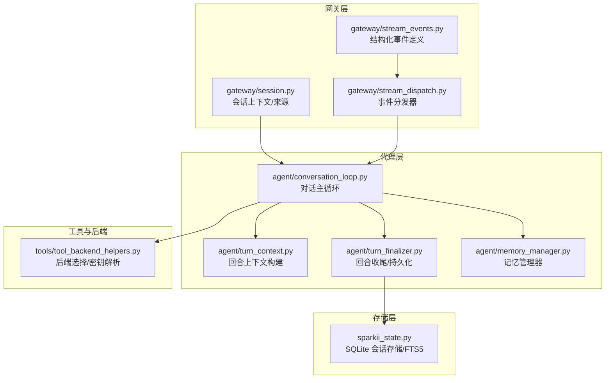
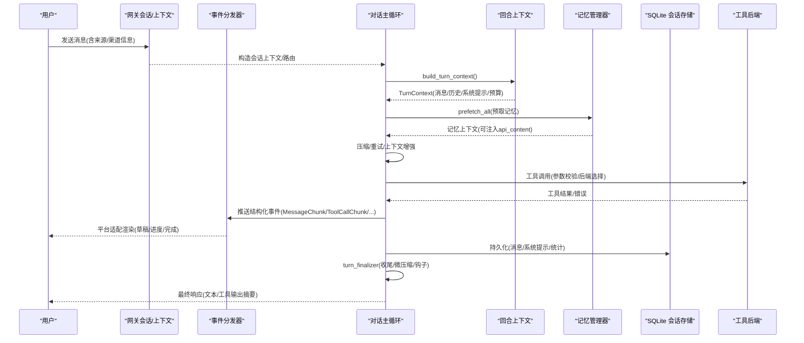
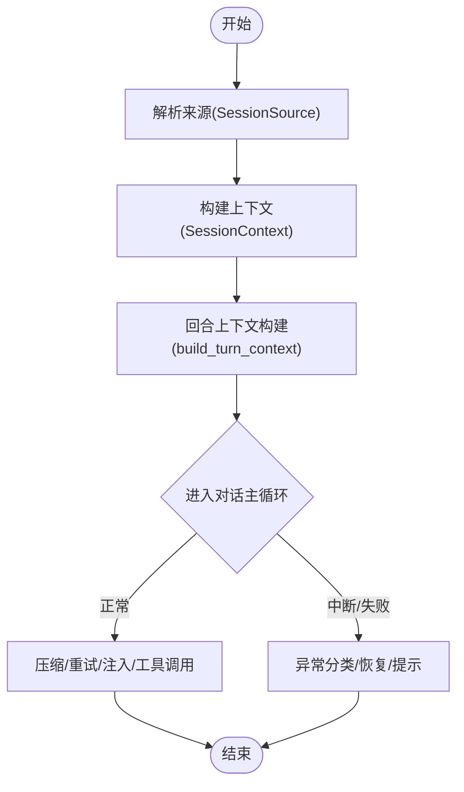
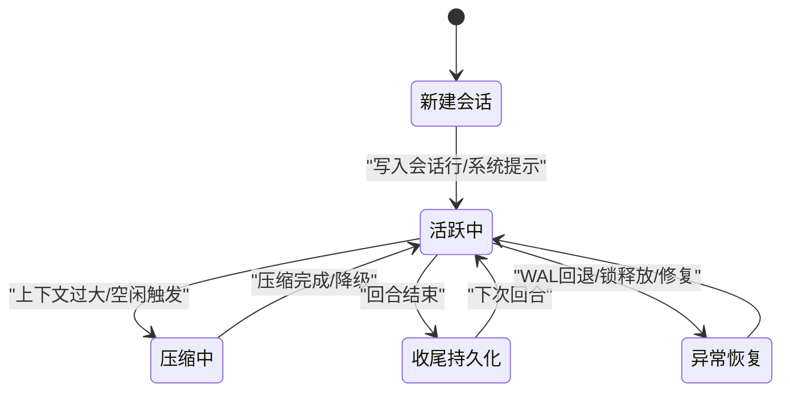
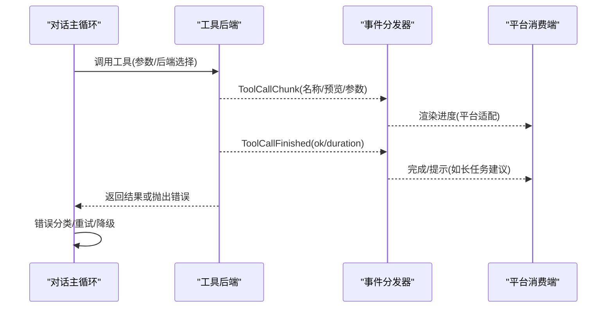
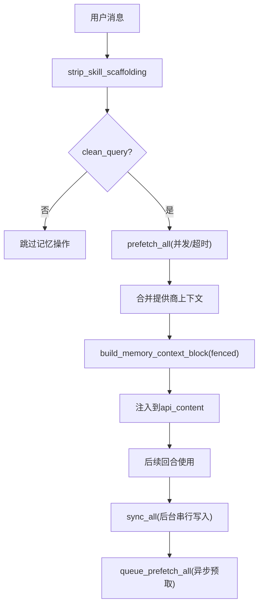
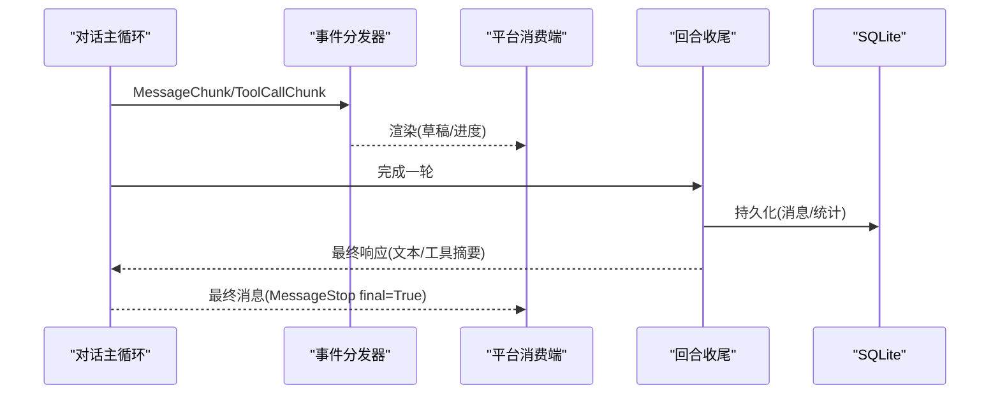
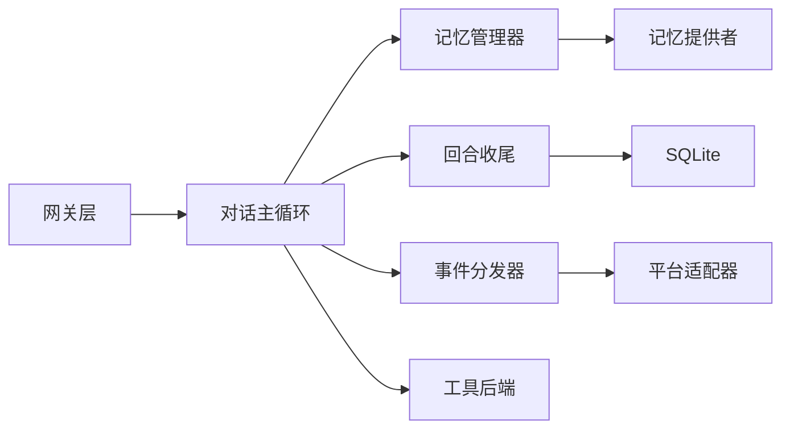

# 数据流架构

<cite>
**本文引用的文件**
- [conversation_loop.py](file://agent/conversation_loop.py)
- [turn_context.py](file://agent/turn_context.py)
- [session.py](file://gateway/session.py)
- [stream_dispatch.py](file://gateway/stream_dispatch.py)
- [stream_events.py](file://gateway/stream_events.py)
- [memory_manager.py](file://agent/memory_manager.py)
- [tool_backend_helpers.py](file://tools/tool_backend_helpers.py)
- [sparkii_state.py](file://sparkii_state.py)
- [turn_finalizer.py](file://agent/turn_finalizer.py)
</cite>

## 目录
1. [简介](#简介)
2. [项目结构](#项目结构)
3. [核心组件](#核心组件)
4. [架构总览](#架构总览)
5. [详细组件分析](#详细组件分析)
6. [依赖关系分析](#依赖关系分析)
7. [性能考量](#性能考量)
8. [故障排查指南](#故障排查指南)
9. [结论](#结论)
10. [附录](#附录)

## 简介
本文件面向 Hermes Agent 的数据流架构，聚焦“用户输入到系统响应”的完整流转路径，覆盖消息接收、解析、路由、处理与响应生成；会话状态管理的数据模型与持久化策略（生命周期、状态同步、故障恢复）；工具调用的参数验证、结果缓存与错误处理；记忆系统的索引构建、检索与更新策略。文末提供数据流图与状态转换图，帮助读者快速定位关键数据在系统中的流转与转换过程。

## 项目结构
Hermes Agent 的数据流横跨网关层（会话上下文、事件分发）、代理层（对话循环、回合上下文、最终化）、存储层（SQLite 会话数据库）以及记忆与工具子系统。下图给出与数据流直接相关的模块关系概览。

图表来源
- [session.py:148-347](file://gateway/session.py#L148-L347)
- [stream_dispatch.py:40-132](file://gateway/stream_dispatch.py#L40-L132)
- [stream_events.py:41-159](file://gateway/stream_events.py#L41-L159)
- [conversation_loop.py:1-100](file://agent/conversation_loop.py#L1-L100)
- [turn_context.py:383-432](file://agent/turn_context.py#L383-L432)
- [turn_finalizer.py:70-92](file://agent/turn_finalizer.py#L70-L92)
- [memory_manager.py:364-401](file://agent/memory_manager.py#L364-L401)
- [sparkii_state.py:1-15](file://sparkii_state.py#L1-L15)
- [tool_backend_helpers.py:158-252](file://tools/tool_backend_helpers.py#L158-L252)

章节来源
- [session.py:148-347](file://gateway/session.py#L148-L347)
- [stream_dispatch.py:40-132](file://gateway/stream_dispatch.py#L40-L132)
- [stream_events.py:41-159](file://gateway/stream_events.py#L41-L159)
- [conversation_loop.py:1-100](file://agent/conversation_loop.py#L1-L100)
- [turn_context.py:383-432](file://agent/turn_context.py#L383-L432)
- [turn_finalizer.py:70-92](file://agent/turn_finalizer.py#L70-L92)
- [memory_manager.py:364-401](file://agent/memory_manager.py#L364-L401)
- [sparkii_state.py:1-15](file://sparkii_state.py#L1-L15)
- [tool_backend_helpers.py:158-252](file://tools/tool_backend_helpers.py#L158-L252)

## 核心组件
- 会话上下文与会话键：网关侧维护 SessionSource/SessionContext/SessionEntry，负责平台来源、多租户隔离、展示元数据与轻量持久化键值。
- 事件分发：GatewayEventDispatcher 将 agent 产生的结构化事件（消息片段、工具调用进度等）按平台适配并投递到消费端。
- 对话主循环：conversation_loop 驱动单轮用户请求，包含压缩、重试、上下文注入、工具调用与异常分类。
- 回合上下文：turn_context 封装每轮前置准备（系统提示恢复/重建、压缩预检、外部记忆预取、安全 stdio 等），产出 TurnContext 供主循环消费。
- 回合收尾：turn_finalizer 负责轨迹保存、资源清理、会话持久化、后置压缩、插件钩子与结果组装。
- 记忆系统：memory_manager 统一编排内置与外部记忆提供者，支持系统提示块、预取、异步同步与工具模式控制。
- 存储层：sparkii_state 提供 SQLite 会话存储，WAL 模式、FTS5 全文检索、压缩拆分链、安全限制与回退策略。
- 工具后端：tool_backend_helpers 提供凭据解析、后端选择（直连/托管）与能力检测。

章节来源
- [session.py:148-347](file://gateway/session.py#L148-L347)
- [stream_dispatch.py:40-132](file://gateway/stream_dispatch.py#L40-L132)
- [conversation_loop.py:1-100](file://agent/conversation_loop.py#L1-L100)
- [turn_context.py:383-432](file://agent/turn_context.py#L383-L432)
- [turn_finalizer.py:70-92](file://agent/turn_finalizer.py#L70-L92)
- [memory_manager.py:364-401](file://agent/memory_manager.py#L364-L401)
- [sparkii_state.py:1-15](file://sparkii_state.py#L1-L15)
- [tool_backend_helpers.py:158-252](file://tools/tool_backend_helpers.py#L158-L252)

## 架构总览
下图展示从用户输入到系统响应的端到端数据流，包括消息接收、解析、路由、处理、记忆注入、工具调用、响应生成与持久化。

图表来源
- [session.py:148-347](file://gateway/session.py#L148-L347)
- [stream_dispatch.py:40-132](file://gateway/stream_dispatch.py#L40-L132)
- [conversation_loop.py:1-100](file://agent/conversation_loop.py#L1-L100)
- [turn_context.py:383-432](file://agent/turn_context.py#L383-L432)
- [memory_manager.py:525-595](file://agent/memory_manager.py#L525-L595)
- [sparkii_state.py:1-15](file://sparkii_state.py#L1-L15)
- [turn_finalizer.py:235-414](file://agent/turn_finalizer.py#L235-L414)
- [tool_backend_helpers.py:158-252](file://tools/tool_backend_helpers.py#L158-L252)

## 详细组件分析

### 消息接收、解析、路由与处理
- 会话来源与上下文：SessionSource/SessionContext/SessionEntry 描述消息来源、平台、频道、线程、角色授权、多用户共享、自动线程创建等，并提供序列化/反序列化与 PII 脱敏策略。
- 动态系统提示注入：build_session_context_prompt 根据平台特性注入行为说明、可用工具声明、多用户会话提示等，保证模型理解当前上下文。
- 回合上下文构建：build_turn_context 完成安全 stdio、会话恢复、系统提示恢复/重建、会话行创建、空闲压缩触发、MCP 刷新、用户消息清洗与追加、迭代预算初始化等，产出 TurnContext。
- 对话主循环：conversation_loop 负责压缩、重试、上下文增强、工具调用、异常分类、中断处理、计费/配额提示、流式内容修正等。

图表来源
- [session.py:148-347](file://gateway/session.py#L148-L347)
- [turn_context.py:412-800](file://agent/turn_context.py#L412-L800)
- [conversation_loop.py:1-100](file://agent/conversation_loop.py#L1-L100)

章节来源
- [session.py:148-347](file://gateway/session.py#L148-L347)
- [turn_context.py:412-800](file://agent/turn_context.py#L412-L800)
- [conversation_loop.py:1-100](file://agent/conversation_loop.py#L1-L100)

### 会话状态管理与持久化
- 数据模型：SessionEntry 记录 session_key、session_id、时间戳、来源、显示元数据、轻量 metadata、token 计数等；SessionContext 聚合来源、连接平台、主页频道与共享会话标记。
- 生命周期：会话行在回合启动时创建（确保系统提示非空后写入），在回合收尾时持久化；支持压缩导致的父子会话链（parent_session_id）。
- 状态同步：通过 _persist_session 将消息与统计写入 SQLite；同时更新内存快照；微压缩在收尾阶段吸收旧交换为滚动摘要。
- 故障恢复：WAL 兼容回退（NFS/SMB/FUSE/ZFS 场景）、macOS fsync 强化、WAL-reset 漏洞防护、测试隔离保护、压缩锁持有者进程存活探测与回收。

图表来源
- [session.py:773-800](file://gateway/session.py#L773-L800)
- [sparkii_state.py:485-538](file://sparkii_state.py#L485-L538)
- [sparkii_state.py:697-780](file://sparkii_state.py#L697-L780)
- [turn_finalizer.py:360-414](file://agent/turn_finalizer.py#L360-L414)

章节来源
- [session.py:773-800](file://gateway/session.py#L773-L800)
- [sparkii_state.py:485-538](file://sparkii_state.py#L485-L538)
- [sparkii_state.py:697-780](file://sparkii_state.py#L697-L780)
- [turn_finalizer.py:360-414](file://agent/turn_finalizer.py#L360-L414)

### 工具调用的数据传递机制
- 参数验证与后端选择：tool_backend_helpers 提供凭据解析顺序（配置→作用域环境→凭证池）、后端模式选择（direct/managed/auto）与能力检测，避免未就绪后端被调用。
- 结果缓存与错误处理：记忆管理器对工具 schema 进行归一化与冲突检测；工具执行过程中的错误由主循环分类与重试；工具进度通过结构化事件上报，平台适配器决定是否渲染。
- 事件通道：GatewayEventDispatcher 将 ToolCallChunk/ToolCallFinished 等事件路由到消费端，支持去重（new 模式）、预览长度控制与长任务提示。

图表来源
- [tool_backend_helpers.py:158-252](file://tools/tool_backend_helpers.py#L158-L252)
- [stream_dispatch.py:88-132](file://gateway/stream_dispatch.py#L88-L132)
- [stream_events.py:84-117](file://gateway/stream_events.py#L84-L117)
- [conversation_loop.py:1-100](file://agent/conversation_loop.py#L1-L100)

章节来源
- [tool_backend_helpers.py:158-252](file://tools/tool_backend_helpers.py#L158-L252)
- [stream_dispatch.py:88-132](file://gateway/stream_dispatch.py#L88-L132)
- [stream_events.py:84-117](file://gateway/stream_events.py#L84-L117)
- [conversation_loop.py:1-100](file://agent/conversation_loop.py#L1-L100)

### 记忆系统的数据读写流程
- 索引构建与检索：MemoryManager 注册内置与外部提供者，收集工具 schema，prefetch_all 并行/超时控制地获取上下文，build_memory_context_block 包裹为 fenced 块注入到用户消息 api_content。
- 更新策略：sync_all 在后台串行工作线程中按序写入（turn N 先于 turn N+1），queue_prefetch_all 异步预取下一轮上下文；shutdown 时等待队列排空或超时放弃。
- 流式过滤：StreamingContextScrubber 在流式输出中剔除 <memory-context> 片段，防止内部上下文泄露到 UI。

图表来源
- [memory_manager.py:507-595](file://agent/memory_manager.py#L507-L595)
- [memory_manager.py:638-757](file://agent/memory_manager.py#L638-L757)
- [memory_manager.py:174-361](file://agent/memory_manager.py#L174-L361)

章节来源
- [memory_manager.py:507-595](file://agent/memory_manager.py#L507-L595)
- [memory_manager.py:638-757](file://agent/memory_manager.py#L638-L757)
- [memory_manager.py:174-361](file://agent/memory_manager.py#L174-L361)

### 响应生成与交付
- 流式事件：MessageChunk/Commentary/MessageStop 表示助手文本增量与边界；ToolCallChunk/ToolCallFinished 表示工具调用生命周期；LongToolHint/GatewayNotice 用于引导与控制。
- 平台适配：GatewayEventDispatcher 根据 tool_mode、preview_max_len 与平台能力决定渲染策略（草稿、进度气泡、丢弃不可渲染的工具 chrome）。
- 最终响应：turn_finalizer 在收尾阶段补充缺失的 assistant 行、执行微压缩、持久化会话、注入解释性尾部（如文件修改失败提示）、触发插件钩子并组装结果字典。

图表来源
- [stream_events.py:41-159](file://gateway/stream_events.py#L41-L159)
- [stream_dispatch.py:88-132](file://gateway/stream_dispatch.py#L88-L132)
- [turn_finalizer.py:235-414](file://agent/turn_finalizer.py#L235-L414)

章节来源
- [stream_events.py:41-159](file://gateway/stream_events.py#L41-L159)
- [stream_dispatch.py:88-132](file://gateway/stream_dispatch.py#L88-L132)
- [turn_finalizer.py:235-414](file://agent/turn_finalizer.py#L235-L414)

## 依赖关系分析
- 耦合与内聚：
  - 网关层与代理层通过结构化事件解耦：事件仅描述“发生了什么”，不携带上下文，平台渲染逻辑集中在 GatewayEventDispatcher 与各平台适配器。
  - 记忆系统与对话主循环通过 MemoryManager 抽象，允许单一外部提供者且失败互不影响。
  - 存储层通过 sparkii_state 提供统一的会话存取接口，屏蔽 WAL/FTS5/迁移细节。
- 外部依赖：
  - SQLite（WAL/PRAGMA/FTS5）、psutil（进程存活探测）、平台 SDK（Telegram/Discord/Slack/iMessage/Yuanbao 等）。
- 潜在循环依赖：
  - 通过显式函数参数注入（如 turn_context 的 restore_or_build_system_prompt、install_safe_stdio 等）避免 import 循环。

图表来源
- [stream_dispatch.py:40-132](file://gateway/stream_dispatch.py#L40-L132)
- [memory_manager.py:364-401](file://agent/memory_manager.py#L364-L401)
- [turn_finalizer.py:235-414](file://agent/turn_finalizer.py#L235-L414)
- [sparkii_state.py:1-15](file://sparkii_state.py#L1-L15)
- [tool_backend_helpers.py:158-252](file://tools/tool_backend_helpers.py#L158-L252)

章节来源
- [stream_dispatch.py:40-132](file://gateway/stream_dispatch.py#L40-L132)
- [memory_manager.py:364-401](file://agent/memory_manager.py#L364-L401)
- [turn_finalizer.py:235-414](file://agent/turn_finalizer.py#L235-L414)
- [sparkii_state.py:1-15](file://sparkii_state.py#L1-L15)
- [tool_backend_helpers.py:158-252](file://tools/tool_backend_helpers.py#L158-L252)

## 性能考量
- 压缩与预检：idle 压缩与 token 阈值预检减少大上下文带来的延迟；micro-compaction 分摊压缩成本。
- 并发与超时：记忆预取使用线程与超时控制，避免慢提供者阻塞主循环；sync_all 使用单工作线程串行写入，保证顺序。
- 存储优化：WAL 模式提升并发读；FTS5 加速全文检索；macOS 强化 fsync 保障一致性。
- 事件渲染：tool_mode 与 preview_max_len 控制工具进度渲染开销；new 模式去重减少重复渲染。

[本节为通用性能指导，不直接分析具体文件]

## 故障排查指南
- 会话数据库不可用：检查 WAL 兼容性（NFS/SMB/FUSE/ZFS）、macOS fsync 设置、WAL-reset 漏洞版本；查看最后初始化错误以定位原因。
- 压缩卡住：确认压缩锁持有者进程是否存活；必要时等待 TTL 过期或重启进程。
- 记忆提供者阻塞：检查外部提供者超时与后台队列；必要时禁用或替换提供者。
- 工具调用失败：查看工具 schema 归一化与冲突日志；确认凭据与作用域是否正确；检查后端模式（direct/managed）可用性。
- 流式输出异常：确认 StreamingContextScrubber 正确过滤 memory-context；检查事件分发器 tool_mode 与预览长度配置。

章节来源
- [sparkii_state.py:485-538](file://sparkii_state.py#L485-L538)
- [sparkii_state.py:697-780](file://sparkii_state.py#L697-L780)
- [memory_manager.py:547-595](file://agent/memory_manager.py#L547-L595)
- [memory_manager.py:638-757](file://agent/memory_manager.py#L638-L757)
- [tool_backend_helpers.py:158-252](file://tools/tool_backend_helpers.py#L158-L252)
- [memory_manager.py:174-361](file://agent/memory_manager.py#L174-L361)

## 结论
Hermes Agent 的数据流以“网关上下文 + 结构化事件 + 对话主循环 + 回合收尾 + 记忆/工具 + SQLite 存储”为核心，形成高内聚、低耦合的可扩展架构。通过压缩、预取、串行写入与平台适配，系统在吞吐、一致性与用户体验之间取得平衡。针对常见故障提供了完善的回退与诊断机制，便于运维与开发快速定位问题。

[本节为总结性内容，不直接分析具体文件]

## 附录
- 术语表：
  - 会话：一次或多轮用户与助手的交互集合，持久化于 SQLite。
  - 回合：单次用户输入触发的处理单元，包含多次工具调用与可能的压缩。
  - 记忆：跨回合的上下文知识，支持预取与异步同步。
  - 工具：外部能力（文件、浏览器、搜索等），通过 schema 暴露给模型。
  - 事件：结构化消息，描述流式进展与工具调用生命周期。

[本节为概念性内容，不直接分析具体文件]