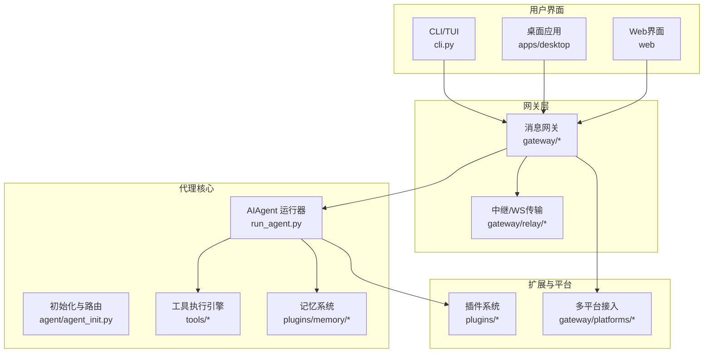
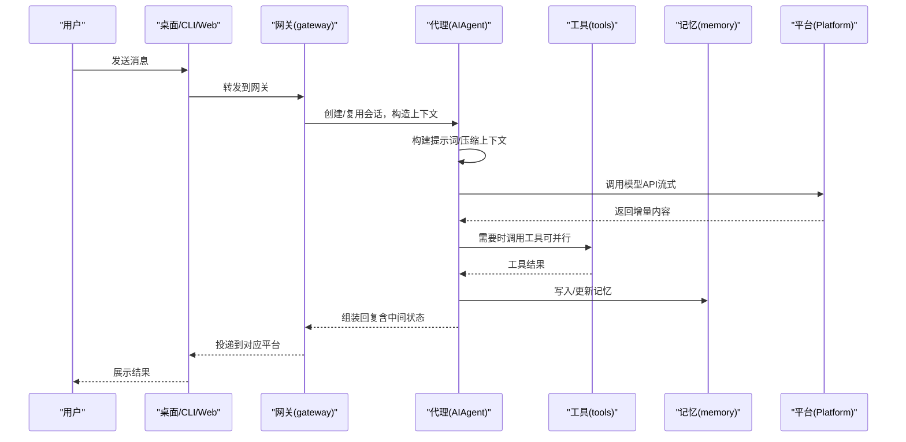
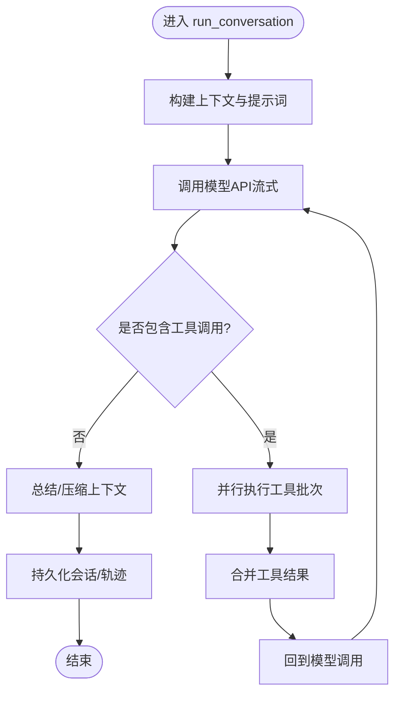
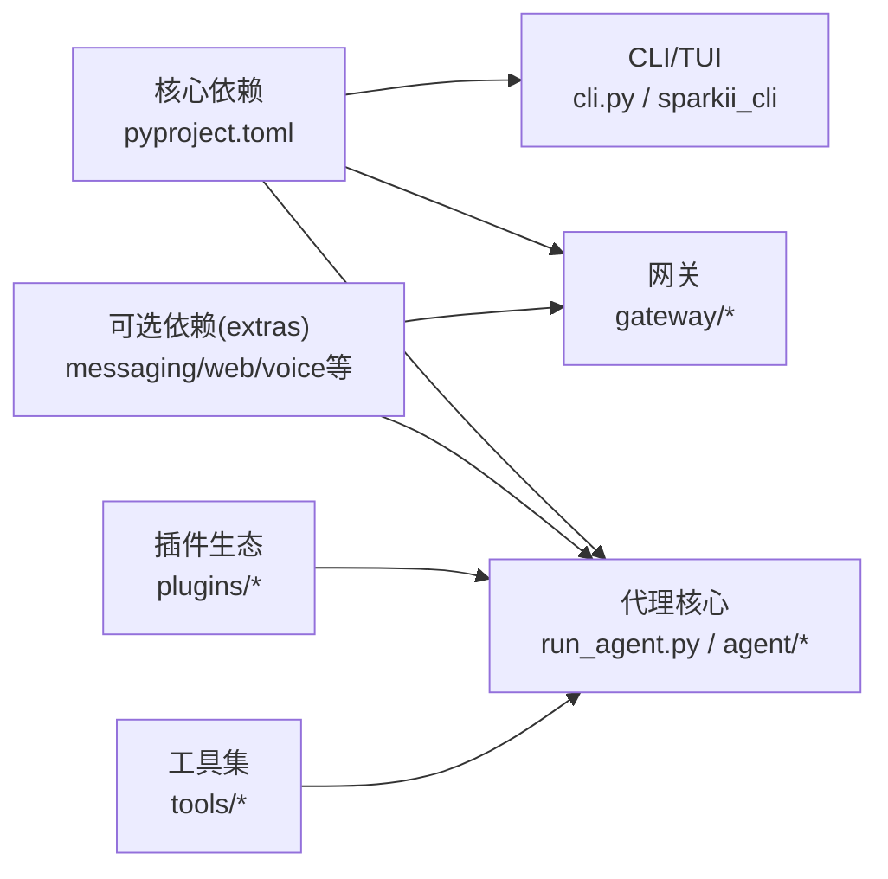

# 架构概览

<cite>
**本文引用的文件**
- [README.md](file://README.md)
- [pyproject.toml](file://pyproject.toml)
- [cli.py](file://cli.py)
- [run_agent.py](file://run_agent.py)
- [agent/agent_init.py](file://agent/agent_init.py)
- [gateway/__init__.py](file://gateway/__init__.py)
- [tools/__init__.py](file://tools/__init__.py)
- [sparkii_cli/main.py](file://sparkii_cli/main.py)
</cite>

## 目录
1. [简介](#简介)
2. [项目结构](#项目结构)
3. [核心组件](#核心组件)
4. [架构总览](#架构总览)
5. [详细组件分析](#详细组件分析)
6. [依赖关系分析](#依赖关系分析)
7. [性能考量](#性能考量)
8. [故障排查指南](#故障排查指南)
9. [结论](#结论)
10. [附录](#附录)

## 简介
本概览面向Sparkii Agent（本项目以“Sparkii Agent”为包名）的整体架构，覆盖后端服务、前端界面、插件系统与多平台支持的分层设计；阐述AI代理核心、工具执行引擎、记忆系统、网关服务等关键模块的职责与交互；解释微服务化边界（网关与代理进程分离）、事件驱动与异步处理机制；并给出系统边界、技术栈选择与第三方依赖管理策略。文末提供架构图与交互流程图，帮助开发者快速把握系统设计思路。

## 项目结构
仓库采用多语言、多进程、分层模块化组织：
- Python后端核心：agent（代理运行时）、tools（工具集）、plugins（插件生态）、gateway（消息网关）、cron（定时任务）、acp_adapter（ACP协议适配）等
- CLI/TUI入口：sparkii_cli（命令行与TUI）、tui_gateway（TUI网关）、cli.py（交互式终端）
- 桌面端应用：apps/desktop（Electron+React前端，跨平台桌面体验）
- Web与站点：web（Web前端）、website（文档站点）
- 配置与打包：pyproject.toml（Python依赖与脚本入口）、Docker相关脚本
- 测试与脚本：tests、scripts

图表来源
- [cli.py:1-800](file://cli.py#L1-L800)
- [gateway/__init__.py:1-36](file://gateway/__init__.py#L1-L36)
- [run_agent.py:1-800](file://run_agent.py#L1-L800)
- [agent/agent_init.py:1-800](file://agent/agent_init.py#L1-L800)
- [tools/__init__.py:1-26](file://tools/__init__.py#L1-L26)

章节来源
- [README.md:1-265](file://README.md#L1-L265)
- [pyproject.toml:1-452](file://pyproject.toml#L1-L452)

## 核心组件
- AI代理核心（AIAgent）
  - 负责对话循环、工具调用、响应管理、错误恢复、上下文压缩、轨迹保存、会话持久化等
  - 通过可插拔传输层对接多种模型API（OpenAI兼容、Codex Responses、Anthropic Messages、Bedrock等）
- 工具执行引擎（tools/*）
  - 统一注册与调度工具，支持并行批处理、安全护栏、结果分类、输出限制等
- 记忆系统（plugins/memory/*）
  - 持久化记忆、用户画像、跨会话检索、技能自进化与回顾
- 网关服务（gateway/*）
  - 统一接入多平台（Telegram/Discord/Slack/WhatsApp/Signal等），会话管理、上下文注入、投递路由、流式消费
- 插件系统（plugins/*）
  - 模型提供商、平台适配器、记忆实现、图像/视频生成、搜索、MCP集成等均可按需提供
- CLI/TUI与桌面端
  - 提供交互式终端、命令补全、流式输出、跨平台桌面体验

章节来源
- [run_agent.py:1-800](file://run_agent.py#L1-L800)
- [agent/agent_init.py:1-800](file://agent/agent_init.py#L1-L800)
- [tools/__init__.py:1-26](file://tools/__init__.py#L1-L26)
- [gateway/__init__.py:1-36](file://gateway/__init__.py#L1-L36)

## 架构总览
Sparkii Agent采用“网关-代理”解耦的微服务化设计：
- 网关进程负责多平台接入、会话生命周期、消息路由与投递，不直接执行业务推理
- 代理进程专注AI推理、工具执行与记忆更新，具备高内聚低耦合特性
- 通过事件与流式通道进行通信，支持异步并发与背压控制

图表来源
- [gateway/__init__.py:1-36](file://gateway/__init__.py#L1-L36)
- [run_agent.py:1-800](file://run_agent.py#L1-L800)
- [agent/agent_init.py:1-800](file://agent/agent_init.py#L1-L800)
- [tools/__init__.py:1-26](file://tools/__init__.py#L1-L26)

## 详细组件分析

### AI代理核心（AIAgent）
- 职责
  - 会话初始化、模型路由、提示词构建、上下文压缩、工具调用循环、错误分类与重试、轨迹保存、用量计费
- 关键流程
  - 初始化：解析provider/base_url/api_mode，预取模型元数据，安装安全stdio，设置回调与中断机制
  - 对话循环：接收用户消息→构建上下文→调用模型→处理工具调用→更新记忆→输出结果
- 异步与并发
  - 工具批处理并行执行，流式增量输出，线程安全的中断与取消
- 错误与恢复
  - 区分网络/配额/格式错误，自动降级或回退模型，保留最小可用会话

图表来源
- [run_agent.py:1-800](file://run_agent.py#L1-L800)
- [agent/agent_init.py:1-800](file://agent/agent_init.py#L1-L800)

章节来源
- [run_agent.py:1-800](file://run_agent.py#L1-L800)
- [agent/agent_init.py:1-800](file://agent/agent_init.py#L1-L800)

### 工具执行引擎（tools/*）
- 职责
  - 工具发现、参数校验、安全护栏、并行调度、结果存储与限长、输出清洗
- 设计要点
  - 懒加载与按需安装，减少冷启动开销
  - 对破坏性操作进行审批与审计
  - 支持MCP工具与外部服务集成

章节来源
- [tools/__init__.py:1-26](file://tools/__init__.py#L1-L26)

### 记忆系统（plugins/memory/*）
- 职责
  - 持久化记忆、用户画像、跨会话检索、技能自学习与回顾
- 能力
  - 多后端可选（本地/云端），FTS5全文检索，LLM摘要辅助
  - 与代理核心协作，在对话结束后触发回顾与更新

章节来源
- [README.md:1-265](file://README.md#L1-L265)

### 网关服务（gateway/*）
- 职责
  - 多平台接入、会话上下文注入、消息投递路由、流式消费、健康检查与监控
- 设计要点
  - 平台无关的抽象层，便于扩展新渠道
  - 与代理进程解耦，独立扩缩容与重启

章节来源
- [gateway/__init__.py:1-36](file://gateway/__init__.py#L1-L36)

### CLI/TUI与桌面端
- CLI/TUI
  - 交互式终端，命令补全，流式输出，会话历史，中断重定向
- 桌面端
  - Electron+React，跨平台桌面体验，与网关协同工作

章节来源
- [cli.py:1-800](file://cli.py#L1-L800)
- [sparkii_cli/main.py:1-200](file://sparkii_cli/main.py#L1-L200)

## 依赖关系分析
- 包与脚本入口
  - 通过pyproject.toml定义可执行脚本与包发现范围，确保CLI、网关、代理等入口正确注册
- 依赖管理策略
  - 核心依赖精确锁定，可选功能通过extras与懒加载隔离，降低供应链风险
  - 平台差异通过标记条件安装（如Windows专用依赖）
- 第三方集成
  - 模型提供商、搜索、图像/视频生成、TTS/STT、MCP、平台SDK等均以插件或extras形式引入

图表来源
- [pyproject.toml:1-452](file://pyproject.toml#L1-L452)
- [cli.py:1-800](file://cli.py#L1-L800)
- [gateway/__init__.py:1-36](file://gateway/__init__.py#L1-L36)
- [run_agent.py:1-800](file://run_agent.py#L1-L800)

章节来源
- [pyproject.toml:1-452](file://pyproject.toml#L1-L452)

## 性能考量
- 冷启动优化
  - 懒加载重型依赖，避免不必要的导入开销
  - 预取模型元数据与缓存，减少首次请求延迟
- 并发与流式
  - 工具批处理并行执行，流式增量输出提升用户体验
  - 会话级上下文压缩，控制token消耗与延迟
- 资源与稳定性
  - 超时与重试策略，断线重连与幂等处理
  - 内存与磁盘使用监控，防止泄漏与溢出

[本节为通用指导，不直接分析具体文件]

## 故障排查指南
- 常见问题定位
  - 模型API错误：检查provider/base_url/api_key与配额限制
  - 工具执行失败：查看工具日志与安全护栏决策
  - 网关投递异常：确认平台配置与网络连通性
- 诊断手段
  - 启用详细日志与轨迹保存，结合会话ID追踪问题
  - 使用doctor命令检查环境与依赖完整性

章节来源
- [README.md:1-265](file://README.md#L1-L265)

## 结论
Sparkii Agent通过“网关-代理”解耦、插件化扩展与事件驱动的异步架构，实现了跨平台、可扩展、高性能的AI代理系统。核心组件职责清晰、边界明确，便于独立演进与规模化部署。配合严格的依赖管理与安全护栏，系统在可用性、安全性与可维护性方面具备良好基础。

[本节为总结性内容，不直接分析具体文件]

## 附录
- 术语
  - 网关：统一接入多平台的消息路由与会话管理层
  - 代理：AI推理与工具执行的核心进程
  - 工具：可被代理调用的能力单元（文件、终端、浏览器、MCP等）
  - 记忆：跨会话的持久化知识与用户画像
- 参考
  - 安装与快速开始、配置、平台接入、工具与技能、记忆、MCP、Cron等详见官方文档

[本节为补充信息，不直接分析具体文件]