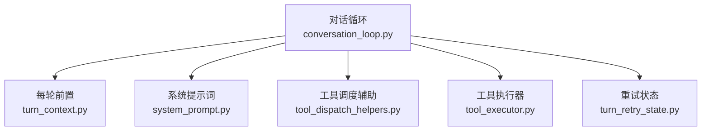
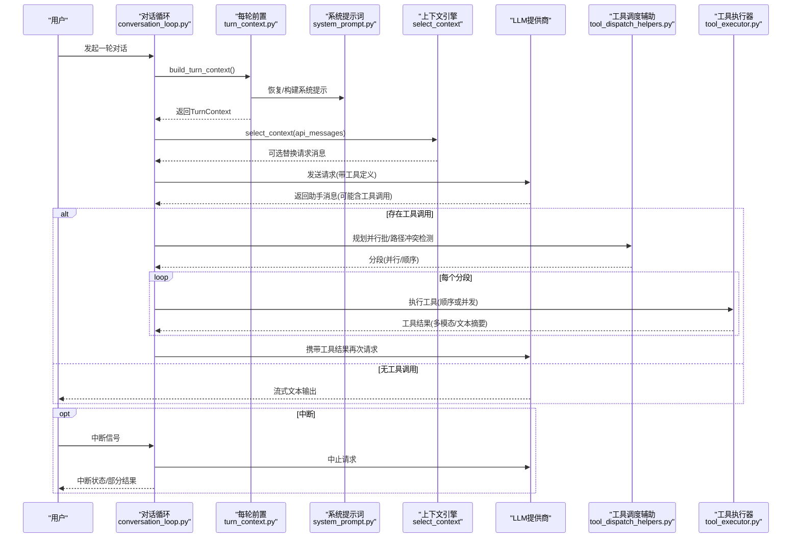
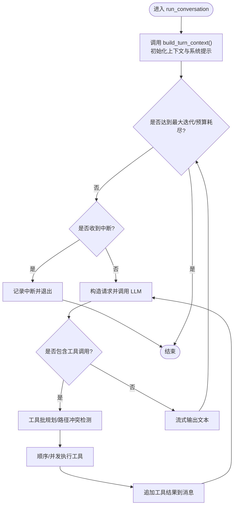
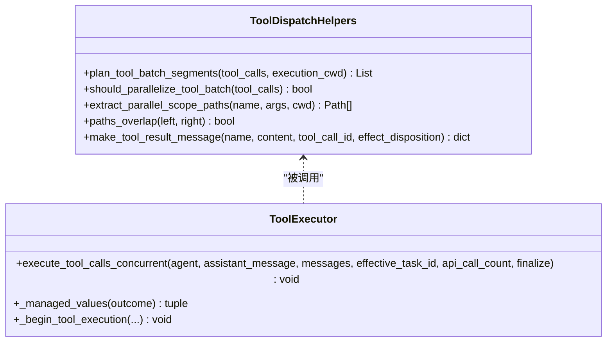
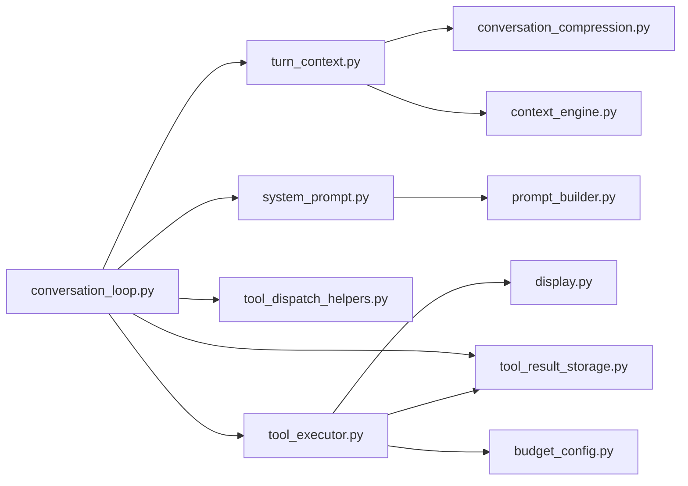

# AI代理核心

<cite>
**本文引用的文件**
- [conversation_loop.py](file://agent/conversation_loop.py)
- [turn_context.py](file://agent/turn_context.py)
- [system_prompt.py](file://agent/system_prompt.py)
- [tool_dispatch_helpers.py](file://agent/tool_dispatch_helpers.py)
- [tool_executor.py](file://agent/tool_executor.py)
- [turn_retry_state.py](file://agent/turn_retry_state.py)
</cite>

## 目录
1. [简介](#简介)
2. [项目结构](#项目结构)
3. [核心组件](#核心组件)
4. [架构总览](#架构总览)
5. [详细组件分析](#详细组件分析)
6. [依赖关系分析](#依赖关系分析)
7. [性能考虑](#性能考虑)
8. [故障排除指南](#故障排除指南)
9. [结论](#结论)
10. [附录](#附录)

## 简介
本文件面向Hermes Agent的AI代理核心，聚焦对话循环管理机制与工具调用调度。重点解释run_conversation的实现原理、消息处理流程、错误处理与重试机制；会话状态管理、上下文构建与系统提示词生成过程；工具调用的解析、参数校验与执行结果处理；流式响应、中断与恢复策略；并提供扩展对话循环与自定义处理逻辑的实践建议，以及性能优化与故障排除指南。

## 项目结构
围绕对话循环的核心模块按职责划分：
- 对话循环编排：conversation_loop.py（主循环、重试、压缩、流式与中断）
- 每轮前置准备：turn_context.py（用户消息清洗、系统提示缓存、预检压缩、外部记忆预热等）
- 系统提示词组装：system_prompt.py（稳定/上下文/易变三层提示词拼装与缓存）
- 工具调度辅助：tool_dispatch_helpers.py（并行批规划、路径冲突检测、多模态结果封装）
- 工具执行器：tool_executor.py（顺序/并发执行、授权门控、预算与持久化）
- 重试状态：turn_retry_state.py（单轮尝试的一次性恢复标志与重启信号）

**图表来源**
- [conversation_loop.py:1371-1599](file://agent/conversation_loop.py#L1371-L1599)
- [turn_context.py:412-800](file://agent/turn_context.py#L412-L800)
- [system_prompt.py:152-596](file://agent/system_prompt.py#L152-L596)
- [tool_dispatch_helpers.py:116-248](file://agent/tool_dispatch_helpers.py#L116-L248)
- [tool_executor.py:758-800](file://agent/tool_executor.py#L758-L800)
- [turn_retry_state.py:32-94](file://agent/turn_retry_state.py#L32-L94)

**章节来源**
- [conversation_loop.py:1371-1599](file://agent/conversation_loop.py#L1371-L1599)
- [turn_context.py:412-800](file://agent/turn_context.py#L412-L800)
- [system_prompt.py:152-596](file://agent/system_prompt.py#L152-L596)
- [tool_dispatch_helpers.py:116-248](file://agent/tool_dispatch_helpers.py#L116-L248)
- [tool_executor.py:758-800](file://agent/tool_executor.py#L758-L800)
- [turn_retry_state.py:32-94](file://agent/turn_retry_state.py#L32-L94)

## 核心组件
- run_conversation：驱动一次用户回合的完整生命周期，包含迭代控制、重试、压缩、流式输出、中断与最终化。
- build_turn_context：每轮一次性前置工作，包括安全stdio、会话恢复、日志上下文绑定、MCP刷新、用户消息清洗、系统提示恢复/构建、DB会话行创建、空闲压缩触发、插件钩子与外部记忆预热。
- system_prompt：将系统提示分为稳定层、上下文层、易变层，保证跨轮次前缀缓存命中。
- tool_dispatch_helpers：对模型返回的工具调用进行并行批规划、路径冲突检测、多模态结果封装与安全包装。
- tool_executor：实现顺序与并发工具执行，含授权门控、预算限制、中间结果持久化与终端后回调。
- TurnRetryState：集中管理单次API尝试的恢复标志与重启信号，避免重复尝试与死循环。

**章节来源**
- [conversation_loop.py:1371-1599](file://agent/conversation_loop.py#L1371-L1599)
- [turn_context.py:412-800](file://agent/turn_context.py#L412-L800)
- [system_prompt.py:152-596](file://agent/system_prompt.py#L152-L596)
- [tool_dispatch_helpers.py:116-248](file://agent/tool_dispatch_helpers.py#L116-L248)
- [tool_executor.py:758-800](file://agent/tool_executor.py#L758-L800)
- [turn_retry_state.py:32-94](file://agent/turn_retry_state.py#L32-L94)

## 架构总览
下图展示从用户输入到工具执行与结果回传的端到端流程，涵盖系统提示构建、上下文选择、API调用、工具调度与执行、流式输出与中断恢复。

**图表来源**
- [conversation_loop.py:1371-1599](file://agent/conversation_loop.py#L1371-L1599)
- [turn_context.py:412-800](file://agent/turn_context.py#L412-L800)
- [system_prompt.py:152-596](file://agent/system_prompt.py#L152-L596)
- [tool_dispatch_helpers.py:116-248](file://agent/tool_dispatch_helpers.py#L116-L248)
- [tool_executor.py:758-800](file://agent/tool_executor.py#L758-L800)

## 详细组件分析

### 对话循环 run_conversation
- 入口与参数：接收用户消息、系统消息、历史、任务ID、流回调、持久化元数据等。
- 每轮前置：委托build_turn_context完成stdio保护、会话恢复、日志上下文、MCP刷新、用户消息清洗、系统提示恢复/构建、DB会话行创建、空闲压缩、插件钩子与外部记忆预热。
- 主循环控制：维护api_call_count、iteration_budget、压缩尝试计数、长度续传重试、截断工具调用重试等；支持Codex专用模式分支。
- 中断检查：每轮开始检查中断标志，若中断则终止并记录退出原因。
- 重试与恢复：结合TurnRetryState进行一次性恢复分支（如凭证刷新、内容过滤阻断、压缩重启、长度续传、格式修复等）。
- 流式与最终化：通过stream_callback推送增量文本；最终由finalize_turn统一收尾。

**图表来源**
- [conversation_loop.py:1371-1599](file://agent/conversation_loop.py#L1371-L1599)
- [turn_context.py:412-800](file://agent/turn_context.py#L412-L800)
- [turn_retry_state.py:32-94](file://agent/turn_retry_state.py#L32-L94)

**章节来源**
- [conversation_loop.py:1371-1599](file://agent/conversation_loop.py#L1371-L1599)
- [turn_context.py:412-800](file://agent/turn_context.py#L412-L800)
- [turn_retry_state.py:32-94](file://agent/turn_retry_state.py#L32-L94)

### 每轮前置 build_turn_context
- 安全与上下文：安装安全stdio、恢复被旋转的压缩会话、设置会话日志上下文、绑定技能写入来源。
- MCP刷新：在每轮开始前刷新已注册MCP工具，避免冷启动延迟影响本轮工具快照。
- 用户消息清洗：去除代理字符、保留原始消息用于转录、注入插件上下文与外部记忆预热。
- 系统提示缓存：优先从会话DB恢复，否则构建并持久化；支持静态前缀重建以维持前缀缓存命中。
- DB会话行创建：在压缩之前确保会话行存在，避免外键约束失败。
- 空闲压缩：根据空闲时长与token阈值决定是否立即压缩历史。
- 指标与审计：重置重试计数器、迭代预算、视觉能力标记、工具护栏等。

**章节来源**
- [turn_context.py:412-800](file://agent/turn_context.py#L412-L800)

### 系统提示词生成 system_prompt
- 三层结构：
  - 稳定层：身份、通用指导、工具使用强制、平台提示、编码环境提示等。
  - 上下文层：工作区快照、上下文文件、调用方提供的system_message。
  - 易变层：技能索引、记忆快照、USER档案、外部记忆块、时间戳与运行时标识。
- 缓存友好：稳定层在前，易变层在后，最大化前缀缓存命中；支持静态前缀重建与失效。
- 平台与配置：支持平台特定提示覆盖、Telegram富消息扩展、桌面嵌入式终端澄清等。

**章节来源**
- [system_prompt.py:152-596](file://agent/system_prompt.py#L152-L596)

### 工具调用调度与执行
- 批规划与并行安全：
  - 识别不可并行工具（交互类）、只读安全工具、路径相关读写工具。
  - 基于路径重叠检测决定并行段边界，避免写-读竞争。
  - 对MCP工具进行并行安全性查询。
- 多模态结果封装：
  - 支持“_multimodal”信封，提供content列表与text_summary。
  - 为高风险工具结果添加不可信数据包裹，防止间接提示注入。
- 执行器：
  - 顺序与并发执行，线程池上限与图像生成并行度可调。
  - 授权门控序列化审批提示，排除人类等待时间对批截止的影响。
  - 工具结果预算限制与持久化，中途崩溃可恢复。
  - 终端后回调与进度上报。

**图表来源**
- [tool_dispatch_helpers.py:116-248](file://agent/tool_dispatch_helpers.py#L116-L248)
- [tool_executor.py:758-800](file://agent/tool_executor.py#L758-L800)

**章节来源**
- [tool_dispatch_helpers.py:116-248](file://agent/tool_dispatch_helpers.py#L116-L248)
- [tool_executor.py:758-800](file://agent/tool_executor.py#L758-L800)

### 流式响应、中断与恢复
- 流式输出：通过stream_callback推送增量文本，TTS管道可在完整响应前启动音频生成。
- 中断机制：每轮检查中断标志；若中断，向用户提供中断状态信息并终止当前请求。
- 恢复策略：
  - 内容策略阻断：统一附加恢复提示，避免重复重试。
  - 压缩锁定：当压缩锁被其他路径持有时，软延迟而非耗尽。
  - 系统提示同步：在提供商故障转移后同步api_messages中的系统消息，保持缓存布局一致。
  - 上下文引擎选择：每轮可选select_context替换请求消息，不影响持久化历史。

**章节来源**
- [conversation_loop.py:800-1599](file://agent/conversation_loop.py#L800-L1599)

### 扩展点与自定义处理
- 扩展对话循环：
  - 在run_conversation主循环前后插入自定义步骤（例如额外审计、指标采集）。
  - 利用step_callback在每步执行时触发网关钩子事件。
- 自定义工具处理：
  - 通过tool_dispatch_helpers的并行规划规则扩展新的安全/路径工具类别。
  - 在tool_executor中增加新的授权门控或预算策略。
- 自定义上下文选择：
  - 实现ContextEngine.select_context以按需替换请求消息，实现路由或角色切换。
- 系统提示定制：
  - 通过system_prompt的平台提示覆盖与上下文文件注入，调整行为与提示风格。

[本节为概念性说明，不直接分析具体代码文件]

## 依赖关系分析
- conversation_loop依赖turn_context进行每轮前置，依赖system_prompt构建系统提示，依赖tool_dispatch_helpers与tool_executor进行工具调度与执行，依赖turn_retry_state管理恢复状态。
- turn_context依赖conversation_compression与context_engine进行压缩与自动压缩状态消息。
- system_prompt依赖prompt_builder与runtime_cwd获取环境与上下文。
- tool_executor依赖display、tool_result_storage、budget_config等进行显示、持久化与预算控制。

**图表来源**
- [conversation_loop.py:1371-1599](file://agent/conversation_loop.py#L1371-L1599)
- [turn_context.py:412-800](file://agent/turn_context.py#L412-L800)
- [system_prompt.py:152-596](file://agent/system_prompt.py#L152-L596)
- [tool_executor.py:758-800](file://agent/tool_executor.py#L758-L800)

**章节来源**
- [conversation_loop.py:1371-1599](file://agent/conversation_loop.py#L1371-L1599)
- [turn_context.py:412-800](file://agent/turn_context.py#L412-L800)
- [system_prompt.py:152-596](file://agent/system_prompt.py#L152-L596)
- [tool_executor.py:758-800](file://agent/tool_executor.py#L758-L800)

## 性能考虑
- 系统提示前缀缓存：稳定层在前、易变层在后，最大化缓存命中；避免频繁重建导致成本上升。
- 工具并行规划：基于路径冲突检测与只读安全工具集合，减少不必要的串行屏障，提升吞吐。
- 工具结果预算：按上下文窗口缩放结果大小，避免单次工具结果过大导致请求超限。
- 流式输出：尽早推送增量文本，降低首字延迟；TTS提前启动，改善用户体验。
- 压缩与空闲压缩：在长会话中主动压缩历史，减少请求体积；空闲时段触发压缩，避免每次重读大历史。
- 中间结果持久化：工具执行过程中及时落盘，提高崩溃恢复能力，减少重复工作。

[本节提供一般性指导，不直接分析具体文件]

## 故障排除指南
- 内容策略阻断：若出现内容过滤阻断，查看统一恢复提示并按建议调整请求或上下文。
- 压缩锁定：当提示“压缩已在运行”，稍后重试；避免将软延迟误判为耗尽。
- 系统提示不一致：故障转移后若提示缓存异常，检查静态前缀重建与缓存装饰逻辑。
- 工具执行超时：调整并发工具超时与环境变量；检查授权门控与人类等待时间。
- 凭证问题：关注提供商401/400错误与一次性刷新标志，必要时切换到备用提供商。
- 流式中途中断：确认中断标志与流式回调；必要时重新发起请求并续传。

**章节来源**
- [conversation_loop.py:800-1599](file://agent/conversation_loop.py#L800-L1599)
- [turn_retry_state.py:32-94](file://agent/turn_retry_state.py#L32-L94)

## 结论
Hermes Agent的AI代理核心通过清晰的模块化设计实现了健壮的对话循环：每轮前置确保上下文与系统提示稳定；工具调度兼顾安全与性能；流式输出与中断机制提升交互体验；重试与恢复策略保障鲁棒性。通过扩展点可灵活定制行为，满足多样化场景需求。

[本节为总结性内容，不直接分析具体文件]

## 附录
- 关键函数路径参考：
  - run_conversation：[conversation_loop.py:1371-1599](file://agent/conversation_loop.py#L1371-L1599)
  - build_turn_context：[turn_context.py:412-800](file://agent/turn_context.py#L412-L800)
  - build_system_prompt_parts/build_system_prompt：[system_prompt.py:152-596](file://agent/system_prompt.py#L152-L596)
  - _plan_tool_batch_segments/_should_parallelize_tool_batch：[tool_dispatch_helpers.py:116-248](file://agent/tool_dispatch_helpers.py#L116-L248)
  - execute_tool_calls_concurrent：[tool_executor.py:758-800](file://agent/tool_executor.py#L758-L800)
  - TurnRetryState：[turn_retry_state.py:32-94](file://agent/turn_retry_state.py#L32-L94)

[本节为引用汇总，不直接分析具体文件]