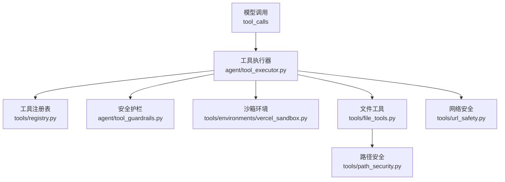
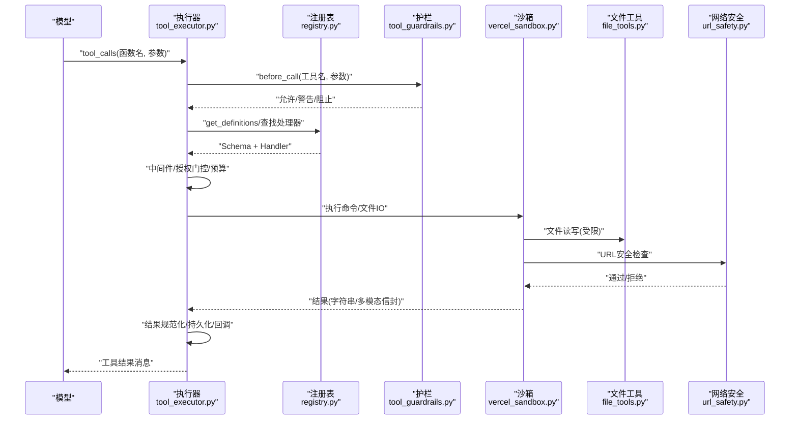
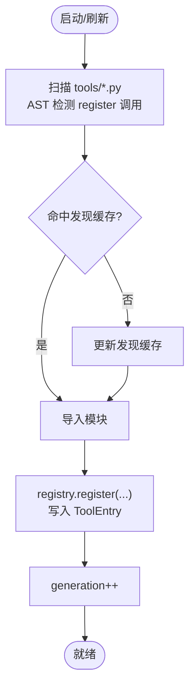
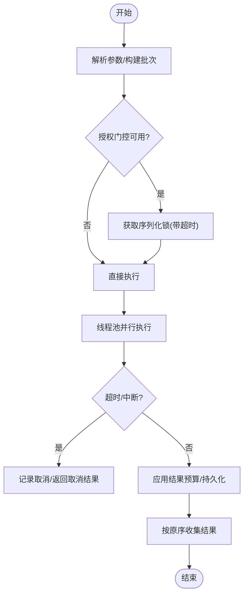
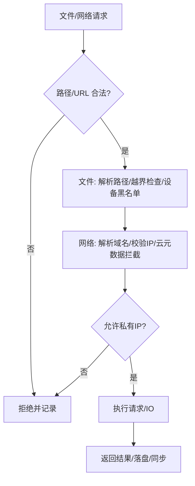
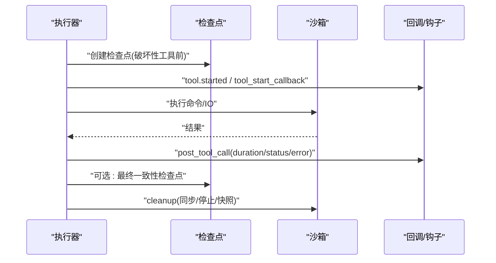
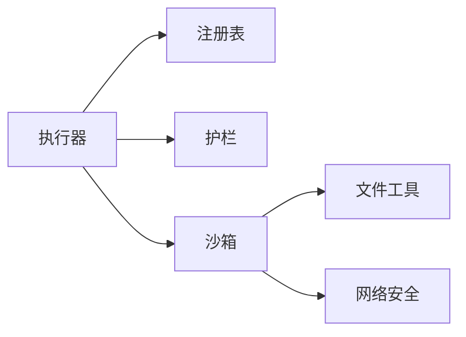

# 工具执行引擎

<cite>
**本文引用的文件**   
- [agent/tool_executor.py](file://agent/tool_executor.py)
- [tools/registry.py](file://tools/registry.py)
- [agent/tool_guardrails.py](file://agent/tool_guardrails.py)
- [tools/environments/vercel_sandbox.py](file://tools/environments/vercel_sandbox.py)
- [tools/file_tools.py](file://tools/file_tools.py)
- [tools/path_security.py](file://tools/path_security.py)
- [tools/url_safety.py](file://tools/url_safety.py)
</cite>

## 目录
1. [简介](#简介)
2. [项目结构](#项目结构)
3. [核心组件](#核心组件)
4. [架构总览](#架构总览)
5. [详细组件分析](#详细组件分析)
6. [依赖关系分析](#依赖关系分析)
7. [性能考量](#性能考量)
8. [故障排查指南](#故障排查指南)
9. [结论](#结论)
10. [附录](#附录)

## 简介
本文件面向 Sparkii Agent 的“工具执行引擎”，系统性说明工具注册、发现与版本管理；并发调度算法（并行执行、资源隔离、超时控制）；安全沙箱（权限控制、文件系统访问限制、网络请求过滤）；工具生命周期（启动、运行、监控、清理）；以及自定义工具开发指南（接口定义、参数校验、错误处理模式）。同时给出性能调优与安全最佳实践，帮助读者在保障安全的前提下获得高吞吐与低延迟的工具调用体验。

## 项目结构
围绕工具执行的关键模块分布如下：
- 工具注册与分发：tools/registry.py
- 工具执行编排与并发调度：agent/tool_executor.py
- 工具安全护栏（防循环/滥用）：agent/tool_guardrails.py
- 沙箱环境实现（以 Vercel Sandbox 为例）：tools/environments/vercel_sandbox.py
- 文件操作与安全路径校验：tools/file_tools.py、tools/path_security.py
- 网络安全（SSRF 防护、URL 白名单/黑名单）：tools/url_safety.py

图表来源
- [agent/tool_executor.py:758-800](file://agent/tool_executor.py#L758-L800)
- [tools/registry.py:414-764](file://tools/registry.py#L414-L764)
- [agent/tool_guardrails.py:273-440](file://agent/tool_guardrails.py#L273-L440)
- [tools/environments/vercel_sandbox.py:243-343](file://tools/environments/vercel_sandbox.py#L243-L343)
- [tools/file_tools.py:152-200](file://tools/file_tools.py#L152-L200)
- [tools/path_security.py:15-34](file://tools/path_security.py#L15-L34)
- [tools/url_safety.py:415-519](file://tools/url_safety.py#L415-L519)

章节来源
- [agent/tool_executor.py:758-800](file://agent/tool_executor.py#L758-L800)
- [tools/registry.py:108-159](file://tools/registry.py#L108-L159)

## 核心组件
- 工具注册表（ToolRegistry）：集中维护工具元数据、Schema、处理器、可用性检查、工具集别名与覆盖策略，提供并发安全的快照与生成号机制，支持动态刷新与插件覆盖授权。
- 工具执行器（Concurrent Executor）：负责解析参数、中间件管线、授权门控、并发调度、预算与结果持久化、进度上报与回调。
- 安全护栏（Guardrails）：按轮次统计重复失败、无进展调用，实施警告或硬停止；对易失控工具（如 web_search、delegate_task）设置每轮上限。
- 沙箱环境（BaseEnvironment 子类）：封装远程/容器化执行环境的生命周期、文件同步、命令执行、超时取消与清理。
- 文件工具与安全：统一路径解析、读取大小限制、设备路径黑名单、目录越界校验。
- 网络安全：严格的 SSRF 防护，连接时 DNS 重绑定防护，敏感查询参数检测，全局开关与可信主机例外。

章节来源
- [tools/registry.py:201-764](file://tools/registry.py#L201-L764)
- [agent/tool_executor.py:482-662](file://agent/tool_executor.py#L482-L662)
- [agent/tool_guardrails.py:273-508](file://agent/tool_guardrails.py#L273-L508)
- [tools/environments/vercel_sandbox.py:243-663](file://tools/environments/vercel_sandbox.py#L243-L663)
- [tools/file_tools.py:52-149](file://tools/file_tools.py#L52-L149)
- [tools/path_security.py:15-44](file://tools/path_security.py#L15-L44)
- [tools/url_safety.py:1-26](file://tools/url_safety.py#L1-L26)

## 架构总览
下图展示一次工具调用的端到端流程：从模型发出的 tool_calls 到执行器编排、安全护栏决策、注册表分发、沙箱执行、文件/网络访问控制，再到结果回写与回调通知。

图表来源
- [agent/tool_executor.py:482-662](file://agent/tool_executor.py#L482-L662)
- [tools/registry.py:717-764](file://tools/registry.py#L717-L764)
- [agent/tool_guardrails.py:295-440](file://agent/tool_guardrails.py#L295-L440)
- [tools/environments/vercel_sandbox.py:591-637](file://tools/environments/vercel_sandbox.py#L591-L637)
- [tools/file_tools.py:152-200](file://tools/file_tools.py#L152-L200)
- [tools/url_safety.py:415-519](file://tools/url_safety.py#L415-L519)

## 详细组件分析

### 工具注册机制：发现、加载与版本管理
- 自动发现：扫描 tools/*.py，AST 检测顶层是否包含 registry.register(...) 调用，缓存 mtime+size 加速后续扫描。
- 动态导入：仅导入声明了注册的模块，忽略 __init__.py、registry.py、mcp_tool.py。
- 注册项：ToolEntry 保存名称、工具集、Schema、处理器、check_fn、环境变量要求、异步标记、描述、表情、结果大小上限、动态 Schema 覆盖等。
- 可用性与缓存：check_fn 结果 TTL 缓存（约30秒），并具备“最近成功后的短暂失败宽容”机制，避免瞬时抖动导致工具不可用。
- 版本与覆盖：跨工具集覆盖需显式 opt-in（allow_tool_override），防止误覆盖内置工具；支持 deregister 清理（插件域内或 MCP 动态刷新豁免）。
- 生成号：每次变更递增 generation，外部可据此做缓存失效。

图表来源
- [tools/registry.py:108-159](file://tools/registry.py#L108-L159)
- [tools/registry.py:201-230](file://tools/registry.py#L201-L230)
- [tools/registry.py:233-380](file://tools/registry.py#L233-L380)
- [tools/registry.py:562-644](file://tools/registry.py#L562-L644)

章节来源
- [tools/registry.py:108-159](file://tools/registry.py#L108-L159)
- [tools/registry.py:201-230](file://tools/registry.py#L201-L230)
- [tools/registry.py:233-380](file://tools/registry.py#L233-L380)
- [tools/registry.py:562-644](file://tools/registry.py#L562-L644)

### 工具调度：并发执行、资源隔离与超时控制
- 并发执行：使用线程池并行执行多个工具调用，默认最大工作线程数固定，图像生成类工具有独立并发上限。
- 顺序与批处理：结果按原始顺序收集并追加到消息列表；支持分段批处理（segmented batch）以避免单次过大批次。
- 授权门控：序列化审批提示，排除人类等待时间计入批次截止时间，避免死锁或饥饿。
- 超时控制：
  - 并发工具超时：可通过环境变量配置，默认值足够长以容纳慢速但合法的摘要任务。
  - 授权门控锁超时：基于 human_wait_ceiling 计算，防止挂起的 pre_tool_call 插件阻塞整个批次。
- 中断与取消：支持用户中断快速跳过剩余工具调用，并记录取消原因。
- 预算与结果持久化：按上下文窗口缩放的结果预算，增量持久化工具调用进度，确保破坏性操作后会话不丢失。

图表来源
- [agent/tool_executor.py:93-131](file://agent/tool_executor.py#L93-L131)
- [agent/tool_executor.py:160-176](file://agent/tool_executor.py#L160-L176)
- [agent/tool_executor.py:391-468](file://agent/tool_executor.py#L391-L468)
- [agent/tool_executor.py:758-800](file://agent/tool_executor.py#L758-L800)

章节来源
- [agent/tool_executor.py:93-131](file://agent/tool_executor.py#L93-L131)
- [agent/tool_executor.py:160-176](file://agent/tool_executor.py#L160-L176)
- [agent/tool_executor.py:391-468](file://agent/tool_executor.py#L391-L468)
- [agent/tool_executor.py:758-800](file://agent/tool_executor.py#L758-L800)

### 安全沙箱：权限控制、文件系统限制与网络过滤
- 权限控制：
  - 工具级 check_fn 探测外部依赖（Docker/Modal/Playwright 等），TTL 缓存并容忍短暂失败。
  - 插件覆盖需显式授权，禁止隐式替换内置工具。
- 文件系统访问限制：
  - 路径解析基于任务工作目录，避免进程 cwd 漂移导致的误写。
  - 读取大小限制（默认约10万字符），大文件提示分页读取。
  - 设备路径黑名单（/dev/*）防止无限输出或阻塞。
  - 目录越界校验（validate_within_dir）确保路径在允许根目录下。
- 网络请求过滤：
  - 严格 SSRF 防护：DNS 解析后校验 IP，阻断私有/环回/链路本地/组播/未指定地址及 CGNAT。
  - 云元数据地址与主机名始终阻断（如 169.254.169.254、metadata.google.internal）。
  - 连接时二次校验，抵御 DNS 重绑定；支持代理环境下 DNS 失败放行给代理侧解析。
  - 敏感查询参数检测与脱敏建议。

图表来源
- [tools/file_tools.py:52-149](file://tools/file_tools.py#L52-L149)
- [tools/path_security.py:15-44](file://tools/path_security.py#L15-L44)
- [tools/url_safety.py:311-519](file://tools/url_safety.py#L311-L519)

章节来源
- [tools/file_tools.py:52-149](file://tools/file_tools.py#L52-L149)
- [tools/path_security.py:15-44](file://tools/path_security.py#L15-L44)
- [tools/url_safety.py:311-519](file://tools/url_safety.py#L311-L519)

### 工具执行生命周期：启动、运行、监控与清理
- 启动：
  - 解析参数、构建批次、准备授权门控与预算。
  - 文件工具在执行前创建检查点（write_file/patch/terminal 破坏性命令）。
- 运行：
  - 中间件管线（请求改写、执行钩子）、前置插件阻断、护栏 before_call。
  - 并发执行，捕获中断与超时，记录进度与回调。
- 监控：
  - 进度回调（tool.started）、终端后置钩子（duration/status/error_type）。
  - 增量持久化保证破坏性操作后会话存活。
- 清理：
  - 沙箱环境在 cleanup 中同步回写、停止实例、关闭客户端，必要时创建快照以便复用。

图表来源
- [agent/tool_executor.py:665-756](file://agent/tool_executor.py#L665-L756)
- [agent/tool_executor.py:259-330](file://agent/tool_executor.py#L259-L330)
- [tools/environments/vercel_sandbox.py:639-663](file://tools/environments/vercel_sandbox.py#L639-L663)

章节来源
- [agent/tool_executor.py:665-756](file://agent/tool_executor.py#L665-L756)
- [agent/tool_executor.py:259-330](file://agent/tool_executor.py#L259-L330)
- [tools/environments/vercel_sandbox.py:639-663](file://tools/environments/vercel_sandbox.py#L639-L663)

### 自定义工具开发指南
- 接口定义：
  - 在工具模块顶层调用 registry.register(name, toolset, schema, handler, ...) 完成注册。
  - schema 为 OpenAI function 格式，name 必须唯一且属于同一工具集（除非显式 override）。
  - 可选字段：check_fn（可用性探测）、requires_env、is_async、description、emoji、max_result_size_chars、dynamic_schema_overrides。
- 参数验证：
  - 建议在 handler 内部进行强类型与业务规则校验；若失败，返回结构化错误（会被注册表截断与规范化）。
  - 对于路径/URL 等输入，优先复用 path_security 与 url_safety 提供的校验函数。
- 错误处理模式：
  - 统一返回字符串或受支持的多模态信封；其他类型将被视为错误并包装。
  - 错误体长度会被限制，日志保留更长片段便于诊断。
- 示例参考：
  - 查看现有工具模块如何组织 schema、handler、check_fn 与错误返回。

章节来源
- [tools/registry.py:562-644](file://tools/registry.py#L562-L644)
- [tools/registry.py:770-800](file://tools/registry.py#L770-L800)
- [tools/path_security.py:15-44](file://tools/path_security.py#L15-L44)
- [tools/url_safety.py:415-519](file://tools/url_safety.py#L415-L519)

## 依赖关系分析
- 松耦合设计：执行器通过注册表解耦具体工具实现；安全护栏与沙箱作为横切关注点被注入到执行流程。
- 关键依赖链：
  - tool_executor -> registry.get_definitions / handler 调用
  - tool_executor -> guardrails.before_call/after_call
  - tool_executor -> environment.execute（文件/网络由各自安全模块保护）
- 潜在循环风险：registry 刻意避免反向依赖 model_tools，降低循环导入风险；工具模块仅依赖 registry。

图表来源
- [agent/tool_executor.py:482-662](file://agent/tool_executor.py#L482-L662)
- [tools/registry.py:717-764](file://tools/registry.py#L717-L764)
- [tools/environments/vercel_sandbox.py:591-637](file://tools/environments/vercel_sandbox.py#L591-L637)

章节来源
- [agent/tool_executor.py:482-662](file://agent/tool_executor.py#L482-L662)
- [tools/registry.py:717-764](file://tools/registry.py#L717-L764)

## 性能考量
- 并发与限流：
  - 默认最大工作线程数固定，图像生成类工具单独限制并发，避免后端突发触发限流。
  - 批量分段执行减少单次开销，结合授权门控避免审批阻塞影响整体进度。
- 缓存与探测：
  - 工具发现缓存（mtime+size）显著降低扫描成本。
  - check_fn 结果 TTL 缓存与“最近成功宽容”机制减少外部状态抖动带来的误判。
- 结果预算：
  - 根据上下文窗口缩放结果大小预算，防止单条工具结果撑爆上下文。
- I/O 优化：
  - 文件读取限制与分页提示，避免一次性拉取超大文件。
  - 沙箱文件同步批量上传/下载，减少往返次数。

[本节为通用指导，无需特定文件引用]

## 故障排查指南
- 工具不可用：
  - 检查 check_fn 是否失败（外部依赖缺失/网络抖动），查看日志中的“Unavailable (check failed)”提示。
  - 确认是否存在跨工具集覆盖冲突或未授权的 override。
- 工具被阻止：
  - 查看护栏告警/硬停止信息（重复失败、无进展、超限），调整参数或策略。
  - 检查 URL 安全策略是否阻断（SSRF、云元数据、私有 IP）。
- 执行超时/中断：
  - 调整 SPARKII_CONCURRENT_TOOL_TIMEOUT_S；确认授权门控锁超时是否合理。
  - 用户中断会跳过剩余工具，注意记录取消原因。
- 文件/路径问题：
  - 路径越界、设备路径黑名单、读取超限会导致失败或截断；使用绝对路径与工作目录对齐。
- 沙箱异常：
  - 快照恢复失败将回退新建；检查网络与凭据；关注 stop/snapshot 日志。

章节来源
- [tools/registry.py:233-380](file://tools/registry.py#L233-L380)
- [agent/tool_guardrails.py:295-440](file://agent/tool_guardrails.py#L295-L440)
- [tools/url_safety.py:311-519](file://tools/url_safety.py#L311-L519)
- [agent/tool_executor.py:160-176](file://agent/tool_executor.py#L160-L176)
- [tools/file_tools.py:52-149](file://tools/file_tools.py#L52-L149)
- [tools/environments/vercel_sandbox.py:306-343](file://tools/environments/vercel_sandbox.py#L306-L343)

## 结论
Sparkii Agent 的工具执行引擎通过“注册表 + 执行器 + 护栏 + 沙箱 + 安全模块”的分层架构，实现了高可靠、高并发、强安全的工具调用能力。其核心优势包括：
- 可扩展的工具注册与动态刷新机制
- 精细化的并发调度与超时控制
- 完善的安全护栏与沙箱隔离
- 稳健的文件与网络访问控制
- 清晰的工具生命周期管理与可观测性

在生产环境中，建议结合业务场景调优并发与预算，启用必要的护栏策略，并遵循最小权限原则与网络白名单策略，以获得最佳的性能与安全平衡。

[本节为总结性内容，无需特定文件引用]

## 附录
- 常用配置与环境变量：
  - SPARKII_CONCURRENT_TOOL_TIMEOUT_S：并发工具超时（秒）
  - security.allow_private_urls / browser.allow_private_urls：是否允许私有 IP 解析
  - SPARKII_ALLOW_PRIVATE_URLS：环境变量覆盖私有 IP 策略
- 最佳实践：
  - 为每个工具编写明确的 schema 与错误返回；尽量复用 path_security 与 url_safety。
  - 对破坏性操作开启检查点；对长耗时任务设置合理超时与重试。
  - 谨慎使用 override 与 deregister，确保插件覆盖经过审计。

[本节为补充信息，无需特定文件引用]