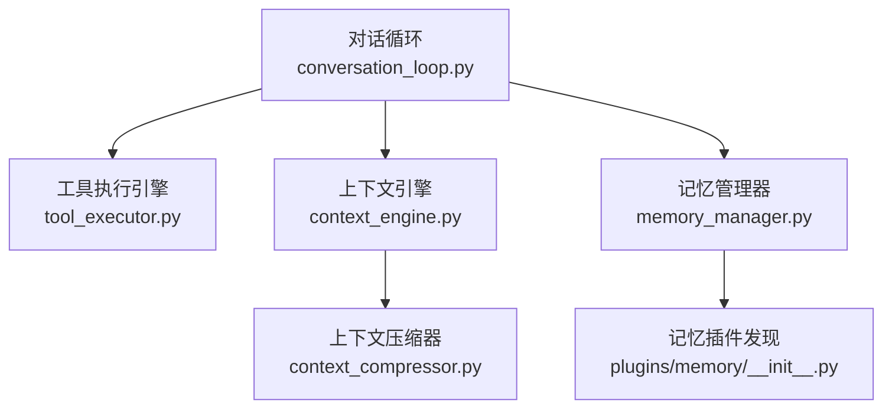
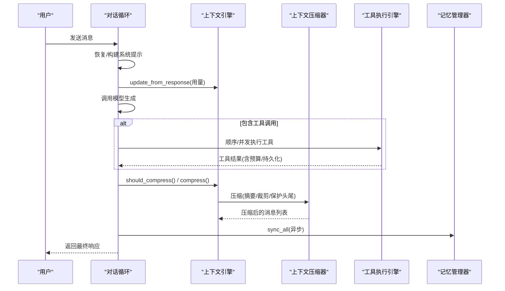
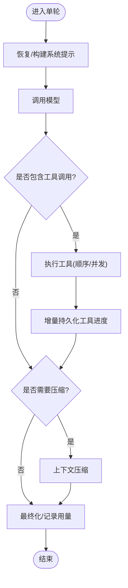
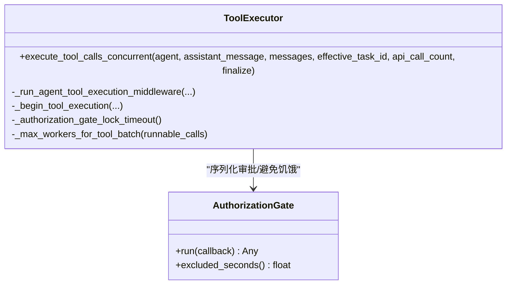
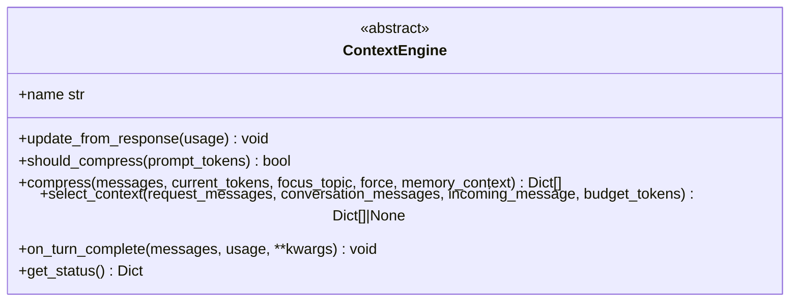
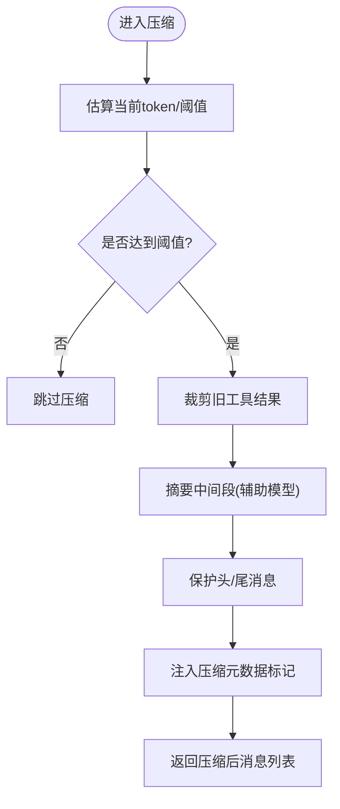
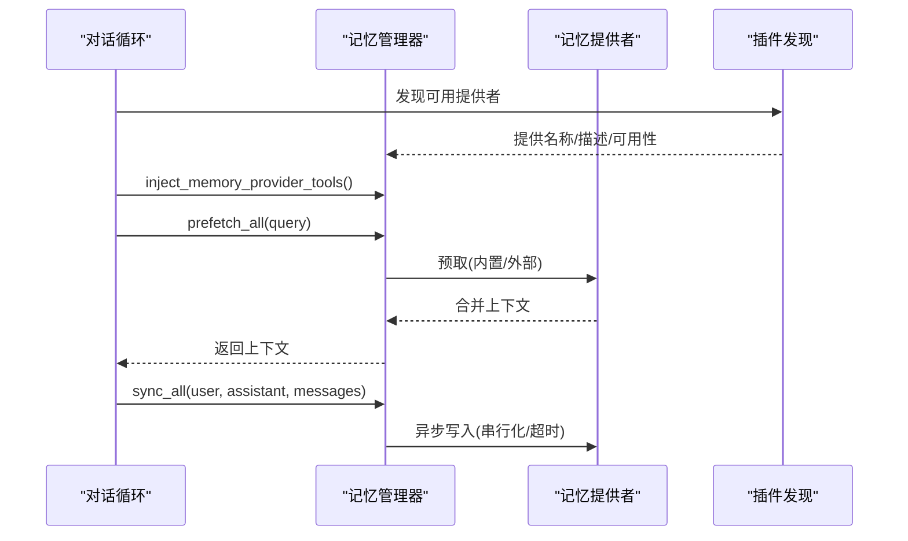
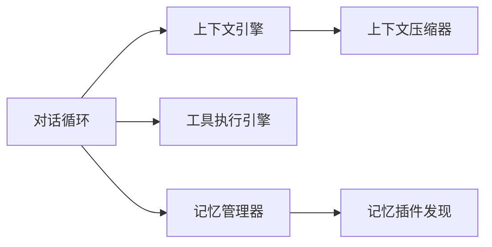

# 核心组件架构

<cite>
**本文引用的文件**
- [conversation_loop.py](file://agent/conversation_loop.py)
- [tool_executor.py](file://agent/tool_executor.py)
- [memory_manager.py](file://agent/memory_manager.py)
- [context_engine.py](file://agent/context_engine.py)
- [context_compressor.py](file://agent/context_compressor.py)
- [__init__.py](file://plugins/memory/__init__.py)
</cite>

## 目录
1. [简介](#简介)
2. [项目结构](#项目结构)
3. [核心组件](#核心组件)
4. [架构总览](#架构总览)
5. [详细组件分析](#详细组件分析)
6. [依赖关系分析](#依赖关系分析)
7. [性能考量](#性能考量)
8. [故障排查指南](#故障排查指南)
9. [结论](#结论)
10. [附录](#附录)

## 简介
本文件面向 Sparkii Agent 的核心组件，聚焦以下目标：
- 对话循环管理、工具调用调度、上下文处理与记忆系统的实现模式
- 工具执行引擎的注册机制、安全沙箱隔离、并行执行与资源管理
- 记忆系统的数据模型与存取模式（短期/长期记忆、用户画像）
- 上下文引擎的工作原理（压缩、引用管理、内存优化）
- 组件交互图与接口定义，帮助开发者理解模块设计思路

## 项目结构
围绕“对话循环—工具执行—上下文—记忆”的主干路径，关键文件职责如下：
- agent/conversation_loop.py：单轮对话主循环，协调模型调用、重试、压缩、后处理等
- agent/tool_executor.py：工具调用的顺序/并发执行、中间件、授权门控、结果持久化与预算控制
- agent/memory_manager.py：记忆提供者编排（内置+外部），预取/同步、工具注入、后台任务
- agent/context_engine.py：上下文引擎抽象与生命周期钩子（压缩触发、选择上下文、状态统计）
- agent/context_compressor.py：内置上下文压缩器（摘要、DAG、工具输出裁剪、滚动微压缩）
- plugins/memory/__init__.py：记忆插件发现与加载（内置/用户安装，命名冲突策略）

**图示来源**
- [conversation_loop.py:1-120](file://agent/conversation_loop.py#L1-L120)
- [tool_executor.py:1-120](file://agent/tool_executor.py#L1-L120)
- [context_engine.py:1-120](file://agent/context_engine.py#L1-L120)
- [context_compressor.py:1-120](file://agent/context_compressor.py#L1-L120)
- [memory_manager.py:1-120](file://agent/memory_manager.py#L1-L120)
- [__init__.py:1-120](file://plugins/memory/__init__.py#L1-L120)

**章节来源**
- [conversation_loop.py:1-120](file://agent/conversation_loop.py#L1-L120)
- [tool_executor.py:1-120](file://agent/tool_executor.py#L1-L120)
- [context_engine.py:1-120](file://agent/context_engine.py#L1-L120)
- [context_compressor.py:1-120](file://agent/context_compressor.py#L1-L120)
- [memory_manager.py:1-120](file://agent/memory_manager.py#L1-L120)
- [__init__.py:1-120](file://plugins/memory/__init__.py#L1-L120)

## 核心组件
- 对话循环：负责一轮请求的完整生命周期，包括系统提示恢复、错误分类与重试、上下文压缩前置检查、工具调用、最终化与背景记忆同步。
- 工具执行引擎：提供顺序/并发执行、中间件链、授权门控、结果存储与预算限制、进度回调与增量持久化。
- 上下文引擎：统一抽象压缩/选择上下文的生命周期，维护 token 用量与阈值，暴露可选工具与状态。
- 上下文压缩器：基于辅助模型的摘要压缩、工具结果裁剪、滚动微压缩、保护头尾消息、压缩元数据标记。
- 记忆管理器：多提供者编排（内置优先）、工具注入、预取/同步、后台串行写入、超时与失败隔离。
- 记忆插件发现：扫描内置与用户安装目录，按名称解析并加载唯一激活的记忆提供者。

**章节来源**
- [conversation_loop.py:1-200](file://agent/conversation_loop.py#L1-L200)
- [tool_executor.py:1-200](file://agent/tool_executor.py#L1-L200)
- [context_engine.py:1-200](file://agent/context_engine.py#L1-L200)
- [context_compressor.py:1-200](file://agent/context_compressor.py#L1-L200)
- [memory_manager.py:1-200](file://agent/memory_manager.py#L1-L200)
- [__init__.py:1-200](file://plugins/memory/__init__.py#L1-L200)

## 架构总览
Sparkii Agent 的核心由“对话循环”驱动，依次完成：
- 构建/恢复系统提示与缓存前缀
- 组装请求消息并执行 LLM 调用
- 根据返回的工具调用进行顺序或并发执行
- 在每轮结束后进行上下文压缩判断与执行
- 将本轮结果同步到记忆系统（异步）
- 最终化并刷新会话状态

**图示来源**
- [conversation_loop.py:1-200](file://agent/conversation_loop.py#L1-L200)
- [context_engine.py:120-220](file://agent/context_engine.py#L120-L220)
- [context_compressor.py:100-200](file://agent/context_compressor.py#L100-L200)
- [tool_executor.py:750-820](file://agent/tool_executor.py#L750-L820)
- [memory_manager.py:638-695](file://agent/memory_manager.py#L638-L695)

## 详细组件分析

### 对话循环（Conversation Loop）
- 系统提示恢复：从会话数据库读取/重建系统提示，保证前缀缓存命中；首次会话触发 on_session_start 钩子与额度预热。
- 错误分类与重试：区分本地处理错误与 API 错误，结合提供商特定错误（如 Copilot 400、Ollama 上下文过小）给出可操作指引。
- 中断与修正：支持流式响应被中断时的可见文本保留与修正追加，避免污染可回放内容。
- 压缩前置：在请求前评估是否需要压缩，必要时注入继续提示以避免重复推理。
- 最终化：统一收尾，记录用量、触发记忆同步、清理临时状态。

**图示来源**
- [conversation_loop.py:548-684](file://agent/conversation_loop.py#L548-L684)
- [conversation_loop.py:762-800](file://agent/conversation_loop.py#L762-L800)
- [tool_executor.py:178-206](file://agent/tool_executor.py#L178-L206)

**章节来源**
- [conversation_loop.py:548-684](file://agent/conversation_loop.py#L548-L684)
- [conversation_loop.py:762-800](file://agent/conversation_loop.py#L762-L800)
- [tool_executor.py:178-206](file://agent/tool_executor.py#L178-L206)

### 工具执行引擎（Tool Executor）
- 执行模式：支持顺序与并发两种模式；并发通过线程池与最大工作线程数控制，图像生成有独立并发上限。
- 中间件与安全：请求级中间件与执行中间件串联；pre_tool_call 插件拦截、守卫策略（guardrails）决定放行/阻断；授权门控序列化人类审批，避免交错。
- 结果与预算：结果持久化与每轮预算限制；对大上下文模型按比例缩放结果大小，防止单次结果撑爆上下文。
- 进度与回调：开始/结束回调、预览与脱敏参数展示；增量持久化确保破坏性工具调用也能落盘。
- 取消与异常：用户中断时快速短路并发批次，记录取消原因；捕获解释器关闭等异常并优雅降级。

**图示来源**
- [tool_executor.py:391-468](file://agent/tool_executor.py#L391-L468)
- [tool_executor.py:482-662](file://agent/tool_executor.py#L482-L662)
- [tool_executor.py:758-820](file://agent/tool_executor.py#L758-L820)

**章节来源**
- [tool_executor.py:78-112](file://agent/tool_executor.py#L78-L112)
- [tool_executor.py:178-206](file://agent/tool_executor.py#L178-L206)
- [tool_executor.py:391-468](file://agent/tool_executor.py#L391-L468)
- [tool_executor.py:482-662](file://agent/tool_executor.py#L482-L662)
- [tool_executor.py:758-820](file://agent/tool_executor.py#L758-L820)

### 上下文引擎（Context Engine）
- 抽象接口：统一压缩触发、压缩执行、选择上下文、会话生命周期钩子、状态统计与工具扩展。
- 压缩决策：维护 last_prompt_tokens/threshold_tokens 等指标，should_compress 决定是否压缩；支持 preflight 快速估算。
- 选择上下文：select_context 可在每次请求前替换上下文（检索/路由/分支切换），不影响持久化历史。
- 观察与统计：on_turn_complete 接收已完成回合的消息与用量，供引擎做索引/总结/路由更新。
- 状态显示：get_status 提供用量百分比、压缩计数等，便于 UI/日志展示。

**图示来源**
- [context_engine.py:89-180](file://agent/context_engine.py#L89-L180)
- [context_engine.py:215-279](file://agent/context_engine.py#L215-L279)
- [context_engine.py:281-328](file://agent/context_engine.py#L281-L328)
- [context_engine.py:435-490](file://agent/context_engine.py#L435-L490)

**章节来源**
- [context_engine.py:89-180](file://agent/context_engine.py#L89-L180)
- [context_engine.py:215-279](file://agent/context_engine.py#L215-L279)
- [context_engine.py:281-328](file://agent/context_engine.py#L281-L328)
- [context_engine.py:435-490](file://agent/context_engine.py#L435-L490)

### 上下文压缩器（Context Compressor）
- 摘要与保护：使用辅助模型对中间段进行摘要，保护头部（系统+若干非系统消息）与尾部（最近消息）不被压缩。
- 工具结果裁剪：在 LLM 摘要前对旧工具结果进行低成本裁剪，减少冗余 token。
- 滚动微压缩：在长会话中持续进行小步压缩，降低一次性压缩成本与风险。
- 元数据标记：为压缩消息添加不可见元数据键，便于前端过滤与回放一致性。
- 错误与配额：识别认证/配额类错误，避免无意义重试；提供继续提示以衔接压缩后的上下文。

**图示来源**
- [context_compressor.py:100-180](file://agent/context_compressor.py#L100-L180)

**章节来源**
- [context_compressor.py:100-180](file://agent/context_compressor.py#L100-L180)

### 记忆系统（Memory Manager & Providers）
- 提供者编排：内置提供者始终优先，最多允许一个外部提供者；工具名冲突与核心工具保留名严格保护。
- 预取与同步：turn 前 prefetch_all 收集相关上下文；turn 后 sync_all 异步写入，保证顺序与超时隔离。
- 工具注入：将记忆提供者的工具 schema 注入到代理工具集，受 enabled/disabled toolsets 控制。
- 流式清洗：StreamingContextScrubber 在流式输出中剔除 <memory-context> 块，避免泄露内部上下文到 UI。
- 插件发现：扫描内置与用户安装目录，按名称加载唯一激活提供者，支持描述与可用性检测。

**图示来源**
- [memory_manager.py:110-157](file://agent/memory_manager.py#L110-L157)
- [memory_manager.py:525-595](file://agent/memory_manager.py#L525-L595)
- [memory_manager.py:638-695](file://agent/memory_manager.py#L638-L695)
- [__init__.py:146-200](file://plugins/memory/__init__.py#L146-L200)

**章节来源**
- [memory_manager.py:110-157](file://agent/memory_manager.py#L110-L157)
- [memory_manager.py:525-595](file://agent/memory_manager.py#L525-L595)
- [memory_manager.py:638-695](file://agent/memory_manager.py#L638-L695)
- [__init__.py:146-200](file://plugins/memory/__init__.py#L146-L200)

## 依赖关系分析
- 对话循环依赖上下文引擎与工具执行引擎，并在每轮结束时触发记忆同步。
- 上下文引擎提供统一接口，内置压缩器作为默认实现，可扩展第三方引擎。
- 工具执行引擎依赖中间件、授权门控与结果存储，并与对话循环紧密协作。
- 记忆管理器聚合多个提供者，并通过插件发现机制动态加载。

**图示来源**
- [conversation_loop.py:1-120](file://agent/conversation_loop.py#L1-L120)
- [context_engine.py:1-120](file://agent/context_engine.py#L1-L120)
- [context_compressor.py:1-120](file://agent/context_compressor.py#L1-L120)
- [tool_executor.py:1-120](file://agent/tool_executor.py#L1-L120)
- [memory_manager.py:1-120](file://agent/memory_manager.py#L1-L120)
- [__init__.py:1-120](file://plugins/memory/__init__.py#L1-L120)

**章节来源**
- [conversation_loop.py:1-120](file://agent/conversation_loop.py#L1-L120)
- [context_engine.py:1-120](file://agent/context_engine.py#L1-L120)
- [context_compressor.py:1-120](file://agent/context_compressor.py#L1-L120)
- [tool_executor.py:1-120](file://agent/tool_executor.py#L1-L120)
- [memory_manager.py:1-120](file://agent/memory_manager.py#L1-L120)
- [__init__.py:1-120](file://plugins/memory/__init__.py#L1-L120)

## 性能考量
- 并发与限流：工具并发执行使用线程池，图像生成有独立并发上限；授权门控避免审批阻塞整批。
- 预算控制：按上下文窗口比例调整工具结果预算，避免单次结果过大导致请求超限。
- 压缩策略：滚动微压缩与工具结果裁剪降低摘要成本；保护头尾消息保障对话连贯性。
- 异步与超时：记忆同步与外部预取使用后台线程与超时，防止慢提供者拖垮主流程。
- 增量持久化：工具执行过程中及时落盘，提高崩溃恢复能力。

[本节为通用指导，不直接分析具体文件]

## 故障排查指南
- 认证/配额错误：识别认证缺失、配额耗尽等错误，给出明确的用户操作建议（充值、切换提供商）。
- Ollama 上下文过小：当运行时上下文低于最小要求时，提示调整配置并重启模型。
- 压缩失败：摘要阶段出现认证/配额错误时，跳过压缩并记录警告，避免影响后续流程。
- 工具执行中断：用户中断会短路并发批次，记录取消原因并返回标准化结果。
- 记忆提供者超时：外部提供者预取超时会跳过该提供者，避免阻塞主流程。

**章节来源**
- [conversation_loop.py:294-394](file://agent/conversation_loop.py#L294-L394)
- [context_compressor.py:73-95](file://agent/context_compressor.py#L73-L95)
- [tool_executor.py:294-330](file://agent/tool_executor.py#L294-L330)
- [memory_manager.py:547-595](file://agent/memory_manager.py#L547-L595)

## 结论
Sparkii Agent 的核心以“对话循环”为中心，协同“工具执行引擎”、“上下文引擎/压缩器”与“记忆管理器”，形成高内聚、低耦合的可扩展架构。通过中间件、授权门控、异步与超时机制，系统在可靠性、性能与可维护性之间取得平衡。开发者可基于统一接口扩展上下文引擎与记忆提供者，满足多样化场景需求。

[本节为总结，不直接分析具体文件]

## 附录
- 关键接口速览
  - 上下文引擎：update_from_response、should_compress、compress、select_context、on_turn_complete、get_status
  - 工具执行：execute_tool_calls_concurrent、_run_agent_tool_execution_middleware、_begin_tool_execution
  - 记忆管理：prefetch_all、sync_all、inject_memory_provider_tools、flush_pending
  - 插件发现：discover_memory_providers、load_memory_provider

[本节为补充信息，不直接分析具体文件]