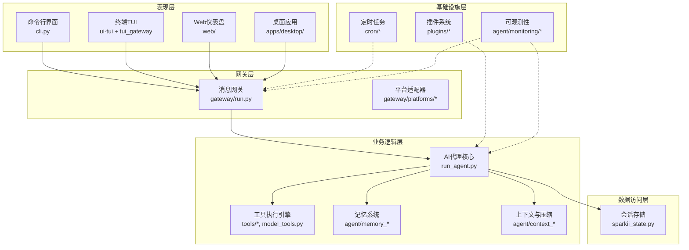
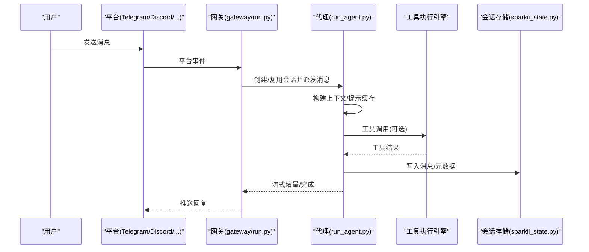
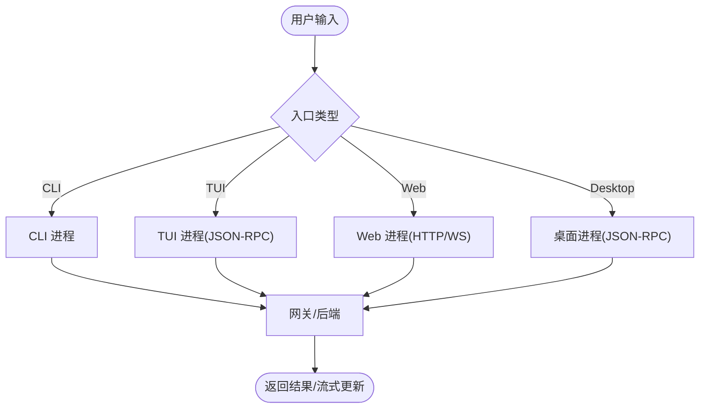
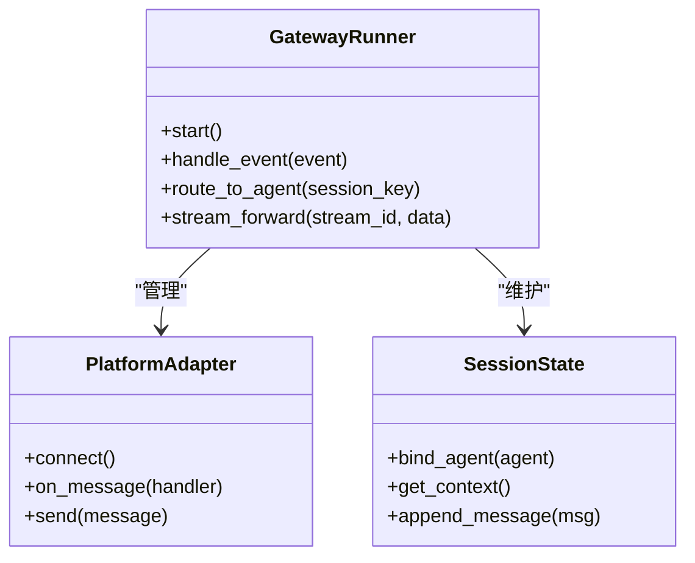
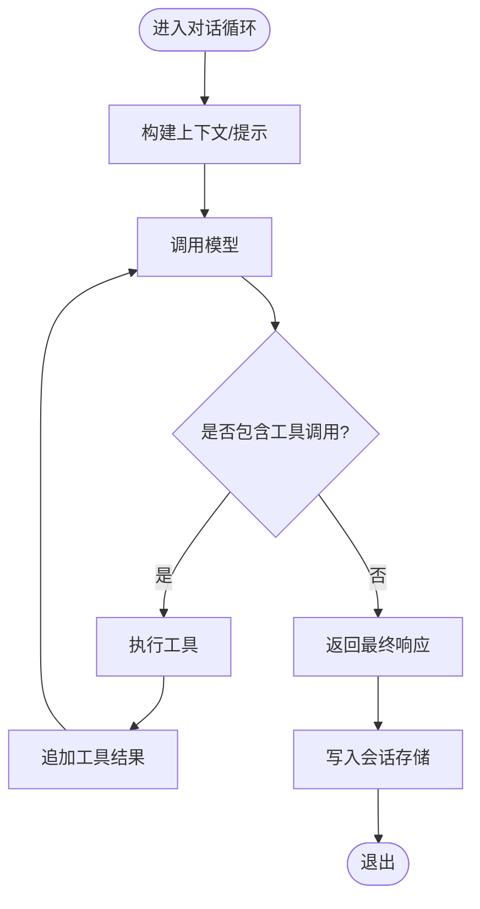
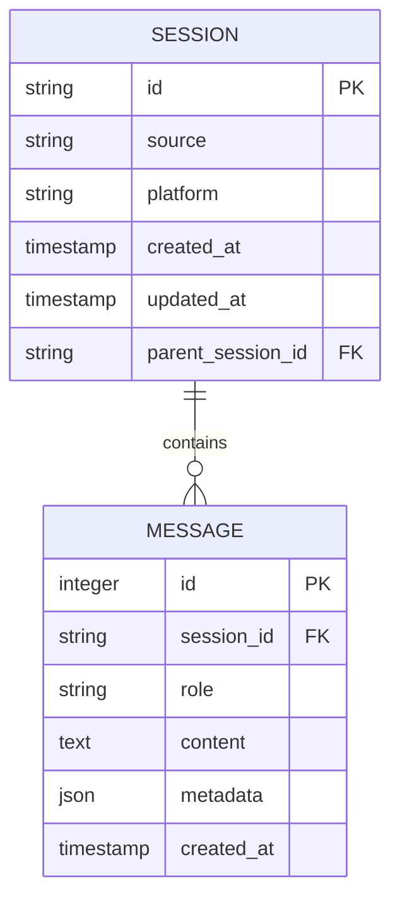
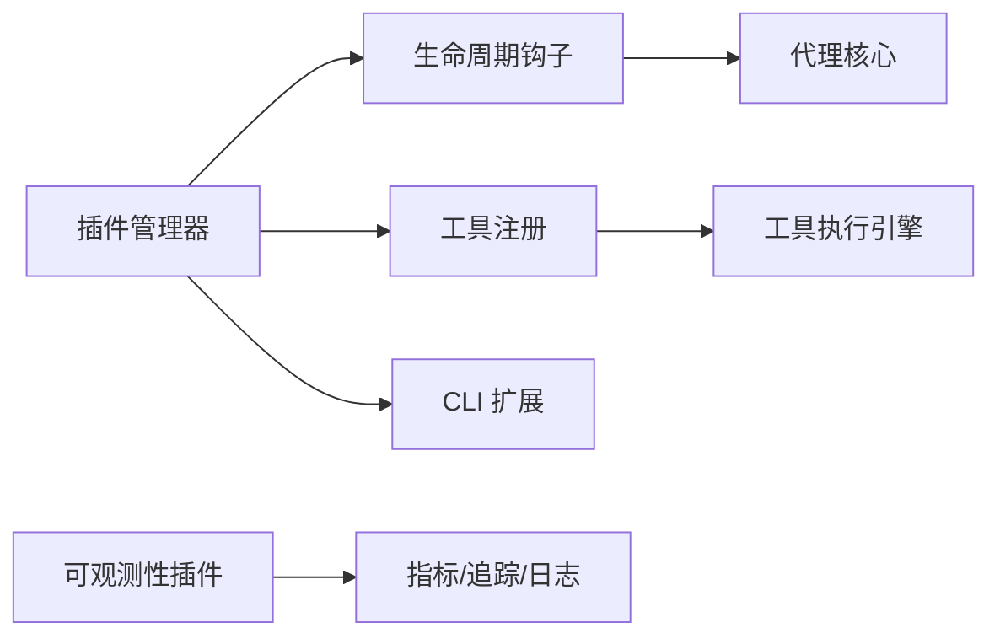
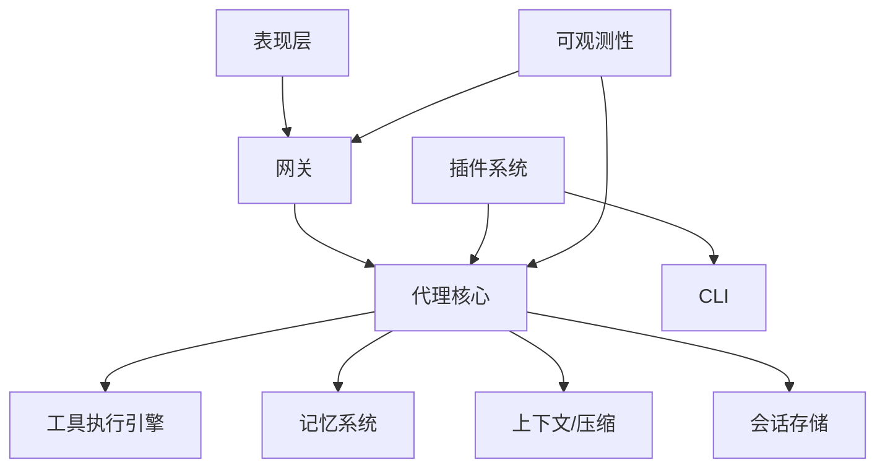

# 系统架构设计

<cite>
**本文引用的文件**
- [README.md](file://README.md)
- [AGENTS.md](file://AGENTS.md)
- [run_agent.py](file://run_agent.py)
- [cli.py](file://cli.py)
- [gateway/run.py](file://gateway/run.py)
- [sparkii_state.py](file://sparkii_state.py)
- [plugins/plugin_utils.py](file://plugins/plugin_utils.py)
</cite>

## 目录
1. [简介](#简介)
2. [项目结构](#项目结构)
3. [核心组件](#核心组件)
4. [架构总览](#架构总览)
5. [详细组件分析](#详细组件分析)
6. [依赖关系分析](#依赖关系分析)
7. [性能考量](#性能考量)
8. [故障排查指南](#故障排查指南)
9. [结论](#结论)
10. [附录](#附录)

## 简介
本设计文档面向 Sparkii Agent（亦称 Sparkii/Sparkii）的系统级架构，覆盖表现层、业务逻辑层、数据访问层与基础设施层；阐述微服务化边界（网关服务与代理进程分离）、事件驱动机制（异步消息处理、事件总线与状态管理）、系统边界与组件依赖、数据流向图，以及技术栈选择与第三方依赖管理策略。目标是让非专业读者也能理解整体分层与关键交互，同时为开发者提供可落地的架构参考。

## 项目结构
Sparkii 采用“窄腰宽边”的模块化组织：核心对话循环与工具编排位于 agent 与根模块，CLI/TUI/Web/Dashboard/桌面应用作为多种表现入口，gateway 负责多平台消息接入与路由，插件体系扩展能力边界，SQLite 会话存储承担持久化与检索。

图表来源
- [AGENTS.md:269-309](file://AGENTS.md#L269-L309)
- [gateway/run.py:1-200](file://gateway/run.py#L1-L200)
- [run_agent.py:1-200](file://run_agent.py#L1-L200)
- [sparkii_state.py:1-200](file://sparkii_state.py#L1-L200)

章节来源
- [AGENTS.md:269-309](file://AGENTS.md#L269-L309)
- [README.md:1-265](file://README.md#L1-L265)

## 核心组件
- 表现层
  - CLI：交互式终端入口，命令解析、技能斜杠命令、皮肤主题等。
  - TUI：基于 Ink 的终端 UI，通过 JSON-RPC over stdio 与 Python 后端通信。
  - Web：仪表盘与聊天嵌入，复用 TUI 体验或独立前端。
  - 桌面应用：Electron + React，通过共享 JSON-RPC 客户端与后端通信。
- 网关层
  - 统一消息网关：聚合 Telegram、Discord、Slack、WhatsApp、Signal 等平台，负责认证、鉴权、会话绑定、流式转发与调度。
- 业务逻辑层
  - AI代理核心：对话循环、工具调用编排、预算与中断控制、上下文压缩、重试与降级。
  - 工具执行引擎：工具注册表、工具集、安全护栏、结果分类与输出限制。
  - 记忆系统：会话记忆、用户画像、跨会话检索与总结。
  - 上下文与压缩：长对话压缩、摘要生成、提示缓存保护。
- 数据访问层
  - SQLite 会话存储：WAL 模式、FTS5 全文检索、会话拆分与链式父子关系、导出/恢复限制。
- 基础设施层
  - 插件系统：生命周期钩子、工具注入、CLI 子命令扩展、MCP 集成。
  - 定时任务：内置 cron 调度器，支持平台投递。
  - 可观测性：指标、追踪、日志与健康检查。

章节来源
- [AGENTS.md:269-309](file://AGENTS.md#L269-L309)
- [AGENTS.md:413-545](file://AGENTS.md#L413-L545)
- [AGENTS.md:548-596](file://AGENTS.md#L548-L596)
- [AGENTS.md:774-798](file://AGENTS.md#L774-L798)
- [sparkii_state.py:1-200](file://sparkii_state.py#L1-L200)

## 架构总览
Sparkii 采用“网关-代理”解耦的微服务风格：
- 网关服务：进程常驻，承载多平台接入、会话路由、流式分发、鉴权与限流。
- 代理进程：按会话或任务启动，专注对话循环、工具执行与模型调用。
- 通信机制：网关通过内部通道（进程内/进程间、JSON-RPC、WebSocket/HTTP）将用户消息转交给代理，并将工具输出与最终响应回推至平台。
- 事件驱动：平台事件进入网关后，经事件总线分发到对应会话处理器；代理侧以回调/事件形式上报工具进度、审批请求、错误与完成信号。

图表来源
- [gateway/run.py:1-200](file://gateway/run.py#L1-L200)
- [run_agent.py:1-200](file://run_agent.py#L1-L200)
- [sparkii_state.py:1-200](file://sparkii_state.py#L1-L200)

## 详细组件分析

### 表现层：CLI/TUI/Web/桌面
- CLI：命令解析、斜杠命令、技能注入、皮肤主题、会话切换与导出。
- TUI：Ink 渲染，JSON-RPC over stdio 与 Python 后端交互；支持流式消息、工具活动、审批与补全。
- Web：仪表盘嵌入真实 TUI，或通过 WebSocket 桥接 PTY；也可使用独立前端。
- 桌面：Electron + React，通过共享 JSON-RPC 客户端与后端通信；斜杠命令由客户端策展并分派到后端。

图表来源
- [AGENTS.md:467-545](file://AGENTS.md#L467-L545)
- [cli.py:1-200](file://cli.py#L1-L200)

章节来源
- [AGENTS.md:413-545](file://AGENTS.md#L413-L545)
- [cli.py:1-200](file://cli.py#L1-L200)

### 网关服务：多平台接入与会话路由
- 职责：平台适配、鉴权、会话绑定、流式转发、健康检查、限流与优雅关闭。
- 设计要点：
  - 每个平台一个适配器，统一抽象接口。
  - 会话状态在网关侧维护，代理按需创建/复用。
  - 对长时间运行的代理进行缓存与空闲回收，避免内存膨胀。
  - 流式 SSE/WS 转发，保证低延迟与高吞吐。

图表来源
- [gateway/run.py:1-200](file://gateway/run.py#L1-L200)

章节来源
- [gateway/run.py:1-200](file://gateway/run.py#L1-L200)

### 代理核心：对话循环与工具编排
- 职责：构建提示、调用模型、处理工具调用、上下文压缩、预算与中断、重试与降级。
- 关键点：
  - 每轮对话保持消息角色交替与系统提示稳定，保障提示缓存有效。
  - 工具调用结果结构化，支持流式进度与安全护栏。
  - 会话结束或过长时触发压缩，必要时拆分会话并建立父子链。

图表来源
- [run_agent.py:1-200](file://run_agent.py#L1-L200)

章节来源
- [run_agent.py:1-200](file://run_agent.py#L1-L200)

### 数据访问层：会话存储与检索
- SQLite WAL：并发读取友好，单写者模式。
- FTS5：跨会话全文检索，支持中日韩分词。
- 会话拆分：压缩触发时创建子会话，通过 parent_session_id 形成链。
- 安全限制：恢复与导出消息数上限，防止大对象导致内存压力。

图表来源
- [sparkii_state.py:1-200](file://sparkii_state.py#L1-L200)

章节来源
- [sparkii_state.py:1-200](file://sparkii_state.py#L1-L200)

### 基础设施层：插件系统与可观测性
- 插件系统：
  - 生命周期钩子：pre/post tool call、pre/post llm call、session start/end。
  - 动态工具注入与 CLI 子命令扩展。
  - 线程安全的懒加载单例，避免竞态与资源泄漏。
- 可观测性：
  - 指标、追踪、日志导出与健康探针。
  - 网关与代理的健康监控与告警。

图表来源
- [AGENTS.md:774-798](file://AGENTS.md#L774-L798)
- [plugins/plugin_utils.py:1-136](file://plugins/plugin_utils.py#L1-L136)

章节来源
- [AGENTS.md:774-798](file://AGENTS.md#L774-L798)
- [plugins/plugin_utils.py:1-136](file://plugins/plugin_utils.py#L1-L136)

## 依赖关系分析
- 表现层依赖网关提供的 JSON-RPC/HTTP/WS 接口。
- 网关依赖平台适配器与代理进程；会话状态在网关侧维护。
- 代理依赖工具执行引擎、记忆系统、上下文压缩与会话存储。
- 插件通过钩子与工具注册表耦合到代理与 CLI。
- 可观测性贯穿网关与代理，用于采集指标与追踪。

图表来源
- [AGENTS.md:269-309](file://AGENTS.md#L269-L309)
- [gateway/run.py:1-200](file://gateway/run.py#L1-L200)
- [run_agent.py:1-200](file://run_agent.py#L1-L200)
- [sparkii_state.py:1-200](file://sparkii_state.py#L1-L200)

章节来源
- [AGENTS.md:269-309](file://AGENTS.md#L269-L309)

## 性能考量
- 提示缓存：严格保持会话内系统提示稳定，避免中途变更导致缓存失效与成本倍增。
- 会话压缩：长对话自动压缩与拆分，降低上下文大小与 API 成本。
- 代理缓存：网关侧对 AIAgent 实例进行 LRU 与空闲 TTL 回收，防止长期运行内存增长。
- 存储优化：SQLite WAL 提升并发读性能；FTS5 加速全文检索；批量写入减少 IO 开销。
- 流式传输：网关与代理之间使用流式转发，降低首字延迟。
- 依赖版本：所有依赖设置上界，降低供应链风险与升级不确定性。

章节来源
- [AGENTS.md:598-618](file://AGENTS.md#L598-L618)
- [gateway/run.py:69-92](file://gateway/run.py#L69-L92)
- [sparkii_state.py:1-200](file://sparkii_state.py#L1-L200)

## 故障排查指南
- 会话过大无法恢复/导出：检查配置中的最大消息限制，必要时导出而非恢复。
- 压缩失败或超时：关注网关健康与代理日志，查看压缩重试与冷却策略。
- 插件单例竞态：确保使用线程安全的懒加载单例，避免重复初始化导致的资源泄漏。
- 平台连接问题：检查网关平台适配器连接超时与重连策略。
- 依赖冲突：遵循依赖上界策略，使用 uv.lock 锁定哈希与版本。

章节来源
- [sparkii_state.py:1-200](file://sparkii_state.py#L1-L200)
- [gateway/run.py:69-200](file://gateway/run.py#L69-L200)
- [plugins/plugin_utils.py:1-136](file://plugins/plugin_utils.py#L1-L136)

## 结论
Sparkii Agent 通过“网关-代理”解耦、插件化扩展与 SQLite 持久化，实现了高性能、可扩展且易维护的 AI 代理系统。其事件驱动的网关与稳定的提示缓存策略保障了用户体验与成本控制；插件与工具生态使能力边界持续外扩。建议在生产环境中结合可观测性与限流策略，持续优化会话压缩与代理缓存，确保稳定性与经济性。

## 附录
- 技术栈选择理由
  - Python 作为核心语言，便于快速迭代与丰富的生态；Node.js/TypeScript 用于前端与 TUI。
  - SQLite 作为轻量级持久化方案，满足会话存储与检索需求。
  - 多平台适配器统一抽象，降低接入成本。
- 第三方依赖管理策略
  - 所有依赖设置上界，避免破坏性升级。
  - 使用 uv.lock 锁定版本与哈希，确保可重现构建。
  - CI 中引入安全审计与 SHA 固定，降低供应链风险。

章节来源
- [AGENTS.md:598-618](file://AGENTS.md#L598-L618)
- [README.md:1-265](file://README.md#L1-L265)