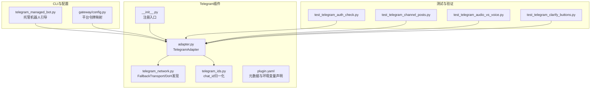
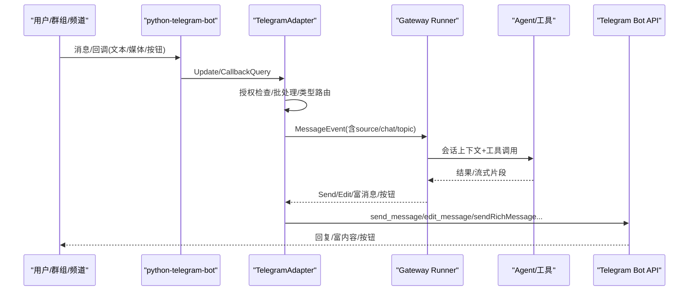
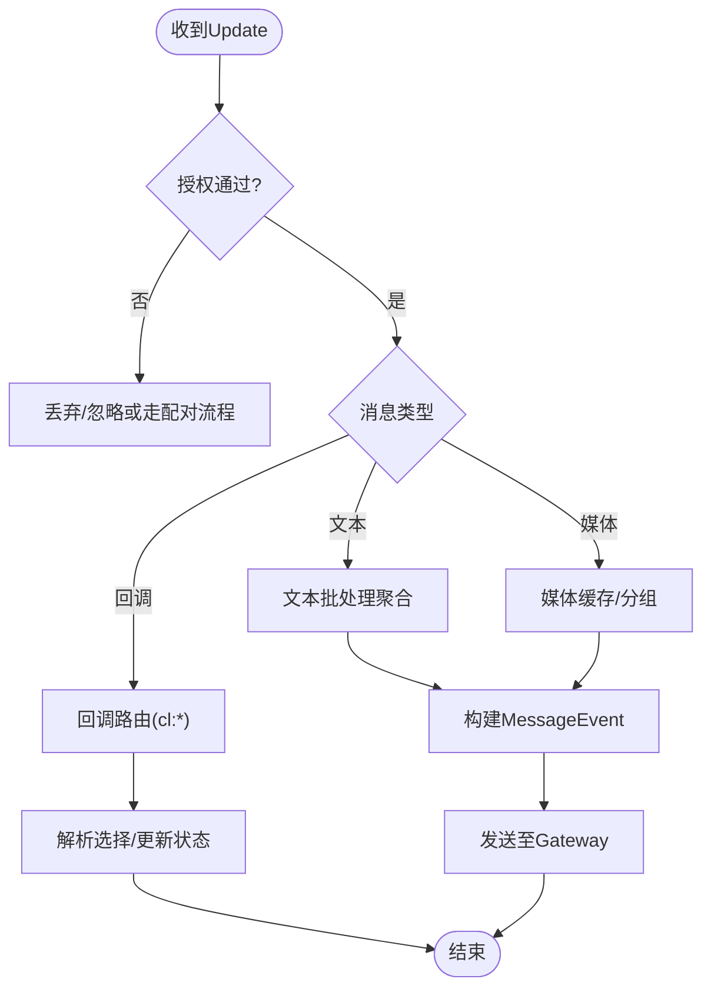
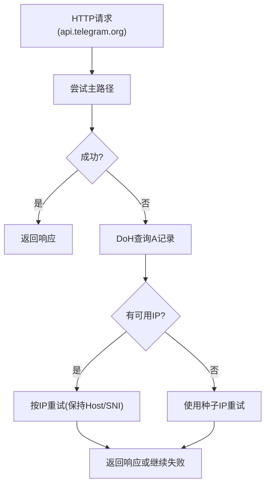
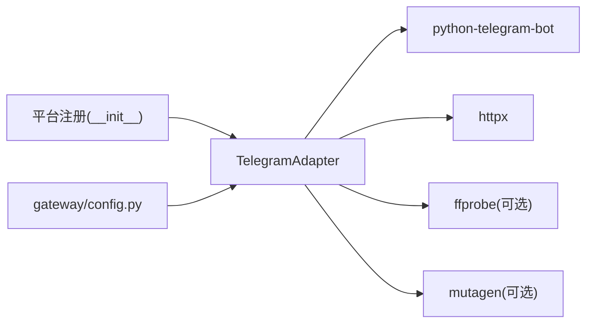

# Telegram集成

<cite>
**本文引用的文件**
- [plugins/platforms/telegram/__init__.py](file://plugins/platforms/telegram/__init__.py)
- [plugins/platforms/telegram/adapter.py](file://plugins/platforms/telegram/adapter.py)
- [plugins/platforms/telegram/plugin.yaml](file://plugins/platforms/telegram/plugin.yaml)
- [plugins/platforms/telegram/telegram_ids.py](file://plugins/platforms/telegram/telegram_ids.py)
- [plugins/platforms/telegram/telegram_network.py](file://plugins/platforms/telegram/telegram_network.py)
- [sparkii_cli/telegram_managed_bot.py](file://sparkii_cli/telegram_managed_bot.py)
- [gateway/config.py](file://gateway/config.py)
- [tests/gateway/test_telegram_auth_check.py](file://tests/gateway/test_telegram_auth_check.py)
- [tests/gateway/test_telegram_channel_posts.py](file://tests/gateway/test_telegram_channel_posts.py)
- [tests/gateway/test_telegram_audio_vs_voice.py](file://tests/gateway/test_telegram_audio_vs_voice.py)
- [tests/gateway/test_telegram_clarify_buttons.py](file://tests/gateway/test_telegram_clarify_buttons.py)
</cite>

## 目录
1. [简介](#简介)
2. [项目结构](#项目结构)
3. [核心组件](#核心组件)
4. [架构总览](#架构总览)
5. [详细组件分析](#详细组件分析)
6. [依赖关系分析](#依赖关系分析)
7. [性能与可靠性](#性能与可靠性)
8. [故障排除指南](#故障排除指南)
9. [结论](#结论)
10. [附录：配置与示例](#附录配置与示例)

## 简介
本文件面向Sparkii Agent的Telegram平台集成，系统性说明如何基于python-telegram-bot完成机器人创建、权限与安全配置、Webhook与轮询模式接入；深入解析消息处理流程（文本、富媒体、交互式按钮、Inline键盘）、频道与群组话题模式适配、语音与音频区分；并给出代理与连接池等网络层配置建议、反垃圾策略与常见问题排查。

## 项目结构
Telegram集成以插件形式提供，核心由适配器、网络辅助、ID归一化与CLI托管机器人工具组成，并通过Gateway平台注册机制接入主运行期。

图表来源
- [plugins/platforms/telegram/__init__.py:1-4](file://plugins/platforms/telegram/__init__.py#L1-L4)
- [plugins/platforms/telegram/adapter.py:236-308](file://plugins/platforms/telegram/adapter.py#L236-L308)
- [plugins/platforms/telegram/telegram_network.py:52-166](file://plugins/platforms/telegram/telegram_network.py#L52-L166)
- [plugins/platforms/telegram/telegram_ids.py:23-52](file://plugins/platforms/telegram/telegram_ids.py#L23-L52)
- [plugins/platforms/telegram/plugin.yaml:1-36](file://plugins/platforms/telegram/plugin.yaml#L1-L36)
- [sparkii_cli/telegram_managed_bot.py:166-359](file://sparkii_cli/telegram_managed_bot.py#L166-L359)
- [gateway/config.py:584-584](file://gateway/config.py#L584-L584)

章节来源
- [plugins/platforms/telegram/__init__.py:1-4](file://plugins/platforms/telegram/__init__.py#L1-L4)
- [plugins/platforms/telegram/plugin.yaml:1-36](file://plugins/platforms/telegram/plugin.yaml#L1-L36)
- [gateway/config.py:584-584](file://gateway/config.py#L584-L584)

## 核心组件
- TelegramAdapter：实现消息收发、MarkdownV2/富消息渲染、流式编辑、媒体分组、回调查询处理、论坛话题、打字状态、批处理聚合、错误降级与重试等。
- TelegramFallbackTransport：在api.telegram.org不可达时，通过DNS-over-HTTPS或种子IP进行TCP直连回退，保持TLS/SNI与逻辑Host不变。
- telegram_ids：统一chat_id格式，兼容数值ID与@username。
- CLI托管机器人：通过托管Bot流程生成配对链接/二维码，轮询获取Token，简化首次配置。
- 配置与注册：plugin.yaml声明环境变量；gateway/config将平台与令牌键绑定。

章节来源
- [plugins/platforms/telegram/adapter.py:633-800](file://plugins/platforms/telegram/adapter.py#L633-L800)
- [plugins/platforms/telegram/telegram_network.py:52-166](file://plugins/platforms/telegram/telegram_network.py#L52-L166)
- [plugins/platforms/telegram/telegram_ids.py:23-52](file://plugins/platforms/telegram/telegram_ids.py#L23-L52)
- [sparkii_cli/telegram_managed_bot.py:166-359](file://sparkii_cli/telegram_managed_bot.py#L166-L359)
- [plugins/platforms/telegram/plugin.yaml:13-36](file://plugins/platforms/telegram/plugin.yaml#L13-L36)
- [gateway/config.py:584-584](file://gateway/config.py#L584-L584)

## 架构总览
下图展示从Telegram到Sparkii Gateway再到Agent的核心调用链，包括消息入站、认证、事件构建、出站响应与回调交互。

图表来源
- [plugins/platforms/telegram/adapter.py:236-308](file://plugins/platforms/telegram/adapter.py#L236-L308)
- [plugins/platforms/telegram/adapter.py:633-800](file://plugins/platforms/telegram/adapter.py#L633-L800)
- [tests/gateway/test_telegram_auth_check.py:74-98](file://tests/gateway/test_telegram_auth_check.py#L74-L98)
- [tests/gateway/test_telegram_channel_posts.py:135-148](file://tests/gateway/test_telegram_channel_posts.py#L135-L148)

## 详细组件分析

### TelegramAdapter（消息与交互中枢）
- 能力要点
  - 支持MarkdownV2与富消息（可配置开关），长文本分块与流式编辑。
  - 文本与媒体批处理聚合，避免客户端拆分导致的多轮中断。
  - 论坛话题（message_thread_id）与频道广播（channel_post）识别。
  - Inline键盘与回调查询（澄清选择、确认等）。
  - 打字状态节流与冷却，减少无效API调用。
  - 错误分类与降级（网络超时、限流、格式错误等）。
- 关键流程
  - 入站：接收Update→授权检查→消息类型路由→构建MessageEvent→进入Gateway。
  - 出站：send/edit/sendRichMessage→失败重试→最终兜底为普通消息。
  - 回调：cl:*前缀用于澄清选择，校验授权后回填结果。

图表来源
- [plugins/platforms/telegram/adapter.py:633-800](file://plugins/platforms/telegram/adapter.py#L633-L800)
- [tests/gateway/test_telegram_auth_check.py:74-98](file://tests/gateway/test_telegram_auth_check.py#L74-L98)
- [tests/gateway/test_telegram_clarify_buttons.py:148-188](file://tests/gateway/test_telegram_clarify_buttons.py#L148-L188)

章节来源
- [plugins/platforms/telegram/adapter.py:633-800](file://plugins/platforms/telegram/adapter.py#L633-L800)
- [tests/gateway/test_telegram_clarify_buttons.py:74-188](file://tests/gateway/test_telegram_clarify_buttons.py#L74-L188)

### 网络层：TelegramFallbackTransport（容错与回退）
- 目标：当api.telegram.org不可达时，自动尝试备用IPv4地址，同时保持逻辑Host与SNI。
- 机制：
  - 优先使用系统DNS解析；若失败或连接失败，则通过DoH（Google/Cloudflare）查询A记录。
  - 无可用答案时使用种子IP列表。
  - 连接失败时清理失败传输对象，避免文件描述符泄漏。
  - 支持代理设置（TELEGRAM_PROXY）。

图表来源
- [plugins/platforms/telegram/telegram_network.py:52-166](file://plugins/platforms/telegram/telegram_network.py#L52-L166)
- [plugins/platforms/telegram/telegram_network.py:231-285](file://plugins/platforms/telegram/telegram_network.py#L231-L285)

章节来源
- [plugins/platforms/telegram/telegram_network.py:52-166](file://plugins/platforms/telegram/telegram_network.py#L52-L166)
- [plugins/platforms/telegram/telegram_network.py:231-285](file://plugins/platforms/telegram/telegram_network.py#L231-L285)

### ID归一化：chat_id与@username
- 支持数值ID（含负数频道ID）与@username字符串，避免int转换异常。
- 提供稳定键用于持久化与字典索引。

章节来源
- [plugins/platforms/telegram/telegram_ids.py:23-52](file://plugins/platforms/telegram/telegram_ids.py#L23-L52)

### 托管机器人创建（Managed Bot）
- 通过云端配对服务生成deep link/二维码，用户在Telegram中创建子Bot。
- 轮询获取Token并保存至本地，完成一次性配置。

章节来源
- [sparkii_cli/telegram_managed_bot.py:166-359](file://sparkii_cli/telegram_managed_bot.py#L166-L359)

## 依赖关系分析
- 运行时依赖：python-telegram-bot（按需懒加载安装）。
- 网络依赖：httpx（异步HTTP），可选ffprobe/mutagen用于音频时长探测。
- 平台注册：通过插件__init__.py暴露register，被Gateway平台注册器发现。
- 配置依赖：TELEGRAM_BOT_TOKEN为必需；可选允许名单、主页频道等。

图表来源
- [plugins/platforms/telegram/adapter.py:236-308](file://plugins/platforms/telegram/adapter.py#L236-L308)
- [plugins/platforms/telegram/adapter.py:395-458](file://plugins/platforms/telegram/adapter.py#L395-L458)
- [plugins/platforms/telegram/__init__.py:1-4](file://plugins/platforms/telegram/__init__.py#L1-L4)
- [gateway/config.py:584-584](file://gateway/config.py#L584-L584)

章节来源
- [plugins/platforms/telegram/adapter.py:395-458](file://plugins/platforms/telegram/adapter.py#L395-L458)
- [plugins/platforms/telegram/__init__.py:1-4](file://plugins/platforms/telegram/__init__.py#L1-L4)
- [gateway/config.py:584-584](file://gateway/config.py#L584-L584)

## 性能与可靠性
- 文本批处理：自适应延迟，短消息更快到达，降低首字延迟。
- 媒体分组：照片/视频批量聚合，减少多次发送开销。
- 打字状态节流：按聊天维度冷却，避免频繁API触发限流。
- 连接池限制：每个传输对象限制最大连接与保活连接，防止FD耗尽。
- 超时与回退：初始化、轮询启动、停止均有严格超时；网络失败自动回退到备用IP。
- 流式编辑：支持富消息草稿与最终编辑，失败时回退普通消息。

[本节为通用指导，不直接分析具体文件]

## 故障排除指南
- 无法连接api.telegram.org
  - 现象：getUpdates或send请求超时/连接失败。
  - 处理：启用回退传输，检查代理设置；必要时手动指定备用IP。
  - 参考：回退传输与DoH发现逻辑。
- 消息未处理或被丢弃
  - 现象：用户消息未进入Gateway。
  - 处理：检查授权白名单与群组允许列表；确认渠道/话题/线程ID正确。
  - 参考：早期授权拦截与频道post处理。
- 语音与音频混淆
  - 现象：音频附件被误转写或语音未转写。
  - 处理：确保voice走STT，audio附件仅作为文件路径提示。
  - 参考：语音与音频区分测试。
- Inline键盘无响应
  - 现象：点击按钮无效果。
  - 处理：确认回调数据格式与授权检查；检查澄清状态是否已注册。
  - 参考：澄清按钮回调处理。

章节来源
- [plugins/platforms/telegram/telegram_network.py:52-166](file://plugins/platforms/telegram/telegram_network.py#L52-L166)
- [tests/gateway/test_telegram_auth_check.py:74-98](file://tests/gateway/test_telegram_auth_check.py#L74-L98)
- [tests/gateway/test_telegram_channel_posts.py:135-148](file://tests/gateway/test_telegram_channel_posts.py#L135-L148)
- [tests/gateway/test_telegram_audio_vs_voice.py:60-116](file://tests/gateway/test_telegram_audio_vs_voice.py#L60-L116)
- [tests/gateway/test_telegram_clarify_buttons.py:148-188](file://tests/gateway/test_telegram_clarify_buttons.py#L148-L188)

## 结论
Sparkii Agent的Telegram集成通过高内聚的适配器与健壮的网络回退机制，提供了完整的消息收发、富媒体与交互能力，并在安全、性能与可靠性方面做了充分考量。借助托管机器人创建与灵活配置，用户可以快速搭建可用的Telegram机器人。

[本节为总结性内容，不直接分析具体文件]

## 附录：配置与示例

### 环境配置
- 必需
  - TELEGRAM_BOT_TOKEN：从@BotFather获取的机器人令牌。
- 可选
  - TELEGRAM_ALLOWED_USERS：逗号分隔的用户ID白名单。
  - TELEGRAM_ALLOW_ALL_USERS：开发用途，允许任意用户。
  - TELEGRAM_HOME_CHANNEL / TELEGRAM_HOME_CHANNEL_NAME：默认通知/定时任务投递频道。
  - TELEGRAM_PROXY：代理URL（如socks5h://...）。
  - 其他：rich_messages、rich_drafts、typing_cooldown_seconds、文本/媒体批处理延迟等。

章节来源
- [plugins/platforms/telegram/plugin.yaml:13-36](file://plugins/platforms/telegram/plugin.yaml#L13-L36)
- [gateway/config.py:584-584](file://gateway/config.py#L584-L584)

### Webhook与轮询模式
- 轮询模式（默认）：通过getUpdates拉取消息，具备完善的超时、回退与健康检查。
- Webhook模式：如需外部Webhook接入，请结合Gateway的Webhook能力与反向代理（Nginx/Caddy）暴露HTTPS端点，并将Telegram Bot的Webhook指向该端点。适配器内部对轮询路径做了大量健壮性保障，生产环境推荐先以轮询模式验证功能后再迁移至Webhook。

[本节为概念性说明，不直接分析具体文件]

### 消息处理要点
- 文本消息：MarkdownV2与富消息（可配置），超长自动分块，流式编辑。
- 富媒体：图片、视频、文档、贴纸等；音频附件不走STT，语音消息走STT。
- 交互式按钮：InlineKeyboardMarkup与回调查询，支持澄清选择（cl:*前缀）。
- 频道与群组：频道广播通过channel_post路由；群组支持话题(message_thread_id)。
- 位置/媒体分组：位置消息受授权控制；多张照片/视频分组发送。

章节来源
- [tests/gateway/test_telegram_audio_vs_voice.py:60-116](file://tests/gateway/test_telegram_audio_vs_voice.py#L60-L116)
- [tests/gateway/test_telegram_channel_posts.py:135-148](file://tests/gateway/test_telegram_channel_posts.py#L135-L148)
- [tests/gateway/test_telegram_clarify_buttons.py:74-188](file://tests/gateway/test_telegram_clarify_buttons.py#L74-L188)

### 认证与安全
- 授权白名单：支持DM与群组分别配置允许用户；未授权消息早期丢弃或进入配对流程。
- 回调授权：Inline键盘回调同样执行授权检查，未授权拒绝并提示。
- 敏感信息脱敏：Telegram错误日志中的敏感字段会被脱敏。

章节来源
- [tests/gateway/test_telegram_auth_check.py:74-98](file://tests/gateway/test_telegram_auth_check.py#L74-L98)
- [tests/gateway/test_telegram_clarify_buttons.py:191-234](file://tests/gateway/test_telegram_clarify_buttons.py#L191-L234)
- [plugins/platforms/telegram/adapter.py:28-39](file://plugins/platforms/telegram/adapter.py#L28-L39)

### 代理与连接池
- 代理：通过TELEGRAM_PROXY配置；回退传输会继承代理设置。
- 连接池：每个传输对象限制最大连接数与保活连接，避免文件描述符耗尽。
- 回退IP：自动通过DoH发现或种子IP回退，保持Host与SNI不变。

章节来源
- [plugins/platforms/telegram/telegram_network.py:52-166](file://plugins/platforms/telegram/telegram_network.py#L52-L166)
- [plugins/platforms/telegram/telegram_network.py:231-285](file://plugins/platforms/telegram/telegram_network.py#L231-L285)

### 代码示例路径
- 托管机器人创建与轮询获取Token：
  - [sparkii_cli/telegram_managed_bot.py:166-359](file://sparkii_cli/telegram_managed_bot.py#L166-L359)
- 平台令牌与环境变量声明：
  - [plugins/platforms/telegram/plugin.yaml:13-36](file://plugins/platforms/telegram/plugin.yaml#L13-L36)
  - [gateway/config.py:584-584](file://gateway/config.py#L584-L584)
- 消息与回调处理（文本/媒体/按钮）：
  - [plugins/platforms/telegram/adapter.py:236-308](file://plugins/platforms/telegram/adapter.py#L236-L308)
  - [tests/gateway/test_telegram_clarify_buttons.py:74-188](file://tests/gateway/test_telegram_clarify_buttons.py#L74-L188)
- 频道与群组话题：
  - [tests/gateway/test_telegram_channel_posts.py:135-148](file://tests/gateway/test_telegram_channel_posts.py#L135-L148)
- 语音与音频区分：
  - [tests/gateway/test_telegram_audio_vs_voice.py:60-116](file://tests/gateway/test_telegram_audio_vs_voice.py#L60-L116)