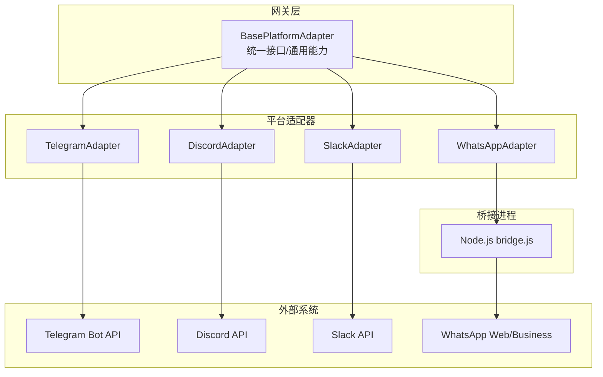
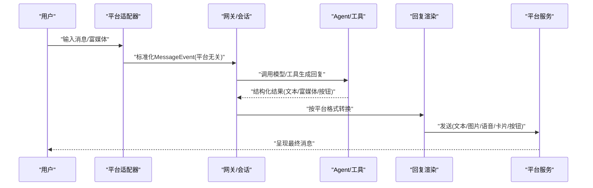
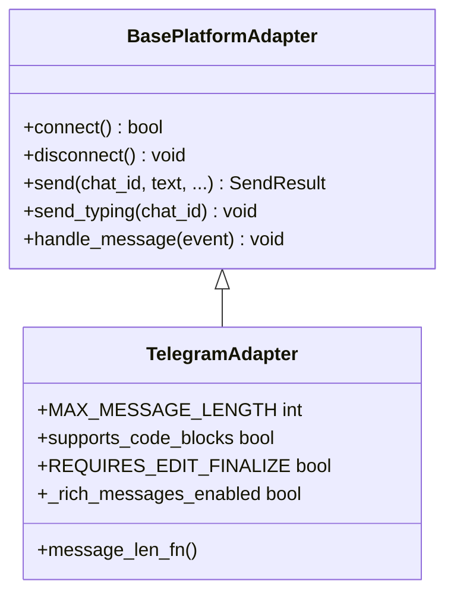
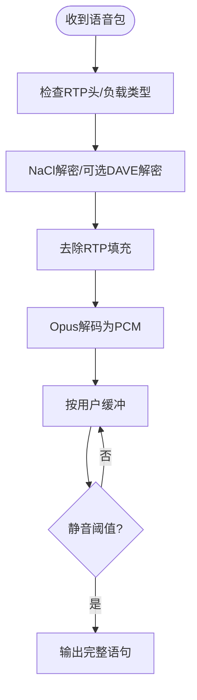
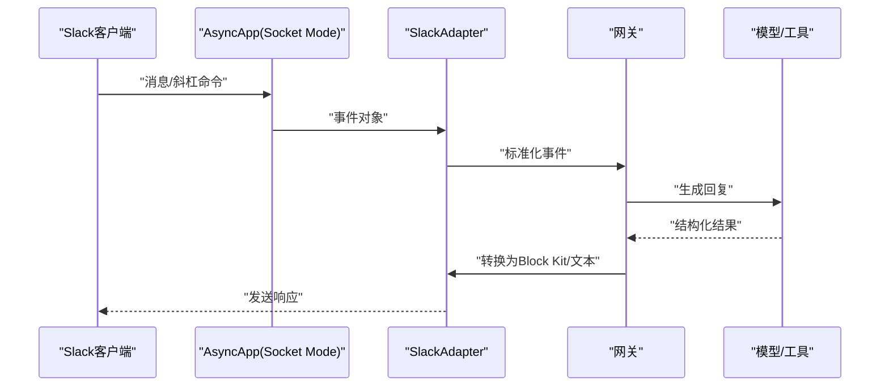
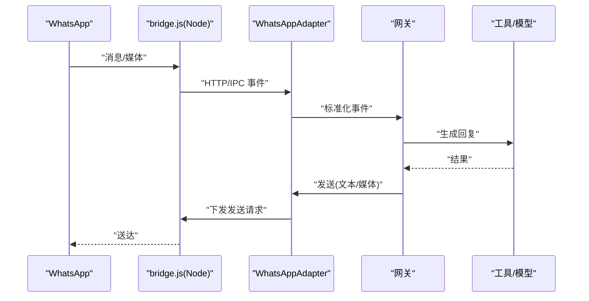
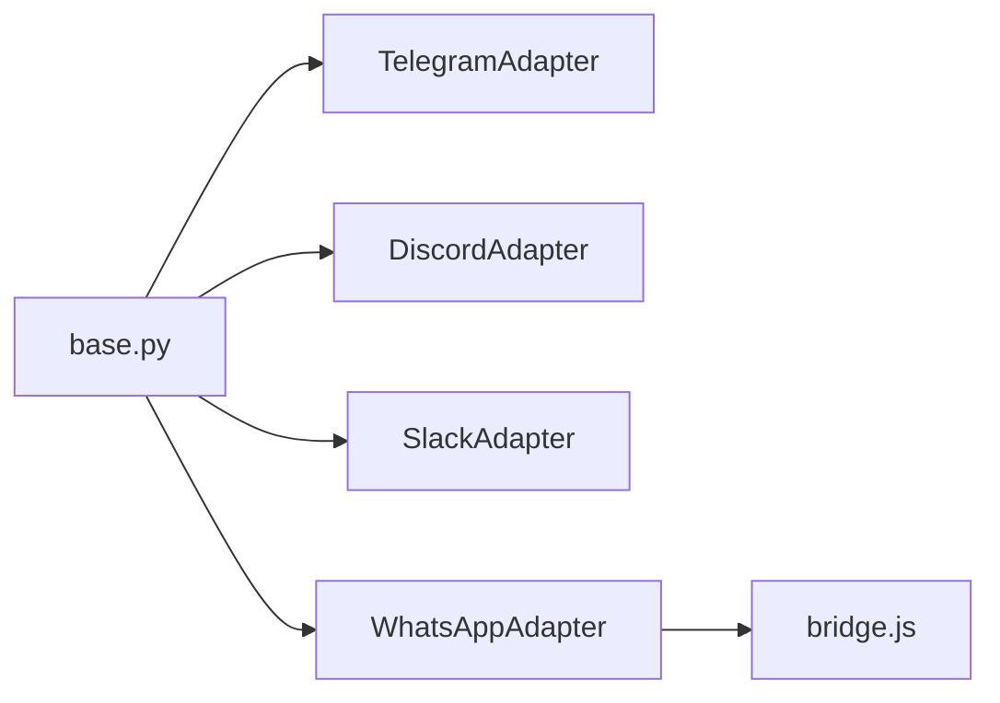

# 多平台支持

<cite>
**本文引用的文件**
- [base.py](file://gateway/platforms/base.py)
- [ADDING_A_PLATFORM.md](file://gateway/platforms/ADDING_A_PLATFORM.md)
- [adapter.py（Telegram）](file://plugins/platforms/telegram/adapter.py)
- [adapter.py（Discord）](file://plugins/platforms/discord/adapter.py)
- [adapter.py（Slack）](file://plugins/platforms/slack/adapter.py)
- [adapter.py（WhatsApp）](file://plugins/platforms/whatsapp/adapter.py)
- [bridge.js](file://scripts/whatsapp-bridge/bridge.js)
</cite>

## 目录
1. [简介](#简介)
2. [项目结构](#项目结构)
3. [核心组件](#核心组件)
4. [架构总览](#架构总览)
5. [详细组件分析](#详细组件分析)
6. [依赖关系分析](#依赖关系分析)
7. [性能考量](#性能考量)
8. [故障排查指南](#故障排查指南)
9. [结论](#结论)
10. [附录：新平台集成指南](#附录新平台集成指南)

## 简介
本文件系统性说明 Sparkii Agent 的多平台支持能力与实现，重点覆盖统一适配器架构、消息格式转换、认证机制、富媒体与交互能力适配、跨平台消息路由与会话管理、配置与速率限制管理，以及新增平台的开发流程与最佳实践。目标是为平台接入与维护提供可操作的参考，同时帮助非技术读者理解整体设计。

## 项目结构
Sparkii 的多平台能力由“基础适配器 + 各平台适配器”构成：
- 基础适配器定义统一接口、通用能力（媒体缓存、代理、长度限制、安全校验等）。
- 各平台适配器在基础之上实现具体协议细节（Telegram Bot API、Discord、Slack、WhatsApp）。
- WhatsApp 还包含 Node.js 桥接进程，负责与 WhatsApp Web/Business 的通信。

图表来源
- [base.py:1-800](file://gateway/platforms/base.py#L1-L800)
- [adapter.py（Telegram）:633-800](file://plugins/platforms/telegram/adapter.py#L633-L800)
- [adapter.py（Discord）:1-200](file://plugins/platforms/discord/adapter.py#L1-L200)
- [adapter.py（Slack）:1-120](file://plugins/platforms/slack/adapter.py#L1-L120)
- [adapter.py（WhatsApp）:381-420](file://plugins/platforms/whatsapp/adapter.py#L381-L420)
- [bridge.js](file://scripts/whatsapp-bridge/bridge.js)

章节来源
- [base.py:1-800](file://gateway/platforms/base.py#L1-L800)
- [ADDING_A_PLATFORM.md:1-120](file://gateway/platforms/ADDING_A_PLATFORM.md#L1-L120)

## 核心组件
- 统一接口与抽象基类：定义连接、断开、发送文本/图片/语音/视频/文档、打字指示、会话源构建、消息事件处理等标准方法。
- 通用能力：
  - 媒体缓存与清理（图片/音频/视频/文档/截图），含入站大小限制与SSRF防护。
  - 代理解析与绕过策略（NO_PROXY/no_proxy、macOS系统代理）。
  - 消息长度与分块（UTF-16 计数、平台特定限制）。
  - 安全路径校验与敏感信息脱敏。
- 平台适配器：继承基类并实现平台差异（MarkdownV2、Block Kit、RTP 语音、桥接进程管理等）。

章节来源
- [base.py:1-800](file://gateway/platforms/base.py#L1-L800)
- [base.py:800-1500](file://gateway/platforms/base.py#L800-L1500)

## 架构总览
下图展示从平台到网关再到模型/工具的统一数据流，强调消息格式转换与会话上下文传递。

图表来源
- [base.py:1-800](file://gateway/platforms/base.py#L1-L800)
- [adapter.py（Telegram）:633-800](file://plugins/platforms/telegram/adapter.py#L633-L800)
- [adapter.py（Discord）:1-200](file://plugins/platforms/discord/adapter.py#L1-L200)
- [adapter.py（Slack）:1-120](file://plugins/platforms/slack/adapter.py#L1-L120)
- [adapter.py（WhatsApp）:381-420](file://plugins/platforms/whatsapp/adapter.py#L381-L420)

## 详细组件分析

### Telegram Bot API 集成
- 统一接口实现：基于 python-telegram-bot，处理消息收发、媒体、命令、论坛主题（thread_id）、富文本（MarkdownV2/Rich Messages）。
- 消息格式转换：
  - MarkdownV2 转义与清理，表格转列表，代码块保护区域保留。
  - UTF-16 长度计算与截断，避免超过平台限制。
- 富媒体与交互：
  - 图片/音频/视频/文档缓存与发送；语音时长探测；媒体分组等待。
  - 澄清选择、执行审批、斜杠确认等交互式按钮（通过统一回调约定）。
- 会话与路由：
  - 线程/话题元数据注入，DM 主题回退策略，回复锚点选择。
- 可靠性：
  - 启动/重连超时、心跳、阻塞检测与恢复；错误日志脱敏。

图表来源
- [base.py:1-800](file://gateway/platforms/base.py#L1-L800)
- [adapter.py（Telegram）:633-800](file://plugins/platforms/telegram/adapter.py#L633-L800)

章节来源
- [adapter.py（Telegram）:1-800](file://plugins/platforms/telegram/adapter.py#L1-L800)

### Discord 服务器支持
- 统一接口实现：基于 discord.py，处理服务器/私聊、线程、频道控制、命令同步。
- 消息格式转换：
  - Markdown 链接标签规范化，URL 安全与重定向防护。
  - 组件字段 UTF-16 截断，按钮/选择菜单长度限制。
- 富媒体与交互：
  - 图片下载与缓存，附件处理；语音通道接收与解码（RTP/Opus/DAVE E2EE）。
  - 命令同步状态持久化，非对话消息去噪。
- 会话与路由：
  - 允许提及策略（@everyone/@role/@user），频道白名单/忽略列表。
  - 线程参与跟踪与历史回溯。

图表来源
- [adapter.py（Discord）:525-800](file://plugins/platforms/discord/adapter.py#L525-L800)

章节来源
- [adapter.py（Discord）:1-800](file://plugins/platforms/discord/adapter.py#L1-L800)

### Slack 应用开发
- 统一接口实现：基于 slack-bolt Socket Mode，处理频道/DM、斜杠命令、线程。
- 消息格式转换：
  - Block Kit 提取可读文本，引用/转发内容保留；链接去重与归一化。
  - GFM 表格识别与对齐，包裹为代码块以正确渲染。
- 富媒体与交互：
  - 文件标记渲染，线程根图片限数拉取；Block Kit 按钮/选择菜单。
- 会话与路由：
  - 工作区范围标识（scope_id）透传，Socket Mode 重投递去重窗口。
  - 代理与 NO_PROXY 处理，错误体大小限制。

图表来源
- [adapter.py（Slack）:1-120](file://plugins/platforms/slack/adapter.py#L1-L120)

章节来源
- [adapter.py（Slack）:1-800](file://plugins/platforms/slack/adapter.py#L1-L800)

### WhatsApp Business API 接入
- 统一接口实现：通过 Node.js 桥接进程（bridge.js）与 WhatsApp Web/Business 通信；Python 侧负责生命周期管理、鉴权、策略与消息队列。
- 消息格式转换：
  - 文本批量合并（防抖动），避免快速连续消息触发多次推理。
  - 本地媒体路径校验（仅允许受信任缓存目录），防止任意路径泄露。
- 富媒体与交互：
  - 图片/音频/视频/文档缓存与发送；读取回执开关。
- 会话与路由：
  - DM/群组策略（开放/白名单/配对/禁用），允许列表来源优先级（配置 > 环境变量）。
  - 桥接进程健康检查、版本一致性校验、残留进程清理。

图表来源
- [adapter.py（WhatsApp）:381-800](file://plugins/platforms/whatsapp/adapter.py#L381-L800)
- [bridge.js](file://scripts/whatsapp-bridge/bridge.js)

章节来源
- [adapter.py（WhatsApp）:1-800](file://plugins/platforms/whatsapp/adapter.py#L1-L800)

## 依赖关系分析
- 基础适配器依赖：
  - 媒体缓存与安全：图片/音频/视频/文档/截图缓存、入站大小限制、SSRF 防护、代理解析、路径白名单/黑名单。
  - 平台无关能力：消息长度函数（UTF-16）、自动TTS输出路径、通知元数据标记。
- 平台适配器依赖：
  - Telegram：python-telegram-bot、MarkdownV2 处理、Rich Messages、论坛主题。
  - Discord：discord.py、RTP/Opus/DAVE 语音、命令同步、线程与频道控制。
  - Slack：slack-bolt Socket Mode、Block Kit、代理与重投递去重。
  - WhatsApp：Node.js 桥接进程、会话持久化、npm 依赖安装与版本校验。

图表来源
- [base.py:1-800](file://gateway/platforms/base.py#L1-L800)
- [adapter.py（Telegram）:633-800](file://plugins/platforms/telegram/adapter.py#L633-L800)
- [adapter.py（Discord）:1-200](file://plugins/platforms/discord/adapter.py#L1-L200)
- [adapter.py（Slack）:1-120](file://plugins/platforms/slack/adapter.py#L1-L120)
- [adapter.py（WhatsApp）:381-420](file://plugins/platforms/whatsapp/adapter.py#L381-L420)
- [bridge.js](file://scripts/whatsapp-bridge/bridge.js)

章节来源
- [base.py:1-800](file://gateway/platforms/base.py#L1-L800)
- [base.py:800-1500](file://gateway/platforms/base.py#L800-L1500)

## 性能考量
- 入站媒体大小限制：默认上限（可配置），防止内存溢出与恶意上传。
- 代理与网络：
  - 统一代理解析与 NO_PROXY 匹配，支持 SOCKS/HTTP 与 macOS 系统代理。
  - 平台特定代理处理（如 Slack 对 wss-primary.slack.com 的排除）。
- 消息批处理与节流：
  - Telegram/WhatsApp 文本批量延迟合并，减少重复推理与碎片回复。
  - 打字指示冷却与重试退避，降低 API 压力。
- 语音处理：
  - Discord 语音包解码与静音检测，避免噪声触发。
  - 自动TTS输出路径与容器修复，保证原生语音气泡兼容。
- 资源清理：
  - 缓存定期清理（图片/音频/视频/文档/截图）。
  - 桥接进程健康检查与残留清理，避免端口占用或僵尸进程。

[本节为通用指导，不直接分析具体文件]

## 故障排查指南
- 常见问题定位：
  - 平台依赖缺失：各适配器提供 check_*_requirements 探针，未满足时给出明确提示。
  - 桥接进程异常：WhatsApp 桥接健康检查失败、脚本版本不一致、端口占用、creds.json 缺失。
  - 代理/网络问题：代理不可用、SOCKS 不支持、NO_PROXY 误配导致直连失败。
  - 消息超限/格式错误：MarkdownV2/Block Kit 渲染异常、UTF-16 截断不当。
- 建议步骤：
  - 查看平台适配器日志与桥接日志（WhatsApp 桥接日志位于会话目录）。
  - 验证环境变量与配置文件（令牌、白名单、策略）。
  - 使用最小复现（单频道/单用户）隔离问题。
  - 逐步关闭功能（富媒体/语音/交互按钮）定位瓶颈。

章节来源
- [adapter.py（Telegram）:1-200](file://plugins/platforms/telegram/adapter.py#L1-L200)
- [adapter.py（Discord）:232-267](file://plugins/platforms/discord/adapter.py#L232-L267)
- [adapter.py（Slack）:665-746](file://plugins/platforms/slack/adapter.py#L665-L746)
- [adapter.py（WhatsApp）:509-800](file://plugins/platforms/whatsapp/adapter.py#L509-L800)

## 结论
Sparkii 的多平台支持通过统一的 BasePlatformAdapter 抽象出跨平台共性，各平台适配器专注协议差异与用户体验优化。结合严格的媒体安全、代理与速率控制、可靠的连接管理与恢复机制，实现了跨平台一致的消息路由与会话体验。对于新增平台，遵循插件化与内置双路径的开发指南，可高效扩展生态。

[本节为总结性内容，不直接分析具体文件]

## 附录：新平台集成指南
- 两种集成方式：
  - 插件路径（推荐）：在 plugins/platforms 下创建 adapter.py 与 plugin.yaml，零侵入核心代码。
  - 内置路径（核心贡献者）：需在多个位置注册枚举、工厂、授权映射、系统提示、工具集、定时任务、状态显示、设置向导等。
- 关键实现要点：
  - 实现必需方法（连接/断开/发送/打字/聊天信息等），可选方法按需覆盖。
  - 若平台支持交互按钮/卡片，实现 clarify/exec approval/slash confirm/model picker 等。
  - 使用统一消息事件与发送结果类型，复用媒体缓存与安全校验。
  - 处理自消息/同步消息过滤、敏感信息脱敏、重连与指数退避。
- 验证与测试：
  - 单元测试覆盖配置加载、初始化、辅助函数、会话源往返、授权集成、发送工具路由。
  - 可选异步测试覆盖消息处理、重连、附件处理、群消息过滤。

章节来源
- [ADDING_A_PLATFORM.md:1-405](file://gateway/platforms/ADDING_A_PLATFORM.md#L1-L405)