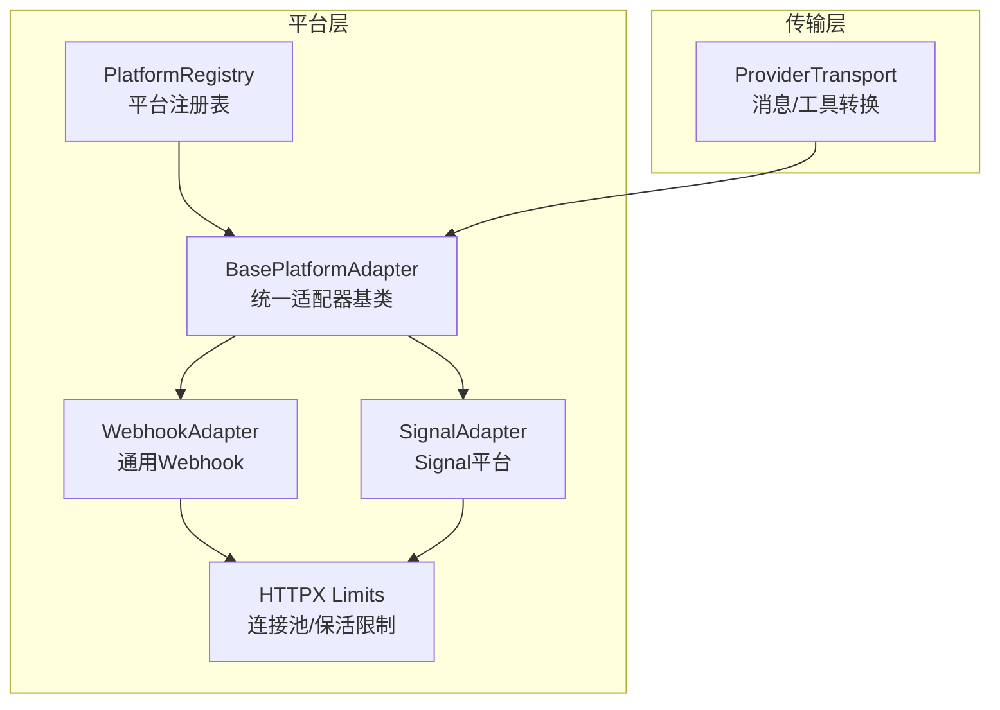
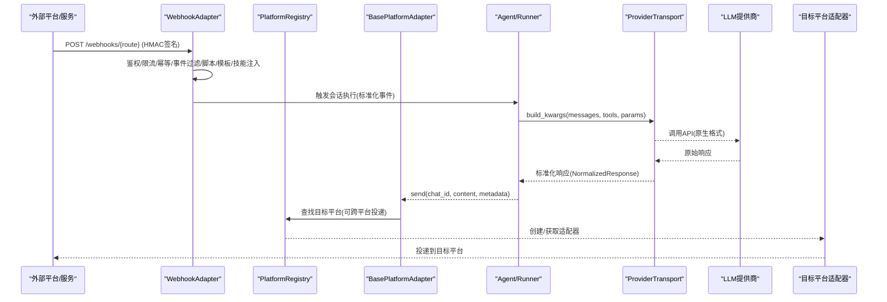
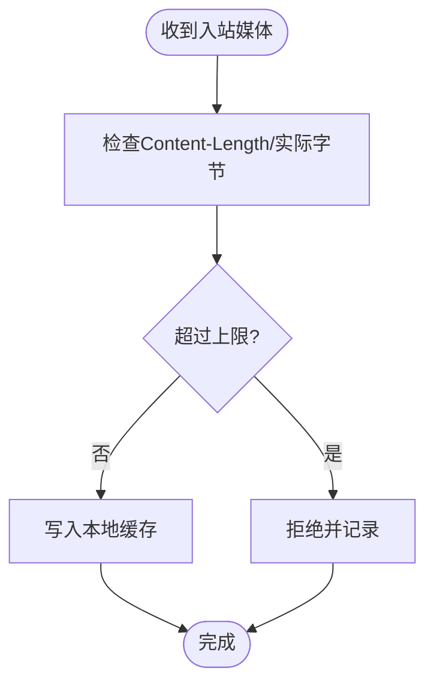
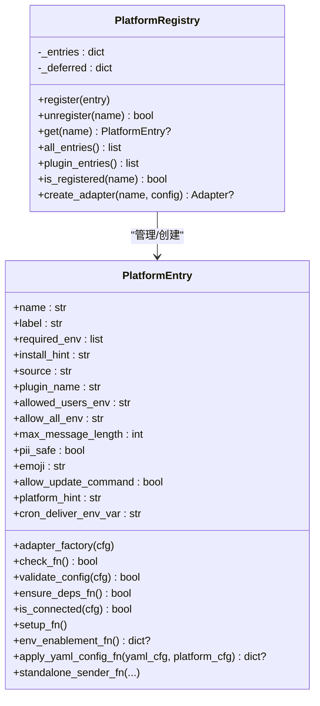
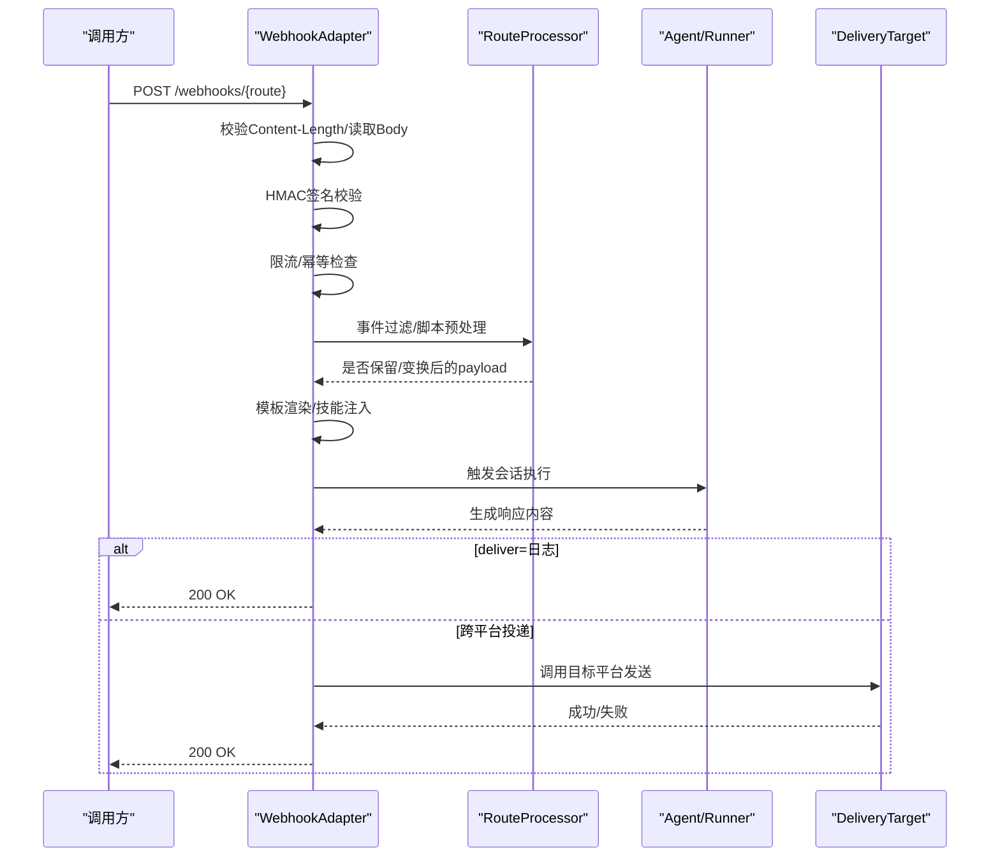
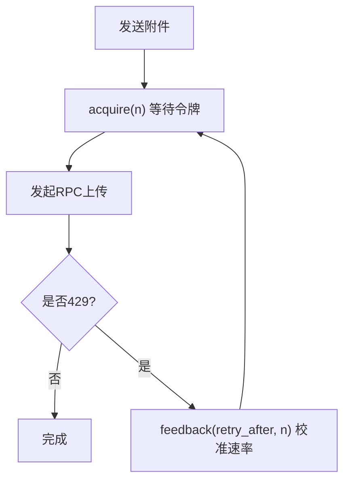
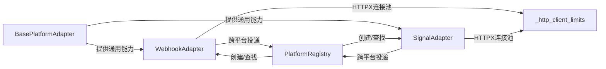

# 平台架构设计

<cite>
**本文引用的文件**
- [gateway/platforms/base.py](file://gateway/platforms/base.py)
- [gateway/platform_registry.py](file://gateway/platform_registry.py)
- [gateway/platforms/_http_client_limits.py](file://gateway/platforms/_http_client_limits.py)
- [gateway/platforms/webhook.py](file://gateway/platforms/webhook.py)
- [gateway/platforms/signal.py](file://gateway/platforms/signal.py)
- [gateway/platforms/signal_rate_limit.py](file://gateway/platforms/signal_rate_limit.py)
- [agent/transports/base.py](file://agent/transports/base.py)
</cite>

## 目录
1. [简介](#简介)
2. [项目结构](#项目结构)
3. [核心组件](#核心组件)
4. [架构总览](#架构总览)
5. [详细组件分析](#详细组件分析)
6. [依赖关系分析](#依赖关系分析)
7. [性能与稳定性](#性能与稳定性)
8. [故障排查指南](#故障排查指南)
9. [结论](#结论)
10. [附录：平台适配器开发规范](#附录：平台适配器开发规范)

## 简介
本文件面向 Hermes Agent 的“平台层”架构，系统性阐述统一平台适配器接口、平台抽象基类、消息格式标准化、事件处理机制、生命周期管理、认证与路由、会话与错误处理、HTTP 客户端限制与速率控制、以及平台间通信协议和数据转换层的设计。文档同时提供架构图与交互流程图，帮助开发者快速理解整体设计并安全扩展新平台。

## 项目结构
平台相关代码主要分布在 gateway/platforms（平台适配与通用能力）、plugins/platforms（插件化平台实现）与 agent/transports（模型传输/数据转换）。其中：
- gateway/platforms/base.py：定义统一的 BasePlatformAdapter 抽象基类与通用工具（代理、媒体大小限制、TTS、线程元数据等）。
- gateway/platform_registry.py：平台注册表，支持内置与插件平台的延迟加载、依赖探测、配置校验与工厂创建。
- gateway/platforms/_http_client_limits.py：为长期存在的 httpx 客户端提供连接池与 keepalive 限制，避免 FD 泄漏。
- gateway/platforms/webhook.py：通用 Webhook 接收器，负责 HMAC 鉴权、限流、幂等、动态路由与跨平台投递。
- gateway/platforms/signal.py：Signal 平台适配器示例，展示 SSE 接入、附件重封装、速率限制与重试。
- gateway/platforms/signal_rate_limit.py：进程级令牌桶调度器，模拟服务端限速并校准 refill rate。
- agent/transports/base.py：ProviderTransport 抽象，用于将 OpenAI 风格消息/工具转换为各 LLM 提供商原生格式。

**图表来源**
- [gateway/platforms/base.py:1-120](file://gateway/platforms/base.py#L1-L120)
- [gateway/platform_registry.py:38-180](file://gateway/platform_registry.py#L38-L180)
- [gateway/platforms/_http_client_limits.py:1-85](file://gateway/platforms/_http_client_limits.py#L1-L85)
- [gateway/platforms/webhook.py:177-243](file://gateway/platforms/webhook.py#L177-L243)
- [gateway/platforms/signal.py:1-73](file://gateway/platforms/signal.py#L1-L73)
- [agent/transports/base.py:16-65](file://agent/transports/base.py#L16-L65)

**章节来源**
- [gateway/platforms/base.py:1-120](file://gateway/platforms/base.py#L1-L120)
- [gateway/platform_registry.py:1-180](file://gateway/platform_registry.py#L1-L180)
- [gateway/platforms/_http_client_limits.py:1-85](file://gateway/platforms/_http_client_limits.py#L1-L85)
- [gateway/platforms/webhook.py:177-243](file://gateway/platforms/webhook.py#L177-L243)
- [gateway/platforms/signal.py:1-73](file://gateway/platforms/signal.py#L1-L73)
- [agent/transports/base.py:16-65](file://agent/transports/base.py#L16-L65)

## 核心组件
- 统一平台适配器接口（BasePlatformAdapter）
  - 职责：定义 connect/disconnect/send/get_chat_info 等生命周期方法；统一消息事件模型；提供线程/回复锚点、TTS、媒体缓存、代理解析等通用能力。
  - 关键点：线程元数据构建、UTF-16 长度截断、入站媒体大小上限、代理自动发现与 NO_PROXY 匹配、SSRF 重定向防护。
- 平台注册表（PlatformRegistry）
  - 职责：集中注册平台条目（名称、标签、工厂函数、依赖探测、配置校验、安装提示、环境注入、YAML→env 桥接、独立发送器等），并提供 create_adapter 安全创建实例。
  - 关键点：延迟加载（deferred loaders）避免启动时导入重型 SDK；check_fn/ensure_deps_fn 分离被动探测与主动安装；validate_config 前置校验。
- HTTP 客户端限制（_http_client_limits）
  - 职责：为长期存活 httpx.AsyncClient 提供紧凑的连接池与更短的 keepalive 过期时间，缓解 CLOSE_WAIT 导致的 FD 耗尽。
  - 关键点：可通过环境变量调整 keepalive 过期与最大连接数。
- Webhook 适配器（WebhookAdapter）
  - 职责：监听 HTTP 端口，按路由进行 HMAC 鉴权、事件过滤、脚本预处理、模板渲染、技能注入、限流与幂等，最终通过 deliver 策略投递到目标平台或日志。
  - 关键点：auth-before-body、INSECURE_NO_AUTH 仅允许本地回环、动态订阅热重载、多 profile 复用路径。
- Signal 适配器与速率限制
  - 职责：基于 signal-cli HTTP 模式，SSE 接收消息，JSON-RPC 发送；对语音/图片做容器识别与转码；使用进程级令牌桶调度器规避 429。
  - 关键点：从错误中解析 retry_after 校准 refill rate；批量上传超时随附件数量缩放。
- ProviderTransport（传输层）
  - 职责：将 OpenAI 风格消息/工具转换为各 LLM 提供商原生格式，并归一化响应；不持有客户端、重试、中断等状态。

**章节来源**
- [gateway/platforms/base.py:62-253](file://gateway/platforms/base.py#L62-L253)
- [gateway/platform_registry.py:38-180](file://gateway/platform_registry.py#L38-L180)
- [gateway/platforms/_http_client_limits.py:43-85](file://gateway/platforms/_http_client_limits.py#L43-L85)
- [gateway/platforms/webhook.py:177-243](file://gateway/platforms/webhook.py#L177-L243)
- [gateway/platforms/signal_rate_limit.py:170-329](file://gateway/platforms/signal_rate_limit.py#L170-L329)
- [agent/transports/base.py:16-65](file://agent/transports/base.py#L16-L65)

## 架构总览
下图展示了请求从外部平台进入网关，经平台适配器标准化后进入 Agent，再经由传输层调用 LLM，最后将结果投递回原平台或指定目标的完整流程。

**图表来源**
- [gateway/platforms/webhook.py:584-800](file://gateway/platforms/webhook.py#L584-L800)
- [gateway/platform_registry.py:299-377](file://gateway/platform_registry.py#L299-L377)
- [agent/transports/base.py:42-65](file://agent/transports/base.py#L42-L65)

## 详细组件分析

### 统一平台适配器基类（BasePlatformAdapter）
- 设计要点
  - 生命周期：connect/disconnect 由具体平台实现；send/get_chat_info 统一对外。
  - 消息标准化：统一 MessageEvent/MessageType/SendResult，屏蔽平台差异。
  - 线程与回复：根据平台特性计算 reply_to/thread_id/metadata，确保回复语义正确。
  - 媒体与TTS：入站媒体大小限制、音频格式选择、自动TTS输出路径生成。
  - 网络与安全：代理自动发现（含 macOS 系统代理）、NO_PROXY 匹配、SSRF 重定向防护。
- 复杂度与性能
  - UTF-16 长度计算与截断采用二分搜索，O(log n)。
  - 媒体下载/缓存带大小上限保护，防止 OOM。
  - 代理解析与 NO_PROXY 匹配为纯函数，开销低。

**图表来源**
- [gateway/platforms/base.py:741-800](file://gateway/platforms/base.py#L741-L800)

**章节来源**
- [gateway/platforms/base.py:62-253](file://gateway/platforms/base.py#L62-L253)
- [gateway/platforms/base.py:741-800](file://gateway/platforms/base.py#L741-L800)

### 平台注册表（PlatformRegistry）
- 设计要点
  - 延迟加载：通过 deferred loaders 在首次使用时才导入平台模块，避免冷启动耗时。
  - 依赖探测与安装：check_fn 轻量探测，ensure_deps_fn 仅在需要时安装依赖。
  - 配置校验：validate_config 在构造前验证，失败即短路。
  - 工厂创建：adapter_factory 接收 PlatformConfig，返回适配器实例。
- 扩展性
  - 支持插件覆盖内置平台；支持 env_enablement_fn、apply_yaml_config_fn 等钩子。
  - standalone_sender_fn 支持无进程内适配器时的独立发送。

**图表来源**
- [gateway/platform_registry.py:38-180](file://gateway/platform_registry.py#L38-L180)
- [gateway/platform_registry.py:183-382](file://gateway/platform_registry.py#L183-L382)

**章节来源**
- [gateway/platform_registry.py:183-382](file://gateway/platform_registry.py#L183-L382)

### Webhook 适配器（WebhookAdapter）
- 设计要点
  - 安全：HMAC 鉴权（V1/V2）、INSECURE_NO_AUTH 仅限本地回环、body size 限制、事件类型过滤、脚本隔离执行。
  - 可靠性：幂等去重（delivery_id TTL）、固定窗口限流、健康检查端点。
  - 灵活性：静态/动态路由合并、多 profile 复用、deliver_only 直通投递、跨平台投递。
- 关键流程

**图表来源**
- [gateway/platforms/webhook.py:248-351](file://gateway/platforms/webhook.py#L248-L351)
- [gateway/platforms/webhook.py:584-800](file://gateway/platforms/webhook.py#L584-L800)

**章节来源**
- [gateway/platforms/webhook.py:177-243](file://gateway/platforms/webhook.py#L177-L243)
- [gateway/platforms/webhook.py:584-800](file://gateway/platforms/webhook.py#L584-L800)

### Signal 适配器与速率限制
- 设计要点
  - 接入：signal-cli HTTP 模式，SSE 接收消息，JSON-RPC 发送。
  - 媒体：容器识别与 AAC→M4A 无损转封装，提升 STT 兼容性。
  - 速率限制：进程级令牌桶，依据 429 中的 retry_after 校准 refill rate，批量上传超时随附件数量缩放。
- 关键流程

**图表来源**
- [gateway/platforms/signal_rate_limit.py:170-329](file://gateway/platforms/signal_rate_limit.py#L170-L329)
- [gateway/platforms/signal_rate_limit.py:76-109](file://gateway/platforms/signal_rate_limit.py#L76-L109)

**章节来源**
- [gateway/platforms/signal.py:1-73](file://gateway/platforms/signal.py#L1-L73)
- [gateway/platforms/signal_rate_limit.py:170-329](file://gateway/platforms/signal_rate_limit.py#L170-L329)

### 传输层（ProviderTransport）
- 设计要点
  - 将 OpenAI 风格 messages/tools 转换为各提供商原生格式，并归一化响应。
  - 不持有客户端、重试、中断等状态，保持单一职责。
- 典型方法
  - convert_messages/convert_tools/build_kwargs/normalize_response。

**章节来源**
- [agent/transports/base.py:16-65](file://agent/transports/base.py#L16-L65)

## 依赖关系分析
- 耦合与内聚
  - BasePlatformAdapter 高内聚于平台通用逻辑，降低各平台重复实现成本。
  - PlatformRegistry 解耦平台发现与实例化，便于插件扩展与延迟加载。
  - Webhook/Signal 等具体适配器依赖 base 提供的通用能力，并通过 registry 进行跨平台投递。
- 外部依赖
  - httpx 用于长连接客户端，配合 _http_client_limits 控制连接池与保活。
  - signal-cli 作为后端服务，通过 HTTP+JSON-RPC 与 SignalAdapter 交互。
  - aiohttp 用于 Webhook 服务器。

**图表来源**
- [gateway/platforms/base.py:1-120](file://gateway/platforms/base.py#L1-L120)
- [gateway/platform_registry.py:299-377](file://gateway/platform_registry.py#L299-L377)
- [gateway/platforms/_http_client_limits.py:43-85](file://gateway/platforms/_http_client_limits.py#L43-L85)
- [gateway/platforms/webhook.py:177-243](file://gateway/platforms/webhook.py#L177-L243)
- [gateway/platforms/signal.py:1-73](file://gateway/platforms/signal.py#L1-L73)

**章节来源**
- [gateway/platform_registry.py:299-377](file://gateway/platform_registry.py#L299-L377)
- [gateway/platforms/_http_client_limits.py:43-85](file://gateway/platforms/_http_client_limits.py#L43-L85)

## 性能与稳定性
- HTTP 客户端限制
  - 缩短 keepalive 过期时间与限制最大保活连接数，减少 CLOSE_WAIT 堆积，避免 FD 耗尽。
  - 可通过环境变量 SPARKII_GATEWAY_HTTPX_KEEPALIVE_EXPIRY 与 SPARKII_GATEWAY_HTTPX_MAX_KEEPALIVE 调优。
- 速率控制
  - Webhook：固定窗口限流，防止突发流量压垮下游。
  - Signal：令牌桶模拟服务端限速，结合 429 反馈校准 refill rate，避免雪崩。
- 内存与资源
  - 入站媒体大小限制，防止恶意大文件导致 OOM。
  - 动态路由与幂等缓存定期清理，控制内存增长。
- 可用性
  - Webhook 健康检查端点；Signal 心跳与健康检查间隔；多 profile 复用与动态订阅热重载。

[本节为通用指导，无需特定文件引用]

## 故障排查指南
- Webhook 无法接收
  - 检查 HMAC 签名是否正确、secret 是否配置、是否绑定非回环地址且使用了 INSECURE_NO_AUTH。
  - 确认 body size 未超限、事件类型过滤是否放行。
  - 参考：[gateway/platforms/webhook.py:248-351](file://gateway/platforms/webhook.py#L248-L351)、[gateway/platforms/webhook.py:584-800](file://gateway/platforms/webhook.py#L584-L800)
- Signal 频繁 429
  - 查看令牌桶状态与校准情况，确认 retry_after 是否正确解析并应用。
  - 适当增大批量上传超时或降低并发。
  - 参考：[gateway/platforms/signal_rate_limit.py:76-109](file://gateway/platforms/signal_rate_limit.py#L76-L109)、[gateway/platforms/signal_rate_limit.py:170-329](file://gateway/platforms/signal_rate_limit.py#L170-L329)
- 连接池耗尽/FD 不足
  - 调整 SPARKII_GATEWAY_HTTPX_KEEPALIVE_EXPIRY 与 SPARKII_GATEWAY_HTTPX_MAX_KEEPALIVE。
  - 参考：[gateway/platforms/_http_client_limits.py:43-85](file://gateway/platforms/_http_client_limits.py#L43-L85)
- 入站媒体过大被拒
  - 检查 gateway.max_inbound_media_bytes 配置与 Content-Length/实际字节限制。
  - 参考：[gateway/platforms/base.py:741-800](file://gateway/platforms/base.py#L741-L800)

**章节来源**
- [gateway/platforms/webhook.py:248-351](file://gateway/platforms/webhook.py#L248-L351)
- [gateway/platforms/webhook.py:584-800](file://gateway/platforms/webhook.py#L584-L800)
- [gateway/platforms/signal_rate_limit.py:76-109](file://gateway/platforms/signal_rate_limit.py#L76-L109)
- [gateway/platforms/signal_rate_limit.py:170-329](file://gateway/platforms/signal_rate_limit.py#L170-L329)
- [gateway/platforms/_http_client_limits.py:43-85](file://gateway/platforms/_http_client_limits.py#L43-L85)
- [gateway/platforms/base.py:741-800](file://gateway/platforms/base.py#L741-L800)

## 结论
Hermes Agent 的平台层通过统一的 BasePlatformAdapter 抽象、灵活的 PlatformRegistry 注册机制、健壮的 Webhook 适配器与稳健的速率/连接池控制，实现了跨平台消息的统一接入与稳定运行。传输层的 ProviderTransport 进一步解耦了消息格式转换与 LLM 调用细节。该设计在保证可扩展性的同时，兼顾了安全性、性能与可维护性。

[本节为总结性内容，无需特定文件引用]

## 附录：平台适配器开发规范
- 接口实现要求
  - 继承 BasePlatformAdapter，实现 connect/disconnect/send/get_chat_info。
  - 遵循统一消息事件模型与 SendResult 返回约定。
  - 使用 base 提供的代理解析、媒体缓存、TTS、线程元数据等工具。
- 注册与配置
  - 通过 PlatformRegistry.register 注册 PlatformEntry，提供 check_fn/ensure_deps_fn/validate_config/adapater_factory。
  - 可选实现 env_enablement_fn、apply_yaml_config_fn、standalone_sender_fn。
- 测试标准
  - 单元测试：覆盖鉴权、限流、幂等、错误分支（如 429、签名无效、超大 body）。
  - 集成测试：端到端验证 Webhook→Agent→目标平台投递链路。
  - 性能测试：在高并发下验证连接池、FD 使用与内存占用。
- 部署指南
  - 设置必要的环境变量（如代理、限流、keepalive 参数）。
  - 对于 Webhook，确保 HMAC secret 配置正确，必要时限定本地回环。
  - 对于 Signal，确保 signal-cli 服务可用，并根据业务规模调整令牌桶与超时。

[本节为通用规范说明，无需特定文件引用]