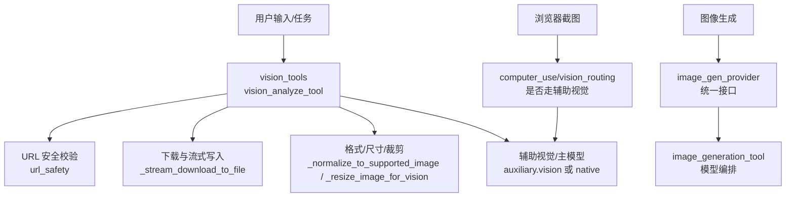
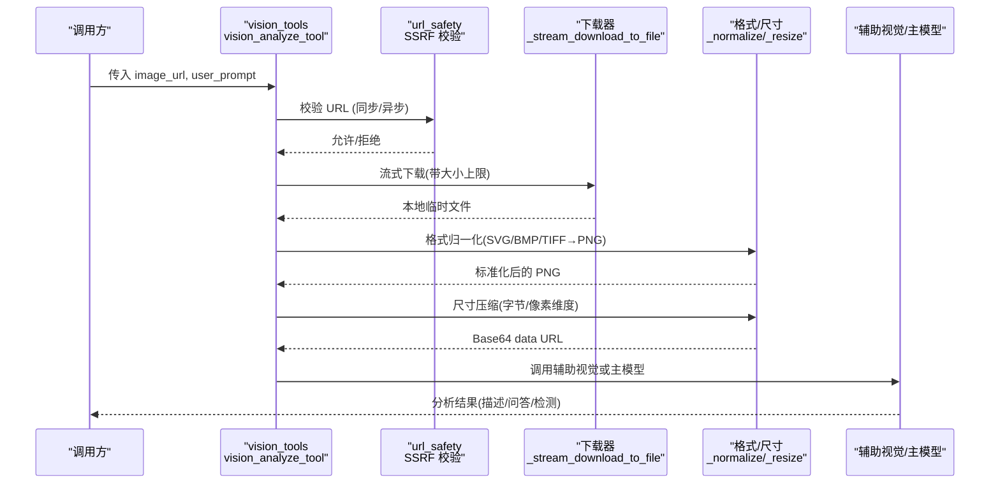
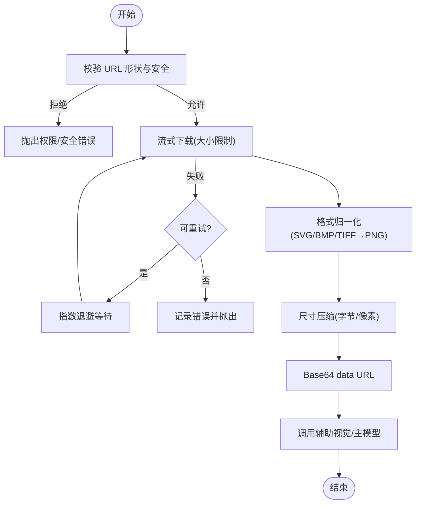
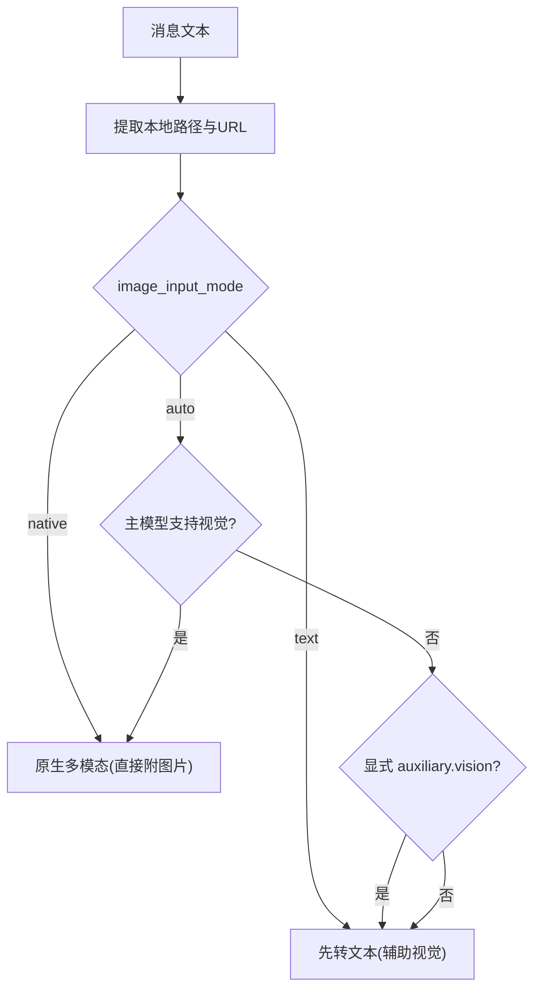
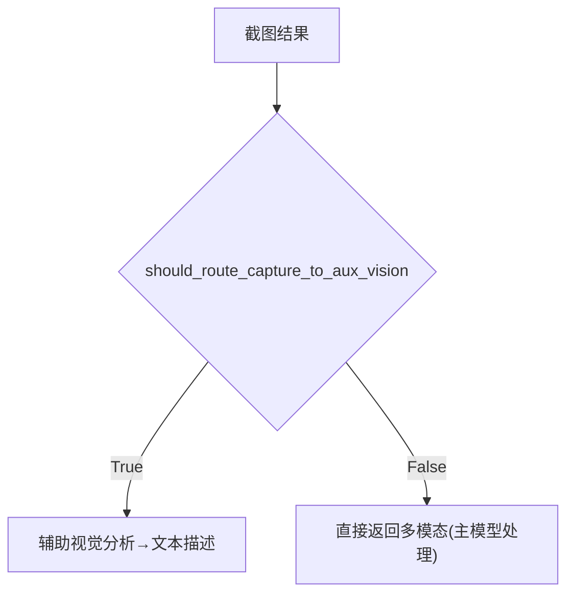
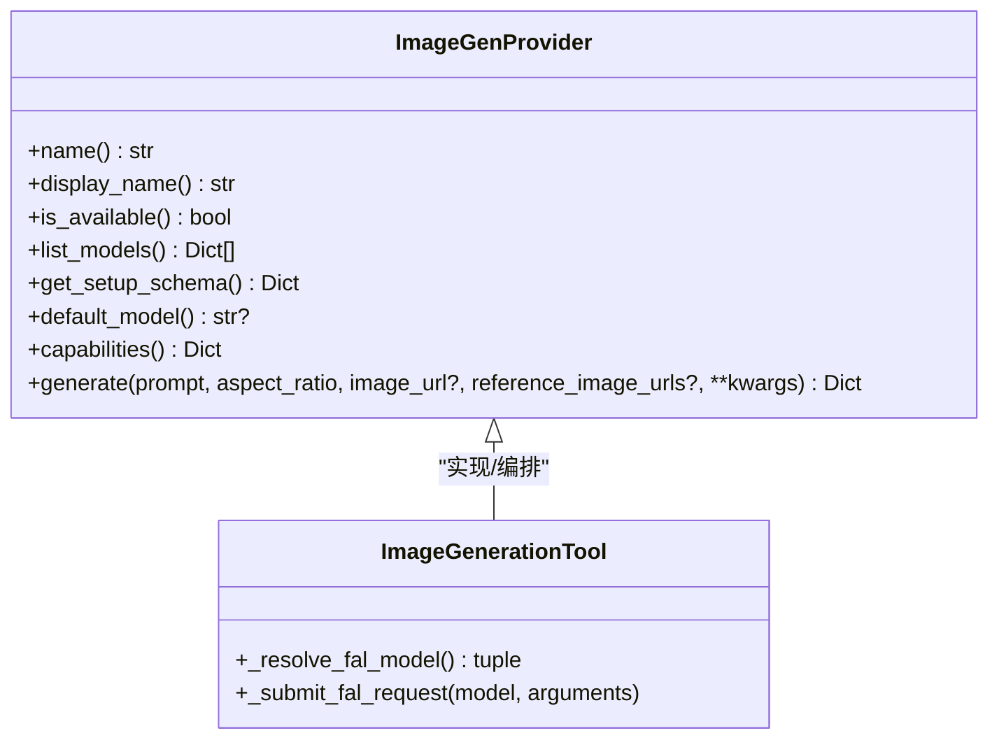
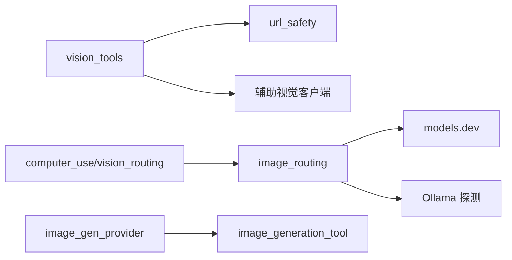

# 图像处理能力

<cite>
**本文引用的文件**
- [tools/vision_tools.py](file://tools/vision_tools.py)
- [agent/image_gen_provider.py](file://agent/image_gen_provider.py)
- [agent/image_routing.py](file://agent/image_routing.py)
- [tools/computer_use/vision_routing.py](file://tools/computer_use/vision_routing.py)
- [tools/url_safety.py](file://tools/url_safety.py)
- [tools/image_generation_tool.py](file://tools/image_generation_tool.py)
</cite>

## 目录
1. [简介](#简介)
2. [项目结构](#项目结构)
3. [核心组件](#核心组件)
4. [架构总览](#架构总览)
5. [详细组件分析](#详细组件分析)
6. [依赖关系分析](#依赖关系分析)
7. [性能考虑](#性能考虑)
8. [故障排查指南](#故障排查指南)
9. [结论](#结论)
10. [附录](#附录)

## 简介
本文件系统性梳理 Sparkii Agent 的图像处理能力，覆盖图像分析（识别、描述生成、对象检测、视觉问答）、图像处理操作（格式转换、尺寸调整、裁剪与优化）、图像生成（文本到图像、图像编辑、风格迁移）、浏览器截图（网页内容与动态元素捕获），以及图像 URL 处理机制（安全验证、下载优化、缓存策略）。同时提供基于 vision_analyze_tool 的使用指引、错误处理与性能优化建议。

## 项目结构
Sparkii 的图像处理由多个模块协作完成：
- 视觉分析与工具层：vision_tools.py 提供 vision_analyze_tool，负责从 URL 下载图片、格式校验与转换、尺寸压缩、Base64 编码、调用辅助视觉后端或主模型。
- 路由与模式选择：image_routing.py 决定用户附加图片以“原生多模态”还是“先转文本”的方式交给主模型；computer_use/vision_routing.py 针对 computer_use 截图结果做类似决策。
- 图像生成：image_gen_provider.py 定义统一的图像生成抽象接口；image_generation_tool.py 实现具体模型编排与参数映射。
- 安全与网络：url_safety.py 提供 SSRF 防护、URL 规范化、敏感查询参数检测、连接时 IP 白名单校验等。

图表来源
- [tools/vision_tools.py:406-572](file://tools/vision_tools.py#L406-L572)
- [agent/image_routing.py:461-506](file://agent/image_routing.py#L461-L506)
- [tools/computer_use/vision_routing.py:164-199](file://tools/computer_use/vision_routing.py#L164-L199)
- [agent/image_gen_provider.py:64-194](file://agent/image_gen_provider.py#L64-L194)
- [tools/image_generation_tool.py:771-800](file://tools/image_generation_tool.py#L771-L800)

章节来源
- [tools/vision_tools.py:1-120](file://tools/vision_tools.py#L1-L120)
- [agent/image_routing.py:1-50](file://agent/image_routing.py#L1-L50)
- [tools/computer_use/vision_routing.py:1-46](file://tools/computer_use/vision_routing.py#L1-L46)
- [agent/image_gen_provider.py:1-40](file://agent/image_gen_provider.py#L1-L40)
- [tools/image_generation_tool.py:1-21](file://tools/image_generation_tool.py#L1-L21)

## 核心组件
- vision_analyze_tool（tools/vision_tools.py）
  - 功能：从 URL 下载图片、SSRF 校验、网站访问策略检查、流式下载、大小限制、格式归一化（SVG→PNG、BMP/TIFF→PNG）、尺寸压缩、Base64 data URL 构建、并发 CPU 限流、重试与错误分类。
  - 关键路径：_download_image → _stream_download_to_file → _normalize_to_supported_image → _resize_image_for_vision → async_call_llm（辅助视觉）或 native 多模态。
- 图像输入路由（agent/image_routing.py）
  - 功能：根据配置与模型能力决定使用“原生多模态”或“先转文本”的模式；提取本地路径与 URL 引用；将非通用格式转码为 PNG。
- 截图路由（tools/computer_use/vision_routing.py）
  - 功能：对 computer_use 捕获的截图决定直接返回多模态内容还是通过辅助视觉转为文本描述，避免主模型不支持导致失败。
- 图像生成抽象与实现（agent/image_gen_provider.py, tools/image_generation_tool.py）
  - 功能：统一 generate 接口，支持 text-to-image 与 image-to-image/edit；模型目录与参数映射；上传/保存/缓存；成功/失败响应构造。
- URL 安全（tools/url_safety.py）
  - 功能：is_safe_url/async_is_safe_url、always-blocked 主机/IP 列表、连接时 DNS 重绑定防护、代理环境兼容、敏感查询参数检测。

章节来源
- [tools/vision_tools.py:213-243](file://tools/vision_tools.py#L213-L243)
- [tools/vision_tools.py:406-572](file://tools/vision_tools.py#L406-L572)
- [tools/vision_tools.py:624-650](file://tools/vision_tools.py#L624-L650)
- [agent/image_routing.py:82-148](file://agent/image_routing.py#L82-L148)
- [agent/image_routing.py:461-506](file://agent/image_routing.py#L461-L506)
- [tools/computer_use/vision_routing.py:164-199](file://tools/computer_use/vision_routing.py#L164-L199)
- [agent/image_gen_provider.py:64-194](file://agent/image_gen_provider.py#L64-L194)
- [tools/image_generation_tool.py:771-800](file://tools/image_generation_tool.py#L771-L800)
- [tools/url_safety.py:415-528](file://tools/url_safety.py#L415-L528)

## 架构总览
下图展示一次典型的“从 URL 分析图像”的端到端流程，包括安全校验、下载、格式/尺寸处理、并发控制与调用辅助视觉或主模型。

图表来源
- [tools/vision_tools.py:406-572](file://tools/vision_tools.py#L406-L572)
- [tools/vision_tools.py:624-650](file://tools/vision_tools.py#L624-L650)
- [agent/image_routing.py:461-506](file://agent/image_routing.py#L461-L506)

## 详细组件分析

### 视觉分析工具（vision_analyze_tool）
- 下载与安全
  - 使用 httpx 异步客户端，启用 follow_redirects 并在 response 钩子中再次校验每个跳转目标，防止 SSRF。
  - 流式写入临时文件，按 Content-Length 与逐块计数双重限制最大字节数，异常时原子替换或删除临时文件。
- 格式与尺寸
  - 基于魔数头识别 MIME，仅保留主流支持格式（JPEG/PNG/GIF/WebP）；SVG 尝试多种光栅化工具转 PNG；其他格式（BMP/TIFF）用 Pillow 转 PNG。
  - 主动在嵌入对话历史前进行尺寸压缩，避免超过提供商单图限制（如 Anthropic 5MB 与每边 8000px）。
- 并发与资源
  - 使用独立 ThreadPoolExecutor 限制 encode/resize 的 CPU 突发，默认等于可用核心数；LLM 调用保持全并发，避免阻塞事件循环。
- 错误分类与重试
  - 区分可重试（429/5xx/网络抖动）与不可重试（4xx 除 429、权限、过大、SSRF 跳转）错误；指数退避重试。

图表来源
- [tools/vision_tools.py:406-572](file://tools/vision_tools.py#L406-L572)
- [tools/vision_tools.py:277-379](file://tools/vision_tools.py#L277-L379)
- [tools/vision_tools.py:624-650](file://tools/vision_tools.py#L624-L650)

章节来源
- [tools/vision_tools.py:213-243](file://tools/vision_tools.py#L213-L243)
- [tools/vision_tools.py:406-572](file://tools/vision_tools.py#L406-L572)
- [tools/vision_tools.py:624-650](file://tools/vision_tools.py#L624-L650)

### 图像输入路由（native vs text）
- 决策逻辑
  - 若 agent.image_input_mode 显式为 native/text，则遵循之；否则 auto：
    - 若主模型 supports_vision=True，则使用原生多模态（直接附带图片）。
    - 否则若用户显式配置 auxiliary.vision，则走文本模式（先分析再描述）。
- 本地与 URL 提取
  - 扫描消息中的本地图片路径与 http(s) URL，忽略代码块内的引用，去重并保持顺序。
- 格式兼容性
  - 非通用格式（AVIF/HEIC/BMP/TIFF/ICO/SVG）尝试转码为 PNG；无法转码则跳过该附件，不影响其余处理。

图表来源
- [agent/image_routing.py:461-506](file://agent/image_routing.py#L461-L506)
- [agent/image_routing.py:82-148](file://agent/image_routing.py#L82-L148)
- [agent/image_routing.py:524-725](file://agent/image_routing.py#L524-L725)

章节来源
- [agent/image_routing.py:461-506](file://agent/image_routing.py#L461-L506)
- [agent/image_routing.py:82-148](file://agent/image_routing.py#L82-L148)
- [agent/image_routing.py:524-725](file://agent/image_routing.py#L524-L725)

### 截图路由（computer_use）
- 决策要点
  - 若用户显式配置 auxiliary.vision，则截图走辅助视觉（返回文本描述）。
  - 若主模型声明 supports_vision=True 且 provider 接受 tool-result 中的图片，则直接返回多模态。
  - 否则走辅助视觉，保证主模型始终收到可用信息。
- 目的
  - 避免因主模型不支持 multimodal tool result 导致的硬失败（HTTP 400/404）。

图表来源
- [tools/computer_use/vision_routing.py:164-199](file://tools/computer_use/vision_routing.py#L164-L199)

章节来源
- [tools/computer_use/vision_routing.py:164-199](file://tools/computer_use/vision_routing.py#L164-L199)

### 图像生成（文本到图像、编辑、风格迁移）
- 统一接口
  - ImageGenProvider.generate 接收 prompt、aspect_ratio、可选 image_url/reference_image_urls，内部路由至 text-to-image 或 image-to-image/edit。
- 模型与参数
  - image_generation_tool.py 维护模型目录（含尺寸/比例映射、默认参数、是否 upscale、edit 端点与支持的键）。
  - 支持通过 managed gateway 或直接 FAL 密钥提交请求，并对 4xx 网关错误给出可操作提示。
- 输出与缓存
  - 成功响应包含 image（URL 或绝对路径）、model、prompt、aspect_ratio、modality、provider。
  - save_b64_image/save_url_image 将结果持久化到缓存目录，便于下游消费。

图表来源
- [agent/image_gen_provider.py:64-194](file://agent/image_gen_provider.py#L64-L194)
- [tools/image_generation_tool.py:771-800](file://tools/image_generation_tool.py#L771-L800)

章节来源
- [agent/image_gen_provider.py:64-194](file://agent/image_gen_provider.py#L64-L194)
- [tools/image_generation_tool.py:771-800](file://tools/image_generation_tool.py#L771-L800)

### 浏览器截图与网页内容捕获
- 截图结果路由
  - 通过 computer_use/vision_routing.py 判断是否将截图作为多模态直接交给主模型，或先经辅助视觉转为文本描述。
- 动态元素
  - 截图由浏览器后端捕获，结合页面渲染状态；如需更细粒度抓取，可在上层技能中组合 web 工具与截图。

章节来源
- [tools/computer_use/vision_routing.py:164-199](file://tools/computer_use/vision_routing.py#L164-L199)

### 图像 URL 处理机制（安全、下载、缓存）
- 安全验证
  - is_safe_url/async_is_safe_url 阻止私有/内网地址与云元数据主机；always-blocked 列表确保即使开关开启也不放行高危目标。
  - 连接时 DNS 重绑定防护：在 TCP 连接前解析并校验 IP，阻断 TOCTOU 绕过。
- 下载优化
  - 流式下载、Content-Length 预检、逐块大小限制、原子替换临时文件，异常清理。
- 缓存策略
  - 图像生成结果保存到 $SPARKII_HOME/cache/images/，文件名含时间戳与短 UUID，便于追踪与清理。

章节来源
- [tools/url_safety.py:311-528](file://tools/url_safety.py#L311-L528)
- [tools/url_safety.py:522-528](file://tools/url_safety.py#L522-L528)
- [tools/url_safety.py:539-595](file://tools/url_safety.py#L539-L595)
- [agent/image_gen_provider.py:236-344](file://agent/image_gen_provider.py#L236-L344)

## 依赖关系分析
- vision_tools 依赖 url_safety 进行 URL 安全校验，依赖网站访问策略 check_website_access，依赖辅助视觉客户端 async_call_llm。
- image_routing 依赖 models.dev 能力元数据与 Ollama 探测，用于自动模式下的路由决策。
- computer_use/vision_routing 复用 image_routing 的能力判定与工具结果多媒体支持判断，保持一致性。
- image_gen_provider 与 image_generation_tool 共同构成图像生成管线，前者定义接口与响应规范，后者实现模型编排与请求提交。

图表来源
- [tools/vision_tools.py:406-572](file://tools/vision_tools.py#L406-L572)
- [agent/image_routing.py:461-506](file://agent/image_routing.py#L461-L506)
- [tools/computer_use/vision_routing.py:164-199](file://tools/computer_use/vision_routing.py#L164-L199)
- [agent/image_gen_provider.py:64-194](file://agent/image_gen_provider.py#L64-L194)
- [tools/image_generation_tool.py:771-800](file://tools/image_generation_tool.py#L771-L800)

章节来源
- [tools/vision_tools.py:406-572](file://tools/vision_tools.py#L406-L572)
- [agent/image_routing.py:461-506](file://agent/image_routing.py#L461-L506)
- [tools/computer_use/vision_routing.py:164-199](file://tools/computer_use/vision_routing.py#L164-L199)
- [agent/image_gen_provider.py:64-194](file://agent/image_gen_provider.py#L64-L194)
- [tools/image_generation_tool.py:771-800](file://tools/image_generation_tool.py#L771-L800)

## 性能考虑
- 并发控制
  - 使用独立的 bounded ThreadPoolExecutor 限制 encode/resize 的 CPU 突发，默认等于可用核心数；LLM 调用保持全并发，避免阻塞事件循环。
- 内存与磁盘
  - 流式下载与临时文件原子替换，避免大文件驻留内存；严格的大小上限防止 OOM。
- 尺寸压缩
  - 主动在嵌入对话历史前压缩图片，避免超过提供商限制；对超大长图优先按最长边限制缩放。
- 懒加载与软依赖
  - 按需导入 Pillow/cairosvg/svglib/reportlab 等软依赖，缺失时降级并给出明确提示。

章节来源
- [tools/vision_tools.py:101-210](file://tools/vision_tools.py#L101-L210)
- [tools/vision_tools.py:624-650](file://tools/vision_tools.py#L624-L650)
- [tools/vision_tools.py:745-800](file://tools/vision_tools.py#L745-L800)

## 故障排查指南
- 网络异常
  - 4xx（除 429）视为不可重试；5xx/429/网络抖动可重试；指数退避。
  - 若频繁超时，检查 SPARKII_VISION_DOWNLOAD_TIMEOUT 与网络质量。
- 格式不支持
  - SVG 需安装 cairosvg/svglib+reportlab 或系统光栅化工具；BMP/TIFF 需 Pillow。
  - 若仍失败，先将图片转换为 PNG/JPEG 后重试。
- 安全限制
  - 私有/内网地址被拦截；云元数据主机永远禁止；确认 URL 合法且不在黑名单。
  - 若处于代理/DNS 受限环境，确认代理配置正确。
- 尺寸超限
  - 若主模型拒绝大图，系统将自动缩小并重试；也可手动降低分辨率或裁剪区域。
- 截图路由问题
  - 若主模型不支持 multimodal tool result，截图会走辅助视觉；可通过配置 auxiliary.vision 强制走文本模式。

章节来源
- [tools/vision_tools.py:382-404](file://tools/vision_tools.py#L382-L404)
- [tools/vision_tools.py:406-572](file://tools/vision_tools.py#L406-L572)
- [tools/vision_tools.py:277-379](file://tools/vision_tools.py#L277-L379)
- [tools/url_safety.py:415-528](file://tools/url_safety.py#L415-L528)
- [tools/computer_use/vision_routing.py:164-199](file://tools/computer_use/vision_routing.py#L164-L199)

## 结论
Sparkii Agent 的图像处理能力围绕“安全、稳定、可扩展”的原则设计：通过严格的 URL 安全校验与流式下载保障稳定性；通过格式归一化与尺寸压缩提升兼容性；通过并发限流与懒加载优化性能；通过统一接口与路由策略扩展图像生成与分析能力。借助 vision_analyze_tool 与图像生成管线，用户可以在同一框架下完成从分析到生成的完整工作流。

## 附录

### 使用示例：vision_analyze_tool
- 典型调用
  - 传入 image_url 与 user_prompt，工具将下载图片、校验安全、格式归一化、尺寸压缩，然后调用辅助视觉或主模型进行分析。
- 参考路径
  - 函数入口与下载流程：[tools/vision_tools.py:406-572](file://tools/vision_tools.py#L406-L572)
  - 格式归一化与尺寸压缩：[tools/vision_tools.py:277-379](file://tools/vision_tools.py#L277-L379), [tools/vision_tools.py:624-650](file://tools/vision_tools.py#L624-L650)
  - 并发 CPU 限流：[tools/vision_tools.py:101-210](file://tools/vision_tools.py#L101-L210)

### 配置与环境变量
- 下载超时：SPARKII_VISION_DOWNLOAD_TIMEOUT（默认 30s）
- 并发上限：SPARKII_VISION_MAX_CONCURRENCY（默认等于可用核心数）
- 私有 URL 允许：security.allow_private_urls 或 SPARKII_ALLOW_PRIVATE_URLS

章节来源
- [tools/vision_tools.py:74-94](file://tools/vision_tools.py#L74-L94)
- [tools/vision_tools.py:146-181](file://tools/vision_tools.py#L146-L181)
- [tools/url_safety.py:220-279](file://tools/url_safety.py#L220-L279)