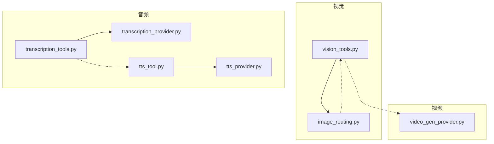
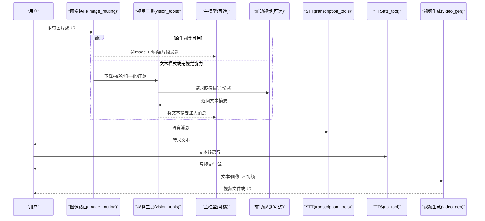
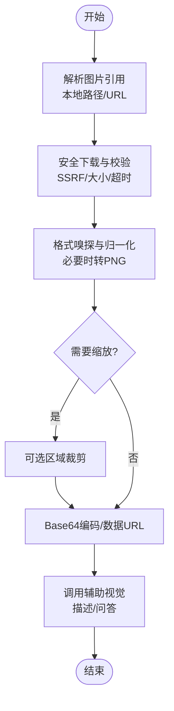
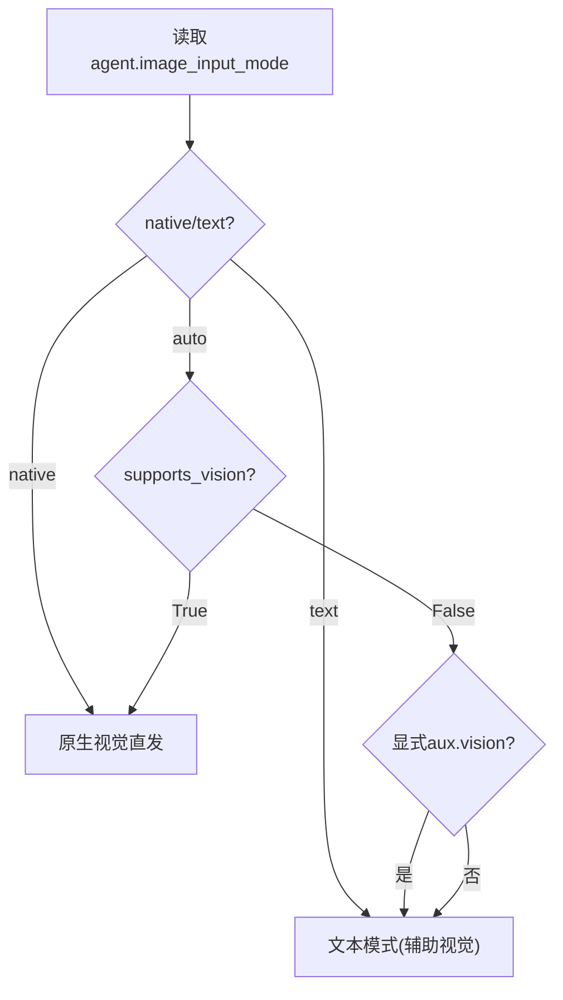
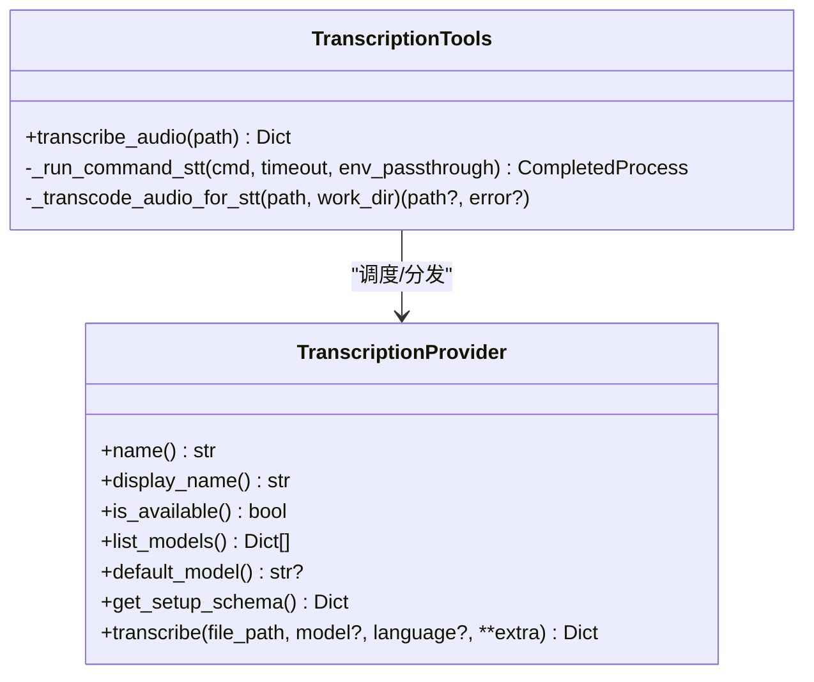
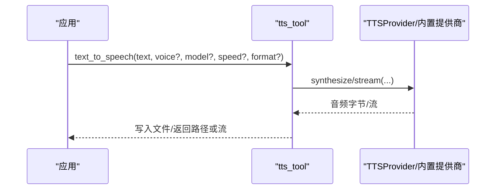
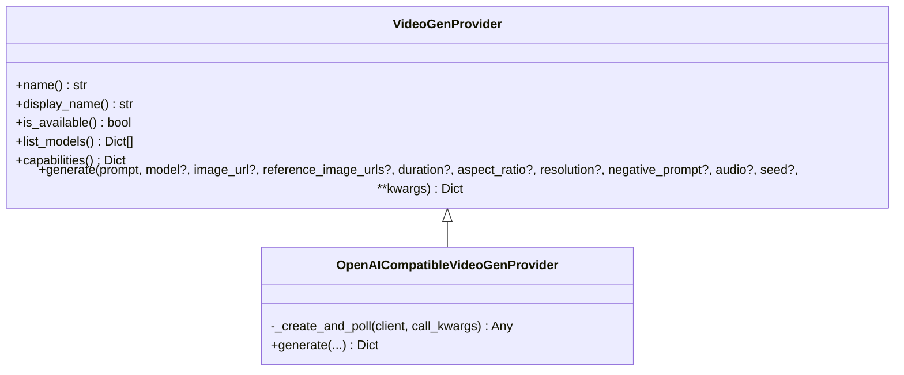
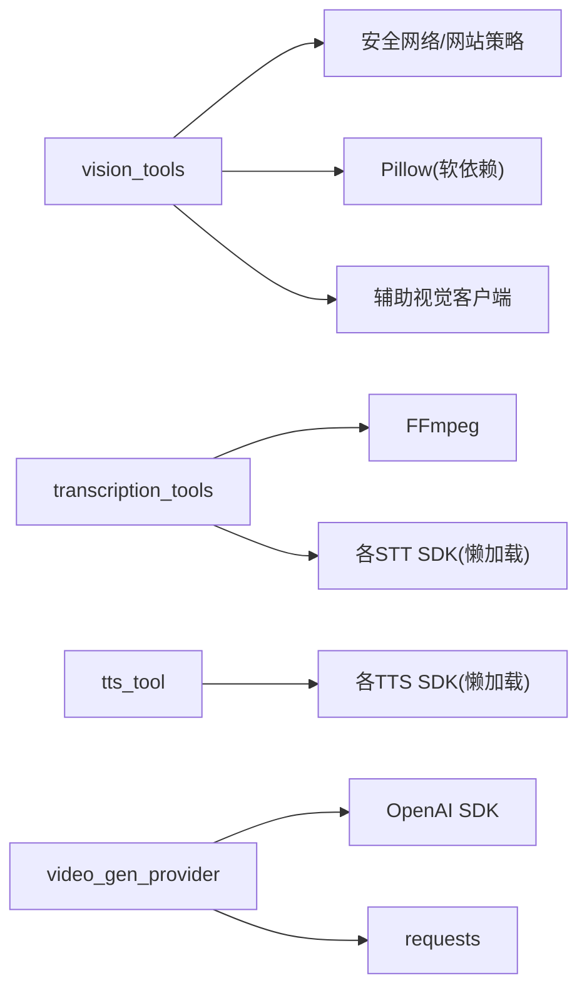

# 多模态处理

<cite>
**本文引用的文件**
- [tools/vision_tools.py](file://tools/vision_tools.py)
- [agent/image_routing.py](file://agent/image_routing.py)
- [tools/transcription_tools.py](file://tools/transcription_tools.py)
- [agent/transcription_provider.py](file://agent/transcription_provider.py)
- [tools/tts_tool.py](file://tools/tts_tool.py)
- [agent/tts_provider.py](file://agent/tts_provider.py)
- [agent/video_gen_provider.py](file://agent/video_gen_provider.py)
</cite>

## 目录
1. [简介](#简介)
2. [项目结构](#项目结构)
3. [核心组件](#核心组件)
4. [架构总览](#架构总览)
5. [详细组件分析](#详细组件分析)
6. [依赖关系分析](#依赖关系分析)
7. [性能考量](#性能考量)
8. [故障排查指南](#故障排查指南)
9. [结论](#结论)
10. [附录：API调用示例与集成方案](#附录api调用示例与集成方案)

## 简介
本文件面向Sparkii Agent的多模态处理能力，系统性地说明文本、图像、音频、视频的处理机制与融合方式，并提供可操作的集成建议与性能优化实践。内容覆盖：
- 文本处理引擎：自然语言理解、上下文分析与响应生成（通过辅助视觉/工具链协同）。
- 图像处理能力：图像识别、描述生成、编辑操作、视觉问答。
- 音频处理功能：语音转文字（STT）、文字转语音（TTS）、音频分析与声音克隆（通过TTS提供商能力）。
- 视频处理能力：视频分析、内容提取、生成与编辑（以生成为主）。
- 多模态融合：跨模态输入输出组合策略与路由。
- API调用示例与集成方案：第三方服务与本地模型部署。
- 性能优化与最佳实践。

## 项目结构
围绕多模态的核心模块分布在以下位置：
- 视觉工具与路由：vision_tools.py、image_routing.py
- 语音转文字：transcription_tools.py、transcription_provider.py
- 文字转语音：tts_tool.py、tts_provider.py
- 视频生成：video_gen_provider.py

图表来源
- [tools/vision_tools.py:1-120](file://tools/vision_tools.py#L1-L120)
- [agent/image_routing.py:1-120](file://agent/image_routing.py#L1-L120)
- [tools/transcription_tools.py:1-120](file://tools/transcription_tools.py#L1-L120)
- [agent/transcription_provider.py:1-120](file://agent/transcription_provider.py#L1-L120)
- [tools/tts_tool.py:1-120](file://tools/tts_tool.py#L1-L120)
- [agent/tts_provider.py:1-120](file://agent/tts_provider.py#L1-L120)
- [agent/video_gen_provider.py:1-120](file://agent/video_gen_provider.py#L1-L120)

章节来源
- [tools/vision_tools.py:1-120](file://tools/vision_tools.py#L1-L120)
- [agent/image_routing.py:1-120](file://agent/image_routing.py#L1-L120)
- [tools/transcription_tools.py:1-120](file://tools/transcription_tools.py#L1-L120)
- [agent/transcription_provider.py:1-120](file://agent/transcription_provider.py#L1-L120)
- [tools/tts_tool.py:1-120](file://tools/tts_tool.py#L1-L120)
- [agent/tts_provider.py:1-120](file://agent/tts_provider.py#L1-L120)
- [agent/video_gen_provider.py:1-120](file://agent/video_gen_provider.py#L1-L120)

## 核心组件
- 视觉工具与路由
  - 视觉工具：负责下载图片、安全校验、格式归一化、尺寸压缩、Base64编码、调用辅助视觉后端进行描述与分析。
  - 图像路由：决定用户附加图片以“原生”或“文本”模式进入主模型；支持自动/强制模式切换与能力探测。
- 音频处理
  - 语音转文字（STT）：内置多种提供商（本地Whisper、Groq、OpenAI、Mistral、xAI、ElevenLabs等），支持命令型与插件型扩展。
  - 文字转语音（TTS）：内置多种提供商（Edge、OpenAI、ElevenLabs、MiniMax、Mistral、Gemini、xAI、NeuTTS、KittenTTS、Piper等），支持流式与非流式合成。
- 视频生成
  - 统一抽象：提供文本到视频与图像到视频的生成接口，封装异步任务轮询与结果落盘。

章节来源
- [tools/vision_tools.py:1-120](file://tools/vision_tools.py#L1-L120)
- [agent/image_routing.py:1-120](file://agent/image_routing.py#L1-L120)
- [tools/transcription_tools.py:1-120](file://tools/transcription_tools.py#L1-L120)
- [agent/transcription_provider.py:1-120](file://agent/transcription_provider.py#L1-L120)
- [tools/tts_tool.py:1-120](file://tools/tts_tool.py#L1-L120)
- [agent/tts_provider.py:1-120](file://agent/tts_provider.py#L1-L120)
- [agent/video_gen_provider.py:1-120](file://agent/video_gen_provider.py#L1-L120)

## 架构总览
下图展示多模态处理的端到端流程：用户输入经路由选择是否直接送入主模型（原生视觉）还是先由辅助视觉转为文本；音频走STT/TTS管线；视频走生成管线。

图表来源
- [agent/image_routing.py:460-506](file://agent/image_routing.py#L460-L506)
- [tools/vision_tools.py:477-572](file://tools/vision_tools.py#L477-L572)
- [tools/transcription_tools.py:1-120](file://tools/transcription_tools.py#L1-L120)
- [tools/tts_tool.py:1-120](file://tools/tts_tool.py#L1-L120)
- [agent/video_gen_provider.py:168-203](file://agent/video_gen_provider.py#L168-L203)

## 详细组件分析

### 视觉处理：图像识别、描述生成、编辑与视觉问答
- 关键职责
  - 安全下载：SSRF防护、重定向目标校验、大小限制、超时控制。
  - 格式归一化：基于魔数嗅探MIME类型，必要时转码为PNG以保证主流视觉提供商兼容。
  - 尺寸与载荷控制：主动嵌入前缩放至目标字节与像素上限，避免会话被不可重试的坏图卡死。
  - 区域裁剪：支持按坐标裁剪放大细节区域。
  - 辅助视觉：通过辅助客户端调用外部视觉后端，生成描述或回答用户问题。
- 典型流程
  - 解析用户消息中的本地路径与URL引用。
  - 下载并校验图片，归一化格式与尺寸。
  - 调用辅助视觉获取描述/答案，回写至消息上下文。

图表来源
- [tools/vision_tools.py:477-572](file://tools/vision_tools.py#L477-L572)
- [tools/vision_tools.py:324-379](file://tools/vision_tools.py#L324-L379)
- [tools/vision_tools.py:681-743](file://tools/vision_tools.py#L681-L743)
- [tools/vision_tools.py:598-622](file://tools/vision_tools.py#L598-L622)

章节来源
- [tools/vision_tools.py:477-572](file://tools/vision_tools.py#L477-L572)
- [tools/vision_tools.py:324-379](file://tools/vision_tools.py#L324-L379)
- [tools/vision_tools.py:681-743](file://tools/vision_tools.py#L681-L743)
- [tools/vision_tools.py:598-622](file://tools/vision_tools.py#L598-L622)

### 图像路由：原生与文本模式的决策
- 决策依据
  - 配置模式：auto/native/text。
  - 模型能力：supports_vision覆盖或模型元数据探测。
  - 显式辅助视觉配置：作为文本模式的回退。
- 行为
  - 原生模式：将图片以OpenAI风格的image_url内容片段直接发送给提供商适配器。
  - 文本模式：先运行vision_analyze得到文本摘要，再送入主模型。

图表来源
- [agent/image_routing.py:460-506](file://agent/image_routing.py#L460-L506)
- [agent/image_routing.py:180-273](file://agent/image_routing.py#L180-L273)
- [agent/image_routing.py:387-458](file://agent/image_routing.py#L387-L458)

章节来源
- [agent/image_routing.py:460-506](file://agent/image_routing.py#L460-L506)
- [agent/image_routing.py:180-273](file://agent/image_routing.py#L180-L273)
- [agent/image_routing.py:387-458](file://agent/image_routing.py#L387-L458)

### 语音转文字（STT）：提供商与命令型扩展
- 提供商体系
  - 内置提供商：local（faster-whisper）、groq、openai、mistral、xai、elevenlabs、deepinfra等。
  - 命令型提供商：通过配置声明shell命令模板，零代码接入任意ASR CLI。
  - 插件提供商：实现TranscriptionProvider ABC，注册后参与调度。
- 关键特性
  - 语言提示解析、模型名规范化、FFmpeg转码为通用m4a。
  - 空闲卸载本地模型以节省内存/显存。
  - 错误分类与重试策略（仅对瞬态错误重试）。

图表来源
- [agent/transcription_provider.py:61-194](file://agent/transcription_provider.py#L61-L194)
- [tools/transcription_tools.py:263-335](file://tools/transcription_tools.py#L263-L335)
- [tools/transcription_tools.py:710-800](file://tools/transcription_tools.py#L710-L800)

章节来源
- [agent/transcription_provider.py:61-194](file://agent/transcription_provider.py#L61-L194)
- [tools/transcription_tools.py:263-335](file://tools/transcription_tools.py#L263-L335)
- [tools/transcription_tools.py:710-800](file://tools/transcription_tools.py#L710-L800)

### 文字转语音（TTS）：提供商、流式与平台适配
- 提供商体系
  - 内置提供商：edge、openai、elevenlabs、minimax、mistral、gemini、xai、neutts、kittentts、piper、deepinfra等。
  - 命令型提供商：通过tts.providers.<name>: type: command声明本地CLI。
  - 插件提供商：实现TTSProvider ABC，支持流式合成与声音列表。
- 关键特性
  - 长文本分块与平台打包（考虑Telegram/Discord等平台限制）。
  - 流式合成（如Opus用于语音气泡）。
  - 供应商最大文本长度自适应与截断。
  - 输出格式归一化与兼容性处理。

图表来源
- [agent/tts_provider.py:64-255](file://agent/tts_provider.py#L64-L255)
- [tools/tts_tool.py:205-285](file://tools/tts_tool.py#L205-L285)
- [tools/tts_tool.py:597-623](file://tools/tts_tool.py#L597-L623)

章节来源
- [agent/tts_provider.py:64-255](file://agent/tts_provider.py#L64-L255)
- [tools/tts_tool.py:205-285](file://tools/tts_tool.py#L205-L285)
- [tools/tts_tool.py:597-623](file://tools/tts_tool.py#L597-L623)

### 视频生成：文本/图像到视频的统一接口
- 统一抽象
  - 单一generate方法同时支持text-to-video与image-to-video（通过image_url存在性路由）。
  - OpenAI兼容后端基类封装异步任务创建、轮询与结果落盘。
- 关键特性
  - 分辨率/宽高比/时长/负向提示/种子等参数透传。
  - 结果保存至缓存目录，支持URL与字节两种来源。
  - 错误响应标准化，便于上层统一处理。

图表来源
- [agent/video_gen_provider.py:75-203](file://agent/video_gen_provider.py#L75-L203)
- [agent/video_gen_provider.py:385-597](file://agent/video_gen_provider.py#L385-L597)

章节来源
- [agent/video_gen_provider.py:75-203](file://agent/video_gen_provider.py#L75-L203)
- [agent/video_gen_provider.py:385-597](file://agent/video_gen_provider.py#L385-L597)

### 多模态融合机制
- 文本+图像：根据路由策略选择原生视觉或先转文本摘要。
- 文本+音频：STT将语音转为文本，进入对话上下文；TTS将回复转为语音输出。
- 文本/图像+视频：通过视频生成接口，结合提示词或参考图产出视频。
- 跨模态编排：工具层与网关层协作，确保各模态产物在会话中正确传递与复用。

章节来源
- [agent/image_routing.py:460-506](file://agent/image_routing.py#L460-L506)
- [tools/vision_tools.py:477-572](file://tools/vision_tools.py#L477-L572)
- [tools/transcription_tools.py:1-120](file://tools/transcription_tools.py#L1-L120)
- [tools/tts_tool.py:1-120](file://tools/tts_tool.py#L1-L120)
- [agent/video_gen_provider.py:168-203](file://agent/video_gen_provider.py#L168-L203)

## 依赖关系分析
- 视觉模块依赖
  - 安全网络库与网站访问策略（SSRF、白名单）。
  - Pillow用于格式转换与尺寸调整（软依赖，缺失时降级）。
  - 辅助视觉客户端（延迟加载，按需引入）。
- 音频模块依赖
  - FFmpeg用于音频转码（STT上传前标准化）。
  - 各提供商SDK（OpenAI、Mistral、ElevenLabs、xAI等）按需懒加载。
  - 本地模型（faster-whisper、NeuTTS、KittenTTS、Piper）按需安装与卸载。
- 视频模块依赖
  - OpenAI SDK（兼容后端）用于异步任务与下载。
  - requests用于HTTP下载与流式写入。

图表来源
- [tools/vision_tools.py:47-68](file://tools/vision_tools.py#L47-L68)
- [tools/vision_tools.py:245-322](file://tools/vision_tools.py#L245-L322)
- [tools/transcription_tools.py:235-287](file://tools/transcription_tools.py#L235-L287)
- [tools/tts_tool.py:107-180](file://tools/tts_tool.py#L107-L180)
- [agent/video_gen_provider.py:385-597](file://agent/video_gen_provider.py#L385-L597)

章节来源
- [tools/vision_tools.py:47-68](file://tools/vision_tools.py#L47-L68)
- [tools/vision_tools.py:245-322](file://tools/vision_tools.py#L245-L322)
- [tools/transcription_tools.py:235-287](file://tools/transcription_tools.py#L235-L287)
- [tools/tts_tool.py:107-180](file://tools/tts_tool.py#L107-L180)
- [agent/video_gen_provider.py:385-597](file://agent/video_gen_provider.py#L385-L597)

## 性能考量
- 视觉CPU并发控制
  - 使用有界线程池限制encode/resize并发，避免事件循环饥饿。
  - 环境变量与配置项控制最大并发，默认等于可用核心数。
- 下载与内存保护
  - 流式下载与大小上限，防止OOM与恶意大文件。
  - 主动嵌入前缩放至目标字节与像素上限，减少历史消息膨胀。
- 音频处理
  - STT本地模型空闲卸载，降低常驻内存/显存占用。
  - TTS长文本分块与平台打包，避免单文件过大导致传输失败。
- 视频生成
  - 自定义轮询间隔与截止时间，避免无限等待。
  - 结果落盘缓存，避免短时效URL失效问题。

章节来源
- [tools/vision_tools.py:101-210](file://tools/vision_tools.py#L101-L210)
- [tools/vision_tools.py:406-474](file://tools/vision_tools.py#L406-L474)
- [tools/vision_tools.py:624-650](file://tools/vision_tools.py#L624-L650)
- [tools/transcription_tools.py:134-157](file://tools/transcription_tools.py#L134-L157)
- [tools/tts_tool.py:470-535](file://tools/tts_tool.py#L470-L535)
- [agent/video_gen_provider.py:425-447](file://agent/video_gen_provider.py#L425-L447)

## 故障排查指南
- 视觉相关
  - 图片格式不被接受：检查MIME嗅探与转码路径；确认Pillow及可选插件已安装。
  - 下载失败：查看SSRF拦截、重定向目标校验与网站策略；关注4xx/5xx与超时。
  - 会话被坏图卡死：确认嵌入前缩放逻辑生效，避免超大或超长边图片进入历史。
- 音频相关
  - STT失败：检查FFmpeg可用性、转码日志与提供商密钥；确认语言提示与模型名规范。
  - TTS失败：核对提供商密钥、模型/声音ID、文本长度限制与输出格式；流式场景检查Opus支持。
- 视频相关
  - 任务超时：检查轮询间隔与截止时间；确认提供商状态码与错误信息。
  - 结果丢失：确认URL有效性或SDK下载路径；必要时返回原始URL而非本地文件。

章节来源
- [tools/vision_tools.py:382-403](file://tools/vision_tools.py#L382-L403)
- [tools/vision_tools.py:477-572](file://tools/vision_tools.py#L477-L572)
- [tools/transcription_tools.py:263-335](file://tools/transcription_tools.py#L263-L335)
- [tools/tts_tool.py:317-389](file://tools/tts_tool.py#L317-L389)
- [agent/video_gen_provider.py:517-597](file://agent/video_gen_provider.py#L517-L597)

## 结论
Sparkii Agent在多模态方面提供了统一的抽象与丰富的内置能力：视觉通过安全下载、格式归一化与尺寸控制保障稳定；音频通过多提供商与命令型扩展满足多样化需求；视频生成以统一接口屏蔽底层差异。配合智能路由与性能优化，可在复杂场景中可靠地处理跨模态输入输出。

## 附录：API调用示例与集成方案
- 视觉
  - 调用视觉工具进行图像描述或问答（通过辅助视觉后端）。
  - 配置图像路由模式（auto/native/text）以适配不同模型能力。
- 音频
  - STT：选择提供商（local/openai/groq/mistral/xai/elevenlabs/deepinfra），设置语言与模型；或使用命令型提供商接入本地ASR。
  - TTS：选择提供商（edge/openai/elevenlabs/minimax/mistral/gemini/xai/neutts/kittentts/piper/deepinfra），设置声音、速度与输出格式；长文本自动分块。
- 视频
  - 使用统一generate接口，传入prompt与可选image_url/reference_image_urls，指定分辨率、宽高比与时长；结果自动落盘或返回URL。
- 第三方服务集成
  - 通过提供商配置与密钥管理（config.yaml与环境变量）接入OpenAI、Mistral、xAI、DeepInfra、FAL等。
- 本地模型部署
  - STT：本地faster-whisper模型按需懒安装与空闲卸载。
  - TTS：NeuTTS/KittenTTS/Piper等本地引擎按需安装与运行。
  - 视觉：Pillow及可选插件按需安装，SVG转PNG需cairosvg/svglib或系统工具。

章节来源
- [tools/vision_tools.py:477-572](file://tools/vision_tools.py#L477-L572)
- [agent/image_routing.py:460-506](file://agent/image_routing.py#L460-L506)
- [tools/transcription_tools.py:1-120](file://tools/transcription_tools.py#L1-L120)
- [tools/tts_tool.py:1-120](file://tools/tts_tool.py#L1-L120)
- [agent/video_gen_provider.py:168-203](file://agent/video_gen_provider.py#L168-L203)