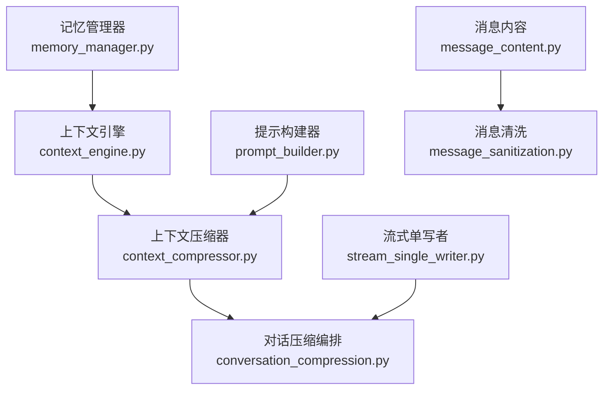
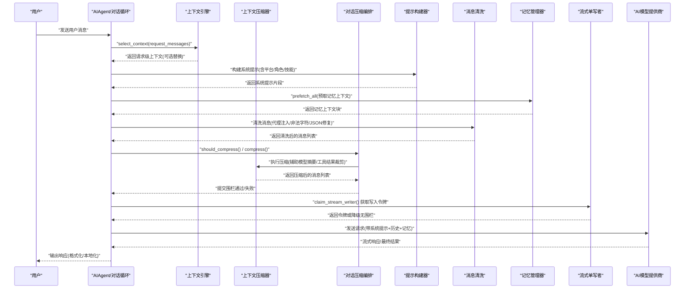
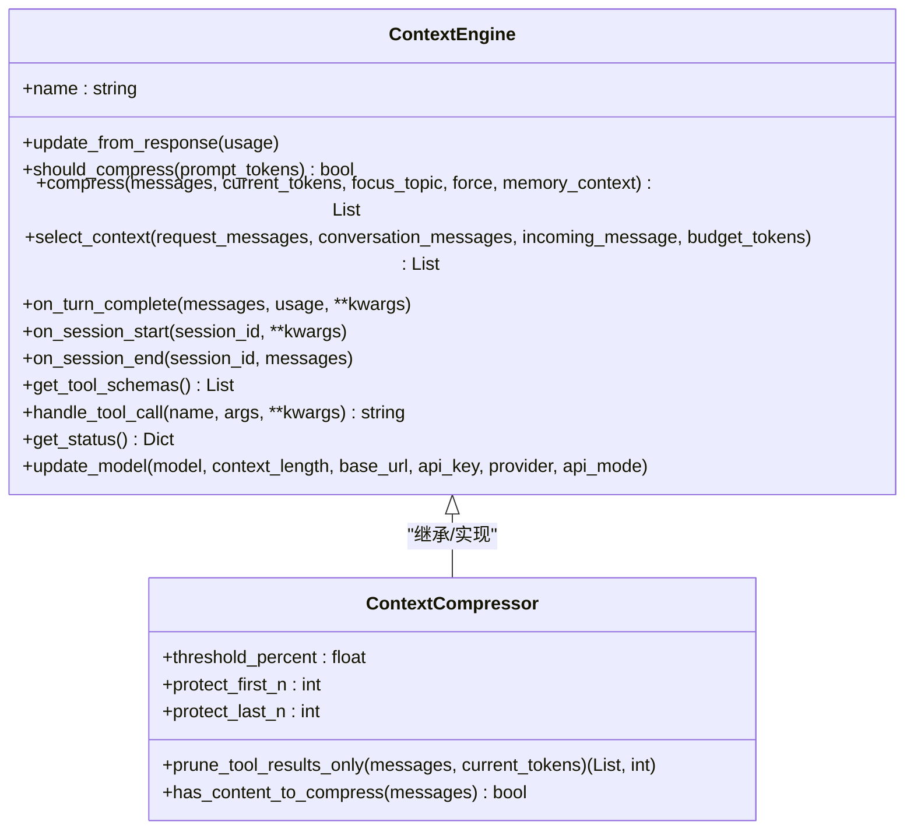
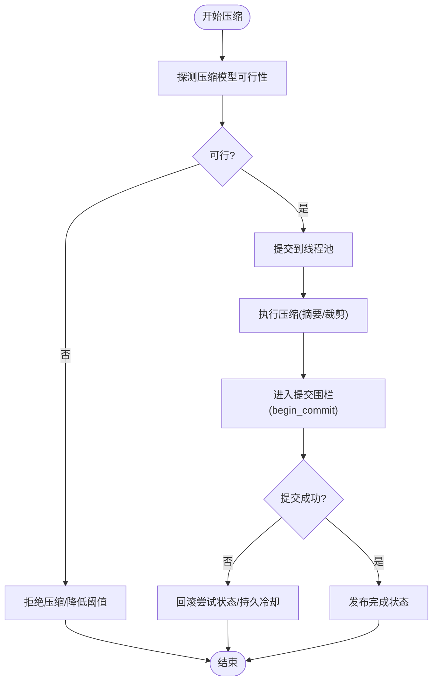
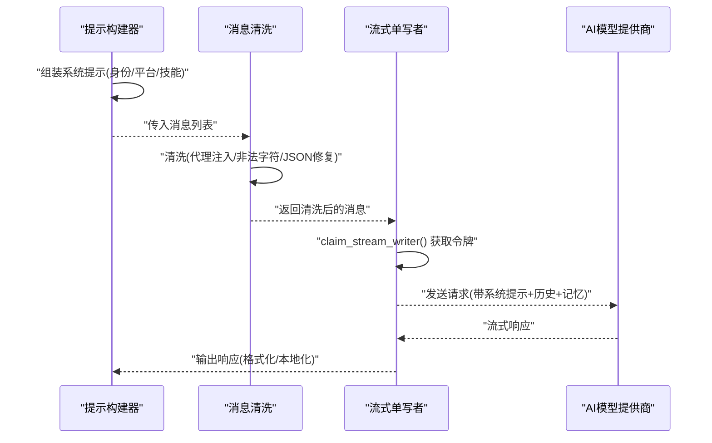
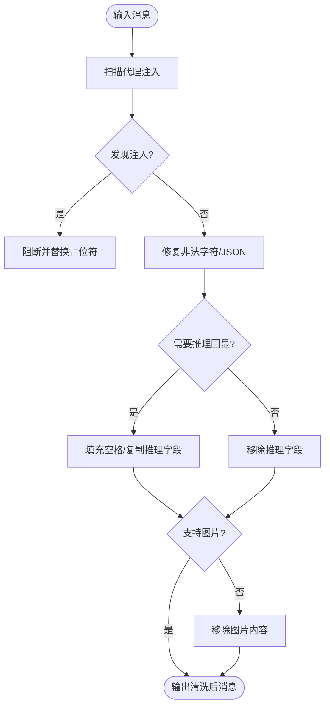
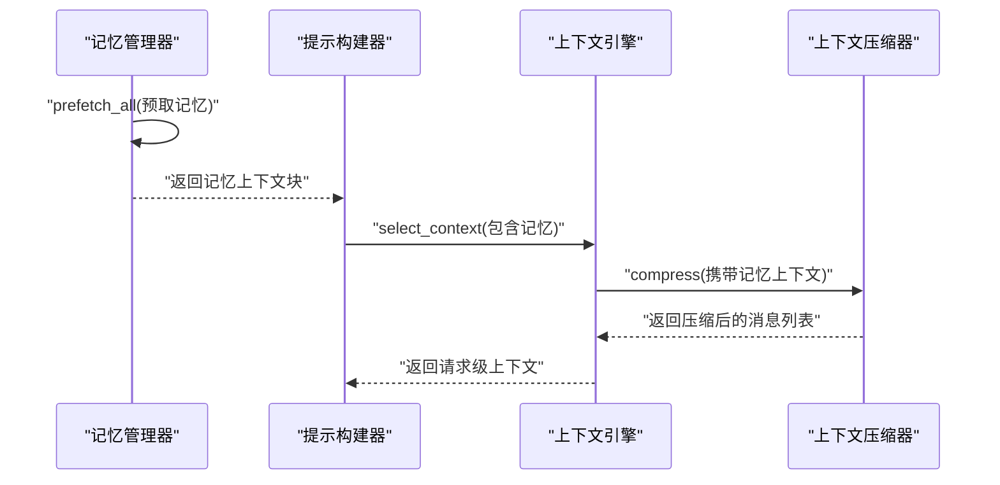
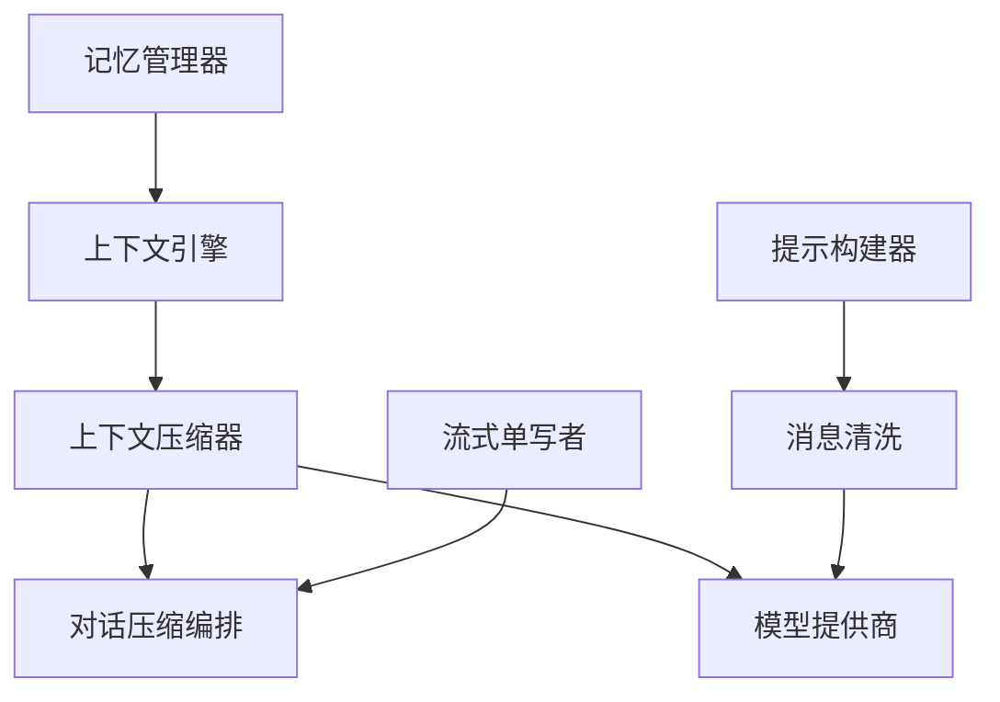

# 文本处理引擎

<cite>
**本文引用的文件**
- [agent/context_engine.py](file://agent/context_engine.py)
- [agent/context_compressor.py](file://agent/context_compressor.py)
- [agent/conversation_compression.py](file://agent/conversation_compression.py)
- [agent/prompt_builder.py](file://agent/prompt_builder.py)
- [agent/message_content.py](file://agent/message_content.py)
- [agent/message_sanitization.py](file://agent/message_sanitization.py)
- [agent/memory_manager.py](file://agent/memory_manager.py)
- [agent/stream_single_writer.py](file://agent/stream_single_writer.py)
</cite>

## 目录
1. [简介](#简介)
2. [项目结构](#项目结构)
3. [核心组件](#核心组件)
4. [架构总览](#架构总览)
5. [详细组件分析](#详细组件分析)
6. [依赖关系分析](#依赖关系分析)
7. [性能考虑](#性能考虑)
8. [故障排查指南](#故障排查指南)
9. [结论](#结论)
10. [附录](#附录)

## 简介
本文件面向 Hermes Agent 的“文本处理引擎”，围绕自然语言理解、对话管理、响应生成、文本预处理/后处理、API 集成与性能优化进行系统化说明。重点覆盖：
- 上下文分析与压缩：自动触发、主题聚焦、记忆注入与截断策略
- 多轮对话状态维护：会话边界、压缩提交围栏、并发控制与超时保护
- 响应生成：提示工程（系统提示拼装）、流式输出与格式化处理
- 文本清洗与安全：代理注入防护、非法字符修复、图像内容降级
- 模型提供商集成：统一消息规范、推理字段回显策略、工具调用参数修复
- 性能优化：缓存友好、并发池、内存管理与失败冷却
- 错误处理与重试：可观测的状态提示、退避与降级路径

## 项目结构
文本处理引擎由多个模块协作完成，职责清晰、边界明确：
- 上下文引擎抽象与默认实现：定义压缩接口、选择上下文、会话生命周期钩子
- 上下文压缩器：基于辅助模型的摘要压缩、工具结果裁剪、技能指令保留
- 对话压缩编排：调度压缩任务、超时/并发控制、提交围栏与状态上报
- 提示构建器：系统提示拼装、平台/角色提示、安全扫描与并行工具调用引导
- 消息内容与清洗：文本扁平化、代理注入拦截、JSON/字符修复、推理字段策略
- 记忆管理器：多提供者聚合、预取/同步、流式上下文清理
- 流式单写者：防止重复流写入的安全围栏

**图表来源**
- [agent/context_engine.py:89-490](file://agent/context_engine.py#L89-L490)
- [agent/context_compressor.py:1-800](file://agent/context_compressor.py#L1-L800)
- [agent/conversation_compression.py:1-800](file://agent/conversation_compression.py#L1-L800)
- [agent/prompt_builder.py:1-800](file://agent/prompt_builder.py#L1-L800)
- [agent/message_content.py:1-51](file://agent/message_content.py#L1-L51)
- [agent/message_sanitization.py:1-800](file://agent/message_sanitization.py#L1-L800)
- [agent/memory_manager.py:1-800](file://agent/memory_manager.py#L1-L800)
- [agent/stream_single_writer.py:1-71](file://agent/stream_single_writer.py#L1-L71)

**章节来源**
- [agent/context_engine.py:89-490](file://agent/context_engine.py#L89-L490)
- [agent/context_compressor.py:1-800](file://agent/context_compressor.py#L1-L800)
- [agent/conversation_compression.py:1-800](file://agent/conversation_compression.py#L1-L800)
- [agent/prompt_builder.py:1-800](file://agent/prompt_builder.py#L1-L800)
- [agent/message_content.py:1-51](file://agent/message_content.py#L1-L51)
- [agent/message_sanitization.py:1-800](file://agent/message_sanitization.py#L1-L800)
- [agent/memory_manager.py:1-800](file://agent/memory_manager.py#L1-L800)
- [agent/stream_single_writer.py:1-71](file://agent/stream_single_writer.py#L1-L71)

## 核心组件
- 上下文引擎（ContextEngine）
  - 提供统一的压缩接口、每轮上下文选择、会话生命周期钩子、工具能力暴露与状态展示
  - 支持按模型动态调整阈值、保护头部/尾部消息、可选的主动工具结果裁剪
- 上下文压缩器（ContextCompressor）
  - 使用辅助模型对中间历史进行结构化摘要，保留关键任务快照与待办事项
  - 工具结果裁剪、技能指令防丢失标记、滚动微压缩与批量压缩混合策略
  - 严格的前置输入限制与摘要失败冷却，避免反复失败导致死循环
- 对话压缩编排（Conversation Compression）
  - 负责启动探测、超时/并发控制、提交围栏（Commit Fence）、状态上报与重试
  - 将压缩过程隔离到独立线程池，保证主对话线程不被阻塞
- 提示构建器（Prompt Builder）
  - 组装系统提示、平台/角色提示、技能索引、上下文文件扫描与注入防护
  - 引导模型并行工具调用、执行纪律、验证步骤与缺失上下文处理
- 消息内容与清洗（Message Content & Sanitization）
  - 扁平化多模态消息为可见文本；修复代理注入、非法字符、JSON 参数
  - 针对不同提供商的推理字段回显策略（DeepSeek/Kimi/MiMo），确保兼容
- 记忆管理器（Memory Manager）
  - 聚合内置与外部记忆提供者，预取上下文并异步同步，流式上下文清理
  - 工具模式注册与冲突规避，后台工作队列保障不阻塞主流程
- 流式单写者（Stream Single Writer）
  - 最佳努力声明流写入权，避免重复流输出导致的 UI/传输问题

**章节来源**
- [agent/context_engine.py:89-490](file://agent/context_engine.py#L89-L490)
- [agent/context_compressor.py:1-800](file://agent/context_compressor.py#L1-L800)
- [agent/conversation_compression.py:1-800](file://agent/conversation_compression.py#L1-L800)
- [agent/prompt_builder.py:1-800](file://agent/prompt_builder.py#L1-L800)
- [agent/message_content.py:1-51](file://agent/message_content.py#L1-L51)
- [agent/message_sanitization.py:1-800](file://agent/message_sanitization.py#L1-L800)
- [agent/memory_manager.py:1-800](file://agent/memory_manager.py#L1-L800)
- [agent/stream_single_writer.py:1-71](file://agent/stream_single_writer.py#L1-L71)

## 架构总览
下图展示了从用户输入到模型响应的完整文本处理链路，包括上下文选择、压缩、提示构建、消息清洗、记忆注入与流式输出。

**图表来源**
- [agent/context_engine.py:215-279](file://agent/context_engine.py#L215-L279)
- [agent/context_compressor.py:100-180](file://agent/context_compressor.py#L100-L180)
- [agent/conversation_compression.py:445-691](file://agent/conversation_compression.py#L445-L691)
- [agent/prompt_builder.py:140-498](file://agent/prompt_builder.py#L140-L498)
- [agent/message_sanitization.py:195-294](file://agent/message_sanitization.py#L195-L294)
- [agent/memory_manager.py:525-595](file://agent/memory_manager.py#L525-L595)
- [agent/stream_single_writer.py:31-71](file://agent/stream_single_writer.py#L31-L71)

## 详细组件分析

### 上下文引擎与压缩器
- 上下文引擎
  - 定义压缩触发条件、压缩入口、每轮上下文选择、会话开始/结束/重置钩子
  - 暴露工具 schema，便于在压缩过程中调用检索/整理能力
  - 支持按模型切换更新阈值与上下文长度，保持压缩策略适配不同模型
- 上下文压缩器
  - 使用辅助模型对中间历史进行结构化摘要，保留“历史任务快照”“待办事项”等关键信息
  - 工具结果裁剪与技能指令防丢失标记，避免重要上下文被误删
  - 滚动微压缩与批量压缩结合，减少频繁 LLM 调用的开销
  - 严格的输入限制与摘要失败冷却，防止因网络/配额问题导致无限重试

**图表来源**
- [agent/context_engine.py:89-490](file://agent/context_engine.py#L89-L490)
- [agent/context_compressor.py:1-800](file://agent/context_compressor.py#L1-L800)

**章节来源**
- [agent/context_engine.py:89-490](file://agent/context_engine.py#L89-L490)
- [agent/context_compressor.py:1-800](file://agent/context_compressor.py#L1-L800)

### 对话压缩编排与提交围栏
- 编排层负责：
  - 启动时探测压缩模型可行性，必要时降低阈值或拒绝不可用配置
  - 将压缩任务投递到独立线程池，避免阻塞主对话线程
  - 使用提交围栏（CompressionCommitFence）确保会话状态变更原子性，支持取消与超时
  - 发布状态提示（如“正在压缩上下文”“压缩完成”），提升可观测性
- 并发与超时：
  - 限制最大并发数，防止所有槽位被卡住导致新请求排队
  - 进度感知超时：若摘要流有 token 产出则视为活跃，避免误杀慢模型

**图表来源**
- [agent/conversation_compression.py:445-691](file://agent/conversation_compression.py#L445-L691)
- [agent/conversation_compression.py:776-800](file://agent/conversation_compression.py#L776-L800)

**章节来源**
- [agent/conversation_compression.py:1-800](file://agent/conversation_compression.py#L1-L800)

### 提示工程与响应生成
- 提示工程
  - 系统提示拼装：身份、平台提示、技能索引、上下文文件扫描与注入防护
  - 行为引导：执行纪律、并行工具调用、验证步骤、缺失上下文处理
  - 平台适配：WhatsApp/Telegram 等平台的消息格式与媒体发送指引
- 响应生成
  - 流式输出：单写者围栏避免重复流输出，提升稳定性
  - 格式化：根据平台特性转换 Markdown/表格/媒体链接
  - 本地化：通过 i18n 资源与平台提示适配多语言场景

**图表来源**
- [agent/prompt_builder.py:140-498](file://agent/prompt_builder.py#L140-L498)
- [agent/message_sanitization.py:195-294](file://agent/message_sanitization.py#L195-L294)
- [agent/stream_single_writer.py:31-71](file://agent/stream_single_writer.py#L31-L71)

**章节来源**
- [agent/prompt_builder.py:1-800](file://agent/prompt_builder.py#L1-L800)
- [agent/message_sanitization.py:1-800](file://agent/message_sanitization.py#L1-L800)
- [agent/stream_single_writer.py:1-71](file://agent/stream_single_writer.py#L1-L71)

### 文本预处理与后处理
- 预处理
  - 代理注入防护：扫描上下文文件中的潜在注入模式，阻断危险内容
  - 非法字符修复：替换代理码点、转义 JSON 字符串中的控制字符
  - 工具调用参数修复：补全未闭合结构、去除多余逗号、降级为空对象
- 后处理
  - 推理字段回显策略：针对 DeepSeek/Kimi/MiMo 等提供商要求回显 reasoning_content
  - 图像内容降级：当服务端不支持图片时移除 image_url 部分，保持消息交替不变
  - 非 ASCII 字符剥离：在 ASCII-only 环境中作为最后手段恢复兼容性

**图表来源**
- [agent/prompt_builder.py:55-79](file://agent/prompt_builder.py#L55-L79)
- [agent/message_sanitization.py:195-294](file://agent/message_sanitization.py#L195-L294)
- [agent/message_sanitization.py:628-800](file://agent/message_sanitization.py#L628-L800)
- [agent/message_sanitization.py:401-447](file://agent/message_sanitization.py#L401-L447)

**章节来源**
- [agent/prompt_builder.py:1-800](file://agent/prompt_builder.py#L1-L800)
- [agent/message_sanitization.py:1-800](file://agent/message_sanitization.py#L1-L800)

### 记忆集成与上下文压缩
- 记忆集成
  - 预取：按查询从内置/外部提供者召回相关上下文，包装为 fenced block 注入系统提示
  - 同步：异步将本轮用户/助手内容同步至各提供者，保证顺序写入
  - 流式清理：在流式输出中过滤内部记忆上下文标签，避免泄露
- 上下文压缩
  - 记忆上下文在进入压缩边界前进行敏感信息脱敏与长度截断
  - 压缩摘要中保留“历史任务快照”“待办事项”等关键信息，避免丢失上下文

**图表来源**
- [agent/memory_manager.py:525-595](file://agent/memory_manager.py#L525-L595)
- [agent/context_engine.py:40-53](file://agent/context_engine.py#L40-L53)
- [agent/context_compressor.py:100-180](file://agent/context_compressor.py#L100-L180)

**章节来源**
- [agent/memory_manager.py:1-800](file://agent/memory_manager.py#L1-L800)
- [agent/context_engine.py:40-53](file://agent/context_engine.py#L40-L53)
- [agent/context_compressor.py:100-180](file://agent/context_compressor.py#L100-L180)

## 依赖关系分析
- 模块耦合
  - 上下文引擎是压缩器的基类，对话压缩编排驱动压缩器执行
  - 提示构建器与消息清洗共同影响发送给模型的消息质量
  - 记忆管理器为上下文引擎提供记忆上下文，压缩器在边界处进行脱敏
  - 流式单写者与对话压缩编排协同，确保流式输出的唯一性与稳定性
- 外部依赖
  - 模型提供商：通过统一消息规范与推理字段策略适配不同后端
  - 工具系统：上下文引擎可暴露工具 schema，压缩器可调用检索/整理工具
  - 存储与状态：会话数据库用于持久化压缩冷却状态与提交围栏

**图表来源**
- [agent/context_engine.py:89-490](file://agent/context_engine.py#L89-L490)
- [agent/context_compressor.py:1-800](file://agent/context_compressor.py#L1-L800)
- [agent/conversation_compression.py:1-800](file://agent/conversation_compression.py#L1-L800)
- [agent/prompt_builder.py:1-800](file://agent/prompt_builder.py#L1-L800)
- [agent/message_sanitization.py:1-800](file://agent/message_sanitization.py#L1-L800)
- [agent/memory_manager.py:1-800](file://agent/memory_manager.py#L1-L800)
- [agent/stream_single_writer.py:1-71](file://agent/stream_single_writer.py#L1-L71)

**章节来源**
- [agent/context_engine.py:89-490](file://agent/context_engine.py#L89-L490)
- [agent/context_compressor.py:1-800](file://agent/context_compressor.py#L1-L800)
- [agent/conversation_compression.py:1-800](file://agent/conversation_compression.py#L1-L800)
- [agent/prompt_builder.py:1-800](file://agent/prompt_builder.py#L1-L800)
- [agent/message_sanitization.py:1-800](file://agent/message_sanitization.py#L1-L800)
- [agent/memory_manager.py:1-800](file://agent/memory_manager.py#L1-L800)
- [agent/stream_single_writer.py:1-71](file://agent/stream_single_writer.py#L1-L71)

## 性能考虑
- 缓存机制
  - 系统提示与记忆块尽可能稳定，利于提供商的 prompt cache 命中
  - 工具调用 ID 确定性生成，避免随机 UUID 破坏缓存前缀
- 并发控制
  - 压缩任务使用独立线程池，限制最大并发数，防止资源耗尽
  - 记忆提供者异步预取与同步，避免阻塞主对话线程
- 内存管理
  - 工具结果裁剪与滚动微压缩，减少长对话的内存占用
  - 流式输出单写者围栏，避免重复流写入导致的内存抖动
- 失败冷却
  - 摘要失败冷却与反抖保护，避免频繁重试导致资源浪费
  - 进度感知超时，区分慢模型与卡死模型，提升鲁棒性

[本节为通用指导，无需具体文件引用]

## 故障排查指南
- 常见问题
  - 压缩失败：检查辅助模型可用性、配额与网络状态，查看冷却状态
  - 流式输出异常：确认单写者围栏是否生效，避免重复流写入
  - 消息解析错误：检查 JSON 参数修复与非法字符处理日志
  - 推理字段报错：确认提供商是否需要回显 reasoning_content，并按策略填充
- 定位方法
  - 查看压缩状态提示（如“正在压缩上下文”“压缩完成”）
  - 检查消息清洗日志（代理注入阻断、JSON 修复记录）
  - 监控记忆提供者超时与错误，确认预取/同步是否成功
  - 观察流式输出令牌与围栏状态，确认写入权归属

**章节来源**
- [agent/conversation_compression.py:115-180](file://agent/conversation_compression.py#L115-L180)
- [agent/message_sanitization.py:195-294](file://agent/message_sanitization.py#L195-L294)
- [agent/memory_manager.py:525-595](file://agent/memory_manager.py#L525-L595)
- [agent/stream_single_writer.py:31-71](file://agent/stream_single_writer.py#L31-L71)

## 结论
Hermes Agent 的文本处理引擎通过上下文引擎、压缩器、提示构建器、消息清洗、记忆管理与流式单写者的协同，实现了高可用、高性能、可扩展的文本处理能力。其设计强调：
- 清晰的模块边界与职责分离
- 强大的容错与降级机制
- 灵活的提示工程与多提供商适配
- 完善的性能优化与可观测性

[本节为总结性内容，无需具体文件引用]

## 附录
- API 调用示例（概念性）
  - 上下文选择：调用 select_context(request_messages, conversation_messages, incoming_message, budget_tokens) 获取请求级上下文
  - 压缩触发：调用 should_compress(prompt_tokens) 判断是否压缩，必要时调用 compress(messages, current_tokens, focus_topic, force, memory_context)
  - 记忆预取：调用 MemoryManager.prefetch_all(query, session_id) 获取记忆上下文
  - 流式输出：调用 claim_stream_writer() 获取令牌，确保唯一写入
- 最佳实践
  - 合理设置压缩阈值与保护消息数量，避免过度压缩丢失关键信息
  - 使用并行工具调用引导，减少往返次数与上下文重发成本
  - 定期审查记忆提供者性能与准确性，避免污染上下文
  - 监控流式输出与压缩状态，及时处理异常与降级

[本节为补充说明，无需具体文件引用]